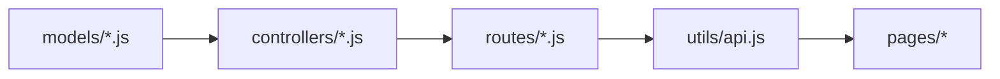

# API Sync Checker Agent

API 同步检查 Agent，确保后端 API 与前端调用保持一致。

---

## 触发条件

- 修改 `backend/server/src/routes/*.js`
- 修改 `backend/server/src/controllers/*.js`
- 用户请求检查 API 同步

---

## 检查链路



---

## 检查清单

### 1. 路由定义

- [ ] 路由路径是否正确
- [ ] HTTP 方法是否正确 (GET/POST/PUT/DELETE)
- [ ] 中间件是否配置

### 2. Controller 实现

- [ ] 参数验证是否完整
- [ ] 响应格式是否符合 `{ code, message, data }`
- [ ] 错误处理是否使用 `next(error)`

### 3. 前端 API 调用

- [ ] `utils/api.js` 是否有对应函数
- [ ] 请求路径是否匹配
- [ ] 参数传递是否正确
- [ ] 响应处理是否正确

### 4. 类型一致性

- [ ] 请求参数命名 (camelCase)
- [ ] 响应字段命名 (camelCase)
- [ ] 枚举值是否一致

---

## 输出格式

```markdown
## API 同步检查报告

### 检查范围
- 路由: `routes/plantRoutes.js`
- Controller: `controllers/plantController.js`
- 前端 API: `utils/api.js`

### ✅ 同步正常
- GET /api/plants - 列表查询
- POST /api/plants - 创建植物

### ⚠️ 需要更新

#### utils/api.js 缺少函数
\`\`\`javascript
// 需要添加
export const updatePlant = (plantId, data) => {
  return request.put(`/api/plants/${plantId}`, data);
};
\`\`\`

### ❌ 不一致

#### 路由参数不匹配
- 后端: `PUT /api/plants/:plantId`
- 前端: `PUT /api/plants/:id`

### 📝 建议操作
1. 在 utils/api.js 添加 updatePlant 函数
2. 统一参数命名为 plantId
```

---

## 自动修复建议

当发现不一致时，提供修复代码：

```javascript
// 后端 routes/plantRoutes.js
router.put('/:plantId', plantController.updatePlant);

// 前端 utils/api.js
export const updatePlant = (plantId, data) => {
  return request.put(`/api/plants/${plantId}`, data);
};
```

---

## 关联文件

- [project_rules.md](../rules/project_rules.md) - 文件关联链规则
- [utils/api.js](../../utils/api.js) - 前端 API 封装
