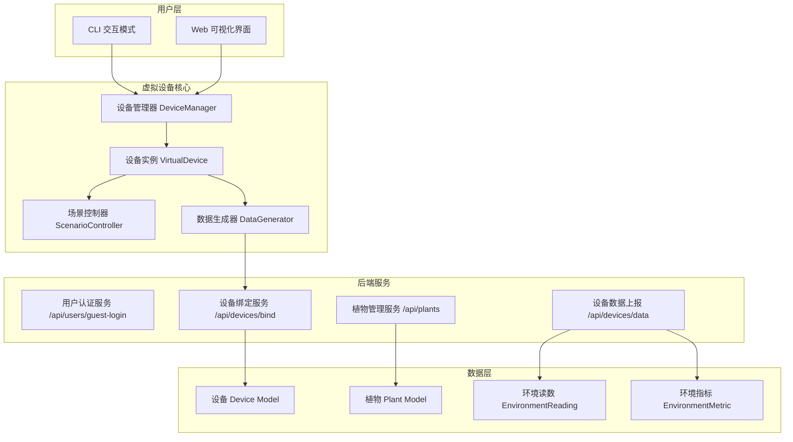
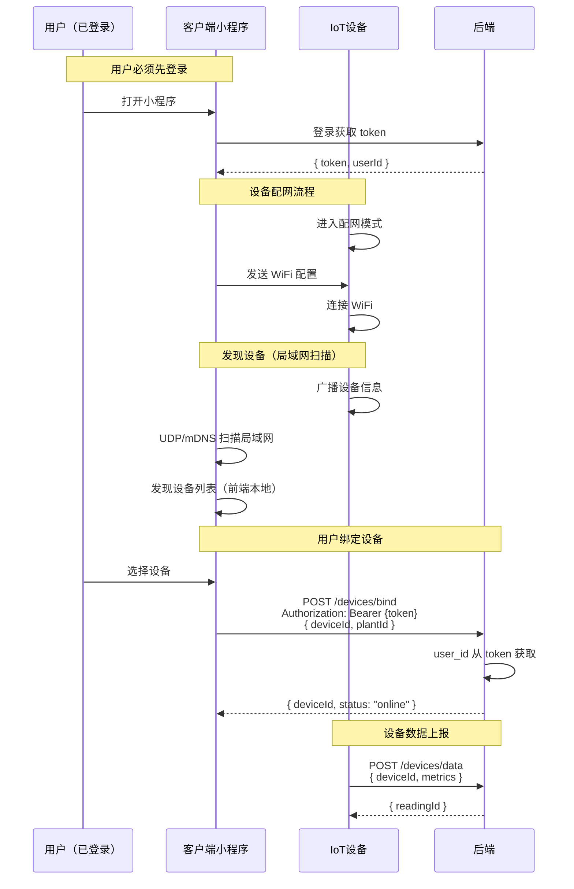
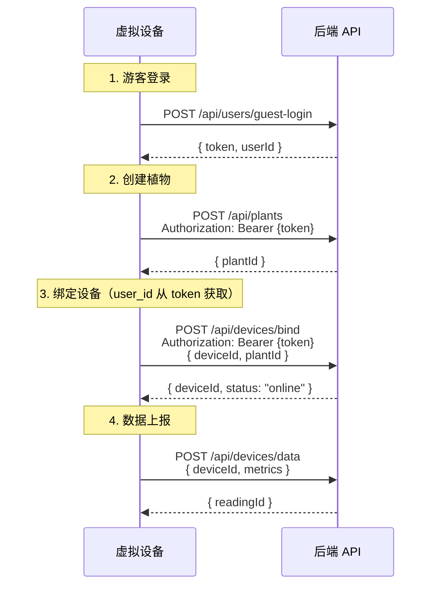
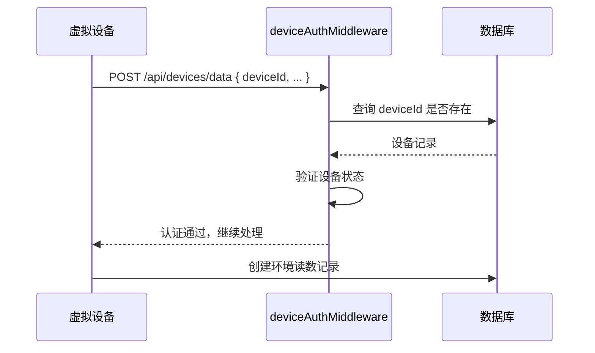
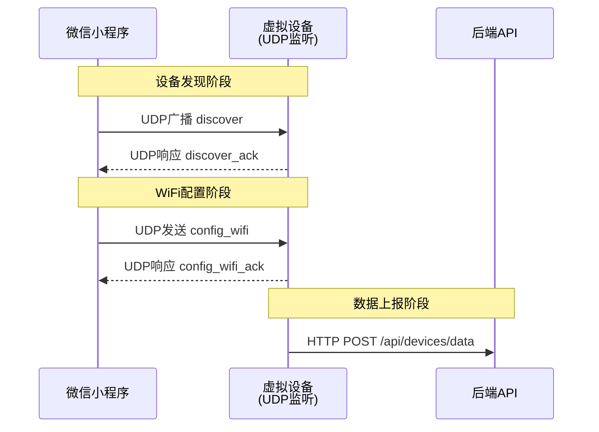
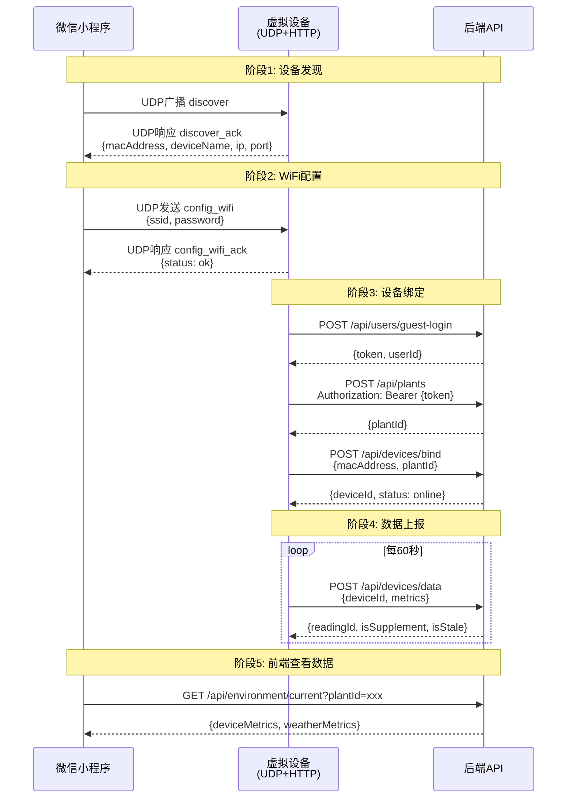

# 虚拟设备模拟器重写设计文档

## 一、概述

本文档定义新一代虚拟设备模拟器的设计理念和功能细节，用于模拟真实 IoT 设备与后端系统的交互行为。

### 1.1 设计目标

| 目标 | 描述 |
|:---|:---|
| **完整适配** | 完全适配现有后端 API 接口和认证机制 |
| **流程正确** | 正确实现设备绑定、认证、数据上报的完整流程 |
| **场景丰富** | 支持多种环境场景模拟，满足不同测试需求 |
| **可观测性** | 提供详细的运行日志和状态监控 |
| **易用性** | 支持命令行和 Web 两种交互模式 |

---

## 二、系统架构

### 2.1 整体架构



### 2.2 模块设计

| 模块 | 职责 | 关键类 |
|:---|:---|:---|
| **DeviceManager** | 管理多个设备实例的生命周期 | `create_device()`, `get_device()`, `list_devices()` |
| **VirtualDevice** | 单个设备的完整行为逻辑 | 登录、配对、数据生成、上报 |
| **ScenarioController** | 控制场景模式和数据范围 | `set_scenario()`, `get_ranges()` |
| **DataGenerator** | 生成符合场景的传感器数据 | `generate()`, `smooth_transition()` |
| **AuthService** | 处理用户认证和 Token 管理 | `login()`, `refresh_token()` |
| **StateManager** | 持久化状态管理 | `load()`, `save()`, `is_valid()` |
| **UDPService** | UDP通信服务 | `start()`, `stop()`, `handle_message()` |
| **Logger** | 日志记录 | `debug()`, `info()`, `warning()`, `error()` |

### 2.3 类接口定义

#### 2.3.1 VirtualDevice 类

```python
class VirtualDevice:
    """虚拟设备核心类"""
    
    def __init__(self, config: DeviceConfig) -> None:
        """
        初始化虚拟设备
        
        Args:
            config: 设备配置对象
        """
        self.config = config
        self.device_id: Optional[str] = None
        self.plant_id: Optional[str] = None
        self.token: Optional[str] = None
        self.running = False
        self.scenario_controller = ScenarioController()
        self.data_generator = DataGenerator()
        self.udp_service = UDPService()
        self.state_manager = StateManager()
        self.logger = Logger()
    
    def start(self) -> None:
        """
        启动虚拟设备
        
        流程：
        1. 加载持久化状态
        2. 如无效则执行配对
        3. 启动UDP监听
        4. 启动数据上报循环
        """
        pass
    
    def stop(self) -> None:
        """
        停止虚拟设备
        
        清理资源：
        1. 停止UDP监听
        2. 停止上报循环
        3. 保存当前状态
        """
        pass
    
    def pair(self) -> bool:
        """
        执行设备配对流程
        
        Returns:
            bool: 配对是否成功
            
        流程：
        1. 游客登录获取token
        2. 创建植物
        3. 绑定设备
        4. 保存状态
        """
        pass
    
    def report(self) -> ReportResult:
        """
        立即上报一次数据
        
        Returns:
            ReportResult: 上报结果
            
        Raises:
            DeviceNotFoundError: 设备不存在
            DeviceNotBoundError: 设备未绑定植物
            NetworkError: 网络错误
        """
        pass
    
    def set_scenario(self, scenario: str, smooth: bool = True) -> None:
        """
        设置场景模式
        
        Args:
            scenario: 场景名称
            smooth: 是否平滑过渡
        """
        pass
    
    def get_status(self) -> DeviceStatus:
        """
        获取设备状态
        
        Returns:
            DeviceStatus: 包含设备ID、植物ID、场景、上报次数等
        """
        pass
    
    def handle_udp_message(self, message: dict, remote_addr: tuple) -> dict:
        """
        处理UDP消息
        
        Args:
            message: 收到的消息字典
            remote_addr: 远程地址 (ip, port)
            
        Returns:
            dict: 响应消息
        """
        pass
```

#### 2.3.2 DeviceConfig 数据类

```python
from dataclasses import dataclass
from typing import Optional

@dataclass
class DeviceConfig:
    """设备配置"""
    server_url: str = "http://localhost:3000"
    udp_port: int = 8266
    interval: int = 60
    scenario: str = "normal"
    auto_pair: bool = True
    state_file: Optional[str] = None
    verbose: bool = False
    aligned: bool = False  # 是否对齐到2小时间隔
```

#### 2.3.3 ReportResult 数据类

```python
@dataclass
class ReportResult:
    """上报结果"""
    success: bool
    reading_id: Optional[str]
    timestamp: str
    is_supplement: bool
    is_stale: bool
    message: str
    error: Optional[str] = None
```

#### 2.3.4 DeviceStatus 数据类

```python
@dataclass
class DeviceStatus:
    """设备状态"""
    device_id: Optional[str]
    plant_id: Optional[str]
    mac_address: Optional[str]
    device_name: Optional[str]
    status: str  # online/offline/unbound
    scenario: str
    report_count: int
    last_report_at: Optional[str]
    current_metrics: dict
    udp_port: int
    running: bool
```

---

## 三、核心流程

### 3.1 设备绑定流程（关键修复点）

#### 3.1.1 正确的业务流程

**用户必须先登录**，设备绑定操作由用户发起，`user_id` 从 token 获取：



#### 3.1.2 设备发现机制

**重要**：设备发现是在**前端局域网扫描**完成的，不依赖后端。

| 阶段 | 说明 | 实现方式 |
|:---|:---|:---|
| **设备广播** | 设备连接 WiFi 后广播自己的信息 | UDP 广播 / mDNS |
| **前端扫描** | 小程序扫描局域网内的设备 | wx.startLocalServiceDiscovery |
| **设备列表** | 前端本地维护，不请求后端 | 前端状态管理 |

**两种设备列表**：

| 列表类型 | 数据来源 | API |
|:---|:---|:---|
| **未绑定设备列表** | 前端局域网扫描 | 无（本地扫描） |
| **已绑定设备列表** | 后端数据库 | `GET /api/devices` |

#### 3.1.3 前后端绑定逻辑分析

**权威文档定义** (`设计文档/03-API接口设计.md`)：
```json
// POST /api/devices/bind
{
  "macAddress": "string",      // 必填，设备MAC地址
  "deviceName": "string",      // 可选，设备名称
  "plantId": "string"          // 必填，植物ID
}
```

**前端代码** (`device-manage.js`) 已修复：
```javascript
api.bindDevice({
  macAddress: device.macAddress,  // ✅ 使用 macAddress
  deviceName: device.deviceName,
  plantId: plantId
})
```

**后端代码** (`DeviceService.js`) 已正确：
```javascript
// user_id 从 token 获取，不从前端参数传入
const userId = req.user.userId;
const { macAddress, deviceName, plantId } = bindData;

// 如果设备不存在，自动创建
let device = await this.findOne({ mac_address: macAddress });
if (!device) {
  device = await this.create({
    device_id: this.generateDeviceId(),
    user_id: userId,
    mac_address: macAddress,
    status: 'online',
  });
}
```

#### 3.1.4 虚拟设备应模拟的流程

虚拟设备模拟的是**用户操作流程**：



**关键点**：
1. **用户必须先登录**，获取 token
2. **绑定设备时传入 `deviceId`**（设备标识）
3. **`user_id` 从 token 获取**，不从前端参数传入
4. **设备不存在时自动创建**，归属当前用户
5. **使用返回的 `deviceId`** 进行后续的数据上报

### 3.2 数据上报认证流程



**认证要求：**
- `deviceId` 必须存在于 `devices` 表中
- 设备状态必须为 `online`（绑定后自动设置）

### 3.3 UDP通信协议（设备发现与配网）

虚拟设备需要实现UDP监听，以支持前端小程序的设备发现和WiFi配网功能。

#### 3.3.1 通信架构



#### 3.3.2 UDP消息格式

**设备发现请求（小程序 → 设备）：**
```json
{
  "cmd": "discover",
  "app": "proj-alpha",
  "timestamp": 1234567890
}
```

**设备发现响应（设备 → 小程序）：**
```json
{
  "cmd": "discover_ack",
  "macAddress": "VIRTUAL_A1B2C3D4",
  "deviceName": "proj-alpha-虚拟设备",
  "deviceType": "virtual_sensor",
  "ip": "192.168.1.100",
  "port": 8266,
  "rssi": -45,
  "firmwareVersion": "1.0.0",
  "status": "unbound",
  "timestamp": 1234567890
}
```

**WiFi配置请求（小程序 → 设备）：**
```json
{
  "cmd": "config_wifi",
  "ssid": "HomeWiFi",
  "password": "password123",
  "timestamp": 1234567890
}
```

**WiFi配置响应（设备 → 小程序）：**
```json
{
  "cmd": "config_wifi_ack",
  "status": "ok",
  "message": "配置已接收，正在连接...",
  "timestamp": 1234567890
}
```

#### 3.3.3 虚拟设备UDP实现要点

| 功能 | 实现说明 |
|:---|:---|
| **监听端口** | 默认8266，可配置 |
| **响应广播** | 监听255.255.255.255和192.168.x.255 |
| **配置处理** | 接收WiFi配置后模拟连接过程（虚拟设备实际使用HTTP） |
| **状态更新** | 配置成功后，设备状态从`unbound`变为`online` |

#### 3.3.4 虚拟设备特殊处理

由于虚拟设备不需要真正连接WiFi，收到`config_wifi`命令后：
1. 记录配置的SSID（用于显示）
2. 直接返回`config_wifi_ack`（status: ok）
3. 状态变为`online`
4. 开始定时上报数据

### 3.4 时间对齐策略

后端使用2小时间隔对齐数据（`reading_tasks`机制），虚拟设备需要配合此机制。

#### 3.4.1 时间对齐规则

```python
def align_to_interval(dt: datetime, interval_hours: int = 2) -> datetime:
    """对齐到指定时间间隔"""
    aligned = dt.replace(minute=0, second=0, microsecond=0)
    aligned = aligned.replace(hour=(aligned.hour // interval_hours) * interval_hours)
    return aligned

# 示例
# 当前时间: 2024-01-15 14:32:15
# 对齐后:   2024-01-15 14:00:00

# 当前时间: 2024-01-15 15:45:20
# 对齐后:   2024-01-15 14:00:00
```

#### 3.4.2 上报策略

| 策略 | 说明 | 适用场景 |
|:---|:---|:---|
| **严格对齐** | 只在2小时间隔的整点时刻上报 | 测试`ReadingTask`状态流转 |
| **实时上报** | 使用当前时间，让后端处理对齐 | 模拟真实设备行为 |
| **混合模式** | 大部分实时上报，偶尔补传历史数据 | 测试补偿机制 |

**建议**：默认使用**实时上报**，但提供`--aligned`参数启用严格对齐模式。

#### 3.4.3 补偿数据测试

虚拟设备可以模拟离线后补传数据的场景：

```python
# 模拟离线期间的数据缺失
# 然后以isSupplement=true补传
{
  "deviceId": "DEVICE_xxx",
  "timestamp": "2024-01-15T12:00:00Z",  # 2小时前的数据
  "isSupplement": true,
  "metrics": { ... }
}
```

---

## 四、数据模型映射

### 4.1 设备模型（Device）

| 字段 | 类型 | 说明 |
|:---|:---|:---|
| `device_id` | String(64) | 主键，格式：`DEVICE_` + 16位随机字符 |
| `user_id` | String(64) | 所属用户 ID（绑定时从 token 获取） |
| `mac_address` | String(32) | MAC 地址，唯一约束 |
| `device_name` | String(100) | 设备名称 |
| `status` | Enum | `online` / `offline` / `unbound` |
| `battery_level` | Integer | 电池电量 0-100 |
| `last_heartbeat` | DateTime | 最后心跳时间 |

**注意**：`bound_plant_id` 字段已移除，植物与设备的关联通过 `Plant.current_device_id` 单向维护。

### 4.2 环境指标（EnvironmentMetric）

必须使用正确的 `metric_code`：

| metric_code | 中文名 | 单位 | 正常范围 | 数据来源 |
|:---|:---|:---|:---|:---|
| `temperature` | 空气温度 | °C | 15 ~ 30 | sensor |
| `humidity` | 空气湿度 | % | 30 ~ 80 | sensor |
| `pressure` | 大气压强 | hPa | 800 ~ 1100 | sensor |
| `light_intensity` | 光照强度 | lux | 1000 ~ 50000 | sensor |
| `soil_moisture` | 土壤湿度 | % | 20 ~ 70 | sensor |
| `soil_temperature` | 土壤温度 | °C | 15 ~ 28 | sensor |
| `soil_ph` | 土壤酸碱度 | pH | 3.0 ~ 9.0 | sensor |
| `battery_level` | 电池电量 | % | 0 ~ 100 | sensor |

**注意**：天气API专用指标（feels_like, weather_condition, wind_direction_360, wind_scale, wind_speed, precip, visibility, cloud_cover, dew_point）不在虚拟设备模拟范围内，由后端天气服务提供。

### 4.3 数据上报请求格式

```javascript
{
  deviceId: "DEVICE_abc123def456",  // 后端返回的真实 deviceId
  plantId: "PLANT_xxx",              // 绑定的植物 ID（可选，后端会从设备获取）
  timestamp: "2024-01-01T12:00:00Z", // ISO 格式时间戳
  isSupplement: false,               // 是否为补偿数据（可选，默认 false）
  metrics: {
    temperature: 25.5,
    humidity: 60.0,
    pressure: 1013.25,
    light_intensity: 15000,
    soil_moisture: 45.0,
    soil_temperature: 22.0,
    soil_ph: 6.5,
    battery_level: 95
  }
}
```

**参数说明：**

| 字段 | 类型 | 必填 | 说明 |
|:---|:---|:---|:---|
| `deviceId` | String | ✅ | 设备唯一标识，绑定设备时后端返回 |
| `plantId` | String | ❌ | 植物ID，可选。如未提供，后端会根据设备绑定的植物自动获取 |
| `timestamp` | String | ❌ | ISO 8601 格式时间戳，默认使用当前时间 |
| `isSupplement` | Boolean | ❌ | 是否为补偿数据（离线后补发的数据），默认 `false` |
| `metrics` | Object | ✅ | 传感器数据，见下表 |

**metrics 字段说明：**

| 字段 | 类型 | 单位 | 说明 |
|:---|:---|:---|:---|
| `temperature` | Number | °C | 空气温度 |
| `humidity` | Number | % | 空气湿度 |
| `pressure` | Number | hPa | 大气压强 |
| `light_intensity` | Number | lux | 光照强度 |
| `soil_moisture` | Number | % | 土壤湿度 |
| `soil_temperature` | Number | °C | 土壤温度 |
| `soil_ph` | Number | pH | 土壤酸碱度 |
| `battery_level` | Number | % | 电池电量（会更新设备表的 battery_level）|

---

## 五、场景模式设计

### 5.1 场景枚举

```javascript
const DeviceScenario = {
  NORMAL: "normal",           // 正常环境
  DROUGHT: "drought",         // 干旱模式
  HIGH_TEMP: "high_temp",     // 高温模式
  LOW_TEMP: "low_temp",        // 低温模式
  HIGH_HUMIDITY: "high_hum",  // 高湿模式
  LOW_LIGHT: "low_light",     // 光照不足
  WATERING: "watering",        // 浇水模式
  NIGHT: "night"              // 夜间模式
};
```

### 5.2 各场景数据范围

| 场景 | 温度 (°C) | 湿度 (%) | 气压 (hPa) | 光照 (lux) | 土壤湿度 (%) | 土壤温度 (°C) | 土壤 pH |
|:---|:---|:---|:---|:---|:---|:---|:---|
| **normal** | 18~32 | 30~80 | 990~1030 | 1000~50000 | 20~70 | 15~28 | 5.5~7.5 |
| **drought** | 25~38 | 10~30 | 990~1030 | 5000~60000 | **5~15** | 20~35 | 5.0~8.0 |
| **high_temp** | **35~45** | 20~50 | 980~1020 | 20000~80000 | 10~30 | 28~40 | 5.5~7.5 |
| **low_temp** | **5~15** | 40~90 | 1000~1050 | 1000~30000 | 30~60 | 8~18 | 5.5~7.5 |
| **high_hum** | 20~30 | **80~98** | 990~1030 | 2000~40000 | 50~80 | 18~26 | 5.5~7.5 |
| **low_light** | 18~25 | 40~70 | 990~1030 | **100~2000** | 25~55 | 16~24 | 5.5~7.5 |
| **watering** | 20~28 | 50~85 | 990~1030 | 3000~50000 | **60~90** | 17~25 | 5.5~7.5 |
| **night** | 15~22 | 50~90 | 1000~1040 | **0~50** | 25~60 | 14~20 | 5.5~7.5 |

**说明**：
- `pressure`（大气压强）：变化较缓慢，一般不受场景影响，模拟时每次变化±1hPa
- `soil_ph`（土壤酸碱度）：极慢变化，正常情况下固定在6.5左右，土壤退化时可能升至8.0

### 5.3 动态变化逻辑

```python
def generate_metric_value(metric, current_value, scenario, ranges):
    """生成单个指标值"""

    # 浇水模式：土壤湿度持续上升
    if scenario == WATERING and metric == "soil_moisture":
        change_percent = random.uniform(0.02, 0.08)  # +2% ~ +8%

    # 干旱模式：土壤湿度持续下降
    elif scenario == DROUGHT and metric == "soil_moisture":
        change_percent = random.uniform(-0.05, -0.01)  # -5% ~ -1%

    # 夜间模式：光照接近零
    elif scenario == NIGHT and metric == "light_intensity":
        return random.uniform(0, 50)

    # 大气压强：极缓慢变化（±1hPa）
    elif metric == "pressure":
        change = random.uniform(-1, 1)
        new_value = current_value + change
        return clamp(new_value, ranges[0], ranges[1])

    # 土壤pH值：极慢变化（正常情况几乎不变）
    elif metric == "soil_ph":
        # 正常情况变化极小
        change = random.uniform(-0.01, 0.01)
        new_value = current_value + change
        return clamp(new_value, ranges[0], ranges[1])

    # 正常模式：随机波动
    else:
        change_percent = random.uniform(-0.03, 0.03)  # ±3%

    # 应用变化并限制在范围内
    new_value = current_value * (1 + change_percent)
    return clamp(new_value, ranges[0], ranges[1])
```

### 5.4 场景切换过渡

场景切换时，数据应该平滑过渡，避免突变。

#### 5.4.1 过渡策略

```python
class ScenarioController:
    def __init__(self):
        self.current_scenario = "normal"
        self.target_scenario = None
        self.transition_progress = 0  # 0 ~ 100
        self.transition_steps = 10    # 10次上报完成过渡
        self.current_step = 0
    
    def switch_scenario(self, new_scenario):
        """切换到新场景"""
        self.target_scenario = new_scenario
        self.transition_progress = 0
        self.current_step = 0
    
    def get_current_ranges(self):
        """获取当前数据范围（支持过渡）"""
        if not self.target_scenario or self.target_scenario == self.current_scenario:
            return SCENARIO_RANGES[self.current_scenario]
        
        # 过渡中：插值计算
        current_ranges = SCENARIO_RANGES[self.current_scenario]
        target_ranges = SCENARIO_RANGES[self.target_scenario]
        
        progress = self.current_step / self.transition_steps
        
        blended_ranges = {}
        for metric, (min_val, max_val) in current_ranges.items():
            target_min, target_max = target_ranges[metric]
            blended_min = min_val + (target_min - min_val) * progress
            blended_max = max_val + (target_max - max_val) * progress
            blended_ranges[metric] = (blended_min, blended_max)
        
        # 更新过渡进度
        self.current_step += 1
        if self.current_step >= self.transition_steps:
            self.current_scenario = self.target_scenario
            self.target_scenario = None
        
        return blended_ranges
```

#### 5.4.2 过渡示例

```
当前场景: normal (温度 18~32°C)
目标场景: high_temp (温度 35~45°C)

过渡过程:
上报 #1: 温度范围 18~32°C (进度 0%)
上报 #2: 温度范围 19.7~33.3°C (进度 10%)
上报 #3: 温度范围 21.4~34.6°C (进度 20%)
...
上报 #10: 温度范围 35~45°C (进度 100%, 切换完成)
```

---

## 六、CLI 交互设计

### 6.1 命令行参数

```bash
# 基本用法
python virtual_device.py --server-url http://localhost:3000

# 指定场景模式
python virtual_device.py --scenario drought

# 指定植物和设备
python virtual_device.py --device-id DEVICE_xxx --plant-id PLANT_xxx

# 修改上报间隔
python virtual_device.py --interval 30

# 禁用自动配对
python virtual_device.py --no-auto-pair

# 查看帮助
python virtual_device.py --help
```

### 6.2 运行时交互命令

```
> help
可用命令：
  status    - 显示设备状态
  scenario  - 切换场景模式
  interval  - 修改上报间隔
  report    - 立即上报一次数据
  unbind    - 解绑设备
  devices   - 查看设备列表
  help      - 显示帮助
  quit/exit - 退出模拟器

> status
📊 设备状态
━━━━━━━━━━━━━━━━━━━━━━━━━━━━━━━━
设备ID: DEVICE_abc123def456
植物ID: PLANT_xxx
当前场景: drought (干旱模式)
上报间隔: 60 秒
运行状态: 🟢 运行中
━━━━━━━━━━━━━━━━━━━━━━━━━━━━━━━━
当前传感器数据:
  temperature      :  32.50 °C
  humidity        :  18.50 %
  pressure        : 1013.25 hPa
  light_intensity : 12500.00 lux
  soil_moisture   :  12.30 %
  soil_temperature :  22.00 °C
  soil_ph         :   6.50 pH
━━━━━━━━━━━━━━━━━━━━━━━━━━━━━━━━

> scenario
可用场景:
  👉 1. normal      - 正常环境
     2. drought    - 干旱（土壤湿度低）
     3. high_temp  - 高温
     ...

选择场景 (1-8 或名称): 3
🔄 场景切换: normal -> high_temp
   新场景数据范围:
     temperature: 35 ~ 45°C
     humidity: 20 ~ 50%
     pressure: 980 ~ 1020 hPa
     light_intensity: 20000 ~ 80000 lux
     soil_moisture: 10 ~ 30%
     soil_temperature: 28 ~ 40°C
     soil_ph: 5.5 ~ 7.5
```

---

## 七、Web 可视化界面设计

### 7.1 页面布局

```
┌─────────────────────────────────────────────────────────────┐
│                    🌱 虚拟设备监控中心                        │
├─────────────────┬─────────────────┬─────────────────────────┤
│   ⚙️ 设备控制    │   📊 实时数据    │    🎭 场景选择           │
│   ───────────   │   ───────────   │    ─────────────        │
│   [服务器地址]   │   温度: 32.5°C  │    [○] 正常             │
│   [设备ID]      │   湿度: 18.5%   │    [●] 干旱             │
│   [植物ID]      │   气压: 1013hPa │    [○] 高温             │
│   [上报间隔]    │   光照: 12500   │    [○] 低温             │
│   [启动设备]    │   土壤湿度: 12.3%│    [○] 高湿             │
│                 │   土壤温度: 22°C│    [○] 光照不足         │
│                 │   土壤pH: 6.5   │    [○] 浇水             │
│                 │   电池: 95%     │    [○] 夜间             │
├─────────────────┴─────────────────┴─────────────────────────┤
│   📱 设备信息                              📝 运行日志        │
│   ─────────────────────                 ──────────────────── │
│   设备ID: DEVICE_xxx                   [12:00:01] 上报成功  │
│   植物ID: PLANT_xxx                     ...                  │
│   上报次数: 10                          ...                  │
└─────────────────────────────────────────────────────────────┘
```

### 7.2 API 端点

| 端点 | 方法 | 说明 |
|:---|:---|:---|
| `/api/status` | GET | 获取设备运行状态 |
| `/api/history` | GET | 获取历史数据 |
| `/api/start` | POST | 启动设备 |
| `/api/stop` | POST | 停止设备 |
| `/api/scenario` | POST | 切换场景 |
| `/api/interval` | POST | 修改上报间隔 |
| `/api/report` | POST | 手动触发上报 |

---

## 八、错误处理

### 8.1 常见错误及解决方案

| 错误 | 原因 | 解决方案 |
|:---|:---|:---|
| `设备不存在` (404) | 使用了错误的 deviceId | 必须使用绑定后返回的 deviceId |
| `设备未绑定植物` (400) | 设备未绑定植物 | 绑定时传入 plantId |
| `认证失败` | Token 过期 | 重新调用 guest-login |
| `MAC 地址已存在` | 重复绑定 | 使用新的 MAC 地址或先解绑 |

### 8.2 重试机制

```python
async def report_data_with_retry(payload, max_retries=3, backoff=1):
    """带重试的数据上报"""
    for attempt in range(max_retries):
        try:
            response = requests.post(
                f"{server_url}/api/devices/data",
                json=payload,
                timeout=10
            )

            if response.status_code == 200:
                return response.json()

            if response.status_code == 404:
                raise DeviceNotFoundError()

            if response.status_code == 400:
                raise DeviceNotBoundError()

        except requests.exceptions.RequestException as e:
            if attempt < max_retries - 1:
                await asyncio.sleep(backoff * (attempt + 1))
                continue
            raise
```

---

## 九、配置设计

### 9.1 配置文件结构

```yaml
# config.yaml
server:
  url: "http://localhost:3000"
  timeout: 10
  retry:
    max_attempts: 3
    backoff_seconds: 1

device:
  auto_pair: true
  default_interval: 60
  default_scenario: "normal"

  # 数据范围配置
  ranges:
    normal:
      temperature: [18, 32]
      humidity: [30, 80]
      pressure: [990, 1030]
      light_intensity: [1000, 50000]
      soil_moisture: [20, 70]
      soil_temperature: [15, 28]
      soil_ph: [5.5, 7.5]

    drought:
      temperature: [25, 38]
      humidity: [10, 30]
      pressure: [990, 1030]
      light_intensity: [5000, 60000]
      soil_moisture: [5, 15]
      soil_temperature: [20, 35]
      soil_ph: [5.0, 8.0]

logging:
  level: "info"
  format: "[{timestamp}] {level} {message}"
  file: "virtual_device.log"
```

### 9.2 持久化状态存储

虚拟设备需要持久化存储配对状态，避免每次重启都重新创建植物和设备。

#### 9.2.1 存储位置

| 平台 | 存储路径 |
|:---|:---|
| Windows | `%USERPROFILE%\.proj-alpha\virtual_device.json` |
| macOS/Linux | `~/.proj-alpha/virtual_device.json` |

#### 9.2.2 存储格式

```json
{
  "version": "2.0",
  "server_url": "http://localhost:3000",
  "device": {
    "device_id": "DEVICE_abc123def456789",
    "mac_address": "VIRTUAL_A1B2C3D4E5F6",
    "device_name": "proj-alpha-虚拟设备",
    "status": "online"
  },
  "plant": {
    "plant_id": "PLANT_xyz789abc123",
    "nickname": "虚拟设备测试植物",
    "species": "虎皮兰"
  },
  "auth": {
    "token": "eyJhbGciOiJIUzI1NiIs...",
    "expires_at": "2024-01-08T12:00:00Z",
    "user_id": "USER_xxx"
  },
  "config": {
    "scenario": "normal",
    "interval": 60,
    "udp_port": 8266,
    "configured_wifi": "HomeWiFi"
  },
  "state": {
    "current_metrics": {
      "temperature": 25.5,
      "humidity": 60.0,
      "pressure": 1013.25,
      "light_intensity": 15000,
      "soil_moisture": 45.0,
      "soil_temperature": 22.0,
      "soil_ph": 6.5,
      "battery_level": 95
    },
    "report_count": 42,
    "last_report_at": "2024-01-01T12:00:00Z"
  }
}
```

#### 9.2.3 加载策略

```python
class StateManager:
    def __init__(self, state_file):
        self.state_file = state_file
        self.state = self.load()
    
    def load(self):
        """加载持久化状态"""
        if os.path.exists(self.state_file):
            with open(self.state_file, 'r') as f:
                return json.load(f)
        return None
    
    def save(self, state):
        """保存状态到文件"""
        os.makedirs(os.path.dirname(self.state_file), exist_ok=True)
        with open(self.state_file, 'w') as f:
            json.dump(state, f, indent=2)
    
    def is_valid(self):
        """检查状态是否有效"""
        if not self.state:
            return False
        
        # 检查token是否过期
        expires_at = self.state.get('auth', {}).get('expires_at')
        if expires_at:
            return datetime.fromisoformat(expires_at) > datetime.now()
        
        return True
```

#### 9.2.4 启动流程

```
启动虚拟设备
    ↓
检查是否存在有效状态文件
    ↓
是 → 加载状态，跳过配对流程
    ↓
否 → 执行自动配对流程
    ↓
保存新状态到文件
```

#### 9.2.5 命令行控制

```bash
# 使用已保存的状态启动
python virtual_device.py

# 强制重新配对（忽略状态文件）
python virtual_device.py --reset

# 指定状态文件路径
python virtual_device.py --state-file /path/to/custom/state.json

# 查看当前状态
python virtual_device.py --show-state
```

---

## 十、测试用例设计

### 10.1 功能测试

| 测试场景 | 预期结果 |
|:---|:---|
| 正常启动并绑定 | 设备成功绑定，获取有效 deviceId |
| 场景切换 | 数据范围平滑过渡到新场景 |
| 长时间运行 | 数据持续上报，无内存泄漏 |
| 网络断开重连 | 自动重试，恢复上报 |

### 10.2 边界测试

| 测试场景 | 预期结果 |
|:---|:---|
| 使用错误的 deviceId 上报 | 返回 404 错误 |
| 设备未绑定植物上报 | 返回 400 错误 |
| 上报间隔设置为 < 5 秒 | 拒绝设置，返回错误 |
| 切换到不存在的场景 | 拒绝切换，返回错误 |

---

## 十一、部署建议

### 11.1 依赖

```txt
requests>=2.28.0
pyyaml>=6.0
```

### 11.2 启动方式

```bash
# CLI 模式
python virtual_device.py --scenario drought

# Web 模式
python web_interface.py --port 8080
```

### 11.3 与前端联调指南

完整的端到端测试流程，验证虚拟设备与小程序设备页的协同工作。

#### 11.3.1 测试环境准备

```bash
# 1. 启动后端服务
cd backend/server
npm run dev

# 2. 启动虚拟设备（带UDP监听）
cd _dev/tools/python
python virtual_device.py --udp-port 8266

# 3. 启动小程序开发者工具
# 打开项目，进入设备管理页面
```

#### 11.3.2 联调测试流程



#### 11.3.3 测试检查清单

| 步骤 | 操作 | 预期结果 | 检查点 |
|:---|:---|:---|:---|
| 1 | 点击"扫描设备" | 发现虚拟设备 | 设备名称、MAC地址、IP显示正确 |
| 2 | 选择设备 | 设备高亮选中 | `selectedDeviceId` 正确设置 |
| 3 | 输入WiFi信息 | 表单验证通过 | SSID非空校验 |
| 4 | 点击"发送配置" | 配置成功提示 | 虚拟设备UDP响应正确 |
| 5 | 点击"绑定设备" | 绑定成功 | 后端返回deviceId |
| 6 | 查看当前设备 | 显示绑定设备 | 设备状态为"在线" |
| 7 | 等待60秒 | 数据自动刷新 | 环境数据更新 |
| 8 | 查看环境数据 | 显示传感器数据 | 温度、湿度等数值合理 |

#### 11.3.4 常见问题排查

**问题1：扫描不到设备**
- 检查虚拟设备UDP监听是否启动
- 检查防火墙是否拦截UDP端口
- 确认手机和电脑在同一局域网

**问题2：配置发送失败**
- 检查虚拟设备是否正确接收UDP消息
- 查看虚拟设备日志输出
- 确认端口8266未被占用

**问题3：绑定失败**
- 检查后端服务是否正常运行
- 查看后端日志错误信息
- 确认MAC地址格式正确

**问题4：数据不上报**
- 检查虚拟设备是否完成配对流程
- 查看虚拟设备日志中的上报记录
- 检查后端设备状态是否为online

#### 11.3.5 调试技巧

```bash
# 虚拟设备详细日志模式
python virtual_device.py -v

# 查看UDP通信详情
python virtual_device.py --udp-debug

# 手动触发一次上报
python virtual_device.py --report-once

# 模拟离线后补传
python virtual_device.py --simulate-offline 300  # 离线5分钟后补传
```

### 11.4 日志规范

#### 11.4.1 日志级别定义

| 级别 | 使用场景 | 输出示例 |
|:---|:---|:---|
| **DEBUG** | 详细的调试信息，包括UDP消息内容、HTTP请求体 | `[DEBUG] UDP接收: {"cmd": "discover", ...}` |
| **INFO** | 主要流程节点，正常运行的关键信息 | `[INFO] 配对成功，设备ID: DEVICE_xxx` |
| **WARNING** | 异常情况但可恢复，需要关注 | `[WARN] 上报失败，2秒后重试 (1/3)` |
| **ERROR** | 严重错误，需要人工干预 | `[ERROR] 设备不存在，停止上报` |

#### 11.4.2 日志格式

```
[2024-01-15 14:32:15] [INFO] [VirtualDevice] 设备启动成功
[2024-01-15 14:32:15] [INFO] [StateManager] 加载状态文件: ~/.proj-alpha/virtual_device.json
[2024-01-15 14:32:16] [INFO] [AuthService] 游客登录成功，用户ID: USER_abc123
[2024-01-15 14:32:16] [INFO] [VirtualDevice] 配对完成，设备ID: DEVICE_xyz789
[2024-01-15 14:32:16] [INFO] [UDPService] UDP监听启动，端口: 8266
[2024-01-15 14:32:16] [DEBUG] [UDPService] 收到消息来自 192.168.1.100:54321: {"cmd": "discover", ...}
[2024-01-15 14:32:16] [DEBUG] [UDPService] 发送响应: {"cmd": "discover_ack", ...}
[2024-01-15 14:33:16] [INFO] [Reporter] 上报成功 #1，读数ID: READ_abc123
[2024-01-15 14:33:16] [DEBUG] [Reporter] 上报数据: {"temperature": 25.5, "humidity": 60, ...}
```

#### 11.4.3 日志配置

```python
# logging_config.py
import logging
import sys
from datetime import datetime

class ColoredFormatter(logging.Formatter):
    """带颜色的日志格式化器"""
    
    COLORS = {
        'DEBUG': '\033[36m',     # 青色
        'INFO': '\033[32m',      # 绿色
        'WARNING': '\033[33m',   # 黄色
        'ERROR': '\033[31m',     # 红色
        'CRITICAL': '\033[35m',  # 紫色
    }
    RESET = '\033[0m'
    
    def format(self, record):
        log_color = self.COLORS.get(record.levelname, self.RESET)
        record.levelname = f"{log_color}{record.levelname}{self.RESET}"
        return super().format(record)

def setup_logging(level=logging.INFO, use_color=True):
    """配置日志"""
    handler = logging.StreamHandler(sys.stdout)
    
    if use_color:
        formatter = ColoredFormatter(
            '[%(asctime)s] [%(levelname)s] [%(name)s] %(message)s',
            datefmt='%Y-%m-%d %H:%M:%S'
        )
    else:
        formatter = logging.Formatter(
            '[%(asctime)s] [%(levelname)s] [%(name)s] %(message)s',
            datefmt='%Y-%m-%d %H:%M:%S'
        )
    
    handler.setFormatter(formatter)
    
    logger = logging.getLogger('virtual_device')
    logger.setLevel(level)
    logger.addHandler(handler)
    
    return logger
```

#### 11.4.4 监控指标

| 指标 | 说明 | 计算方式 |
|:---|:---|:---|
| `report_success_rate` | 上报成功率 | 成功次数 / 总次数 × 100% |
| `avg_report_latency` | 平均上报延迟 | 总延迟 / 成功次数 |
| `scenario_duration` | 当前场景运行时长 | 当前时间 - 场景切换时间 |
| `battery_level` | 电池电量 | 模拟值，缓慢下降 |
| `udp_message_count` | UDP消息计数 | 接收消息总数 |
| `last_error` | 最后错误信息 | 最近一次错误详情 |

#### 11.4.5 日志文件轮转

```python
from logging.handlers import RotatingFileHandler

# 配置文件日志（最大10MB，保留5个备份）
file_handler = RotatingFileHandler(
    'virtual_device.log',
    maxBytes=10*1024*1024,  # 10MB
    backupCount=5,
    encoding='utf-8'
)
file_handler.setFormatter(logging.Formatter(
    '[%(asctime)s] [%(levelname)s] [%(name)s] %(message)s'
))
logger.addHandler(file_handler)
```

### 11.5 故障恢复策略

#### 11.5.1 重试机制

```python
import time
from functools import wraps

def retry_with_backoff(max_retries=3, backoff_factor=1, max_wait=60):
    """
    指数退避重试装饰器
    
    Args:
        max_retries: 最大重试次数
        backoff_factor: 退避因子
        max_wait: 最大等待时间（秒）
    """
    def decorator(func):
        @wraps(func)
        def wrapper(*args, **kwargs):
            for attempt in range(max_retries):
                try:
                    return func(*args, **kwargs)
                except Exception as e:
                    if attempt == max_retries - 1:
                        raise
                    
                    wait_time = min(
                        backoff_factor * (2 ** attempt),
                        max_wait
                    )
                    logger.warning(f"{func.__name__} 失败，{wait_time}秒后重试 ({attempt + 1}/{max_retries}): {e}")
                    time.sleep(wait_time)
            
        return wrapper
    return decorator

# 使用示例
@retry_with_backoff(max_retries=5, backoff_factor=2)
def report_data(payload):
    """上报数据（带重试）"""
    response = requests.post(f"{server_url}/api/devices/data", json=payload)
    response.raise_for_status()
    return response.json()
```

#### 11.5.2 故障类型与恢复策略

| 故障类型 | 检测方式 | 恢复策略 |
|:---|:---|:---|
| **后端API不可用** | HTTP 5xx 或超时 | 指数退避重试，最大间隔60秒 |
| **Token过期** | HTTP 401 | 自动重新登录，更新token |
| **设备不存在** | HTTP 404 | 停止上报，提示用户检查deviceId |
| **设备未绑定植物** | HTTP 400 | 尝试自动绑定，失败则停止 |
| **UDP端口被占用** | socket绑定失败 | 尝试备用端口（8267, 8268, 8269） |
| **网络断开** | 连接超时 | 缓存数据，网络恢复后补传 |

#### 11.5.3 故障恢复流程

```
上报失败
    ↓
识别错误类型
    ↓
可恢复错误? ──否──→ 记录错误，停止上报
    ↓是
执行恢复策略
    ↓
恢复成功? ──否──→ 指数退避重试
    ↓是
继续正常上报
```

#### 11.5.4 健康检查

```python
class HealthChecker:
    """健康检查器"""
    
    def __init__(self):
        self.checks = []
        self.healthy = True
    
    def add_check(self, name, check_func):
        """添加检查项"""
        self.checks.append((name, check_func))
    
    def check_all(self):
        """执行所有健康检查"""
        results = {}
        for name, check_func in self.checks:
            try:
                results[name] = check_func()
            except Exception as e:
                results[name] = False
                logger.error(f"健康检查失败 [{name}]: {e}")
        
        self.healthy = all(results.values())
        return results

# 使用示例
health_checker = HealthChecker()
health_checker.add_check("api", lambda: check_api_health())
health_checker.add_check("udp", lambda: check_udp_port())
health_checker.add_check("token", lambda: check_token_valid())

# 定时健康检查
while running:
    results = health_checker.check_all()
    if not health_checker.healthy:
        logger.warning(f"健康检查未通过: {results}")
    time.sleep(60)
```

### 11.6 运行时配置更新

#### 11.6.1 交互式命令

```
> help
可用命令：
  status              显示设备状态
  scenario <name>     切换场景模式
  interval <seconds>  修改上报间隔
  report              立即上报一次
  config              显示当前配置
  reload              重新加载配置文件
  reset               重置设备（重新配对）
  quit/exit           退出模拟器

> status
📊 设备状态
━━━━━━━━━━━━━━━━━━━━━━━━━━━━━━━━
设备ID:   DEVICE_abc123def456
植物ID:   PLANT_xyz789abc
场景:     normal
上报间隔: 60秒
运行状态: 🟢 运行中
上报次数: 42
━━━━━━━━━━━━━━━━━━━━━━━━━━━━━━━━
当前数据:
  🌡️ 温度: 25.5°C
  💧 湿度: 60%
  ☀️ 光照: 15000 lux
  🌱 土壤湿度: 45%
  🔋 电量: 95%

> scenario drought
🔄 场景切换: normal -> drought
   新场景数据范围:
     温度: 25~38°C
     湿度: 10~30%
     土壤湿度: 5~15%
   过渡将在10次上报内完成

> interval 30
✅ 上报间隔已更新: 60秒 -> 30秒
```

#### 11.6.2 配置文件热重载

```python
import signal
import os

class ConfigReloader:
    """配置热重载器"""
    
    def __init__(self, config_file, reload_callback):
        self.config_file = config_file
        self.reload_callback = reload_callback
        self.last_mtime = os.path.getmtime(config_file)
        
        # 注册信号处理器
        signal.signal(signal.SIGHUP, self._handle_sighup)
    
    def _handle_sighup(self, signum, frame):
        """处理SIGHUP信号（重新加载配置）"""
        logger.info("收到SIGHUP信号，重新加载配置")
        self.reload()
    
    def check_and_reload(self):
        """检查文件变化并重新加载"""
        current_mtime = os.path.getmtime(self.config_file)
        if current_mtime > self.last_mtime:
            logger.info(f"配置文件已修改，重新加载")
            self.reload()
            self.last_mtime = current_mtime
    
    def reload(self):
        """重新加载配置"""
        try:
            new_config = load_config(self.config_file)
            self.reload_callback(new_config)
            logger.info("配置重新加载成功")
        except Exception as e:
            logger.error(f"配置重新加载失败: {e}")

# 使用示例
def on_config_reload(new_config):
    """配置更新回调"""
    device.set_interval(new_config.interval)
    device.set_scenario(new_config.scenario)

reloader = ConfigReloader('config.yaml', on_config_reload)

# 主循环中定期检查
while running:
    reloader.check_and_reload()
    time.sleep(5)
```

#### 11.6.3 配置更新接口

```python
class VirtualDevice:
    """支持运行时配置更新的虚拟设备"""
    
    def set_interval(self, interval: int) -> None:
        """动态修改上报间隔"""
        if interval < 5:
            raise ValueError("上报间隔不能小于5秒")
        self.interval = interval
        self.logger.info(f"上报间隔已更新: {interval}秒")
    
    def set_scenario(self, scenario: str, smooth: bool = True) -> None:
        """动态切换场景"""
        if scenario not in SCENARIO_RANGES:
            raise ValueError(f"未知场景: {scenario}")
        
        old_scenario = self.scenario
        self.scenario_controller.switch_scenario(scenario, smooth)
        self.logger.info(f"场景切换: {old_scenario} -> {scenario}")
    
    def get_config(self) -> dict:
        """获取当前配置"""
        return {
            'server_url': self.config.server_url,
            'interval': self.interval,
            'scenario': self.scenario,
            'udp_port': self.config.udp_port,
            'device_id': self.device_id,
            'plant_id': self.plant_id,
        }
```

---

## 十二、附录

### 12.1 关键 API 响应格式

**游客登录响应：**
```json
{
  "code": 200,
  "message": "游客登录成功",
  "data": {
    "token": "eyJhbGciOiJIUzI1...",
    "expiresIn": 604800,
    "user": {
      "userId": "USER_xxx",
      "nickname": "游客_xxx",
      "avatarUrl": null,
      "createdAt": "2024-01-01T12:00:00.000Z"
    }
  }
}
```

**绑定设备响应：**
```json
{
  "code": 200,
  "message": "设备绑定成功",
  "data": {
    "deviceId": "DEVICE_abc123def456",
    "macAddress": "VIRTUAL_xxx",
    "deviceName": "虚拟设备_xxx",
    "status": "online",
    "boundPlantId": "PLANT_xxx",
    "batteryLevel": 100
  }
}
```

**数据上报响应：**
```json
{
  "code": 200,
  "message": "数据上报成功",
  "data": {
    "readingId": "READ_xxx",
    "plantId": "PLANT_xxx",
    "recordedAt": "2024-01-01T12:00:00.000Z",
    "isSupplement": false,
    "isStale": false,
    "message": "数据保存成功"
  }
}
```

### 12.2 版本历史

| 版本 | 日期 | 变更 |
|:---|:---|:---|
| v1.0 | 2024-01 | 初始版本（存在设备绑定问题） |
| v2.0 | 2025-04 | 重构绑定流程：user_id 从 token 获取，移除 bound_plant_id 冗余字段 |
