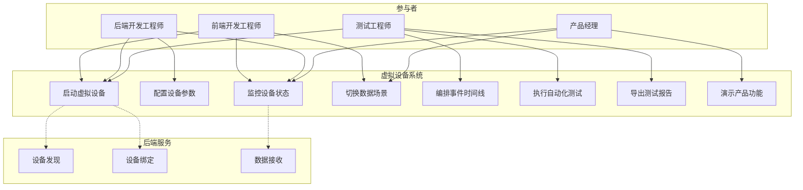

# 用例分析

## 概述

本文档描述虚拟设备V2系统的核心用例，采用UML用例图风格描述参与者与系统的交互。

---

## 用例图



---

## 核心用例详情

### UC-001: 启动虚拟设备

**用例名称**: 启动虚拟设备
**参与者**: 前端开发工程师、后端开发工程师、测试工程师
**优先级**: P0
**前置条件**: 系统已安装并配置后端地址

**基本流程**:
1. 用户打开监控面板
2. 用户点击"创建设备"按钮
3. 系统显示设备配置表单
4. 用户输入设备名称（可选）
5. 用户选择设备类型（可选）
6. 用户点击"创建并启动"
7. 系统创建设备实例
8. 系统启动设备服务
9. 设备进入"运行中"状态
10. 系统显示设备在列表中

**扩展流程**:
- 4a. 用户不输入名称：系统自动生成"虚拟设备_XXXX"
- 5a. 用户不选择类型：默认"通用传感器"
- 7a. 设备ID冲突：系统自动生成新ID
- 8a. 端口被占用：系统尝试下一个可用端口
- 8b. 后端连接失败：设备标记为"离线"，持续重连

**后置条件**:
- 设备实例存在于系统中
- 设备可被小程序发现（如启用UDP）
- 设备开始生成和上报数据（如已配置）

**业务规则**:
- 设备ID全局唯一
- 同一端口只能绑定一个设备
- 最大设备数量受系统资源限制

---

### UC-002: 配置设备参数

**用例名称**: 配置设备参数
**参与者**: 后端开发工程师、测试工程师
**优先级**: P0
**前置条件**: 设备已创建

**基本流程**:
1. 用户在设备列表中选择设备
2. 用户点击"配置"按钮
3. 系统显示配置面板
4. 用户修改采集间隔
5. 用户修改上报间隔
6. 用户配置传感器参数
7. 用户点击"保存"
8. 系统验证配置
9. 系统应用新配置
10. 系统显示"配置已更新"

**扩展流程**:
- 4-6a. 用户点击"恢复默认"：重置为默认配置
- 7a. 配置验证失败：显示错误信息，不保存
- 9a. 设备运行中：配置热加载，无需重启

**后置条件**:
- 设备按新配置运行
- 配置持久化存储

**业务规则**:
- 采集间隔 >= 1秒
- 上报间隔 >= 采集间隔
- 批量上报数量 >= 1

---

### UC-003: 监控设备状态

**用例名称**: 监控设备状态
**参与者**: 前端开发工程师、后端开发工程师、产品经理
**优先级**: P0
**前置条件**: 设备已启动

**基本流程**:
1. 用户打开监控面板
2. 系统显示设备列表
3. 用户选择要监控的设备
4. 系统显示设备详情页
5. 系统实时显示传感器数据
6. 系统显示数据趋势图
7. 系统显示设备运行日志
8. 数据自动刷新更新

**扩展流程**:
- 3a. 用户选择"全部设备"：显示汇总视图
- 5a. 用户点击暂停刷新：停止自动更新
- 6a. 用户切换时间范围：更新趋势图
- 7a. 用户过滤日志级别：只显示指定级别日志

**后置条件**:
- 用户可实时查看设备状态

**业务规则**:
- 数据刷新间隔可配置（默认1秒）
- 趋势图保留历史数据（默认7天）
- 日志保留最近1000条

---

### UC-004: 切换数据场景

**用例名称**: 切换数据场景
**参与者**: 前端开发工程师、产品经理
**优先级**: P0
**前置条件**: 设备已启动

**基本流程**:
1. 用户在监控面板查看当前场景
2. 用户点击场景选择按钮组
3. 系统显示可用场景列表
4. 用户选择目标场景（如"高温模式"）
5. 系统显示场景切换确认
6. 用户确认切换
7. 系统开始场景过渡
8. 数据逐渐变化到新场景范围
9. 系统显示"已切换到高温模式"

**扩展流程**:
- 4a. 用户选择"自定义"：打开场景编辑器
- 7a. 用户点击"立即切换"：跳过过渡，直接应用
- 8a. 用户点击"取消"：恢复到原场景

**后置条件**:
- 设备按新场景生成数据
- 场景配置持久化

**业务规则**:
- 场景切换可配置过渡时间（默认5分钟虚拟时间）
- 过渡期间数据平滑变化，无跳变
- 自定义场景可保存为预设

---

### UC-005: 编排事件时间线

**用例名称**: 编排事件时间线
**参与者**: 测试工程师
**优先级**: P1
**前置条件**: 设备已创建

**基本流程**:
1. 用户打开时间线编辑器
2. 系统显示时间轴视图
3. 用户点击"添加事件"
4. 系统显示事件类型选择
5. 用户选择事件类型（如"浇水"）
6. 用户设置事件时间
7. 用户配置事件参数
8. 用户点击"确认"
9. 系统在时间线上显示事件
10. 用户继续添加更多事件
11. 用户点击"保存脚本"
12. 用户输入脚本名称
13. 系统保存事件序列

**扩展流程**:
- 3a. 用户拖拽现有事件：调整事件时间
- 3b. 用户点击事件：编辑或删除
- 7a. 用户选择"循环"：设置重复规则
- 10a. 用户点击"加载脚本"：加载预设事件序列
- 10b. 用户点击"清空"：移除所有事件

**后置条件**:
- 事件序列保存为可复用脚本
- 设备按时间线执行事件

**业务规则**:
- 事件时间不能为过去（相对于虚拟时间）
- 同一时间可以有多个事件
- 循环事件需指定结束条件

---

### UC-006: 执行自动化测试

**用例名称**: 执行自动化测试
**参与者**: 测试工程师
**优先级**: P1
**前置条件**: 已创建测试脚本

**基本流程**:
1. 用户打开测试管理界面
2. 系统显示测试脚本列表
3. 用户选择要执行的脚本
4. 用户配置测试参数
5. 用户点击"开始测试"
6. 系统初始化测试环境
7. 系统加载设备配置
8. 系统启动虚拟设备
9. 系统按时间线执行事件
10. 系统收集测试结果
11. 测试完成，生成报告

**扩展流程**:
- 4a. 用户选择"并行执行"：多脚本同时运行
- 9a. 用户点击"暂停"：暂停测试执行
- 9b. 用户点击"加速"：提高时间缩放倍数
- 10a. 检测到异常：记录错误，可选择停止或继续

**后置条件**:
- 生成测试报告
- 可选择导出详细日志

**业务规则**:
- 测试执行不影响其他设备
- 支持断言验证预期结果
- 测试失败时保留现场状态

---

### UC-007: 导出测试报告

**用例名称**: 导出测试报告
**参与者**: 测试工程师
**优先级**: P2
**前置条件**: 测试已完成

**基本流程**:
1. 用户在测试结果页面
2. 系统显示测试摘要
3. 用户点击"导出报告"
4. 系统显示导出选项
5. 用户选择格式（PDF/HTML/JSON）
6. 用户选择包含内容
7. 用户点击"确认导出"
8. 系统生成报告文件
9. 系统提供下载链接

**扩展流程**:
- 5a. 用户选择"邮件发送"：输入邮箱地址
- 6a. 用户勾选"包含原始数据"：附加CSV数据文件

**后置条件**:
- 报告文件生成并可下载

---

### UC-008: 演示产品功能

**用例名称**: 演示产品功能
**参与者**: 产品经理
**优先级**: P1
**前置条件**: 系统已部署

**基本流程**:
1. 用户打开演示模式
2. 系统显示演示场景选择
3. 用户选择演示场景（如"植物生长周期"）
4. 系统自动配置虚拟设备
5. 系统启动设备并加载时间线
6. 系统进入全屏展示模式
7. 数据按预设剧本变化
8. 用户可手动控制时间流速
9. 演示完成，显示总结

**扩展流程**:
- 3a. 用户选择"自定义演示"：自行配置参数
- 7a. 用户点击"暂停"：暂停演示，进行讲解
- 7b. 用户点击"跳转"：跳到指定时间点

**后置条件**:
- 演示数据可导出

---

## 用例关系

### 包含关系 (Include)

| 基础用例 | 被包含用例 | 说明 |
|:---|:---|:---|
| UC-006 执行自动化测试 | UC-001 启动虚拟设备 | 测试需要启动设备 |
| UC-006 执行自动化测试 | UC-005 编排事件时间线 | 测试需要事件序列 |
| UC-008 演示产品功能 | UC-001 启动虚拟设备 | 演示需要启动设备 |

### 扩展关系 (Extend)

| 基础用例 | 扩展用例 | 扩展条件 |
|:---|:---|:---|
| UC-001 启动虚拟设备 | 配置网络参数 | 需要自定义网络配置 |
| UC-003 监控设备状态 | 导出监控数据 | 用户点击导出按钮 |
| UC-004 切换数据场景 | 保存自定义场景 | 用户选择自定义参数 |

---

## 用例优先级矩阵

```
                    业务价值
              低 ◄─────────────────► 高
         ┌─────────────────────────────┐
     高  │  导出报告      启动设备      │
         │  (P2)         (P0)          │
  实     │                             │
  现     │  演示功能      监控状态      │
  难    │  (P1)         (P0)          │
  度     │                             │
     低  │  导出数据      切换场景      │
         │  (P2)         (P0)          │
         └─────────────────────────────┘
```

---

## 用例与功能需求映射

| 用例 | 涉及功能需求 |
|:---|:---|
| UC-001 启动虚拟设备 | FUNC-DEV-001, FUNC-DEV-002, FUNC-DEV-006 |
| UC-002 配置设备参数 | FUNC-DEV-005, FUNC-SYS-001 |
| UC-003 监控设备状态 | FUNC-MON-001, FUNC-MON-002, FUNC-MON-004 |
| UC-004 切换数据场景 | FUNC-GEN-002, FUNC-MON-003 |
| UC-005 编排事件时间线 | FUNC-TL-001, FUNC-TL-002, FUNC-TL-003 |
| UC-006 执行自动化测试 | FUNC-TL-004, FUNC-GEN-003 |
| UC-007 导出测试报告 | FUNC-MON-004 (扩展) |
| UC-008 演示产品功能 | FUNC-GEN-002, FUNC-TL-004 |
