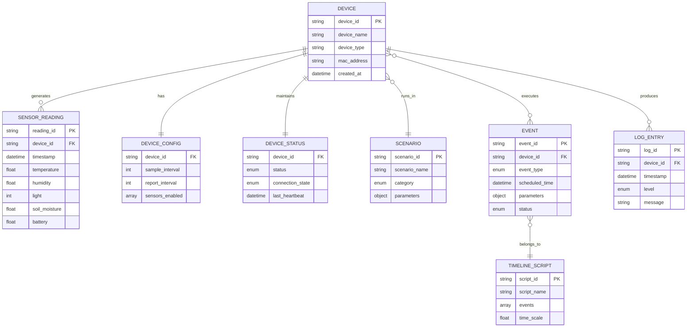

# 数据字典

## 概述

数据字典定义系统中所有数据实体的结构、类型、约束和关系，确保数据一致性。

---

## 1. 设备相关数据

### 1.1 设备基本信息 (DeviceInfo)

| 字段名 | 类型 | 必填 | 默认值 | 说明 | 示例 |
|:---|:---|:---:|:---|:---|:---|
| device_id | string | ✓ | 自动生成 | 设备唯一标识符 | "VD1234567890" |
| device_name | string | ✓ | "虚拟设备_XXXX" | 设备显示名称 | "客厅植物监测器" |
| device_type | string | ✓ | "generic_sensor" | 设备类型 | "plant_monitor" |
| firmware_version | string | ✓ | "1.0.0" | 固件版本 | "2.1.3" |
| hardware_version | string | ✓ | "1.0" | 硬件版本 | "1.2" |
| mac_address | string | ✓ | 随机生成 | MAC地址 | "A4:CF:12:34:56:78" |
| created_at | datetime | ✓ | 当前时间 | 创建时间 | "2024-01-15T08:30:00Z" |
| updated_at | datetime | ✓ | 当前时间 | 更新时间 | "2024-01-15T10:45:00Z" |

**约束条件**:
- device_id: 长度10-32字符，只允许字母数字
- device_name: 长度2-50字符
- device_type: 枚举值 ["generic_sensor", "plant_monitor", "environment_sensor"]
- mac_address: 格式符合IEEE 802标准

---

### 1.2 设备状态 (DeviceStatus)

| 字段名 | 类型 | 必填 | 默认值 | 说明 | 枚举值 |
|:---|:---|:---:|:---|:---|:---|
| status | enum | ✓ | "idle" | 设备运行状态 | 见下表 |
| connection_state | enum | ✓ | "disconnected" | 网络连接状态 | 见下表 |
| wifi_configured | boolean | ✓ | false | WiFi是否配置 | true/false |
| wifi_ssid | string | ✗ | null | 连接的WiFi名称 | - |
| wifi_signal | integer | ✗ | null | WiFi信号强度(dBm) | -70 ~ -30 |
| ip_address | string | ✗ | null | 设备IP地址 | "192.168.1.100" |
| last_heartbeat | datetime | ✗ | null | 最后心跳时间 | - |
| uptime_seconds | integer | ✓ | 0 | 运行时长(秒) | ≥0 |
| error_code | string | ✗ | null | 错误代码 | 见错误码表 |
| error_message | string | ✗ | null | 错误描述 | - |

**status 枚举值**:
| 值 | 说明 | 颜色标识 |
|:---|:---|:---:|
| idle | 空闲，未启动 | ⚪ 灰色 |
| running | 运行中 | 🟢 绿色 |
| stopped | 已停止 | 🔴 红色 |
| error | 错误状态 | 🟠 橙色 |
| configuring | 配置中 | 🟡 黄色 |

**connection_state 枚举值**:
| 值 | 说明 |
|:---|:---|
| disconnected | 未连接 |
| connecting | 连接中 |
| connected | 已连接 |
| reconnecting | 重连中 |
| error | 连接错误 |

---

### 1.3 设备配置 (DeviceConfig)

| 字段名 | 类型 | 必填 | 默认值 | 范围 | 说明 |
|:---|:---|:---:|:---|:---|:---|
| sample_interval | integer | ✓ | 30 | 1-3600 | 数据采集间隔(秒) |
| report_interval | integer | ✓ | 300 | 10-86400 | 数据上报间隔(秒) |
| batch_size | integer | ✓ | 10 | 1-100 | 批量上报数量 |
| enable_compression | boolean | ✓ | true | - | 是否启用压缩 |
| enable_cache | boolean | ✓ | true | - | 是否启用本地缓存 |
| cache_max_size | integer | ✓ | 1000 | 100-10000 | 最大缓存条数 |
| heartbeat_interval | integer | ✓ | 30 | 10-300 | 心跳间隔(秒) |
| timezone | string | ✓ | "Asia/Shanghai" | - | 设备时区 |
| sensors_enabled | array | ✓ | ["all"] | - | 启用的传感器列表 |

**sensors_enabled 可选值**:
```json
["temperature", "humidity", "light", "soil_moisture", "battery"]
```

---

## 2. 传感器数据

### 2.1 传感器读数 (SensorReading)

| 字段名 | 类型 | 必填 | 单位 | 精度 | 说明 |
|:---|:---|:---:|:---|:---|:---|
| timestamp | datetime | ✓ | - | - | 数据采集时间 |
| temperature | float | ✗ | °C | 0.1 | 温度 |
| humidity | float | ✗ | % | 0.1 | 相对湿度 |
| light | integer | ✗ | lux | 1 | 光照强度 |
| soil_moisture | float | ✗ | % | 0.1 | 土壤湿度 |
| battery | float | ✗ | % | 0.1 | 电池电量 |
| battery_voltage | float | ✗ | V | 0.01 | 电池电压 |

**有效范围**:
| 字段 | 最小值 | 最大值 | 说明 |
|:---|:---:|:---:|:---|
| temperature | -40.0 | 80.0 | 超出范围标记为异常 |
| humidity | 0.0 | 100.0 | 百分比 |
| light | 0 | 100000 | 0表示完全黑暗 |
| soil_moisture | 0.0 | 100.0 | 百分比，0为干燥 |
| battery | 0.0 | 100.0 | 百分比 |
| battery_voltage | 3.0 | 4.2 | 锂电池典型范围 |

---

### 2.2 传感器元数据 (SensorMetadata)

| 字段名 | 类型 | 必填 | 说明 |
|:---|:---|:---:|:---|
| sensor_id | string | ✓ | 传感器唯一ID |
| sensor_type | enum | ✓ | 传感器类型 |
| sensor_name | string | ✓ | 传感器显示名称 |
| unit | string | ✓ | 单位符号 |
| precision | integer | ✓ | 小数位数 |
| min_value | float | ✓ | 最小有效值 |
| max_value | float | ✓ | 最大有效值 |
| calibration_offset | float | ✓ | 校准偏移量 |
| calibration_scale | float | ✓ | 校准比例 |
| is_enabled | boolean | ✓ | 是否启用 |

**sensor_type 枚举**:
| 值 | 名称 | 单位 | 典型范围 |
|:---|:---|:---|:---|
| temperature | 温度传感器 | °C | -40 ~ 80 |
| humidity | 湿度传感器 | % | 0 ~ 100 |
| light | 光照传感器 | lux | 0 ~ 100000 |
| soil_moisture | 土壤湿度传感器 | % | 0 ~ 100 |
| battery | 电池电量传感器 | % | 0 ~ 100 |

---

## 3. 场景模式数据

### 3.1 场景定义 (Scenario)

| 字段名 | 类型 | 必填 | 说明 |
|:---|:---|:---:|:---|
| scenario_id | string | ✓ | 场景唯一标识 |
| scenario_name | string | ✓ | 场景显示名称 |
| description | string | ✗ | 场景描述 |
| category | enum | ✓ | 场景分类 |
| parameters | object | ✓ | 场景参数 |
| transition_time | integer | ✓ | 过渡时间(秒) |
| is_builtin | boolean | ✓ | 是否内置场景 |
| created_at | datetime | ✓ | 创建时间 |
| updated_at | datetime | ✓ | 更新时间 |

**category 枚举**:
| 值 | 说明 |
|:---|:---|
| normal | 正常环境 |
| extreme | 极端环境 |
| seasonal | 季节性 |
| custom | 自定义 |

**内置场景参数示例**:

```yaml
# 正常模式 (normal)
normal:
  temperature:
    base: 22.0        # 基础温度
    amplitude: 3.0    # 波动幅度
    period: 86400     # 周期(秒)
  humidity:
    base: 50.0
    amplitude: 10.0
    period: 86400
  light:
    day_peak: 5000    # 白天峰值
    night_base: 10    # 夜间基础值
  soil_moisture:
    base: 40.0
    decay_rate: 0.5   # 衰减率(%/小时)

# 高温模式 (high_temperature)
high_temperature:
  temperature:
    base: 32.0
    amplitude: 5.0
    period: 86400
  humidity:
    base: 30.0        # 高温低湿
    amplitude: 5.0
  light:
    day_peak: 80000   # 强光
    night_base: 10
```

---

## 4. 事件时间线数据

### 4.1 事件定义 (Event)

| 字段名 | 类型 | 必填 | 说明 | 示例 |
|:---|:---|:---:|:---|:---|
| event_id | string | ✓ | 事件唯一ID | "EVT123456" |
| event_type | enum | ✓ | 事件类型 | "watering" |
| event_name | string | ✓ | 事件显示名称 | "浇水" |
| scheduled_time | datetime | ✓ | 计划执行时间 | "2024-01-15T14:00:00Z" |
| parameters | object | ✗ | 事件参数 | {"amount": 200} |
| status | enum | ✓ | 事件状态 | "pending" |
| created_at | datetime | ✓ | 创建时间 | - |
| executed_at | datetime | ✗ | 实际执行时间 | - |
| result | object | ✗ | 执行结果 | - |

**event_type 枚举**:
| 值 | 名称 | 参数示例 |
|:---|:---|:---|
| scenario_change | 场景切换 | {"scenario_id": "high_temp"} |
| watering | 浇水 | {"amount": 200, "duration": 30} |
| fertilizing | 施肥 | {"type": "NPK", "amount": 50} |
| temperature_spike | 温度骤变 | {"delta": 10, "duration": 300} |
| sensor_fault | 传感器故障 | {"sensor_id": "temp_01"} |
| sensor_recovery | 传感器恢复 | {"sensor_id": "temp_01"} |
| device_restart | 设备重启 | {} |
| custom | 自定义事件 | 任意参数 |

**status 枚举**:
| 值 | 说明 | 颜色 |
|:---|:---|:---:|
| pending | 待执行 | 🟡 |
| executing | 执行中 | 🔵 |
| completed | 已完成 | 🟢 |
| failed | 失败 | 🔴 |
| cancelled | 已取消 | ⚪ |
| skipped | 已跳过 | 🟠 |

---

### 4.2 时间线脚本 (TimelineScript)

| 字段名 | 类型 | 必填 | 说明 |
|:---|:---|:---:|:---|
| script_id | string | ✓ | 脚本唯一ID |
| script_name | string | ✓ | 脚本名称 |
| description | string | ✗ | 脚本描述 |
| events | array | ✓ | 事件列表 |
| time_scale | float | ✓ | 时间缩放倍数 |
| is_loop | boolean | ✓ | 是否循环执行 |
| loop_count | integer | ✗ | 循环次数(0为无限) |
| created_at | datetime | ✓ | 创建时间 |
| updated_at | datetime | ✓ | 更新时间 |

**脚本示例**:
```json
{
  "script_id": "SCRIPT001",
  "script_name": "植物生长周期测试",
  "description": "模拟一周的植物生长环境变化",
  "events": [
    {
      "event_id": "EVT001",
      "event_type": "scenario_change",
      "scheduled_time": "2024-01-15T08:00:00Z",
      "parameters": {"scenario_id": "normal"}
    },
    {
      "event_id": "EVT002",
      "event_type": "watering",
      "scheduled_time": "2024-01-15T18:00:00Z",
      "parameters": {"amount": 200}
    }
  ],
  "time_scale": 60.0,
  "is_loop": false
}
```

---

## 5. 系统配置数据

### 5.1 系统配置 (SystemConfig)

| 字段名 | 类型 | 必填 | 默认值 | 说明 |
|:---|:---|:---:|:---|:---|
| backend_url | string | ✓ | - | 后端服务器地址 |
| backend_timeout | integer | ✓ | 30 | 后端请求超时(秒) |
| udp_port | integer | ✓ | 8080 | UDP监听端口 |
| http_port | integer | ✓ | 5000 | HTTP服务端口 |
| log_level | enum | ✓ | "INFO" | 日志级别 |
| log_format | enum | ✓ | "json" | 日志格式 |
| max_devices | integer | ✓ | 50 | 最大设备数量 |
| enable_discovery | boolean | ✓ | true | 启用设备发现 |
| enable_web | boolean | ✓ | true | 启用Web界面 |
| data_retention_days | integer | ✓ | 7 | 数据保留天数 |

**log_level 枚举**: DEBUG, INFO, WARNING, ERROR, CRITICAL
**log_format 枚举**: json, text

---

### 5.2 网络配置 (NetworkConfig)

| 字段名 | 类型 | 必填 | 默认值 | 说明 |
|:---|:---|:---:|:---|:---|
| bind_address | string | ✓ | "0.0.0.0" | 绑定地址 |
| udp_broadcast_enabled | boolean | ✓ | true | 启用UDP广播 |
| udp_response_delay | integer | ✓ | 100 | 响应延迟(ms) |
| http_cors_origins | array | ✓ | ["*"] | CORS允许来源 |
| websocket_enabled | boolean | ✓ | true | 启用WebSocket |
| sse_enabled | boolean | ✓ | true | 启用SSE |

---

## 6. 日志数据

### 6.1 日志条目 (LogEntry)

| 字段名 | 类型 | 必填 | 说明 | 示例 |
|:---|:---|:---:|:---|:---|
| timestamp | datetime | ✓ | 日志时间 | "2024-01-15T10:30:00.123Z" |
| level | enum | ✓ | 日志级别 | "INFO" |
| logger | string | ✓ | 日志来源 | "device.vd001" |
| message | string | ✓ | 日志内容 | "设备启动成功" |
| context | object | ✗ | 上下文信息 | {"device_id": "VD001"} |
| source | object | ✗ | 源码位置 | {"file": "device.py", "line": 45} |

**level 枚举**: DEBUG(10), INFO(20), WARNING(30), ERROR(40), CRITICAL(50)

---

## 7. 错误码定义

### 7.1 系统错误码

| 错误码 | 名称 | 说明 | HTTP状态码 |
|:---|:---|:---|:---:|
| SYS_001 | CONFIG_ERROR | 配置错误 | 500 |
| SYS_002 | NETWORK_ERROR | 网络错误 | 503 |
| SYS_003 | RESOURCE_EXHAUSTED | 资源耗尽 | 503 |
| SYS_004 | INTERNAL_ERROR | 内部错误 | 500 |

### 7.2 设备错误码

| 错误码 | 名称 | 说明 | HTTP状态码 |
|:---|:---|:---|:---:|
| DEV_001 | DEVICE_NOT_FOUND | 设备不存在 | 404 |
| DEV_002 | DEVICE_ALREADY_EXISTS | 设备已存在 | 409 |
| DEV_003 | DEVICE_OFFLINE | 设备离线 | 503 |
| DEV_004 | INVALID_DEVICE_ID | 无效设备ID | 400 |
| DEV_005 | DEVICE_LIMIT_REACHED | 设备数量达到上限 | 429 |

### 7.3 网络错误码

| 错误码 | 名称 | 说明 | HTTP状态码 |
|:---|:---|:---|:---:|
| NET_001 | CONNECTION_TIMEOUT | 连接超时 | 504 |
| NET_002 | CONNECTION_REFUSED | 连接被拒绝 | 503 |
| NET_003 | PORT_IN_USE | 端口被占用 | 500 |
| NET_004 | AUTH_FAILED | 认证失败 | 401 |

### 7.4 数据错误码

| 错误码 | 名称 | 说明 | HTTP状态码 |
|:---|:---|:---|:---:|
| DATA_001 | INVALID_PARAMETER | 无效参数 | 400 |
| DATA_002 | VALIDATION_ERROR | 验证错误 | 400 |
| DATA_003 | RATE_LIMITED | 请求过于频繁 | 429 |
| DATA_004 | STORAGE_FULL | 存储已满 | 507 |

---

## 8. 数据关系图


