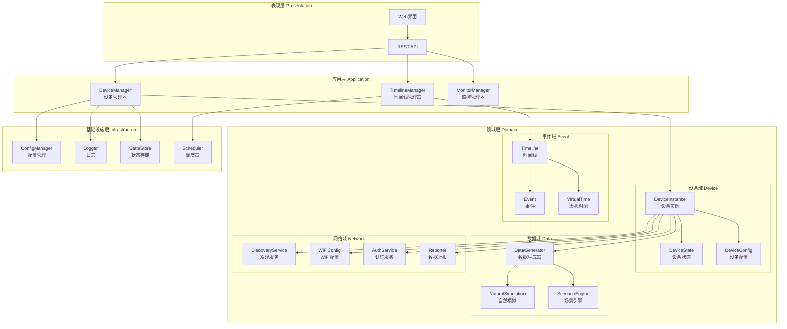

# 模块划分

## 概述

本文档定义虚拟设备V2系统的核心模块划分，遵循高内聚低耦合原则，确保模块职责清晰、接口明确。

---

## 模块架构图



---

## 模块清单

### 1. 设备管理模块 (Device Management)

| 模块 | 职责 | 核心类 | 文件路径 |
|:---|:---|:---|:---|
| DeviceManager | 管理所有虚拟设备实例 | DeviceManager | `core/manager.py` |
| DeviceInstance | 单个设备实例 | DeviceInstance | `core/device.py` |
| DeviceState | 设备状态管理 | DeviceState | `core/state.py` |
| DeviceConfig | 设备配置管理 | DeviceConfig | `core/config.py` |

**模块职责**:
- 设备生命周期管理（创建、启动、停止、销毁）
- 设备状态监控和转换
- 设备配置持久化
- 多设备并发管理

---

### 2. 数据生成模块 (Data Generation)

| 模块 | 职责 | 核心类 | 文件路径 |
|:---|:---|:---|:---|
| DataGenerator | 数据生成协调器 | DataGenerator | `services/data_generator.py` |
| NaturalSimulation | 自然现象模拟 | NaturalSimulation | `services/natural_sim.py` |
| ScenarioEngine | 场景模式管理 | ScenarioEngine | `services/scenario.py` |
| EventDrivenGenerator | 事件驱动数据 | EventDrivenGenerator | `services/event_gen.py` |

**模块职责**:
- 三层数据生成策略协调
- 自然现象物理模拟
- 场景模式切换管理
- 事件触发数据变化

---

### 3. 事件时间线模块 (Event Timeline)

| 模块 | 职责 | 核心类 | 文件路径 |
|:---|:---|:---|:---|
| VirtualTime | 虚拟时间系统 | VirtualTime | `core/virtual_time.py` |
| Timeline | 时间线管理 | Timeline | `services/timeline.py` |
| Event | 事件定义和执行 | Event | `models/event.py` |
| ScriptManager | 脚本管理 | ScriptManager | `services/script_mgr.py` |

**模块职责**:
- 虚拟时间控制（加速、暂停、跳转）
- 事件调度和执行
- 时间线编排和编辑
- 脚本保存和加载

---

### 4. 网络服务模块 (Network Services)

| 模块 | 职责 | 核心类 | 文件路径 |
|:---|:---|:---|:---|
| DiscoveryService | UDP设备发现 | DiscoveryService | `services/discovery.py` |
| WiFiConfig | WiFi配网模拟 | WiFiConfig | `services/wifi_config.py` |
| AuthService | 设备认证 | AuthService | `services/auth.py` |
| Reporter | 数据上报 | Reporter | `services/reporter.py` |

**模块职责**:
- UDP广播响应和设备发现
- WiFi配网流程模拟
- 设备注册和Token管理
- 传感器数据上报

---

### 5. 监控面板模块 (Monitoring)

| 模块 | 职责 | 核心类 | 文件路径 |
|:---|:---|:---|:---|
| Dashboard | 数据展示面板 | Dashboard | `web/dashboard.py` |
| StatusMonitor | 状态监控 | StatusMonitor | `web/status_monitor.py` |
| ScenarioControl | 场景控制 | ScenarioControl | `web/scenario_ctrl.py` |
| LogViewer | 日志查看器 | LogViewer | `web/log_viewer.py` |

**模块职责**:
- 实时数据可视化
- 设备状态监控
- 场景切换控制
- 日志实时输出

---

### 6. 基础设施模块 (Infrastructure)

| 模块 | 职责 | 核心类 | 文件路径 |
|:---|:---|:---|:---|
| ConfigManager | 配置管理 | ConfigManager | `infrastructure/config.py` |
| Logger | 日志系统 | StructuredLogger | `infrastructure/logger.py` |
| StateStore | 状态存储 | StateStore | `infrastructure/store.py` |
| Scheduler | 任务调度 | AsyncScheduler | `infrastructure/scheduler.py` |

**模块职责**:
- 配置文件加载和验证
- 结构化日志记录
- 设备状态持久化
- 异步任务调度

---

## 模块依赖关系

### 依赖矩阵

| 模块 | 依赖模块 | 被依赖模块 |
|:---|:---|:---|
| DeviceManager | ConfigManager, Logger | Web API |
| DeviceInstance | DeviceState, DeviceConfig, DataGenerator, Network Services | DeviceManager |
| DataGenerator | NaturalSimulation, ScenarioEngine, VirtualTime | DeviceInstance |
| Timeline | VirtualTime, Event, Scheduler | Web API |
| Network Services | AuthService | DeviceInstance |
| Web Interface | All Managers | - |

### 依赖规则

1. **单向依赖**: 上层模块可以依赖下层，下层不能依赖上层
2. **领域独立**: 领域层模块之间尽量减少直接依赖，通过应用层协调
3. **基础设施透明**: 领域层不直接依赖基础设施，通过接口抽象
4. **配置集中**: 所有配置通过ConfigManager统一管理

---

## 模块接口概览

### DeviceManager 接口

```python
class DeviceManager:
    async def create_device(config: DeviceConfig) -> DeviceInstance
    async def start_device(device_id: str) -> bool
    async def stop_device(device_id: str) -> bool
    async def destroy_device(device_id: str) -> bool
    def get_device(device_id: str) -> Optional[DeviceInstance]
    def list_devices() -> List[DeviceInstance]
    def get_stats() -> DeviceManagerStats
```

### DataGenerator 接口

```python
class DataGenerator:
    async def generate() -> SensorReading
    def set_scenario(scenario: Scenario)
    def set_time_scale(scale: float)
    def add_event(event: Event)
    def get_current_reading() -> SensorReading
```

### Timeline 接口

```python
class Timeline:
    async def add_event(event: Event) -> str
    async def remove_event(event_id: str) -> bool
    async def update_event(event_id: str, params: dict) -> bool
    def list_events() -> List[Event]
    def set_time_scale(scale: float)
    def pause()
    def resume()
```

---

## 模块部署单元

```
核心服务 (Core Service)
├── core/              # 领域核心
│   ├── device.py      # DeviceInstance
│   ├── manager.py     # DeviceManager
│   ├── state.py       # DeviceState
│   └── virtual_time.py # VirtualTime
│
├── services/          # 领域服务
│   ├── data_generator.py
│   ├── natural_sim.py
│   ├── scenario.py
│   ├── timeline.py
│   ├── discovery.py
│   ├── wifi_config.py
│   ├── auth.py
│   └── reporter.py
│
├── models/            # 数据模型
│   ├── event.py
│   ├── reading.py
│   └── scenario.py
│
├── infrastructure/    # 基础设施
│   ├── config.py
│   ├── logger.py
│   ├── store.py
│   └── scheduler.py
│
└── web/               # 表现层
    ├── app.py
    ├── dashboard.py
    ├── api.py
    └── static/
```
