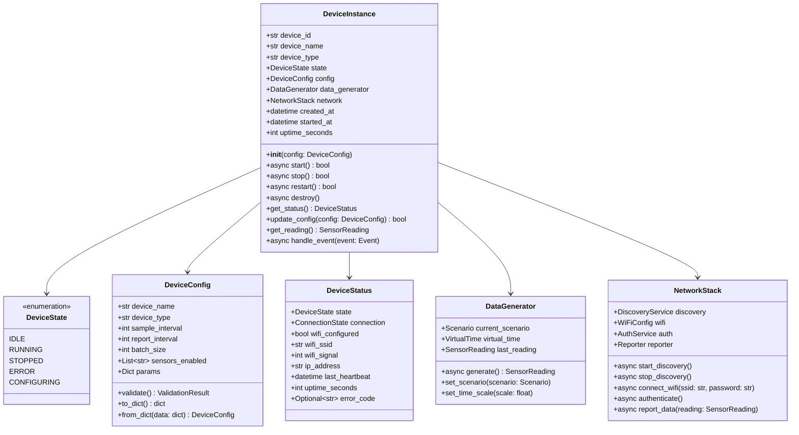
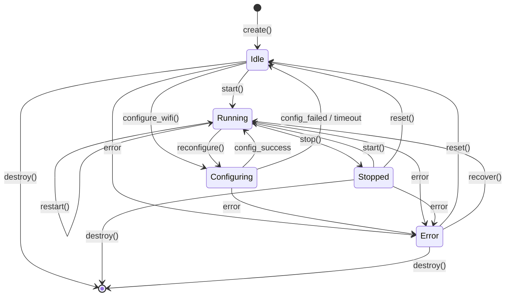

# 设备实例设计

## 概述

设备实例（DeviceInstance）是虚拟设备系统的核心领域对象，代表一个独立的虚拟设备。本文档详细定义设备实例的结构、状态机、生命周期和协作关系。

---

## 类图



---

## 设备状态机

### 状态定义



### 状态转换表

| 当前状态 | 事件 | 下一状态 | 动作 | 条件 |
|:---|:---|:---|:---|:---|
| Idle | start() | Running | 启动数据生成、网络服务 | 配置有效 |
| Idle | configure_wifi() | Configuring | 进入配网模式 | - |
| Idle | destroy() | - | 释放资源 | - |
| Configuring | config_success | Running | 连接WiFi，启动服务 | 配网成功 |
| Configuring | config_failed | Idle | 返回AP模式 | 配网失败/超时 |
| Configuring | timeout | Idle | 60秒超时 | - |
| Running | stop() | Stopped | 停止数据生成 | - |
| Running | error | Error | 记录错误 | 发生异常 |
| Running | reconfigure() | Configuring | 重新配网 | - |
| Stopped | start() | Running | 恢复运行 | - |
| Stopped | reset() | Idle | 重置状态 | - |
| Error | reset() | Idle | 清除错误 | - |
| Error | recover() | Running | 尝试恢复 | 错误可恢复 |

---

## 设备实例详细设计

### 属性定义

```python
@dataclass
class DeviceInstance:
    """
    虚拟设备实例
    
    职责：
    1. 管理设备生命周期
    2. 协调数据生成和网络服务
    3. 维护设备状态
    4. 处理事件响应
    """
    
    # 标识信息
    device_id: str                    # 设备唯一ID
    device_name: str                  # 设备名称
    device_type: str                  # 设备类型
    mac_address: str                  # MAC地址
    
    # 状态管理
    _state: DeviceState = field(default=DeviceState.IDLE)
    _state_lock: asyncio.Lock = field(default_factory=asyncio.Lock)
    
    # 配置
    config: DeviceConfig              # 设备配置
    
    # 核心组件
    _data_generator: Optional[DataGenerator] = None
    _network: Optional[NetworkStack] = None
    _scheduler: Optional[AsyncScheduler] = None
    
    # 运行时信息
    created_at: datetime = field(default_factory=datetime.now)
    started_at: Optional[datetime] = None
    _stop_event: asyncio.Event = field(default_factory=asyncio.Event)
    
    # 统计信息
    _sample_count: int = 0
    _report_count: int = 0
    _error_count: int = 0
```

### 核心方法

#### 生命周期方法

```python
async def start(self) -> bool:
    """
    启动设备
    
    流程：
    1. 检查当前状态
    2. 初始化组件
    3. 启动网络服务
    4. 启动数据生成
    5. 更新状态为RUNNING
    
    Returns:
        bool: 启动是否成功
    """
    async with self._state_lock:
        if self._state not in [DeviceState.IDLE, DeviceState.STOPPED]:
            logger.warning(f"设备 {self.device_id} 当前状态 {self._state} 不允许启动")
            return False
        
        try:
            # 初始化组件
            self._data_generator = DataGenerator(self.config)
            self._network = NetworkStack(self.device_id, self.config)
            self._scheduler = AsyncScheduler()
            
            # 启动网络服务
            await self._network.start()
            
            # 启动数据采集任务
            await self._start_sampling()
            
            # 启动心跳任务
            await self._start_heartbeat()
            
            self._state = DeviceState.RUNNING
            self.started_at = datetime.now()
            self._stop_event.clear()
            
            logger.info(f"设备 {self.device_id} 启动成功")
            return True
            
        except Exception as e:
            self._state = DeviceState.ERROR
            logger.error(f"设备 {self.device_id} 启动失败: {e}")
            return False

async def stop(self) -> bool:
    """
    停止设备
    
    流程：
    1. 发送停止信号
    2. 等待任务完成（超时5秒）
    3. 停止网络服务
    4. 更新状态为STOPPED
    
    Returns:
        bool: 停止是否成功
    """
    async with self._state_lock:
        if self._state != DeviceState.RUNNING:
            return False
        
        self._stop_event.set()
        
        # 等待任务完成
        try:
            await asyncio.wait_for(self._wait_tasks_complete(), timeout=5.0)
        except asyncio.TimeoutError:
            logger.warning(f"设备 {self.device_id} 停止超时，强制停止")
        
        # 停止网络服务
        if self._network:
            await self._network.stop()
        
        self._state = DeviceState.STOPPED
        logger.info(f"设备 {self.device_id} 已停止")
        return True

async def destroy(self) -> None:
    """
    销毁设备实例
    
    释放所有资源，设备不可再次使用
    """
    if self._state == DeviceState.RUNNING:
        await self.stop()
    
    # 清理资源
    self._data_generator = None
    self._network = None
    self._scheduler = None
    
    logger.info(f"设备 {self.device_id} 已销毁")
```

#### 数据采集方法

```python
async def _start_sampling(self) -> None:
    """启动数据采集循环"""
    async def sample_loop():
        while not self._stop_event.is_set():
            try:
                # 生成传感器数据
                reading = await self._data_generator.generate()
                self._sample_count += 1
                
                # 缓存数据
                await self._cache_reading(reading)
                
                # 检查是否需要上报
                if self._should_report():
                    await self._report_cached_data()
                
                # 等待下一次采集
                await asyncio.wait_for(
                    self._stop_event.wait(),
                    timeout=self.config.sample_interval
                )
                
            except asyncio.TimeoutError:
                continue
            except Exception as e:
                self._error_count += 1
                logger.error(f"设备 {self.device_id} 采样错误: {e}")
                await asyncio.sleep(1)
    
    self._scheduler.schedule(sample_loop())

async def _start_heartbeat(self) -> None:
    """启动心跳上报"""
    async def heartbeat_loop():
        while not self._stop_event.is_set():
            try:
                status = self.get_status()
                await self._network.send_heartbeat(status)
                
                await asyncio.wait_for(
                    self._stop_event.wait(),
                    timeout=self.config.heartbeat_interval
                )
            except asyncio.TimeoutError:
                continue
            except Exception as e:
                logger.error(f"设备 {self.device_id} 心跳错误: {e}")
    
    self._scheduler.schedule(heartbeat_loop())
```

#### 事件处理方法

```python
async def handle_event(self, event: Event) -> EventResult:
    """
    处理时间线事件
    
    Args:
        event: 事件对象
        
    Returns:
        EventResult: 事件执行结果
    """
    handlers = {
        EventType.SCENARIO_CHANGE: self._handle_scenario_change,
        EventType.WATERING: self._handle_watering,
        EventType.TEMPERATURE_SPIKE: self._handle_temp_spike,
        EventType.SENSOR_FAULT: self._handle_sensor_fault,
        EventType.SENSOR_RECOVERY: self._handle_sensor_recovery,
    }
    
    handler = handlers.get(event.event_type)
    if handler:
        try:
            await handler(event.parameters)
            return EventResult(success=True, message="执行成功")
        except Exception as e:
            return EventResult(success=False, message=str(e))
    
    return EventResult(success=False, message=f"未知事件类型: {event.event_type}")

async def _handle_scenario_change(self, params: dict) -> None:
    """处理场景切换事件"""
    scenario_id = params.get('scenario_id')
    scenario = ScenarioManager.get(scenario_id)
    if scenario:
        self._data_generator.set_scenario(scenario)
        logger.info(f"设备 {self.device_id} 切换到场景 {scenario_id}")

async def _handle_watering(self, params: dict) -> None:
    """处理浇水事件"""
    amount = params.get('amount', 200)  # ml
    # 触发土壤湿度上升
    self._data_generator.inject_event('watering', {'amount': amount})
    logger.info(f"设备 {self.device_id} 执行浇水 {amount}ml")
```

---

## 设备配置设计

### 配置类定义

```python
@dataclass
class DeviceConfig:
    """设备配置"""
    
    # 基本信息
    device_name: str = "虚拟设备"
    device_type: str = "plant_monitor"
    
    # 采集配置
    sample_interval: int = 30          # 采样间隔(秒)
    report_interval: int = 300         # 上报间隔(秒)
    batch_size: int = 10               # 批量上报数量
    
    # 功能开关
    enable_compression: bool = True
    enable_cache: bool = True
    enable_discovery: bool = True
    
    # 缓存配置
    cache_max_size: int = 1000
    cache_ttl: int = 3600              # 缓存过期时间(秒)
    
    # 网络配置
    heartbeat_interval: int = 30
    connection_timeout: int = 30
    retry_attempts: int = 3
    
    # 传感器配置
    sensors_enabled: List[str] = field(default_factory=lambda: [
        "temperature", "humidity", "light", "soil_moisture", "battery"
    ])
    
    # 数据生成配置
    initial_scenario: str = "normal"
    time_scale: float = 1.0
    
    def validate(self) -> ValidationResult:
        """验证配置有效性"""
        errors = []
        
        if self.sample_interval < 1:
            errors.append("采样间隔必须 >= 1秒")
        
        if self.report_interval < self.sample_interval:
            errors.append("上报间隔必须 >= 采样间隔")
        
        if self.batch_size < 1 or self.batch_size > 100:
            errors.append("批量大小必须在 1-100 之间")
        
        return ValidationResult(valid=len(errors) == 0, errors=errors)
```

---

## 线程安全设计

### 并发控制策略

```python
class DeviceInstance:
    def __init__(self, config: DeviceConfig):
        # 状态锁：保护状态转换
        self._state_lock = asyncio.Lock()
        
        # 数据锁：保护传感器数据
        self._data_lock = asyncio.Lock()
        
        # 配置锁：保护配置修改
        self._config_lock = asyncio.Lock()
        
        # 缓存：线程安全的数据结构
        self._reading_cache: asyncio.Queue = asyncio.Queue(
            maxsize=config.cache_max_size
        )
    
    async def update_config(self, new_config: DeviceConfig) -> bool:
        """线程安全的配置更新"""
        async with self._config_lock:
            # 验证新配置
            result = new_config.validate()
            if not result.valid:
                return False
            
            # 如果设备运行中，需要热加载
            if self._state == DeviceState.RUNNING:
                await self._hot_reload_config(new_config)
            
            self.config = new_config
            return True
    
    async def get_reading(self) -> Optional[SensorReading]:
        """线程安全的数据读取"""
        async with self._data_lock:
            if self._data_generator:
                return self._data_generator.get_current_reading()
            return None
```

---

## 错误处理设计

### 错误分类

| 错误类型 | 示例 | 处理策略 | 恢复方式 |
|:---|:---|:---|:---|
| 配置错误 | 无效参数 | 拒绝操作，返回错误 | 修正配置 |
| 网络错误 | 连接超时 | 重试，指数退避 | 自动恢复 |
| 资源错误 | 内存不足 | 降级运行 | 释放资源 |
| 逻辑错误 | 状态冲突 | 记录日志，忽略 | 手动重置 |
| 系统错误 | 未知异常 | 停止设备，记录堆栈 | 重启设备 |

### 错误恢复机制

```python
async def _error_recovery(self, error: Exception) -> bool:
    """
    错误恢复
    
    Returns:
        bool: 是否恢复成功
    """
    self._error_count += 1
    
    # 根据错误类型选择恢复策略
    if isinstance(error, NetworkError):
        # 网络错误：等待后重试
        await asyncio.sleep(5)
        return True
    
    elif isinstance(error, ResourceExhaustedError):
        # 资源错误：清理缓存
        await self._clear_cache()
        return True
    
    elif isinstance(error, ConfigurationError):
        # 配置错误：无法自动恢复
        self._state = DeviceState.ERROR
        return False
    
    else:
        # 系统错误：连续错误超过阈值则停止
        if self._error_count > 10:
            self._state = DeviceState.ERROR
            return False
        return True
```
