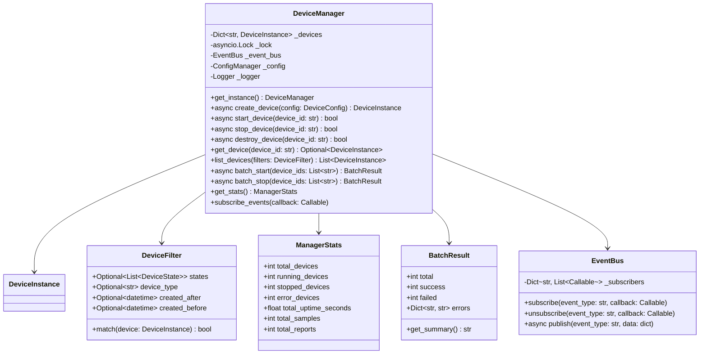

# 设备管理器设计

## 概述

设备管理器（DeviceManager）负责管理所有虚拟设备实例的生命周期，提供设备的创建、查询、监控和批量操作能力。

---

## 类图



---

## 单例模式实现

```python
class DeviceManager:
    """
    设备管理器（单例模式）
    
    职责：
    1. 管理所有设备实例
    2. 提供设备CRUD操作
    3. 批量操作支持
    4. 事件发布订阅
    5. 资源限制控制
    """
    
    _instance: Optional['DeviceManager'] = None
    _lock: asyncio.Lock = asyncio.Lock()
    
    def __new__(cls) -> 'DeviceManager':
        if cls._instance is None:
            cls._instance = super().__new__(cls)
            cls._instance._initialized = False
        return cls._instance
    
    def __init__(self):
        if self._initialized:
            return
        
        self._devices: Dict[str, DeviceInstance] = {}
        self._lock = asyncio.Lock()
        self._event_bus = EventBus()
        self._config = ConfigManager()
        self._logger = get_logger('device_manager')
        
        # 资源限制
        self._soft_limit = 50
        self._hard_limit = 100
        
        self._initialized = True
    
    @classmethod
    async def get_instance(cls) -> 'DeviceManager':
        """获取管理器实例（线程安全）"""
        async with cls._lock:
            if cls._instance is None:
                cls._instance = cls()
            return cls._instance
```

---

## 核心方法设计

### 设备创建

```python
async def create_device(
    self,
    config: Optional[DeviceConfig] = None,
    device_id: Optional[str] = None,
    device_name: Optional[str] = None
) -> DeviceInstance:
    """
    创建设备实例
    
    Args:
        config: 设备配置，为None时使用默认配置
        device_id: 指定设备ID，为None时自动生成
        device_name: 指定设备名称，为None时自动生成
        
    Returns:
        DeviceInstance: 创建的设备实例
        
    Raises:
        DeviceLimitExceededError: 设备数量超过限制
        DeviceAlreadyExistsError: 设备ID已存在
    """
    async with self._lock:
        # 检查设备数量限制
        current_count = len(self._devices)
        if current_count >= self._hard_limit:
            raise DeviceLimitExceededError(
                f"设备数量已达到硬限制 {self._hard_limit}"
            )
        elif current_count >= self._soft_limit:
            self._logger.warning(
                f"设备数量({current_count})超过软限制({self._soft_limit})"
            )
        
        # 生成或检查设备ID
        if device_id is None:
            device_id = self._generate_device_id()
        elif device_id in self._devices:
            raise DeviceAlreadyExistsError(f"设备 {device_id} 已存在")
        
        # 生成设备名称
        if device_name is None:
            device_name = f"虚拟设备_{device_id[-4:]}"
        
        # 创建配置
        if config is None:
            config = DeviceConfig(device_name=device_name)
        else:
            config.device_name = device_name
        
        # 验证配置
        validation = config.validate()
        if not validation.valid:
            raise ConfigurationError(f"配置无效: {validation.errors}")
        
        # 创建设备实例
        device = DeviceInstance(
            device_id=device_id,
            device_name=device_name,
            config=config
        )
        
        # 存储设备
        self._devices[device_id] = device
        
        # 发布事件
        await self._event_bus.publish('device.created', {
            'device_id': device_id,
            'device_name': device_name,
            'timestamp': datetime.now().isoformat()
        })
        
        self._logger.info(f"设备 {device_id} 创建成功")
        return device

def _generate_device_id(self) -> str:
    """生成唯一设备ID"""
    prefix = "VD"
    timestamp = int(time.time() * 1000) % 10000000000
    random_suffix = random.randint(1000, 9999)
    device_id = f"{prefix}{timestamp}{random_suffix}"
    
    # 确保唯一性
    while device_id in self._devices:
        random_suffix = random.randint(1000, 9999)
        device_id = f"{prefix}{timestamp}{random_suffix}"
    
    return device_id
```

### 设备查询

```python
def get_device(self, device_id: str) -> Optional[DeviceInstance]:
    """
    获取指定设备
    
    Args:
        device_id: 设备ID
        
    Returns:
        Optional[DeviceInstance]: 设备实例，不存在返回None
    """
    return self._devices.get(device_id)

def list_devices(
    self,
    filter: Optional[DeviceFilter] = None,
    sort_by: str = 'created_at',
    sort_order: str = 'desc',
    limit: Optional[int] = None,
    offset: int = 0
) -> List[DeviceInstance]:
    """
    查询设备列表
    
    Args:
        filter: 过滤条件
        sort_by: 排序字段
        sort_order: 排序方向 ('asc'/'desc')
        limit: 返回数量限制
        offset: 偏移量
        
    Returns:
        List[DeviceInstance]: 设备列表
    """
    # 获取所有设备
    devices = list(self._devices.values())
    
    # 应用过滤
    if filter:
        devices = [d for d in devices if filter.match(d)]
    
    # 排序
    reverse = sort_order == 'desc'
    devices.sort(key=lambda d: getattr(d, sort_by, d.created_at), reverse=reverse)
    
    # 分页
    if offset:
        devices = devices[offset:]
    if limit:
        devices = devices[:limit]
    
    return devices

def get_devices_by_state(self, state: DeviceState) -> List[DeviceInstance]:
    """按状态获取设备"""
    return [
        device for device in self._devices.values()
        if device.state == state
    ]
```

### 批量操作

```python
async def batch_start(
    self,
    device_ids: Optional[List[str]] = None,
    max_concurrent: int = 10
) -> BatchResult:
    """
    批量启动设备
    
    Args:
        device_ids: 设备ID列表，为None时启动所有设备
        max_concurrent: 最大并发数
        
    Returns:
        BatchResult: 批量操作结果
    """
    if device_ids is None:
        devices = list(self._devices.values())
    else:
        devices = [
            self._devices[did] for did in device_ids
            if did in self._devices
        ]
    
    result = BatchResult(total=len(devices))
    semaphore = asyncio.Semaphore(max_concurrent)
    
    async def start_with_limit(device: DeviceInstance) -> None:
        async with semaphore:
            try:
                success = await device.start()
                if success:
                    result.success += 1
                else:
                    result.failed += 1
                    result.errors[device.device_id] = "启动失败"
            except Exception as e:
                result.failed += 1
                result.errors[device.device_id] = str(e)
    
    # 并发执行
    tasks = [start_with_limit(d) for d in devices]
    await asyncio.gather(*tasks, return_exceptions=True)
    
    # 发布事件
    await self._event_bus.publish('device.batch_start_completed', {
        'total': result.total,
        'success': result.success,
        'failed': result.failed
    })
    
    return result

async def batch_stop(
    self,
    device_ids: Optional[List[str]] = None,
    force: bool = False
) -> BatchResult:
    """
    批量停止设备
    
    Args:
        device_ids: 设备ID列表，为None时停止所有设备
        force: 是否强制停止
        
    Returns:
        BatchResult: 批量操作结果
    """
    # 类似batch_start的实现
    ...

async def batch_destroy(
    self,
    device_ids: Optional[List[str]] = None
) -> BatchResult:
    """
    批量销毁设备
    
    Args:
        device_ids: 设备ID列表，为None时销毁所有设备
        
    Returns:
        BatchResult: 批量操作结果
    """
    result = BatchResult()
    
    # 先停止所有设备
    stop_result = await self.batch_stop(device_ids)
    
    async with self._lock:
        for device_id in (device_ids or list(self._devices.keys())):
            try:
                device = self._devices.get(device_id)
                if device:
                    await device.destroy()
                    del self._devices[device_id]
                    result.success += 1
                    
                    await self._event_bus.publish('device.destroyed', {
                        'device_id': device_id
                    })
            except Exception as e:
                result.failed += 1
                result.errors[device_id] = str(e)
    
    result.total = result.success + result.failed
    return result
```

---

## 事件系统

### 事件类型

```python
class DeviceEventType:
    """设备事件类型"""
    CREATED = 'device.created'
    STARTED = 'device.started'
    STOPPED = 'device.stopped'
    DESTROYED = 'device.destroyed'
    STATE_CHANGED = 'device.state_changed'
    ERROR = 'device.error'
    DATA_RECEIVED = 'device.data_received'
    CONFIG_UPDATED = 'device.config_updated'
```

### 事件总线实现

```python
class EventBus:
    """异步事件总线"""
    
    def __init__(self):
        self._subscribers: Dict[str, List[Callable]] = defaultdict(list)
        self._lock = asyncio.Lock()
    
    def subscribe(self, event_type: str, callback: Callable) -> None:
        """订阅事件"""
        self._subscribers[event_type].append(callback)
    
    def unsubscribe(self, event_type: str, callback: Callable) -> None:
        """取消订阅"""
        if callback in self._subscribers[event_type]:
            self._subscribers[event_type].remove(callback)
    
    async def publish(self, event_type: str, data: dict) -> None:
        """发布事件"""
        callbacks = self._subscribers.get(event_type, [])
        
        # 并发执行所有回调
        tasks = []
        for callback in callbacks:
            if asyncio.iscoroutinefunction(callback):
                tasks.append(callback(data))
            else:
                # 同步回调在线程池中执行
                loop = asyncio.get_event_loop()
                tasks.append(loop.run_in_executor(None, callback, data))
        
        if tasks:
            await asyncio.gather(*tasks, return_exceptions=True)
```

---

## 统计信息

```python
@dataclass
class ManagerStats:
    """管理器统计信息"""
    total_devices: int = 0
    running_devices: int = 0
    stopped_devices: int = 0
    error_devices: int = 0
    idle_devices: int = 0
    total_uptime_seconds: float = 0.0
    total_samples: int = 0
    total_reports: int = 0
    
    def to_dict(self) -> dict:
        return {
            'total_devices': self.total_devices,
            'running_devices': self.running_devices,
            'stopped_devices': self.stopped_devices,
            'error_devices': self.error_devices,
            'idle_devices': self.idle_devices,
            'total_uptime_seconds': self.total_uptime_seconds,
            'total_samples': self.total_samples,
            'total_reports': self.total_reports
        }

def get_stats(self) -> ManagerStats:
    """获取管理器统计信息"""
    stats = ManagerStats()
    
    for device in self._devices.values():
        stats.total_devices += 1
        
        if device.state == DeviceState.RUNNING:
            stats.running_devices += 1
            stats.total_uptime_seconds += device.uptime_seconds
        elif device.state == DeviceState.STOPPED:
            stats.stopped_devices += 1
        elif device.state == DeviceState.ERROR:
            stats.error_devices += 1
        elif device.state == DeviceState.IDLE:
            stats.idle_devices += 1
        
        # 累计采样和上报次数
        stats.total_samples += device.sample_count
        stats.total_reports += device.report_count
    
    return stats
```

---

## 资源管理

### 自动清理

```python
async def start_cleanup_task(self) -> None:
    """启动自动清理任务"""
    async def cleanup_loop():
        while True:
            await asyncio.sleep(3600)  # 每小时检查一次
            await self._cleanup_stopped_devices()
    
    asyncio.create_task(cleanup_loop())

async def _cleanup_stopped_devices(self, max_age_hours: int = 24) -> int:
    """
    清理长时间停止的设备
    
    Returns:
        int: 清理的设备数量
    """
    cutoff_time = datetime.now() - timedelta(hours=max_age_hours)
    to_cleanup = []
    
    async with self._lock:
        for device_id, device in self._devices.items():
            if (device.state == DeviceState.STOPPED and 
                device.updated_at < cutoff_time):
                to_cleanup.append(device_id)
        
        for device_id in to_cleanup:
            await self.destroy_device(device_id)
    
    self._logger.info(f"自动清理了 {len(to_cleanup)} 个停止的设备")
    return len(to_cleanup)
```

---

## 使用示例

```python
async def main():
    # 获取管理器实例
    manager = await DeviceManager.get_instance()
    
    # 创建设备
    config = DeviceConfig(device_name="测试设备1")
    device = await manager.create_device(config)
    
    # 启动设备
    await manager.start_device(device.device_id)
    
    # 批量创建并启动
    for i in range(5):
        config = DeviceConfig(device_name=f"批量设备{i}")
        await manager.create_device(config)
    
    result = await manager.batch_start()
    print(result.get_summary())
    
    # 订阅事件
    def on_device_created(data):
        print(f"设备创建: {data['device_id']}")
    
    manager.subscribe_events(DeviceEventType.CREATED, on_device_created)
    
    # 获取统计
    stats = manager.get_stats()
    print(f"运行中设备: {stats.running_devices}")
    
    # 清理
    await manager.batch_destroy()
```
