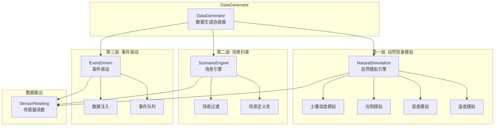
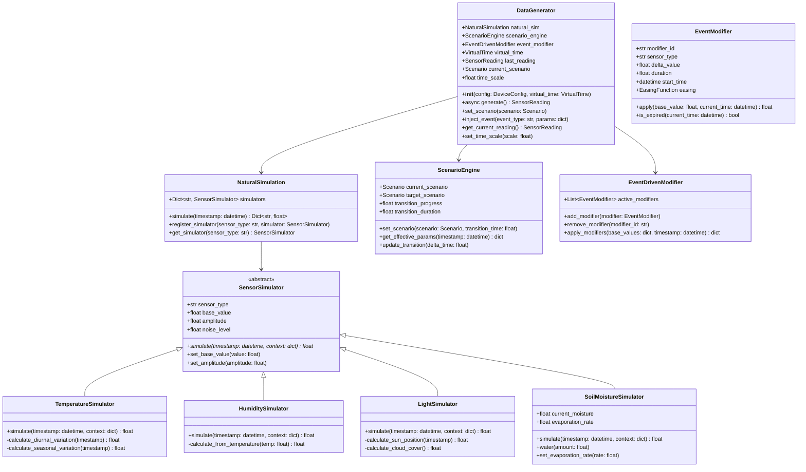

# 数据生成器设计

## 概述

数据生成器（DataGenerator）是虚拟设备的核心组件，负责模拟传感器数据。采用三层数据生成策略：自然现象模拟 + 场景约束 + 事件驱动。

---

## 架构图



---

## 类图



---

## 三层数据生成策略

### 第一层：自然现象模拟

```python
class NaturalSimulation:
    """
    自然现象模拟引擎
    
    基于物理规律模拟自然环境变化：
    - 温度：日温差 + 季节性变化
    - 湿度：与温度负相关
    - 光照：日照周期 + 天气影响
    - 土壤湿度：蒸发 + 渗透
    """
    
    def __init__(self, virtual_time: VirtualTime):
        self.virtual_time = virtual_time
        self.simulators: Dict[str, SensorSimulator] = {}
        self._register_default_simulators()
    
    def _register_default_simulators(self):
        """注册默认传感器模拟器"""
        self.simulators['temperature'] = TemperatureSimulator()
        self.simulators['humidity'] = HumiditySimulator()
        self.simulators['light'] = LightSimulator()
        self.simulators['soil_moisture'] = SoilMoistureSimulator()
        self.simulators['battery'] = BatterySimulator()
    
    async def simulate(self, timestamp: Optional[datetime] = None) -> Dict[str, float]:
        """
        生成自然模拟数据
        
        Args:
            timestamp: 模拟时间点，None使用当前虚拟时间
            
        Returns:
            Dict[str, float]: 各传感器读数
        """
        if timestamp is None:
            timestamp = self.virtual_time.now()
        
        # 构建上下文（用于传感器间依赖）
        context = {'timestamp': timestamp}
        
        results = {}
        for sensor_type, simulator in self.simulators.items():
            # 添加已计算的传感器值到上下文
            context.update(results)
            
            # 模拟该传感器
            value = await simulator.simulate(timestamp, context)
            results[sensor_type] = value
        
        return results
```

#### 温度模拟器

```python
class TemperatureSimulator(SensorSimulator):
    """
    温度模拟器
    
    模拟原理：
    T = base + diurnal_variation + seasonal_variation + noise
    
    日温差：正弦曲线，峰值在14:00，谷值在04:00
    季节性：正弦曲线，峰值在夏季，谷值在冬季
    """
    
    def __init__(self):
        super().__init__()
        self.sensor_type = 'temperature'
        self.base_value = 22.0  # 基础温度 °C
        self.amplitude = 5.0    # 日温差幅度
        self.noise_level = 0.3  # 随机噪声
        
        # 季节性参数
        self.seasonal_amplitude = 10.0  # 季节性温差
        self.year_phase = 0  # 年初相位
    
    async def simulate(self, timestamp: datetime, context: dict) -> float:
        """模拟温度"""
        # 日温差（正弦曲线，周期24小时）
        hour = timestamp.hour + timestamp.minute / 60
        diurnal = self.amplitude * math.sin(2 * math.pi * (hour - 4) / 24)
        
        # 季节性变化（正弦曲线，周期1年）
        day_of_year = timestamp.timetuple().tm_yday
        seasonal = self.seasonal_amplitude * math.sin(
            2 * math.pi * (day_of_year - 15) / 365 - math.pi / 2
        )
        
        # 随机噪声
        noise = random.gauss(0, self.noise_level)
        
        temperature = self.base_value + diurnal + seasonal + noise
        return round(temperature, 1)
```

#### 湿度模拟器

```python
class HumiditySimulator(SensorSimulator):
    """
    湿度模拟器
    
    模拟原理：
    湿度与温度负相关，温度越高湿度越低
    夜间湿度上升，白天湿度下降
    """
    
    def __init__(self):
        super().__init__()
        self.sensor_type = 'humidity'
        self.base_value = 50.0  # 基础湿度 %
        self.amplitude = 15.0   # 日变化幅度
        self.noise_level = 2.0
        self.temp_coefficient = -0.8  # 温度相关系数
    
    async def simulate(self, timestamp: datetime, context: dict) -> float:
        """模拟湿度"""
        # 基础日变化（与温度相反）
        hour = timestamp.hour + timestamp.minute / 60
        diurnal = self.amplitude * math.sin(2 * math.pi * (hour - 16) / 24)
        
        # 温度影响（温度高则湿度低）
        temp_effect = 0
        if 'temperature' in context:
            temp = context['temperature']
            temp_effect = (temp - 22) * self.temp_coefficient
        
        # 随机噪声
        noise = random.gauss(0, self.noise_level)
        
        humidity = self.base_value + diurnal + temp_effect + noise
        return max(0, min(100, round(humidity, 1)))
```

#### 光照模拟器

```python
class LightSimulator(SensorSimulator):
    """
    光照模拟器
    
    模拟原理：
    白天光照强，夜间光照弱
    正午最强，早晚较弱
    受天气影响（云层遮挡）
    """
    
    def __init__(self):
        super().__init__()
        self.sensor_type = 'light'
        self.max_light = 50000  # 最大光照 lux
        self.min_light = 10     # 夜间光照 lux
        self.cloud_factor = 0.0  # 云层遮挡系数 0-1
        self.noise_level = 100
    
    async def simulate(self, timestamp: datetime, context: dict) -> float:
        """模拟光照"""
        hour = timestamp.hour + timestamp.minute / 60
        
        # 计算太阳高度角（简化模型）
        # 日出6:00，日落18:00
        if hour < 6 or hour > 18:
            # 夜间
            light = self.min_light
        else:
            # 白天，正弦分布
            day_progress = (hour - 6) / 12  # 0-1
            sun_factor = math.sin(day_progress * math.pi)
            light = self.min_light + (self.max_light - self.min_light) * sun_factor
        
        # 云层遮挡
        light = light * (1 - self.cloud_factor * 0.7)
        
        # 随机噪声
        noise = random.gauss(0, self.noise_level)
        light = max(0, light + noise)
        
        return int(light)
```

#### 土壤湿度模拟器

```python
class SoilMoistureSimulator(SensorSimulator):
    """
    土壤湿度模拟器
    
    模拟原理：
    - 浇水后湿度瞬间上升
    - 随时间缓慢蒸发下降
    - 温度高蒸发快
    """
    
    def __init__(self):
        super().__init__()
        self.sensor_type = 'soil_moisture'
        self.current_moisture = 40.0  # 当前湿度 %
        self.evaporation_rate = 0.5   # 基础蒸发率 %/小时
        self.max_moisture = 100.0
        self.min_moisture = 10.0
        self.last_update = datetime.now()
    
    async def simulate(self, timestamp: datetime, context: dict) -> float:
        """模拟土壤湿度"""
        # 计算时间差
        time_diff = (timestamp - self.last_update).total_seconds() / 3600  # 小时
        
        if time_diff > 0:
            # 温度影响蒸发率
            evap_rate = self.evaporation_rate
            if 'temperature' in context:
                temp = context['temperature']
                # 温度越高蒸发越快
                evap_rate *= (1 + (temp - 20) * 0.05)
            
            # 蒸发导致湿度下降
            moisture_loss = evap_rate * time_diff
            self.current_moisture = max(
                self.min_moisture,
                self.current_moisture - moisture_loss
            )
            
            self.last_update = timestamp
        
        # 添加微小随机波动
        noise = random.gauss(0, 0.5)
        moisture = max(0, min(100, self.current_moisture + noise))
        
        return round(moisture, 1)
    
    def water(self, amount: float) -> None:
        """
        浇水
        
        Args:
            amount: 浇水量 ml，影响湿度上升幅度
        """
        # 浇水量转换为湿度上升
        moisture_increase = amount * 0.1  # 100ml = 10%湿度
        self.current_moisture = min(
            self.max_moisture,
            self.current_moisture + moisture_increase
        )
```

---

### 第二层：场景约束

```python
@dataclass
class Scenario:
    """场景定义"""
    scenario_id: str
    scenario_name: str
    description: str
    category: str  # normal, extreme, seasonal, custom
    parameters: Dict[str, dict]  # 各传感器参数
    transition_time: float = 300.0  # 默认过渡时间5分钟


class ScenarioEngine:
    """
    场景引擎
    
    管理场景切换，支持平滑过渡
    """
    
    def __init__(self):
        self.current_scenario: Optional[Scenario] = None
        self.target_scenario: Optional[Scenario] = None
        self.transition_progress: float = 0.0  # 0.0 - 1.0
        self.transition_duration: float = 0.0
        self.in_transition: bool = False
        
        # 内置场景
        self._builtin_scenarios = self._load_builtin_scenarios()
    
    def _load_builtin_scenarios(self) -> Dict[str, Scenario]:
        """加载内置场景"""
        return {
            'normal': Scenario(
                scenario_id='normal',
                scenario_name='正常模式',
                description='标准室内环境',
                category='normal',
                parameters={
                    'temperature': {'base': 22, 'amplitude': 3},
                    'humidity': {'base': 50, 'amplitude': 10},
                    'light': {'day_peak': 5000, 'night_base': 10},
                    'soil_moisture': {'base': 40, 'decay_rate': 0.5}
                }
            ),
            'high_temperature': Scenario(
                scenario_id='high_temperature',
                scenario_name='高温模式',
                description='夏季高温环境',
                category='extreme',
                parameters={
                    'temperature': {'base': 32, 'amplitude': 5},
                    'humidity': {'base': 30, 'amplitude': 5},
                    'light': {'day_peak': 80000, 'night_base': 10},
                    'soil_moisture': {'base': 30, 'decay_rate': 1.0}
                }
            ),
            'low_temperature': Scenario(
                scenario_id='low_temperature',
                scenario_name='低温模式',
                description='冬季低温环境',
                category='extreme',
                parameters={
                    'temperature': {'base': 8, 'amplitude': 3},
                    'humidity': {'base': 60, 'amplitude': 10},
                    'light': {'day_peak': 3000, 'night_base': 5},
                    'soil_moisture': {'base': 50, 'decay_rate': 0.2}
                }
            ),
            'high_humidity': Scenario(
                scenario_id='high_humidity',
                scenario_name='高湿模式',
                description='潮湿环境',
                category='extreme',
                parameters={
                    'temperature': {'base': 25, 'amplitude': 2},
                    'humidity': {'base': 85, 'amplitude': 5},
                    'light': {'day_peak': 4000, 'night_base': 10},
                    'soil_moisture': {'base': 70, 'decay_rate': 0.3}
                }
            ),
            'dry': Scenario(
                scenario_id='dry',
                scenario_name='干燥模式',
                description='干燥环境',
                category='extreme',
                parameters={
                    'temperature': {'base': 28, 'amplitude': 4},
                    'humidity': {'base': 25, 'amplitude': 5},
                    'light': {'day_peak': 6000, 'night_base': 10},
                    'soil_moisture': {'base': 20, 'decay_rate': 0.8}
                }
            ),
            'strong_light': Scenario(
                scenario_id='strong_light',
                scenario_name='强光模式',
                description='阳光直射',
                category='extreme',
                parameters={
                    'temperature': {'base': 30, 'amplitude': 6},
                    'humidity': {'base': 35, 'amplitude': 8},
                    'light': {'day_peak': 100000, 'night_base': 10},
                    'soil_moisture': {'base': 35, 'decay_rate': 1.2}
                }
            ),
            'weak_light': Scenario(
                scenario_id='weak_light',
                scenario_name='弱光模式',
                description='阴暗环境',
                category='extreme',
                parameters={
                    'temperature': {'base': 18, 'amplitude': 2},
                    'humidity': {'base': 55, 'amplitude': 8},
                    'light': {'day_peak': 500, 'night_base': 5},
                    'soil_moisture': {'base': 45, 'decay_rate': 0.3}
                }
            )
        }
    
    def set_scenario(self, scenario: Scenario, transition_time: float = 300.0) -> None:
        """
        设置目标场景，开始过渡
        
        Args:
            scenario: 目标场景
            transition_time: 过渡时间（秒）
        """
        if self.current_scenario is None:
            # 首次设置，直接应用
            self.current_scenario = scenario
            return
        
        self.target_scenario = scenario
        self.transition_duration = transition_time
        self.transition_progress = 0.0
        self.in_transition = True
    
    def update_transition(self, delta_time: float) -> None:
        """
        更新过渡进度
        
        Args:
            delta_time: 时间增量（秒）
        """
        if not self.in_transition:
            return
        
        self.transition_progress += delta_time / self.transition_duration
        
        if self.transition_progress >= 1.0:
            # 过渡完成
            self.current_scenario = self.target_scenario
            self.target_scenario = None
            self.transition_progress = 0.0
            self.in_transition = False
    
    def get_effective_params(self, sensor_type: str) -> dict:
        """
        获取当前有效的场景参数
        
        如果在过渡中，返回插值后的参数
        """
        if not self.in_transition or self.target_scenario is None:
            # 不在过渡中，返回当前场景参数
            if self.current_scenario:
                return self.current_scenario.parameters.get(sensor_type, {})
            return {}
        
        # 在过渡中，插值计算
        current_params = self.current_scenario.parameters.get(sensor_type, {})
        target_params = self.target_scenario.parameters.get(sensor_type, {})
        
        # 线性插值
        effective_params = {}
        all_keys = set(current_params.keys()) | set(target_params.keys())
        
        for key in all_keys:
            current_val = current_params.get(key, 0)
            target_val = target_params.get(key, current_val)
            
            # 缓动函数（ease-in-out）
            t = self.transition_progress
            eased_t = t * t * (3 - 2 * t)  # smoothstep
            
            effective_params[key] = current_val + (target_val - current_val) * eased_t
        
        return effective_params
```

---

### 第三层：事件驱动

```python
class EventDrivenModifier:
    """
    事件驱动修饰器
    
    处理事件触发的数据变化
    """
    
    def __init__(self):
        self.active_modifiers: List[EventModifier] = []
        self._lock = asyncio.Lock()
    
    async def add_modifier(self, modifier: EventModifier) -> None:
        """添加修饰器"""
        async with self._lock:
            self.active_modifiers.append(modifier)
    
    async def remove_modifier(self, modifier_id: str) -> bool:
        """移除修饰器"""
        async with self._lock:
            for i, mod in enumerate(self.active_modifiers):
                if mod.modifier_id == modifier_id:
                    self.active_modifiers.pop(i)
                    return True
            return False
    
    async def apply_modifiers(
        self,
        base_values: Dict[str, float],
        timestamp: datetime
    ) -> Dict[str, float]:
        """
        应用所有活跃的修饰器
        
        Args:
            base_values: 基础数据值
            timestamp: 当前时间
            
        Returns:
            修饰后的数据值
        """
        result = base_values.copy()
        expired_modifiers = []
        
        async with self._lock:
            for modifier in self.active_modifiers:
                if modifier.is_expired(timestamp):
                    expired_modifiers.append(modifier)
                    continue
                
                if modifier.sensor_type in result:
                    result[modifier.sensor_type] = modifier.apply(
                        result[modifier.sensor_type],
                        timestamp
                    )
            
            # 清理过期修饰器
            for mod in expired_modifiers:
                self.active_modifiers.remove(mod)
        
        return result


class EventModifier:
    """
    事件修饰器
    
    定义事件对传感器数据的影响
    """
    
    def __init__(
        self,
        modifier_id: str,
        sensor_type: str,
        delta_value: float,
        duration: float,
        easing: str = 'ease_out'
    ):
        self.modifier_id = modifier_id
        self.sensor_type = sensor_type
        self.delta_value = delta_value
        self.duration = duration
        self.start_time = datetime.now()
        self.easing = easing
    
    def apply(self, base_value: float, current_time: datetime) -> float:
        """应用修饰"""
        elapsed = (current_time - self.start_time).total_seconds()
        progress = min(1.0, elapsed / self.duration)
        
        # 应用缓动函数
        if self.easing == 'linear':
            factor = progress
        elif self.easing == 'ease_in':
            factor = progress * progress
        elif self.easing == 'ease_out':
            factor = 1 - (1 - progress) * (1 - progress)
        elif self.easing == 'ease_in_out':
            factor = progress * progress * (3 - 2 * progress)
        else:
            factor = progress
        
        return base_value + self.delta_value * factor
    
    def is_expired(self, current_time: datetime) -> bool:
        """检查是否过期"""
        elapsed = (current_time - self.start_time).total_seconds()
        return elapsed >= self.duration
```

---

## 数据生成器主类

```python
class DataGenerator:
    """
    数据生成器
    
    协调三层数据生成策略
    """
    
    def __init__(self, config: DeviceConfig, virtual_time: VirtualTime):
        self.config = config
        self.virtual_time = virtual_time
        
        # 三层组件
        self.natural_sim = NaturalSimulation(virtual_time)
        self.scenario_engine = ScenarioEngine()
        self.event_modifier = EventDrivenModifier()
        
        # 当前场景
        self.current_scenario: Optional[Scenario] = None
        
        # 最后读数
        self.last_reading: Optional[SensorReading] = None
        
        # 初始化场景
        self.set_scenario_by_id(config.initial_scenario)
    
    async def generate(self) -> SensorReading:
        """
        生成传感器读数
        
        流程：
        1. 自然模拟生成基础数据
        2. 应用场景约束
        3. 应用事件修饰
        4. 返回最终读数
        """
        timestamp = self.virtual_time.now()
        
        # 1. 自然模拟
        base_values = await self.natural_sim.simulate(timestamp)
        
        # 2. 应用场景约束
        scenario_values = self._apply_scenario(base_values, timestamp)
        
        # 3. 应用事件修饰
        final_values = await self.event_modifier.apply_modifiers(
            scenario_values, timestamp
        )
        
        # 4. 构建读数对象
        reading = SensorReading(
            timestamp=timestamp,
            device_id=self.config.device_id,
            temperature=final_values.get('temperature'),
            humidity=final_values.get('humidity'),
            light=final_values.get('light'),
            soil_moisture=final_values.get('soil_moisture'),
            battery=final_values.get('battery')
        )
        
        self.last_reading = reading
        return reading
    
    def _apply_scenario(
        self,
        base_values: Dict[str, float],
        timestamp: datetime
    ) -> Dict[str, float]:
        """应用场景参数"""
        if self.current_scenario is None:
            return base_values
        
        result = base_values.copy()
        
        for sensor_type in result.keys():
            params = self.scenario_engine.get_effective_params(sensor_type)
            
            if 'base' in params:
                # 使用场景的基础值
                result[sensor_type] = params['base']
            
            if 'amplitude' in params and sensor_type in base_values:
                # 保留波动幅度，但使用场景的基础值
                variation = base_values[sensor_type] - self._get_default_base(sensor_type)
                result[sensor_type] = params['base'] + variation * (params['amplitude'] / self._get_default_amplitude(sensor_type))
        
        return result
    
    def set_scenario(self, scenario: Scenario, transition_time: float = 300.0) -> None:
        """设置场景"""
        self.current_scenario = scenario
        self.scenario_engine.set_scenario(scenario, transition_time)
    
    def set_scenario_by_id(self, scenario_id: str, transition_time: float = 300.0) -> bool:
        """通过ID设置场景"""
        scenario = self.scenario_engine._builtin_scenarios.get(scenario_id)
        if scenario:
            self.set_scenario(scenario, transition_time)
            return True
        return False
    
    def inject_event(self, event_type: str, params: dict) -> None:
        """
        注入事件
        
        根据事件类型创建对应的修饰器
        """
        modifier_id = f"event_{event_type}_{int(time.time() * 1000)}"
        
        if event_type == 'watering':
            # 浇水：土壤湿度上升
            amount = params.get('amount', 200)
            # 通过土壤湿度模拟器直接修改
            soil_sim = self.natural_sim.get_simulator('soil_moisture')
            if isinstance(soil_sim, SoilMoistureSimulator):
                soil_sim.water(amount)
        
        elif event_type == 'temperature_spike':
            # 温度骤升
            delta = params.get('delta', 10)
            duration = params.get('duration', 300)
            modifier = EventModifier(
                modifier_id=modifier_id,
                sensor_type='temperature',
                delta_value=delta,
                duration=duration,
                easing='ease_in_out'
            )
            asyncio.create_task(self.event_modifier.add_modifier(modifier))
        
        elif event_type == 'sensor_fault':
            # 传感器故障：数据异常或停止
            sensor_type = params.get('sensor_type')
            # 创建异常值修饰器
            modifier = EventModifier(
                modifier_id=modifier_id,
                sensor_type=sensor_type,
                delta_value=float('nan'),
                duration=float('inf'),
                easing='linear'
            )
            asyncio.create_task(self.event_modifier.add_modifier(modifier))
    
    def get_current_reading(self) -> Optional[SensorReading]:
        """获取当前读数"""
        return self.last_reading
    
    def set_time_scale(self, scale: float) -> None:
        """设置时间缩放"""
        self.virtual_time.set_scale(scale)
```

---

## 使用示例

```python
async def main():
    from core.virtual_time import VirtualTime
    
    # 创建虚拟时间
    vt = VirtualTime()
    
    # 创建设备配置
    config = DeviceConfig(
        device_id='VD001',
        initial_scenario='normal'
    )
    
    # 创建数据生成器
    generator = DataGenerator(config, vt)
    
    # 生成数据
    for i in range(10):
        reading = await generator.generate()
        print(f"[{reading.timestamp}] T:{reading.temperature}°C H:{reading.humidity}%")
        await asyncio.sleep(1)
    
    # 切换到高温场景
    generator.set_scenario_by_id('high_temperature', transition_time=60)
    
    # 模拟浇水事件
    generator.inject_event('watering', {'amount': 200})
    
    # 继续生成数据
    for i in range(10):
        reading = await generator.generate()
        print(f"[{reading.timestamp}] T:{reading.temperature}°C Soil:{reading.soil_moisture}%")
        await asyncio.sleep(1)
```
