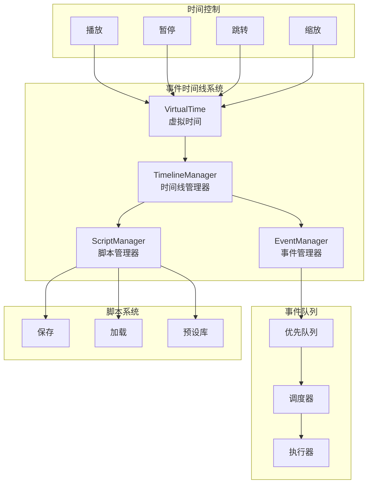
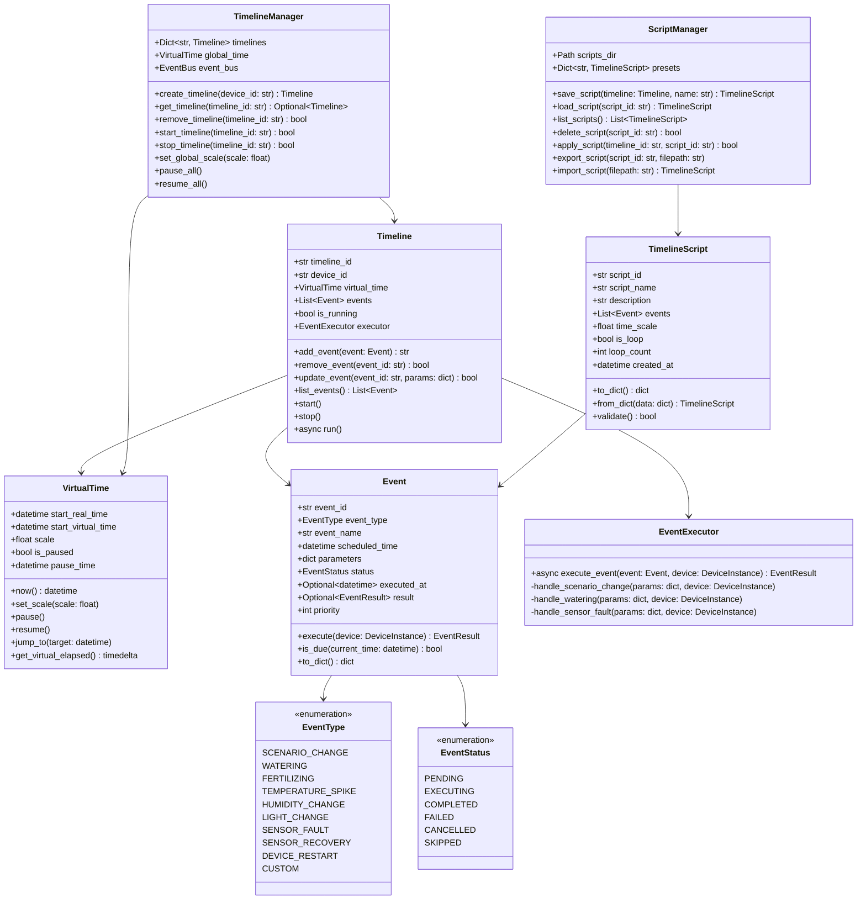

# 事件时间线设计

## 概述

事件时间线（Event Timeline）系统提供虚拟时间控制、事件编排和自动化测试能力。支持时间加速/暂停/跳转，以及可视化的事件编排。

---

## 架构图



---

## 类图



---

## 虚拟时间系统

```python
@dataclass
class VirtualTime:
    """
    虚拟时间系统
    
    提供时间加速、暂停、跳转功能
    """
    
    # 真实时间起点
    _start_real_time: datetime = field(default_factory=datetime.now)
    
    # 虚拟时间起点
    _start_virtual_time: datetime = field(default_factory=lambda: datetime(2024, 1, 1))
    
    # 时间缩放倍数（1.0 = 实时）
    _scale: float = 1.0
    
    # 暂停状态
    _is_paused: bool = False
    _pause_time: Optional[datetime] = None
    
    # 累计暂停时长
    _total_pause_duration: timedelta = field(default_factory=lambda: timedelta(0))
    
    # 锁
    _lock: asyncio.Lock = field(default_factory=asyncio.Lock)
    
    def now(self) -> datetime:
        """
        获取当前虚拟时间
        
        Returns:
            当前虚拟时间
        """
        if self._is_paused:
            # 暂停时返回暂停时刻的虚拟时间
            paused_virtual = self._calculate_virtual_time(self._pause_time)
            return paused_virtual
        
        return self._calculate_virtual_time(datetime.now())
    
    def _calculate_virtual_time(self, real_time: datetime) -> datetime:
        """计算虚拟时间"""
        real_elapsed = real_time - self._start_real_time - self._total_pause_duration
        virtual_elapsed = real_elapsed * self._scale
        return self._start_virtual_time + virtual_elapsed
    
    def set_scale(self, scale: float) -> None:
        """
        设置时间缩放倍数
        
        Args:
            scale: 缩放倍数（0.1 = 慢10倍，10 = 快10倍）
        """
        if scale <= 0:
            raise ValueError("时间缩放倍数必须大于0")
        
        # 调整起点以保持当前虚拟时间不变
        current_virtual = self.now()
        self._start_virtual_time = current_virtual
        self._start_real_time = datetime.now()
        self._total_pause_duration = timedelta(0)
        
        self._scale = scale
    
    def pause(self) -> None:
        """暂停虚拟时间"""
        if not self._is_paused:
            self._is_paused = True
            self._pause_time = datetime.now()
    
    def resume(self) -> None:
        """恢复虚拟时间"""
        if self._is_paused:
            pause_duration = datetime.now() - self._pause_time
            self._total_pause_duration += pause_duration
            self._is_paused = False
            self._pause_time = None
    
    def jump_to(self, target_time: datetime) -> None:
        """
        跳转到指定虚拟时间
        
        Args:
            target_time: 目标虚拟时间
        """
        self._start_virtual_time = target_time
        self._start_real_time = datetime.now()
        self._total_pause_duration = timedelta(0)
    
    def jump_by(self, delta: timedelta) -> None:
        """
        相对跳转
        
        Args:
            delta: 时间增量
        """
        current = self.now()
        self.jump_to(current + delta)
    
    def get_scale(self) -> float:
        """获取当前时间缩放倍数"""
        return self._scale
    
    def is_paused(self) -> bool:
        """检查是否暂停"""
        return self._is_paused
    
    def get_virtual_elapsed(self) -> timedelta:
        """获取虚拟时间流逝量"""
        return self.now() - self._start_virtual_time
```

---

## 事件定义

```python
from enum import Enum, auto
from typing import Optional, Dict, Any
from dataclasses import dataclass, field
from datetime import datetime


class EventType(Enum):
    """事件类型"""
    SCENARIO_CHANGE = "scenario_change"      # 场景切换
    WATERING = "watering"                    # 浇水
    FERTILIZING = "fertilizing"              # 施肥
    TEMPERATURE_SPIKE = "temperature_spike"  # 温度骤变
    HUMIDITY_CHANGE = "humidity_change"      # 湿度变化
    LIGHT_CHANGE = "light_change"            # 光照变化
    SENSOR_FAULT = "sensor_fault"            # 传感器故障
    SENSOR_RECOVERY = "sensor_recovery"      # 传感器恢复
    DEVICE_RESTART = "device_restart"        # 设备重启
    CUSTOM = "custom"                        # 自定义事件


class EventStatus(Enum):
    """事件状态"""
    PENDING = "pending"         # 待执行
    EXECUTING = "executing"     # 执行中
    COMPLETED = "completed"     # 已完成
    FAILED = "failed"           # 失败
    CANCELLED = "cancelled"     # 已取消
    SKIPPED = "skipped"         # 已跳过


@dataclass
class EventResult:
    """事件执行结果"""
    success: bool
    message: str
    data: Optional[Dict[str, Any]] = None


@dataclass
class Event:
    """
    事件定义
    """
    event_id: str
    event_type: EventType
    event_name: str
    scheduled_time: datetime
    parameters: Dict[str, Any] = field(default_factory=dict)
    status: EventStatus = EventStatus.PENDING
    priority: int = 5
    created_at: datetime = field(default_factory=datetime.now)
    executed_at: Optional[datetime] = None
    result: Optional[EventResult] = None
    
    def is_due(self, current_time: datetime) -> bool:
        """检查事件是否到期"""
        return current_time >= self.scheduled_time and self.status == EventStatus.PENDING
    
    def to_dict(self) -> dict:
        """转换为字典"""
        return {
            'event_id': self.event_id,
            'event_type': self.event_type.value,
            'event_name': self.event_name,
            'scheduled_time': self.scheduled_time.isoformat(),
            'parameters': self.parameters,
            'status': self.status.value,
            'priority': self.priority,
            'created_at': self.created_at.isoformat(),
            'executed_at': self.executed_at.isoformat() if self.executed_at else None,
            'result': {
                'success': self.result.success,
                'message': self.result.message
            } if self.result else None
        }
    
    @classmethod
    def from_dict(cls, data: dict) -> 'Event':
        """从字典创建"""
        return cls(
            event_id=data['event_id'],
            event_type=EventType(data['event_type']),
            event_name=data['event_name'],
            scheduled_time=datetime.fromisoformat(data['scheduled_time']),
            parameters=data.get('parameters', {}),
            status=EventStatus(data.get('status', 'pending')),
            priority=data.get('priority', 5),
            created_at=datetime.fromisoformat(data['created_at']),
            executed_at=datetime.fromisoformat(data['executed_at']) if data.get('executed_at') else None,
            result=EventResult(**data['result']) if data.get('result') else None
        )


# 事件优先级定义
EVENT_PRIORITIES = {
    EventType.DEVICE_RESTART: 1,      # 最高优先级
    EventType.SENSOR_FAULT: 2,
    EventType.SCENARIO_CHANGE: 3,
    EventType.WATERING: 4,
    EventType.FERTILIZING: 4,
    EventType.TEMPERATURE_SPIKE: 5,
    EventType.HUMIDITY_CHANGE: 6,
    EventType.LIGHT_CHANGE: 6,
    EventType.SENSOR_RECOVERY: 7,
    EventType.CUSTOM: 10,             # 最低优先级
}


def create_event(
    event_type: EventType,
    scheduled_time: datetime,
    parameters: Optional[Dict[str, Any]] = None,
    event_name: Optional[str] = None
) -> Event:
    """
    创建事件工厂函数
    
    Args:
        event_type: 事件类型
        scheduled_time: 计划执行时间
        parameters: 事件参数
        event_name: 事件名称（可选）
        
    Returns:
        Event: 事件对象
    """
    event_id = f"EVT{int(time.time() * 1000)}{random.randint(1000, 9999)}"
    
    if event_name is None:
        event_name = f"{event_type.value}_{event_id[-4:]}"
    
    priority = EVENT_PRIORITIES.get(event_type, 5)
    
    return Event(
        event_id=event_id,
        event_type=event_type,
        event_name=event_name,
        scheduled_time=scheduled_time,
        parameters=parameters or {},
        priority=priority
    )
```

---

## 时间线实现

```python
class Timeline:
    """
    时间线
    
    管理一组按时间顺序执行的事件
    """
    
    def __init__(
        self,
        timeline_id: Optional[str] = None,
        device_id: Optional[str] = None,
        virtual_time: Optional[VirtualTime] = None
    ):
        self.timeline_id = timeline_id or f"TL{int(time.time() * 1000)}"
        self.device_id = device_id
        self.virtual_time = virtual_time or VirtualTime()
        
        # 事件列表（按时间排序）
        self.events: List[Event] = []
        self._events_lock = asyncio.Lock()
        
        # 运行状态
        self.is_running = False
        self._stop_event = asyncio.Event()
        
        # 事件执行器
        self.executor = EventExecutor()
        
        # 设备引用（用于执行事件）
        self._device: Optional[DeviceInstance] = None
        
        # 统计
        self._executed_count = 0
        self._failed_count = 0
    
    async def add_event(self, event: Event) -> str:
        """
        添加事件
        
        Args:
            event: 事件对象
            
        Returns:
            str: 事件ID
        """
        async with self._events_lock:
            self.events.append(event)
            # 按时间和优先级排序
            self.events.sort(key=lambda e: (e.scheduled_time, e.priority))
        
        return event.event_id
    
    async def remove_event(self, event_id: str) -> bool:
        """移除事件"""
        async with self._events_lock:
            for i, event in enumerate(self.events):
                if event.event_id == event_id:
                    if event.status == EventStatus.PENDING:
                        self.events.pop(i)
                        return True
                    else:
                        # 已执行的事件不能移除
                        return False
            return False
    
    async def update_event(
        self,
        event_id: str,
        params: Dict[str, Any]
    ) -> bool:
        """更新事件"""
        async with self._events_lock:
            for event in self.events:
                if event.event_id == event_id:
                    if event.status != EventStatus.PENDING:
                        return False
                    
                    # 更新允许修改的字段
                    if 'scheduled_time' in params:
                        event.scheduled_time = params['scheduled_time']
                    if 'parameters' in params:
                        event.parameters.update(params['parameters'])
                    if 'priority' in params:
                        event.priority = params['priority']
                    
                    # 重新排序
                    self.events.sort(key=lambda e: (e.scheduled_time, e.priority))
                    return True
            return False
    
    def list_events(
        self,
        status: Optional[EventStatus] = None
    ) -> List[Event]:
        """列出事件"""
        if status:
            return [e for e in self.events if e.status == status]
        return self.events.copy()
    
    async def start(self, device: DeviceInstance) -> None:
        """启动时间线"""
        self._device = device
        self.is_running = True
        self._stop_event.clear()
        
        # 启动事件循环
        asyncio.create_task(self._event_loop())
    
    async def stop(self) -> None:
        """停止时间线"""
        self.is_running = False
        self._stop_event.set()
    
    async def _event_loop(self) -> None:
        """事件执行循环"""
        while self.is_running:
            try:
                current_time = self.virtual_time.now()
                
                # 查找到期事件
                due_events = []
                async with self._events_lock:
                    for event in self.events:
                        if event.is_due(current_time):
                            due_events.append(event)
                        elif event.scheduled_time > current_time:
                            # 事件按时间排序，后面的都还没到时间
                            break
                
                # 执行到期事件
                for event in due_events:
                    if not self.is_running:
                        break
                    
                    await self._execute_event(event)
                
                # 等待一小段时间再检查
                await asyncio.wait_for(
                    self._stop_event.wait(),
                    timeout=0.1
                )
                
            except asyncio.TimeoutError:
                continue
            except Exception as e:
                logger.error(f"时间线 {self.timeline_id} 事件循环错误: {e}")
                await asyncio.sleep(1)
    
    async def _execute_event(self, event: Event) -> None:
        """执行单个事件"""
        if not self._device:
            return
        
        event.status = EventStatus.EXECUTING
        event.executed_at = datetime.now()
        
        try:
            result = await self.executor.execute_event(event, self._device)
            event.result = result
            
            if result.success:
                event.status = EventStatus.COMPLETED
                self._executed_count += 1
            else:
                event.status = EventStatus.FAILED
                self._failed_count += 1
                
        except Exception as e:
            event.status = EventStatus.FAILED
            event.result = EventResult(success=False, message=str(e))
            self._failed_count += 1
            logger.error(f"事件 {event.event_id} 执行失败: {e}")


class EventExecutor:
    """事件执行器"""
    
    async def execute_event(
        self,
        event: Event,
        device: DeviceInstance
    ) -> EventResult:
        """执行事件"""
        handlers = {
            EventType.SCENARIO_CHANGE: self._handle_scenario_change,
            EventType.WATERING: self._handle_watering,
            EventType.FERTILIZING: self._handle_fertilizing,
            EventType.TEMPERATURE_SPIKE: self._handle_temperature_spike,
            EventType.SENSOR_FAULT: self._handle_sensor_fault,
            EventType.SENSOR_RECOVERY: self._handle_sensor_recovery,
            EventType.DEVICE_RESTART: self._handle_device_restart,
            EventType.CUSTOM: self._handle_custom,
        }
        
        handler = handlers.get(event.event_type)
        if handler:
            return await handler(event.parameters, device)
        
        return EventResult(success=False, message=f"未知事件类型: {event.event_type}")
    
    async def _handle_scenario_change(
        self,
        params: dict,
        device: DeviceInstance
    ) -> EventResult:
        """处理场景切换"""
        scenario_id = params.get('scenario_id')
        if not scenario_id:
            return EventResult(success=False, message="缺少scenario_id参数")
        
        device.data_generator.set_scenario_by_id(scenario_id)
        return EventResult(
            success=True,
            message=f"切换到场景 {scenario_id}",
            data={'scenario_id': scenario_id}
        )
    
    async def _handle_watering(
        self,
        params: dict,
        device: DeviceInstance
    ) -> EventResult:
        """处理浇水"""
        amount = params.get('amount', 200)
        device.data_generator.inject_event('watering', {'amount': amount})
        return EventResult(
            success=True,
            message=f"浇水 {amount}ml",
            data={'amount': amount}
        )
    
    async def _handle_sensor_fault(
        self,
        params: dict,
        device: DeviceInstance
    ) -> EventResult:
        """处理传感器故障"""
        sensor_type = params.get('sensor_type')
        if not sensor_type:
            return EventResult(success=False, message="缺少sensor_type参数")
        
        device.data_generator.inject_event('sensor_fault', {'sensor_type': sensor_type})
        return EventResult(
            success=True,
            message=f"传感器 {sensor_type} 故障",
            data={'sensor_type': sensor_type}
        )
    
    async def _handle_custom(
        self,
        params: dict,
        device: DeviceInstance
    ) -> EventResult:
        """处理自定义事件"""
        # 自定义事件通过回调处理
        return EventResult(success=True, message="自定义事件已处理")
```

---

## 脚本管理

```python
@dataclass
class TimelineScript:
    """时间线脚本"""
    script_id: str
    script_name: str
    description: str
    events: List[Event]
    time_scale: float = 1.0
    is_loop: bool = False
    loop_count: int = 0  # 0表示无限循环
    created_at: datetime = field(default_factory=datetime.now)
    updated_at: datetime = field(default_factory=datetime.now)
    
    def to_dict(self) -> dict:
        """转换为字典"""
        return {
            'script_id': self.script_id,
            'script_name': self.script_name,
            'description': self.description,
            'events': [e.to_dict() for e in self.events],
            'time_scale': self.time_scale,
            'is_loop': self.is_loop,
            'loop_count': self.loop_count,
            'created_at': self.created_at.isoformat(),
            'updated_at': self.updated_at.isoformat()
        }
    
    @classmethod
    def from_dict(cls, data: dict) -> 'TimelineScript':
        """从字典创建"""
        return cls(
            script_id=data['script_id'],
            script_name=data['script_name'],
            description=data.get('description', ''),
            events=[Event.from_dict(e) for e in data.get('events', [])],
            time_scale=data.get('time_scale', 1.0),
            is_loop=data.get('is_loop', False),
            loop_count=data.get('loop_count', 0),
            created_at=datetime.fromisoformat(data['created_at']),
            updated_at=datetime.fromisoformat(data.get('updated_at', data['created_at']))
        )
    
    def validate(self) -> bool:
        """验证脚本有效性"""
        if not self.script_id or not self.script_name:
            return False
        
        # 检查事件时间是否有效
        for event in self.events:
            if not event.event_id or not event.scheduled_time:
                return False
        
        return True


class ScriptManager:
    """脚本管理器"""
    
    def __init__(self, scripts_dir: Optional[Path] = None):
        self.scripts_dir = scripts_dir or Path('./scripts')
        self.scripts_dir.mkdir(exist_ok=True)
        
        # 预设脚本
        self.presets: Dict[str, TimelineScript] = {}
        self._load_presets()
    
    def _load_presets(self) -> None:
        """加载预设脚本"""
        # 植物生长周期
        self.presets['plant_growth_cycle'] = self._create_plant_growth_preset()
        
        # 极端天气测试
        self.presets['extreme_weather'] = self._create_extreme_weather_preset()
        
        # 传感器故障测试
        self.presets['sensor_fault_test'] = self._create_sensor_fault_preset()
        
        # 浇水效果测试
        self.presets['watering_effect'] = self._create_watering_effect_preset()
    
    def _create_plant_growth_preset(self) -> TimelineScript:
        """创建植物生长周期预设"""
        base_time = datetime(2024, 1, 1, 8, 0, 0)
        
        events = [
            create_event(
                EventType.SCENARIO_CHANGE,
                base_time,
                {'scenario_id': 'normal'},
                '开始正常模式'
            ),
            create_event(
                EventType.WATERING,
                base_time + timedelta(hours=12),
                {'amount': 200},
                '浇水'
            ),
            create_event(
                EventType.SCENARIO_CHANGE,
                base_time + timedelta(days=1),
                {'scenario_id': 'strong_light'},
                '强光照射'
            ),
            create_event(
                EventType.WATERING,
                base_time + timedelta(days=1, hours=12),
                {'amount': 200},
                '浇水'
            ),
        ]
        
        return TimelineScript(
            script_id='plant_growth_cycle',
            script_name='植物生长周期',
            description='模拟一周的植物生长环境变化',
            events=events,
            time_scale=60.0  # 1分钟 = 1小时
        )
    
    def save_script(
        self,
        timeline: Timeline,
        name: str,
        description: str = ''
    ) -> TimelineScript:
        """保存时间线为脚本"""
        script_id = f"SCRIPT{int(time.time() * 1000)}"
        
        script = TimelineScript(
            script_id=script_id,
            script_name=name,
            description=description,
            events=timeline.events.copy(),
            time_scale=timeline.virtual_time.get_scale()
        )
        
        # 保存到文件
        filepath = self.scripts_dir / f"{script_id}.json"
        with open(filepath, 'w', encoding='utf-8') as f:
            json.dump(script.to_dict(), f, ensure_ascii=False, indent=2)
        
        return script
    
    def load_script(self, script_id: str) -> Optional[TimelineScript]:
        """加载脚本"""
        # 先检查预设
        if script_id in self.presets:
            return self.presets[script_id]
        
        # 从文件加载
        filepath = self.scripts_dir / f"{script_id}.json"
        if filepath.exists():
            with open(filepath, 'r', encoding='utf-8') as f:
                data = json.load(f)
                return TimelineScript.from_dict(data)
        
        return None
    
    def list_scripts(self) -> List[TimelineScript]:
        """列出所有脚本"""
        scripts = list(self.presets.values())
        
        # 加载文件中的脚本
        for filepath in self.scripts_dir.glob('*.json'):
            try:
                with open(filepath, 'r', encoding='utf-8') as f:
                    data = json.load(f)
                    script = TimelineScript.from_dict(data)
                    scripts.append(script)
            except Exception as e:
                logger.error(f"加载脚本文件失败 {filepath}: {e}")
        
        return scripts
    
    def apply_script(self, timeline: Timeline, script_id: str) -> bool:
        """应用脚本到时间线"""
        script = self.load_script(script_id)
        if not script:
            return False
        
        # 清空现有事件
        timeline.events.clear()
        
        # 设置时间缩放
        timeline.virtual_time.set_scale(script.time_scale)
        
        # 添加脚本事件
        for event in script.events:
            asyncio.create_task(timeline.add_event(event))
        
        return True
```

---

## 使用示例

```python
async def main():
    from core.device import DeviceInstance, DeviceConfig
    
    # 创建设备
    config = DeviceConfig(device_name="测试设备")
    device = DeviceInstance(device_id='VD001', device_name='测试设备', config=config)
    
    # 创建时间线
    timeline = Timeline(device_id='VD001')
    
    # 添加事件
    base_time = datetime.now()
    
    event1 = create_event(
        EventType.SCENARIO_CHANGE,
        base_time + timedelta(minutes=1),
        {'scenario_id': 'high_temperature'},
        '切换到高温模式'
    )
    await timeline.add_event(event1)
    
    event2 = create_event(
        EventType.WATERING,
        base_time + timedelta(minutes=2),
        {'amount': 200},
        '浇水'
    )
    await timeline.add_event(event2)
    
    # 设置时间加速（10倍速）
    timeline.virtual_time.set_scale(10.0)
    
    # 启动设备和时间线
    await device.start()
    await timeline.start(device)
    
    # 运行一段时间
    await asyncio.sleep(30)
    
    # 停止
    await timeline.stop()
    await device.stop()


# 使用脚本
async def use_script_example():
    script_mgr = ScriptManager()
    
    # 列出预设脚本
    scripts = script_mgr.list_scripts()
    for script in scripts:
        print(f"{script.script_id}: {script.script_name}")
    
    # 应用脚本
    timeline = Timeline()
    script_mgr.apply_script(timeline, 'plant_growth_cycle')
```
