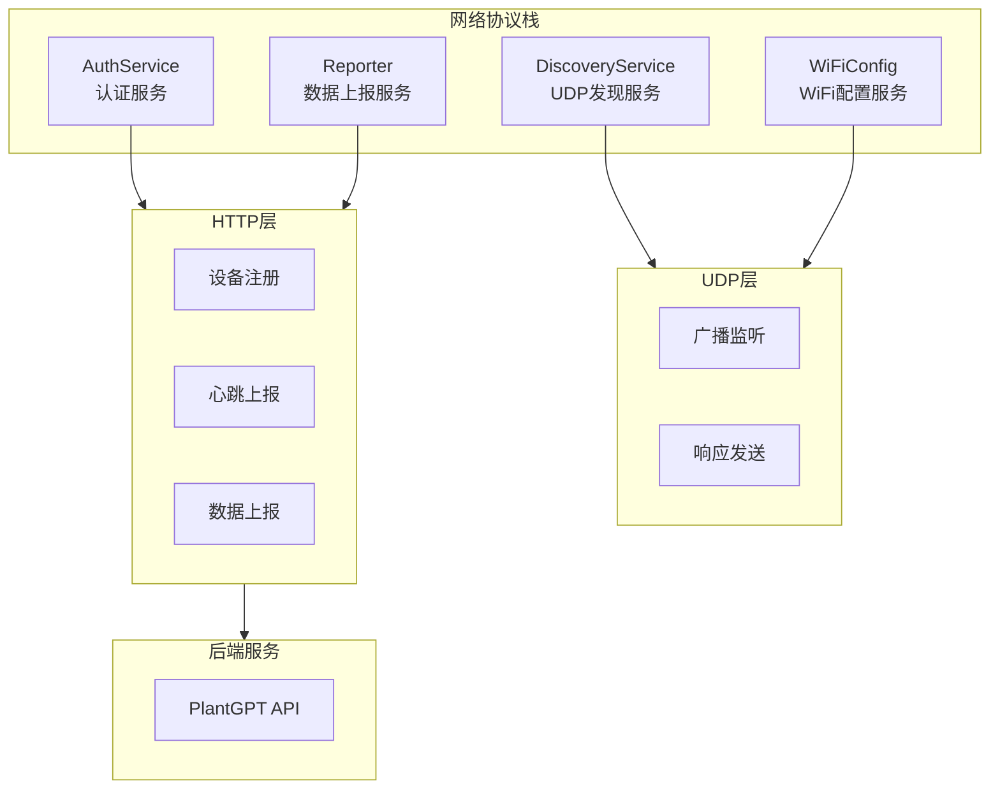
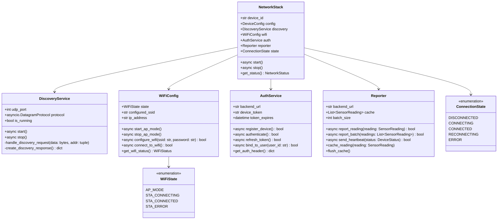

# 网络服务设计

## 概述

网络服务模块模拟真实设备的网络通信功能，包括UDP设备发现、WiFi配网、设备认证和数据上报。

---

## 架构图



---

## 类图



---

## UDP发现服务

```python
class DiscoveryProtocol(asyncio.DatagramProtocol):
    """UDP发现协议"""
    
    def __init__(self, device_id: str, device_name: str, on_discovery: Callable):
        self.device_id = device_id
        self.device_name = device_name
        self.on_discovery = on_discovery
        self.transport = None
    
    def connection_made(self, transport):
        self.transport = transport
    
    def datagram_received(self, data: bytes, addr):
        """接收到UDP数据"""
        try:
            message = json.loads(data.decode('utf-8'))
            
            # 检查是否是发现请求
            if message.get('type') == 'discover':
                self.on_discovery(message, addr)
        except Exception as e:
            logger.error(f"处理发现请求失败: {e}")
    
    def error_received(self, exc):
        logger.error(f"UDP错误: {exc}")
    
    def connection_lost(self, exc):
        logger.info("UDP连接关闭")


class DiscoveryService:
    """
    UDP设备发现服务
    
    模拟真实设备的UDP广播发现机制
    """
    
    def __init__(
        self,
        device_id: str,
        device_name: str,
        udp_port: int = 8080,
        response_delay: float = 0.1
    ):
        self.device_id = device_id
        self.device_name = device_name
        self.udp_port = udp_port
        self.response_delay = response_delay
        
        self.transport = None
        self.protocol = None
        self.is_running = False
        
        # 响应频率限制
        self._last_response_time = 0
        self._min_response_interval = 1.0  # 最小响应间隔1秒
        
        self._logger = get_logger(f'discovery.{device_id}')
    
    async def start(self) -> bool:
        """启动发现服务"""
        try:
            loop = asyncio.get_event_loop()
            
            # 创建UDP端点
            self.transport, self.protocol = await loop.create_datagram_endpoint(
                lambda: DiscoveryProtocol(
                    self.device_id,
                    self.device_name,
                    self._handle_discovery_request
                ),
                local_addr=('0.0.0.0', self.udp_port)
            )
            
            self.is_running = True
            self._logger.info(f"UDP发现服务已启动，端口 {self.udp_port}")
            return True
            
        except Exception as e:
            self._logger.error(f"启动UDP发现服务失败: {e}")
            return False
    
    async def stop(self) -> None:
        """停止发现服务"""
        if self.transport:
            self.transport.close()
            self.transport = None
        
        self.is_running = False
        self._logger.info("UDP发现服务已停止")
    
    def _handle_discovery_request(
        self,
        message: dict,
        addr: tuple
    ) -> None:
        """处理发现请求"""
        current_time = time.time()
        
        # 频率限制
        if current_time - self._last_response_time < self._min_response_interval:
            return
        
        self._last_response_time = current_time
        
        # 延迟响应（模拟真实设备）
        asyncio.create_task(self._send_delayed_response(addr))
    
    async def _send_delayed_response(self, addr: tuple) -> None:
        """发送延迟响应"""
        await asyncio.sleep(self.response_delay)
        
        if not self.is_running or not self.transport:
            return
        
        response = self._create_discovery_response()
        data = json.dumps(response).encode('utf-8')
        
        self.transport.sendto(data, addr)
        self._logger.debug(f"发送发现响应到 {addr}")
    
    def _create_discovery_response(self) -> dict:
        """创建发现响应"""
        return {
            'type': 'discover_response',
            'device_id': self.device_id,
            'device_name': self.device_name,
            'device_type': 'plant_monitor',
            'protocol_version': '1.0',
            'timestamp': datetime.now().isoformat(),
            'ip_address': self._get_local_ip(),
            'udp_port': self.udp_port,
            'capabilities': ['wifi_config', 'data_reporting']
        }
    
    def _get_local_ip(self) -> str:
        """获取本地IP地址"""
        try:
            # 尝试连接外部地址来获取本地IP
            s = socket.socket(socket.AF_INET, socket.SOCK_DGRAM)
            s.connect(('8.8.8.8', 80))
            ip = s.getsockname()[0]
            s.close()
            return ip
        except Exception:
            return '127.0.0.1'
```

---

## WiFi配置服务

```python
class WiFiState(Enum):
    """WiFi状态"""
    AP_MODE = 'ap_mode'              # AP模式（等待配网）
    STA_CONNECTING = 'connecting'    # 连接中
    STA_CONNECTED = 'connected'      # 已连接
    STA_ERROR = 'error'              # 连接错误


@dataclass
class WiFiStatus:
    """WiFi状态信息"""
    state: WiFiState
    ssid: Optional[str] = None
    ip_address: Optional[str] = None
    signal_strength: Optional[int] = None  # dBm
    error_message: Optional[str] = None


class WiFiConfig:
    """
    WiFi配置服务
    
    模拟设备的WiFi配网流程
    """
    
    def __init__(
        self,
        device_id: str,
        ap_ssid_prefix: str = 'PlantGPT',
        config_timeout: int = 60
    ):
        self.device_id = device_id
        self.ap_ssid_prefix = ap_ssid_prefix
        self.config_timeout = config_timeout
        
        self.state = WiFiState.AP_MODE
        self.configured_ssid: Optional[str] = None
        self.configured_password: Optional[str] = None
        self.ip_address: Optional[str] = None
        
        # 配网服务器
        self._config_server = None
        self._config_future = None
        
        self._logger = get_logger(f'wifi.{device_id}')
    
    async def start_ap_mode(self) -> str:
        """
        启动AP模式
        
        Returns:
            str: AP热点名称
        """
        ap_ssid = f"{self.ap_ssid_prefix}_{self.device_id[-4:]}"
        self.state = WiFiState.AP_MODE
        
        # 启动配网HTTP服务器
        self._config_server = WiFiConfigServer(self)
        await self._config_server.start()
        
        self._logger.info(f"AP模式已启动，SSID: {ap_ssid}")
        return ap_ssid
    
    async def stop_ap_mode(self) -> None:
        """停止AP模式"""
        if self._config_server:
            await self._config_server.stop()
            self._config_server = None
        
        self._logger.info("AP模式已停止")
    
    async def configure_wifi(self, ssid: str, password: str) -> bool:
        """
        配置WiFi
        
        Args:
            ssid: WiFi名称
            password: WiFi密码
            
        Returns:
            bool: 配置是否成功
        """
        self.configured_ssid = ssid
        self.configured_password = password
        
        # 尝试连接
        return await self.connect_to_wifi()
    
    async def connect_to_wifi(self) -> bool:
        """
        连接到配置的WiFi
        
        Returns:
            bool: 连接是否成功
        """
        if not self.configured_ssid:
            return False
        
        self.state = WiFiState.STA_CONNECTING
        self._logger.info(f"正在连接WiFi: {self.configured_ssid}")
        
        try:
            # 模拟连接过程
            await asyncio.sleep(2)
            
            # 模拟连接成功（实际项目中这里会调用系统WiFi接口）
            self.state = WiFiState.STA_CONNECTED
            self.ip_address = self._simulate_ip_assignment()
            
            self._logger.info(f"WiFi连接成功，IP: {self.ip_address}")
            return True
            
        except Exception as e:
            self.state = WiFiState.STA_ERROR
            self._logger.error(f"WiFi连接失败: {e}")
            return False
    
    def _simulate_ip_assignment(self) -> str:
        """模拟IP分配"""
        # 生成一个随机的局域网IP
        return f"192.168.1.{random.randint(100, 200)}"
    
    def get_wifi_status(self) -> WiFiStatus:
        """获取WiFi状态"""
        return WiFiStatus(
            state=self.state,
            ssid=self.configured_ssid,
            ip_address=self.ip_address,
            signal_strength=-50 if self.state == WiFiState.STA_CONNECTED else None
        )
    
    async def wait_for_config(self, timeout: Optional[int] = None) -> Optional[dict]:
        """
        等待配网配置
        
        Args:
            timeout: 超时时间（秒）
            
        Returns:
            Optional[dict]: 配置信息，超时返回None
        """
        timeout = timeout or self.config_timeout
        
        try:
            # 等待配网请求
            config = await asyncio.wait_for(
                self._config_server.wait_for_config(),
                timeout=timeout
            )
            return config
        except asyncio.TimeoutError:
            self._logger.warning("配网超时")
            return None


class WiFiConfigServer:
    """WiFi配置HTTP服务器"""
    
    def __init__(self, wifi_config: WiFiConfig):
        self.wifi_config = wifi_config
        self.app = web.Application()
        self.runner = None
        self.site = None
        
        # 配置路由
        self.app.router.add_post('/config', self.handle_config)
        self.app.router.add_get('/status', self.handle_status)
        
        # 配置等待
        self._config_future: Optional[asyncio.Future] = None
    
    async def start(self, port: int = 80) -> None:
        """启动服务器"""
        self.runner = web.AppRunner(self.app)
        await self.runner.setup()
        self.site = web.TCPSite(self.runner, '0.0.0.0', port)
        await self.site.start()
    
    async def stop(self) -> None:
        """停止服务器"""
        if self.runner:
            await self.runner.cleanup()
    
    async def handle_config(self, request: web.Request) -> web.Response:
        """处理配网请求"""
        try:
            data = await request.json()
            
            ssid = data.get('ssid')
            password = data.get('password')
            
            if not ssid:
                return web.json_response(
                    {'success': False, 'message': '缺少SSID'},
                    status=400
                )
            
            # 通知配网结果
            if self._config_future and not self._config_future.done():
                self._config_future.set_result({
                    'ssid': ssid,
                    'password': password
                })
            
            return web.json_response({
                'success': True,
                'message': '配置已接收'
            })
            
        except Exception as e:
            return web.json_response(
                {'success': False, 'message': str(e)},
                status=500
            )
    
    async def handle_status(self, request: web.Request) -> web.Response:
        """处理状态查询"""
        status = self.wifi_config.get_wifi_status()
        return web.json_response({
            'state': status.state.value,
            'device_id': self.wifi_config.device_id
        })
    
    async def wait_for_config(self) -> dict:
        """等待配网配置"""
        self._config_future = asyncio.Future()
        return await self._config_future
```

---

## 认证服务

```python
class AuthService:
    """
    设备认证服务
    
    处理设备注册、Token获取和刷新
    """
    
    def __init__(
        self,
        device_id: str,
        backend_url: str,
        timeout: int = 30
    ):
        self.device_id = device_id
        self.backend_url = backend_url.rstrip('/')
        self.timeout = timeout
        
        self.device_token: Optional[str] = None
        self.token_expires: Optional[datetime] = None
        self.refresh_token_value: Optional[str] = None
        
        self._session: Optional[aiohttp.ClientSession] = None
        self._logger = get_logger(f'auth.{device_id}')
    
    async def _get_session(self) -> aiohttp.ClientSession:
        """获取HTTP会话"""
        if self._session is None or self._session.closed:
            self._session = aiohttp.ClientSession(
                timeout=aiohttp.ClientTimeout(total=self.timeout)
            )
        return self._session
    
    async def register_device(self) -> bool:
        """
        注册设备到后端
        
        Returns:
            bool: 注册是否成功
        """
        try:
            session = await self._get_session()
            
            payload = {
                'device_id': self.device_id,
                'device_type': 'plant_monitor',
                'protocol_version': '1.0',
                'capabilities': ['temperature', 'humidity', 'light', 'soil_moisture']
            }
            
            async with session.post(
                f"{self.backend_url}/api/devices/register",
                json=payload
            ) as response:
                if response.status == 200:
                    data = await response.json()
                    self.device_token = data.get('token')
                    self.refresh_token_value = data.get('refresh_token')
                    
                    # 解析过期时间
                    expires_in = data.get('expires_in', 3600)
                    self.token_expires = datetime.now() + timedelta(seconds=expires_in)
                    
                    self._logger.info("设备注册成功")
                    return True
                else:
                    error_text = await response.text()
                    self._logger.error(f"设备注册失败: {error_text}")
                    return False
                    
        except Exception as e:
            self._logger.error(f"设备注册异常: {e}")
            return False
    
    async def authenticate(self) -> bool:
        """
        设备认证
        
        Returns:
            bool: 认证是否成功
        """
        if not self.device_token:
            return await self.register_device()
        
        # 检查Token是否过期
        if self.token_expires and datetime.now() >= self.token_expires:
            return await self.refresh_token()
        
        return True
    
    async def refresh_token(self) -> bool:
        """
        刷新Token
        
        Returns:
            bool: 刷新是否成功
        """
        if not self.refresh_token_value:
            return await self.register_device()
        
        try:
            session = await self._get_session()
            
            async with session.post(
                f"{self.backend_url}/api/devices/refresh",
                json={'refresh_token': self.refresh_token_value}
            ) as response:
                if response.status == 200:
                    data = await response.json()
                    self.device_token = data.get('token')
                    
                    expires_in = data.get('expires_in', 3600)
                    self.token_expires = datetime.now() + timedelta(seconds=expires_in)
                    
                    self._logger.info("Token刷新成功")
                    return True
                else:
                    # 刷新失败，重新注册
                    return await self.register_device()
                    
        except Exception as e:
            self._logger.error(f"Token刷新异常: {e}")
            return False
    
    async def bind_to_user(self, user_id: str) -> bool:
        """
        绑定到用户
        
        Args:
            user_id: 用户ID
            
        Returns:
            bool: 绑定是否成功
        """
        if not await self.authenticate():
            return False
        
        try:
            session = await self._get_session()
            
            async with session.post(
                f"{self.backend_url}/api/devices/bind",
                headers=self.get_auth_header(),
                json={'user_id': user_id}
            ) as response:
                if response.status == 200:
                    self._logger.info(f"设备已绑定到用户 {user_id}")
                    return True
                else:
                    error_text = await response.text()
                    self._logger.error(f"绑定失败: {error_text}")
                    return False
                    
        except Exception as e:
            self._logger.error(f"绑定异常: {e}")
            return False
    
    def get_auth_header(self) -> dict:
        """获取认证头"""
        if self.device_token:
            return {'Authorization': f'Bearer {self.device_token}'}
        return {}
    
    async def close(self) -> None:
        """关闭会话"""
        if self._session and not self._session.closed:
            await self._session.close()
```

---

## 数据上报服务

```python
class Reporter:
    """
    数据上报服务
    
    处理传感器数据上报，支持批量上报和本地缓存
    """
    
    def __init__(
        self,
        device_id: str,
        backend_url: str,
        auth_service: AuthService,
        batch_size: int = 10,
        enable_compression: bool = True
    ):
        self.device_id = device_id
        self.backend_url = backend_url.rstrip('/')
        self.auth_service = auth_service
        self.batch_size = batch_size
        self.enable_compression = enable_compression
        
        # 数据缓存
        self._cache: List[SensorReading] = []
        self._cache_lock = asyncio.Lock()
        self._max_cache_size = 1000
        
        # 统计
        self._report_count = 0
        self._failed_count = 0
        
        self._session: Optional[aiohttp.ClientSession] = None
        self._logger = get_logger(f'reporter.{device_id}')
    
    async def _get_session(self) -> aiohttp.ClientSession:
        """获取HTTP会话"""
        if self._session is None or self._session.closed:
            self._session = aiohttp.ClientSession()
        return self._session
    
    async def report_reading(self, reading: SensorReading) -> bool:
        """
        上报单个读数
        
        Args:
            reading: 传感器读数
            
        Returns:
            bool: 上报是否成功
        """
        return await self.report_batch([reading])
    
    async def report_batch(self, readings: List[SensorReading]) -> bool:
        """
        批量上报读数
        
        Args:
            readings: 传感器读数列表
            
        Returns:
            bool: 上报是否成功
        """
        if not readings:
            return True
        
        # 确保已认证
        if not await self.auth_service.authenticate():
            # 认证失败，缓存数据
            await self._cache_readings(readings)
            return False
        
        try:
            session = await self._get_session()
            
            # 构建上报数据
            payload = {
                'device_id': self.device_id,
                'timestamp': datetime.now().isoformat(),
                'readings': [self._reading_to_dict(r) for r in readings]
            }
            
            # 压缩数据
            data = json.dumps(payload).encode('utf-8')
            if self.enable_compression and len(data) > 1024:
                import zlib
                data = zlib.compress(data)
                headers = {
                    **self.auth_service.get_auth_header(),
                    'Content-Encoding': 'deflate'
                }
            else:
                headers = self.auth_service.get_auth_header()
            
            async with session.post(
                f"{self.backend_url}/api/devices/data",
                headers=headers,
                data=data
            ) as response:
                if response.status == 200:
                    self._report_count += len(readings)
                    self._logger.debug(f"上报 {len(readings)} 条数据成功")
                    return True
                else:
                    error_text = await response.text()
                    self._logger.error(f"上报失败: {error_text}")
                    # 上报失败，缓存数据
                    await self._cache_readings(readings)
                    self._failed_count += len(readings)
                    return False
                    
        except Exception as e:
            self._logger.error(f"上报异常: {e}")
            # 异常时缓存数据
            await self._cache_readings(readings)
            self._failed_count += len(readings)
            return False
    
    def _reading_to_dict(self, reading: SensorReading) -> dict:
        """转换读数为字典"""
        return {
            'timestamp': reading.timestamp.isoformat(),
            'temperature': reading.temperature,
            'humidity': reading.humidity,
            'light': reading.light,
            'soil_moisture': reading.soil_moisture,
            'battery': reading.battery
        }
    
    async def _cache_readings(self, readings: List[SensorReading]) -> None:
        """缓存读数"""
        async with self._cache_lock:
            self._cache.extend(readings)
            
            # 限制缓存大小
            if len(self._cache) > self._max_cache_size:
                # 移除最旧的数据
                self._cache = self._cache[-self._max_cache_size:]
                self._logger.warning("缓存已满，移除旧数据")
    
    async def flush_cache(self) -> int:
        """
        刷新缓存，尝试上报所有缓存数据
        
        Returns:
            int: 成功上报的数据条数
        """
        async with self._cache_lock:
            if not self._cache:
                return 0
            
            cache_copy = self._cache.copy()
            self._cache.clear()
        
        # 分批上报
        total_reported = 0
        for i in range(0, len(cache_copy), self.batch_size):
            batch = cache_copy[i:i + self.batch_size]
            if await self.report_batch(batch):
                total_reported += len(batch)
            else:
                # 重新缓存未上报的数据
                await self._cache_readings(batch)
                break
        
        return total_reported
    
    async def send_heartbeat(self, status: DeviceStatus) -> bool:
        """
        发送心跳
        
        Args:
            status: 设备状态
            
        Returns:
            bool: 发送是否成功
        """
        if not await self.auth_service.authenticate():
            return False
        
        try:
            session = await self._get_session()
            
            payload = {
                'device_id': self.device_id,
                'timestamp': datetime.now().isoformat(),
                'status': {
                    'state': status.state.value,
                    'connection': status.connection.value,
                    'uptime': status.uptime_seconds,
                    'wifi_signal': status.wifi_signal,
                    'battery': status.battery
                }
            }
            
            async with session.post(
                f"{self.backend_url}/api/devices/heartbeat",
                headers=self.auth_service.get_auth_header(),
                json=payload
            ) as response:
                if response.status == 200:
                    return True
                else:
                    return False
                    
        except Exception as e:
            self._logger.error(f"心跳发送异常: {e}")
            return False
    
    async def close(self) -> None:
        """关闭会话"""
        if self._session and not self._session.closed:
            await self._session.close()
```

---

## 网络协议栈整合

```python
class NetworkStack:
    """
    网络协议栈
    
    整合所有网络服务
    """
    
    def __init__(
        self,
        device_id: str,
        config: DeviceConfig,
        backend_url: str
    ):
        self.device_id = device_id
        self.config = config
        self.backend_url = backend_url
        
        # 子服务
        self.discovery = DiscoveryService(
            device_id=device_id,
            device_name=config.device_name,
            udp_port=config.udp_port
        )
        
        self.wifi = WiFiConfig(device_id=device_id)
        
        self.auth = AuthService(
            device_id=device_id,
            backend_url=backend_url
        )
        
        self.reporter = Reporter(
            device_id=device_id,
            backend_url=backend_url,
            auth_service=self.auth,
            batch_size=config.batch_size,
            enable_compression=config.enable_compression
        )
        
        self.state = ConnectionState.DISCONNECTED
        self._logger = get_logger(f'network.{device_id}')
    
    async def start(self) -> bool:
        """启动网络服务"""
        try:
            # 启动UDP发现服务
            if self.config.enable_discovery:
                await self.discovery.start()
            
            # 启动AP模式（等待配网）
            if not self.config.wifi_configured:
                await self.wifi.start_ap_mode()
                self.state = ConnectionState.CONNECTING
            else:
                # 直接连接WiFi
                if await self.wifi.connect_to_wifi():
                    self.state = ConnectionState.CONNECTED
                    # 注册设备
                    await self.auth.register_device()
                else:
                    self.state = ConnectionState.ERROR
                    return False
            
            return True
            
        except Exception as e:
            self._logger.error(f"启动网络服务失败: {e}")
            self.state = ConnectionState.ERROR
            return False
    
    async def stop(self) -> None:
        """停止网络服务"""
        await self.discovery.stop()
        await self.wifi.stop_ap_mode()
        await self.auth.close()
        await self.reporter.close()
        
        self.state = ConnectionState.DISCONNECTED
    
    async def configure_wifi(self, ssid: str, password: str) -> bool:
        """配置WiFi"""
        success = await self.wifi.configure_wifi(ssid, password)
        
        if success:
            self.state = ConnectionState.CONNECTED
            # 注册设备
            await self.auth.register_device()
        
        return success
    
    async def report_data(self, reading: SensorReading) -> bool:
        """上报数据"""
        if self.state != ConnectionState.CONNECTED:
            return False
        
        return await self.reporter.report_reading(reading)
    
    async def send_heartbeat(self, status: DeviceStatus) -> bool:
        """发送心跳"""
        if self.state != ConnectionState.CONNECTED:
            return False
        
        return await self.reporter.send_heartbeat(status)
    
    def get_status(self) -> NetworkStatus:
        """获取网络状态"""
        wifi_status = self.wifi.get_wifi_status()
        
        return NetworkStatus(
            connection_state=self.state,
            wifi_state=wifi_status.state,
            wifi_ssid=wifi_status.ssid,
            ip_address=wifi_status.ip_address,
            wifi_signal=wifi_status.signal_strength,
            is_authenticated=self.auth.device_token is not None,
            reported_count=self.reporter._report_count,
            failed_count=self.reporter._failed_count
        )


@dataclass
class NetworkStatus:
    """网络状态"""
    connection_state: ConnectionState
    wifi_state: WiFiState
    wifi_ssid: Optional[str]
    ip_address: Optional[str]
    wifi_signal: Optional[int]
    is_authenticated: bool
    reported_count: int
    failed_count: int
```
