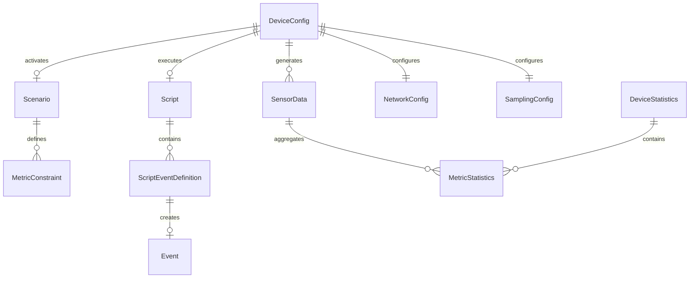

# 数据模型设计

## 1. 概述

数据模型层定义虚拟设备系统中所有核心数据结构的定义、关系和验证规则。采用 Pydantic 进行数据验证，确保类型安全和数据完整性。

## 2. 核心数据模型

### 2.1 设备配置模型 (DeviceConfig)

```python
from pydantic import BaseModel, Field, validator
from typing import Optional, List, Dict, Any
from datetime import datetime
from enum import Enum

class DeviceMode(str, Enum):
    """设备运行模式"""
    MANUAL = "manual"           # 手动模式
    SCENARIO = "scenario"       # 场景模式
    SCRIPT = "script"           # 脚本模式
    EVENT_DRIVEN = "event_driven"  # 事件驱动模式

class NetworkConfig(BaseModel):
    """网络配置"""
    ssid: Optional[str] = Field(None, description="WiFi SSID")
    password: Optional[str] = Field(None, description="WiFi密码")
    ip: Optional[str] = Field(None, description="设备IP地址")
    port: int = Field(8080, ge=1024, le=65535, description="设备端口")
    mac_address: Optional[str] = Field(None, regex=r"^([0-9A-Fa-f]{2}:){5}[0-9A-Fa-f]{2}$")
    
    @validator('password')
    def validate_password_length(cls, v):
        if v and len(v) < 8:
            raise ValueError('WiFi密码长度至少8位')
        return v

class SamplingConfig(BaseModel):
    """采样配置"""
    interval_ms: int = Field(5000, ge=1000, le=60000, description="采样间隔(ms)")
    batch_size: int = Field(10, ge=1, le=100, description="批量上报数量")
    jitter_ms: int = Field(100, ge=0, le=1000, description="采样抖动(ms)")

class SensorCalibration(BaseModel):
    """传感器校准参数"""
    temperature_offset: float = Field(0.0, ge=-10.0, le=10.0)
    humidity_offset: float = Field(0.0, ge=-20.0, le=20.0)
    light_offset: float = Field(0.0, ge=-1000.0, le=1000.0)
    soil_offset: float = Field(0.0, ge=-50.0, le=50.0)

class DeviceConfig(BaseModel):
    """设备完整配置"""
    # 基本信息
    device_id: str = Field(..., min_length=8, max_length=32, description="设备唯一标识")
    device_name: str = Field("Virtual Device", max_length=64, description="设备名称")
    device_type: str = Field("plant_sensor", description="设备类型")
    firmware_version: str = Field("1.0.0", regex=r"^\d+\.\d+\.\d+$")
    
    # 运行模式
    mode: DeviceMode = Field(DeviceMode.MANUAL, description="运行模式")
    
    # 网络配置
    network: NetworkConfig = Field(default_factory=NetworkConfig)
    
    # 采样配置
    sampling: SamplingConfig = Field(default_factory=amplingConfig)
    
    # 传感器校准
    calibration: SensorCalibration = Field(default_factory=SensorCalibration)
    
    # 场景/脚本配置
    active_scenario: Optional[str] = Field(None, description="当前激活的场景ID")
    active_script: Optional[str] = Field(None, description="当前激活的脚本ID")
    
    # 时间控制
    time_scale: float = Field(1.0, ge=0.1, le=600.0, description="时间加速倍数")
    virtual_time_enabled: bool = Field(False, description="是否启用虚拟时间")
    
    # 元数据
    created_at: datetime = Field(default_factory=datetime.utcnow)
    updated_at: datetime = Field(default_factory=datetime.utcnow)
    tags: List[str] = Field(default_factory=list, description="设备标签")
    metadata: Dict[str, Any] = Field(default_factory=dict, description="扩展元数据")
    
    class Config:
        json_encoders = {
            datetime: lambda v: v.isoformat()
        }
```

### 2.2 传感器数据模型 (SensorData)

```python
from pydantic import BaseModel, Field, root_validator
from typing import Optional
from datetime import datetime

class TemperatureReading(BaseModel):
    """温度读数"""
    value: float = Field(..., ge=-50.0, le=100.0, description="温度值(°C)")
    unit: str = Field("°C", const=True)
    sensor_id: str = Field("temp_01", description="传感器ID")
    status: str = Field("normal", regex=r"^(normal|warning|error|offline)$")

class HumidityReading(BaseModel):
    """湿度读数"""
    value: float = Field(..., ge=0.0, le=100.0, description="湿度值(%)")
    unit: str = Field("%", const=True)
    sensor_id: str = Field("humi_01")
    status: str = Field("normal")

class LightReading(BaseModel):
    """光照读数"""
    value: float = Field(..., ge=0.0, le=100000.0, description="光照强度(lux)")
    unit: str = Field("lux", const=True)
    sensor_id: str = Field("light_01")
    status: str = Field("normal")

class SoilMoistureReading(BaseModel):
    """土壤湿度读数"""
    value: float = Field(..., ge=0.0, le=100.0, description="土壤湿度(%)")
    unit: str = Field("%", const=True)
    sensor_id: str = Field("soil_01")
    status: str = Field("normal")

class SensorData(BaseModel):
    """完整传感器数据包"""
    # 数据标识
    data_id: str = Field(..., description="数据包唯一ID")
    device_id: str = Field(..., description="设备ID")
    
    # 时间戳
    timestamp: datetime = Field(..., description="数据采集时间")
    virtual_timestamp: Optional[datetime] = Field(None, description="虚拟时间戳")
    
    # 传感器读数
    temperature: TemperatureReading
    humidity: HumidityReading
    light: LightReading
    soil_moisture: SoilMoistureReading
    
    # 数据质量
    data_source: str = Field("simulation", description="数据来源")
    confidence: float = Field(1.0, ge=0.0, le=1.0, description="数据置信度")
    is_compensated: bool = Field(False, description="是否为补偿数据")
    
    # 设备状态
    battery_level: Optional[float] = Field(None, ge=0.0, le=100.0)
    signal_strength: Optional[int] = Field(None, ge=-100, le=0)
    
    # 扩展数据
    raw_values: Optional[dict] = Field(None, description="原始传感器值")
    
    @root_validator
    def validate_consistency(cls, values):
        """验证数据一致性"""
        temp = values.get('temperature')
        humidity = values.get('humidity')
        
        # 温度和湿度通常相关，可以添加合理性检查
        if temp and humidity:
            if temp.value > 40 and humidity.value > 90:
                values['confidence'] = min(values.get('confidence', 1.0), 0.8)
        
        return values
    
    def to_api_format(self) -> dict:
        """转换为API上报格式"""
        return {
            "deviceId": self.device_id,
            "timestamp": self.timestamp.isoformat(),
            "metrics": {
                "temperature": self.temperature.value,
                "humidity": self.humidity.value,
                "light": self.light.value,
                "soilMoisture": self.soil_moisture.value
            },
            "status": {
                "battery": self.battery_level,
                "signal": self.signal_strength
            }
        }
```

### 2.3 事件模型 (Event)

```python
from pydantic import BaseModel, Field
from typing import Optional, Dict, Any, Callable
from datetime import datetime, timedelta
from enum import Enum

class EventType(str, Enum):
    """事件类型枚举"""
    # 环境变化事件
    TEMPERATURE_CHANGE = "temperature_change"
    HUMIDITY_CHANGE = "humidity_change"
    LIGHT_CHANGE = "light_change"
    SOIL_CHANGE = "soil_change"
    
    # 场景切换事件
    SCENARIO_SWITCH = "scenario_switch"
    
    # 设备事件
    DEVICE_START = "device_start"
    DEVICE_STOP = "device_stop"
    DEVICE_ERROR = "device_error"
    
    # 时间事件
    TIME_JUMP = "time_jump"
    TIME_PAUSE = "time_pause"
    TIME_RESUME = "time_resume"
    TIME_SCALE_CHANGE = "time_scale_change"
    
    # 自定义事件
    CUSTOM = "custom"

class EventStatus(str, Enum):
    """事件状态"""
    PENDING = "pending"         # 等待执行
    EXECUTING = "executing"     # 执行中
    COMPLETED = "completed"     # 已完成
    FAILED = "failed"           # 执行失败
    CANCELLED = "cancelled"     # 已取消
    SKIPPED = "skipped"         # 已跳过

class EventPriority(int, Enum):
    """事件优先级"""
    LOW = 1
    NORMAL = 2
    HIGH = 3
    CRITICAL = 4

class Event(BaseModel):
    """事件定义"""
    # 基本标识
    event_id: str = Field(..., description="事件唯一ID")
    event_type: EventType = Field(..., description="事件类型")
    
    # 执行时间
    trigger_time: datetime = Field(..., description="触发时间")
    virtual_time: Optional[datetime] = Field(None, description="虚拟时间")
    
    # 优先级和状态
    priority: EventPriority = Field(EventPriority.NORMAL, description="优先级")
    status: EventStatus = Field(EventStatus.PENDING, description="当前状态")
    
    # 事件参数
    params: Dict[str, Any] = Field(default_factory=dict, description="事件参数")
    
    # 执行控制
    duration_ms: int = Field(1000, ge=0, description="执行持续时间(ms)")
    easing: str = Field("linear", description="缓动函数")
    
    # 条件执行
    condition: Optional[str] = Field(None, description="执行条件表达式")
    
    # 重试机制
    max_retries: int = Field(0, ge=0, le=5, description="最大重试次数")
    retry_count: int = Field(0, ge=0, description="已重试次数")
    
    # 元数据
    created_at: datetime = Field(default_factory=datetime.utcnow)
    executed_at: Optional[datetime] = Field(None)
    error_message: Optional[str] = Field(None)
    
    # 关联
    parent_event_id: Optional[str] = Field(None, description="父事件ID")
    child_event_ids: list = Field(default_factory=list, description="子事件ID列表")
    
    class Config:
        arbitrary_types_allowed = True
    
    def can_execute(self, current_time: datetime) -> bool:
        """检查事件是否可以执行"""
        if self.status != EventStatus.PENDING:
            return False
        return current_time >= self.trigger_time
    
    def mark_executing(self):
        """标记为执行中"""
        self.status = EventStatus.EXECUTING
        self.executed_at = datetime.utcnow()
    
    def mark_completed(self):
        """标记为已完成"""
        self.status = EventStatus.COMPLETED
    
    def mark_failed(self, error: str):
        """标记为失败"""
        self.status = EventStatus.FAILED
        self.error_message = error
        self.retry_count += 1
        
        if self.retry_count <= self.max_retries:
            self.status = EventStatus.PENDING
            self.trigger_time = datetime.utcnow() + timedelta(seconds=5)
```

### 2.4 场景模型 (Scenario)

```python
from pydantic import BaseModel, Field, validator
from typing import Dict, Optional, List
from enum import Enum

class ScenarioCategory(str, Enum):
    """场景分类"""
    NORMAL = "normal"           # 正常场景
    EXTREME = "extreme"         # 极端场景
    FAULT = "fault"             # 故障场景
    CUSTOM = "custom"           # 自定义场景

class MetricConstraint(BaseModel):
    """指标约束定义"""
    min_value: float = Field(..., description="最小值")
    max_value: float = Field(..., description="最大值")
    target_value: Optional[float] = Field(None, description="目标值")
    variance: float = Field(0.0, ge=0.0, description="方差范围")
    change_rate: float = Field(0.0, description="变化速率限制")
    
    @validator('max_value')
    def validate_range(cls, v, values):
        if 'min_value' in values and v < values['min_value']:
            raise ValueError('max_value必须大于min_value')
        return v

class Scenario(BaseModel):
    """场景定义"""
    # 基本标识
    scenario_id: str = Field(..., description="场景唯一ID")
    name: str = Field(..., max_length=64, description="场景名称")
    description: str = Field("", max_length=256, description="场景描述")
    category: ScenarioCategory = Field(ScenarioCategory.NORMAL)
    
    # 指标约束
    constraints: Dict[str, MetricConstraint] = Field(
        default_factory=dict,
        description="各指标约束"
    )
    
    # 场景参数
    duration_minutes: Optional[int] = Field(None, description="建议持续时间(分钟)")
    transition_time_ms: int = Field(5000, ge=0, description="场景切换过渡时间(ms)")
    
    # 视觉效果
    icon: str = Field("🌱", description="场景图标")
    color: str = Field("#4CAF50", regex=r"^#[0-9A-Fa-f]{6}$", description="场景颜色")
    
    # 元数据
    is_builtin: bool = Field(True, description="是否内置场景")
    tags: List[str] = Field(default_factory=list)
    
    def get_constraint(self, metric_name: str) -> Optional[MetricConstraint]:
        """获取指定指标的约束"""
        return self.constraints.get(metric_name)
    
    def validate_value(self, metric_name: str, value: float) -> bool:
        """验证值是否在约束范围内"""
        constraint = self.get_constraint(metric_name)
        if not constraint:
            return True
        return constraint.min_value <= value <= constraint.max_value
```

### 2.5 脚本模型 (Script)

```python
from pydantic import BaseModel, Field
from typing import List, Dict, Any, Optional
from datetime import datetime
from enum import Enum

class ScriptStatus(str, Enum):
    """脚本状态"""
    IDLE = "idle"
    RUNNING = "running"
    PAUSED = "paused"
    COMPLETED = "completed"
    ERROR = "error"

class ScriptEventDefinition(BaseModel):
    """脚本中的事件定义"""
    offset_seconds: float = Field(..., ge=0, description="相对于脚本开始的偏移时间(秒)")
    event_type: str = Field(..., description="事件类型")
    params: Dict[str, Any] = Field(default_factory=dict)
    description: str = Field("", description="事件描述")

class Script(BaseModel):
    """脚本定义"""
    # 基本标识
    script_id: str = Field(..., description="脚本唯一ID")
    name: str = Field(..., max_length=64)
    description: str = Field("", max_length=512)
    
    # 事件序列
    events: List[ScriptEventDefinition] = Field(
        default_factory=list,
        description="脚本事件序列"
    )
    
    # 执行控制
    loop: bool = Field(False, description="是否循环执行")
    loop_count: int = Field(0, ge=0, description="循环次数(0=无限)")
    auto_start: bool = Field(False, description="是否自动启动")
    
    # 时间控制
    time_scale: float = Field(1.0, ge=0.1, le=600.0)
    
    # 当前状态
    status: ScriptStatus = Field(ScriptStatus.IDLE)
    current_event_index: int = Field(0, ge=0)
    completed_loops: int = Field(0, ge=0)
    
    # 元数据
    is_builtin: bool = Field(True)
    created_at: datetime = Field(default_factory=datetime.utcnow)
    tags: List[str] = Field(default_factory=list)
    
    def get_total_duration(self) -> float:
        """获取脚本总时长(秒)"""
        if not self.events:
            return 0
        return max(e.offset_seconds for e in self.events)
    
    def get_events_at_time(self, elapsed_seconds: float) -> List[ScriptEventDefinition]:
        """获取指定时间点应执行的事件"""
        return [
            e for e in self.events 
            if abs(e.offset_seconds - elapsed_seconds) < 0.1
        ]
```

### 2.6 统计数据模型 (Statistics)

```python
from pydantic import BaseModel, Field
from typing import Dict, List, Optional
from datetime import datetime, timedelta

class MetricStatistics(BaseModel):
    """单个指标的统计信息"""
    metric_name: str = Field(..., description="指标名称")
    count: int = Field(0, ge=0, description="样本数量")
    
    # 基础统计
    min_value: float = Field(0.0)
    max_value: float = Field(0.0)
    mean: float = Field(0.0)
    median: float = Field(0.0)
    std_dev: float = Field(0.0)
    
    # 分位数
    p25: float = Field(0.0, description="25分位数")
    p75: float = Field(0.0, description="75分位数")
    p95: float = Field(0.0, description="95分位数")
    
    # 变化趋势
    trend: str = Field("stable", regex=r"^(increasing|decreasing|stable|volatile)$")
    change_rate: float = Field(0.0, description="变化率")

class DeviceStatistics(BaseModel):
    """设备统计信息"""
    device_id: str = Field(...)
    period_start: datetime = Field(...)
    period_end: datetime = Field(...)
    
    # 运行统计
    total_runtime_seconds: float = Field(0.0)
    sampling_count: int = Field(0)
    reporting_count: int = Field(0)
    error_count: int = Field(0)
    
    # 指标统计
    metrics: Dict[str, MetricStatistics] = Field(default_factory=dict)
    
    # 场景统计
    scenario_durations: Dict[str, float] = Field(default_factory=dict)
    
    # 事件统计
    event_counts: Dict[str, int] = Field(default_factory=dict)
    
    # 性能指标
    avg_response_time_ms: float = Field(0.0)
    max_response_time_ms: float = Field(0.0)
    
    def get_summary(self) -> dict:
        """获取统计摘要"""
        return {
            "device_id": self.device_id,
            "period": f"{self.period_start.isoformat()} ~ {self.period_end.isoformat()}",
            "runtime_hours": round(self.total_runtime_seconds / 3600, 2),
            "total_samples": self.sampling_count,
            "error_rate": round(self.error_count / max(self.sampling_count, 1) * 100, 2),
            "metric_summary": {
                name: {
                    "mean": stats.mean,
                    "trend": stats.trend
                }
                for name, stats in self.metrics.items()
            }
        }
```

## 3. 模型关系图



## 4. 数据验证规则

### 4.1 交叉验证规则

```python
class DataValidator:
    """数据验证器"""
    
    @staticmethod
    def validate_sensor_consistency(data: SensorData) -> tuple[bool, list]:
        """验证传感器数据一致性"""
        errors = []
        
        # 温度-湿度相关性检查
        temp = data.temperature.value
        humidity = data.humidity.value
        
        # 高温高湿不合理（除非是热带环境）
        if temp > 45 and humidity > 95:
            errors.append("高温高湿组合异常")
        
        # 低温低湿检查
        if temp < -10 and humidity < 10:
            errors.append("极低温度下湿度异常")
        
        # 土壤湿度与空气湿度关系
        if data.soil_moisture.value > 80 and humidity < 20:
            errors.append("高土壤湿度与低空气湿度组合异常")
        
        return len(errors) == 0, errors
    
    @staticmethod
    def validate_event_sequence(events: List[Event]) -> tuple[bool, list]:
        """验证事件序列有效性"""
        errors = []
        
        # 检查时间冲突
        sorted_events = sorted(events, key=lambda e: e.trigger_time)
        for i in range(len(sorted_events) - 1):
            curr = sorted_events[i]
            next_e = sorted_events[i + 1]
            
            time_diff = (next_e.trigger_time - curr.trigger_time).total_seconds()
            if time_diff < 0.1:  # 100ms 内的事件可能冲突
                errors.append(f"事件 {curr.event_id} 和 {next_e.event_id} 时间冲突")
        
        return len(errors) == 0, errors
```

## 5. 序列化与存储

### 5.1 JSON 序列化

```python
import json
from pydantic.json import pydantic_encoder

class DataSerializer:
    """数据序列化器"""
    
    @staticmethod
    def to_json(obj: BaseModel, indent: Optional[int] = None) -> str:
        """序列化为JSON字符串"""
        return obj.json(indent=indent, ensure_ascii=False)
    
    @staticmethod
    def to_dict(obj: BaseModel) -> dict:
        """转换为字典"""
        return obj.dict()
    
    @staticmethod
    def from_json(model_class: type, json_str: str) -> BaseModel:
        """从JSON反序列化"""
        return model_class.parse_raw(json_str)
```

### 5.2 数据库存储映射

```python
# SQLAlchemy 模型定义（用于持久化存储）
from sqlalchemy import Column, String, Float, DateTime, JSON, Integer, Boolean
from sqlalchemy.ext.declarative import declarative_base

Base = declarative_base()

class DeviceConfigDB(Base):
    """设备配置数据库模型"""
    __tablename__ = 'device_configs'
    
    device_id = Column(String(32), primary_key=True)
    device_name = Column(String(64), nullable=False)
    device_type = Column(String(32), default='plant_sensor')
    mode = Column(String(32), default='manual')
    
    # 网络配置（JSON存储）
    network_config = Column(JSON)
    sampling_config = Column(JSON)
    calibration = Column(JSON)
    
    # 当前状态
    active_scenario = Column(String(32))
    active_script = Column(String(32))
    time_scale = Column(Float, default=1.0)
    virtual_time_enabled = Column(Boolean, default=False)
    
    # 时间戳
    created_at = Column(DateTime, default=datetime.utcnow)
    updated_at = Column(DateTime, default=datetime.utcnow, onupdate=datetime.utcnow)
    
    # 元数据
    tags = Column(JSON, default=list)
    metadata = Column(JSON, default=dict)
```

## 6. 版本兼容性

### 6.1 模型版本控制

```python
from pydantic import BaseModel, Field
from typing import Optional

class VersionedModel(BaseModel):
    """带版本控制的模型基类"""
    schema_version: str = Field("1.0.0", description="数据模型版本")
    
    @classmethod
    def migrate_from(cls, old_data: dict, old_version: str) -> dict:
        """从旧版本迁移数据"""
        # 实现版本迁移逻辑
        if old_version == "0.9.0":
            # 0.9.0 -> 1.0.0 迁移
            if "wifi_ssid" in old_data:
                old_data["network"] = {"ssid": old_data.pop("wifi_ssid")}
        
        return old_data
```

## 7. 性能优化

### 7.1 数据缓存策略

```python
from functools import lru_cache
from typing import TypeVar, Type

T = TypeVar('T', bound=BaseModel)

class ModelCache:
    """模型缓存"""
    
    def __init__(self, max_size: int = 128):
        self._cache = {}
        self._max_size = max_size
    
    def get_or_create(self, model_class: Type[T], key: str, **kwargs) -> T:
        """获取或创建模型实例"""
        cache_key = f"{model_class.__name__}:{key}"
        
        if cache_key not in self._cache:
            self._cache[cache_key] = model_class(**kwargs)
        
        return self._cache[cache_key]
    
    def invalidate(self, model_class: Type[T], key: Optional[str] = None):
        """使缓存失效"""
        if key:
            cache_key = f"{model_class.__name__}:{key}"
            self._cache.pop(cache_key, None)
        else:
            # 清除该类型的所有缓存
            prefix = f"{model_class.__name__}:"
            self._cache = {
                k: v for k, v in self._cache.items()
                if not k.startswith(prefix)
            }
```

## 8. 设计决策记录

| 决策 | 选择 | 理由 |
|------|------|------|
| 验证框架 | Pydantic | 类型安全、自动验证、JSON序列化 |
| 时间表示 | datetime + 虚拟时间 | 支持真实和虚拟两种时间线 |
| 枚举定义 | Python Enum | 类型安全、可扩展 |
| 配置存储 | JSON字段 | 灵活、易于扩展 |
| 数据ID | UUID字符串 | 全局唯一、可分布式生成 |

---

**文档状态**: 初稿  
**最后更新**: 2026-04-08  
**作者**: AI Assistant
