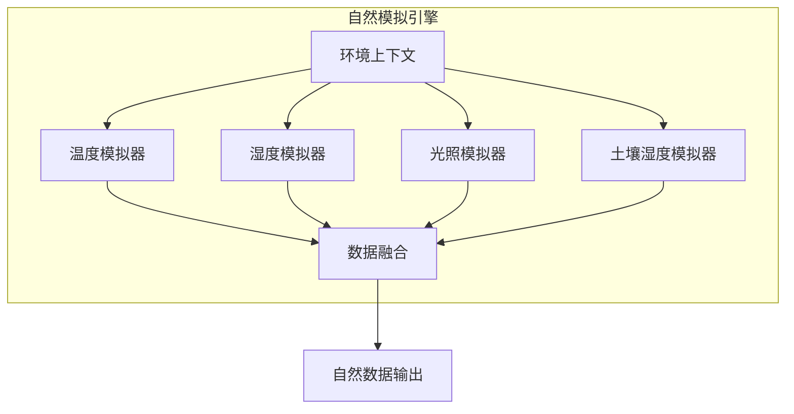

# 自然模拟算法设计

## 1. 概述

自然模拟算法是虚拟设备数据生成的第一层，负责模拟真实世界中环境指标的**自然波动规律**。这些算法基于物理学、生物学和气象学原理，生成符合自然规律的数据变化。

## 2. 算法架构



## 3. 温度模拟算法

### 3.1 日周期温度模型

基于正弦函数模拟一天内的温度变化，考虑日出日落时间。

```python
import math
from datetime import datetime, time
from typing import Optional

class TemperatureSimulator:
    """温度模拟器"""
    
    def __init__(
        self,
        base_temp: float = 22.0,        # 基础温度
        daily_range: float = 8.0,        # 日温差
        sunrise_hour: float = 6.0,       # 日出时间
        sunset_hour: float = 18.0,       # 日落时间
        lag_hours: float = 2.0,          # 温度滞后（最高温滞后于正午）
        noise_factor: float = 0.3        # 随机噪声因子
    ):
        self.base_temp = base_temp
        self.daily_range = daily_range
        self.sunrise_hour = sunrise_hour
        self.sunset_hour = sunset_hour
        self.lag_hours = lag_hours
        self.noise_factor = noise_factor
        
        # 随机种子
        self._noise_seed = 0
    
    def calculate(self, dt: datetime, context: dict) -> float:
        """
        计算指定时间的温度值
        
        Args:
            dt: 当前时间
            context: 环境上下文（包含季节、天气等）
        
        Returns:
            温度值（摄氏度）
        """
        # 获取一天中的小时（0-24）
        hour = dt.hour + dt.minute / 60.0
        
        # 计算日周期温度（正弦曲线）
        # 最高温出现在14:00左右（考虑滞后）
        day_progress = (hour - self.sunrise_hour - self.lag_hours) / 24.0
        daily_variation = math.sin(2 * math.pi * day_progress) * (self.daily_range / 2)
        
        # 基础温度调整
        temp = self.base_temp + daily_variation
        
        # 应用季节调整
        season_offset = context.get('season_offset', 0)
        temp += season_offset
        
        # 应用天气影响
        weather_factor = context.get('weather_factor', 1.0)
        temp *= weather_factor
        
        # 添加随机噪声（使用Perlin噪声或简单随机）
        noise = self._generate_noise(dt) * self.noise_factor
        temp += noise
        
        # 确保在合理范围内
        return max(-40.0, min(60.0, temp))
    
    def _generate_noise(self, dt: datetime) -> float:
        """生成平滑的随机噪声"""
        import random
        
        # 使用基于时间的种子确保可重复性
        seed = dt.hour * 100 + dt.minute // 10
        random.seed(seed + self._noise_seed)
        
        # 生成-1到1之间的随机值
        return random.uniform(-1.0, 1.0)
```

### 3.2 温度变化率限制

```python
class TemperatureChangeLimiter:
    """温度变化率限制器"""
    
    # 温度变化率限制（度/分钟）
    MAX_CHANGE_RATE = 2.0  # 正常情况下温度不会突变
    
    def __init__(self):
        self._last_temp: Optional[float] = None
        self._last_time: Optional[datetime] = None
    
    def limit(self, target_temp: float, current_time: datetime) -> float:
        """限制温度变化率"""
        if self._last_temp is None:
            self._last_temp = target_temp
            self._last_time = current_time
            return target_temp
        
        # 计算时间差（分钟）
        time_diff = (current_time - self._last_time).total_seconds() / 60.0
        
        # 计算最大允许变化
        max_change = self.MAX_CHANGE_RATE * time_diff
        
        # 限制变化
        actual_change = max(-max_change, min(max_change, target_temp - self._last_temp))
        limited_temp = self._last_temp + actual_change
        
        # 更新状态
        self._last_temp = limited_temp
        self._last_time = current_time
        
        return limited_temp
```

## 4. 湿度模拟算法

### 4.1 相对湿度模型

湿度与温度呈负相关，同时考虑降水、地理位置等因素。

```python
import math
from datetime import datetime

class HumiditySimulator:
    """湿度模拟器"""
    
    def __init__(
        self,
        base_humidity: float = 60.0,     # 基础湿度(%)
        daily_range: float = 20.0,        # 日湿度变化范围
        temp_correlation: float = -0.7,   # 温度相关系数（负相关）
        noise_factor: float = 2.0         # 噪声因子
    ):
        self.base_humidity = base_humidity
        self.daily_range = daily_range
        self.temp_correlation = temp_correlation
        self.noise_factor = noise_factor
    
    def calculate(
        self, 
        dt: datetime, 
        current_temp: float,
        context: dict
    ) -> float:
        """
        计算相对湿度
        
        Args:
            dt: 当前时间
            current_temp: 当前温度（用于相关性计算）
            context: 环境上下文
        
        Returns:
            相对湿度(%)
        """
        # 基础湿度
        humidity = self.base_humidity
        
        # 日周期变化（与温度反相）
        hour = dt.hour + dt.minute / 60.0
        daily_variation = -math.sin(2 * math.pi * (hour - 6) / 24) * (self.daily_range / 2)
        humidity += daily_variation
        
        # 温度相关性调整
        # 温度升高时，相对湿度通常降低
        temp_deviation = current_temp - context.get('base_temp', 22.0)
        humidity += temp_deviation * self.temp_correlation * 2
        
        # 降水影响
        if context.get('is_raining', False):
            humidity = min(95, humidity + 15)
        
        # 夜间湿度通常较高
        if hour < 6 or hour > 20:
            humidity += 5
        
        # 添加噪声
        noise = self._generate_noise(dt) * self.noise_factor
        humidity += noise
        
        # 限制在合理范围内
        return max(10.0, min(100.0, humidity))
    
    def _generate_noise(self, dt: datetime) -> float:
        """生成平滑噪声"""
        import random
        random.seed(dt.minute // 5)
        return random.gauss(0, 1)
```

## 5. 光照模拟算法

### 5.1 日光照度模型

基于太阳高度角和天气条件模拟光照强度。

```python
import math
from datetime import datetime, time, timedelta

class LightSimulator:
    """光照模拟器"""
    
    def __init__(
        self,
        max_light: float = 50000.0,      # 正午最大光照(lux)
        sunrise_hour: float = 6.0,
        sunset_hour: float = 18.0,
        twilight_duration: float = 0.5,   # 晨昏持续时间（小时）
        cloud_factor: float = 1.0         # 云层遮挡因子
    ):
        self.max_light = max_light
        self.sunrise_hour = sunrise_hour
        self.sunset_hour = sunset_hour
        self.twilight_duration = twilight_duration
        self.cloud_factor = cloud_factor
    
    def calculate(self, dt: datetime, context: dict) -> float:
        """
        计算光照强度
        
        Args:
            dt: 当前时间
            context: 环境上下文（包含天气、季节等）
        
        Returns:
            光照强度(lux)
        """
        hour = dt.hour + dt.minute / 60.0
        
        # 夜间
        if hour < self.sunrise_hour - self.twilight_duration or \
           hour > self.sunset_hour + self.twilight_duration:
            return 0.0
        
        # 晨昏时段
        if hour < self.sunrise_hour:
            # 黎明
            progress = (hour - (self.sunrise_hour - self.twilight_duration)) / self.twilight_duration
            return self.max_light * 0.1 * progress * self.cloud_factor
        
        if hour > self.sunset_hour:
            # 黄昏
            progress = (self.sunset_hour + self.twilight_duration - hour) / self.twilight_duration
            return self.max_light * 0.1 * progress * self.cloud_factor
        
        # 白天 - 使用正弦曲线模拟
        day_progress = (hour - self.sunrise_hour) / (self.sunset_hour - self.sunrise_hour)
        
        # 正午达到最大值
        light = self.max_light * math.sin(math.pi * day_progress)
        
        # 应用天气影响
        weather_factor = context.get('light_weather_factor', 1.0)
        light *= weather_factor * self.cloud_factor
        
        # 添加随机波动
        noise = self._generate_noise(dt) * self.max_light * 0.05
        light += noise
        
        return max(0.0, light)
    
    def _generate_noise(self, dt: datetime) -> float:
        """生成光照噪声（模拟云层移动）"""
        import random
        # 云层变化较慢，使用小时级种子
        random.seed(dt.hour)
        return random.uniform(-1.0, 1.0)
```

## 6. 土壤湿度模拟算法

### 6.1 土壤水分平衡模型

基于水分输入（降雨、灌溉）和输出（蒸发、植物吸收）的平衡。

```python
import math
from datetime import datetime, timedelta
from typing import Optional

class SoilMoistureSimulator:
    """土壤湿度模拟器"""
    
    def __init__(
        self,
        initial_moisture: float = 50.0,   # 初始湿度(%)
        field_capacity: float = 60.0,      # 田间持水量(%)
        wilting_point: float = 15.0,       # 萎蔫点(%)
        evaporation_rate: float = 0.5,     # 蒸发速率(%/小时)
        drainage_rate: float = 0.3         # 排水速率(%/小时)
    ):
        self.current_moisture = initial_moisture
        self.field_capacity = field_capacity
        self.wilting_point = wilting_point
        self.evaporation_rate = evaporation_rate
        self.drainage_rate = drainage_rate
        
        self._last_update: Optional[datetime] = None
    
    def calculate(
        self, 
        dt: datetime, 
        context: dict
    ) -> float:
        """
        计算土壤湿度
        
        Args:
            dt: 当前时间
            context: 环境上下文（包含降雨、灌溉、温度等）
        
        Returns:
            土壤湿度(%)
        """
        if self._last_update is None:
            self._last_update = dt
            return self.current_moisture
        
        # 计算时间差（小时）
        hours_passed = (dt - self._last_update).total_seconds() / 3600.0
        
        # 1. 水分输入
        water_input = 0.0
        
        # 降雨
        if context.get('is_raining', False):
            rain_intensity = context.get('rain_intensity', 5.0)  # mm/hour
            water_input += rain_intensity * 2  # 简化为湿度增加
        
        # 灌溉
        if context.get('is_irrigating', False):
            water_input += 10.0  # 灌溉增加湿度
        
        # 2. 水分输出
        water_output = 0.0
        
        # 蒸发（与温度和光照相关）
        temp = context.get('temperature', 22.0)
        light = context.get('light', 0.0)
        
        evaporation = self.evaporation_rate * hours_passed
        evaporation *= (1 + (temp - 20) / 20)  # 温度影响
        evaporation *= (1 + light / 100000)    # 光照影响
        water_output += evaporation
        
        # 排水（超过田间持水量时）
        if self.current_moisture > self.field_capacity:
            excess = self.current_moisture - self.field_capacity
            drainage = min(excess, self.drainage_rate * hours_passed)
            water_output += drainage
        
        # 植物吸收（如果有植物）
        if context.get('has_plant', False):
            plant_absorption = context.get('plant_water_consumption', 0.2)
            water_output += plant_absorption * hours_passed
        
        # 3. 更新湿度
        self.current_moisture += water_input - water_output
        
        # 确保在合理范围内
        self.current_moisture = max(
            self.wilting_point * 0.5,
            min(100.0, self.current_moisture)
        )
        
        self._last_update = dt
        
        # 添加微小噪声
        import random
        noise = random.gauss(0, 0.5)
        
        return max(0.0, min(100.0, self.current_moisture + noise))
    
    def irrigate(self, amount: float = 20.0):
        """模拟灌溉"""
        self.current_moisture = min(100.0, self.current_moisture + amount)
    
    def reset(self, moisture: float = 50.0):
        """重置湿度"""
        self.current_moisture = moisture
        self._last_update = None
```

## 7. 环境上下文管理

### 7.1 上下文定义

```python
from dataclasses import dataclass, field
from typing import Optional
from datetime import datetime
from enum import Enum

class Season(str, Enum):
    SPRING = "spring"
    SUMMER = "summer"
    AUTUMN = "autumn"
    WINTER = "winter"

class WeatherCondition(str, Enum):
    SUNNY = "sunny"
    CLOUDY = "cloudy"
    RAINY = "rainy"
    STORMY = "stormy"
    SNOWY = "snowy"

@dataclass
class EnvironmentContext:
    """环境上下文"""
    
    # 时间信息
    timestamp: datetime
    virtual_timestamp: Optional[datetime] = None
    
    # 季节和天气
    season: Season = Season.SPRING
    weather: WeatherCondition = WeatherCondition.SUNNY
    
    # 地理位置
    latitude: float = 39.9  # 默认北京
    longitude: float = 116.4
    altitude: float = 50.0  # 海拔(米)
    
    # 环境参数
    base_temp: float = 22.0
    season_offset: float = 0.0
    weather_factor: float = 1.0
    light_weather_factor: float = 1.0
    
    # 状态标志
    is_raining: bool = False
    rain_intensity: float = 0.0  # mm/hour
    is_irrigating: bool = False
    has_plant: bool = True
    plant_water_consumption: float = 0.2
    
    # 扩展参数
    extra_params: dict = field(default_factory=dict)
    
    @classmethod
    def from_datetime(cls, dt: datetime, **kwargs) -> 'EnvironmentContext':
        """从日期时间创建上下文"""
        # 根据月份推断季节
        month = dt.month
        if 3 <= month <= 5:
            season = Season.SPRING
        elif 6 <= month <= 8:
            season = Season.SUMMER
        elif 9 <= month <= 11:
            season = Season.AUTUMN
        else:
            season = Season.WINTER
        
        return cls(
            timestamp=dt,
            season=season,
            **kwargs
        )
    
    def update_weather(self, weather: WeatherCondition):
        """更新天气状态"""
        self.weather = weather
        
        # 更新相关因子
        weather_factors = {
            WeatherCondition.SUNNY: (1.0, 1.0, False),
            WeatherCondition.CLOUDY: (0.95, 0.6, False),
            WeatherCondition.RAINY: (0.9, 0.3, True),
            WeatherCondition.STORMY: (0.85, 0.2, True),
            WeatherCondition.SNOWY: (0.5, 0.4, False),
        }
        
        factors = weather_factors.get(weather, (1.0, 1.0, False))
        self.weather_factor = factors[0]
        self.light_weather_factor = factors[1]
        self.is_raining = factors[2]
```

## 8. 自然模拟引擎

### 8.1 引擎实现

```python
from typing import Dict, Optional
from datetime import datetime

class NaturalSimulationEngine:
    """自然模拟引擎 - 协调所有模拟器"""
    
    def __init__(self, config: Optional[dict] = None):
        self.config = config or {}
        
        # 初始化各模拟器
        self.temp_simulator = TemperatureSimulator(**self.config.get('temperature', {}))
        self.humidity_simulator = HumiditySimulator(**self.config.get('humidity', {}))
        self.light_simulator = LightSimulator(**self.config.get('light', {}))
        self.soil_simulator = SoilMoistureSimulator(**self.config.get('soil', {}))
        
        # 变化率限制器
        self.temp_limiter = TemperatureChangeLimiter()
        
        # 上下文
        self._context: Optional[EnvironmentContext] = None
    
    def simulate(self, dt: datetime, context: Optional[EnvironmentContext] = None) -> dict:
        """
        执行自然模拟
        
        Args:
            dt: 当前时间
            context: 环境上下文（可选）
        
        Returns:
            模拟数据字典
        """
        # 使用或创建上下文
        ctx = context or self._context or EnvironmentContext.from_datetime(dt)
        
        # 计算各指标
        # 1. 温度（基础值）
        raw_temp = self.temp_simulator.calculate(dt, ctx.__dict__)
        temperature = self.temp_limiter.limit(raw_temp, dt)
        
        # 2. 湿度（依赖温度）
        humidity = self.humidity_simulator.calculate(dt, temperature, ctx.__dict__)
        
        # 3. 光照
        light = self.light_simulator.calculate(dt, ctx.__dict__)
        
        # 4. 土壤湿度（依赖温度和光照）
        ctx.extra_params['temperature'] = temperature
        ctx.extra_params['light'] = light
        soil_moisture = self.soil_simulator.calculate(dt, ctx.__dict__)
        
        return {
            'temperature': round(temperature, 2),
            'humidity': round(humidity, 2),
            'light': round(light, 2),
            'soil_moisture': round(soil_moisture, 2),
            'context': {
                'season': ctx.season.value,
                'weather': ctx.weather.value,
                'is_raining': ctx.is_raining
            }
        }
    
    def set_context(self, context: EnvironmentContext):
        """设置环境上下文"""
        self._context = context
    
    def update_context(self, **kwargs):
        """更新环境上下文"""
        if self._context:
            for key, value in kwargs.items():
                if hasattr(self._context, key):
                    setattr(self._context, key, value)
    
    def reset(self):
        """重置所有模拟器状态"""
        self.temp_limiter = TemperatureChangeLimiter()
        self.soil_simulator.reset()
        self._context = None
```

## 9. 算法参数表

| 算法 | 关键参数 | 默认值 | 取值范围 | 说明 |
|------|----------|--------|----------|------|
| 温度模拟 | base_temp | 22.0°C | -20~50 | 基础温度 |
| | daily_range | 8.0°C | 2~20 | 日温差 |
| | lag_hours | 2.0h | 0~4 | 温度滞后 |
| 湿度模拟 | base_humidity | 60% | 20~90 | 基础湿度 |
| | temp_correlation | -0.7 | -1~0 | 温度相关系数 |
| 光照模拟 | max_light | 50000 lux | 10000~100000 | 最大光照 |
| | twilight_duration | 0.5h | 0.25~1 | 晨昏持续时间 |
| 土壤模拟 | field_capacity | 60% | 40~80 | 田间持水量 |
| | wilting_point | 15% | 5~30 | 萎蔫点 |
| | evaporation_rate | 0.5%/h | 0.1~2 | 蒸发速率 |

## 10. 设计决策

| 决策 | 选择 | 理由 |
|------|------|------|
| 日周期模型 | 正弦函数 | 简单、计算快、符合自然规律 |
| 噪声生成 | 基于时间的伪随机 | 可重复、平滑 |
| 变化率限制 | 滑动窗口 | 防止突变、符合物理规律 |
| 上下文传递 | dataclass | 类型安全、易于扩展 |
| 土壤模型 | 水平衡方程 | 物理合理、可解释 |

---

**文档状态**: 初稿  
**最后更新**: 2026-04-08  
**作者**: AI Assistant
