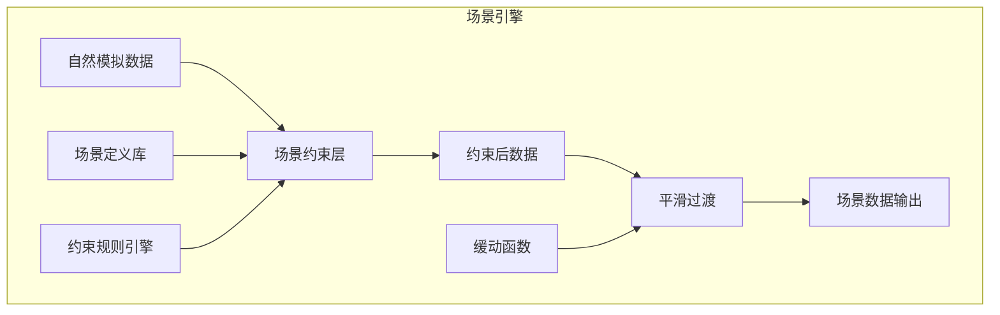

# 场景引擎设计

## 1. 概述

场景引擎是数据生成的第二层，负责在**自然模拟的基础上**施加场景约束，使数据符合特定场景特征。场景定义了环境指标的合理范围和行为模式。

## 2. 场景引擎架构



## 3. 场景定义系统

### 3.1 场景配置结构

```python
from dataclasses import dataclass, field
from typing import Dict, List, Optional, Callable
from enum import Enum

class ScenarioCategory(str, Enum):
    """场景分类"""
    NORMAL = "normal"       # 正常环境
    EXTREME = "extreme"     # 极端环境
    FAULT = "fault"         # 故障场景
    CUSTOM = "custom"       # 自定义场景

@dataclass
class MetricConstraint:
    """指标约束定义"""
    min_value: float                    # 最小值
    max_value: float                    # 最大值
    target_value: Optional[float] = None  # 目标值（可选）
    variance: float = 0.0               # 允许方差
    change_rate: float = float('inf')   # 最大变化率
    priority: int = 1                   # 约束优先级

@dataclass
class Scenario:
    """场景定义"""
    # 基础信息
    scenario_id: str
    name: str
    description: str = ""
    category: ScenarioCategory = ScenarioCategory.NORMAL
    
    # 指标约束
    constraints: Dict[str, MetricConstraint] = field(default_factory=dict)
    
    # 场景参数
    transition_time_ms: int = 5000      # 场景切换过渡时间
    duration_minutes: Optional[int] = None  # 建议持续时间
    
    # 视觉效果
    icon: str = "🌱"
    color: str = "#4CAF50"
    
    # 行为配置
    behaviors: Dict[str, any] = field(default_factory=dict)
    
    # 元数据
    is_builtin: bool = True
    tags: List[str] = field(default_factory=list)

# 内置场景定义
BUILTIN_SCENARIOS = {
    "normal": Scenario(
        scenario_id="normal",
        name="正常环境",
        description="植物生长的理想环境条件",
        category=ScenarioCategory.NORMAL,
        constraints={
            "temperature": MetricConstraint(18.0, 28.0, target_value=23.0, variance=2.0),
            "humidity": MetricConstraint(40.0, 70.0, target_value=55.0, variance=5.0),
            "light": MetricConstraint(5000.0, 50000.0, variance=5000.0),
            "soil_moisture": MetricConstraint(40.0, 70.0, target_value=55.0, variance=5.0),
        },
        icon="🌱",
        color="#4CAF50",
        behaviors={
            "allow_natural_variation": True,
            "diurnal_cycle": True,
        }
    ),
    
    "high_temperature": Scenario(
        scenario_id="high_temperature",
        name="高温环境",
        description="夏季高温或温室过热场景",
        category=ScenarioCategory.EXTREME,
        constraints={
            "temperature": MetricConstraint(35.0, 45.0, target_value=40.0, variance=3.0),
            "humidity": MetricConstraint(30.0, 50.0, target_value=40.0, variance=5.0),
            "light": MetricConstraint(30000.0, 80000.0, variance=10000.0),
            "soil_moisture": MetricConstraint(20.0, 50.0, target_value=35.0, variance=8.0),
        },
        icon="🔥",
        color="#FF5722",
        behaviors={
            "stress_indicator": True,
            "warning_threshold": 42.0,
        }
    ),
    
    "low_temperature": Scenario(
        scenario_id="low_temperature",
        name="低温环境",
        description="冬季低温或冷藏环境",
        category=ScenarioCategory.EXTREME,
        constraints={
            "temperature": MetricConstraint(5.0, 15.0, target_value=10.0, variance=3.0),
            "humidity": MetricConstraint(50.0, 80.0, target_value=65.0, variance=5.0),
            "light": MetricConstraint(1000.0, 20000.0, variance=3000.0),
            "soil_moisture": MetricConstraint(50.0, 80.0, target_value=65.0, variance=5.0),
        },
        icon="❄️",
        color="#2196F3",
        behaviors={
            "growth_slowdown": True,
        }
    ),
    
    "high_humidity": Scenario(
        scenario_id="high_humidity",
        name="高湿环境",
        description="雨季或浇水过多场景",
        category=ScenarioCategory.EXTREME,
        constraints={
            "temperature": MetricConstraint(20.0, 30.0, target_value=25.0, variance=2.0),
            "humidity": MetricConstraint(80.0, 100.0, target_value=90.0, variance=5.0),
            "light": MetricConstraint(2000.0, 30000.0, variance=5000.0),
            "soil_moisture": MetricConstraint(70.0, 100.0, target_value=85.0, variance=5.0),
        },
        icon="💧",
        color="#00BCD4",
        behaviors={
            "mold_risk": True,
            "ventilation_needed": True,
        }
    ),
    
    "dry": Scenario(
        scenario_id="dry",
        name="干燥环境",
        description="干旱或长期未浇水场景",
        category=ScenarioCategory.EXTREME,
        constraints={
            "temperature": MetricConstraint(22.0, 35.0, target_value=28.0, variance=3.0),
            "humidity": MetricConstraint(10.0, 30.0, target_value=20.0, variance=5.0),
            "light": MetricConstraint(10000.0, 60000.0, variance=8000.0),
            "soil_moisture": MetricConstraint(5.0, 25.0, target_value=15.0, variance=5.0),
        },
        icon="🏜️",
        color="#FF9800",
        behaviors={
            "water_stress": True,
            "urgent_watering": True,
        }
    ),
    
    "strong_light": Scenario(
        scenario_id="strong_light",
        name="强光环境",
        description="直射阳光或补光灯过强",
        category=ScenarioCategory.EXTREME,
        constraints={
            "temperature": MetricConstraint(25.0, 40.0, target_value=32.0, variance=4.0),
            "humidity": MetricConstraint(30.0, 60.0, target_value=45.0, variance=8.0),
            "light": MetricConstraint(60000.0, 100000.0, target_value=80000.0, variance=10000.0),
            "soil_moisture": MetricConstraint(30.0, 60.0, target_value=45.0, variance=8.0),
        },
        icon="☀️",
        color="#FFC107",
        behaviors={
            "sunburn_risk": True,
            "shading_recommended": True,
        }
    ),
    
    "weak_light": Scenario(
        scenario_id="weak_light",
        name="弱光环境",
        description="阴暗环境或遮光过度",
        category=ScenarioCategory.EXTREME,
        constraints={
            "temperature": MetricConstraint(15.0, 25.0, target_value=20.0, variance=2.0),
            "humidity": MetricConstraint(50.0, 80.0, target_value=65.0, variance=8.0),
            "light": MetricConstraint(0.0, 5000.0, target_value=2000.0, variance=1000.0),
            "soil_moisture": MetricConstraint(50.0, 80.0, target_value=65.0, variance=5.0),
        },
        icon="🌑",
        color="#9E9E9E",
        behaviors={
            "etiolation_risk": True,
            "supplemental_light_recommended": True,
        }
    ),
    
    "sensor_fault": Scenario(
        scenario_id="sensor_fault",
        name="传感器故障",
        description="模拟传感器故障或异常数据",
        category=ScenarioCategory.FAULT,
        constraints={
            "temperature": MetricConstraint(-50.0, 100.0, variance=50.0),
            "humidity": MetricConstraint(0.0, 100.0, variance=50.0),
            "light": MetricConstraint(0.0, 100000.0, variance=50000.0),
            "soil_moisture": MetricConstraint(0.0, 100.0, variance=50.0),
        },
        icon="⚠️",
        color="#F44336",
        behaviors={
            "random_spikes": True,
            "intermittent_failure": True,
            "data_quality_poor": True,
        }
    ),
}
```

## 4. 约束应用引擎

### 4.1 约束应用器

```python
from typing import Dict, Optional
import math

class ConstraintApplier:
    """约束应用器 - 将场景约束应用到自然数据"""
    
    def __init__(self):
        self._active_constraints: Dict[str, MetricConstraint] = {}
        self._previous_values: Dict[str, float] = {}
    
    def set_constraints(self, constraints: Dict[str, MetricConstraint]):
        """设置当前活动的约束"""
        self._active_constraints = constraints
    
    def apply(
        self, 
        metric_name: str, 
        natural_value: float,
        timestamp: Optional[float] = None
    ) -> float:
        """
        应用约束到自然数据
        
        Args:
            metric_name: 指标名称
            natural_value: 自然模拟值
            timestamp: 时间戳（用于变化率计算）
        
        Returns:
            约束后的值
        """
        constraint = self._active_constraints.get(metric_name)
        if not constraint:
            return natural_value
        
        value = natural_value
        
        # 1. 应用目标值牵引
        if constraint.target_value is not None:
            value = self._apply_target_pull(value, constraint)
        
        # 2. 应用范围限制
        value = self._apply_range_limit(value, constraint)
        
        # 3. 应用变化率限制
        if timestamp is not None:
            value = self._apply_change_rate_limit(
                metric_name, value, constraint, timestamp
            )
        
        # 4. 应用方差限制
        value = self._apply_variance_limit(value, constraint)
        
        # 保存前值
        self._previous_values[metric_name] = value
        
        return value
    
    def _apply_target_pull(
        self, 
        value: float, 
        constraint: MetricConstraint
    ) -> float:
        """应用目标值牵引"""
        if constraint.target_value is None:
            return value
        
        # 向目标值靠拢，但保留部分自然变化
        target = constraint.target_value
        pull_strength = 0.3  # 牵引强度
        
        # 混合自然值和目标值
        return value * (1 - pull_strength) + target * pull_strength
    
    def _apply_range_limit(self, value: float, constraint: MetricConstraint) -> float:
        """应用范围限制"""
        return max(constraint.min_value, min(constraint.max_value, value))
    
    def _apply_change_rate_limit(
        self,
        metric_name: str,
        value: float,
        constraint: MetricConstraint,
        timestamp: float
    ) -> float:
        """应用变化率限制"""
        if constraint.change_rate == float('inf'):
            return value
        
        prev_value = self._previous_values.get(metric_name)
        if prev_value is None:
            return value
        
        # 计算变化
        change = value - prev_value
        
        # 限制变化
        max_change = constraint.change_rate
        limited_change = max(-max_change, min(max_change, change))
        
        return prev_value + limited_change
    
    def _apply_variance_limit(
        self, 
        value: float, 
        constraint: MetricConstraint
    ) -> float:
        """应用方差限制"""
        if constraint.variance <= 0:
            return value
        
        # 如果指定了目标值，限制与目标值的偏差
        if constraint.target_value is not None:
            deviation = value - constraint.target_value
            max_deviation = constraint.variance
            
            if abs(deviation) > max_deviation:
                deviation = max(-max_deviation, min(max_deviation, deviation))
                value = constraint.target_value + deviation
        
        return value
```

## 5. 场景切换与过渡

### 5.1 过渡管理器

```python
from dataclasses import dataclass
from typing import Optional, Callable
from datetime import datetime, timedelta
import math

class EasingFunction:
    """缓动函数"""
    
    @staticmethod
    def linear(t: float) -> float:
        """线性"""
        return t
    
    @staticmethod
    def ease_in_out(t: float) -> float:
        """缓入缓出"""
        return t * t * (3 - 2 * t)
    
    @staticmethod
    def ease_out(t: float) -> float:
        """缓出"""
        return 1 - math.pow(1 - t, 3)
    
    @staticmethod
    def ease_in(t: float) -> float:
        """缓入"""
        return t * t * t
    
    @staticmethod
    def elastic(t: float) -> float:
        """弹性"""
        if t == 0 or t == 1:
            return t
        return math.pow(2, -10 * t) * math.sin((t - 0.1) * 5 * math.pi) + 1

@dataclass
class TransitionState:
    """过渡状态"""
    from_scenario: Optional[str]
    to_scenario: str
    start_time: datetime
    end_time: datetime
    easing: str = "ease_in_out"
    progress: float = 0.0

class TransitionManager:
    """场景过渡管理器"""
    
    EASING_FUNCTIONS = {
        "linear": EasingFunction.linear,
        "ease_in_out": EasingFunction.ease_in_out,
        "ease_out": EasingFunction.ease_out,
        "ease_in": EasingFunction.ease_in,
        "elastic": EasingFunction.elastic,
    }
    
    def __init__(self):
        self._current_transition: Optional[TransitionState] = None
        self._from_constraints: Dict[str, MetricConstraint] = {}
        self._to_constraints: Dict[str, MetricConstraint] = {}
    
    def start_transition(
        self,
        from_scenario: Optional[Scenario],
        to_scenario: Scenario,
        duration_ms: int,
        easing: str = "ease_in_out"
    ):
        """开始场景过渡"""
        now = datetime.utcnow()
        
        self._current_transition = TransitionState(
            from_scenario=from_scenario.scenario_id if from_scenario else None,
            to_scenario=to_scenario.scenario_id,
            start_time=now,
            end_time=now + timedelta(milliseconds=duration_ms),
            easing=easing,
            progress=0.0
        )
        
        self._from_constraints = from_scenario.constraints if from_scenario else {}
        self._to_constraints = to_scenario.constraints
    
    def update(self, current_time: datetime) -> Optional[float]:
        """
        更新过渡进度
        
        Returns:
            当前过渡进度(0-1)，如果过渡完成返回None
        """
        if not self._current_transition:
            return None
        
        transition = self._current_transition
        
        # 计算进度
        total_duration = (transition.end_time - transition.start_time).total_seconds()
        elapsed = (current_time - transition.start_time).total_seconds()
        
        if elapsed >= total_duration:
            self._current_transition = None
            return None
        
        # 应用缓动函数
        raw_progress = elapsed / total_duration
        easing_func = self.EASING_FUNCTIONS.get(
            transition.easing, 
            EasingFunction.ease_in_out
        )
        transition.progress = easing_func(raw_progress)
        
        return transition.progress
    
    def interpolate_constraints(
        self, 
        metric_name: str,
        progress: float
    ) -> Optional[MetricConstraint]:
        """
        插值计算过渡中的约束
        
        Args:
            metric_name: 指标名称
            progress: 过渡进度(0-1)
        
        Returns:
            插值后的约束
        """
        from_c = self._from_constraints.get(metric_name)
        to_c = self._to_constraints.get(metric_name)
        
        if not to_c:
            return from_c
        if not from_c:
            return to_c
        
        # 线性插值约束参数
        return MetricConstraint(
            min_value=self._lerp(from_c.min_value, to_c.min_value, progress),
            max_value=self._lerp(from_c.max_value, to_c.max_value, progress),
            target_value=self._lerp_optional(
                from_c.target_value, to_c.target_value, progress
            ),
            variance=self._lerp(from_c.variance, to_c.variance, progress),
            change_rate=self._lerp(from_c.change_rate, to_c.change_rate, progress),
        )
    
    @staticmethod
    def _lerp(a: float, b: float, t: float) -> float:
        """线性插值"""
        return a + (b - a) * t
    
    @staticmethod
    def _lerp_optional(
        a: Optional[float], 
        b: Optional[float], 
        t: float
    ) -> Optional[float]:
        """可选值的线性插值"""
        if a is None and b is None:
            return None
        if a is None:
            return b
        if b is None:
            return a
        return a + (b - a) * t
    
    def is_transitioning(self) -> bool:
        """是否正在过渡中"""
        return self._current_transition is not None
    
    def cancel_transition(self):
        """取消当前过渡"""
        self._current_transition = None
```

## 6. 场景引擎实现

### 6.1 主引擎类

```python
from typing import Dict, Optional, List
from datetime import datetime

class ScenarioEngine:
    """场景引擎 - 协调场景约束应用"""
    
    def __init__(self):
        # 约束应用器
        self._constraint_applier = ConstraintApplier()
        
        # 过渡管理器
        self._transition_manager = TransitionManager()
        
        # 场景库
        self._scenarios: Dict[str, Scenario] = dict(BUILTIN_SCENARIOS)
        
        # 当前场景
        self._current_scenario: Optional[Scenario] = None
        
        # 回调
        self._on_scenario_change: Optional[Callable] = None
    
    def register_scenario(self, scenario: Scenario):
        """注册自定义场景"""
        self._scenarios[scenario.scenario_id] = scenario
    
    def get_scenario(self, scenario_id: str) -> Optional[Scenario]:
        """获取场景定义"""
        return self._scenarios.get(scenario_id)
    
    def list_scenarios(
        self, 
        category: Optional[ScenarioCategory] = None
    ) -> List[Scenario]:
        """列出所有场景"""
        scenarios = list(self._scenarios.values())
        if category:
            scenarios = [s for s in scenarios if s.category == category]
        return scenarios
    
    def switch_scenario(
        self,
        scenario_id: str,
        transition_time_ms: Optional[int] = None,
        easing: str = "ease_in_out"
    ) -> bool:
        """
        切换到指定场景
        
        Args:
            scenario_id: 目标场景ID
            transition_time_ms: 过渡时间（毫秒），None表示使用场景默认配置
            easing: 缓动函数类型
        
        Returns:
            是否切换成功
        """
        new_scenario = self._scenarios.get(scenario_id)
        if not new_scenario:
            return False
        
        # 确定过渡时间
        duration = transition_time_ms or new_scenario.transition_time_ms
        
        # 开始过渡
        self._transition_manager.start_transition(
            self._current_scenario,
            new_scenario,
            duration,
            easing
        )
        
        # 更新当前场景
        old_scenario = self._current_scenario
        self._current_scenario = new_scenario
        
        # 触发回调
        if self._on_scenario_change:
            self._on_scenario_change(
                old_scenario.scenario_id if old_scenario else None,
                scenario_id
            )
        
        return True
    
    def apply(
        self, 
        natural_data: Dict[str, float],
        timestamp: Optional[datetime] = None
    ) -> Dict[str, float]:
        """
        应用场景约束到自然数据
        
        Args:
            natural_data: 自然模拟数据
            timestamp: 当前时间戳
        
        Returns:
            约束后的数据
        """
        ts = timestamp or datetime.utcnow()
        
        # 更新过渡状态
        transition_progress = self._transition_manager.update(ts)
        
        # 获取当前约束
        if transition_progress is not None:
            # 过渡中 - 使用插值约束
            constraints = self._get_transition_constraints(transition_progress)
        else:
            # 稳定状态 - 使用当前场景约束
            if self._current_scenario:
                constraints = self._current_scenario.constraints
            else:
                # 无场景 - 直接返回自然数据
                return natural_data.copy()
        
        # 应用约束
        self._constraint_applier.set_constraints(constraints)
        
        result = {}
        for metric_name, natural_value in natural_data.items():
            result[metric_name] = self._constraint_applier.apply(
                metric_name, natural_value, ts.timestamp() if timestamp else None
            )
        
        return result
    
    def _get_transition_constraints(
        self, 
        progress: float
    ) -> Dict[str, MetricConstraint]:
        """获取过渡中的插值约束"""
        constraints = {}
        all_metrics = set()
        
        # 收集所有涉及的指标
        if self._transition_manager._from_constraints:
            all_metrics.update(self._transition_manager._from_constraints.keys())
        if self._transition_manager._to_constraints:
            all_metrics.update(self._transition_manager._to_constraints.keys())
        
        # 为每个指标插值约束
        for metric in all_metrics:
            constraint = self._transition_manager.interpolate_constraints(
                metric, progress
            )
            if constraint:
                constraints[metric] = constraint
        
        return constraints
    
    def get_current_scenario(self) -> Optional[Scenario]:
        """获取当前场景"""
        return self._current_scenario
    
    def get_transition_progress(self) -> Optional[float]:
        """获取当前过渡进度"""
        if self._transition_manager._current_transition:
            return self._transition_manager._current_transition.progress
        return None
    
    def is_transitioning(self) -> bool:
        """是否正在场景过渡中"""
        return self._transition_manager.is_transitioning()
    
    def on_scenario_change(self, callback: Callable[[Optional[str], str], None]):
        """设置场景切换回调"""
        self._on_scenario_change = callback
    
    def reset(self):
        """重置引擎状态"""
        self._current_scenario = None
        self._transition_manager.cancel_transition()
        self._constraint_applier = ConstraintApplier()
```

## 7. 场景组合与叠加

### 7.1 场景混合器

```python
class ScenarioBlender:
    """场景混合器 - 支持多场景叠加"""
    
    def __init__(self):
        self._active_scenarios: Dict[str, float] = {}  # scenario_id -> weight
    
    def add_scenario(self, scenario_id: str, weight: float = 1.0):
        """添加场景到混合"""
        self._active_scenarios[scenario_id] = weight
    
    def remove_scenario(self, scenario_id: str):
        """从混合中移除场景"""
        self._active_scenarios.pop(scenario_id, None)
    
    def blend_constraints(
        self, 
        scenarios: Dict[str, Scenario]
    ) -> Dict[str, MetricConstraint]:
        """
        混合多个场景的约束
        
        Returns:
            混合后的约束
        """
        if not self._active_scenarios:
            return {}
        
        # 归一化权重
        total_weight = sum(self._active_scenarios.values())
        normalized_weights = {
            sid: w / total_weight 
            for sid, w in self._active_scenarios.items()
        }
        
        # 收集所有指标
        all_metrics = set()
        for sid in self._active_scenarios:
            if sid in scenarios:
                all_metrics.update(scenarios[sid].constraints.keys())
        
        # 混合每个指标的约束
        blended = {}
        for metric in all_metrics:
            blended[metric] = self._blend_metric_constraint(
                metric, scenarios, normalized_weights
            )
        
        return blended
    
    def _blend_metric_constraint(
        self,
        metric_name: str,
        scenarios: Dict[str, Scenario],
        weights: Dict[str, float]
    ) -> MetricConstraint:
        """混合单个指标的约束"""
        min_values = []
        max_values = []
        target_values = []
        variances = []
        
        for sid, weight in weights.items():
            scenario = scenarios.get(sid)
            if not scenario:
                continue
            
            constraint = scenario.constraints.get(metric_name)
            if not constraint:
                continue
            
            min_values.append((constraint.min_value, weight))
            max_values.append((constraint.max_value, weight))
            variances.append((constraint.variance, weight))
            
            if constraint.target_value is not None:
                target_values.append((constraint.target_value, weight))
        
        # 加权平均
        def weighted_avg(values: List[tuple]) -> float:
            total = sum(v * w for v, w in values)
            return total
        
        return MetricConstraint(
            min_value=weighted_avg(min_values),
            max_value=weighted_avg(max_values),
            target_value=weighted_avg(target_values) if target_values else None,
            variance=weighted_avg(variances),
        )
```

## 8. 设计决策

| 决策 | 选择 | 理由 |
|------|------|------|
| 约束优先级 | 单优先级数值 | 简单、可比较 |
| 过渡缓动 | 可配置缓动函数 | 灵活性、用户体验 |
| 场景切换 | 异步过渡 | 避免数据突变 |
| 约束应用顺序 | 目标→范围→变化率→方差 | 逻辑递进 |
| 场景混合 | 加权平均 | 直观、可解释 |

---

**文档状态**: 初稿  
**最后更新**: 2026-04-08  
**作者**: AI Assistant
