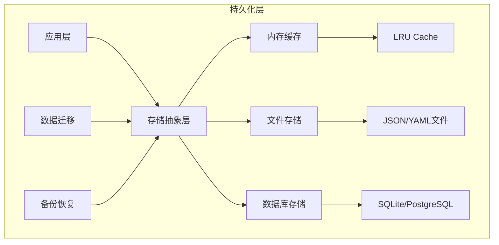

# 持久化设计

## 1. 概述

持久化层负责虚拟设备系统数据的存储、检索和备份。支持多种存储后端，包括内存缓存、文件系统和数据库，以满足不同场景的需求。

## 2. 存储架构



## 3. 存储抽象层

### 3.1 存储接口定义

```python
from abc import ABC, abstractmethod
from typing import Any, Dict, List, Optional, TypeVar, Generic
from datetime import datetime

T = TypeVar('T')

class StorageBackend(ABC, Generic[T]):
    """存储后端抽象基类"""
    
    @abstractmethod
    async def save(self, key: str, data: T) -> bool:
        """保存数据"""
        pass
    
    @abstractmethod
    async def load(self, key: str) -> Optional[T]:
        """加载数据"""
        pass
    
    @abstractmethod
    async def delete(self, key: str) -> bool:
        """删除数据"""
        pass
    
    @abstractmethod
    async def exists(self, key: str) -> bool:
        """检查数据是否存在"""
        pass
    
    @abstractmethod
    async def list_keys(self, prefix: str = "") -> List[str]:
        """列出所有键"""
        pass
    
    @abstractmethod
    async def clear(self) -> bool:
        """清空存储"""
        pass

class StorageConfig:
    """存储配置"""
    
    def __init__(
        self,
        backend_type: str = "memory",
        file_path: Optional[str] = None,
        db_url: Optional[str] = None,
        cache_size: int = 1000,
        auto_save: bool = True,
        save_interval_seconds: int = 300
    ):
        self.backend_type = backend_type
        self.file_path = file_path
        self.db_url = db_url
        self.cache_size = cache_size
        self.auto_save = auto_save
        self.save_interval_seconds = save_interval_seconds
```

## 4. 内存缓存实现

### 4.1 LRU 缓存存储

```python
from collections import OrderedDict
import threading
import time

class MemoryStorage(StorageBackend[T]):
    """内存存储后端 - 基于LRU缓存"""
    
    def __init__(self, max_size: int = 1000, ttl_seconds: Optional[int] = None):
        self._cache: OrderedDict[str, tuple[T, Optional[float]]] = OrderedDict()
        self._max_size = max_size
        self._ttl_seconds = ttl_seconds
        self._lock = threading.RLock()
    
    async def save(self, key: str, data: T) -> bool:
        """保存数据到内存"""
        with self._lock:
            expiry = time.time() + self._ttl_seconds if self._ttl_seconds else None
            
            # 如果已存在，移到末尾
            if key in self._cache:
                self._cache.move_to_end(key)
            
            self._cache[key] = (data, expiry)
            
            # 超出容量时移除最旧的
            while len(self._cache) > self._max_size:
                self._cache.popitem(last=False)
        
        return True
    
    async def load(self, key: str) -> Optional[T]:
        """从内存加载数据"""
        with self._lock:
            if key not in self._cache:
                return None
            
            data, expiry = self._cache[key]
            
            # 检查是否过期
            if expiry and time.time() > expiry:
                del self._cache[key]
                return None
            
            # 移到末尾（最近使用）
            self._cache.move_to_end(key)
            
            return data
    
    async def delete(self, key: str) -> bool:
        """删除数据"""
        with self._lock:
            if key in self._cache:
                del self._cache[key]
                return True
            return False
    
    async def exists(self, key: str) -> bool:
        """检查数据是否存在"""
        data = await self.load(key)
        return data is not None
    
    async def list_keys(self, prefix: str = "") -> List[str]:
        """列出所有键"""
        with self._lock:
            keys = list(self._cache.keys())
            if prefix:
                keys = [k for k in keys if k.startswith(prefix)]
            return keys
    
    async def clear(self) -> bool:
        """清空缓存"""
        with self._lock:
            self._cache.clear()
        return True
    
    def get_stats(self) -> dict:
        """获取缓存统计"""
        with self._lock:
            return {
                "size": len(self._cache),
                "max_size": self._max_size,
                "utilization": len(self._cache) / self._max_size
            }
```

## 5. 文件存储实现

### 5.1 JSON 文件存储

```python
import json
import os
import aiofiles
from pathlib import Path

class FileStorage(StorageBackend[T]):
    """文件存储后端"""
    
    def __init__(
        self, 
        base_path: str,
        serializer = None,
        deserializer = None,
        file_extension: str = ".json"
    ):
        self._base_path = Path(base_path)
        self._base_path.mkdir(parents=True, exist_ok=True)
        
        self._serializer = serializer or self._default_serialize
        self._deserializer = deserializer or self._default_deserialize
        self._file_extension = file_extension
    
    def _get_file_path(self, key: str) -> Path:
        """获取文件路径"""
        # 将键转换为安全文件名
        safe_key = key.replace("/", "_").replace("\\", "_")
        return self._base_path / f"{safe_key}{self._file_extension}"
    
    @staticmethod
    def _default_serialize(data: Any) -> str:
        """默认序列化"""
        return json.dumps(data, indent=2, ensure_ascii=False, default=str)
    
    @staticmethod
    def _default_deserialize(data: str) -> Any:
        """默认反序列化"""
        return json.loads(data)
    
    async def save(self, key: str, data: T) -> bool:
        """保存数据到文件"""
        try:
            file_path = self._get_file_path(key)
            serialized = self._serializer(data)
            
            async with aiofiles.open(file_path, 'w', encoding='utf-8') as f:
                await f.write(serialized)
            
            return True
        except Exception as e:
            print(f"保存文件失败: {e}")
            return False
    
    async def load(self, key: str) -> Optional[T]:
        """从文件加载数据"""
        file_path = self._get_file_path(key)
        
        if not file_path.exists():
            return None
        
        try:
            async with aiofiles.open(file_path, 'r', encoding='utf-8') as f:
                content = await f.read()
            
            return self._deserializer(content)
        except Exception as e:
            print(f"加载文件失败: {e}")
            return None
    
    async def delete(self, key: str) -> bool:
        """删除文件"""
        file_path = self._get_file_path(key)
        
        try:
            if file_path.exists():
                file_path.unlink()
                return True
            return False
        except Exception as e:
            print(f"删除文件失败: {e}")
            return False
    
    async def exists(self, key: str) -> bool:
        """检查文件是否存在"""
        return self._get_file_path(key).exists()
    
    async def list_keys(self, prefix: str = "") -> List[str]:
        """列出所有键"""
        keys = []
        
        for file_path in self._base_path.glob(f"*{self._file_extension}"):
            key = file_path.stem
            if not prefix or key.startswith(prefix):
                keys.append(key)
        
        return keys
    
    async def clear(self) -> bool:
        """清空所有文件"""
        try:
            for file_path in self._base_path.glob(f"*{self._file_extension}"):
                file_path.unlink()
            return True
        except Exception as e:
            print(f"清空文件失败: {e}")
            return False
```

## 6. 数据库存储实现

### 6.1 SQLite 存储

```python
import sqlite3
import json
from contextlib import asynccontextmanager

class SQLiteStorage(StorageBackend[T]):
    """SQLite存储后端"""
    
    def __init__(self, db_path: str, table_name: str = "storage"):
        self._db_path = db_path
        self._table_name = table_name
        self._lock = threading.RLock()
        
        # 初始化数据库
        self._init_db()
    
    def _init_db(self):
        """初始化数据库表"""
        with sqlite3.connect(self._db_path) as conn:
            conn.execute(f"""
                CREATE TABLE IF NOT EXISTS {self._table_name} (
                    key TEXT PRIMARY KEY,
                    data TEXT NOT NULL,
                    created_at TIMESTAMP DEFAULT CURRENT_TIMESTAMP,
                    updated_at TIMESTAMP DEFAULT CURRENT_TIMESTAMP
                )
            """)
            conn.commit()
    
    async def save(self, key: str, data: T) -> bool:
        """保存数据"""
        try:
            serialized = json.dumps(data, default=str)
            
            with self._lock:
                with sqlite3.connect(self._db_path) as conn:
                    conn.execute(f"""
                        INSERT INTO {self._table_name} (key, data, updated_at)
                        VALUES (?, ?, CURRENT_TIMESTAMP)
                        ON CONFLICT(key) DO UPDATE SET
                            data = excluded.data,
                            updated_at = CURRENT_TIMESTAMP
                    """, (key, serialized))
                    conn.commit()
            
            return True
        except Exception as e:
            print(f"保存到数据库失败: {e}")
            return False
    
    async def load(self, key: str) -> Optional[T]:
        """加载数据"""
        try:
            with self._lock:
                with sqlite3.connect(self._db_path) as conn:
                    cursor = conn.execute(
                        f"SELECT data FROM {self._table_name} WHERE key = ?",
                        (key,)
                    )
                    row = cursor.fetchone()
                    
                    if row:
                        return json.loads(row[0])
                    return None
        except Exception as e:
            print(f"从数据库加载失败: {e}")
            return None
    
    async def delete(self, key: str) -> bool:
        """删除数据"""
        try:
            with self._lock:
                with sqlite3.connect(self._db_path) as conn:
                    cursor = conn.execute(
                        f"DELETE FROM {self._table_name} WHERE key = ?",
                        (key,)
                    )
                    conn.commit()
                    return cursor.rowcount > 0
        except Exception as e:
            print(f"从数据库删除失败: {e}")
            return False
    
    async def exists(self, key: str) -> bool:
        """检查数据是否存在"""
        try:
            with self._lock:
                with sqlite3.connect(self._db_path) as conn:
                    cursor = conn.execute(
                        f"SELECT 1 FROM {self._table_name} WHERE key = ?",
                        (key,)
                    )
                    return cursor.fetchone() is not None
        except Exception:
            return False
    
    async def list_keys(self, prefix: str = "") -> List[str]:
        """列出所有键"""
        try:
            with self._lock:
                with sqlite3.connect(self._db_path) as conn:
                    if prefix:
                        cursor = conn.execute(
                            f"SELECT key FROM {self._table_name} WHERE key LIKE ?",
                            (f"{prefix}%",)
                        )
                    else:
                        cursor = conn.execute(f"SELECT key FROM {self._table_name}")
                    
                    return [row[0] for row in cursor.fetchall()]
        except Exception as e:
            print(f"列出数据库键失败: {e}")
            return []
    
    async def clear(self) -> bool:
        """清空数据"""
        try:
            with self._lock:
                with sqlite3.connect(self._db_path) as conn:
                    conn.execute(f"DELETE FROM {self._table_name}")
                    conn.commit()
            return True
        except Exception as e:
            print(f"清空数据库失败: {e}")
            return False
```

## 7. 多级存储策略

### 7.1 分层存储管理器

```python
class TieredStorage:
    """分层存储管理器 - L1缓存 + L2文件 + L3数据库"""
    
    def __init__(
        self,
        l1_cache: Optional[MemoryStorage] = None,
        l2_file: Optional[FileStorage] = None,
        l3_db: Optional[SQLiteStorage] = None
    ):
        self._l1 = l1_cache
        self._l2 = l2_file
        self._l3 = l3_db
        
        # 写策略: 写穿(write-through) 或 写回(write-back)
        self._write_through = True
    
    async def save(
        self, 
        key: str, 
        data: T, 
        tiers: List[int] = [1, 2, 3]
    ) -> bool:
        """
        保存数据到指定层级
        
        Args:
            key: 数据键
            data: 数据
            tiers: 要保存到的层级列表 [1, 2, 3]
        """
        success = True
        
        # L1 - 内存缓存
        if 1 in tiers and self._l1:
            success &= await self._l1.save(key, data)
        
        # L2 - 文件存储
        if 2 in tiers and self._l2:
            success &= await self._l2.save(key, data)
        
        # L3 - 数据库存储
        if 3 in tiers and self._l3:
            success &= await self._l3.save(key, data)
        
        return success
    
    async def load(
        self, 
        key: str, 
        promote: bool = True
    ) -> Optional[T]:
        """
        加载数据（按L1->L2->L3顺序）
        
        Args:
            key: 数据键
            promote: 是否将数据提升到更高层级缓存
        
        Returns:
            数据或None
        """
        # 尝试L1
        if self._l1:
            data = await self._l1.load(key)
            if data is not None:
                return data
        
        # 尝试L2
        if self._l2:
            data = await self._l2.load(key)
            if data is not None:
                # 提升到L1
                if promote and self._l1:
                    await self._l1.save(key, data)
                return data
        
        # 尝试L3
        if self._l3:
            data = await self._l3.load(key)
            if data is not None:
                # 提升到L1和L2
                if promote:
                    if self._l1:
                        await self._l1.save(key, data)
                    if self._l2:
                        await self._l2.save(key, data)
                return data
        
        return None
    
    async def delete(self, key: str, tiers: List[int] = [1, 2, 3]) -> bool:
        """从指定层级删除数据"""
        success = True
        
        if 1 in tiers and self._l1:
            success &= await self._l1.delete(key)
        
        if 2 in tiers and self._l2:
            success &= await self._l2.delete(key)
        
        if 3 in tiers and self._l3:
            success &= await self._l3.delete(key)
        
        return success
    
    async def sync(self, key: str) -> bool:
        """同步各层级的数据"""
        # 从最高层级加载
        data = await self.load(key, promote=False)
        
        if data is None:
            return False
        
        # 写入所有层级
        return await self.save(key, data, tiers=[1, 2, 3])
```

## 8. 数据模型持久化

### 8.1 设备配置存储

```python
from dataclasses import asdict

class DeviceConfigRepository:
    """设备配置仓库"""
    
    KEY_PREFIX = "device_config:"
    
    def __init__(self, storage: StorageBackend):
        self._storage = storage
    
    def _make_key(self, device_id: str) -> str:
        """生成存储键"""
        return f"{self.KEY_PREFIX}{device_id}"
    
    async def save(self, config: DeviceConfig) -> bool:
        """保存设备配置"""
        key = self._make_key(config.device_id)
        data = config.dict()
        return await self._storage.save(key, data)
    
    async def load(self, device_id: str) -> Optional[DeviceConfig]:
        """加载设备配置"""
        key = self._make_key(device_id)
        data = await self._storage.load(key)
        
        if data:
            return DeviceConfig(**data)
        return None
    
    async def delete(self, device_id: str) -> bool:
        """删除设备配置"""
        key = self._make_key(device_id)
        return await self._storage.delete(key)
    
    async def list_all(self) -> List[str]:
        """列出所有设备ID"""
        keys = await self._storage.list_keys(self.KEY_PREFIX)
        return [k.replace(self.KEY_PREFIX, "") for k in keys]
```

### 8.2 历史数据存储

```python
class HistoricalDataRepository:
    """历史数据仓库 - 按时间分片存储"""
    
    def __init__(self, storage: StorageBackend, shard_hours: int = 24):
        self._storage = storage
        self._shard_hours = shard_hours
    
    def _make_key(self, device_id: str, timestamp: datetime) -> str:
        """生成存储键（按天分片）"""
        shard = timestamp.strftime("%Y%m%d")
        return f"history:{device_id}:{shard}"
    
    async def append(self, device_id: str, data: SensorData) -> bool:
        """追加历史数据"""
        key = self._make_key(device_id, data.timestamp)
        
        # 加载现有数据
        existing = await self._storage.load(key) or []
        existing.append(data.dict())
        
        # 保存
        return await self._storage.save(key, existing)
    
    async def query(
        self,
        device_id: str,
        start_time: datetime,
        end_time: datetime
    ) -> List[SensorData]:
        """查询历史数据"""
        results = []
        
        # 计算涉及的分片
        current = start_time.replace(hour=0, minute=0, second=0, microsecond=0)
        while current <= end_time:
            key = self._make_key(device_id, current)
            shard_data = await self._storage.load(key)
            
            if shard_data:
                for item in shard_data:
                    item_time = datetime.fromisoformat(item['timestamp'])
                    if start_time <= item_time <= end_time:
                        results.append(SensorData(**item))
            
            current += timedelta(days=1)
        
        return results
```

## 9. 备份与恢复

### 9.1 备份管理器

```python
import zipfile
import shutil
from datetime import datetime

class BackupManager:
    """备份管理器"""
    
    def __init__(self, storage: StorageBackend, backup_dir: str):
        self._storage = storage
        self._backup_dir = Path(backup_dir)
        self._backup_dir.mkdir(parents=True, exist_ok=True)
    
    async def create_backup(self, name: Optional[str] = None) -> str:
        """
        创建备份
        
        Returns:
            备份文件路径
        """
        backup_name = name or f"backup_{datetime.now().strftime('%Y%m%d_%H%M%S')}"
        backup_path = self._backup_dir / f"{backup_name}.zip"
        
        # 创建临时目录
        temp_dir = self._backup_dir / "temp_backup"
        temp_dir.mkdir(exist_ok=True)
        
        try:
            # 导出所有数据
            keys = await self._storage.list_keys()
            
            for key in keys:
                data = await self._storage.load(key)
                if data is not None:
                    file_path = temp_dir / f"{key}.json"
                    file_path.parent.mkdir(parents=True, exist_ok=True)
                    
                    async with aiofiles.open(file_path, 'w') as f:
                        await f.write(json.dumps(data, default=str))
            
            # 打包为zip
            with zipfile.ZipFile(backup_path, 'w', zipfile.ZIP_DEFLATED) as zf:
                for file_path in temp_dir.rglob("*.json"):
                    arcname = file_path.relative_to(temp_dir)
                    zf.write(file_path, arcname)
            
            return str(backup_path)
        
        finally:
            # 清理临时目录
            shutil.rmtree(temp_dir, ignore_errors=True)
    
    async def restore_backup(self, backup_path: str) -> bool:
        """从备份恢复"""
        try:
            backup_file = Path(backup_path)
            if not backup_file.exists():
                return False
            
            # 创建临时目录
            temp_dir = self._backup_dir / "temp_restore"
            temp_dir.mkdir(exist_ok=True)
            
            try:
                # 解压备份
                with zipfile.ZipFile(backup_file, 'r') as zf:
                    zf.extractall(temp_dir)
                
                # 恢复数据
                for file_path in temp_dir.rglob("*.json"):
                    key = file_path.stem
                    
                    async with aiofiles.open(file_path, 'r') as f:
                        content = await f.read()
                        data = json.loads(content)
                    
                    await self._storage.save(key, data)
                
                return True
            
            finally:
                shutil.rmtree(temp_dir, ignore_errors=True)
        
        except Exception as e:
            print(f"恢复备份失败: {e}")
            return False
    
    def list_backups(self) -> List[dict]:
        """列出所有备份"""
        backups = []
        
        for backup_file in self._backup_dir.glob("*.zip"):
            stat = backup_file.stat()
            backups.append({
                "name": backup_file.stem,
                "path": str(backup_file),
                "size": stat.st_size,
                "created": datetime.fromtimestamp(stat.st_ctime).isoformat()
            })
        
        return sorted(backups, key=lambda x: x['created'], reverse=True)
```

## 10. 设计决策

| 决策 | 选择 | 理由 |
|------|------|------|
| 存储抽象 | 接口抽象 | 支持多种后端、易于测试 |
| 缓存策略 | LRU | 简单高效、符合访问模式 |
| 分层存储 | L1/L2/L3 | 性能与持久化平衡 |
| 历史数据分片 | 按天 | 查询效率高、易于清理 |
| 备份格式 | ZIP + JSON | 通用、可读、易迁移 |

---

**文档状态**: 初稿  
**最后更新**: 2026-04-08  
**作者**: AI Assistant
