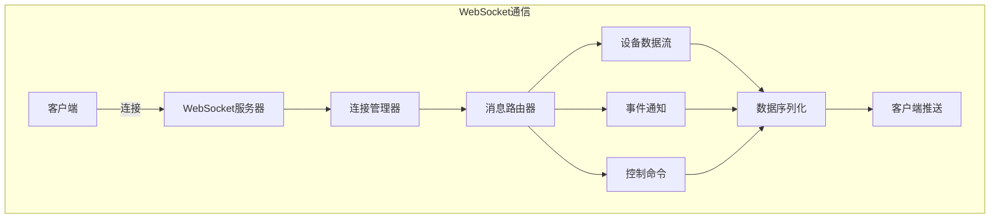

# WebSocket 设计

## 1. 概述

WebSocket 提供虚拟设备系统的实时双向通信能力，用于实时数据推送、事件通知和交互式控制。相比 REST API 的轮询方式，WebSocket 具有更低的延迟和更高的效率。

## 2. WebSocket 架构



## 3. 连接管理

### 3.1 连接建立

```
ws://host:port/ws/v1/devices/{device_id}
```

**连接参数:**

| 参数 | 位置 | 说明 |
|------|------|------|
| device_id | URL | 设备标识 |
| token | Query | 认证令牌 |
| client_type | Query | 客户端类型: web/app |

**连接示例:**

```javascript
const ws = new WebSocket(
  'ws://localhost:8080/ws/v1/devices/vd_001?token=xxx&client_type=web'
);
```

### 3.2 连接状态

```python
from enum import Enum

class ConnectionState(Enum):
    """连接状态"""
    CONNECTING = "connecting"    # 连接中
    CONNECTED = "connected"      # 已连接
    AUTHENTICATING = "authenticating"  # 认证中
    READY = "ready"              # 就绪
    CLOSING = "closing"          # 关闭中
    CLOSED = "closed"            # 已关闭
    ERROR = "error"              # 错误
```

### 3.3 连接管理器

```python
import asyncio
from typing import Dict, Set
from fastapi import WebSocket

class ConnectionManager:
    """WebSocket 连接管理器"""
    
    def __init__(self):
        # 设备ID -> 连接集合
        self._device_connections: Dict[str, Set[WebSocket]] = {}
        # 连接 -> 元数据
        self._connection_meta: Dict[WebSocket, dict] = {}
        self._lock = asyncio.Lock()
    
    async def connect(
        self, 
        websocket: WebSocket, 
        device_id: str,
        client_type: str = "web"
    ):
        """建立连接"""
        await websocket.accept()
        
        async with self._lock:
            if device_id not in self._device_connections:
                self._device_connections[device_id] = set()
            
            self._device_connections[device_id].add(websocket)
            self._connection_meta[websocket] = {
                "device_id": device_id,
                "client_type": client_type,
                "connected_at": datetime.utcnow(),
                "state": ConnectionState.CONNECTED
            }
    
    async def disconnect(self, websocket: WebSocket):
        """断开连接"""
        async with self._lock:
            meta = self._connection_meta.pop(websocket, None)
            
            if meta:
                device_id = meta["device_id"]
                if device_id in self._device_connections:
                    self._device_connections[device_id].discard(websocket)
                    
                    # 清理空集合
                    if not self._device_connections[device_id]:
                        del self._device_connections[device_id]
    
    async def broadcast_to_device(
        self, 
        device_id: str, 
        message: dict
    ):
        """广播消息到设备的所有客户端"""
        if device_id not in self._device_connections:
            return
        
        disconnected = []
        message_json = json.dumps(message)
        
        for connection in self._device_connections[device_id]:
            try:
                await connection.send_text(message_json)
            except Exception:
                disconnected.append(connection)
        
        # 清理断开的连接
        for conn in disconnected:
            await self.disconnect(conn)
    
    def get_device_connections(self, device_id: str) -> int:
        """获取设备的连接数"""
        return len(self._device_connections.get(device_id, set()))
    
    def get_stats(self) -> dict:
        """获取连接统计"""
        return {
            "total_connections": len(self._connection_meta),
            "device_count": len(self._device_connections),
            "connections_per_device": {
                device_id: len(connections)
                for device_id, connections in self._device_connections.items()
            }
        }
```

## 4. 消息协议

### 4.1 消息格式

```json
{
  "type": "data_update",
  "timestamp": "2026-04-08T10:30:00Z",
  "payload": {},
  "sequence": 123,
  "ack_required": false
}
```

**消息类型:**

| Type | 方向 | 说明 |
|------|------|------|
| auth | C->S | 认证请求 |
| auth_response | S->C | 认证响应 |
| data_update | S->C | 数据更新 |
| event_notification | S->C | 事件通知 |
| command | C->S | 控制命令 |
| command_response | S->C | 命令响应 |
| ping | C->S | 心跳请求 |
| pong | S->C | 心跳响应 |
| error | S->C | 错误通知 |
| subscribe | C->S | 订阅请求 |
| unsubscribe | C->S | 取消订阅 |

### 4.2 认证消息

**请求:**

```json
{
  "type": "auth",
  "payload": {
    "token": "Bearer xxx",
    "client_id": "client_001"
  }
}
```

**响应:**

```json
{
  "type": "auth_response",
  "payload": {
    "success": true,
    "client_id": "client_001",
    "permissions": ["read", "write", "control"]
  }
}
```

### 4.3 数据更新消息

```json
{
  "type": "data_update",
  "timestamp": "2026-04-08T10:30:00Z",
  "payload": {
    "device_id": "vd_001",
    "data_type": "sensor_data",
    "data": {
      "temperature": 23.5,
      "humidity": 58.2,
      "light": 32500,
      "soil_moisture": 62.1
    },
    "metadata": {
      "virtual_time": "2026-04-08T10:30:00Z",
      "data_source": "simulation",
      "scenario": "normal"
    }
  },
  "sequence": 123
}
```

### 4.4 事件通知消息

```json
{
  "type": "event_notification",
  "timestamp": "2026-04-08T10:30:00Z",
  "payload": {
    "event_type": "scenario_transition",
    "event_id": "evt_001",
    "device_id": "vd_001",
    "details": {
      "from_scenario": "normal",
      "to_scenario": "high_temperature",
      "progress": 0.5
    }
  }
}
```

### 4.5 控制命令消息

**请求:**

```json
{
  "type": "command",
  "request_id": "cmd_001",
  "payload": {
    "action": "switch_scenario",
    "params": {
      "scenario_id": "high_temperature",
      "transition_time_ms": 5000
    }
  }
}
```

**响应:**

```json
{
  "type": "command_response",
  "request_id": "cmd_001",
  "payload": {
    "success": true,
    "message": "Scenario switch initiated",
    "data": {
      "new_scenario": "high_temperature"
    }
  }
}
```

### 4.6 心跳消息

**Ping:**

```json
{
  "type": "ping",
  "timestamp": "2026-04-08T10:30:00Z",
  "sequence": 1
}
```

**Pong:**

```json
{
  "type": "pong",
  "timestamp": "2026-04-08T10:30:00Z",
  "sequence": 1,
  "server_time": "2026-04-08T10:30:00Z"
}
```

## 5. 订阅机制

### 5.1 订阅管理

```python
from enum import Enum
from typing import Set

class DataChannel(Enum):
    """数据频道"""
    SENSOR_DATA = "sensor_data"           # 传感器数据
    EVENTS = "events"                     # 事件通知
    LOGS = "logs"                         # 日志
    STATISTICS = "statistics"             # 统计信息
    SCENARIO_STATUS = "scenario_status"   # 场景状态
    TIMELINE = "timeline"                 # 时间线更新

class SubscriptionManager:
    """订阅管理器"""
    
    def __init__(self):
        # 连接 -> 订阅频道集合
        self._subscriptions: Dict[WebSocket, Set[DataChannel]] = {}
        # 频道 -> 连接集合（反向索引）
        self._channel_connections: Dict[DataChannel, Set[WebSocket]] = {}
    
    def subscribe(self, websocket: WebSocket, channels: List[DataChannel]):
        """订阅频道"""
        if websocket not in self._subscriptions:
            self._subscriptions[websocket] = set()
        
        for channel in channels:
            self._subscriptions[websocket].add(channel)
            
            if channel not in self._channel_connections:
                self._channel_connections[channel] = set()
            self._channel_connections[channel].add(websocket)
    
    def unsubscribe(self, websocket: WebSocket, channels: List[DataChannel] = None):
        """取消订阅"""
        if websocket not in self._subscriptions:
            return
        
        if channels is None:
            # 取消所有订阅
            channels = list(self._subscriptions[websocket])
        
        for channel in channels:
            self._subscriptions[websocket].discard(channel)
            if channel in self._channel_connections:
                self._channel_connections[channel].discard(websocket)
    
    def get_subscribers(self, channel: DataChannel) -> Set[WebSocket]:
        """获取频道的所有订阅者"""
        return self._channel_connections.get(channel, set())
    
    def clear_subscriptions(self, websocket: WebSocket):
        """清除连接的所有订阅"""
        self.unsubscribe(websocket)
        self._subscriptions.pop(websocket, None)
```

### 5.2 订阅消息

**订阅请求:**

```json
{
  "type": "subscribe",
  "payload": {
    "channels": ["sensor_data", "events", "scenario_status"]
  }
}
```

**取消订阅:**

```json
{
  "type": "unsubscribe",
  "payload": {
    "channels": ["logs"]
  }
}
```

## 6. 消息处理器

### 6.1 处理器注册

```python
from typing import Callable, Dict

class MessageHandler:
    """消息处理器"""
    
    def __init__(self):
        self._handlers: Dict[str, Callable] = {}
    
    def register(self, message_type: str, handler: Callable):
        """注册处理器"""
        self._handlers[message_type] = handler
    
    async def handle(
        self, 
        websocket: WebSocket, 
        message: dict,
        context: dict
    ) -> Optional[dict]:
        """处理消息"""
        msg_type = message.get("type")
        handler = self._handlers.get(msg_type)
        
        if handler:
            return await handler(websocket, message, context)
        
        return {
            "type": "error",
            "payload": {
                "code": "UNKNOWN_MESSAGE_TYPE",
                "message": f"Unknown message type: {msg_type}"
            }
        }

# 初始化处理器
handler = MessageHandler()

@handler.register("auth")
async def handle_auth(websocket, message, context):
    """处理认证"""
    token = message["payload"]["token"]
    # 验证token...
    return {
        "type": "auth_response",
        "payload": {"success": True}
    }

@handler.register("command")
async def handle_command(websocket, message, context):
    """处理控制命令"""
    action = message["payload"]["action"]
    device = context.get("device")
    
    # 执行命令
    result = await device.execute_command(action, message["payload"].get("params", {}))
    
    return {
        "type": "command_response",
        "request_id": message.get("request_id"),
        "payload": result
    }

@handler.register("ping")
async def handle_ping(websocket, message, context):
    """处理心跳"""
    return {
        "type": "pong",
        "sequence": message.get("sequence"),
        "server_time": datetime.utcnow().isoformat()
    }
```

## 7. 实时数据流

### 7.1 数据推送服务

```python
import asyncio
from asyncio import Queue

class DataPushService:
    """数据推送服务"""
    
    def __init__(self, connection_manager: ConnectionManager):
        self._connection_manager = connection_manager
        self._data_queue: Queue = Queue()
        self._running = False
    
    async def start(self):
        """启动推送服务"""
        self._running = True
        while self._running:
            try:
                # 从队列获取数据
                data_packet = await asyncio.wait_for(
                    self._data_queue.get(), 
                    timeout=1.0
                )
                
                # 推送到相关客户端
                await self._push_data(data_packet)
                
            except asyncio.TimeoutError:
                continue
            except Exception as e:
                print(f"Push error: {e}")
    
    async def _push_data(self, packet: dict):
        """推送数据"""
        device_id = packet["device_id"]
        channel = packet["channel"]
        
        # 构建消息
        message = {
            "type": "data_update",
            "timestamp": datetime.utcnow().isoformat(),
            "payload": packet["data"]
        }
        
        # 广播到设备的所有连接
        await self._connection_manager.broadcast_to_device(device_id, message)
    
    async def publish(self, device_id: str, channel: DataChannel, data: dict):
        """发布数据"""
        await self._data_queue.put({
            "device_id": device_id,
            "channel": channel,
            "data": data
        })
    
    def stop(self):
        """停止推送服务"""
        self._running = False
```

### 7.2 节流与采样

```python
import time
from collections import defaultdict

class ThrottledPublisher:
    """节流发布器"""
    
    def __init__(self, push_service: DataPushService, min_interval_ms: float = 100):
        self._push_service = push_service
        self._min_interval = min_interval_ms / 1000.0
        self._last_publish: Dict[str, float] = defaultdict(float)
    
    async def publish(
        self, 
        device_id: str, 
        channel: DataChannel, 
        data: dict
    ):
        """节流发布"""
        key = f"{device_id}:{channel.value}"
        now = time.time()
        
        # 检查是否超过最小间隔
        if now - self._last_publish[key] < self._min_interval:
            return
        
        self._last_publish[key] = now
        await self._push_service.publish(device_id, channel, data)
```

## 8. 错误处理

### 8.1 错误消息格式

```json
{
  "type": "error",
  "timestamp": "2026-04-08T10:30:00Z",
  "payload": {
    "code": "AUTH_FAILED",
    "message": "Authentication failed",
    "details": {
      "reason": "Invalid token"
    }
  }
}
```

### 8.2 错误码定义

| Code | 说明 | 处理建议 |
|------|------|----------|
| AUTH_FAILED | 认证失败 | 重新获取token |
| AUTH_EXPIRED | token过期 | 刷新token |
| PERMISSION_DENIED | 权限不足 | 检查权限配置 |
| DEVICE_NOT_FOUND | 设备不存在 | 检查device_id |
| DEVICE_OFFLINE | 设备离线 | 等待设备上线 |
| RATE_LIMITED | 请求过于频繁 | 降低请求频率 |
| INVALID_MESSAGE | 消息格式错误 | 检查消息格式 |
| INTERNAL_ERROR | 内部错误 | 联系管理员 |

## 9. 连接保活

### 9.1 心跳机制

```python
import asyncio

class HeartbeatManager:
    """心跳管理器"""
    
    def __init__(self, interval_seconds: float = 30, timeout_seconds: float = 60):
        self._interval = interval_seconds
        self._timeout = timeout_seconds
        self._last_pong: Dict[WebSocket, float] = {}
        self._running = False
    
    async def start_monitoring(self, connection_manager: ConnectionManager):
        """开始监控心跳"""
        self._running = True
        
        while self._running:
            now = time.time()
            disconnected = []
            
            for websocket, last_pong in self._last_pong.items():
                # 检查是否超时
                if now - last_pong > self._timeout:
                    disconnected.append(websocket)
            
            # 断开超时连接
            for websocket in disconnected:
                await connection_manager.disconnect(websocket)
                self._last_pong.pop(websocket, None)
            
            await asyncio.sleep(self._interval)
    
    def record_pong(self, websocket: WebSocket):
        """记录pong响应"""
        self._last_pong[websocket] = time.time()
    
    def register_connection(self, websocket: WebSocket):
        """注册新连接"""
        self._last_pong[websocket] = time.time()
    
    def unregister_connection(self, websocket: WebSocket):
        """注销连接"""
        self._last_pong.pop(websocket, None)
```

## 10. 设计决策

| 决策 | 选择 | 理由 |
|------|------|------|
| 协议 | WebSocket (RFC 6455) | 标准、广泛支持 |
| 消息格式 | JSON | 可读性好、易于调试 |
| 认证方式 | Token-based | 无状态、可扩展 |
| 心跳间隔 | 30秒 | 平衡实时性和资源消耗 |
| 订阅模式 | 频道订阅 | 灵活、节省带宽 |
| 重连策略 | 指数退避 | 避免服务器过载 |

---

**文档状态**: 初稿  
**最后更新**: 2026-04-08  
**作者**: AI Assistant
