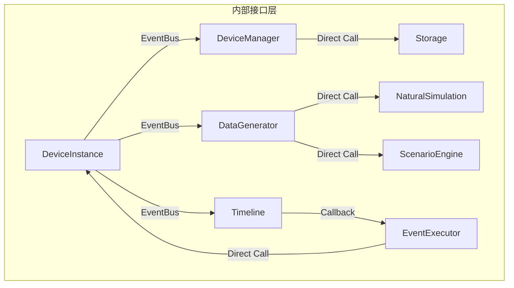

# 内部接口设计

## 1. 概述

内部接口定义虚拟设备系统各模块之间的通信契约，确保模块间松耦合、高内聚。采用基于事件的发布-订阅模式和直接的函数调用两种形式。

## 2. 接口架构



## 3. 事件总线接口

### 3.1 事件总线定义

```python
from typing import Callable, Dict, List, Any
from enum import Enum
import asyncio

class EventType(Enum):
    """系统事件类型"""
    # 设备生命周期事件
    DEVICE_CREATED = "device.created"
    DEVICE_STARTED = "device.started"
    DEVICE_STOPPED = "device.stopped"
    DEVICE_DESTROYED = "device.destroyed"
    DEVICE_ERROR = "device.error"
    
    # 数据事件
    DATA_GENERATED = "data.generated"
    DATA_REPORTED = "data.reported"
    
    # 场景事件
    SCENARIO_CHANGED = "scenario.changed"
    SCENARIO_TRANSITION = "scenario.transition"
    
    # 时间线事件
    EVENT_TRIGGERED = "timeline.event_triggered"
    EVENT_COMPLETED = "timeline.event_completed"
    TIME_SCALE_CHANGED = "timeline.time_scale_changed"
    
    # 网络事件
    DEVICE_DISCOVERED = "network.device_discovered"
    WIFI_CONNECTED = "network.wifi_connected"
    REPORT_SENT = "network.report_sent"

class Event:
    """事件对象"""
    
    def __init__(
        self,
        event_type: EventType,
        source: str,
        payload: Dict[str, Any],
        timestamp: Optional[datetime] = None
    ):
        self.event_type = event_type
        self.source = source
        self.payload = payload
        self.timestamp = timestamp or datetime.utcnow()
        self.event_id = self._generate_id()
    
    def _generate_id(self) -> str:
        """生成事件ID"""
        import uuid
        return f"evt_{uuid.uuid4().hex[:12]}"

class EventBus:
    """事件总线 - 发布订阅模式"""
    
    def __init__(self):
        self._subscribers: Dict[EventType, List[Callable]] = {}
        self._global_subscribers: List[Callable] = []
        self._event_history: List[Event] = []
        self._max_history = 1000
        self._lock = asyncio.Lock()
    
    def subscribe(
        self, 
        event_type: EventType, 
        handler: Callable[[Event], None]
    ) -> str:
        """订阅特定类型事件"""
        subscription_id = self._generate_subscription_id()
        
        if event_type not in self._subscribers:
            self._subscribers[event_type] = []
        
        self._subscribers[event_type].append({
            "id": subscription_id,
            "handler": handler
        })
        
        return subscription_id
    
    def subscribe_all(self, handler: Callable[[Event], None]) -> str:
        """订阅所有事件"""
        subscription_id = self._generate_subscription_id()
        self._global_subscribers.append({
            "id": subscription_id,
            "handler": handler
        })
        return subscription_id
    
    def unsubscribe(self, subscription_id: str):
        """取消订阅"""
        # 从特定类型订阅中移除
        for event_type, subscribers in self._subscribers.items():
            self._subscribers[event_type] = [
                s for s in subscribers if s["id"] != subscription_id
            ]
        
        # 从全局订阅中移除
        self._global_subscribers = [
            s for s in self._global_subscribers if s["id"] != subscription_id
        ]
    
    async def publish(self, event: Event):
        """发布事件"""
        # 保存到历史
        self._event_history.append(event)
        if len(self._event_history) > self._max_history:
            self._event_history.pop(0)
        
        # 调用特定类型订阅者
        if event.event_type in self._subscribers:
            for subscriber in self._subscribers[event.event_type]:
                try:
                    await self._invoke_handler(subscriber["handler"], event)
                except Exception as e:
                    print(f"Event handler error: {e}")
        
        # 调用全局订阅者
        for subscriber in self._global_subscribers:
            try:
                await self._invoke_handler(subscriber["handler"], event)
            except Exception as e:
                print(f"Global event handler error: {e}")
    
    async def _invoke_handler(self, handler: Callable, event: Event):
        """调用处理器"""
        if asyncio.iscoroutinefunction(handler):
            await handler(event)
        else:
            handler(event)
    
    def get_history(
        self, 
        event_type: Optional[EventType] = None,
        limit: int = 100
    ) -> List[Event]:
        """获取事件历史"""
        events = self._event_history
        
        if event_type:
            events = [e for e in events if e.event_type == event_type]
        
        return events[-limit:]
    
    def _generate_subscription_id(self) -> str:
        """生成订阅ID"""
        import uuid
        return f"sub_{uuid.uuid4().hex[:8]}"
```

### 3.2 使用示例

```python
# 创建事件总线实例
event_bus = EventBus()

# 订阅设备启动事件
async def on_device_started(event: Event):
    device_id = event.payload.get("device_id")
    print(f"Device {device_id} started")

subscription_id = event_bus.subscribe(EventType.DEVICE_STARTED, on_device_started)

# 发布事件
await event_bus.publish(Event(
    event_type=EventType.DEVICE_STARTED,
    source="DeviceManager",
    payload={"device_id": "vd_001", "timestamp": datetime.utcnow().isoformat()}
))

# 取消订阅
event_bus.unsubscribe(subscription_id)
```

## 4. 模块间接口

### 4.1 设备管理器接口

```python
from typing import Protocol

class IDeviceManager(Protocol):
    """设备管理器接口"""
    
    async def create_device(self, config: DeviceConfig) -> str:
        """创建设备，返回device_id"""
        ...
    
    async def get_device(self, device_id: str) -> Optional[DeviceInstance]:
        """获取设备实例"""
        ...
    
    async def remove_device(self, device_id: str) -> bool:
        """移除设备"""
        ...
    
    async def list_devices(
        self, 
        status: Optional[DeviceStatus] = None
    ) -> List[DeviceInfo]:
        """列出设备"""
        ...
    
    async def start_device(self, device_id: str) -> bool:
        """启动设备"""
        ...
    
    async def stop_device(self, device_id: str) -> bool:
        """停止设备"""
        ...
    
    def get_stats(self) -> ManagerStats:
        """获取管理器统计"""
        ...
```

### 4.2 数据生成器接口

```python
class IDataGenerator(Protocol):
    """数据生成器接口"""
    
    async def generate(self, context: DataContext) -> SensorData:
        """生成传感器数据"""
        ...
    
    def set_scenario(self, scenario_id: str):
        """设置当前场景"""
        ...
    
    def set_mode(self, mode: DataMode):
        """设置数据模式"""
        ...
    
    def register_modifier(self, modifier: DataModifier):
        """注册数据修改器"""
        ...
    
    def unregister_modifier(self, modifier_id: str):
        """注销数据修改器"""
        ...
```

### 4.3 时间线接口

```python
class ITimeline(Protocol):
    """时间线接口"""
    
    async def add_event(self, event: TimelineEvent) -> str:
        """添加事件，返回event_id"""
        ...
    
    async def remove_event(self, event_id: str) -> bool:
        """移除事件"""
        ...
    
    async def update_event(
        self, 
        event_id: str, 
        updates: Dict[str, Any]
    ) -> bool:
        """更新事件"""
        ...
    
    def get_events(
        self,
        status: Optional[EventStatus] = None,
        start_time: Optional[datetime] = None,
        end_time: Optional[datetime] = None
    ) -> List[TimelineEvent]:
        """获取事件列表"""
        ...
    
    async def set_time_scale(self, scale: float):
        """设置时间加速倍数"""
        ...
    
    async def pause(self):
        """暂停时间"""
        ...
    
    async def resume(self):
        """恢复时间"""
        ...
    
    async def jump_to(self, timestamp: datetime):
        """跳转到指定时间"""
        ...
```

### 4.4 网络服务接口

```python
class INetworkService(Protocol):
    """网络服务接口"""
    
    async def start_discovery(self, port: int):
        """启动设备发现服务"""
        ...
    
    async def stop_discovery(self):
        """停止设备发现服务"""
        ...
    
    async def configure_wifi(self, ssid: str, password: str) -> bool:
        """配置WiFi"""
        ...
    
    async def send_report(self, data: SensorData) -> bool:
        """发送数据上报"""
        ...
    
    def get_network_status(self) -> NetworkStatus:
        """获取网络状态"""
        ...
```

## 5. 回调接口

### 5.1 数据回调

```python
from typing import Callable

# 数据生成回调
DataGeneratedCallback = Callable[[SensorData], None]

# 数据上报回调
DataReportedCallback = Callable[[SensorData, bool], None]

# 场景切换回调
ScenarioChangedCallback = Callable[[str, str], None]  # from, to

# 事件触发回调
EventTriggeredCallback = Callable[[TimelineEvent], None]

class CallbackRegistry:
    """回调注册表"""
    
    def __init__(self):
        self._callbacks: Dict[str, List[Callable]] = {}
    
    def register(self, event: str, callback: Callable):
        """注册回调"""
        if event not in self._callbacks:
            self._callbacks[event] = []
        self._callbacks[event].append(callback)
    
    def unregister(self, event: str, callback: Callable):
        """注销回调"""
        if event in self._callbacks:
            self._callbacks[event] = [
                cb for cb in self._callbacks[event] if cb != callback
            ]
    
    async def invoke(self, event: str, *args, **kwargs):
        """调用回调"""
        if event not in self._callbacks:
            return
        
        for callback in self._callbacks[event]:
            try:
                if asyncio.iscoroutinefunction(callback):
                    await callback(*args, **kwargs)
                else:
                    callback(*args, **kwargs)
            except Exception as e:
                print(f"Callback error: {e}")
```

### 5.2 使用示例

```python
# 创建回调注册表
callbacks = CallbackRegistry()

# 注册数据生成回调
async def on_data_generated(data: SensorData):
    print(f"New data: {data.temperature.value}°C")

callbacks.register("data_generated", on_data_generated)

# 在数据生成时调用
await callbacks.invoke("data_generated", sensor_data)
```

## 6. 配置接口

### 6.1 配置提供者接口

```python
class IConfigProvider(Protocol):
    """配置提供者接口"""
    
    def get(self, key: str, default: Any = None) -> Any:
        """获取配置值"""
        ...
    
    def get_int(self, key: str, default: int = 0) -> int:
        """获取整数配置"""
        ...
    
    def get_float(self, key: str, default: float = 0.0) -> float:
        """获取浮点数配置"""
        ...
    
    def get_bool(self, key: str, default: bool = False) -> bool:
        """获取布尔配置"""
        ...
    
    def get_list(self, key: str, default: List = None) -> List:
        """获取列表配置"""
        ...
    
    def get_dict(self, key: str, default: Dict = None) -> Dict:
        """获取字典配置"""
        ...
    
    def set(self, key: str, value: Any):
        """设置配置值"""
        ...
    
    def has(self, key: str) -> bool:
        """检查配置是否存在"""
        ...
    
    def save(self):
        """保存配置"""
        ...
    
    def reload(self):
        """重新加载配置"""
        ...
```

### 6.2 配置使用示例

```python
# 配置提供者实现
class YamlConfigProvider:
    """YAML配置提供者"""
    
    def __init__(self, config_path: str):
        self._config_path = config_path
        self._config = self._load()
    
    def _load(self) -> dict:
        import yaml
        with open(self._config_path, 'r') as f:
            return yaml.safe_load(f) or {}
    
    def get(self, key: str, default: Any = None) -> Any:
        keys = key.split('.')
        value = self._config
        
        for k in keys:
            if isinstance(value, dict) and k in value:
                value = value[k]
            else:
                return default
        
        return value
    
    def set(self, key: str, value: Any):
        keys = key.split('.')
        config = self._config
        
        for k in keys[:-1]:
            if k not in config:
                config[k] = {}
            config = config[k]
        
        config[keys[-1]] = value
    
    def save(self):
        import yaml
        with open(self._config_path, 'w') as f:
            yaml.dump(self._config, f)

# 使用
config = YamlConfigProvider("config.yaml")
port = config.get_int("server.port", 8080)
```

## 7. 日志接口

### 7.1 日志接口定义

```python
from enum import Enum
from typing import Optional

class LogLevel(Enum):
    DEBUG = "debug"
    INFO = "info"
    WARNING = "warning"
    ERROR = "error"
    CRITICAL = "critical"

class ILogger(Protocol):
    """日志接口"""
    
    def debug(self, message: str, **kwargs):
        """调试日志"""
        ...
    
    def info(self, message: str, **kwargs):
        """信息日志"""
        ...
    
    def warning(self, message: str, **kwargs):
        """警告日志"""
        ...
    
    def error(self, message: str, **kwargs):
        """错误日志"""
        ...
    
    def critical(self, message: str, **kwargs):
        """严重错误日志"""
        ...
    
    def set_level(self, level: LogLevel):
        """设置日志级别"""
        ...
    
    def bind(self, **context) -> "ILogger":
        """绑定上下文"""
        ...
```

## 8. 设计原则

### 8.1 接口设计原则

| 原则 | 说明 | 实践 |
|------|------|------|
| 单一职责 | 每个接口只做一件事 | 分离 IDataGenerator 和 ITimeline |
| 依赖倒置 | 依赖抽象而非具体 | 使用 Protocol 定义接口 |
| 接口隔离 | 客户端不应依赖不需要的接口 | 细分接口，避免胖接口 |
| 开闭原则 | 对扩展开放，对修改关闭 | 使用插件机制扩展功能 |

### 8.2 事件设计原则

| 原则 | 说明 |
|------|------|
| 事件命名 | 使用 `domain.action` 格式 |
| 事件负载 | 包含完整上下文，避免查询 |
| 事件顺序 | 使用序列号或时间戳保证顺序 |
| 错误处理 | 事件处理器不应抛出异常 |

---

**文档状态**: 初稿  
**最后更新**: 2026-04-08  
**作者**: AI Assistant
