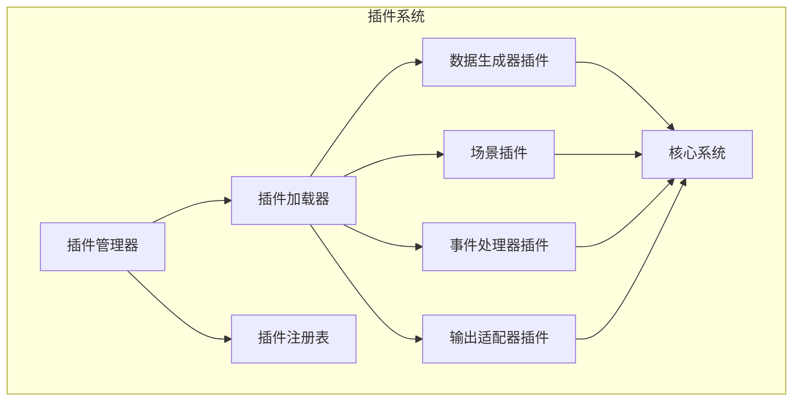

# 插件接口设计

## 1. 概述

插件系统允许第三方扩展虚拟设备的功能，支持自定义数据生成器、场景、事件处理器等。插件通过标准接口与核心系统集成，实现功能的可插拔。

## 2. 插件架构



## 3. 插件基础接口

### 3.1 插件元数据

```python
from dataclasses import dataclass
from typing import List, Dict, Any
from enum import Enum

class PluginType(Enum):
    """插件类型"""
    DATA_GENERATOR = "data_generator"
    SCENARIO = "scenario"
    EVENT_HANDLER = "event_handler"
    OUTPUT_ADAPTER = "output_adapter"
    CUSTOM = "custom"

@dataclass
class PluginMetadata:
    """插件元数据"""
    
    # 基本信息
    id: str                          # 插件唯一标识
    name: str                        # 插件名称
    version: str                     # 版本号 (semver)
    description: str = ""            # 描述
    author: str = ""                 # 作者
    
    # 类型和入口
    plugin_type: PluginType = PluginType.CUSTOM
    entry_point: str = ""            # 入口类/函数
    
    # 依赖
    dependencies: List[str] = None   # 依赖的其他插件
    core_version: str = ">=2.0.0"    # 兼容的核心版本
    
    # 配置
    config_schema: Dict[str, Any] = None  # 配置JSON Schema
    default_config: Dict[str, Any] = None # 默认配置
    
    def __post_init__(self):
        if self.dependencies is None:
            self.dependencies = []
        if self.config_schema is None:
            self.config_schema = {}
        if self.default_config is None:
            self.default_config = {}
```

### 3.2 插件基类

```python
from abc import ABC, abstractmethod
from typing import Any, Dict

class Plugin(ABC):
    """插件基类"""
    
    def __init__(self):
        self._metadata: PluginMetadata = None
        self._config: Dict[str, Any] = {}
        self._enabled: bool = False
        self._context: Dict[str, Any] = {}
    
    @property
    def metadata(self) -> PluginMetadata:
        """获取插件元数据"""
        return self._metadata
    
    @property
    def is_enabled(self) -> bool:
        """是否已启用"""
        return self._enabled
    
    def initialize(self, config: Dict[str, Any], context: Dict[str, Any]):
        """初始化插件"""
        self._config = {**self._metadata.default_config, **config}
        self._context = context
    
    @abstractmethod
    async def startup(self):
        """启动插件"""
        pass
    
    @abstractmethod
    async def shutdown(self):
        """关闭插件"""
        pass
    
    def get_config(self, key: str, default: Any = None) -> Any:
        """获取配置值"""
        return self._config.get(key, default)
    
    def set_config(self, key: str, value: Any):
        """设置配置值"""
        self._config[key] = value
    
    def log(self, message: str, level: str = "info"):
        """记录插件日志"""
        logger = self._context.get("logger")
        if logger:
            getattr(logger, level, logger.info)(
                f"[{self._metadata.id}] {message}"
            )
```

## 4. 专用插件接口

### 4.1 数据生成器插件

```python
class DataGeneratorPlugin(Plugin):
    """数据生成器插件基类"""
    
    @abstractmethod
    async def generate(self, context: DataContext) -> Dict[str, float]:
        """
        生成数据
        
        Args:
            context: 数据生成上下文
        
        Returns:
            指标数据字典 {metric_name: value}
        """
        pass
    
    @abstractmethod
    def get_supported_metrics(self) -> List[str]:
        """返回支持的指标列表"""
        pass
    
    def validate_config(self) -> bool:
        """验证配置"""
        return True

# 示例：随机噪声生成器插件
class RandomNoiseGenerator(DataGeneratorPlugin):
    """随机噪声生成器"""
    
    def __init__(self):
        super().__init__()
        self._metadata = PluginMetadata(
            id="random_noise_generator",
            name="随机噪声生成器",
            version="1.0.0",
            description="为数据添加随机噪声",
            plugin_type=PluginType.DATA_GENERATOR,
            default_config={
                "noise_level": 0.1,
                "metrics": ["temperature", "humidity"]
            }
        )
    
    async def startup(self):
        self.log("Random noise generator started")
        self._enabled = True
    
    async def shutdown(self):
        self.log("Random noise generator stopped")
        self._enabled = False
    
    async def generate(self, context: DataContext) -> Dict[str, float]:
        import random
        
        noise_level = self.get_config("noise_level", 0.1)
        metrics = self.get_config("metrics", [])
        
        result = {}
        for metric in metrics:
            # 在原始值上添加噪声
            base_value = context.current_values.get(metric, 0)
            noise = random.uniform(-noise_level, noise_level)
            result[metric] = base_value * (1 + noise)
        
        return result
    
    def get_supported_metrics(self) -> List[str]:
        return self.get_config("metrics", [])
```

### 4.2 场景插件

```python
class ScenarioPlugin(Plugin):
    """场景插件基类"""
    
    @abstractmethod
    def get_scenario_definition(self) -> Scenario:
        """返回场景定义"""
        pass
    
    @abstractmethod
    def apply(self, current_values: Dict[str, float]) -> Dict[str, float]:
        """
        应用场景约束
        
        Args:
            current_values: 当前指标值
        
        Returns:
            约束后的指标值
        """
        pass

# 示例：自定义场景插件
class GreenhouseScenario(ScenarioPlugin):
    """温室场景"""
    
    def __init__(self):
        super().__init__()
        self._metadata = PluginMetadata(
            id="greenhouse_scenario",
            name="温室环境",
            version="1.0.0",
            description="模拟温室环境条件",
            plugin_type=PluginType.SCENARIO,
            default_config={
                "target_temp": 28,
                "target_humidity": 75
            }
        )
        self._scenario = None
    
    async def startup(self):
        target_temp = self.get_config("target_temp", 28)
        target_humidity = self.get_config("target_humidity", 75)
        
        self._scenario = Scenario(
            scenario_id="greenhouse",
            name="温室环境",
            constraints={
                "temperature": MetricConstraint(25, 32, target_temp, 2),
                "humidity": MetricConstraint(70, 85, target_humidity, 3)
            }
        )
        self._enabled = True
    
    async def shutdown(self):
        self._enabled = False
    
    def get_scenario_definition(self) -> Scenario:
        return self._scenario
    
    def apply(self, current_values: Dict[str, float]) -> Dict[str, float]:
        result = current_values.copy()
        
        # 应用温度约束
        if "temperature" in result:
            temp = result["temperature"]
            constraint = self._scenario.constraints["temperature"]
            temp = max(constraint.min_value, min(constraint.max_value, temp))
            result["temperature"] = temp
        
        # 应用湿度约束
        if "humidity" in result:
            humidity = result["humidity"]
            constraint = self._scenario.constraints["humidity"]
            humidity = max(constraint.min_value, min(constraint.max_value, humidity))
            result["humidity"] = humidity
        
        return result
```

### 4.3 事件处理器插件

```python
class EventHandlerPlugin(Plugin):
    """事件处理器插件基类"""
    
    @abstractmethod
    def get_supported_events(self) -> List[EventType]:
        """返回支持的事件类型列表"""
        pass
    
    @abstractmethod
    async def handle(self, event: Event):
        """处理事件"""
        pass

# 示例：告警事件处理器
class AlertEventHandler(EventHandlerPlugin):
    """告警事件处理器"""
    
    def __init__(self):
        super().__init__()
        self._metadata = PluginMetadata(
            id="alert_handler",
            name="告警处理器",
            version="1.0.0",
            description="当指标超出阈值时发送告警",
            plugin_type=PluginType.EVENT_HANDLER,
            default_config={
                "temperature_threshold": 40,
                "webhook_url": ""
            }
        )
    
    async def startup(self):
        self._enabled = True
    
    async def shutdown(self):
        self._enabled = False
    
    def get_supported_events(self) -> List[EventType]:
        return [EventType.DATA_GENERATED]
    
    async def handle(self, event: Event):
        if event.event_type != EventType.DATA_GENERATED:
            return
        
        data = event.payload.get("data", {})
        temp = data.get("temperature", 0)
        threshold = self.get_config("temperature_threshold", 40)
        
        if temp > threshold:
            await self._send_alert(f"温度超限: {temp}°C")
    
    async def _send_alert(self, message: str):
        webhook_url = self.get_config("webhook_url")
        if webhook_url:
            import aiohttp
            async with aiohttp.ClientSession() as session:
                await session.post(webhook_url, json={"message": message})
```

### 4.4 输出适配器插件

```python
class OutputAdapterPlugin(Plugin):
    """输出适配器插件基类"""
    
    @abstractmethod
    async def output(self, data: SensorData):
        """输出数据"""
        pass
    
    @abstractmethod
    def get_format(self) -> str:
        """返回输出格式"""
        pass

# 示例：MQTT输出适配器
class MqttOutputAdapter(OutputAdapterPlugin):
    """MQTT输出适配器"""
    
    def __init__(self):
        super().__init__()
        self._metadata = PluginMetadata(
            id="mqtt_adapter",
            name="MQTT输出适配器",
            version="1.0.0",
            description="将数据输出到MQTT服务器",
            plugin_type=PluginType.OUTPUT_ADAPTER,
            default_config={
                "broker": "localhost",
                "port": 1883,
                "topic_prefix": "virtual_device"
            }
        )
        self._client = None
    
    async def startup(self):
        import aiomqtt
        
        broker = self.get_config("broker", "localhost")
        port = self.get_config("port", 1883)
        
        self._client = aiomqtt.Client(broker, port)
        await self._client.connect()
        self._enabled = True
    
    async def shutdown(self):
        if self._client:
            await self._client.disconnect()
        self._enabled = False
    
    async def output(self, data: SensorData):
        if not self._client:
            return
        
        topic_prefix = self.get_config("topic_prefix", "virtual_device")
        device_id = data.device_id
        
        # 发布各指标
        for metric_name, reading in [
            ("temperature", data.temperature),
            ("humidity", data.humidity),
            ("light", data.light),
            ("soil_moisture", data.soil_moisture)
        ]:
            topic = f"{topic_prefix}/{device_id}/{metric_name}"
            payload = json.dumps({
                "value": reading.value,
                "timestamp": data.timestamp.isoformat()
            })
            await self._client.publish(topic, payload)
    
    def get_format(self) -> str:
        return "mqtt"
```

## 5. 插件管理器

### 5.1 插件加载与管理

```python
import importlib
import importlib.util
from pathlib import Path
from typing import Type, Dict, List

class PluginManager:
    """插件管理器"""
    
    def __init__(self, plugin_dirs: List[str] = None):
        self._plugin_dirs = plugin_dirs or ["./plugins"]
        self._plugins: Dict[str, Plugin] = {}
        self._registry: Dict[PluginType, List[Plugin]] = {
            plugin_type: [] for plugin_type in PluginType
        }
        self._context: Dict[str, Any] = {}
    
    def set_context(self, **context):
        """设置插件上下文"""
        self._context.update(context)
    
    async def load_plugin(self, plugin_path: str) -> Optional[Plugin]:
        """从文件加载插件"""
        try:
            # 加载模块
            spec = importlib.util.spec_from_file_location(
                "plugin", plugin_path
            )
            module = importlib.util.module_from_spec(spec)
            spec.loader.exec_module(module)
            
            # 查找插件类
            plugin_class = self._find_plugin_class(module)
            if not plugin_class:
                return None
            
            # 实例化
            plugin = plugin_class()
            
            # 注册
            await self._register_plugin(plugin)
            
            return plugin
        
        except Exception as e:
            print(f"Failed to load plugin from {plugin_path}: {e}")
            return None
    
    def _find_plugin_class(self, module) -> Optional[Type[Plugin]]:
        """在模块中查找插件类"""
        for name in dir(module):
            obj = getattr(module, name)
            if (isinstance(obj, type) and 
                issubclass(obj, Plugin) and 
                obj is not Plugin):
                return obj
        return None
    
    async def _register_plugin(self, plugin: Plugin):
        """注册插件"""
        plugin_id = plugin.metadata.id
        
        if plugin_id in self._plugins:
            raise ValueError(f"Plugin {plugin_id} already registered")
        
        self._plugins[plugin_id] = plugin
        self._registry[plugin.metadata.plugin_type].append(plugin)
    
    async def unload_plugin(self, plugin_id: str):
        """卸载插件"""
        if plugin_id not in self._plugins:
            return
        
        plugin = self._plugins[plugin_id]
        
        # 关闭插件
        if plugin.is_enabled:
            await plugin.shutdown()
        
        # 从注册表移除
        del self._plugins[plugin_id]
        self._registry[plugin.metadata.plugin_type].remove(plugin)
    
    async def start_plugin(self, plugin_id: str, config: Dict[str, Any] = None):
        """启动插件"""
        if plugin_id not in self._plugins:
            raise ValueError(f"Plugin {plugin_id} not found")
        
        plugin = self._plugins[plugin_id]
        plugin.initialize(config or {}, self._context)
        await plugin.startup()
    
    async def stop_plugin(self, plugin_id: str):
        """停止插件"""
        if plugin_id not in self._plugins:
            return
        
        plugin = self._plugins[plugin_id]
        await plugin.shutdown()
    
    def get_plugin(self, plugin_id: str) -> Optional[Plugin]:
        """获取插件"""
        return self._plugins.get(plugin_id)
    
    def get_plugins_by_type(self, plugin_type: PluginType) -> List[Plugin]:
        """获取指定类型的所有插件"""
        return self._registry.get(plugin_type, [])
    
    def list_plugins(self) -> List[PluginMetadata]:
        """列出所有插件"""
        return [p.metadata for p in self._plugins.values()]
    
    async def load_all_plugins(self):
        """加载所有插件目录中的插件"""
        for plugin_dir in self._plugin_dirs:
            path = Path(plugin_dir)
            if not path.exists():
                continue
            
            for plugin_file in path.glob("*.py"):
                await self.load_plugin(str(plugin_file))
```

## 6. 插件配置

### 6.1 配置文件格式

```yaml
# plugins.yaml
plugins:
  - id: random_noise_generator
    enabled: true
    config:
      noise_level: 0.15
      metrics:
        - temperature
        - humidity
  
  - id: greenhouse_scenario
    enabled: true
    config:
      target_temp: 30
      target_humidity: 80
  
  - id: alert_handler
    enabled: false
    config:
      temperature_threshold: 45
      webhook_url: "https://hooks.example.com/alerts"
  
  - id: mqtt_adapter
    enabled: true
    config:
      broker: "mqtt.example.com"
      port: 1883
      topic_prefix: "plantgpt/devices"
```

### 6.2 配置加载

```python
class PluginConfigLoader:
    """插件配置加载器"""
    
    def __init__(self, config_path: str):
        self._config_path = config_path
    
    def load(self) -> Dict[str, Dict[str, Any]]:
        """加载插件配置"""
        import yaml
        
        with open(self._config_path, 'r') as f:
            config = yaml.safe_load(f) or {}
        
        plugins_config = {}
        for plugin_config in config.get("plugins", []):
            plugin_id = plugin_config["id"]
            plugins_config[plugin_id] = {
                "enabled": plugin_config.get("enabled", True),
                "config": plugin_config.get("config", {})
            }
        
        return plugins_config
```

## 7. 设计决策

| 决策 | 选择 | 理由 |
|------|------|------|
| 插件发现 | 文件扫描 + 类查找 | 简单、无需注册表 |
| 插件类型 | 枚举定义 | 类型安全、可扩展 |
| 配置格式 | YAML | 可读性好、支持注释 |
| 生命周期 | 显式启动/停止 | 资源管理清晰 |
| 依赖管理 | 简单列表 | 避免复杂依赖解析 |

---

**文档状态**: 初稿  
**最后更新**: 2026-04-08  
**作者**: AI Assistant
