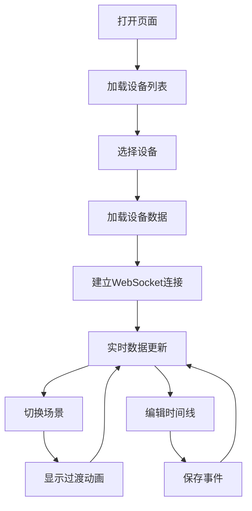
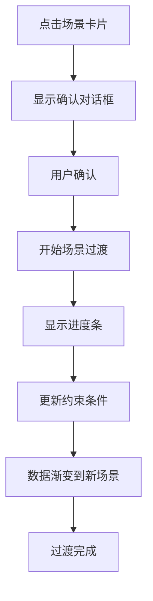

# UI 原型设计

## 1. 概述

虚拟设备 V2 的 Web 界面采用**监控面板**设计理念，从原来的"控制面板"转变为"设备监控中心"，实时展示设备状态、传感器数据、场景信息和事件时间线。

## 2. 设计原则

| 原则 | 说明 |
|------|------|
| 信息优先 | 传感器数据 prominently 展示 |
| 实时反馈 | 数据变化即时可见 |
| 场景可视化 | 当前场景状态清晰展示 |
| 时间线可编辑 | 事件时间线支持交互式编辑 |
| 响应式布局 | 适配不同屏幕尺寸 |

## 3. 页面布局

### 3.1 整体布局

```
+----------------------------------------------------------+
|  Header (Logo + 系统状态 + 全局控制)                       |
+----------------------------------------------------------+
|  Sidebar |              Main Content                     |
|          |                                             |
|  设备列表  |  +---------------------------------------+  |
|          |  |  场景状态栏 (当前场景 + 场景切换)        |  |
|  - 设备1  |  +---------------------------------------+  |
|  - 设备2  |                                             |
|  - 设备3  |  +---------------------------------------+  |
|          |  |                                       |  |
|  + 添加   |  |     传感器数据展示面板                  |  |
|          |  |     (温度/湿度/光照/土壤湿度)            |  |
|          |  |                                       |  |
|          |  +---------------------------------------+  |
|          |                                             |
|          |  +-------------------+  +----------------+  |
|          |  |   事件时间线       |  |   系统日志      |  |
|          |  |   (可编辑)         |  |               |  |
|          |  +-------------------+  +----------------+  |
|          |                                             |
+----------+---------------------------------------------+
```

### 3.2 响应式断点

| 断点 | 宽度 | 布局调整 |
|------|------|----------|
| Desktop | >= 1200px | 完整三栏布局 |
| Tablet | 768px - 1199px | 侧边栏折叠，双栏布局 |
| Mobile | < 768px | 单栏堆叠布局 |

## 4. 组件设计

### 4.1 Header 组件

```
+----------------------------------------------------------+
|  [Logo]  虚拟设备监控中心          [状态: 🟢 运行中]  [设置] |
+----------------------------------------------------------+
```

**功能:**
- Logo 和系统名称
- 全局系统状态指示
- 全局控制按钮（设置、帮助）

### 4.2 设备列表 Sidebar

```
+------------------+
| 设备列表          |
|                  |
| 🔵 设备-001      |
|    运行中 • 正常  |
|                  |
| ⚪ 设备-002      |
|    已停止        |
|                  |
| 🔴 设备-003      |
|    错误          |
|                  |
| [+ 添加设备]     |
+------------------+
```

**状态指示:**
- 🔵 蓝色: 运行中
- ⚪ 灰色: 已停止
- 🔴 红色: 错误
- 🟡 黄色: 警告

### 4.3 场景状态栏

```
+----------------------------------------------------------+
|  当前场景: 🌱 正常环境                                     |
|                                                                         |
|  快速切换: [正常环境] [高温] [低温] [高湿] [干燥] [强光] [弱光] |
|            (场景切换有过渡动画)                              |
+----------------------------------------------------------+
```

**场景卡片设计:**

```
+---------------+
| 🌱            |
| 正常环境       |
| 温度: 18-28°C |
| 湿度: 40-70%  |
+---------------+
```

### 4.4 传感器数据面板

#### 温度卡片

```
+------------------------+
|  🌡️ 温度               |
|                        |
|     23.5°C            |
|                        |
|  [==========    ] 58%  |
|  范围: 18-28°C         |
|  趋势: ↗ 上升          |
+------------------------+
```

#### 湿度卡片

```
+------------------------+
|  💧 湿度               |
|                        |
|     58.2%             |
|                        |
|  [============  ] 58%  |
|  范围: 40-70%          |
|  趋势: → 稳定          |
+------------------------+
```

#### 光照卡片

```
+------------------------+
|  ☀️ 光照               |
|                        |
|    32,500 lux         |
|                        |
|  [========      ] 33%  |
|  范围: 0-100k lux      |
|  趋势: ↘ 下降          |
+------------------------+
```

#### 土壤湿度卡片

```
+------------------------+
|  🌱 土壤湿度           |
|                        |
|     62.1%             |
|                        |
|  [============  ] 62%  |
|  范围: 40-70%          |
|  趋势: → 稳定          |
+------------------------+
```

**卡片交互:**
- 悬停显示详细趋势图
- 点击展开历史数据图表
- 实时数值变化动画

### 4.5 事件时间线面板

```
+---------------------------+
| 事件时间线        [+ 添加] |
|                           |
| 虚拟时间: 10:30:00  ⏸️ 10x |
|                           |
| ───────────────────────── |
| 10:30  ●───────── 温度变化 |
|        ↑ 当前时间         |
| 11:00  ○ 湿度调整         |
| 12:00  ○ 场景切换         |
|                           |
| [编辑] [删除] [执行]      |
+---------------------------+
```

**时间线元素:**

```
时间轴:
|----●----○----○----○----|
    现在  未来事件

事件节点:
+--------+
|   ●    |  - 已执行 (绿色)
|  /|\   |
+--------+

+--------+
|   ○    |  - 待执行 (灰色)
|  /|\   |
+--------+

+--------+
|   ◎    |  - 当前选中 (蓝色)
|  /|\   |
+--------+
```

### 4.6 事件编辑器弹窗

```
+--------------------------------+
| 编辑事件                [X]    |
+--------------------------------+
|                                 |
|  事件类型: [温度变化 ▼]         |
|                                 |
|  触发时间: [2026-04-08 11:00]   |
|                                 |
|  参数设置:                      |
|  ┌─────────────────────────┐   |
|  │ 目标温度: [    35    ] °C │   |
|  │ 持续时间: [   300    ] 秒 │   |
|  │ 缓动函数: [ease_in_out ▼]│   |
|  └─────────────────────────┘   |
|                                 |
|  优先级: [普通 ▼]              |
|                                 |
|  [取消]              [保存]    |
+--------------------------------+
```

## 5. 视觉设计

### 5.1 色彩系统

```css
:root {
  /* 主色调 */
  --primary: #4CAF50;
  --primary-dark: #388E3C;
  --primary-light: #C8E6C9;
  
  /* 状态色 */
  --success: #4CAF50;
  --warning: #FFC107;
  --error: #F44336;
  --info: #2196F3;
  
  /* 场景色 */
  --scenario-normal: #4CAF50;
  --scenario-hot: #FF5722;
  --scenario-cold: #2196F3;
  --scenario-dry: #FF9800;
  --scenario-wet: #00BCD4;
  
  /* 中性色 */
  --bg-primary: #FFFFFF;
  --bg-secondary: #F5F5F5;
  --text-primary: #212121;
  --text-secondary: #757575;
  --border: #E0E0E0;
}
```

### 5.2 字体规范

| 元素 | 字体 | 大小 | 字重 |
|------|------|------|------|
| 标题 | System | 24px | Bold |
| 卡片标题 | System | 16px | Medium |
| 数据值 | System | 32px | Bold |
| 正文 | System | 14px | Regular |
| 辅助文字 | System | 12px | Regular |

### 5.3 间距系统

```css
--space-xs: 4px;
--space-sm: 8px;
--space-md: 16px;
--space-lg: 24px;
--space-xl: 32px;
--space-xxl: 48px;
```

## 6. 交互动效

### 6.1 数据更新动画

```css
/* 数值变化时的脉冲效果 */
@keyframes value-update {
  0% { transform: scale(1); }
  50% { transform: scale(1.05); color: var(--primary); }
  100% { transform: scale(1); }
}

.value-changing {
  animation: value-update 0.3s ease;
}
```

### 6.2 场景切换过渡

```css
/* 场景切换时的渐变效果 */
.scenario-transition {
  transition: background-color 2s ease-in-out;
}
```

### 6.3 时间线交互

```css
/* 时间线节点悬停效果 */
.timeline-node:hover {
  transform: scale(1.2);
  box-shadow: 0 0 10px rgba(0,0,0,0.2);
}

/* 时间线拖拽时的视觉反馈 */
.timeline-node.dragging {
  opacity: 0.8;
  cursor: grabbing;
}
```

## 7. 页面流程

### 7.1 主流程



### 7.2 场景切换流程



## 8. 设计决策

| 决策 | 选择 | 理由 |
|------|------|------|
| 布局风格 | 卡片式布局 | 信息模块化、易于扫描 |
| 数据展示 | 大字体+进度条 | 一目了然 |
| 场景切换 | 顶部快捷栏 | 高频操作、快速访问 |
| 时间线 | 水平时间轴 | 符合时间认知习惯 |
| 主题 | 浅色主题 | 长时间观看舒适 |

---

**文档状态**: 初稿  
**最后更新**: 2026-04-08  
**作者**: AI Assistant
