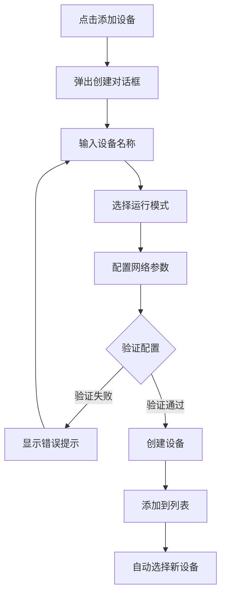
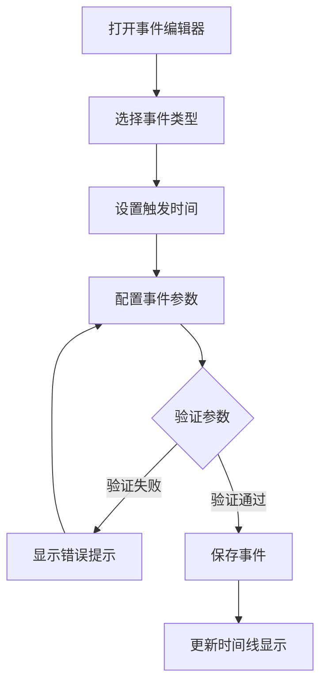

# 交互设计

## 1. 概述

本文档定义虚拟设备 V2 Web 界面的交互规范，包括用户操作流程、手势交互、键盘快捷键和反馈机制。

## 2. 交互原则

| 原则 | 说明 |
|------|------|
| 即时反馈 | 用户操作后立即给予视觉反馈 |
| 防错设计 | 危险操作需要二次确认 |
| 撤销支持 | 关键操作支持撤销 |
| 一致性 | 相同操作在不同场景表现一致 |
| 可预测 | 用户能够预测操作结果 |

## 3. 设备管理交互

### 3.1 设备列表交互

| 操作 | 触发方式 | 反馈 |
|------|----------|------|
| 选择设备 | 点击设备项 | 高亮选中，加载设备详情 |
| 添加设备 | 点击"+"按钮 | 弹出创建对话框 |
| 删除设备 | 右键菜单/滑动删除 | 确认对话框 |
| 刷新列表 | 下拉刷新 | 列表刷新动画 |

### 3.2 设备创建流程



### 3.3 设备控制交互

| 操作 | 触发方式 | 反馈 |
|------|----------|------|
| 启动 | 点击启动按钮 | 按钮变为停止图标，状态变为"运行中" |
| 停止 | 点击停止按钮 | 确认对话框，状态变为"已停止" |
| 重启 | 长按启动按钮 | 重启动画，短暂断开重连 |
| 重置 | 设置菜单中选择 | 二次确认，清除所有数据 |

## 4. 场景切换交互

### 4.1 场景选择

| 操作 | 触发方式 | 反馈 |
|------|----------|------|
| 快速切换 | 点击场景卡片 | 卡片高亮，显示过渡进度 |
| 查看详情 | 悬停/长按场景卡片 | 显示场景参数详情 |
| 自定义场景 | 点击"+"按钮 | 进入场景编辑器 |

### 4.2 场景过渡动画

```
用户点击场景卡片
    ↓
卡片放大 + 背景渐变
    ↓
显示过渡进度条 (0% → 100%)
    ↓
数据值渐变到新场景范围
    ↓
过渡完成，更新当前场景指示器
```

### 4.3 场景过渡期间交互

- **允许的操作**: 查看数据、编辑时间线、暂停设备
- **禁止的操作**: 切换其他场景、修改当前场景参数
- **视觉反馈**: 进度条 + 半透明遮罩

## 5. 时间线交互

### 5.1 时间线导航

| 操作 | 触发方式 | 反馈 |
|------|----------|------|
| 缩放时间轴 | 滚轮/双指捏合 | 时间刻度调整 |
| 平移时间轴 | 拖拽/滑动 | 显示不同时间段 |
| 跳转到当前 | 点击"现在"按钮 | 平滑滚动到当前时间 |

### 5.2 事件操作

| 操作 | 触发方式 | 反馈 |
|------|----------|------|
| 添加事件 | 点击"+"按钮/双击时间轴 | 弹出事件编辑器 |
| 编辑事件 | 点击事件节点 | 弹出事件编辑器，预填充数据 |
| 删除事件 | 右键菜单/拖拽到垃圾桶 | 确认对话框 |
| 移动事件 | 拖拽事件节点 | 实时更新触发时间 |
| 复制事件 | Ctrl+拖拽/右键复制 | 创建副本 |

### 5.3 事件编辑器交互



### 5.4 虚拟时间控制

| 操作 | 触发方式 | 反馈 |
|------|----------|------|
| 播放/暂停 | 点击播放按钮 | 图标切换，时间流动/停止 |
| 调整速度 | 拖拽滑块/点击预设 | 显示当前速度倍数 |
| 快进 | 双击播放按钮 | 临时加速，松开后恢复 |
| 跳转时间 | 点击时间显示输入 | 时间选择器 |

## 6. 数据面板交互

### 6.1 传感器卡片交互

| 操作 | 触发方式 | 反馈 |
|------|----------|------|
| 查看详情 | 点击卡片 | 展开详细图表 |
| 查看历史 | 悬停显示按钮 | 弹出历史数据弹窗 |
| 刷新数据 | 下拉卡片 | 数据刷新动画 |

### 6.2 图表交互

| 操作 | 触发方式 | 反馈 |
|------|----------|------|
| 缩放 | 滚轮/双指捏合 | 时间范围调整 |
| 平移 | 拖拽 | 查看不同时间段 |
| 查看数据点 | 悬停数据点 | 显示数值提示框 |
| 切换指标 | 点击图例 | 显示/隐藏对应曲线 |

## 7. 手势支持

### 7.1 触控手势

| 手势 | 操作 | 适用场景 |
|------|------|----------|
| 点击 | 选择/激活 | 所有可点击元素 |
| 长按 | 上下文菜单 | 设备项、事件节点 |
| 双击 | 快速操作 | 时间轴跳转现在 |
| 滑动 | 删除/切换 | 设备列表、场景卡片 |
| 捏合 | 缩放 | 时间轴、图表 |
| 拖拽 | 移动/排序 | 事件节点、时间轴 |

### 7.2 手势冲突处理

```
时间轴区域手势优先级:
1. 点击事件节点 > 平移时间轴
2. 捏合缩放 > 页面缩放
3. 拖拽事件节点 > 平移时间轴
```

## 8. 键盘快捷键

### 8.1 全局快捷键

| 快捷键 | 功能 |
|--------|------|
| `Space` | 播放/暂停虚拟时间 |
| `R` | 刷新数据 |
| `N` | 添加新设备 |
| `?` | 显示快捷键帮助 |

### 8.2 设备操作快捷键

| 快捷键 | 功能 |
|--------|------|
| `S` | 启动/停止当前设备 |
| `Del` | 删除当前设备 |
| `E` | 编辑设备配置 |

### 8.3 时间线快捷键

| 快捷键 | 功能 |
|--------|------|
| `+` | 放大时间轴 |
| `-` | 缩小时间轴 |
| `←` | 向左平移 |
| `→` | 向右平移 |
| `Home` | 跳转到开始 |
| `End` | 跳转到现在 |
| `Insert` | 添加事件 |

### 8.4 场景切换快捷键

| 快捷键 | 功能 |
|--------|------|
| `1-7` | 切换到对应场景 |
| `Tab` | 循环切换场景 |

## 9. 反馈机制

### 9.1 视觉反馈

| 场景 | 反馈方式 |
|------|----------|
| 操作成功 | 绿色勾选图标 + 提示消息 |
| 操作失败 | 红色错误图标 + 错误消息 |
| 加载中 | 旋转加载动画 |
| 数据更新 | 数值闪烁动画 |
| 状态变化 | 平滑过渡动画 |

### 9.2 声音反馈

| 场景 | 声音 |
|------|------|
| 操作成功 | 短促"叮"声 |
| 操作失败 | 低沉"咚"声 |
| 告警触发 | 连续提示音 |
| 场景切换完成 | 轻柔提示音 |

### 9.3 Toast 消息规范

```
位置: 页面顶部居中
持续时间:
  - 成功: 2秒
  - 错误: 5秒（可手动关闭）
  - 加载: 持续到操作完成
样式:
  - 成功: 绿色背景 + 勾选图标
  - 错误: 红色背景 + 错误图标
  - 警告: 黄色背景 + 警告图标
  - 信息: 蓝色背景 + 信息图标
```

## 10. 错误处理交互

### 10.1 网络错误

| 错误类型 | 处理方式 |
|----------|----------|
| 连接断开 | 显示重连按钮，自动重试 |
| 请求超时 | 显示"重试"按钮 |
| 服务器错误 | 显示错误信息，建议稍后重试 |

### 10.2 操作错误

| 错误类型 | 处理方式 |
|----------|----------|
| 参数错误 | 表单字段高亮，显示具体错误 |
| 权限不足 | 显示权限提示，引导获取权限 |
| 资源冲突 | 显示冲突详情，提供解决方案 |

## 11. 无障碍设计

### 11.1 键盘导航

- 所有交互元素支持 Tab 键导航
- 焦点状态清晰可见
- 支持 Enter/Space 激活

### 11.2 屏幕阅读器

- 所有图标有 aria-label
- 状态变化有 aria-live 通知
- 图表有文字描述替代

### 11.3 色彩无障碍

- 不仅依赖颜色传达信息
- 确保足够的对比度（WCAG AA）
- 支持高对比度模式

---

**文档状态**: 初稿  
**最后更新**: 2026-04-08  
**作者**: AI Assistant
