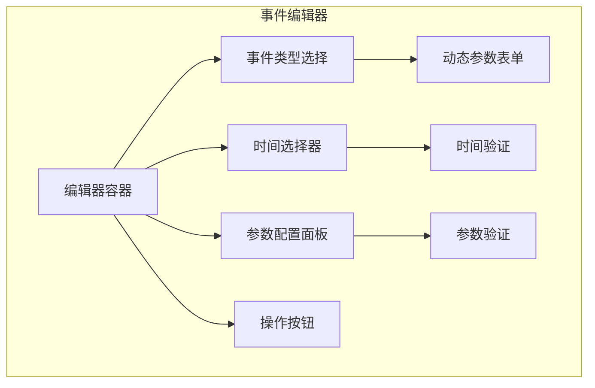

# 事件编辑器设计

## 1. 概述

事件编辑器是虚拟设备 V2 的核心交互组件，允许用户创建、编辑和管理事件时间线上的事件。支持可视化编辑和批量操作。

## 2. 编辑器架构



## 3. 编辑器界面

### 3.1 创建模式

```
+------------------------------------------+
| 创建新事件                        [X]    |
+------------------------------------------+
|                                          |
|  事件类型:                               |
|  ┌─────────────────────────────────┐    |
|  │ 🌡️ 温度变化                     │    |
|  │ 💧 湿度变化                     │    |
|  │ ☀️ 光照变化                     │    |
|  │ 🌱 土壤湿度变化                 │    |
|  │ 🔄 场景切换                     │    |
|  │ ⏰ 时间控制                     │    |
|  │ ⚙️ 设备控制                     │    |
|  │ ✏️ 自定义事件                   │    |
|  └─────────────────────────────────┘    |
|                                          |
|  触发时间:                               |
|  ┌─────────────────────────────────┐    |
|  │ 📅 2026-04-08  🕐 11:00:00     │    |
|  └─────────────────────────────────┘    |
|  [使用虚拟时间] [立即执行]               |
|                                          |
|  参数配置:                               |
|  ┌─────────────────────────────────┐    |
|  │ 目标温度: [      35      ] °C   │    |
|  │ 变化时长: [     300      ] 秒   │    |
|  │ 缓动函数: [ease_in_out ▼]       │    |
|  │                                 │    |
|  │ [预览曲线]                      │    |
|  │         ╭─╮                     │    |
|  │        ╱   ╲                    │    |
|  │       ╱     ╲____               │    |
|  └─────────────────────────────────┘    |
|                                          |
|  高级选项:                               |
|  ▼ 展开                                  |
|                                          |
|  优先级: [普通 ▼]                        |
|  最大重试: [ 3 ] 次                      |
|  执行条件: [      无      ]              |
|                                          |
|  [取消]              [创建事件]          |
+------------------------------------------+
```

### 3.2 编辑模式

```
+------------------------------------------+
| 编辑事件                          [X]    |
+------------------------------------------+
|                                          |
|  事件ID: evt_abc123                      |
|  状态: ⏳ 待执行                         |
|                                          |
|  [创建模式的表单，预填充当前值]          |
|                                          |
|  [删除事件]         [保存修改]           |
+------------------------------------------+
```

## 4. 事件类型配置

### 4.1 温度变化事件

| 参数 | 类型 | 必填 | 默认值 | 说明 |
|------|------|------|--------|------|
| target_value | float | 是 | - | 目标温度(°C) |
| duration_ms | int | 否 | 300000 | 变化时长(ms) |
| easing | string | 否 | "ease_in_out" | 缓动函数 |

### 4.2 湿度变化事件

| 参数 | 类型 | 必填 | 默认值 | 说明 |
|------|------|------|--------|------|
| target_value | float | 是 | - | 目标湿度(%) |
| duration_ms | int | 否 | 300000 | 变化时长(ms) |
| easing | string | 否 | "ease_in_out" | 缓动函数 |

### 4.3 场景切换事件

| 参数 | 类型 | 必填 | 默认值 | 说明 |
|------|------|------|--------|------|
| scenario_id | string | 是 | - | 目标场景ID |
| transition_time_ms | int | 否 | 5000 | 过渡时间(ms) |

### 4.4 时间控制事件

| 参数 | 类型 | 必填 | 默认值 | 说明 |
|------|------|------|--------|------|
| action | string | 是 | - | pause/resume/set_scale/jump |
| value | any | 否 | - | 根据action变化 |

## 5. 时间选择器

### 5.1 绝对时间模式

```
+--------------------------------+
| 选择触发时间                   |
+--------------------------------+
|                                |
|  📅 日期: [2026-04-08]        |
|                                |
|  🕐 时间: [11] : [00] : [00]  |
|          时    分    秒        |
|                                |
|  [快速选择]                    |
|  [5分钟后] [15分钟后] [1小时后] |
|                                |
|  [取消]        [确认]          |
+--------------------------------+
```

### 5.2 相对时间模式

```
+--------------------------------+
| 相对当前时间                   |
+--------------------------------+
|                                |
|  [    30    ] 分钟后          |
|                                |
|  快捷选择:                     |
|  [10秒] [1分] [5分] [15分]    |
|  [30分] [1小时] [自定义]      |
|                                |
|  [取消]        [确认]          |
+--------------------------------+
```

### 5.3 虚拟时间模式

```
+--------------------------------+
| 虚拟时间触发                   |
+--------------------------------+
|                                |
|  当前虚拟时间: 10:30:00        |
|                                |
|  触发虚拟时间:                 |
|  [10] : [45] : [00]           |
|   时    分    秒               |
|                                |
|  [取消]        [确认]          |
+--------------------------------+
```

## 6. 参数验证

### 6.1 验证规则

```python
VALIDATION_RULES = {
    "temperature_change": {
        "target_value": {
            "type": "float",
            "min": -50,
            "max": 100,
            "required": True
        },
        "duration_ms": {
            "type": "int",
            "min": 1000,
            "max": 3600000,
            "default": 300000
        }
    },
    "humidity_change": {
        "target_value": {
            "type": "float",
            "min": 0,
            "max": 100,
            "required": True
        }
    },
    "scenario_switch": {
        "scenario_id": {
            "type": "string",
            "required": True,
            "options": ["normal", "high_temperature", "low_temperature", ...]
        }
    }
}
```

### 6.2 验证反馈

| 验证结果 | 反馈方式 |
|----------|----------|
| 通过 | 绿色勾选，启用提交按钮 |
| 警告 | 黄色感叹号，显示警告信息 |
| 错误 | 红色边框，显示错误信息，禁用提交 |

## 7. 批量编辑

### 7.1 批量选择

```
+------------------------------------------+
| 批量编辑事件                      [X]    |
+------------------------------------------+
|                                          |
|  已选择 3 个事件:                        |
|  ☑️ 温度调整 (10:30)                     |
|  ☑️ 湿度调整 (11:00)                     |
|  ☑️ 场景切换 (12:00)                     |
|                                          |
|  批量操作:                               |
|  [调整时间] [修改优先级] [删除]          |
|                                          |
+------------------------------------------+
```

### 7.2 时间批量调整

```
+------------------------------------------+
| 调整时间偏移                             |
+------------------------------------------+
|                                          |
|  调整方式:                               |
|  (•) 统一偏移    ( ) 按比例缩放          |
|                                          |
|  时间偏移:                               |
|  [ + ] [    15    ] 分钟                 |
|                                          |
|  预览:                                   |
|  温度调整: 10:30 → 10:45                 |
|  湿度调整: 11:00 → 11:15                 |
|  场景切换: 12:00 → 12:15                 |
|                                          |
|  [取消]              [应用]              |
+------------------------------------------+
```

## 8. 预览功能

### 8.1 曲线预览

```
+------------------------------------------+
| 事件效果预览                      [X]    |
+------------------------------------------+
|                                          |
|  温度变化曲线:                           |
|                                          |
|  35 ┤        ╭────╮                     |
|     │       ╱      ╲                    |
|  25 ┤──────╱        ╲────               |
|     │                                  |
|  15 ┤                                  |
|     └────┬────┬────┬────┬────          |
|         10:30 10:35 10:40 10:45        |
|                                          |
|  起始值: 25°C                            |
|  目标值: 35°C                            |
|  变化时长: 5分钟                         |
|  缓动: ease_in_out                       |
|                                          |
|                    [关闭]                |
+------------------------------------------+
```

### 8.2 时间线预览

```
+------------------------------------------+
| 时间线预览                               |
+------------------------------------------+
|                                          |
|  10:30  ● 温度调整 (当前编辑)            |
|         │                                |
|  10:45  ○ 湿度调整                       |
|         │                                |
|  11:00  ○ 场景切换                       |
|                                          |
|  [在时间线中高亮显示]                    |
+------------------------------------------+
```

## 9. 快捷键

| 快捷键 | 功能 |
|--------|------|
| `Enter` | 提交表单 |
| `Esc` | 取消/关闭 |
| `Tab` | 切换字段 |
| `Ctrl+Enter` | 保存并创建下一个 |
| `Ctrl+D` | 复制当前事件 |

## 10. 设计决策

| 决策 | 选择 | 理由 |
|------|------|------|
| 表单布局 | 垂直堆叠 | 移动端友好 |
| 时间选择 | 三种模式 | 满足不同场景需求 |
| 参数验证 | 实时验证 | 即时反馈 |
| 预览功能 | 曲线+时间线 | 直观理解效果 |
| 批量编辑 | 支持多选 | 提高效率 |

---

**文档状态**: 初稿  
**最后更新**: 2026-04-08  
**作者**: AI Assistant
