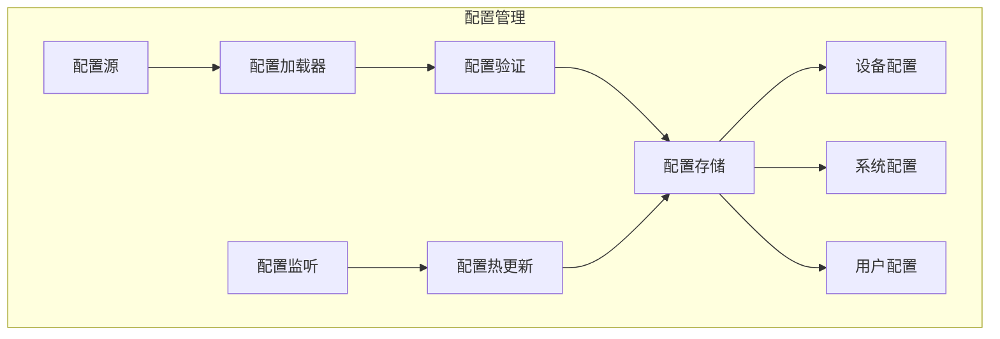

# 配置管理

## 1. 概述

配置管理系统负责虚拟设备 V2 的所有配置项的管理，支持多环境配置、动态配置更新和配置验证。

## 2. 配置架构



## 3. 配置分层

### 3.1 配置层级

| 层级 | 优先级 | 说明 | 示例 |
|------|--------|------|------|
| 命令行参数 | 最高 | 运行时传入 | `--port 8080` |
| 环境变量 | 高 | 系统环境 | `VD_PORT=8080` |
| 用户配置 | 中 | 用户自定义 | `~/.vd/config.yaml` |
| 项目配置 | 低 | 项目级配置 | `./config.yaml` |
| 默认配置 | 最低 | 内置默认值 | 代码中定义 |

### 3.2 配置合并策略

```python
def merge_configs(base: dict, override: dict) -> dict:
    """递归合并配置"""
    result = base.copy()
    
    for key, value in override.items():
        if key in result and isinstance(result[key], dict) and isinstance(value, dict):
            result[key] = merge_configs(result[key], value)
        else:
            result[key] = value
    
    return result
```

## 4. 配置定义

### 4.1 系统配置

```python
from pydantic import BaseModel, Field, validator
from typing import Optional, List

class ServerConfig(BaseModel):
    """服务器配置"""
    host: str = Field("0.0.0.0", description="监听地址")
    port: int = Field(8080, ge=1024, le=65535, description="监听端口")
    workers: int = Field(1, ge=1, le=10, description="工作进程数")
    
class LoggingConfig(BaseModel):
    """日志配置"""
    level: str = Field("INFO", regex=r"^(DEBUG|INFO|WARNING|ERROR|CRITICAL)$")
    format: str = Field("json", description="日志格式: json/text")
    output: str = Field("stdout", description="输出: stdout/file/both")
    file_path: Optional[str] = Field(None, description="日志文件路径")
    max_size_mb: int = Field(100, ge=10)
    backup_count: int = Field(5, ge=1)

class DatabaseConfig(BaseModel):
    """数据库配置"""
    url: str = Field("sqlite:///vd.db", description="数据库URL")
    pool_size: int = Field(5, ge=1, le=20)
    max_overflow: int = Field(10, ge=0)
    echo: bool = Field(False, description="是否打印SQL")

class SystemConfig(BaseModel):
    """系统级配置"""
    server: ServerConfig = Field(default_factory=ServerConfig)
    logging: LoggingConfig = Field(default_factory=LoggingConfig)
    database: DatabaseConfig = Field(default_factory=DatabaseConfig)
    plugin_dirs: List[str] = Field(default_factory=lambda: ["./plugins"])
    data_dir: str = Field("./data", description="数据存储目录")
```

### 4.2 设备默认配置

```python
class DefaultDeviceConfig(BaseModel):
    """设备默认配置"""
    
    # 采样配置
    sampling_interval_ms: int = Field(5000, ge=1000, le=60000)
    batch_size: int = Field(10, ge=1, le=100)
    jitter_ms: int = Field(100, ge=0, le=1000)
    
    # 网络配置
    default_port: int = Field(8080, ge=1024, le=65535)
    discovery_port: int = Field(8081, ge=1024, le=65535)
    
    # 时间配置
    default_time_scale: float = Field(1.0, ge=0.1, le=600.0)
    max_virtual_time_jump: int = Field(86400, description="最大时间跳跃(秒)")
    
    # 场景配置
    default_scenario: str = Field("normal")
    scenario_transition_ms: int = Field(5000, ge=0, le=60000)
    
    # 数据生成配置
    noise_factor: float = Field(0.1, ge=0.0, le=1.0)
    enable_natural_simulation: bool = Field(True)
```

## 5. 配置加载器

### 5.1 多源配置加载

```python
import os
import yaml
import json
from typing import Dict, Any

class ConfigLoader:
    """配置加载器"""
    
    def __init__(self):
        self._loaders = {
            'yaml': self._load_yaml,
            'yml': self._load_yaml,
            'json': self._load_json,
        }
    
    def load(self, path: str) -> Dict[str, Any]:
        """从文件加载配置"""
        if not os.path.exists(path):
            return {}
        
        ext = path.split('.')[-1].lower()
        loader = self._loaders.get(ext)
        
        if not loader:
            raise ValueError(f"Unsupported config format: {ext}")
        
        return loader(path)
    
    def _load_yaml(self, path: str) -> Dict[str, Any]:
        with open(path, 'r', encoding='utf-8') as f:
            return yaml.safe_load(f) or {}
    
    def _load_json(self, path: str) -> Dict[str, Any]:
        with open(path, 'r', encoding='utf-8') as f:
            return json.load(f)
    
    def load_from_env(self, prefix: str = "VD_") -> Dict[str, Any]:
        """从环境变量加载配置"""
        config = {}
        
        for key, value in os.environ.items():
            if key.startswith(prefix):
                # VD_SERVER_PORT -> server.port
                config_key = key[len(prefix):].lower().replace('_', '.')
                self._set_nested_value(config, config_key, self._parse_value(value))
        
        return config
    
    def _set_nested_value(self, config: dict, key: str, value: Any):
        """设置嵌套配置值"""
        keys = key.split('.')
        current = config
        
        for k in keys[:-1]:
            if k not in current:
                current[k] = {}
            current = current[k]
        
        current[keys[-1]] = value
    
    def _parse_value(self, value: str) -> Any:
        """解析配置值"""
        # 尝试解析为布尔值
        if value.lower() in ('true', 'yes', '1'):
            return True
        if value.lower() in ('false', 'no', '0'):
            return False
        
        # 尝试解析为整数
        try:
            return int(value)
        except ValueError:
            pass
        
        # 尝试解析为浮点数
        try:
            return float(value)
        except ValueError:
            pass
        
        # 尝试解析为JSON
        try:
            return json.loads(value)
        except json.JSONDecodeError:
            pass
        
        # 作为字符串返回
        return value
```

### 5.2 配置管理器

```python
class ConfigManager:
    """配置管理器"""
    
    DEFAULT_CONFIG_PATHS = [
        "/etc/virtual-device/config.yaml",
        "~/.config/virtual-device/config.yaml",
        "./config.yaml",
        "./config.yml",
    ]
    
    def __init__(self):
        self._loader = ConfigLoader()
        self._config: Dict[str, Any] = {}
        self._validators: Dict[str, callable] = {}
        self._listeners: List[callable] = []
    
    def load_defaults(self, defaults: dict):
        """加载默认配置"""
        self._config = defaults.copy()
    
    def load_from_file(self, path: str):
        """从文件加载配置"""
        file_config = self._loader.load(path)
        self._config = merge_configs(self._config, file_config)
    
    def load_from_env(self, prefix: str = "VD_"):
        """从环境变量加载配置"""
        env_config = self._loader.load_from_env(prefix)
        self._config = merge_configs(self._config, env_config)
    
    def load_from_args(self, args: dict):
        """从命令行参数加载配置"""
        self._config = merge_configs(self._config, args)
    
    def auto_load(self):
        """自动加载所有配置源"""
        # 1. 默认配置（已在load_defaults中设置）
        
        # 2. 配置文件
        for path in self.DEFAULT_CONFIG_PATHS:
            expanded_path = os.path.expanduser(path)
            if os.path.exists(expanded_path):
                self.load_from_file(expanded_path)
                break
        
        # 3. 环境变量
        self.load_from_env()
    
    def get(self, key: str, default: Any = None) -> Any:
        """获取配置值"""
        keys = key.split('.')
        value = self._config
        
        for k in keys:
            if isinstance(value, dict) and k in value:
                value = value[k]
            else:
                return default
        
        return value
    
    def set(self, key: str, value: Any):
        """设置配置值"""
        keys = key.split('.')
        config = self._config
        
        for k in keys[:-1]:
            if k not in config:
                config[k] = {}
            config = config[k]
        
        old_value = config.get(keys[-1])
        config[keys[-1]] = value
        
        # 触发变更通知
        if old_value != value:
            self._notify_change(key, old_value, value)
    
    def register_validator(self, key: str, validator: callable):
        """注册配置验证器"""
        self._validators[key] = validator
    
    def validate(self) -> List[str]:
        """验证配置"""
        errors = []
        
        for key, validator in self._validators.items():
            value = self.get(key)
            try:
                validator(value)
            except ValueError as e:
                errors.append(f"{key}: {e}")
        
        return errors
    
    def on_change(self, callback: callable):
        """监听配置变更"""
        self._listeners.append(callback)
    
    def _notify_change(self, key: str, old_value: Any, new_value: Any):
        """通知配置变更"""
        for listener in self._listeners:
            try:
                listener(key, old_value, new_value)
            except Exception as e:
                print(f"Config change listener error: {e}")
    
    def to_dict(self) -> Dict[str, Any]:
        """导出为字典"""
        return self._config.copy()
    
    def save(self, path: str):
        """保存配置到文件"""
        ext = path.split('.')[-1].lower()
        
        with open(path, 'w', encoding='utf-8') as f:
            if ext in ('yaml', 'yml'):
                yaml.dump(self._config, f, default_flow_style=False)
            elif ext == 'json':
                json.dump(self._config, f, indent=2)
```

## 6. 配置热更新

### 6.1 文件监控

```python
import asyncio
from watchdog.observers import Observer
from watchdog.events import FileSystemEventHandler

class ConfigFileWatcher(FileSystemEventHandler):
    """配置文件监控器"""
    
    def __init__(self, config_path: str, callback: callable):
        self.config_path = config_path
        self.callback = callback
        self._observer = Observer()
    
    def start(self):
        """开始监控"""
        self._observer.schedule(self, os.path.dirname(self.config_path))
        self._observer.start()
    
    def stop(self):
        """停止监控"""
        self._observer.stop()
        self._observer.join()
    
    def on_modified(self, event):
        if event.src_path == self.config_path:
            asyncio.create_task(self.callback())
```

### 6.2 热更新实现

```python
class HotConfigReload:
    """配置热重载"""
    
    def __init__(self, config_manager: ConfigManager):
        self._manager = config_manager
        self._watcher: Optional[ConfigFileWatcher] = None
    
    def enable(self, config_path: str):
        """启用热重载"""
        async def reload():
            print(f"Config file changed, reloading...")
            old_config = self._manager.to_dict()
            self._manager.load_from_file(config_path)
            new_config = self._manager.to_dict()
            
            # 比较变更
            changes = self._diff_configs(old_config, new_config)
            for key, (old, new) in changes.items():
                print(f"  {key}: {old} -> {new}")
        
        self._watcher = ConfigFileWatcher(config_path, reload)
        self._watcher.start()
    
    def disable(self):
        """禁用热重载"""
        if self._watcher:
            self._watcher.stop()
            self._watcher = None
    
    def _diff_configs(self, old: dict, new: dict, prefix: str = "") -> Dict[str, tuple]:
        """比较配置差异"""
        changes = {}
        all_keys = set(old.keys()) | set(new.keys())
        
        for key in all_keys:
            full_key = f"{prefix}.{key}" if prefix else key
            old_val = old.get(key)
            new_val = new.get(key)
            
            if isinstance(old_val, dict) and isinstance(new_val, dict):
                changes.update(self._diff_configs(old_val, new_val, full_key))
            elif old_val != new_val:
                changes[full_key] = (old_val, new_val)
        
        return changes
```

## 7. 配置文件示例

### 7.1 完整配置示例

```yaml
# config.yaml - 虚拟设备 V2 配置文件

# 服务器配置
server:
  host: "0.0.0.0"
  port: 8080
  workers: 1

# 日志配置
logging:
  level: "INFO"
  format: "json"
  output: "both"
  file_path: "./logs/virtual-device.log"
  max_size_mb: 100
  backup_count: 5

# 数据库配置
database:
  url: "sqlite:///data/vd.db"
  pool_size: 5
  max_overflow: 10
  echo: false

# 设备默认配置
device_defaults:
  sampling_interval_ms: 5000
  batch_size: 10
  jitter_ms: 100
  default_port: 8080
  default_time_scale: 1.0
  default_scenario: "normal"
  scenario_transition_ms: 5000

# 插件配置
plugins:
  directories:
    - "./plugins"
    - "~/.virtual-device/plugins"
  auto_load: true
  
# 网络配置
network:
  discovery_enabled: true
  discovery_port: 8081
  broadcast_interval_seconds: 5
  
# 数据存储配置
storage:
  data_dir: "./data"
  max_history_days: 30
  auto_cleanup: true
```

## 8. 设计决策

| 决策 | 选择 | 理由 |
|------|------|------|
| 配置格式 | YAML | 可读性好、支持注释 |
| 配置分层 | 5层优先级 | 灵活、覆盖全面 |
| 验证方式 | Pydantic + 自定义 | 类型安全、可扩展 |
| 热更新 | 文件监控 | 简单可靠 |
| 变更通知 | 回调机制 | 解耦、灵活 |

---

**文档状态**: 初稿  
**最后更新**: 2026-04-08  
**作者**: AI Assistant
