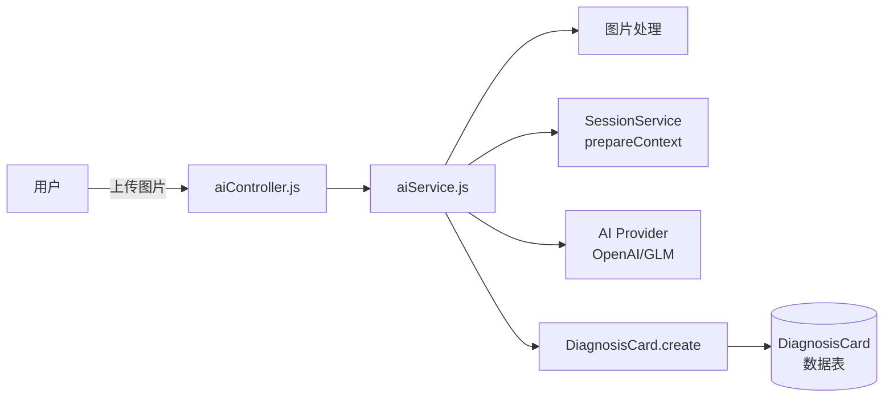
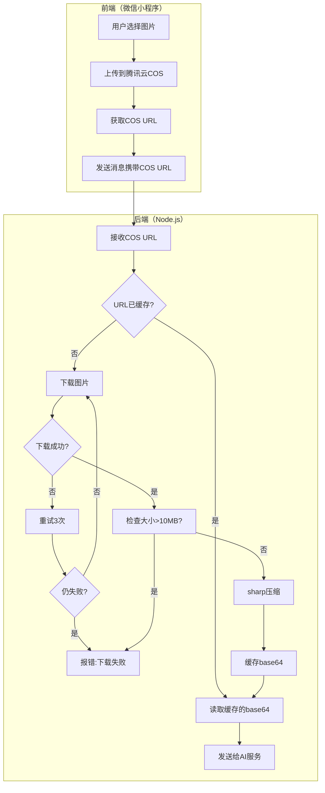

# AI 诊断卡生成逻辑设计

## 元信息

- **文档类型**: 架构设计
- **版本**: V1.0
- **创建日期**: 2026-04-12
- **最后更新**: 2026-04-12
- **状态**: 已发布
- **作者**: 文档治理委员会

***

## 一、概述

### 1.1 功能定义

AI 诊断卡是 项目 的核心功能，通过分析用户上传的植物图片，生成结构化的诊断结果，包括：

- 植物品种识别
- 健康状态评估
- 问题诊断
- 养护建议

### 1.2 触发条件

| 场景     | 是否生成诊断卡 | 说明                        |
| :----- | :-----: | :------------------------ |
| 用户上传图片 |   ✅ 是   | 核心触发条件                    |
| 纯文字咨询  |   ❌ 否   | `diagnosisCard` 设为 `null` |
| 明确要求诊断 |   ✅ 是   | 即使无图片也可生成（基于上下文）          |

### 1.3 核心流程

```
用户上传图片
    ↓
图片处理（下载/压缩/base64转换）
    ↓
组装上下文（植物信息+环境数据+养护记录+历史诊断）
    ↓
构建 AI Prompt
    ↓
调用 AI 服务（OpenAI/GLM）
    ↓
解析 AI 响应（JSON）
    ↓
创建诊断卡记录
    ↓
返回给用户
```

***

## 二、系统架构

### 2.1 组件关系



### 2.2 关键文件

| 文件                            | 职责                      |
| :---------------------------- | :---------------------- |
| `controllers/aiController.js` | 接收请求，协调各服务              |
| `services/aiService.js`       | 核心逻辑：图片处理、Prompt构建、AI调用 |
| `services/SessionService.js`  | 上下文组装（prepareContext）   |
| `models/DiagnosisCard.js`     | 诊断卡数据模型                 |

***

## 三、详细流程

### 3.1 完整图片流程（前端→COS→后端→AI）



**流程说明**:

1. **前端上传**: 小程序直接上传图片到腾讯云 COS，获取临时 URL
2. **后端下载**: 后端从 COS 下载图片，转为 base64 发送给 AI
3. **缓存机制**: 相同 URL 的图片缓存 base64，避免重复下载
4. **压缩策略**: 大于 1MB 的图片使用 sharp 压缩

**关键参数**:

| 参数 | 值 | 说明 |
|:---|:---|:---|
| COS 上传 | 前端完成 | 小程序直传 COS |
| 下载超时 | 60秒 | 网络波动容错 |
| 重试次数 | 3次 | 下载失败自动重试 |
| 最大尺寸 | 10MB | 超过则报错 |
| 压缩阈值 | 1MB | 小于则不压缩 |
| 压缩质量 | 80% | sharp 压缩参数 |
| 最大边长 | 2048px | 等比缩放 |
| 缓存时间 | 1小时 | URL→base64 缓存 |

### 3.2 上下文组装

由 `SessionService.prepareContext()` 统一处理：

| 数据类型 | 来源                     | 用途         |
| :--- | :--------------------- | :--------- |
| 植物信息 | `Plant` 表              | 品种、昵称、养护时长 |
| 环境数据 | `EnvironmentReading` 表 | 温度、湿度、光照等  |
| 养护记录 | `CareRecord` 表         | 最近5条养护操作   |
| 历史诊断 | `DiagnosisCard` 表      | 最近3次诊断记录   |
| 对话历史 | `Message` 表            | 最近6轮对话     |

### 3.3 Prompt 构建

**系统 Prompt** (`SYSTEM_PROMPT`):

- 定义 AI 角色：植物养护专家
- 输出格式要求（JSON Schema）
- 字段说明和取值范围
- 示例输出

**用户 Prompt** (`buildPrompt` 生成):

```
## 当前任务：深度分析（植物会话）

【用户输入】
- 消息: {content}
- 图片: [有图片]

【植物档案】
- 植物ID: xxx
- 昵称: xxx
- 品种: xxx
- 养护时长: xxx

【环境数据】
- 温度: xx°C
- 湿度: xx%
...

【养护记录】
- 2024-01-01: 浇水
...

【历史诊断】
- 2024-01-01: 健康评分85，状态healthy
...

【对话历史】
- user: xxx
- assistant: xxx

【输出要求】
- 用户上传了图片，需要返回诊断卡
- 请返回符合 JSON Schema 的完整 JSON 对象
```

### 3.4 AI 调用

**支持提供商**:

- OpenAI (GPT-4V)
- GLM-4V (智谱)

**请求参数**:

```javascript
{
  model: 'gpt-4-vision-preview' | 'glm-4v',
  messages: [
    { role: 'system', content: SYSTEM_PROMPT },
    { 
      role: 'user', 
      content: [
        { type: 'text', text: prompt },
        { type: 'image_url', image_url: { url: imageBase64 } }
      ]
    }
  ],
  max_tokens: 2000,
  temperature: 0.7,
  response_format: { type: 'json_object' }
}
```

### 3.5 响应解析

AI 返回 JSON 格式:

```json
{
  "content": "给用户的文字回复（Markdown）",
  "diagnosisCard": {
    "species": "植物品种",
    "healthScore": 85,
    "status": "healthy|warning|critical",
    "issues": [
      {
        "type": "watering|light|temperature|pest|disease|nutrition|other",
        "name": "问题名称",
        "severity": "low|medium|high",
        "description": "问题描述"
      }
    ],
    "suggestions": [
      {
        "type": "watering|light|temperature|fertilizer|pruning|pest_control|other",
        "action": "建议操作",
        "details": "详细说明",
        "priority": "high|medium|low"
      }
    ],
    "confidence": 0.85
  }
}
```

### 3.6 诊断卡存储

**创建记录**:

```javascript
await DiagnosisCard.create({
  diagnosis_card_id: `DIAG_${uuid}`,
  message_id: aiMessageId,  // 关联 AI 回复消息
  plant_id: session.plant_id,
  species: aiResult.diagnosisCard.species,
  analysis_type: analysisType,  // 'deep' | 'normal'
  health_score: aiResult.diagnosisCard.healthScore,
  status: aiResult.diagnosisCard.status,
  issues: aiResult.diagnosisCard.issues,  // JSON
  suggestions: aiResult.diagnosisCard.suggestions,  // JSON
  confidence: aiResult.diagnosisCard.confidence,
  context_used: context,  // 使用的上下文数据
});
```

***

## 四、数据模型

### 4.1 DiagnosisCard 表

| 字段                  | 类型          | 说明                                 |
| :------------------ | :---------- | :--------------------------------- |
| diagnosis\_card\_id | STRING(64)  | 主键                                 |
| message\_id         | STRING(64)  | 关联消息                               |
| plant\_id           | STRING(64)  | 关联植物                               |
| species             | STRING(100) | 识别品种                               |
| analysis\_type      | ENUM        | 'deep' / 'normal'                  |
| health\_score       | INTEGER     | 健康评分 0-100                         |
| status              | ENUM        | 'healthy' / 'warning' / 'critical' |
| issues              | JSON        | 问题列表                               |
| suggestions         | JSON        | 建议列表                               |
| confidence          | FLOAT       | 置信度 0-1                            |
| context\_used       | JSON        | 使用的上下文                             |

### 4.2 与其他实体的关系

```
DiagnosisCard belongsTo Message
DiagnosisCard belongsTo Plant (optional)
Message hasOne DiagnosisCard
```

***

## 五、关键设计决策

### 5.1 为什么诊断卡与消息关联？

- 诊断卡是 AI 回复消息的一部分
- 通过 `message_id` 可以追溯到完整的对话上下文
- 便于展示诊断历史

### 5.2 为什么图片必须转 base64？

- OpenAI/GLM 的 Vision API 需要 base64 格式的图片
- 统一处理流程，简化代码
- 便于日志记录（记录图片大小而非 URL）

### 5.3 为什么使用 JSON Schema 约束输出？

- 确保 AI 返回结构化数据
- 便于解析和存储
- 减少后处理逻辑

***

## 六、性能考虑

### 6.1 图片处理优化

- 压缩大于 1MB 的图片
- 限制最大边长 2048px
- 使用 sharp 进行高效压缩

### 6.2 AI 调用优化

- 超时时间 60 秒（图片分析较慢）
- 异步处理（asyncAiService）
- 上下文缓存（待实现）

### 6.3 日志记录

- 记录图片处理时间
- 记录 AI 调用耗时
- 记录 Prompt 各组件使用情况

***

## 七、错误处理

### 7.1 图片处理错误

| 错误类型  | 处理方式            |
| :---- | :-------------- |
| 图片过大  | 返回 400，提示用户压缩图片 |
| 下载超时  | 返回 500，记录错误日志   |
| 格式不支持 | 返回 400，提示支持的格式  |

### 7.2 AI 调用错误

| 错误类型     | 处理方式          |
| :------- | :------------ |
| AI 服务不可用 | 返回 503，提示稍后重试 |
| 响应解析失败   | 返回 500，记录原始响应 |
| 内容审核不通过  | 返回 400，提示内容违规 |

***

## 八、调试指南

### 8.1 查看诊断卡生成日志

```sql
-- 查看最近诊断卡生成记录
SELECT diagnosis_card_id, species, health_score, status, created_at
FROM diagnosis_cards
ORDER BY created_at DESC
LIMIT 10;

-- 查看特定会话的诊断历史
SELECT d.diagnosis_card_id, d.species, d.health_score, d.status, d.created_at
FROM diagnosis_cards d
JOIN messages m ON d.message_id = m.message_id
WHERE m.session_id = 'SESSION_xxx'
ORDER BY d.created_at DESC;
```

### 8.2 调试日志级别

设置 `LOG_LEVEL=debug` 可查看：

- 图片处理详细日志
- Prompt 生成统计
- AI 调用请求/响应

***

## 九、变更记录

| 日期         |  版本  | 变更内容 | 作者      |
| :--------- | :--: | :--- | :------ |
| 2026-04-12 | V1.0 | 初始版本 | 文档治理委员会 |

***

## 参考文档

- [API接口设计](./API接口设计.md)
- [数据库设计](./数据库设计.md)
- [AI交互流程](../05-process/05-AI交互流程.md)

