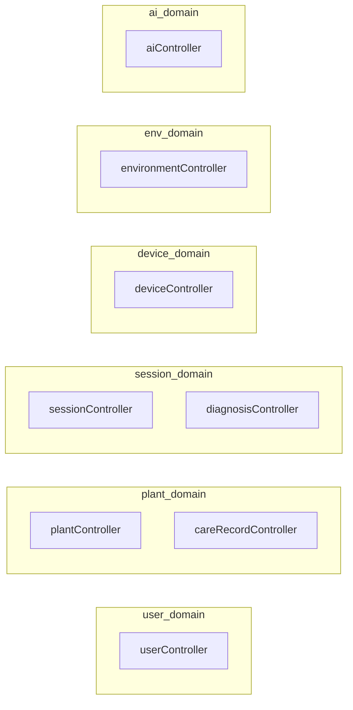
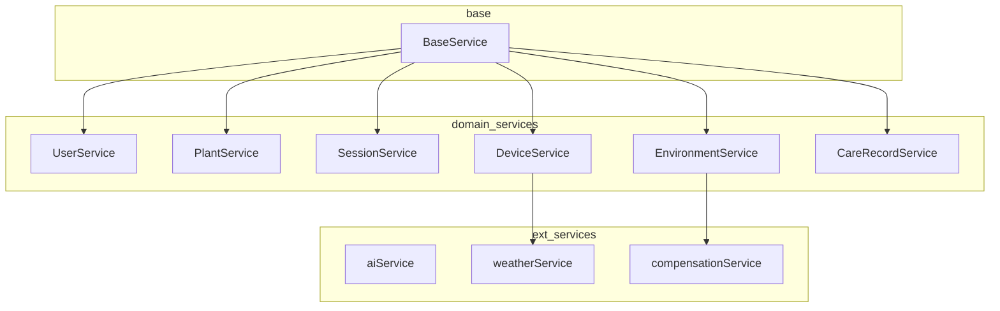
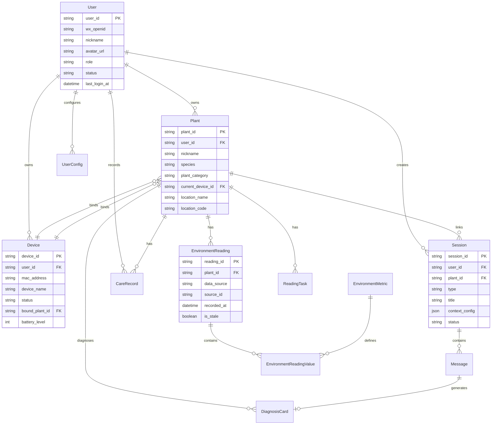
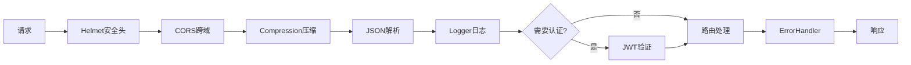
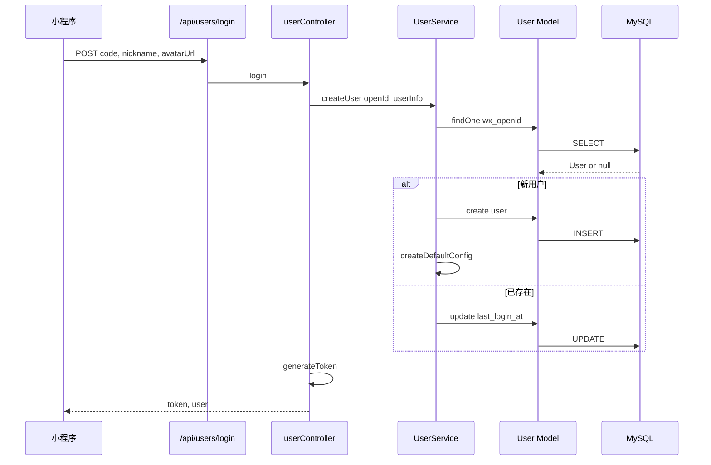
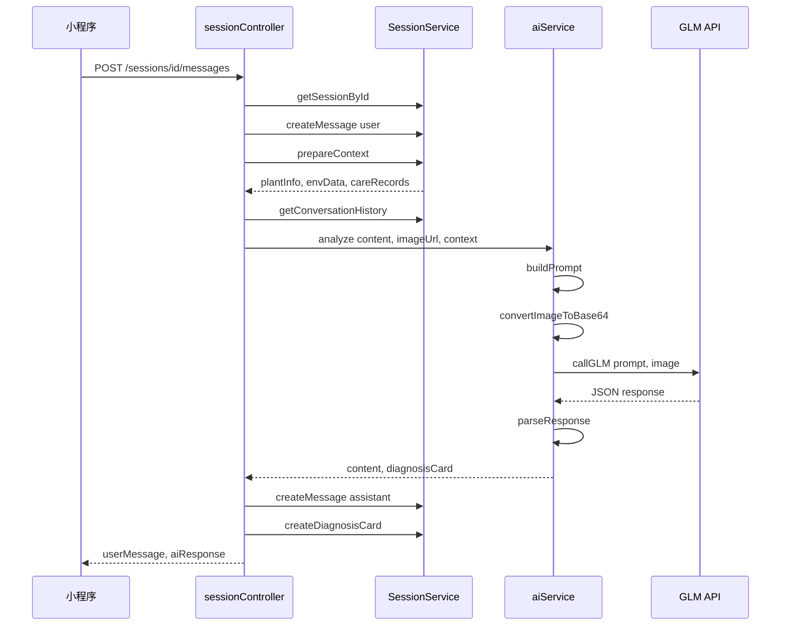
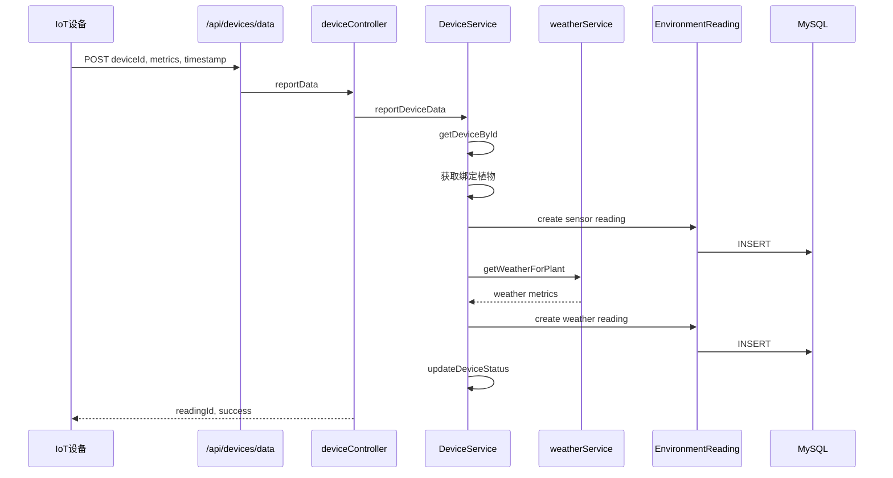

## 后端系统架构

### 一、整体架构图

```mermaid
graph TB
    subgraph client
        MP["微信小程序"]
        DEVICE["IoT设备"]
    end

    subgraph gateway
        EXPRESS["Express.js服务器"]
        MW_AUTH["认证中间件"]
        MW_ERR["错误处理中间件"]
        MW_RES["响应格式中间件"]
    end

    subgraph routes
        R_USER["/api/users"]
        R_PLANT["/api/plants"]
        R_SESSION["/api/sessions"]
        R_DEVICE["/api/devices"]
        R_ENV["/api/environment"]
        R_CARE["/api/care-records"]
        R_DIAG["/api/diagnosis"]
        R_AI["/api/ai"]
        R_COS["/api/cos"]
        R_UPLOAD["/api/upload"]
    end

    subgraph controllers
        C_USER["userController"]
        C_PLANT["plantController"]
        C_SESSION["sessionController"]
        C_DEVICE["deviceController"]
        C_ENV["environmentController"]
        C_CARE["careRecordController"]
        C_DIAG["diagnosisController"]
        C_AI["aiController"]
    end

    subgraph services
        S_BASE["BaseService"]
        S_USER["UserService"]
        S_PLANT["PlantService"]
        S_SESSION["SessionService"]
        S_DEVICE["DeviceService"]
        S_ENV["EnvironmentService"]
        S_CARE["CareRecordService"]
        S_AI["aiService"]
        S_WEATHER["weatherService"]
        S_COMP["compensationService"]
    end

    subgraph models
        M_USER["User"]
        M_UCONFIG["UserConfig"]
        M_PLANT["Plant"]
        M_SESSION["Session"]
        M_MESSAGE["Message"]
        M_DEVICE["Device"]
        M_ENV["EnvironmentReading"]
        M_ENVVAL["EnvironmentReadingValue"]
        M_METRIC["EnvironmentMetric"]
        M_CARE["CareRecord"]
        M_DIAG["DiagnosisCard"]
        M_TASK["ReadingTask"]
    end

    subgraph external
        AI_API["AI服务-GLM/OpenAI"]
        WEATHER_API["天气API"]
        COS["腾讯云COS"]
    end

    subgraph db
        MYSQL[("MySQL")]
    end

    MP --> EXPRESS
    DEVICE --> EXPRESS
    EXPRESS --> MW_AUTH --> MW_RES --> MW_ERR
    
    R_USER --> C_USER --> S_USER
    R_PLANT --> C_PLANT --> S_PLANT
    R_SESSION --> C_SESSION --> S_SESSION
    R_DEVICE --> C_DEVICE --> S_DEVICE
    R_ENV --> C_ENV --> S_ENV
    R_CARE --> C_CARE --> S_CARE
    R_DIAG --> C_DIAG --> S_DIAG
    R_AI --> C_AI --> S_AI

    S_USER --> S_BASE --> M_USER
    S_PLANT --> S_BASE --> M_PLANT
    S_SESSION --> S_BASE --> M_SESSION
    S_DEVICE --> S_BASE --> M_DEVICE
    S_ENV --> S_BASE --> M_ENV
    S_CARE --> S_BASE --> M_CARE

    S_AI --> AI_API
    S_WEATHER --> WEATHER_API
    S_DEVICE --> S_WEATHER

    M_USER --> MYSQL
    M_UCONFIG --> MYSQL
    M_PLANT --> MYSQL
    M_SESSION --> MYSQL
    M_MESSAGE --> MYSQL
    M_DEVICE --> MYSQL
    M_ENV --> MYSQL
    M_ENVVAL --> MYSQL
    M_METRIC --> MYSQL
    M_CARE --> MYSQL
    M_DIAG --> MYSQL
    M_TASK --> MYSQL
```

**图层说明**：
- **client** - 客户端层：微信小程序、IoT设备
- **gateway** - API网关层：Express.js服务器及中间件
- **routes** - 路由层：API端点定义
- **controllers** - 控制器层：请求处理
- **services** - 服务层：业务逻辑
- **models** - 数据访问层：数据库模型
- **external** - 外部服务：AI、天气API、云存储
- **db** - 数据库：MySQL

---

### 二、分层职责详解

#### 1. 路由层

| 路由文件 | 路径前缀 | 功能模块 | 端点数量 |
|:---|:---|:---|:---:|
| [users.js](file:///f:/PROJECTS/WeChatProjects/MVP/backend/server/src/routes/users.js) | `/api/users` | 用户认证、资料、设置 | 7 |
| [plants.js](file:///f:/PROJECTS/WeChatProjects/MVP/backend/server/src/routes/plants.js) | `/api/plants` | 植物档案CRUD | 5 |
| [sessions.js](file:///f:/PROJECTS/WeChatProjects/MVP/backend/server/src/routes/sessions.js) | `/api/sessions` | 会话管理、消息收发 | 8 |
| [devices.js](file:///f:/PROJECTS/WeChatProjects/MVP/backend/server/src/routes/devices.js) | `/api/devices` | 设备绑定、数据上报 | 5 |
| [environment.js](file:///f:/PROJECTS/WeChatProjects/MVP/backend/server/src/routes/environment.js) | `/api/environment` | 环境数据查询 | 2 |
| [careRecords.js](file:///f:/PROJECTS/WeChatProjects/MVP/backend/server/src/routes/careRecords.js) | `/api/care-records` | 养护记录 | 4 |
| [diagnosis.js](file:///f:/PROJECTS/WeChatProjects/MVP/backend/server/src/routes/diagnosis.js) | `/api/diagnosis` | 诊断卡查询 | 2 |
| [ai.js](file:///f:/PROJECTS/WeChatProjects/MVP/backend/server/src/routes/ai.js) | `/api/ai` | AI分析 | 1 |
| [cos.js](file:///f:/PROJECTS/WeChatProjects/MVP/backend/server/src/routes/cos.js) | `/api/cos` | 腾讯云COS直传 | 3 |
| [upload.js](file:///f:/PROJECTS/WeChatProjects/MVP/backend/server/src/routes/upload.js) | `/api/upload` | 本地文件上传 | 2 |
| [storage.js](file:///f:/PROJECTS/WeChatProjects/MVP/backend/server/src/routes/storage.js) | `/api/storage` | 云存储上传链接 | 1 |
| [weather.js](file:///f:/PROJECTS/WeChatProjects/MVP/backend/server/src/routes/weather.js) | `/api/weather` | 天气数据 | 2 |
| [logs.js](file:///f:/PROJECTS/WeChatProjects/MVP/backend/server/src/routes/logs.js) | `/api/logs` | 日志管理 | 5 |

---

#### 2. 控制器层

**域说明**：
- **user_domain** - 用户域
- **plant_domain** - 植物域
- **session_domain** - 会话域
- **device_domain** - 设备域
- **env_domain** - 环境域
- **ai_domain** - AI域

**控制器职责**：
- 解析请求参数
- 调用Service方法
- 格式化响应数据
- 处理HTTP状态码

**控制器方法详情**：

| 控制器 | 方法 |
|:---|:---|
| userController | login, guestLogin, getProfile, updateProfile, getSettings, updateSettings, getConfig, setConfig |
| plantController | getPlants, createPlant, getPlantDetail, updatePlant, deletePlant |
| careRecordController | getCareRecords, createCareRecord, updateCareRecord, deleteCareRecord |
| sessionController | getSessions, createSession, getSessionDetail, updateSession, getMessages, sendMessage, upgradeSession, markSessionAsRead, deleteSession |
| diagnosisController | getDiagnosisHistory, getDiagnosisDetail |
| deviceController | getDevices, bindDevice, unbindDevice, getDeviceDetail, reportData |
| environmentController | getCurrentEnvironment, getMetricHistory |
| aiController | analyze |
| weatherController | getCurrentWeather, getAstronomy |
| logController | receiveFrontendLogs, getLogFiles, getLogContent, searchLogs, clearLogFile |
| cosController | getUploadSign, getTempFileUrl, deleteFile |
| storageController | getUploadLink |

---

#### 3. 服务层

**服务说明**：
- **base** - 基础服务：BaseService提供通用CRUD
- **domain_services** - 领域服务：各业务域服务
- **ext_services** - 外部服务：AI、天气、补偿服务

**BaseService通用方法**：
- `findById(id)` - 按主键查询
- `findOne(conditions)` - 单条查询
- `findAll(conditions, options)` - 列表查询
- `create(data)` - 创建记录
- `update(id, data)` - 更新记录
- `delete(id)` - 删除记录
- `paginate(conditions, page, pageSize, options)` - 分页查询

**领域服务方法详情**：

| 服务 | 方法 |
|:---|:---|
| UserService | createUser, createGuestUser, getUserById, getUserEntity, updateUser, updateUserLoginTime, getUserByOpenId, createDefaultConfig, getConfig, setConfig, getSettings, updateSettings |
| PlantService | createPlant, getPlantById, getPlantList, getPlantWithDevice, getPlantDetail, updatePlant, deletePlant, getPlantDevices, getLatestDiagnoses, degradePlantSessions |
| SessionService | createSession, getSessionById, getSessionList, updateSession, deleteSession, getMessages, getMessageCount, createMessage, createDiagnosisCard, getPlantsForSessions, getLatestMessages, getDiagnosisCardsForMessages, getReadPositions, updateReadPosition, getLastMessage, prepareContext, getConversationHistory, upgradeSession |
| DeviceService | bindDevice, unbindDevice, getDeviceList, getDeviceById, getDeviceByMac, updateDeviceStatus, getPlantsForDevices, reportDeviceData |
| EnvironmentService | getPlantById, getCurrentData, getHistoryData |
| CareRecordService | createCareRecord, getCareRecordList, getRecordById, updateCareRecord, deleteCareRecord, getPlantsForRecords |

---

#### 4. 数据模型层

---

### 三、中间件层

| 中间件 | 文件 | 职责 |
|:---|:---|:---|
| auth | [auth.js](file:///f:/PROJECTS/WeChatProjects/MVP/backend/server/src/middleware/auth.js) | JWT验证、用户信息挂载 |
| deviceAuth | deviceAuth.js | 设备认证 |
| errorHandler | [errorHandler.js](file:///f:/PROJECTS/WeChatProjects/MVP/backend/server/src/middleware/errorHandler.js) | 统一错误处理、asyncHandler |
| response | [response.js](file:///f:/PROJECTS/WeChatProjects/MVP/backend/server/src/middleware/response.js) | res.success/res.error |

---

### 四、配置层

| 配置文件 | 用途 |
|:---|:---|
| [database.js](file:///f:/PROJECTS/WeChatProjects/MVP/backend/server/src/config/database.js) | Sequelize数据库连接 |
| [ai.js](file:///f:/PROJECTS/WeChatProjects/MVP/backend/server/src/config/ai.js) | AI服务配置（GLM/OpenAI等） |
| [environment.js](file:///f:/PROJECTS/WeChatProjects/MVP/backend/server/src/config/environment.js) | 环境数据常量（TASK_STATUS, DATA_SOURCE） |

---

### 五、工具层

| 工具文件 | 用途 |
|:---|:---|
| [logger.js](file:///f:/PROJECTS/WeChatProjects/MVP/backend/server/src/utils/logger.js) | 日志记录 |
| [response.js](file:///f:/PROJECTS/WeChatProjects/MVP/backend/server/src/utils/response.js) | 响应格式化工具 |
| [validators.js](file:///f:/PROJECTS/WeChatProjects/MVP/backend/server/src/utils/validators.js) | 请求参数验证 |

---

### 六、定时任务

| 任务文件 | 用途 | 执行频率 |
|:---|:---|:---:|
| [environmentSyncJob.js](file:///f:/PROJECTS/WeChatProjects/MVP/backend/server/src/jobs/environmentSyncJob.js) | 环境数据同步定时任务（天气数据获取） | 每2小时 |

---

### 七、数据流向示例

#### 用户登录流程

#### AI诊断流程

#### 设备数据上报流程

---

### 八、架构特点总结

1. **三层架构**：Controller → Service → Model
2. **服务继承**：所有Service继承BaseService，复用CRUD方法
3. **领域驱动**：按业务域划分（用户域、植物域、会话域、设备域、环境域、AI域）
4. **中间件链**：认证 → 路由 → 错误处理
5. **外部服务集成**：AI服务、天气API、云存储

---

### 九、接口职责边界

#### 设备数据上报

**统一入口**：`POST /api/devices/data`

| 接口 | 认证方式 | 用途 |
|:---|:---|:---|
| `/api/devices/data` | deviceAuth | IoT设备数据上报（主接口） |

**说明**：
- 设备数据上报统一走 `/api/devices/data`
- 该接口使用设备认证，自动获取绑定植物信息
- 同时写入传感器数据和天气数据（合轴存储）
- `/api/environment` 模块仅提供**查询**功能，不接收数据上报
