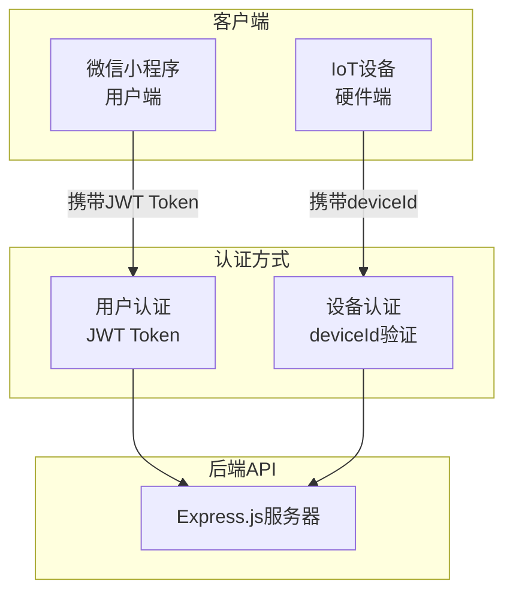
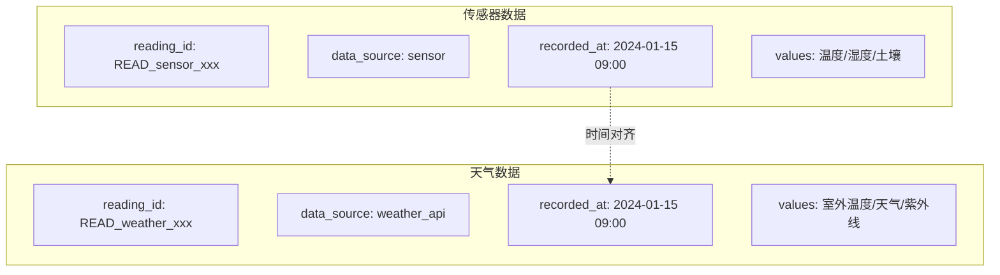

## 后端通信对象与模块职责

### 一、通信对象总览



---

### 二、通信对象定义

| 通信对象 | 认证方式 | 认证参数 | 说明 |
|:---|:---|:---|:---|
| **微信小程序** | 用户认证 | `Authorization: Bearer <JWT>` | 用户登录后获取Token |
| **IoT设备** | 设备认证 | `body: { deviceId, ... }` | 设备上报数据时验证设备ID |

---

### 三、模块职责与接口归属

#### 1. Users 模块 - 用户管理

**通信对象**：微信小程序

| 接口 | 方法 | 认证 | 功能 |
|:---|:---|:---|:---|
| `/api/users/login` | POST | 无 | 微信登录 |
| `/api/users/guest-login` | POST | 无 | 游客登录 |
| `/api/users/profile` | GET | 用户认证 | 获取用户资料 |
| `/api/users/profile` | PUT | 用户认证 | 更新用户资料 |
| `/api/users/settings` | GET | 用户认证 | 获取用户设置 |
| `/api/users/settings` | PUT | 用户认证 | 更新用户设置 |
| `/api/users/config/:key` | GET | 用户认证 | 获取配置项 |
| `/api/users/config` | POST | 用户认证 | 设置配置项 |

---

#### 2. Plants 模块 - 植物档案

**通信对象**：微信小程序

| 接口 | 方法 | 认证 | 功能 |
|:---|:---|:---|:---|
| `/api/plants` | GET | 用户认证 | 获取植物列表 |
| `/api/plants` | POST | 用户认证 | 创建植物档案 |
| `/api/plants/:plantId` | GET | 用户认证 | 获取植物详情 |
| `/api/plants/:plantId` | PUT | 用户认证 | 更新植物信息 |
| `/api/plants/:plantId` | DELETE | 用户认证 | 删除植物档案 |

---

#### 3. Devices 模块 - 设备管理

**通信对象**：微信小程序 + IoT设备

| 接口 | 方法 | 认证 | 通信对象 | 功能 |
|:---|:---|:---|:---|:---|
| `/api/devices` | GET | 用户认证 | 小程序 | 获取设备列表 |
| `/api/devices/bind` | POST | 用户认证 | 小程序 | 绑定设备 |
| `/api/devices/unbind` | POST | 用户认证 | 小程序 | 解绑设备 |
| `/api/devices/:deviceId` | GET | 用户认证 | 小程序 | 获取设备详情 |
| **`/api/devices/data`** | **POST** | **设备认证** | **IoT设备** | **设备数据上报** |

**关键设计**：
- 小程序负责设备绑定/解绑操作
- IoT设备负责数据上报
- 数据上报时自动写入环境数据

---

#### 4. Environment 模块 - 环境数据

**通信对象**：微信小程序（仅查询）

| 接口 | 方法 | 认证 | 功能 |
|:---|:---|:---|:---|
| `/api/environment/current` | GET | 用户认证 | 获取实时环境数据 |
| `/api/environment/history` | GET | 用户认证 | 获取历史环境数据 |

**注意**：本模块**仅提供查询**，数据写入由 Devices 模块的 `/api/devices/data` 负责。

---

#### 5. Sessions 模块 - 会话管理

**通信对象**：微信小程序

| 接口 | 方法 | 认证 | 功能 |
|:---|:---|:---|:---|
| `/api/sessions` | GET | 用户认证 | 获取会话列表 |
| `/api/sessions` | POST | 用户认证 | 创建会话 |
| `/api/sessions/:sessionId` | GET | 用户认证 | 获取会话详情 |
| `/api/sessions/:sessionId` | PUT | 用户认证 | 更新会话 |
| `/api/sessions/:sessionId` | DELETE | 用户认证 | 删除会话 |
| `/api/sessions/:sessionId/messages` | GET | 用户认证 | 获取消息列表 |
| `/api/sessions/:sessionId/messages` | POST | 用户认证 | 发送消息 |
| `/api/sessions/:sessionId/read` | POST | 用户认证 | 标记已读 |
| `/api/sessions/:sessionId/upgrade` | POST | 用户认证 | 升级为植物会话 |

---

#### 6. CareRecords 模块 - 养护记录

**通信对象**：微信小程序

| 接口 | 方法 | 认证 | 功能 |
|:---|:---|:---|:---|
| `/api/care-records` | GET | 用户认证 | 获取养护记录列表 |
| `/api/care-records` | POST | 用户认证 | 创建养护记录 |
| `/api/care-records/:recordId` | PUT | 用户认证 | 更新养护记录 |
| `/api/care-records/:recordId` | DELETE | 用户认证 | 删除养护记录 |

---

#### 7. Diagnosis 模块 - 诊断卡

**通信对象**：微信小程序

| 接口 | 方法 | 认证 | 功能 |
|:---|:---|:---|:---|
| `/api/diagnosis` | GET | 用户认证 | 获取诊断历史 |
| `/api/diagnosis/:cardId` | GET | 用户认证 | 获取诊断详情 |

---

#### 8. AI 模块 - AI分析

**通信对象**：微信小程序

| 接口 | 方法 | 认证 | 功能 |
|:---|:---|:---|:---|
| `/api/ai/analyze` | POST | 用户认证 | AI分析（独立接口） |

**注意**：AI分析也可通过 Sessions 模块的 `POST /sessions/:id/messages` 触发。

---

#### 9. Weather 模块 - 天气数据

**通信对象**：微信小程序

| 接口 | 方法 | 认证 | 功能 |
|:---|:---|:---|:---|
| `/api/weather/now` | GET | 无 | 获取实时天气 |
| `/api/weather/astronomy` | GET | 无 | 获取天文数据（日出日落） |

**说明**：天气接口无需认证，供前端直接调用获取公开天气数据。

---

#### 10. COS 模块 - 云存储直传

**通信对象**：微信小程序

| 接口 | 方法 | 认证 | 功能 |
|:---|:---|:---|:---|
| `/api/cos/upload-sign` | POST | 用户认证 | 获取上传签名 |
| `/api/cos/temp-url` | POST | 用户认证 | 获取临时访问链接 |
| `/api/cos/delete` | DELETE | 用户认证 | 删除文件 |

---

#### 11. Storage 模块 - 云存储上传

**通信对象**：微信小程序

| 接口 | 方法 | 认证 | 功能 |
|:---|:---|:---|:---|
| `/api/storage/upload` | POST | 用户认证 | 获取云存储上传链接 |

---

#### 12. Logs 模块 - 日志管理

**通信对象**：微信小程序（前端日志）+ 管理端（日志查看）

| 接口 | 方法 | 认证 | 通信对象 | 功能 |
|:---|:---|:---|:---|:---|
| `/api/logs/frontend` | POST | 无 | 小程序 | 接收前端日志 |
| `/api/logs/files` | GET | 密钥验证 | 管理端 | 获取日志文件列表 |
| `/api/logs/content` | GET | 密钥验证 | 管理端 | 获取日志内容 |
| `/api/logs/search` | GET | 密钥验证 | 管理端 | 搜索日志 |
| `/api/logs/clear` | DELETE | 密钥验证 | 管理端 | 清空日志文件 |

**注意**：日志查看接口需要 `X-Log-Access-Key` 密钥验证。

---

### 四、数据流向图

```mermaid
flowchart TB
    subgraph 小程序端
        MP[微信小程序]
    end

    subgraph IoT设备端
        IOT[IoT设备]
    end

    subgraph 用户认证接口
        U1[/api/users/*]
        U2[/api/plants/*]
        U3[/api/sessions/*]
        U4[/api/care-records/*]
        U5[/api/diagnosis/*]
        U6[/api/ai/*]
        U7[/api/cos/*]
        U8[/api/devices<br/>GET/POST bind/unbind]
        U9[/api/environment/*]
        U10[/api/logs/*<br/>frontend除外]
    end

    subgraph 设备认证接口
        D1[/api/devices/data<br/>POST]
    end

    subgraph 无认证接口
        N1[/api/logs/frontend]
        N2[/api/weather/*]
    end

    subgraph 数据存储
        DB[(MySQL)]
        ENV[(environment_readings)]
    end

    MP -->|JWT认证| U1
    MP -->|JWT认证| U2
    MP -->|JWT认证| U3
    MP -->|JWT认证| U4
    MP -->|JWT认证| U5
    MP -->|JWT认证| U6
    MP -->|JWT认证| U7
    MP -->|JWT认证| U8
    MP -->|JWT认证| U9
    MP -->|JWT认证| U10
    MP -->|无认证| N1
    MP -->|无认证| N2

    IOT -->|设备认证| D1
    D1 -->|写入| ENV
    U9 -->|读取| ENV

    U1 --> DB
    U2 --> DB
    U3 --> DB
    U4 --> DB
    U5 --> DB
    U8 --> DB
    U10 --> DB
```

---

### 五、模块职责总结

| 模块 | 通信对象 | 写入 | 查询 | 特殊说明 |
|:---|:---|:---:|:---:|:---|
| Users | 小程序 | ✅ | ✅ | 登录无需认证 |
| Plants | 小程序 | ✅ | ✅ | - |
| Devices | 小程序 + IoT | ✅ | ✅ | 数据上报由IoT设备调用 |
| Environment | 小程序 | ❌ | ✅ | 数据由Devices模块写入 |
| Sessions | 小程序 | ✅ | ✅ | 包含AI对话 |
| CareRecords | 小程序 | ✅ | ✅ | - |
| Diagnosis | 小程序 | ❌ | ✅ | 由Sessions模块创建 |
| AI | 小程序 | - | - | 独立分析接口 |
| Weather | 小程序 | - | ✅ | 无需认证 |
| COS | 小程序 | ✅ | ✅ | 腾讯云COS直传 |
| Storage | 小程序 | ✅ | - | 获取上传链接 |
| Logs | 小程序 + 管理端 | ✅ | ✅ | 前端日志无需认证，查看需密钥 |
| Upload | 小程序 | ✅ | - | ~~本地文件上传~~ **已废弃，请使用 COS 直传** |

---

### 六、关键设计原则

1. **认证分离**：
   - 小程序接口使用用户认证（JWT）
   - IoT设备接口使用设备认证（deviceId）

2. **职责分离**：
   - Devices 模块负责设备管理和数据上报
   - Environment 模块仅负责数据查询

3. **数据流向**：
   - IoT设备 → `/api/devices/data` → EnvironmentService.uploadReading → environment_readings
   - 定时任务 → weatherService → environment_readings（独立写入）
   - 小程序 → `/api/environment/current` → 查询环境数据

4. **关联关系**：
   - 设备绑定植物后，数据上报自动关联到植物
   - 用户只能查询自己植物的环境数据

---

### 七、环境数据存储设计（不合轴）

#### 设计原则

**不合轴**：传感器数据和天气数据使用**不同的 reading_id**，通过 `recorded_at` 时间点对齐。



#### 数据写入时机

| 数据类型 | 写入时机 | 触发方 |
|:---|:---|:---|
| 传感器数据 | 设备上报时 | IoT设备 → `/api/devices/data` |
| 天气数据 | 定时任务 | 后端定时任务（每2小时） |

#### 查询时对齐

`GET /api/environment/current` 查询时：
1. 根据 `recorded_at` 查询传感器 reading
2. 根据 `recorded_at` 查询天气 reading
3. 合并返回给前端

#### 优势

1. **解耦**：传感器和天气数据独立写入，互不影响
2. **容错**：天气API失败不影响传感器数据存储
3. **灵活**：可以独立更新传感器或天气数据
4. **补传支持**：传感器补传可覆盖补偿数据
