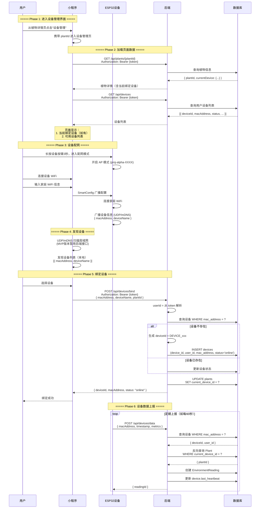
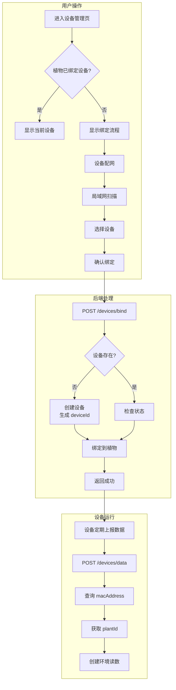

## 完整时序流程：从进入设备界面到设备正常传数据

---

## 各阶段详细说明

### Phase 1-2: 进入界面加载数据

| 步骤 | API | 说明 |
|:---|:---|:---|
| 1 | `GET /api/plants/{plantId}` | 获取植物详情，包含 `currentDevice` |
| 2 | `GET /api/devices` | 获取用户已绑定的设备列表 |

### Phase 3: 设备配网

| 步骤 | 说明 |
|:---|:---|
| 1 | 设备进入配网模式（AP 模式） |
| 2 | 小程序连接设备 WiFi |
| 3 | 发送家庭 WiFi 配置（SmartConfig） |
| 4 | 设备连接家庭 WiFi |
| 5 | 设备广播自己的信息（UDP/mDNS） |

### Phase 4: 发现设备

| 方式 | 说明 |
|:---|:---|
| **局域网扫描** | UDP/mDNS 发现局域网内的设备 |
| **后端列表** | `GET /api/devices` 返回已绑定设备 |

### Phase 5: 绑定设备

| API | 参数 | 认证 |
|:---|:---|:---|
| `POST /api/devices/bind` | `{ macAddress, deviceName, plantId }` | Bearer Token |

**后端逻辑**：
1. `user_id` 从 token 获取
2. 通过 `macAddress` 查询设备
3. 设备不存在则自动创建
4. 更新 `Plant.current_device_id`

### Phase 6: 数据上报

| API | 参数 | 认证 |
|:---|:---|:---|
| `POST /api/devices/data` | `{ macAddress, metrics }` | 设备认证 |

**后端逻辑**：
1. 通过 `macAddress` 查询设备
2. 反向查询 `Plant.current_device_id` 获取 `plantId`
3. 创建环境读数记录
4. 更新设备心跳时间

---

## 数据流向图

---

## 关键设计点

| 设计点 | 说明 |
|:---|:---|
| **设备标识** | 使用 `macAddress`（设备固有），不使用 `deviceId`（后端生成） |
| **用户归属** | `user_id` 从 token 获取，不从前端参数传入 |
| **数据关联** | 单向关联，`Plant.current_device_id` → `Device` |
| **设备发现** | 前端 UDP/mDNS 扫描局域网（MVP 暂用后端接口） |
| **数据上报** | 设备使用 `macAddress`，后端反向查询获取 `plantId` |