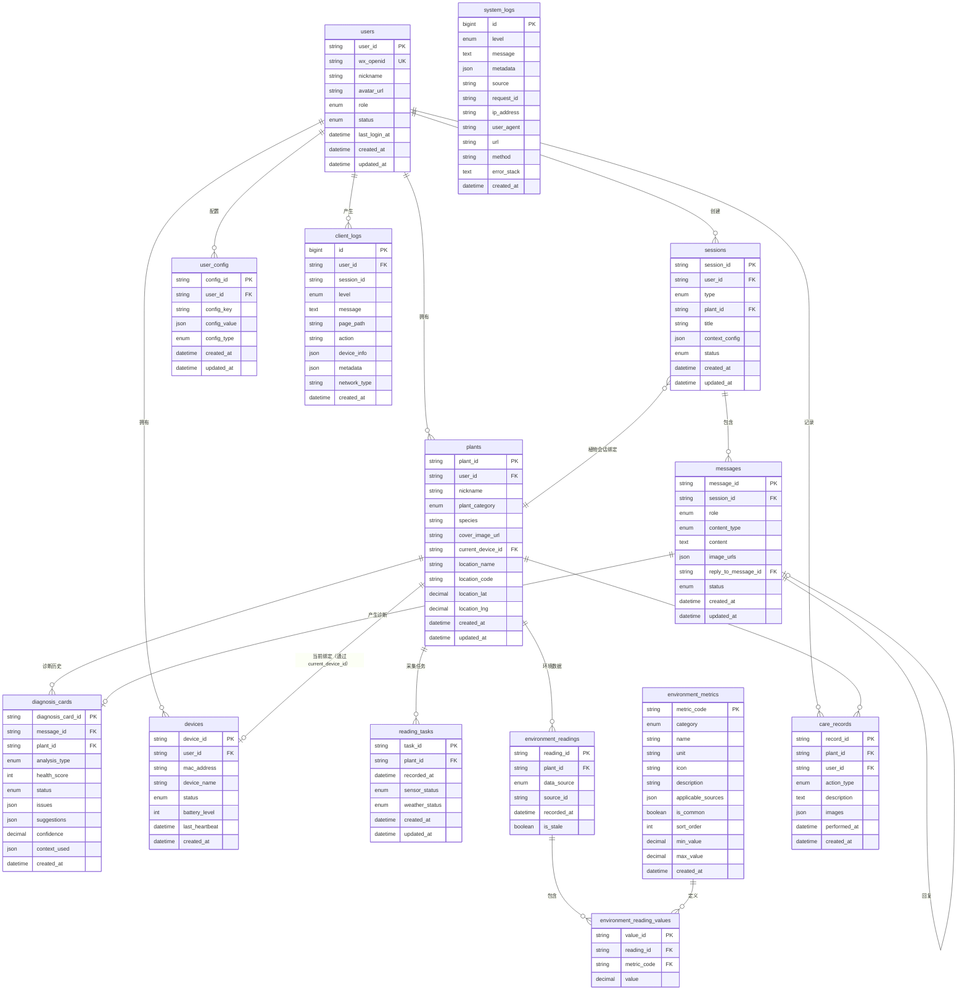
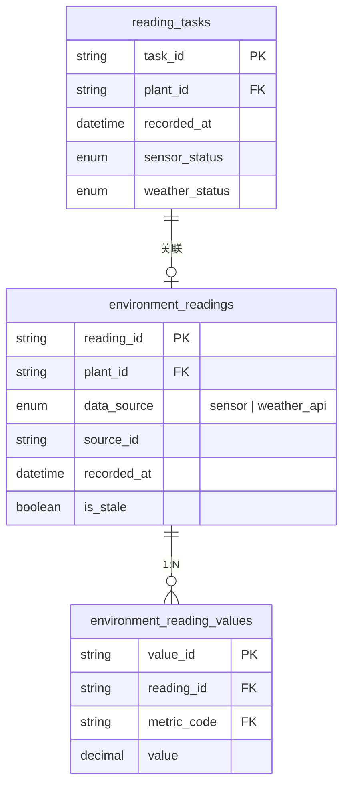
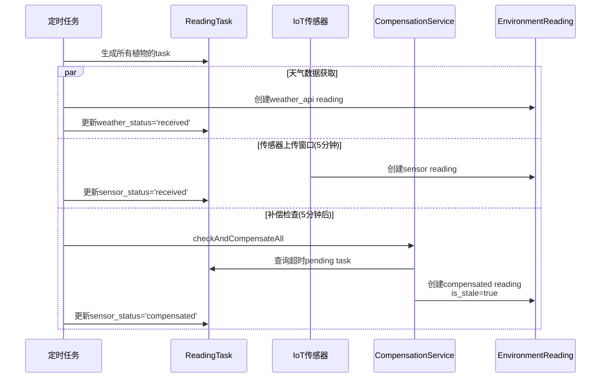
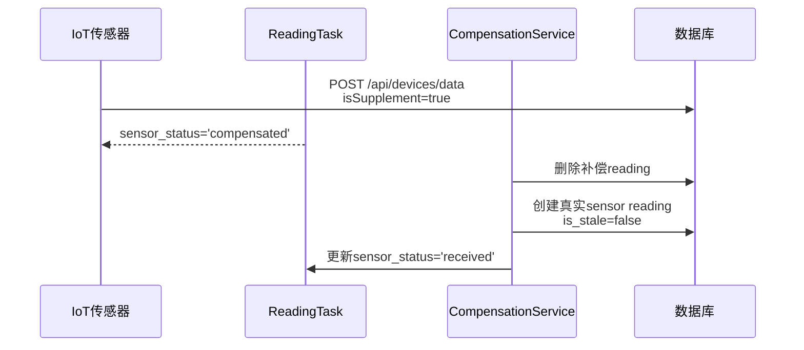

# 智能园艺助手 - 数据库设计画布

**版本**: V3.3\
**日期**: 2026-04-11\
**状态**: 与架构设计 V3.0 同步，新增环境数据专题设计和Schema变更记录

***

## 一、设计概览

### 1.1 设计原则

1. **单一职责**：每张表只负责一个明确的概念
2. **避免冗余**：通过外键关联，不重复存储数据
3. **扩展友好**：预留 JSON 字段应对变化
4. **查询优先**：针对业务场景优化表结构
5. **外键级联**：利用数据库外键实现级联删除，简化业务逻辑

### 1.2 命名规范

| 类型   | 规范       | 示例                        |
| :--- | :------- | :------------------------ |
| 表名   | 小写，下划线分隔 | `diagnosis_cards`         |
| 字段名  | 小写，下划线分隔 | `plant_category`          |
| 主键   | 表名缩写\_id | `plant_id`                |
| 外键   | 引用表\_id  | `user_id`                 |
| 索引   | idx\_字段名 | `idx_plant_created`       |
| 状态字段 | status   | `active/archived/deleted` |
| 时间字段 | xxx\_at  | `created_at/updated_at`   |

### 1.3 表清单总览

|  序号 | 表名                           | 中文名     | 说明          | 数据量预估  |
| :-: | :--------------------------- | :------ | :---------- | :----- |
|  1  | users                        | 用户表     | 微信授权登录      | 1万+    |
|  2  | plants                       | 植物档案表   | 核心实体        | 5万+    |
|  3  | sessions                     | 会话表     | 咨询/植物会话     | 10万+   |
|  4  | messages                     | 消息表     | 完整对话存储      | 100万+  |
|  5  | diagnosis\_cards             | 诊断卡表    | 诊断结果结构化     | 20万+   |
|  6  | devices                      | 设备表     | 硬件设备管理      | 2万+    |
|  7  | environment\_readings        | 环境读数主表  | 统一存储设备+天气数据 | 1000万+ |
|  8  | environment\_reading\_values | 环境数值表   | 存储各指标具体数值   | 5000万+ |
|  9  | environment\_metrics         | 环境指标定义表 | 支持多来源动态指标配置 | 50条以内  |
|  10 | reading\_tasks               | 读数任务表   | 追踪数据采集状态    | 500万+  |
|  11 | care\_records                | 养护记录表   | 用户手动记录      | 10万+   |
|  12 | user\_config                 | 用户配置表   | 用户偏好、设置、置顶等 | 10万+   |
|  13 | system\_logs                 | 系统日志表   | 服务端运行日志     | 1000万+ |
|  14 | client\_logs                 | 客户端日志表  | 小程序用户行为日志  | 500万+  |

**补充说明**：

- `environment_hourly_stats` - 预聚合数据表（可选），见第八章
- `environment_data` - 实时聚合视图（虚拟表），见第八章

***

## 二、核心实体 E-R 关系

### 2.1 E-R 图（Mermaid）



### 2.2 关系说明

| 实体A                   |  关系 | 实体B                          | 说明           |
| :-------------------- | :-: | :--------------------------- | :----------- |
| users                 | 1:N | plants                       | 一个用户有多株植物    |
| users                 | 1:N | sessions                     | 一个用户有多个会话    |
| users                 | 1:N | devices                      | 一个用户有多个设备    |
| users                 | 1:N | care\_records                | 一个用户可记录多条养护  |
| plants                | 1:N | diagnosis\_cards             | 一株植物有多条诊断历史  |
| plants                | 1:N | environment\_readings        | 一株植物有多条环境读数  |
| plants                | 1:N | reading\_tasks               | 一株植物有多个采集任务  |
| plants                | 1:N | care\_records                | 一株植物有多条养护记录  |
| plants                | 0:1 | devices                      | 一株植物可绑定一个设备（通过current_device_id） |
| environment\_readings | 1:N | environment\_reading\_values | 一次读数包含多个指标数值 |
| environment\_metrics  | 1:N | environment\_reading\_values | 一个指标定义对应多个读数 |
| sessions              | 1:N | messages                     | 一个会话有多条消息    |
| sessions              | N:1 | plants                       | 植物会话绑定植物（可选） |
| users                 | 1:N | client_logs                  | 一个用户产生多条客户端日志 |
| messages              | 0:1 | diagnosis\_cards             | 一条消息可产生一个诊断  |
| messages              | 0:1 | messages                     | 消息可回复另一条消息   |
| users                 | 1:N | user\_config                 | 一个用户有多条配置    |

***

## 三、表结构设计

### 3.1 users（用户表）

**说明**：系统用户表，通过微信授权登录。role 字段控制权限范围：user（普通用户）、expert（专家）、admin（管理员）。

#### DDL

```sql
CREATE TABLE `users` (
  `user_id` varchar(64) NOT NULL COMMENT '用户ID',
  `wx_openid` varchar(128) DEFAULT NULL COMMENT '微信openid',
  `nickname` varchar(100) NOT NULL COMMENT '微信昵称',
  `avatar_url` varchar(500) DEFAULT NULL COMMENT '头像URL',
  `role` enum('user','expert','admin') NOT NULL DEFAULT 'user' COMMENT '用户角色',
  `status` enum('active','inactive','banned') NOT NULL DEFAULT 'active' COMMENT '用户状态',
  `last_login_at` datetime DEFAULT NULL COMMENT '最后登录时间',
  `created_at` datetime NOT NULL DEFAULT CURRENT_TIMESTAMP COMMENT '注册时间',
  `updated_at` datetime NOT NULL DEFAULT CURRENT_TIMESTAMP ON UPDATE CURRENT_TIMESTAMP COMMENT '最后更新时间',
  PRIMARY KEY (`user_id`),
  UNIQUE KEY `wx_openid` (`wx_openid`),
  KEY `idx_role` (`role`),
  KEY `idx_wx_openid` (`wx_openid`)
) ENGINE=InnoDB DEFAULT CHARSET=utf8mb4 COLLATE=utf8mb4_unicode_ci COMMENT='用户表';
```

#### 字段说明

| 字段名             | 中文名      |      类型      |  必填 | 默认值                | 说明                     |
| :-------------- | :------- | :----------: | :-: | :----------------- | :--------------------- |
| user\_id        | 用户ID     |  VARCHAR(64) |  是  | -                  | 主键，独立生成的用户ID           |
| wx\_openid      | 微信openid | VARCHAR(128) |  否  | NULL               | 微信openid，唯一索引          |
| nickname        | 昵称       | VARCHAR(100) |  是  | -                  | 微信昵称                   |
| avatar\_url     | 头像URL    | VARCHAR(500) |  否  | NULL               | 头像地址                   |
| role            | 角色       |     ENUM     |  是  | user               | user/expert/admin      |
| status          | 状态       |     ENUM     |  是  | active             | active/inactive/banned |
| last\_login\_at | 最后登录     |   DATETIME   |  否  | NULL               | 最后登录时间                 |
| created\_at     | 创建时间     |   DATETIME   |  是  | CURRENT\_TIMESTAMP | 注册时间                   |
| updated\_at     | 更新时间     |   DATETIME   |  是  | CURRENT\_TIMESTAMP | 最后更新                   |

#### 索引设计

| 索引名             | 字段         |  类型 | 说明         |
| :-------------- | :--------- | :-: | :--------- |
| PRIMARY         | user\_id   |  主键 | 唯一标识       |
| idx\_wx\_openid | wx\_openid |  唯一 | 微信openid查询 |
| idx\_role       | role       |  普通 | 按角色查询      |

#### 关联关系

- 1:N → plants（一个用户多株植物，级联删除）
- 1:N → sessions（一个用户多个会话，级联删除）
- 1:N → devices（一个用户多个设备，级联删除）
- 1:N → care\_records（一个用户多条养护记录，级联删除）
- 1:N → user\_config（一个用户多条配置，级联删除）

***

### 3.2 user\_config（用户配置表）

**说明**：存储用户级别的个性化配置和偏好设置。采用 Key-Value 结构，config\_value 使用 JSON 类型支持灵活的数据结构。用于管理用户偏好、功能开关、排序设置等非核心但个性化的数据。

**配置类型说明**：

- `preference`：用户偏好（主题、排序方式、已读位置等）
- `setting`：功能设置（通知开关、提醒时间等）
- `data`：业务数据（置顶列表、上下文开关状态等）

#### DDL

```sql
CREATE TABLE `user_config` (
  `config_id` varchar(64) NOT NULL COMMENT '配置项唯一标识，UUID',
  `user_id` varchar(64) NOT NULL COMMENT '所属用户ID',
  `config_key` varchar(100) NOT NULL COMMENT '配置键名，如 plant_sort_order',
  `config_value` json NOT NULL COMMENT '配置值，JSON格式',
  `config_type` enum('preference','setting','data') NOT NULL DEFAULT 'preference' COMMENT '配置类型',
  `created_at` datetime NOT NULL DEFAULT CURRENT_TIMESTAMP COMMENT '创建时间',
  `updated_at` datetime NOT NULL DEFAULT CURRENT_TIMESTAMP ON UPDATE CURRENT_TIMESTAMP COMMENT '最后更新时间',
  PRIMARY KEY (`config_id`),
  UNIQUE KEY `uk_user_key` (`user_id`,`config_key`),
  KEY `idx_user_type` (`user_id`,`config_type`),
  CONSTRAINT `user_config_ibfk_1` FOREIGN KEY (`user_id`) REFERENCES `users` (`user_id`) ON DELETE CASCADE ON UPDATE CASCADE
) ENGINE=InnoDB DEFAULT CHARSET=utf8mb4 COLLATE=utf8mb4_unicode_ci COMMENT='用户配置表';
```

#### 字段说明

| 字段名           | 中文名  |      类型      |  必填 | 默认值                | 说明                         |
| :------------ | :--- | :----------: | :-: | :----------------- | :------------------------- |
| config\_id    | 配置ID |  VARCHAR(64) |  是  | -                  | 主键，UUID                    |
| user\_id      | 用户ID |  VARCHAR(64) |  是  | -                  | 外键，关联 users 表，级联删除         |
| config\_key   | 配置键  | VARCHAR(100) |  是  | -                  | 配置项名称，如 plant\_sort\_order |
| config\_value | 配置值  |     JSON     |  是  | -                  | JSON格式，存储具体配置内容            |
| config\_type  | 配置类型 |     ENUM     |  否  | preference         | preference/setting/data    |
| created\_at   | 创建时间 |   DATETIME   |  是  | CURRENT\_TIMESTAMP | 记录创建时间                     |
| updated\_at   | 更新时间 |   DATETIME   |  是  | CURRENT\_TIMESTAMP | 最后更新时间                     |

#### 索引设计

| 索引名             | 字段                      |  类型 | 说明          |
| :-------------- | :---------------------- | :-: | :---------- |
| PRIMARY         | config\_id              |  主键 | 唯一标识        |
| uk\_user\_key   | user\_id + config\_key  |  唯一 | 一个用户的同一配置唯一 |
| idx\_user\_type | user\_id + config\_type |  普通 | 按用户和类型查询    |

#### 关联关系

- N:1 → users（多个配置项属于一个用户，级联删除）

#### 配置项示例

| config\_key            | config\_type | config\_value 示例                                                    | 说明        |
| :--------------------- | :----------- | :------------------------------------------------------------------ | :-------- |
| plant\_sort\_order     | preference   | `{"pinned": ["PLANT_001", "PLANT_003"], "sortBy": "time"}`          | 植物列表排序偏好  |
| notification\_settings | setting      | `{"diagnosis": true, "care": true, "alert": true, "time": "09:00"}` | 通知设置      |
| context\_options       | preference   | `{"env": true, "care": true, "history": true}`                      | 会话上下文开关状态 |
| read\_positions        | preference   | `{"SESSION_xxx": "MSG_yyy", ...}`                                   | 会话已读位置记录  |
| ui\_preferences        | preference   | `{"theme": "light", "fontSize": "medium"}`                          | UI偏好设置    |
| feature\_flags         | setting      | `{"expert_mode": false, "beta_features": true}`                     | 功能开关      |

#### 命名规范

- **preference 类型**：使用 `xxx_preference` 或 `xxx_order` 后缀
- **setting 类型**：使用 `xxx_settings` 或 `xxx_config` 后缀
- **data 类型**：使用 `xxx_switches` 或 `xxx_state` 后缀
- **键名风格**：snake\_case，小写字母+下划线

#### 使用示例

```sql
-- 查询用户的植物排序配置
SELECT config_value FROM user_config 
WHERE user_id = 'USER_001' AND config_key = 'plant_sort_order';

-- 更新通知设置
INSERT INTO user_config (config_id, user_id, config_key, config_value, config_type)
VALUES ('CFG_001', 'USER_001', 'notification_settings', 
        '{"diagnosis": true, "care": true, "alert": true, "time": "09:00"}', 'setting')
ON DUPLICATE KEY UPDATE 
config_value = VALUES(config_value),
updated_at = CURRENT_TIMESTAMP;

-- 查询用户所有偏好设置
SELECT config_key, config_value FROM user_config 
WHERE user_id = 'USER_001' AND config_type = 'preference';
```

***

### 3.3 plants（植物档案表）

**说明**：核心实体，记录用户养护的植物基本信息。可绑定设备获取实时环境数据。

#### DDL

```sql
CREATE TABLE `plants` (
  `plant_id` varchar(64) NOT NULL COMMENT '唯一标识，UUID',
  `user_id` varchar(64) NOT NULL COMMENT '所属用户',
  `nickname` varchar(100) NOT NULL COMMENT '植物昵称，如"小绿"',
  `plant_category` enum('succulent','flower','foliage','vegetable','other') NOT NULL COMMENT '植物种类',
  `species` varchar(100) DEFAULT NULL COMMENT '具体品种，如"绿萝"',
  `cover_image_url` varchar(500) DEFAULT NULL COMMENT '封面照片URL',
  `current_device_id` varchar(64) DEFAULT NULL COMMENT '当前绑定设备ID',
  `location_name` varchar(100) DEFAULT NULL COMMENT '位置名称，如"北京市朝阳区"',
  `location_code` varchar(20) DEFAULT NULL COMMENT '城市编码，如"110105"',
  `location_lat` decimal(10,8) DEFAULT NULL COMMENT '纬度',
  `location_lng` decimal(11,8) DEFAULT NULL COMMENT '经度',
  `created_at` datetime NOT NULL DEFAULT CURRENT_TIMESTAMP COMMENT '创建时间',
  `updated_at` datetime NOT NULL DEFAULT CURRENT_TIMESTAMP ON UPDATE CURRENT_TIMESTAMP COMMENT '最后更新时间',
  PRIMARY KEY (`plant_id`),
  KEY `idx_user` (`user_id`),
  KEY `idx_device` (`current_device_id`),
  CONSTRAINT `plants_ibfk_1` FOREIGN KEY (`user_id`) REFERENCES `users` (`user_id`) ON DELETE CASCADE ON UPDATE CASCADE,
  CONSTRAINT `plants_ibfk_2` FOREIGN KEY (`current_device_id`) REFERENCES `devices` (`device_id`) ON DELETE SET NULL ON UPDATE CASCADE
) ENGINE=InnoDB DEFAULT CHARSET=utf8mb4 COLLATE=utf8mb4_unicode_ci COMMENT='植物档案表';
```

#### 字段说明

| 字段名                 | 中文名  |       类型      |  必填 | 默认值                | 说明                                       |
| :------------------ | :--- | :-----------: | :-: | :----------------- | :--------------------------------------- |
| plant\_id           | 植物ID |  VARCHAR(64)  |  是  | -                  | 主键，UUID                                  |
| user\_id            | 用户ID |  VARCHAR(64)  |  是  | -                  | 外键→users，级联删除                            |
| nickname            | 植物昵称 |  VARCHAR(100) |  是  | -                  | 用户自定义                                    |
| plant\_category     | 植物种类 |      ENUM     |  是  | -                  | succulent/flower/foliage/vegetable/other |
| species             | 具体品种 |  VARCHAR(100) |  否  | NULL               | 如"绿萝"                                    |
| cover\_image\_url   | 封面照片 |  VARCHAR(500) |  否  | NULL               | 照片URL                                    |
| current\_device\_id | 当前设备 |  VARCHAR(64)  |  否  | NULL               | 外键→devices，删除时置空                         |
| location\_name      | 位置名称 |  VARCHAR(100) |  否  | NULL               | 如"北京市朝阳区"，用于天气数据查询                       |
| location\_code      | 城市编码 |  VARCHAR(20)  |  否  | NULL               | 如"110105"，天气API查询用                       |
| location\_lat       | 纬度   | DECIMAL(10,8) |  否  | NULL               | 纬度坐标                                     |
| location\_lng       | 经度   | DECIMAL(11,8) |  否  | NULL               | 经度坐标                                     |
| created\_at         | 创建时间 |    DATETIME   |  是  | CURRENT\_TIMESTAMP | 创建时间                                     |
| updated\_at         | 更新时间 |    DATETIME   |  是  | CURRENT\_TIMESTAMP | 最后更新                                     |

#### 索引设计

| 索引名         | 字段                  |  类型 | 说明        |
| :---------- | :------------------ | :-: | :-------- |
| PRIMARY     | plant\_id           |  主键 | 唯一标识      |
| idx\_user   | user\_id            |  普通 | 查询用户的植物列表 |
| idx\_device | current\_device\_id |  普通 | 查询设备绑定的植物 |

#### 关联关系

- N:1 → users（属于一个用户，级联删除）
- 1:N → diagnosis\_cards（多条诊断历史，级联删除）
- 1:N → environment\_readings（多条环境数据，级联删除）
- 1:N → care\_records（多条养护记录，级联删除）
- 0:1 → devices（可选绑定一个设备，删除时置空）

***

### 3.4 sessions（会话表）

**说明**：会话容器，分为咨询会话（consultation，不绑定植物）和植物会话（plant，绑定植物）。植物会话中 AI 可获取该植物的历史诊断和环境数据。

#### DDL

```sql
CREATE TABLE `sessions` (
  `session_id` varchar(64) NOT NULL COMMENT '唯一标识，UUID',
  `user_id` varchar(64) NOT NULL COMMENT '所属用户',
  `type` enum('consultation','plant') NOT NULL COMMENT '会话类型',
  `plant_id` varchar(64) DEFAULT NULL COMMENT '植物会话时绑定',
  `title` varchar(200) DEFAULT NULL COMMENT '会话标题',
  `context_config` json DEFAULT NULL COMMENT '上下文开关配置',
  `status` enum('active','closed') NOT NULL DEFAULT 'active' COMMENT '状态',
  `created_at` datetime NOT NULL DEFAULT CURRENT_TIMESTAMP COMMENT '创建时间',
  `updated_at` datetime NOT NULL DEFAULT CURRENT_TIMESTAMP ON UPDATE CURRENT_TIMESTAMP COMMENT '最后更新时间',
  PRIMARY KEY (`session_id`),
  KEY `idx_user_type` (`user_id`,`type`),
  KEY `idx_plant` (`plant_id`),
  CONSTRAINT `sessions_ibfk_1` FOREIGN KEY (`user_id`) REFERENCES `users` (`user_id`) ON DELETE CASCADE ON UPDATE CASCADE,
  CONSTRAINT `sessions_ibfk_2` FOREIGN KEY (`plant_id`) REFERENCES `plants` (`plant_id`) ON DELETE SET NULL ON UPDATE CASCADE
) ENGINE=InnoDB DEFAULT CHARSET=utf8mb4 COLLATE=utf8mb4_unicode_ci COMMENT='会话表';
```

#### 字段说明

| 字段名             | 中文名   |      类型      |  必填 | 默认值                | 说明                 |
| :-------------- | :---- | :----------: | :-: | :----------------- | :----------------- |
| session\_id     | 会话ID  |  VARCHAR(64) |  是  | -                  | 主键，UUID            |
| user\_id        | 用户ID  |  VARCHAR(64) |  是  | -                  | 外键→users，级联删除      |
| type            | 会话类型  |     ENUM     |  是  | -                  | consultation/plant |
| plant\_id       | 植物ID  |  VARCHAR(64) |  否  | NULL               | 植物会话时必填，删除时置空      |
| title           | 会话标题  | VARCHAR(200) |  否  | NULL               | 如"月季叶子发黄咨询"        |
| context\_config | 上下文配置 |     JSON     |  否  | NULL               | 开关状态               |
| status          | 状态    |     ENUM     |  是  | active             | active/closed      |
| created\_at     | 创建时间  |   DATETIME   |  是  | CURRENT\_TIMESTAMP | 创建时间               |
| updated\_at     | 更新时间  |   DATETIME   |  是  | CURRENT\_TIMESTAMP | 最后更新               |

#### 索引设计

| 索引名             | 字段            |  类型 | 说明         |
| :-------------- | :------------ | :-: | :--------- |
| PRIMARY         | session\_id   |  主键 | 唯一标识       |
| idx\_user\_type | user\_id+type |  普通 | 查询用户的某类型会话 |
| idx\_plant      | plant\_id     |  普通 | 查询植物的会话    |

#### 关联关系

- N:1 → users（属于一个用户，级联删除）
- N:1 → plants（植物会话时绑定，可选，删除时置空）
- 1:N → messages（多条消息，级联删除）

***

### 3.5 messages（消息表）

**说明**：完整的对话存储。用户输入和 AI 回复都存这里。当 AI 回复包含诊断时，同时创建 diagnosis\_cards 记录。支持撤回（recalled）和编辑（edited）。支持消息回复（reply\_to\_message\_id 自引用外键）。

#### DDL

```sql
CREATE TABLE `messages` (
  `message_id` varchar(64) NOT NULL COMMENT '唯一标识，UUID',
  `session_id` varchar(64) NOT NULL COMMENT '所属会话',
  `role` enum('user','assistant','system') NOT NULL COMMENT '发送者角色',
  `content_type` enum('text','image','card') NOT NULL COMMENT '内容类型',
  `content` text DEFAULT NULL COMMENT '消息内容',
  `image_urls` json DEFAULT NULL COMMENT '图片数组（可选）',
  `reply_to_message_id` varchar(64) DEFAULT NULL COMMENT '回复哪条消息（可选）',
  `status` enum('normal','edited','recalled') NOT NULL DEFAULT 'normal' COMMENT '消息状态',
  `created_at` datetime NOT NULL DEFAULT CURRENT_TIMESTAMP COMMENT '发送时间',
  `updated_at` datetime NOT NULL DEFAULT CURRENT_TIMESTAMP ON UPDATE CURRENT_TIMESTAMP COMMENT '最后更新时间',
  PRIMARY KEY (`message_id`),
  KEY `reply_to_message_id` (`reply_to_message_id`),
  KEY `idx_session_time` (`session_id`,`created_at`),
  CONSTRAINT `messages_ibfk_1` FOREIGN KEY (`session_id`) REFERENCES `sessions` (`session_id`) ON DELETE CASCADE ON UPDATE CASCADE,
  CONSTRAINT `messages_ibfk_2` FOREIGN KEY (`reply_to_message_id`) REFERENCES `messages` (`message_id`) ON DELETE SET NULL ON UPDATE CASCADE
) ENGINE=InnoDB DEFAULT CHARSET=utf8mb4 COLLATE=utf8mb4_unicode_ci COMMENT='消息表';
```

#### 字段说明

| 字段名                    | 中文名    |      类型     |  必填 | 默认值                | 说明                     |
| :--------------------- | :----- | :---------: | :-: | :----------------- | :--------------------- |
| message\_id            | 消息ID   | VARCHAR(64) |  是  | -                  | 主键，UUID                |
| session\_id            | 会话ID   | VARCHAR(64) |  是  | -                  | 外键→sessions，级联删除       |
| role                   | 角色     |     ENUM    |  是  | -                  | user/assistant/system  |
| content\_type          | 内容类型   |     ENUM    |  是  | -                  | text/image/card        |
| content                | 内容     |     TEXT    |  否  | NULL               | 文字内容或描述                |
| image\_urls            | 图片数组   |     JSON    |  否  | NULL               | 图片URL列表                |
| reply\_to\_message\_id | 回复消息ID | VARCHAR(64) |  否  | NULL               | 自引用外键，删除时置空            |
| status                 | 状态     |     ENUM    |  是  | normal             | normal/edited/recalled |
| created\_at            | 创建时间   |   DATETIME  |  是  | CURRENT\_TIMESTAMP | 发送时间                   |
| updated\_at            | 更新时间   |   DATETIME  |  是  | CURRENT\_TIMESTAMP | 最后更新                   |

#### 索引设计

| 索引名                    | 字段                      |  类型 | 说明        |
| :--------------------- | :---------------------- | :-: | :-------- |
| PRIMARY                | message\_id             |  主键 | 唯一标识      |
| reply\_to\_message\_id | reply\_to\_message\_id  |  普通 | 回复消息查询    |
| idx\_session\_time     | session\_id+created\_at |  普通 | 查询会话的消息列表 |

#### 关联关系

- N:1 → sessions（属于一个会话，级联删除）
- 0:1 → diagnosis\_cards（可产生一个诊断，级联删除）
- 0:1 → messages（可回复另一条消息，删除时置空）

***

### 3.6 diagnosis\_cards（诊断卡表）

**说明**：诊断结果结构化存储。从 messages 中抽离出的诊断数据，供植物列表展示"最新诊断"、历史诊断记录引用。analysis\_type 区分普通分析（normal，仅当前图片）和深度分析（deep，带上下文）。

#### DDL

```sql
CREATE TABLE `diagnosis_cards` (
  `diagnosis_card_id` varchar(64) NOT NULL COMMENT '唯一标识，UUID',
  `message_id` varchar(64) NOT NULL COMMENT '关联消息',
  `plant_id` varchar(64) DEFAULT NULL COMMENT '关联植物（可选，咨询会话为空）',
  `analysis_type` enum('normal','deep') NOT NULL COMMENT '分析类型',
  `health_score` int DEFAULT NULL COMMENT '健康评分 0-100',
  `status` enum('healthy','warning','critical') DEFAULT NULL COMMENT '健康状态',
  `issues` json DEFAULT NULL COMMENT '问题列表',
  `suggestions` json DEFAULT NULL COMMENT '建议列表',
  `confidence` decimal(3,2) DEFAULT NULL COMMENT '置信度 0-1',
  `context_used` json DEFAULT NULL COMMENT '用了哪些上下文',
  `created_at` datetime NOT NULL DEFAULT CURRENT_TIMESTAMP COMMENT '创建时间',
  PRIMARY KEY (`diagnosis_card_id`),
  KEY `idx_plant_time` (`plant_id`,`created_at`),
  KEY `idx_message` (`message_id`),
  CONSTRAINT `diagnosis_cards_ibfk_1` FOREIGN KEY (`message_id`) REFERENCES `messages` (`message_id`) ON DELETE CASCADE ON UPDATE CASCADE,
  CONSTRAINT `diagnosis_cards_ibfk_2` FOREIGN KEY (`plant_id`) REFERENCES `plants` (`plant_id`) ON DELETE SET NULL ON UPDATE CASCADE
) ENGINE=InnoDB DEFAULT CHARSET=utf8mb4 COLLATE=utf8mb4_unicode_ci COMMENT='诊断卡表';
```

#### 字段说明

| 字段名                 | 中文名   |      类型      |  必填 | 默认值                | 说明                       |
| :------------------ | :---- | :----------: | :-: | :----------------- | :----------------------- |
| diagnosis\_card\_id | 诊断卡ID |  VARCHAR(64) |  是  | -                  | 主键，UUID                  |
| message\_id         | 消息ID  |  VARCHAR(64) |  是  | -                  | 外键→messages，级联删除         |
| plant\_id           | 植物ID  |  VARCHAR(64) |  否  | NULL               | 外键→plants，删除时置空          |
| analysis\_type      | 分析类型  |     ENUM     |  是  | -                  | normal/deep              |
| health\_score       | 健康评分  |      INT     |  否  | NULL               | 0-100                    |
| status              | 健康状态  |     ENUM     |  否  | NULL               | healthy/warning/critical |
| issues              | 问题列表  |     JSON     |  否  | NULL               | 结构化问题                    |
| suggestions         | 建议列表  |     JSON     |  否  | NULL               | 结构化建议                    |
| confidence          | 置信度   | DECIMAL(3,2) |  否  | NULL               | 0.00-1.00                |
| context\_used       | 上下文   |     JSON     |  否  | NULL               | 用了哪些数据                   |
| created\_at         | 创建时间  |   DATETIME   |  是  | CURRENT\_TIMESTAMP | 诊断时间                     |

#### 索引设计

| 索引名              | 字段                    |  类型 | 说明        |
| :--------------- | :-------------------- | :-: | :-------- |
| PRIMARY          | diagnosis\_card\_id   |  主键 | 唯一标识      |
| idx\_plant\_time | plant\_id+created\_at |  普通 | 查询植物最新诊断  |
| idx\_message     | message\_id           |  普通 | 查询消息关联的诊断 |

#### 关联关系

- N:1 → messages（由一条消息产生，级联删除）
- N:1 → plants（属于一株植物，可选，删除时置空）

***

### 3.7 devices（设备表）

**说明**：硬件设备管理。设备首次激活时绑定用户，之后可绑定/解绑植物。一个设备同一时间只能绑定一株植物。

**设备数据采集策略**：

- **采集频率**：每2小时采集一次（与前端展示对齐）
- **上报频率**：实时上报（每2小时上传一条数据到云端）
- **采集时机**：从0点开始，每隔2小时采集（00:00, 02:00, 04:00, 06:00...22:00）
- **数据格式**：JSON格式，包含所有传感器指标（温度、湿度、光照、土壤湿度等）

#### DDL

```sql
CREATE TABLE `devices` (
  `device_id` varchar(64) NOT NULL COMMENT '唯一标识，UUID',
  `user_id` varchar(64) NOT NULL COMMENT '所属用户',
  `mac_address` varchar(32) NOT NULL COMMENT 'MAC地址',
  `device_name` varchar(100) DEFAULT NULL COMMENT '设备名称',
  `status` enum('online','offline','unbound') NOT NULL DEFAULT 'unbound' COMMENT '设备状态',
  `battery_level` int DEFAULT NULL COMMENT '电池电量 0-100',
  `last_heartbeat` datetime DEFAULT NULL COMMENT '最后心跳时间',
  `created_at` datetime NOT NULL DEFAULT CURRENT_TIMESTAMP COMMENT '激活时间',
  PRIMARY KEY (`device_id`),
  UNIQUE KEY `mac_address` (`mac_address`),
  UNIQUE KEY `uk_mac` (`mac_address`),
  KEY `idx_user` (`user_id`),
  CONSTRAINT `devices_ibfk_1` FOREIGN KEY (`user_id`) REFERENCES `users` (`user_id`) ON DELETE CASCADE ON UPDATE CASCADE
) ENGINE=InnoDB DEFAULT CHARSET=utf8mb4 COLLATE=utf8mb4_unicode_ci COMMENT='设备表';
```

#### 字段说明

| 字段名            | 中文名   |      类型      |  必填 | 默认值                | 说明                     |
| :------------- | :---- | :----------: | :-: | :----------------- | :--------------------- |
| device\_id     | 设备ID  |  VARCHAR(64) |  是  | -                  | 主键，UUID                |
| user\_id       | 用户ID  |  VARCHAR(64) |  是  | -                  | 外键→users，级联删除          |
| mac\_address   | MAC地址 |  VARCHAR(32)  |  是  | -                  | 唯一标识硬件                 |
| device\_name   | 设备名称  | VARCHAR(100) |  否  | NULL               | 用户自定义                  |
| status         | 状态    |     ENUM     |  是  | unbound            | online/offline/unbound |
| battery\_level | 电池电量  |      INT     |  否  | NULL               | 0-100                  |
| last\_heartbeat | 最后心跳 |   DATETIME   |  否  | NULL               | 设备在线状态                 |
| created\_at    | 创建时间  |   DATETIME   |  是  | CURRENT\_TIMESTAMP | 激活时间                   |

#### 索引设计

| 索引名        | 字段           |  类型 | 说明      |
| :--------- | :------------ | :-: | :------ |
| PRIMARY    | device\_id    |  主键 | 唯一标识    |
| uk\_mac    | mac\_address  |  唯一 | MAC地址唯一 |
| idx\_user  | user\_id      |  普通 | 查询用户的设备 |

#### 关联关系

- N:1 → users（属于一个用户，级联删除）
- 1:N → plants（通过 plants.current\_device\_id 关联，查询设备绑定的植物）

***

### 3.8 environment\_readings（环境读数主表）

**说明**：统一存储所有环境数据的主表。支持设备传感器数据、天气API数据、用户手动录入等多种数据来源。

**核心作用**：

1. 统一存储设备数据和天气数据，支持混用查询
2. 通过 `data_source` 区分数据来源，`source_id` 标识具体来源（设备ID或城市编码）
3. 关联植物（plant\_id），**关键设计：数据跟着植物走**，换绑设备不丢历史

**数据来源**：

- `sensor` - 设备传感器（最常见，每2小时上报一次）
- `weather_api` - 天气API（室外植物，每小时更新）
- `manual` - 用户手动录入
- `other` - 其他数据源

**数据存储策略（P0暂不实现预聚合）**：

- **原始数据保留**：设备传感器数据每2小时一条，全部保留
- **数据量估算**：每设备每天12条，每年4380条
- **查询优化**：通过索引和分区优化查询性能
- **未来规划**：可考虑预聚合表（environment\_hourly\_stats）优化历史趋势查询

#### DDL

```sql
CREATE TABLE `environment_readings` (
  `reading_id` varchar(64) NOT NULL COMMENT '唯一标识，UUID',
  `plant_id` varchar(64) NOT NULL COMMENT '关联植物（数据归属）',
  `data_source` enum('sensor','weather_api','manual','other') NOT NULL DEFAULT 'sensor' COMMENT '数据来源',
  `source_id` varchar(64) DEFAULT NULL COMMENT '来源标识：设备ID或城市编码',
  `recorded_at` datetime NOT NULL COMMENT '数据产生时间',
  `is_stale` tinyint(1) NOT NULL DEFAULT 0 COMMENT '是否为补偿数据（传感器缺失时从历史数据复制）',
  PRIMARY KEY (`reading_id`),
  KEY `idx_plant_time` (`plant_id`,`recorded_at`),
  KEY `idx_source` (`data_source`,`source_id`),
  KEY `idx_stale` (`is_stale`),
  CONSTRAINT `environment_readings_ibfk_1` FOREIGN KEY (`plant_id`) REFERENCES `plants` (`plant_id`) ON DELETE CASCADE ON UPDATE CASCADE
) ENGINE=InnoDB DEFAULT CHARSET=utf8mb4 COLLATE=utf8mb4_unicode_ci COMMENT='环境读数主表';
```

#### 字段说明

| 字段名          | 中文名  |      类型     |  必填 | 默认值    | 说明                               |
| :----------- | :--- | :---------: | :-: | :----- | :------------------------------- |
| reading\_id  | 记录ID | VARCHAR(64) |  是  | -      | 主键，UUID                          |
| plant\_id    | 植物ID | VARCHAR(64) |  是  | -      | 外键→plants，**级联删除**               |
| data\_source | 数据来源 |     ENUM    |  是  | sensor | sensor/weather\_api/manual/other |
| source\_id   | 来源标识 | VARCHAR(64) |  否  | NULL   | 设备ID或城市编码，用于溯源和查询                |
| recorded\_at | 记录时间 |   DATETIME  |  是  | -      | 数据产生时间                           |
| is\_stale    | 补偿标记 |   TINYINT   |  是  | 0      | 0=真实数据，1=补偿数据（传感器未上报时复制历史数据）     |

#### 索引设计

| 索引名              | 字段                      |  类型 | 说明         |
| :--------------- | :---------------------- | :-: | :--------- |
| PRIMARY          | reading\_id             |  主键 | 唯一标识       |
| idx\_plant\_time | plant\_id+recorded\_at  |  普通 | 查询植物历史环境数据 |
| idx\_source      | data\_source+source\_id |  普通 | 按来源查询数据    |
| idx\_stale       | is\_stale               |  普通 | 筛选补偿数据     |

#### 关联关系

- N:1 → plants（属于一株植物，级联删除）
- 1:N → environment\_reading\_values（多条环境数值，级联删除）

#### 补偿数据机制说明

当传感器在容忍期（5分钟）内未上报数据时，系统自动从最近的有效读数复制数据并标记 `is_stale=1`：

|  场景  | is\_stale | 数据来源    | 说明               |
| :--: | :-------: | :------ | :--------------- |
| 正常上报 |     0     | 传感器实时数据 | 真实采集数据           |
| 补偿数据 |     1     | 复制历史数据  | 传感器未按时上报，保证数据连续性 |
| 补传覆盖 |     0     | 传感器补传数据 | 传感器恢复后覆盖补偿数据     |

#### 数据示例

```sql
-- 设备传感器数据（正常上报）
INSERT INTO environment_readings 
    (reading_id, plant_id, data_source, source_id, recorded_at, is_stale)
VALUES 
    ('R001', 'PLANT001', 'sensor', 'DEV001', NOW(), 0);

-- 天气API数据（source_id是城市编码）
INSERT INTO environment_readings 
    (reading_id, plant_id, data_source, source_id, recorded_at, is_stale)
VALUES 
    ('R002', 'PLANT001', 'weather_api', '110105', NOW(), 0);

-- 补偿数据（传感器未上报，复制最近有效数据）
INSERT INTO environment_readings 
    (reading_id, plant_id, data_source, source_id, recorded_at, is_stale)
VALUES 
    ('R003', 'PLANT001', 'sensor', 'DEV001', '2026-04-04 08:00:00', 1);
```

***

### 3.9 reading\_tasks（读数任务表）

**说明**：追踪每个采集时间点的传感器数据和天气数据获取状态。用于实现数据采集的任务调度、补偿机制和补传覆盖。

**核心作用**：

1. 记录每个时间点（每2小时整点）的数据采集任务
2. 追踪传感器数据状态：pending → received / compensated / failed
3. 追踪天气数据状态：pending → received / failed
4. 支持补传机制：传感器恢复后可覆盖补偿数据

**任务状态流转**：

```
传感器状态流转：
pending（等待） → received（已收到）      # 正常上报
pending（等待） → compensated（已补偿）   # 超时未上报，复制历史数据
pending/compensated → received           # 补传覆盖

天气状态流转：
pending（等待） → received（已获取）      # API调用成功
pending（等待） → failed（失败）          # API调用失败
```

#### DDL

```sql
CREATE TABLE `reading_tasks` (
  `task_id` varchar(64) NOT NULL COMMENT '任务ID，UUID',
  `plant_id` varchar(64) NOT NULL COMMENT '植物ID',
  `recorded_at` datetime NOT NULL COMMENT '记录时间（整点）',
  `sensor_status` enum('pending','received','compensated','failed') NOT NULL DEFAULT 'pending' COMMENT '传感器数据状态',
  `weather_status` enum('pending','received','failed') NOT NULL DEFAULT 'pending' COMMENT '天气数据状态',
  `created_at` datetime NOT NULL DEFAULT CURRENT_TIMESTAMP COMMENT '创建时间',
  `updated_at` datetime NOT NULL DEFAULT CURRENT_TIMESTAMP ON UPDATE CURRENT_TIMESTAMP COMMENT '更新时间',
  PRIMARY KEY (`task_id`),
  UNIQUE KEY `uk_plant_time` (`plant_id`,`recorded_at`),
  KEY `idx_sensor_status` (`sensor_status`),
  KEY `idx_weather_status` (`weather_status`),
  KEY `idx_created_at` (`created_at`),
  CONSTRAINT `reading_tasks_ibfk_1` FOREIGN KEY (`plant_id`) REFERENCES `plants` (`plant_id`) ON DELETE CASCADE ON UPDATE CASCADE
) ENGINE=InnoDB DEFAULT CHARSET=utf8mb4 COLLATE=utf8mb4_unicode_ci COMMENT='读数任务表';
```

#### 字段说明

| 字段名             | 中文名   |      类型     |  必填 | 默认值                | 说明                                  |
| :-------------- | :---- | :---------: | :-: | :----------------- | :---------------------------------- |
| task\_id        | 任务ID  | VARCHAR(64) |  是  | -                  | 主键，UUID                             |
| plant\_id       | 植物ID  | VARCHAR(64) |  是  | -                  | 外键→plants，**级联删除**                  |
| recorded\_at    | 记录时间  |   DATETIME  |  是  | -                  | 数据采集时间（整点，如 10:00:00）               |
| sensor\_status  | 传感器状态 |     ENUM    |  是  | pending            | pending/received/compensated/failed |
| weather\_status | 天气状态  |     ENUM    |  是  | pending            | pending/received/failed             |
| created\_at     | 创建时间  |   DATETIME  |  是  | CURRENT\_TIMESTAMP | 任务创建时间                              |
| updated\_at     | 更新时间  |   DATETIME  |  是  | CURRENT\_TIMESTAMP | 最后更新时间                              |

#### 索引设计

| 索引名                  | 字段                     |  类型 | 说明             |
| :------------------- | :--------------------- | :-: | :------------- |
| PRIMARY              | task\_id               |  主键 | 唯一标识           |
| uk\_plant\_time      | plant\_id+recorded\_at |  唯一 | 同一植物同一时间只有一个任务 |
| idx\_sensor\_status  | sensor\_status         |  普通 | 查询待处理/待补偿任务    |
| idx\_weather\_status | weather\_status        |  普通 | 查询待处理天气任务      |
| idx\_created\_at     | created\_at            |  普通 | 按时间查询任务        |

#### 关联关系

- N:1 → plants（属于一株植物，级联删除）

#### 状态说明

|      状态     | 传感器 |  天气 | 说明                |
| :---------: | :-: | :-: | :---------------- |
|   pending   |  ✅  |  ✅  | 等待数据采集            |
|   received  |  ✅  |  ✅  | 数据已获取             |
| compensated |  ✅  |  -  | 传感器未上报，已用历史数据补偿   |
|    failed   |  ✅  |  ✅  | 获取失败（传感器故障或API错误） |

#### 数据示例

```sql
-- 创建任务（定时任务每2小时创建）
INSERT INTO reading_tasks 
    (task_id, plant_id, recorded_at, sensor_status, weather_status)
VALUES 
    ('TASK_001', 'PLANT001', '2026-04-04 10:00:00', 'pending', 'pending');

-- 传感器上报成功
UPDATE reading_tasks 
SET sensor_status = 'received', updated_at = NOW()
WHERE task_id = 'TASK_001';

-- 天气API获取成功
UPDATE reading_tasks 
SET weather_status = 'received', updated_at = NOW()
WHERE task_id = 'TASK_001';

-- 传感器超时，执行补偿
UPDATE reading_tasks 
SET sensor_status = 'compensated', updated_at = NOW()
WHERE task_id = 'TASK_002' AND sensor_status = 'pending';

-- 传感器补传，覆盖补偿数据
UPDATE reading_tasks 
SET sensor_status = 'received', updated_at = NOW()
WHERE task_id = 'TASK_002' AND sensor_status = 'compensated';
```

***

### 3.10 environment\_metrics（环境指标定义表）

**说明**：定义所有支持的环境指标。包括设备传感器指标和天气API指标。通过 `applicable_sources` 字段标识该指标适用于哪些数据来源。

#### DDL

```sql
CREATE TABLE `environment_metrics` (
  `metric_code` varchar(50) NOT NULL COMMENT '指标编码，如temperature',
  `category` enum('device','weather','soil','air') NOT NULL COMMENT '指标类别',
  `name` varchar(100) NOT NULL COMMENT '中文名，如"空气温度"',
  `unit` varchar(20) DEFAULT NULL COMMENT '单位，如"°C"',
  `icon` varchar(50) DEFAULT NULL COMMENT '图标emoji或类名',
  `description` varchar(200) DEFAULT NULL COMMENT '指标说明',
  `applicable_sources` json DEFAULT NULL COMMENT '适用来源：["sensor", "weather_api"]',
  `is_common` tinyint(1) NOT NULL DEFAULT 1 COMMENT '是否常用指标',
  `sort_order` int NOT NULL DEFAULT 0 COMMENT '显示排序',
  `min_value` decimal(10,3) DEFAULT NULL COMMENT '正常范围最小值（可选）',
  `max_value` decimal(10,3) DEFAULT NULL COMMENT '正常范围最大值（可选）',
  `created_at` datetime NOT NULL DEFAULT CURRENT_TIMESTAMP COMMENT '创建时间',
  PRIMARY KEY (`metric_code`)
) ENGINE=InnoDB DEFAULT CHARSET=utf8mb4 COLLATE=utf8mb4_unicode_ci COMMENT='环境指标定义表';
```

#### 字段说明

| 字段名                 | 中文名   |       类型      |  必填 | 默认值                | 说明                                         |
| :------------------ | :---- | :-----------: | :-: | :----------------- | :----------------------------------------- |
| metric\_code        | 指标编码  |  VARCHAR(50)  |  是  | -                  | 主键，如temperature                            |
| category            | 类别    |      ENUM     |  是  | -                  | device/weather/soil/air                    |
| name                | 中文名   |  VARCHAR(100) |  是  | -                  | 显示名称                                       |
| unit                | 单位    |  VARCHAR(20)  |  否  | NULL               | 如°C、%、lux                                  |
| icon                | 图标    |  VARCHAR(50)  |  否  | NULL               | emoji或图标类名                                 |
| description         | 说明    |  VARCHAR(200) |  否  | NULL               | 指标详细说明                                     |
| applicable\_sources | 适用来源  |      JSON     |  否  | NULL               | \["sensor", "weather\_api"] 标识该指标适用于哪些数据来源 |
| is\_common          | 常用标识  |    TINYINT    |  否  | 1                  | 是否在默认界面显示                                  |
| sort\_order         | 排序    |      INT      |  否  | 0                  | 显示顺序                                       |
| min\_value          | 正常最小值 | DECIMAL(10,3) |  否  | NULL               | 预警阈值下限                                     |
| max\_value          | 正常最大值 | DECIMAL(10,3) |  否  | NULL               | 预警阈值上限                                     |
| created\_at         | 创建时间  |    DATETIME   |  是  | CURRENT\_TIMESTAMP | -                                          |

#### 初始化数据

```sql
-- 设备和天气通用指标
INSERT INTO environment_metrics (metric_code, category, name, unit, icon, applicable_sources, is_common, sort_order, min_value, max_value) VALUES
('temperature', 'device', '温度', '°C', '🌡️', '["sensor", "weather_api"]', 1, 1, -40.000, 85.000),
('humidity', 'device', '湿度', '%', '💧', '["sensor", "weather_api"]', 1, 2, 0.000, 100.000),
('pressure', 'device', '大气压强', 'hPa', '🌐', '["sensor", "weather_api"]', 1, 3, 800.000, 1100.000);

-- 仅设备指标
INSERT INTO environment_metrics (metric_code, category, name, unit, icon, applicable_sources, is_common, sort_order, min_value, max_value) VALUES
('light_intensity', 'device', '光照强度', 'lux', '☀️', '["sensor"]', 1, 10, 0.000, 200000.000),
('soil_moisture', 'soil', '土壤湿度', '%', '🌱', '["sensor"]', 1, 11, 0.000, 100.000),
('soil_temperature', 'soil', '土壤温度', '°C', '🌡️', '["sensor"]', 0, 12, -20.000, 60.000),
('soil_ph', 'soil', '土壤酸碱度', 'pH', '🔬', '["sensor"]', 0, 13, 3.000, 9.000),
('battery_level', 'device', '设备电量', '%', '🔋', '["sensor"]', 1, 20, 0.000, 100.000);

-- 仅天气指标
INSERT INTO environment_metrics (metric_code, category, name, unit, icon, applicable_sources, is_common, sort_order, min_value, max_value) VALUES
('weather_condition', 'weather', '天气状况', 'code', '☀️', '["weather_api"]', 1, 31, 100.000, 999.000),
('wind_direction_360', 'weather', '风向', '°', '🧭', '["weather_api"]', 1, 32, 0.000, 360.000),
('wind_scale', 'weather', '风力等级', '级', '💨', '["weather_api"]', 1, 33, 0.000, 12.000),
('wind_speed', 'weather', '风速', 'km/h', '💨', '["weather_api"]', 1, 34, 0.000, 200.000),
('precip', 'weather', '降水量', 'mm', '🌧️', '["weather_api"]', 1, 35, 0.000, 500.000),
('visibility', 'weather', '能见度', 'km', '👁️', '["weather_api"]', 0, 36, 0.000, 100.000),
('cloud_cover', 'weather', '云量', '%', '☁️', '["weather_api"]', 0, 37, 0.000, 100.000),
('dew_point', 'weather', '露点温度', '°C', '💧', '["weather_api"]', 0, 38, -50.000, 50.000),
('feels_like', 'weather', '体感温度', '°C', '🌡️', '["weather_api"]', 0, 30, -50.000, 60.000);
```

#### 关联关系

- 1:N → environment\_reading\_values（多个读数引用此指标定义，级联删除）

***

### 3.11 environment\_reading\_values（环境数值表）

**说明**：存储每个环境指标的具体数值。与 environment\_readings 主表关联，支持任意数量的环境指标组合。

**数据来源说明**：

- 本表只存储"指标数值"，数据来源由关联的 environment\_readings 表中的 `data_source` 字段标识
- 通过 JOIN environment\_readings 可以知道每条数值的来源：sensor/weather\_api/manual/other

#### DDL

```sql
CREATE TABLE `environment_reading_values` (
  `value_id` varchar(64) NOT NULL COMMENT '唯一标识，UUID',
  `reading_id` varchar(64) NOT NULL COMMENT '关联读数主表',
  `metric_code` varchar(50) NOT NULL COMMENT '指标编码',
  `value` decimal(10,3) NOT NULL COMMENT '环境数值',
  PRIMARY KEY (`value_id`),
  KEY `idx_reading_metric` (`reading_id`,`metric_code`),
  KEY `idx_metric_value` (`metric_code`,`value`),
  CONSTRAINT `environment_reading_values_ibfk_1` FOREIGN KEY (`reading_id`) REFERENCES `environment_readings` (`reading_id`) ON DELETE CASCADE ON UPDATE CASCADE,
  CONSTRAINT `environment_reading_values_ibfk_2` FOREIGN KEY (`metric_code`) REFERENCES `environment_metrics` (`metric_code`) ON DELETE CASCADE ON UPDATE CASCADE
) ENGINE=InnoDB DEFAULT CHARSET=utf8mb4 COLLATE=utf8mb4_unicode_ci COMMENT='环境数值表';
```

#### 字段说明

| 字段名          | 中文名  |       类型      |  必填 | 默认值 | 说明                                |
| :----------- | :--- | :-----------: | :-: | :-- | :-------------------------------- |
| value\_id    | 值ID  |  VARCHAR(64)  |  是  | -   | 主键，UUID                           |
| reading\_id  | 读数ID |  VARCHAR(64)  |  是  | -   | 外键→environment\_readings，**级联删除** |
| metric\_code | 指标编码 |  VARCHAR(50)  |  是  | -   | 外键→environment\_metrics，级联删除      |
| value        | 数值   | DECIMAL(10,3) |  是  | -   | 环境读数值                             |

#### 索引设计

| 索引名                  | 字段                       |  类型 | 说明          |
| :------------------- | :----------------------- | :-: | :---------- |
| PRIMARY              | value\_id                |  主键 | 唯一标识        |
| idx\_reading\_metric | reading\_id+metric\_code |  普通 | 查询某次读数的所有指标 |
| idx\_metric\_value   | metric\_code+value       |  普通 | 范围查询优化      |

#### 关联关系

- N:1 → environment\_readings（属于一次读数记录，级联删除）
- N:1 → environment\_metrics（引用指标定义，级联删除）

#### 查询示例

```sql
-- 查询某植物24小时温度趋势（折线图数据）
SELECT 
    er.recorded_at,
    erv.value as temperature
FROM environment_readings er
JOIN environment_reading_values erv ON er.reading_id = erv.reading_id
WHERE er.plant_id = 'PLANT001'
  AND erv.metric_code = 'temperature'
  AND er.recorded_at >= DATE_SUB(NOW(), INTERVAL 24 HOUR)
ORDER BY er.recorded_at;

-- 查询某植物各指标最新值（实时数据，支持设备+天气混用）
SELECT 
    em.metric_code,
    em.name,
    em.unit,
    em.icon,
    erv.value,
    er.recorded_at,
    er.data_source
FROM environment_metrics em
LEFT JOIN (
    SELECT erv.*, er.data_source, er.recorded_at
    FROM environment_reading_values erv
    JOIN environment_readings er ON erv.reading_id = er.reading_id
    WHERE er.plant_id = 'PLANT001'
      AND er.recorded_at = (
          SELECT MAX(recorded_at) 
          FROM environment_readings 
          WHERE plant_id = 'PLANT001'
            AND data_source = er.data_source
      )
) erv ON em.metric_code = erv.metric_code
WHERE em.is_common = true
ORDER BY em.sort_order;

-- 查询某植物温度统计（聚合运算）
SELECT 
    DATE(er.recorded_at) as date,
    AVG(erv.value) as avg_temp,
    MAX(erv.value) as max_temp,
    MIN(erv.value) as min_temp
FROM environment_readings er
JOIN environment_reading_values erv ON er.reading_id = erv.reading_id
WHERE er.plant_id = 'PLANT001'
  AND erv.metric_code = 'temperature'
  AND er.recorded_at >= DATE_SUB(NOW(), INTERVAL 7 DAY)
GROUP BY DATE(er.recorded_at)
ORDER BY date;
```

***

### 3.12 care\_records（养护记录表）

**说明**：用户手动记录的养护操作。用于 AI 深度分析时提供上下文（如"最近一周浇水3次"）。

#### DDL

```sql
CREATE TABLE `care_records` (
  `record_id` varchar(64) NOT NULL COMMENT '唯一标识，UUID',
  `plant_id` varchar(64) NOT NULL COMMENT '所属植物',
  `user_id` varchar(64) NOT NULL COMMENT '记录人',
  `action_type` enum('water','fertilize','prune','repot','pest_control','other') NOT NULL COMMENT '操作类型',
  `description` text DEFAULT NULL COMMENT '详细描述',
  `images` json DEFAULT NULL COMMENT '照片数组',
  `performed_at` datetime NOT NULL COMMENT '操作执行时间',
  `created_at` datetime NOT NULL DEFAULT CURRENT_TIMESTAMP COMMENT '记录创建时间',
  PRIMARY KEY (`record_id`),
  KEY `idx_plant_time` (`plant_id`,`performed_at`),
  KEY `idx_user` (`user_id`),
  CONSTRAINT `care_records_ibfk_1` FOREIGN KEY (`plant_id`) REFERENCES `plants` (`plant_id`) ON DELETE CASCADE ON UPDATE CASCADE,
  CONSTRAINT `care_records_ibfk_2` FOREIGN KEY (`user_id`) REFERENCES `users` (`user_id`) ON DELETE CASCADE ON UPDATE CASCADE
) ENGINE=InnoDB DEFAULT CHARSET=utf8mb4 COLLATE=utf8mb4_unicode_ci COMMENT='养护记录表';
```

#### 字段说明

| 字段名           | 中文名  |      类型     |  必填 | 默认值                | 说明                                              |
| :------------ | :--- | :---------: | :-: | :----------------- | :---------------------------------------------- |
| record\_id    | 记录ID | VARCHAR(64) |  是  | -                  | 主键，UUID                                         |
| plant\_id     | 植物ID | VARCHAR(64) |  是  | -                  | 外键→plants，级联删除                                  |
| user\_id      | 用户ID | VARCHAR(64) |  是  | -                  | 外键→users，级联删除                                   |
| action\_type  | 操作类型 |     ENUM    |  是  | -                  | water/fertilize/prune/repot/pest\_control/other |
| description   | 描述   |     TEXT    |  否  | NULL               | 详细说明                                            |
| images        | 照片   |     JSON    |  否  | NULL               | 图片URL列表                                         |
| performed\_at | 操作时间 |   DATETIME  |  是  | -                  | 实际执行时间                                          |
| created\_at   | 创建时间 |   DATETIME  |  是  | CURRENT\_TIMESTAMP | 记录时间                                            |

#### 索引设计

| 索引名              | 字段                      |  类型 | 说明        |
| :--------------- | :---------------------- | :-: | :-------- |
| PRIMARY          | record\_id              |  主键 | 唯一标识      |
| idx\_plant\_time | plant\_id+performed\_at |  普通 | 查询植物养护历史  |
| idx\_user        | user\_id                |  普通 | 查询用户的养护记录 |

#### 关联关系

- N:1 → plants（属于一株植物，级联删除）
- N:1 → users（由谁记录，级联删除）

***

### 3.13 system_logs（系统日志表）

**说明**：服务端系统日志，记录服务器运行状态、API请求、错误等信息。全局日志，不按用户分组。

#### DDL

```sql
CREATE TABLE `system_logs` (
  `id` bigint unsigned NOT NULL AUTO_INCREMENT COMMENT '日志ID',
  `level` enum('debug','info','warn','error','fatal') NOT NULL DEFAULT 'info' COMMENT '日志级别',
  `message` text NOT NULL COMMENT '日志消息',
  `metadata` json DEFAULT NULL COMMENT '额外数据',
  `source` varchar(50) DEFAULT NULL COMMENT '来源模块',
  `request_id` varchar(64) DEFAULT NULL COMMENT '请求追踪ID',
  `ip_address` varchar(45) DEFAULT NULL COMMENT 'IP地址',
  `user_agent` varchar(500) DEFAULT NULL COMMENT 'User Agent',
  `url` varchar(500) DEFAULT NULL COMMENT '请求URL',
  `method` varchar(10) DEFAULT NULL COMMENT 'HTTP方法',
  `error_stack` text DEFAULT NULL COMMENT '错误堆栈',
  `created_at` datetime(3) NOT NULL DEFAULT CURRENT_TIMESTAMP(3) COMMENT '创建时间',
  `updated_at` datetime(3) NOT NULL DEFAULT CURRENT_TIMESTAMP(3) ON UPDATE CURRENT_TIMESTAMP(3) COMMENT '更新时间',
  PRIMARY KEY (`id`),
  KEY `idx_level_created` (`level`,`created_at`),
  KEY `idx_source_created` (`source`,`created_at`),
  KEY `idx_request_id` (`request_id`),
  KEY `idx_created_at` (`created_at`)
) ENGINE=InnoDB DEFAULT CHARSET=utf8mb4 COLLATE=utf8mb4_unicode_ci COMMENT='系统日志表';
```

#### 字段说明

| 字段名          | 中文名   |       类型       |  必填 | 默认值  | 说明                    |
| :------------- | :------ | :-------------: | :-: | :----- | :--------------------- |
| id             | 日志ID  | BIGINT UNSIGNED |  是  | 自增    | 主键，自增ID             |
| level          | 日志级别 |      ENUM       |  是  | info   | debug/info/warn/error/fatal |
| message        | 日志消息 |      TEXT       |  是  | -      | 日志内容                 |
| metadata       | 额外数据 |      JSON       |  否  | NULL   | 灵活存储额外数据          |
| source         | 来源模块 |  VARCHAR(50)    |  否  | NULL   | aiService/weatherService等 |
| request_id     | 请求ID  |  VARCHAR(64)    |  否  | NULL   | 请求追踪ID               |
| ip_address     | IP地址  |  VARCHAR(45)    |  否  | NULL   | IPv4/IPv6              |
| user_agent     | UA信息  |  VARCHAR(500)   |  否  | NULL   | 用户代理信息             |
| url            | 请求URL |  VARCHAR(500)   |  否  | NULL   | 请求地址                 |
| method         | HTTP方法 |  VARCHAR(10)    |  否  | NULL   | GET/POST/PUT/DELETE等   |
| error_stack    | 错误堆栈 |      TEXT       |  否  | NULL   | 仅error级别有值          |
| created_at     | 创建时间 |  DATETIME(3)    |  是  | CURRENT_TIMESTAMP(3) | 记录时间 |
| updated_at     | 更新时间 |  DATETIME(3)    |  是  | CURRENT_TIMESTAMP(3) | 更新时间 |

#### 索引设计

| 索引名                | 字段                  |  类型 | 说明           |
| :------------------- | :------------------ | :-: | :----------- |
| PRIMARY              | id                  |  主键 | 唯一标识        |
| idx_level_created    | level+created_at    |  普通 | 按级别和时间查询   |
| idx_source_created   | source+created_at   |  普通 | 按来源和时间查询   |
| idx_request_id       | request_id          |  普通 | 按请求ID追踪     |
| idx_created_at       | created_at          |  普通 | 按时间范围查询    |

***

### 3.14 client_logs（客户端日志表）

**说明**：客户端（小程序）日志，记录用户行为、页面轨迹、设备信息等。按用户分组，支持问题排查。

#### DDL

```sql
CREATE TABLE `client_logs` (
  `id` bigint unsigned NOT NULL AUTO_INCREMENT COMMENT '日志ID',
  `user_id` varchar(64) NOT NULL COMMENT '用户ID',
  `session_id` varchar(64) DEFAULT NULL COMMENT '会话ID',
  `level` enum('debug','info','warn','error','fatal') NOT NULL DEFAULT 'info' COMMENT '日志级别',
  `message` text NOT NULL COMMENT '日志消息',
  `page_path` varchar(200) DEFAULT NULL COMMENT '页面路径',
  `action` varchar(100) DEFAULT NULL COMMENT '用户行为',
  `device_info` json DEFAULT NULL COMMENT '设备信息',
  `metadata` json DEFAULT NULL COMMENT '附加数据',
  `network_type` varchar(20) DEFAULT NULL COMMENT '网络类型',
  `created_at` datetime(3) NOT NULL DEFAULT CURRENT_TIMESTAMP(3) COMMENT '创建时间',
  `updated_at` datetime(3) NOT NULL DEFAULT CURRENT_TIMESTAMP(3) ON UPDATE CURRENT_TIMESTAMP(3) COMMENT '更新时间',
  PRIMARY KEY (`id`),
  KEY `idx_user_created` (`user_id`,`created_at`),
  KEY `idx_session_created` (`session_id`,`created_at`),
  KEY `idx_level_created` (`level`,`created_at`),
  KEY `idx_page_created` (`page_path`,`created_at`),
  KEY `idx_created_at` (`created_at`),
  CONSTRAINT `client_logs_ibfk_1` FOREIGN KEY (`user_id`) REFERENCES `users` (`user_id`) ON DELETE CASCADE ON UPDATE CASCADE
) ENGINE=InnoDB DEFAULT CHARSET=utf8mb4 COLLATE=utf8mb4_unicode_ci COMMENT='客户端日志表';
```

#### 字段说明

| 字段名          | 中文名   |       类型       |  必填 | 默认值  | 说明                    |
| :------------- | :------ | :-------------: | :-: | :----- | :--------------------- |
| id             | 日志ID  | BIGINT UNSIGNED |  是  | 自增    | 主键，自增ID             |
| user_id        | 用户ID  |  VARCHAR(64)    |  是  | -      | 外键→users，级联删除      |
| session_id     | 会话ID  |  VARCHAR(64)    |  否  | NULL   | 小程序会话标识            |
| level          | 日志级别 |      ENUM       |  是  | info   | debug/info/warn/error/fatal |
| message        | 日志消息 |      TEXT       |  是  | -      | 日志内容                 |
| page_path      | 页面路径 |  VARCHAR(200)   |  否  | NULL   | 如/pages/index/index    |
| action         | 用户行为 |  VARCHAR(100)   |  否  | NULL   | click/navigate等        |
| device_info    | 设备信息 |      JSON       |  否  | NULL   | brand/model/system等    |
| metadata       | 附加数据 |      JSON       |  否  | NULL   | 业务相关数据             |
| network_type   | 网络类型 |  VARCHAR(20)    |  否  | NULL   | wifi/4g/5g             |
| created_at     | 创建时间 |  DATETIME(3)    |  是  | CURRENT_TIMESTAMP(3) | 记录时间 |
| updated_at     | 更新时间 |  DATETIME(3)    |  是  | CURRENT_TIMESTAMP(3) | 更新时间 |

#### 索引设计

| 索引名                | 字段                  |  类型 | 说明           |
| :------------------- | :------------------ | :-: | :----------- |
| PRIMARY              | id                  |  主键 | 唯一标识        |
| idx_user_created     | user_id+created_at  |  普通 | 查询用户日志历史  |
| idx_session_created  | session_id+created_at |  普通 | 查询会话日志     |
| idx_level_created    | level+created_at    |  普通 | 按级别查询       |
| idx_page_created     | page_path+created_at |  普通 | 按页面查询       |
| idx_created_at       | created_at          |  普通 | 按时间范围查询    |

#### 关联关系

- N:1 → users（属于一个用户，级联删除）

***

## 四、外键设计总结

### 4.1 外键清单

|  序号 | 表名                           | 外键字段                   | 引用表                   | 引用字段         | 删除行为     | 更新行为    |
| :-: | :--------------------------- | :--------------------- | :-------------------- | :----------- | :------- | :------ |
|  1 | plants                       | user_id                | users                 | user_id     | CASCADE  | CASCADE |
|  2 | plants                       | current_device_id      | devices               | device_id   | SET NULL | CASCADE |
|  3 | sessions                     | user_id                | users                 | user_id     | CASCADE  | CASCADE |
|  4 | sessions                     | plant_id               | plants                | plant_id    | SET NULL | CASCADE |
|  5 | messages                     | session_id             | sessions              | session_id  | CASCADE  | CASCADE |
|  6 | messages                     | reply_to_message_id    | messages              | message_id  | SET NULL | CASCADE |
|  7 | diagnosis_cards              | message_id             | messages              | message_id  | CASCADE  | CASCADE |
|  8 | diagnosis_cards              | plant_id               | plants                | plant_id    | SET NULL | CASCADE |
|  9 | devices                      | user_id                | users                 | user_id     | CASCADE  | CASCADE |
|  10 | environment_readings         | plant_id               | plants                | plant_id    | CASCADE  | CASCADE |
| 11 | environment_reading_values   | reading_id             | environment_readings  | reading_id  | CASCADE  | CASCADE |
| 12 | environment_reading_values   | metric_code            | environment_metrics   | metric_code | CASCADE  | CASCADE |
| 13 | reading_tasks                | plant_id               | plants                | plant_id    | CASCADE  | CASCADE |
| 14 | care_records                 | plant_id               | plants                | plant_id    | CASCADE  | CASCADE |
| 15 | care_records                 | user_id                | users                 | user_id     | CASCADE  | CASCADE |
| 16 | user_config                  | user_id                | users                 | user_id     | CASCADE  | CASCADE |
| 17 | client_logs                  | user_id                | users                 | user_id     | CASCADE  | CASCADE |

### 4.2 外键设计原则

| 场景        | 设计原则               | 示例                                       |
| :-------- | :----------------- | :--------------------------------------- |
| 主从关系（强关联） | ON DELETE CASCADE  | users → plants，删除用户级联删除所有植物              |
| 可选关联（弱关联） | ON DELETE SET NULL | plants.current\_device\_id，删除设备时置空       |
| 自引用关联     | ON DELETE SET NULL | messages.reply\_to\_message\_id，删除原消息时置空 |
| 配置/元数据    | ON DELETE CASCADE  | user\_config，删除用户级联删除配置                  |

### 4.3 业务逻辑简化

利用外键级联删除，后端删除逻辑可以大幅简化：

```javascript
// 删除会话 - 外键自动删除关联的 messages 和 diagnosis_cards
const deleteSession = async (req, res) => {
  const session = await Session.findByPk(req.params.id);
  if (!session) throw new NotFoundError('会话不存在');
  await session.destroy(); // 级联删除自动处理
  return success(res, null, '删除成功');
};

// 删除植物 - 外键自动删除关联的 diagnosis_cards, environment_readings, care_records
const deletePlant = async (req, res) => {
  const plant = await Plant.findByPk(req.params.id);
  if (!plant) throw new NotFoundError('植物不存在');
  await plant.destroy(); // 级联删除自动处理
  return success(res, null, '删除成功');
};
```

***

## 五、字段映射表

| 中文名      | 英文名                    | 所属表                                                |   数据类型   |  长度  | 说明                                  |
| :------- | :--------------------- | :------------------------------------------------- | :------: | :--: | :---------------------------------- |
| 用户ID     | user\_id               | users                                              |  VARCHAR |  64  | 主键UUID                              |
| 微信openid | wx\_openid             | users                                              |  VARCHAR |  128 | 唯一索引                                |
| 昵称       | nickname               | users/plants                                       |  VARCHAR |  100 | -                                   |
| 头像URL    | avatar\_url            | users                                              |  VARCHAR |  500 | -                                   |
| 角色       | role                   | users                                              |   ENUM   |   -  | user/expert/admin                   |
| 植物ID     | plant\_id              | plants                                             |  VARCHAR |  64  | 主键UUID                              |
| 植物种类     | plant\_category        | plants                                             |   ENUM   |   -  | 5种分类                                |
| 具体品种     | species                | plants                                             |  VARCHAR |  100 | 可选                                  |
| 封面照片     | cover\_image\_url      | plants                                             |  VARCHAR |  500 | -                                   |
| 当前设备     | current\_device\_id    | plants                                             |  VARCHAR |  64  | 外键，删除置空                             |
| 位置名称     | location\_name         | plants                                             |  VARCHAR |  100 | 如"北京市朝阳区"                           |
| 城市编码     | location\_code         | plants                                             |  VARCHAR |  20  | 天气API查询用                            |
| 纬度       | location\_lat          | plants                                             |  DECIMAL | 10,8 | 纬度坐标                                |
| 经度       | location\_lng          | plants                                             |  DECIMAL | 11,8 | 经度坐标                                |
| 状态       | status                 | 多表                                                 |   ENUM   |   -  | 各表定义不同                              |
| 会话ID     | session\_id            | sessions/messages/diagnosis\_cards                 |  VARCHAR |  64  | 主键UUID                              |
| 会话类型     | type                   | sessions                                           |   ENUM   |   -  | consultation/plant                  |
| 上下文配置    | context\_config        | sessions                                           |   JSON   |   -  | 开关状态                                |
| 消息ID     | message\_id            | messages/diagnosis\_cards                          |  VARCHAR |  64  | 主键UUID                              |
| 发送者角色    | role                   | messages                                           |   ENUM   |   -  | user/assistant/system               |
| 内容类型     | content\_type          | messages                                           |   ENUM   |   -  | text/image/card                     |
| 消息内容     | content                | messages                                           |   TEXT   |   -  | 文字或描述                               |
| 图片数组     | image\_urls            | messages/care\_records                             |   JSON   |   -  | URL列表                               |
| 诊断卡ID    | diagnosis\_card\_id    | diagnosis\_cards/messages                          |  VARCHAR |  64  | 主键UUID                              |
| 回复消息ID   | reply\_to\_message\_id | messages                                           |  VARCHAR |  64  | 自引用，删除置空                            |
| 消息状态     | status                 | messages                                           |   ENUM   |   -  | normal/edited/recalled              |
| 分析类型     | analysis\_type         | diagnosis\_cards                                   |   ENUM   |   -  | normal/deep                         |
| 健康评分     | health\_score          | diagnosis\_cards                                   |    INT   |   -  | 0-100                               |
| 健康状态     | status                 | diagnosis\_cards                                   |   ENUM   |   -  | healthy/warning/critical            |
| 问题列表     | issues                 | diagnosis\_cards                                   |   JSON   |   -  | 结构化数据                               |
| 建议列表     | suggestions            | diagnosis\_cards                                   |   JSON   |   -  | 结构化数据                               |
| 置信度      | confidence             | diagnosis\_cards                                   |  DECIMAL |  3,2 | 0.00-1.00                           |
| 使用上下文    | context\_used          | diagnosis\_cards                                   |   JSON   |   -  | 开关记录                                |
| 设备ID     | device\_id             | devices                                            |  VARCHAR |  64  | 主键UUID                              |
| MAC地址    | mac\_address           | devices                                            |  VARCHAR |  32  | 唯一                                  |
| 设备名称     | device\_name           | devices                                            |  VARCHAR |  100 | 用户自定义                               |
| 最后心跳     | last\_heartbeat        | devices                                            | DATETIME |   -  | 在线状态                                |
| 绑定植物     | bound\_plant\_id       | devices                                            |  VARCHAR |  64  | 外键，删除置空                             |
| 读数记录ID   | reading\_id            | environment\_readings/environment\_reading\_values |  VARCHAR |  64  | 主键UUID                              |
| 数据来源     | data\_source           | environment\_readings                              |  VARCHAR |  20  | sensor/weather\_api/manual          |
| 来源标识     | source\_id             | environment\_readings                              |  VARCHAR |  64  | 设备ID或城市编码                           |
| 读数时间     | recorded\_at           | environment\_readings/reading\_tasks               | DATETIME |   -  | 数据产生时间                              |
| 补偿标记     | is\_stale              | environment\_readings                              |  TINYINT |   -  | 0=真实数据，1=补偿数据                       |
| 任务ID     | task\_id               | reading\_tasks                                     |  VARCHAR |  64  | 主键UUID                              |
| 传感器状态    | sensor\_status         | reading\_tasks                                     |   ENUM   |   -  | pending/received/compensated/failed |
| 天气状态     | weather\_status        | reading\_tasks                                     |   ENUM   |   -  | pending/received/failed             |
| 指标编码     | metric\_code           | environment\_metrics/environment\_reading\_values  |  VARCHAR |  50  | 如temperature                        |
| 指标类别     | category               | environment\_metrics                               |   ENUM   |   -  | device/weather/soil/air             |
| 适用来源     | applicable\_sources    | environment\_metrics                               |   JSON   |   -  | \["sensor", "weather\_api"]         |
| 指标名称     | name                   | environment\_metrics                               |  VARCHAR |  100 | 如"空气温度"                             |
| 单位       | unit                   | environment\_metrics                               |  VARCHAR |  20  | 如°C、%                               |
| 指标图标     | icon                   | environment\_metrics                               |  VARCHAR |  50  | emoji或图标类名                          |
| 常用标识     | is\_common             | environment\_metrics                               |  TINYINT |   -  | 是否默认显示                              |
| 显示排序     | sort\_order            | environment\_metrics                               |    INT   |   -  | 显示顺序                                |
| 阈值下限     | min\_value             | environment\_metrics                               |  DECIMAL | 10,3 | 预警下限（可选）                            |
| 阈值上限     | max\_value             | environment\_metrics                               |  DECIMAL | 10,3 | 预警上限（可选）                            |
| 指标说明     | description            | environment\_metrics                               |  VARCHAR |  200 | 详细说明                                |
| 数值记录ID   | value\_id              | environment\_reading\_values                       |  VARCHAR |  64  | 主键UUID                              |
| 环境数值     | value                  | environment\_reading\_values                       |  DECIMAL | 10,3 | 具体读数值                               |
| 统计记录ID   | stat\_id               | environment\_hourly\_stats                         |  VARCHAR |  64  | UUID                                |
| 统计日期     | stat\_date             | environment\_hourly\_stats                         |   DATE   |   -  | 如2026-03-20                         |
| 统计小时     | stat\_hour             | environment\_hourly\_stats                         |    INT   |   -  | 0-23                                |
| 平均值      | avg\_value             | environment\_hourly\_stats                         |  DECIMAL | 10,3 | 小时平均值                               |
| 最大值      | max\_value             | environment\_hourly\_stats                         |  DECIMAL | 10,3 | 小时最大值                               |
| 最小值      | min\_value             | environment\_hourly\_stats                         |  DECIMAL | 10,3 | 小时最小值                               |
| 样本数量     | sample\_count          | environment\_hourly\_stats                         |    INT   |   -  | 该小时样本数                              |
| 养护记录ID   | record\_id             | care\_records                                      |  VARCHAR |  64  | 主键UUID                              |
| 操作类型     | action\_type           | care\_records                                      |   ENUM   |   -  | 6种操作                                |
| 详细描述     | description            | care\_records                                      |   TEXT   |   -  | -                                   |
| 执行时间     | performed\_at          | care\_records                                      | DATETIME |   -  | 实际操作时间                              |
| 配置ID     | config\_id             | user\_config                                       |  VARCHAR |  64  | 主键UUID                              |
| 配置键      | config\_key            | user\_config                                       |  VARCHAR |  100 | 如 plant\_sort\_order                |
| 配置值      | config\_value          | user\_config                                       |   JSON   |   -  | JSON格式                              |
| 配置类型     | config\_type           | user\_config                                       |   ENUM   |   -  | preference/setting/data             |
| 创建时间     | created\_at            | 多表                                                 | DATETIME |   -  | 记录创建时间                              |
| 更新时间     | updated\_at            | 多表                                                 | DATETIME |   -  | 最后更新时间                              |

***

## 六、枚举值定义

| 字段                              | 枚举值           | 中文说明 | 使用场景  |
| :------------------------------ | :------------ | :--- | :---- |
| users.role                      | user          | 普通用户 | 默认角色  |
| users.role                      | expert        | 专家   | 可回复咨询 |
| users.role                      | admin         | 管理员  | 系统管理  |
| plants.plant\_category          | succulent     | 多肉植物 | 分类    |
| plants.plant\_category          | flower        | 花卉   | 分类    |
| plants.plant\_category          | foliage       | 绿植   | 分类    |
| plants.plant\_category          | vegetable     | 蔬菜   | 分类    |
| plants.plant\_category          | other         | 其他   | 分类    |
| sessions.type                   | consultation  | 咨询会话 | 不绑定植物 |
| sessions.type                   | plant         | 植物会话 | 绑定植物  |
| sessions.status                 | active        | 进行中  | 默认状态  |
| sessions.status                 | closed        | 已关闭  | 可查看历史 |
| messages.role                   | user          | 用户   | 发送者   |
| messages.role                   | assistant     | AI助手 | 发送者   |
| messages.role                   | system        | 系统   | 发送者   |
| messages.content\_type          | text          | 文字   | 内容类型  |
| messages.content\_type          | image         | 图片   | 内容类型  |
| messages.content\_type          | card          | 诊断卡  | 内容类型  |
| messages.status                 | normal        | 正常   | 默认状态  |
| messages.status                 | edited        | 已编辑  | 用户修改过 |
| messages.status                 | recalled      | 已撤回  | 用户撤回  |
| diagnosis\_cards.analysis\_type | normal        | 普通分析 | 仅当前图片 |
| diagnosis\_cards.analysis\_type | deep          | 深度分析 | 带上下文  |
| diagnosis\_cards.status         | healthy       | 健康   | 诊断结果  |
| diagnosis\_cards.status         | warning       | 警告   | 诊断结果  |
| diagnosis\_cards.status         | critical      | 严重   | 诊断结果  |
| devices.status                  | online        | 在线   | 设备状态  |
| devices.status                  | offline       | 离线   | 设备状态  |
| devices.status                  | unbound       | 未绑定  | 设备状态  |
| care\_records.action\_type      | water         | 浇水   | 养护操作  |
| care\_records.action\_type      | fertilize     | 施肥   | 养护操作  |
| care\_records.action\_type      | prune         | 修剪   | 养护操作  |
| care\_records.action\_type      | repot         | 换盆   | 养护操作  |
| care\_records.action\_type      | pest\_control | 除虫   | 养护操作  |
| care\_records.action\_type      | other         | 其他   | 养护操作  |
| user\_config.config\_type       | preference    | 偏好   | 配置类型  |
| user\_config.config\_type       | setting       | 设置   | 配置类型  |
| user\_config.config\_type       | data          | 数据   | 配置类型  |

**注**：`environment_readings.data_source` 字段类型为 ENUM，枚举值如下：

| 字段                                 | 枚举值          | 中文说明  | 使用场景 |
| :--------------------------------- | :----------- | :---- | :--- |
| environment\_readings.data\_source | sensor       | 设备传感器 | 数据来源 |
| environment\_readings.data\_source | weather\_api | 天气API | 数据来源 |
| environment\_readings.data\_source | manual       | 手动录入  | 数据来源 |
| environment\_readings.data\_source | other        | 其他    | 数据来源 |

**注**：`reading_tasks` 表有两个 ENUM 字段，枚举值如下：

| 字段                             | 枚举值         | 中文说明 | 使用场景         |
| :----------------------------- | :---------- | :--- | :----------- |
| reading\_tasks.sensor\_status  | pending     | 等待中  | 等待传感器上报      |
| reading\_tasks.sensor\_status  | received    | 已收到  | 传感器正常上报      |
| reading\_tasks.sensor\_status  | compensated | 已补偿  | 超时未上报，复制历史数据 |
| reading\_tasks.sensor\_status  | failed      | 失败   | 传感器故障        |
| reading\_tasks.weather\_status | pending     | 等待中  | 等待天气API获取    |
| reading\_tasks.weather\_status | received    | 已获取  | 天气API成功返回    |
| reading_tasks.weather_status | failed      | 失败   | 天气API调用失败    |

**注**：日志表（system_logs、client_logs）的 level 字段共用同一 ENUM 类型：

| 字段                 | 枚举值   | 中文说明 | 使用场景       |
| :----------------- | :------ | :--- | :--------- |
| system_logs.level  | debug   | 调试   | 开发调试信息    |
| system_logs.level  | info    | 信息   | 一般运行信息    |
| system_logs.level  | warn    | 警告   | 需要注意的问题   |
| system_logs.level  | error   | 错误   | 运行错误       |
| system_logs.level  | fatal   | 致命   | 严重错误导致崩溃 |
| client_logs.level  | debug   | 调试   | 开发调试信息    |
| client_logs.level  | info    | 信息   | 一般运行信息    |
| client_logs.level  | warn    | 警告   | 需要注意的问题   |
| client_logs.level  | error   | 错误   | 运行错误       |
| client_logs.level  | fatal   | 致命   | 严重错误导致崩溃 |

***

## 七、JSON 字段结构

### 7.1 sessions.context\_config（上下文开关配置）

```json
{
  "environmentData": false,
  "careRecords": false,
  "historyDiagnosis": false
}
```

| 字段路径               |    类型   | 说明       |
| :----------------- | :-----: | :------- |
| environment\_data  | boolean | 是否包含环境数据 |
| care\_records      | boolean | 是否包含养护记录 |
| history\_diagnosis | boolean | 是否包含历史诊断 |

### 7.2 messages.image\_urls（图片数组）

```json
[
  "https://example.com/image1.jpg",
  "https://example.com/image2.jpg"
]
```

### 7.3 diagnosis\_cards.issues（问题列表）

```json
[
  {
    "type": "watering",
    "name": "浇水过多",
    "severity": "medium",
    "description": "土壤湿度过高，根部可能缺氧"
  }
]
```

| 字段路径            |   类型   | 说明                   |
| :-------------- | :----: | :------------------- |
| \[].type        | string | 问题类型                 |
| \[].name        | string | 问题名称                 |
| \[].severity    | string | 严重程度 low/medium/high |
| \[].description | string | 详细描述                 |

### 7.4 diagnosis\_cards.suggestions（建议列表）

```json
[
  {
    "type": "watering",
    "action": "减少浇水频率",
    "details": "建议每周浇水1次，保持土壤微干",
    "priority": "medium"
  }
]
```

| 字段路径         |   类型   | 说明                  |
| :----------- | :----: | :------------------ |
| \[].type     | string | 建议类型                |
| \[].action   | string | 具体行动                |
| \[].details  | string | 详细说明                |
| \[].priority | string | 优先级 high/medium/low |

### 7.5 diagnosis\_cards.context\_used（使用的上下文）

```json
{
  "plantInfo": {
    "plantId": "PLANT_001",
    "species": "绿萝",
    "nickname": "小绿"
  },
  "careRecords": [],
  "historyDiagnosis": [],
  "conversationHistory": []
}
```

### 7.6 care\_records.images（养护照片）

```json
[
  "https://example.com/care1.jpg",
  "https://example.com/care2.jpg"
]
```

### 7.7 user\_config.config\_value 示例

```json
// read_positions - 会话已读位置
{
  "SESSION_xxx": "MSG_yyy",
  "SESSION_zzz": "MSG_www"
}

// context_options - 上下文开关
{
  "env": true,
  "care": true,
  "history": true
}

// notification_settings - 通知设置
{
  "care_reminder": true,
  "reminder_time": "09:00",
  "environment_alert": true,
  "diagnosis_reminder": true
}
```

### 7.8 system_logs.metadata（系统日志元数据）

```json
{
  "responseLength": 138,
  "responsePreview": "{\"status\": \"ok\"}",
  "duration": 245,
  "plantId": "PLANT_001"
}
```

### 7.9 client_logs.device_info（设备信息）

```json
{
  "brand": "devtools",
  "model": "iPhone 12/13 (Pro)",
  "system": "iOS 16.0",
  "version": "8.0.5",
  "SDKVersion": "2.32.0",
  "platform": "ios"
}
```

### 7.10 client_logs.metadata（客户端日志元数据）

```json
{
  "apiResponse": {"code": 0, "message": "success"},
  "requestParams": {"page": 1, "pageSize": 20},
  "duration": 156
}
```

***

## 八、辅助表与视图

本章包含可选的预聚合表和虚拟视图，用于优化查询性能或简化数据访问。

***

### 8.1 environment\_hourly\_stats（环境小时统计表）【可选】

**说明**：预聚合表，按小时统计各环境指标的最大、最小、平均值。用于优化历史数据查询性能，特别是折线图展示。

**适用场景**：当 environment\_readings 数据量超过百万级时，建议启用此表。

#### DDL

```sql
CREATE TABLE environment_hourly_stats (
    stat_id VARCHAR(64) PRIMARY KEY COMMENT '唯一标识',
    plant_id VARCHAR(64) NOT NULL COMMENT '植物ID',
    data_source ENUM('sensor', 'weather_api', 'manual', 'other') NOT NULL DEFAULT 'sensor'
        COMMENT '数据来源，与environment_readings一致',
    metric_code VARCHAR(50) NOT NULL COMMENT '指标编码',
    stat_date DATE NOT NULL COMMENT '统计日期',
    stat_hour INT NOT NULL COMMENT '统计小时(0-23)',
    avg_value DECIMAL(10,3) COMMENT '平均值',
    max_value DECIMAL(10,3) COMMENT '最大值',
    min_value DECIMAL(10,3) COMMENT '最小值',
    sample_count INT DEFAULT 0 COMMENT '样本数量',
    created_at DATETIME DEFAULT CURRENT_TIMESTAMP,
    UNIQUE KEY uk_plant_metric_hour (plant_id, data_source, metric_code, stat_date, stat_hour),
    INDEX idx_plant_metric_date (plant_id, data_source, metric_code, stat_date),
    FOREIGN KEY (plant_id) REFERENCES plants(plant_id) ON DELETE CASCADE ON UPDATE CASCADE,
    FOREIGN KEY (metric_code) REFERENCES environment_metrics(metric_code) ON DELETE CASCADE ON UPDATE CASCADE
) ENGINE=InnoDB DEFAULT CHARSET=utf8mb4 COMMENT='环境小时统计表';
```

#### 字段说明

| 字段名           | 中文名  |       类型      |  必填 | 默认值    | 说明                           |
| :------------ | :--- | :-----------: | :-: | :----- | :--------------------------- |
| stat\_id      | 统计ID |  VARCHAR(64)  |  是  | -      | 主键，UUID                      |
| plant\_id     | 植物ID |  VARCHAR(64)  |  是  | -      | 外键→plants，级联删除               |
| data\_source  | 数据来源 |      ENUM     |  是  | sensor | sensor/weather\_api等         |
| metric\_code  | 指标编码 |  VARCHAR(50)  |  是  | -      | 外键→environment\_metrics，级联删除 |
| stat\_date    | 统计日期 |      DATE     |  是  | -      | 如2026-03-20                  |
| stat\_hour    | 统计小时 |      INT      |  是  | -      | 0-23                         |
| avg\_value    | 平均值  | DECIMAL(10,3) |  否  | NULL   | 该小时平均值                       |
| max\_value    | 最大值  | DECIMAL(10,3) |  否  | NULL   | 该小时最大值                       |
| min\_value    | 最小值  | DECIMAL(10,3) |  否  | NULL   | 该小时最小值                       |
| sample\_count | 样本数  |      INT      |  否  | 0      | 该小时样本数量                      |
| created\_at   | 创建时间 |    DATETIME   |  是  | -      | -                            |

#### 索引设计

| 索引名                      | 字段                                                        |  类型 | 说明        |
| :----------------------- | :-------------------------------------------------------- | :-: | :-------- |
| PRIMARY                  | stat\_id                                                  |  主键 | 唯一标识      |
| uk\_plant\_metric\_hour  | plant\_id+data\_source+metric\_code+stat\_date+stat\_hour |  唯一 | 每小时唯一记录   |
| idx\_plant\_metric\_date | plant\_id+data\_source+metric\_code+stat\_date            |  普通 | 查询某天的统计数据 |

#### 数据生成方式

```sql
-- 每小时定时任务，聚合上一小时数据
INSERT INTO environment_hourly_stats 
    (stat_id, plant_id, data_source, metric_code, stat_date, stat_hour, avg_value, max_value, min_value, sample_count)
SELECT 
    UUID(),
    er.plant_id,
    er.data_source,
    erv.metric_code,
    DATE(er.recorded_at) as stat_date,
    HOUR(er.recorded_at) as stat_hour,
    AVG(erv.value) as avg_value,
    MAX(erv.value) as max_value,
    MIN(erv.value) as min_value,
    COUNT(*) as sample_count
FROM environment_readings er
JOIN environment_reading_values erv ON er.reading_id = erv.reading_id
WHERE er.recorded_at >= DATE_SUB(NOW(), INTERVAL 1 HOUR)
  AND er.recorded_at < NOW()
GROUP BY er.plant_id, er.data_source, erv.metric_code, DATE(er.recorded_at), HOUR(er.recorded_at)
ON DUPLICATE KEY UPDATE
    avg_value = VALUES(avg_value),
    max_value = VALUES(max_value),
    min_value = VALUES(min_value),
    sample_count = VALUES(sample_count);
```

#### 关联关系

- N:1 → plants（属于一株植物，级联删除）
- N:1 → environment\_metrics（引用指标定义，级联删除）

***

### 8.2 environment\_data（环境数据视图）

**说明**：这不是真实表，而是**实时计算视图**。基于 environment\_readings + environment\_reading\_values，聚合各指标最新值供前端展示。

#### 视图逻辑（新架构）

```sql
-- 查询各植物各指标的最新值（支持设备+天气混用）
SELECT 
    er.plant_id,
    er.data_source,
    erv.metric_code,
    em.name as metric_name,
    em.unit,
    em.icon,
    erv.value,
    er.recorded_at as updated_at
FROM environment_readings er
JOIN environment_reading_values erv ON er.reading_id = erv.reading_id
JOIN environment_metrics em ON erv.metric_code = em.metric_code
WHERE er.recorded_at = (
    SELECT MAX(recorded_at) 
    FROM environment_readings 
    WHERE plant_id = er.plant_id
      AND data_source = er.data_source
)
AND em.is_common = true
ORDER BY er.data_source, em.sort_order;
```

#### 应用层查询示例（Node.js）

```javascript
// 获取某植物实时环境数据（支持设备+天气混用）
async function getPlantEnvironmentData(plantId) {
    const sql = `
        SELECT 
            em.metric_code,
            em.name,
            em.unit,
            em.icon,
            em.applicable_sources,
            erv.value,
            er.recorded_at,
            er.data_source,
            em.min_value as threshold_min,
            em.max_value as threshold_max
        FROM environment_metrics em
        LEFT JOIN (
            SELECT erv.*, er.data_source, er.recorded_at
            FROM environment_reading_values erv
            JOIN environment_readings er ON erv.reading_id = er.reading_id
            WHERE er.plant_id = ?
              AND er.recorded_at = (
                  SELECT MAX(recorded_at) 
                  FROM environment_readings 
                  WHERE plant_id = ?
                    AND data_source = er.data_source
              )
        ) erv ON em.metric_code = erv.metric_code
        WHERE em.is_common = true
        ORDER BY em.sort_order
    `;
    return await db.query(sql, [plantId, plantId]);
}

// 获取某指标24小时趋势（用于折线图）
async function getMetricTrend(plantId, metricCode, dataSource, hours = 24) {
    const sql = `
        SELECT 
            er.recorded_at as time,
            erv.value
        FROM environment_readings er
        JOIN environment_reading_values erv ON er.reading_id = erv.reading_id
        WHERE er.plant_id = ?
          AND er.data_source = ?
          AND erv.metric_code = ?
          AND er.recorded_at >= DATE_SUB(NOW(), INTERVAL ? HOUR)
        ORDER BY er.recorded_at ASC
    `;
    return await db.query(sql, [plantId, dataSource, metricCode, hours]);
}

// 获取某指标统计（聚合运算）
async function getMetricStats(plantId, metricCode, dataSource, days = 7) {
    const sql = `
        SELECT 
            AVG(erv.value) as avg_value,
            MAX(erv.value) as max_value,
            MIN(erv.value) as min_value,
            COUNT(*) as sample_count
        FROM environment_readings er
        JOIN environment_reading_values erv ON er.reading_id = erv.reading_id
        WHERE er.plant_id = ?
          AND er.data_source = ?
          AND erv.metric_code = ?
          AND er.recorded_at >= DATE_SUB(NOW(), INTERVAL ? DAY)
    `;
    return await db.query(sql, [plantId, dataSource, metricCode, days]);
}
```

#### 字段说明

| 字段名            | 中文名  |      类型      | 说明             |
| :------------- | :--- | :----------: | :------------- |
| plant\_id      | 植物ID |  VARCHAR(64) | 植物标识           |
| metric\_code   | 指标编码 |  VARCHAR(50) | 如temperature   |
| metric\_name   | 指标名称 | VARCHAR(100) | 如"空气温度"        |
| unit           | 单位   |  VARCHAR(20) | 如°C、%          |
| icon           | 图标   |  VARCHAR(50) | emoji或图标类名     |
| value          | 数值   |    DECIMAL   | 传感器读数值         |
| updated\_at    | 更新时间 |   DATETIME   | 数据时间           |
| data\_source   | 数据来源 |    VARCHAR   | sensor/weather |
| threshold\_min | 阈值下限 |    DECIMAL   | 正常范围最小值（可选）    |
| threshold\_max | 阈值上限 |    DECIMAL   | 正常范围最大值（可选）    |

***

## 九、业务流程数据流转

> **详细业务流程文档已独立维护**，请参阅 [业务流程/](./业务流程/README.md) 目录。

### 9.1 流程索引

| 流程名称 | 文档位置 | 说明 |
|:---|:---|:---|
| 用户管理流程 | [01-用户管理流程.md](./业务流程/01-用户管理流程.md) | 登录、游客登录、会话升级 |
| 植物管理流程 | [02-植物管理流程.md](./业务流程/02-植物管理流程.md) | 创建、更新、删除植物 |
| 设备管理流程 | [03-设备管理流程.md](./业务流程/03-设备管理流程.md) | 绑定、解绑、配置设备 |
| 环境数据流程 | [04-环境数据流程.md](./业务流程/04-环境数据流程.md) | 数据上报、补偿机制、补传覆盖 |
| AI交互流程 | [05-AI交互流程.md](./业务流程/05-AI交互流程.md) | 会话创建、消息处理、诊断触发 |

---

## 十、待确认问题

1. **environment\_readings 数据量巨大**，是否需要按时间分表或归档策略？
2. **messages 表数据量也很大**，是否需要定期归档或只保留最近N条？
3. ~~是否需要软删除支持？目前 plants 有 status 字段，其他表是否需要？~~ **已确定**：plants 表删除 status 字段，采用物理删除
4. **是否需要操作日志表？** 记录用户关键操作（删除植物、解绑设备等）

***

## 十一、变更日志

| 日期         | 版本       | 变更内容                                                      | 变更人    |
| :--------- | :------- | :-------------------------------------------------------- | :----- |
| 2026-03-20 | v0.1     | 创建画布框架                                                    | -      |
| 2026-03-20 | v1.0     | 完成完整数据库设计                                                 | -      |
| 2026-03-21 | v2.0     | **环境数据架构重构（重大变更）**：                                       | -      |
| <br />     | <br />   | 1. sensor\_readings → environment\_readings 表名变更          | <br /> |
| <br />     | <br />   | 2. sensor\_metrics → environment\_metrics 表名变更            | <br /> |
| <br />     | <br />   | 3. sensor\_reading\_values → environment\_reading\_values | <br /> |
| <br />     | <br />   | 4. sensor\_hourly\_stats → environment\_hourly\_stats     | <br /> |
| <br />     | <br />   | 5. 统一支持设备传感器+天气API多数据来源                                   | <br /> |
| <br />     | <br />   | 6. 新增 applicable\_sources 字段标识指标适用来源                      | <br /> |
| <br />     | <br />   | 7. plants 表新增 location\_\* 位置字段支持天气查询                     | <br /> |
| 2026-03-25 | v2.1     | **文档结构重构**：                                               | -      |
| <br />     | <br />   | 1. 新增 user\_config 用户配置表                                  | <br /> |
| <br />     | <br />   | 2. 将 environment\_hourly\_stats 移至第八章（辅助表）                | <br /> |
| <br />     | <br />   | 3. 将 environment\_data 移至第八章（视图）                          | <br /> |
| <br />     | <br />   | 4. 第三章仅保留11个核心实体表（3.1-3.11）                               | <br /> |
| <br />     | <br />   | 5. 新增第八章"辅助表与视图"                                          | <br /> |
| 2026-04-03 | v2.2     | **同步生产数据库，完善外键设计**：                                       | -      |
| <br />     | <br />   | 1. 所有DDL更新为生产数据库实际结构（含COLLATE、ROW\_FORMAT等）               | <br /> |
| <br />     | <br />   | 2. 新增第四章"外键设计总结"，详细说明16个外键的级联策略                           | <br /> |
| <br />     | <br />   | 3. messages表补充 reply\_to\_message\_id 自引用外键说明             | <br /> |
| <br />     | <br />   | 4. user\_config表补充 read\_positions 配置项示例                  | <br /> |
| <br />     | <br />   | 5. 更新 environment\_metrics 初始化数据（17个指标）                   | <br /> |
| <br />     | <br />   | 6. 新增9.5节"删除植物（级联删除示例）"说明业务逻辑简化                           | <br /> |
| 2026-04-04 | **v3.0** | **与架构设计同步，新增补偿机制**：                                       | -      |
| <br />     | <br />   | 1. 新增 reading\_tasks 表（3.9节），追踪数据采集任务状态                   | <br /> |
| <br />     | <br />   | 2. environment\_readings 表新增 is\_stale 字段，标记补偿数据          | <br /> |
| <br />     | <br />   | 3. 新增补偿数据机制说明，支持传感器超时自动补偿和补传覆盖                            | <br /> |
| <br />     | <br />   | 4. 更新表清单总览、E-R图、关系说明表、外键清单、字段映射表、枚举值定义                    | <br /> |
| <br />     | <br />   | 5. 调整章节编号（3.9-3.12），核心实体表增至12张                            | <br /> |
| 2026-04-09 | **v3.1** | **新增日志系统表**：                                               | -      |
| <br />     | <br />   | 1. 新增 system\_logs 表（3.13节），存储服务端系统日志                      | <br /> |
| <br />     | <br />   | 2. 新增 client\_logs 表（3.14节），存储小程序客户端日志                    | <br /> |
| <br />     | <br />   | 3. 更新表清单总览（增至14张表）、外键清单（增至17个外键）                          | <br /> |
| <br />     | <br />   | 4. 更新表实现状态追踪，添加日志表实现状态                                   | <br /> |
| <br />     | <br />   | 5. 核心实体表增至14张（3.1-3.14）                                       | <br /> |
| 2026-04-11 | **v3.2** | **新增Schema变更记录章节（第十六章）**：                                 | -      |
| <br />     | <br />   | 1. 新增16.1节：2026-04-07 数据库修复记录（diagnosis_cards表结构调整）         | <br /> |
| <br />     | <br />   | 2. 新增16.2节：2026-04-07 user_config表添加记录                          | <br /> |
| <br />     | <br />   | 3. 新增16.3节：2026-04-04 环境数据架构重构                                | <br /> |
| <br />     | <br />   | 4. 合并来源：fix-db-schema、insert-user-config-table、implement-environment-data | <br /> |
| 2026-04-11 | **v3.3** | **新增环境数据专题设计章节（第十六章）**：                                 | -      |
| <br />     | <br />   | 1. 新增第十六章：环境数据专题设计（双Reading设计、补偿机制、补传流程）          | <br /> |
| <br />     | <br />   | 2. 包含数据模型关系图、核心流程时序图、关键字段说明、补偿机制配置               | <br /> |
| <br />     | <br />   | 3. Schema变更记录章节编号调整为第十七章（17.1-17.4）                        | <br /> |
| <br />     | <br />   | 4. 合并来源：06-环境数据上传与补偿机制-v2.md                              | <br /> |

***

## 十二、设计要点总结

### 12.1 核心设计决策

1. **取消 inquiries 表**：诊断结果直接存 diagnosis\_cards，与 messages 通过外键关联
2. **environment\_readings 关联 plant\_id**：换设备不丢历史环境数据
3. **reading\_tasks 追踪采集状态**：无外键关联 environment\_readings，通过 plant\_id + recorded\_at 逻辑关联
4. **补偿数据机制**：传感器超时自动复制历史数据（is\_stale=true），保证数据连续性
5. **补传覆盖机制**：传感器恢复后可覆盖补偿数据，更新 is\_stale=false
6. **无中间表**：所有关系通过外键直接维护，简化设计
7. **messages 存完整对话**：用户输入和 AI 回复都存，支持撤回/编辑/回复
8. **外键级联删除**：利用数据库外键实现级联删除，大幅简化后端逻辑

### 12.2 外键设计要点

| 设计原则               | 应用场景     | 示例                                     |
| :----------------- | :------- | :------------------------------------- |
| ON DELETE CASCADE  | 主从关系，强关联 | users删除→级联删除plants                     |
| ON DELETE SET NULL | 可选关联，弱关联 | devices删除→plants.current\_device\_id置空 |
| 自引用外键              | 消息回复功能   | messages.reply\_to\_message\_id        |
| 无外键逻辑关联            | 一对多灵活关联  | reading\_tasks → environment\_readings |

### 12.3 查询场景优化

| 场景         | 查询方式                                              | 索引支持                |
| :--------- | :------------------------------------------------ | :------------------ |
| 植物列表显示最新诊断 | diagnosis\_cards 按 plant\_id+created\_at 排序       | idx\_plant\_time    |
| 会话消息列表     | messages 按 session\_id+created\_at 排序             | idx\_session\_time  |
| 植物历史环境数据   | environment\_readings 按 plant\_id+recorded\_at 查询 | idx\_plant\_time    |
| 用户的所有植物    | plants 按 user\_id 查询                              | idx\_user           |
| 采集任务状态查询   | reading\_tasks 按 plant\_id+recorded\_at 查询        | uk\_plant\_time     |
| 补偿数据筛选     | environment\_readings 按 is\_stale 筛选              | idx\_stale          |
| 待补偿任务查询    | reading\_tasks 按 sensor\_status='pending' 查询      | idx\_sensor\_status |

### 12.4 数据量预估与优化

| 表名                    | 预估数据量  | 优化策略            |
| :-------------------- | :----- | :-------------- |
| environment\_readings | 1000万+ | 按时间分表，定期归档      |
| reading\_tasks        | 500万+  | 定期归档已完成任务       |
| messages              | 100万+  | 会话关闭后归档，只保留最近1年 |
| diagnosis\_cards      | 20万+   | 长期保留，核心数据资产     |
| 其他表                   | 10万以下  | 无需特殊优化          |

## 十三、表实现状态追踪

### 13.1 数据表实现状态

| 表名 | 设计状态 | 后端模型 | 数据库迁移 | 关联关系 | 备注 |
|:---|:---:|:---:|:---:|:---:|:---|
| users | ✅ | ✅ | ✅ | ✅ | 完整实现 |
| plants | ✅ | ✅ | ✅ | ✅ | 完整实现 |
| devices | ✅ | ✅ | ✅ | ✅ | 完整实现 |
| sessions | ✅ | ✅ | ✅ | ✅ | 完整实现 |
| messages | ✅ | ✅ | ✅ | ✅ | 完整实现 |
| diagnosis_cards | ✅ | ✅ | ✅ | ✅ | 完整实现 |
| care_records | ✅ | ✅ | ✅ | ✅ | 完整实现 |
| user_configurations | ✅ | ✅ | ✅ | ✅ | 完整实现 |
| environment_readings | ✅ | ✅ | ✅ | ✅ | 完整实现 |
| environment_reading_values | ✅ | ✅ | ✅ | ✅ | 完整实现 |
| reading_tasks | ✅ | ✅ | ✅ | ✅ | 完整实现 |
| system_logs | ✅ | ✅ | ✅ | ✅ | 完整实现 |
| client_logs | ✅ | ✅ | ✅ | ✅ | 完整实现 |

### 13.2 模型关联关系实现

| 关联关系 | 设计状态 | 实现状态 | 备注 |
|:---|:---:|:---:|:---|
| User → Plants (1:N) | ✅ | ✅ | 通过user_id外键 |
| User → Sessions (1:N) | ✅ | ✅ | 通过user_id外键 |
| User → UserConfigurations (1:1) | ✅ | ✅ | 通过user_id外键 |
| Plant → Sessions (1:N) | ✅ | ✅ | 通过plant_id外键 |
| Plant → Devices (1:N) | ✅ | ✅ | 通过plant_id外键 |
| Plant → CareRecords (1:N) | ✅ | ✅ | 通过plant_id外键 |
| Session → Messages (1:N) | ✅ | ✅ | 通过session_id外键 |
| Device → EnvironmentReadings (1:N) | ✅ | ✅ | 通过device_id外键 |
| EnvironmentReading → EnvironmentReadingValues (1:N) | ✅ | ✅ | 通过reading_id外键 |
| User → DiagnosisCards (1:N) | ✅ | ✅ | 通过user_id外键 |
| Plant → DiagnosisCards (1:N) | ✅ | ✅ | 通过plant_id外键 |

**图例说明**:
- ✅ 已完成
- 🔄 进行中/部分完成
- ⏳ 待开始

---

## 十四、代码生成器与工具

### 14.1 ID生成策略

**生成规则**: `{PREFIX}_{UUID前16位}`

| 实体 | 前缀 | 示例 |
|:---|:---|:---|
| User | USER | USER_a1b2c3d4e5f67890 |
| Plant | PLANT | PLANT_a1b2c3d4e5f67890 |
| Device | DEVICE | DEVICE_a1b2c3d4e5f67890 |
| Session | SESS | SESS_a1b2c3d4e5f67890 |
| Message | MSG | MSG_a1b2c3d4e5f67890 |
| DiagnosisCard | DIAG | DIAG_a1b2c3d4e5f67890 |
| CareRecord | CARE | CARE_a1b2c3d4e5f67890 |
| EnvironmentReading | READ | READ_a1b2c3d4e5f67890 |
| EnvironmentReadingValue | VAL | VAL_a1b2c3d4e5f67890 |
| ReadingTask | TASK | TASK_a1b2c3d4e5f67890 |

**实现代码**:
```javascript
const { v4: uuidv4 } = require('uuid');

function generateId(prefix) {
  return `${prefix}_${uuidv4().replace(/-/g, '').substring(0, 16)}`;
}
```

### 14.2 命名转换工具

**文件**: `utils/namingConverter.js`

**功能**: 在 snake_case 和 camelCase 之间转换

| 方法 | 说明 | 示例 |
|:---|:---|:---|
| snakeToCamel() | 蛇形转驼峰 | `user_id` → `userId` |
| camelToSnake() | 驼峰转蛇形 | `userId` → `user_id` |

**使用场景**:
- 数据库字段(snake_case) ↔ API响应(camelCase)
- 模型定义 ↔ 前端数据

### 14.3 数据库同步工具

**文件**: `utils/syncDatabase.js`

**功能**:
- 自动同步模型到数据库
- 支持开发环境自动重建
- 生产环境安全校验

### 14.4 数据库初始化工具

**文件**: `utils/initDatabase.js`

**功能**:
- 初始化基础数据（environment_metrics等）
- 创建默认配置
- 执行数据迁移

---

## 十五、模型设计模式

### 15.1 BaseModel 模式

所有模型共享以下特性：

```javascript
{
  // 时间戳
  timestamps: true,
  
  // 使用下划线命名
  underscored: true,
  
  // Getter方法（统一返回camelCase）
  getterMethods: {
    userId() { return this.getDataValue('user_id'); },
    createdAt() { return this.getDataValue('created_at'); },
    // ...
  }
}
```

### 15.2 关联定义模式

```javascript
// 模型定义时声明外键
user_id: {
  type: DataTypes.STRING(64),
  allowNull: false,
  references: {
    model: 'users',
    key: 'user_id',
  },
}

// 在 models/index.js 中定义关联关系
User.hasMany(Plant, { foreignKey: 'user_id', as: 'plants' });
Plant.belongsTo(User, { foreignKey: 'user_id', as: 'user' });
```

### 15.3 服务层与模型交互

**Repository模式**:
```javascript
// services/BaseService.js 提供基础CRUD
class BaseService {
  async findById(id) { ... }
  async findAll(options) { ... }
  async create(data) { ... }
  async update(id, data) { ... }
  async delete(id) { ... }
}

// 具体服务继承基类
class PlantService extends BaseService {
  // 扩展植物特有方法
  async findWithDevice(plantId) { ... }
}
```

---

## 十六、环境数据专题设计

> 环境数据模块采用**双Reading设计**：传感器数据和天气数据分别存储为独立的 reading 记录，通过 `recorded_at` 时间对齐。支持数据补偿机制和补传机制。

**来源**: [06-环境数据上传与补偿机制-v2.md](../08-tasks/active/06-环境数据上传与补偿机制-v2.md)

### 16.1 数据模型关系



### 16.2 核心流程

#### 正常上传与补偿流程



#### 补传流程（传感器离线后恢复）



### 16.3 关键字段说明

| 字段 | 表 | 说明 |
|:---|:---|:---|
| `data_source` | environment_readings | 数据来源：sensor/weather_api |
| `is_stale` | environment_readings | 是否为补偿数据（仅sensor） |
| `recorded_at` | environment_readings/reading_tasks | 整点时间对齐（00:00, 02:00...） |
| `sensor_status` | reading_tasks | pending/received/compensated/failed |
| `weather_status` | reading_tasks | pending/received/failed |

### 16.4 补偿机制配置

```javascript
// 后端配置常量
{
  SYNC_INTERVAL: 2 * 60 * 60 * 1000,      // 2小时同步周期
  TOLERANCE_PERIOD: 5 * 60 * 1000,        // 5分钟容忍期
  
  DATA_SOURCE: {
    SENSOR: 'sensor',
    WEATHER_API: 'weather_api',
  },
  
  TASK_STATUS: {
    SENSOR: { PENDING, RECEIVED, COMPENSATED, FAILED },
    WEATHER: { PENDING, RECEIVED, FAILED },
  },
}
```

---

## 十七、Schema变更记录

> 记录数据库结构的重大变更历史，便于追溯设计演进过程。

### 17.1 2026-04-07 数据库修复记录

**来源**: [fix-db-schema/spec.md](../10-project/specs/fix-db-schema/spec.md)

**变更内容**:

| 变更项 | 变更前 | 变更后 | 原因 |
|:---|:---|:---|:---|
| diagnosis_cards 主键 | `card_id` | `diagnosis_card_id` | 统一主键命名规范（表名缩写+_id） |
| diagnosis_cards 冗余字段 | 包含 `session_id`, `user_id` | 删除 | 通过 message_id 关联获取 |
| diagnosis_cards 冗余字段 | 包含 `raw_response` | 删除 | 与 messages.content 重复 |
| messages 外键 | 包含 `diagnosis_card_id` | 删除 | 避免循环依赖，改为单向关联 |

**影响范围**:
- 诊断卡表结构精简，职责更清晰
- 消除 messages ↔ diagnosis_cards 循环依赖
- 查询诊断信息时通过 `diagnosis_cards.message_id` 关联

**迁移状态**: ✅ 已完成

---

### 17.2 2026-04-07 user_config 表添加记录

**来源**: [insert-user-config-table/spec.md](../10-project/specs/insert-user-config-table/spec.md)

**变更内容**:

新增 `user_config` 表（表3.12），用于存储用户偏好、设置、置顶等配置信息。

**表结构**:

| 字段名 | 类型 | 说明 |
|:---|:---|:---|
| config_id | VARCHAR(64) | 主键，UUID |
| user_id | VARCHAR(64) | 外键→users，级联删除 |
| config_key | VARCHAR(100) | 配置键，如 plant_sort_order |
| config_value | JSON | 配置值，JSON格式 |
| config_type | ENUM | preference/setting/data |
| created_at | DATETIME | 创建时间 |
| updated_at | DATETIME | 更新时间 |

**索引设计**:
- PRIMARY: config_id
- UNIQUE: user_id + config_key
- INDEX: user_id

**配置项示例**:
- `read_positions` - 会话已读位置
- `context_options` - 上下文开关
- `notification_settings` - 通知设置
- `plant_sort_order` - 植物排序方式

**迁移状态**: ✅ 已完成

---

### 17.3 2026-04-04 环境数据架构重构

**来源**: [implement-environment-data/spec.md](../10-project/specs/implement-environment-data/spec.md)

**变更内容**:

| 变更项 | 变更前 | 变更后 |
|:---|:---|:---|
| 表名 | sensor_readings | environment_readings |
| 表名 | sensor_metrics | environment_metrics |
| 表名 | sensor_reading_values | environment_reading_values |
| 表名 | sensor_hourly_stats | environment_hourly_stats |
| 数据来源 | 仅设备传感器 | 支持设备传感器+天气API |
| 新增字段 | - | applicable_sources (JSON) |
| plants表 | - | 新增 location_* 位置字段 |

**架构改进**:
- 统一环境数据模型，支持多数据来源
- 通过 `data_source` 字段区分 sensor/weather_api
- 通过 `applicable_sources` 配置指标适用来源
- 补偿数据机制支持数据连续性

**迁移状态**: ✅ 已完成

---

### 17.4 2026-04-11 环境数据专题设计文档合并

**来源**: [06-环境数据上传与补偿机制-v2.md](../08-tasks/active/06-环境数据上传与补偿机制-v2.md)

**变更内容**:

新增第十六章「环境数据专题设计」，包含：
- 16.1 数据模型关系（Mermaid ER图）
- 16.2 核心流程（正常上传与补偿流程、补传流程）
- 16.3 关键字段说明（data_source、is_stale、recorded_at等）
- 16.4 补偿机制配置（SYNC_INTERVAL、TOLERANCE_PERIOD等）

**文档改进**:
- 将分散在任务文档中的环境数据设计集中呈现
- 提供完整的数据流时序图
- 补充补偿机制的详细说明

**迁移状态**: ✅ 已完成

---

**关联文档**:

- [01-系统架构设计.md](./01-系统架构设计.md)
- [03-API接口设计.md](./03-API接口设计.md)
- [06-环境数据上传与补偿机制-v2.md](../08-tasks/active/06-环境数据上传与补偿机制-v2.md)
- [零散文档合并跟踪](../../知识工程部/03-流程治理/零散文档合并跟踪.md)

