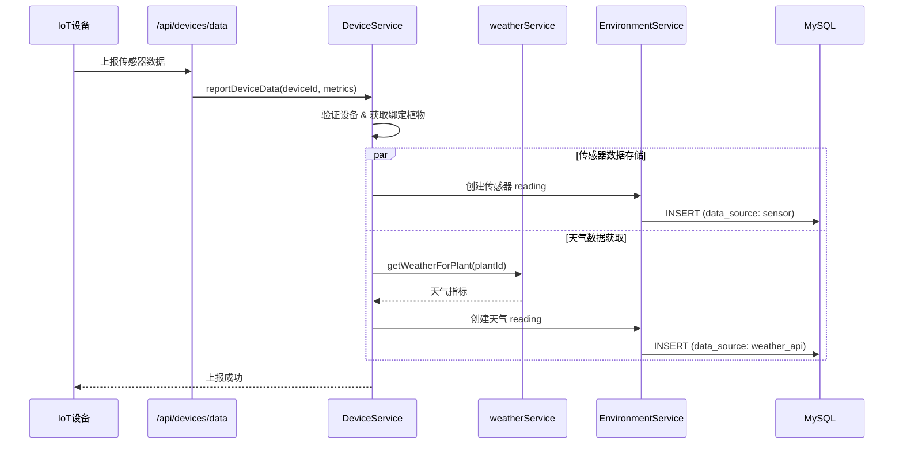
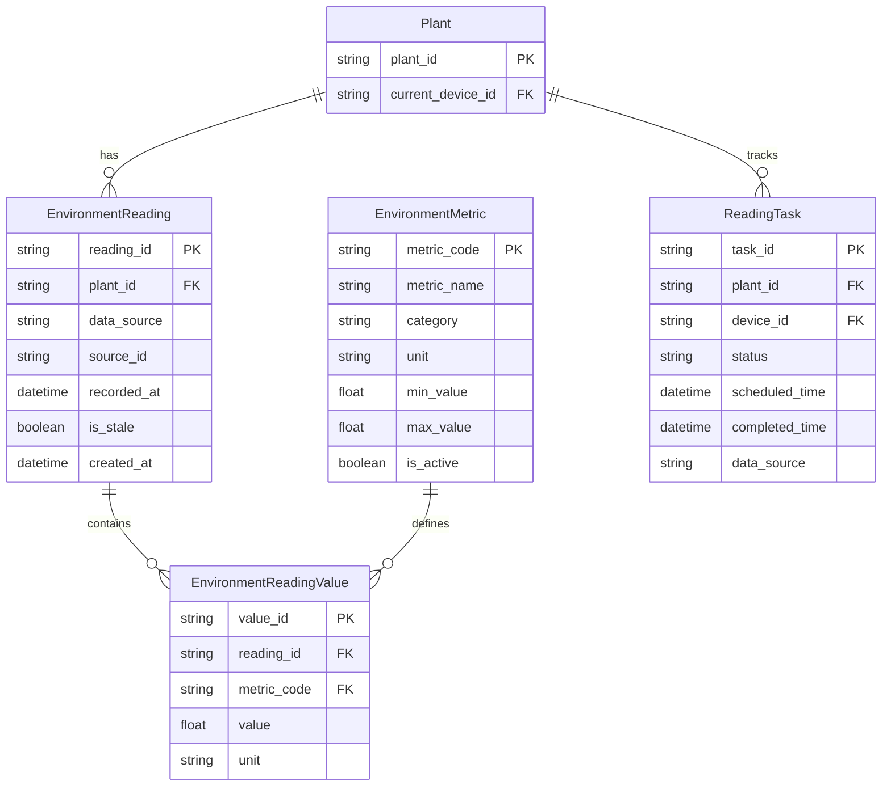
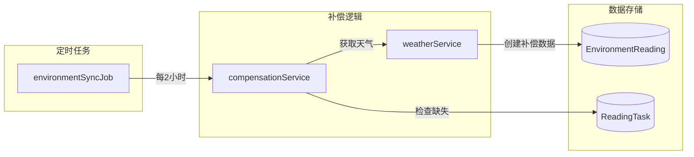
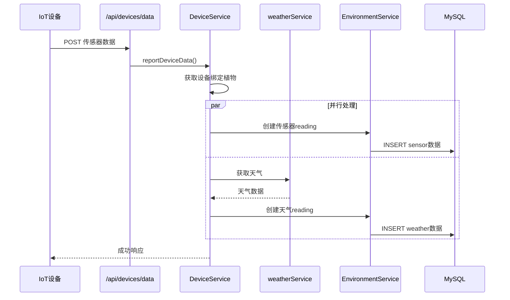
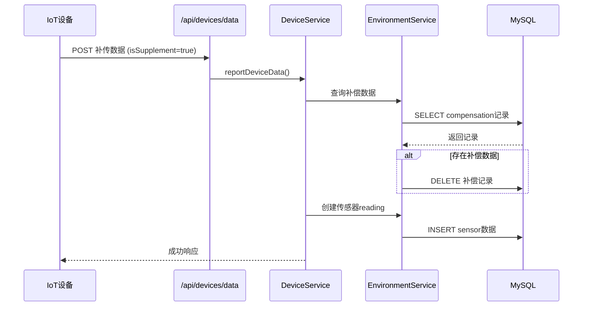
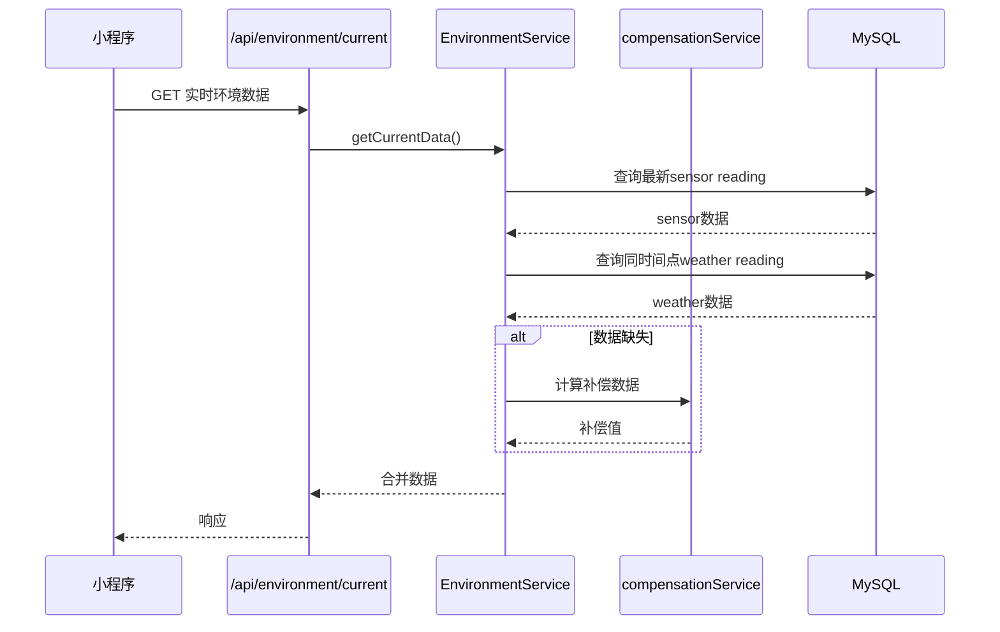

# 环境数据系统架构图

## 元信息
- **文档类型**: 架构设计
- **版本**: V1.0
- **创建日期**: 2026-04-11
- **状态**: ✅ 已发布

---

## 系统架构概览

```mermaid
graph TB
    subgraph 数据来源
        IOT[IoT设备传感器]
        WEATHER[天气API]
        USER[用户手动录入]
    end

    subgraph 数据采集层
        DEVICE_API[/api/devices/data\n设备认证]
        ENV_API[/api/environment/readings\n统一入口]
    end

    subgraph 数据处理层
        DS[DeviceService]
        ES[EnvironmentService]
        WS[weatherService]
        CS[compensationService]
    end

    subgraph 数据存储层
        ER[(EnvironmentReading)]
        ERV[(EnvironmentReadingValue)]
        EM[(EnvironmentMetric)]
        RT[(ReadingTask)]
    end

    subgraph 数据查询层
        ENV_QUERY[/api/environment/current]
        HIST_QUERY[/api/environment/history]
    end

    subgraph 消费端
        MP[微信小程序]
        JOB[定时任务补偿]
    end

    IOT --> DEVICE_API
    WEATHER --> WS
    USER --> ENV_API
    
    DEVICE_API --> DS
    ENV_API --> ES
    
    DS --> ES
    DS --> WS
    WS --> ER
    ES --> CS
    
    ES --> ER
    ER --> ERV
    EM --> ERV
    ES --> RT
    
    MP --> ENV_QUERY
    MP --> HIST_QUERY
    ENV_QUERY --> ES
    HIST_QUERY --> ES
    
    JOB --> CS
    CS --> ER
```

---

## 核心组件说明

### 1. 数据来源

| 来源 | 数据类型 | 采集方式 | 频率 |
|:---|:---|:---|:---:|
| **IoT设备传感器** | 温度、湿度、土壤湿度、光照 | 自动上报 | 实时/定时 |
| **天气API** | 室外温度、天气状况、紫外线 | API调用 | 每2小时 |
| **用户手动录入** | 任意指标 | 小程序录入 | 按需 |

### 2. 数据采集层

#### 设备数据上报接口

```
POST /api/devices/data
认证: 设备认证 (deviceId)
```

**请求体**：
```json
{
  "deviceId": "DEV_xxx",
  "plantId": "PLANT_xxx",
  "metrics": {
    "temperature": 25.5,
    "humidity": 60,
    "soil_moisture": 45,
    "light": 800
  },
  "timestamp": "2026-04-11T10:00:00Z"
}
```

#### 统一环境数据上报接口

```
POST /api/environment/readings
认证: 设备认证 或 用户认证
```

**支持场景**：
- 设备实时上报
- 设备补传（覆盖补偿数据）
- 用户手动录入

### 3. 数据处理层

#### 服务职责

| 服务 | 职责 | 关键方法 |
|:---|:---|:---|
| **DeviceService** | 设备数据接收、绑定植物、触发天气获取 | `reportDeviceData()` |
| **EnvironmentService** | 环境数据查询、聚合、补偿 | `getCurrentData()`, `getHistoryData()` |
| **weatherService** | 天气API调用、数据转换 | `getWeatherForPlant()` |
| **compensationService** | 缺失数据补偿计算 | `compensateMissingData()` |

#### 数据处理流程



### 4. 数据存储层

#### 数据模型关系



#### 存储设计特点

**不合轴设计**：
- 传感器数据和天气数据使用不同的 `reading_id`
- 通过 `recorded_at` 时间点对齐
- 优势：解耦、容错、支持补传

| 数据类型 | data_source | 写入时机 |
|:---|:---|:---|
| 传感器数据 | `sensor` | 设备上报时 |
| 天气数据 | `weather_api` | 定时任务/设备上报时 |
| 补偿数据 | `compensation` | 查询时动态计算 |

### 5. 数据查询层

#### 实时环境数据查询

```
GET /api/environment/current?plantId=xxx
```

**响应**：
```json
{
  "code": 200,
  "data": {
    "plantId": "PLANT_xxx",
    "recordedAt": "2026-04-11T10:00:00Z",
    "isStale": false,
    "metrics": {
      "temperature": {
        "value": 25.5,
        "unit": "°C",
        "source": "sensor"
      },
      "humidity": {
        "value": 60,
        "unit": "%",
        "source": "sensor"
      },
      "outdoorTemperature": {
        "value": 28,
        "unit": "°C",
        "source": "weather_api"
      }
    }
  }
}
```

#### 历史数据查询

```
GET /api/environment/history?plantId=xxx&startDate=xxx&endDate=xxx&metric=temperature
```

### 6. 定时任务补偿



**补偿流程**：
1. 定时任务每2小时执行
2. 检查 `ReadingTask` 中未完成的记录
3. 调用天气API获取缺失时段数据
4. 创建补偿数据（`data_source: compensation`）
5. 标记任务完成

---

## 数据流向详解

### 场景1：设备实时上报



### 场景2：数据补传



### 场景3：用户查询实时数据



---

## 关键设计决策

### 1. 不合轴存储

| 方案 | 优点 | 缺点 |
|:---|:---|:---|
| **不合轴**（当前） | 解耦、容错、灵活 | 查询时需要合并 |
| 合轴 | 查询简单 | 写入复杂、耦合度高 |

**选择不合轴的原因**：
- 传感器和天气数据来源独立
- 天气API失败不应影响传感器数据
- 支持传感器数据补传覆盖补偿数据

### 2. 数据补偿机制

- 通过 `ReadingTask` 跟踪数据采集任务
- 定时任务检查缺失数据
- 补偿数据标记 `is_stale: true`
- 真实数据上报时覆盖补偿数据

### 3. 数据新鲜度

| 状态 | 说明 | 处理 |
|:---|:---|:---|
| **新鲜** | 1小时内有数据 | 正常显示 |
| **过期** | 超过1小时无数据 | 显示 `is_stale: true` |
| **缺失** | 无数据 | 显示补偿数据或提示 |

---

## 相关文档

- [后端系统架构](./backend-architecture.md)
- [后端通信对象与模块职责](./backend-communication.md)
- [环境数据流程](../05-process/环境数据流程.md)
- [API接口设计](./API接口设计.md)
- [数据库设计](./数据库设计.md)
