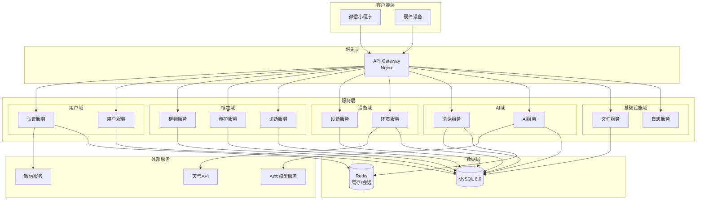
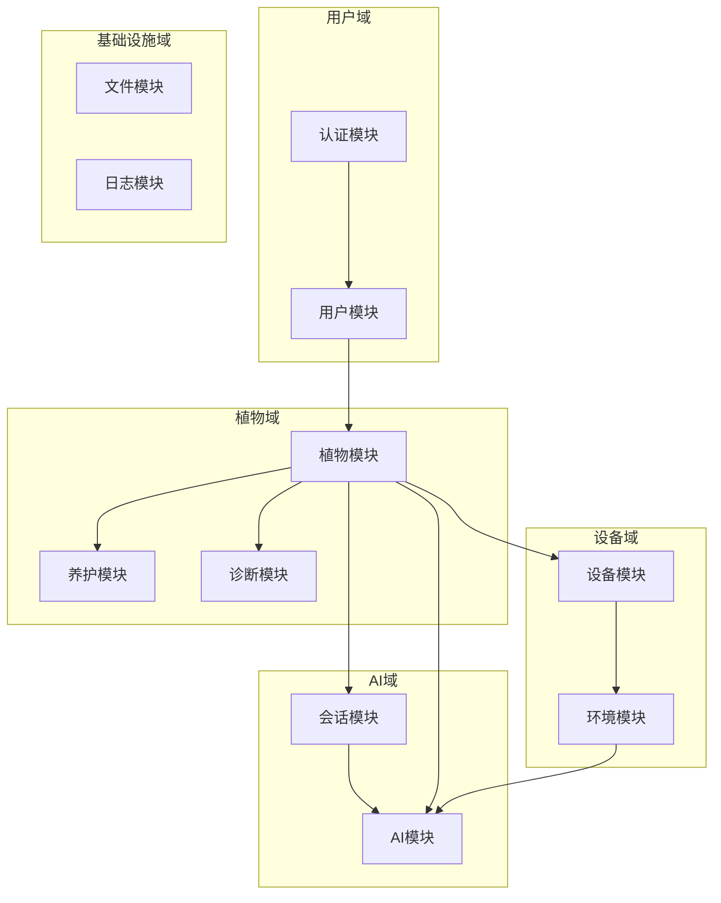
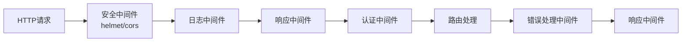
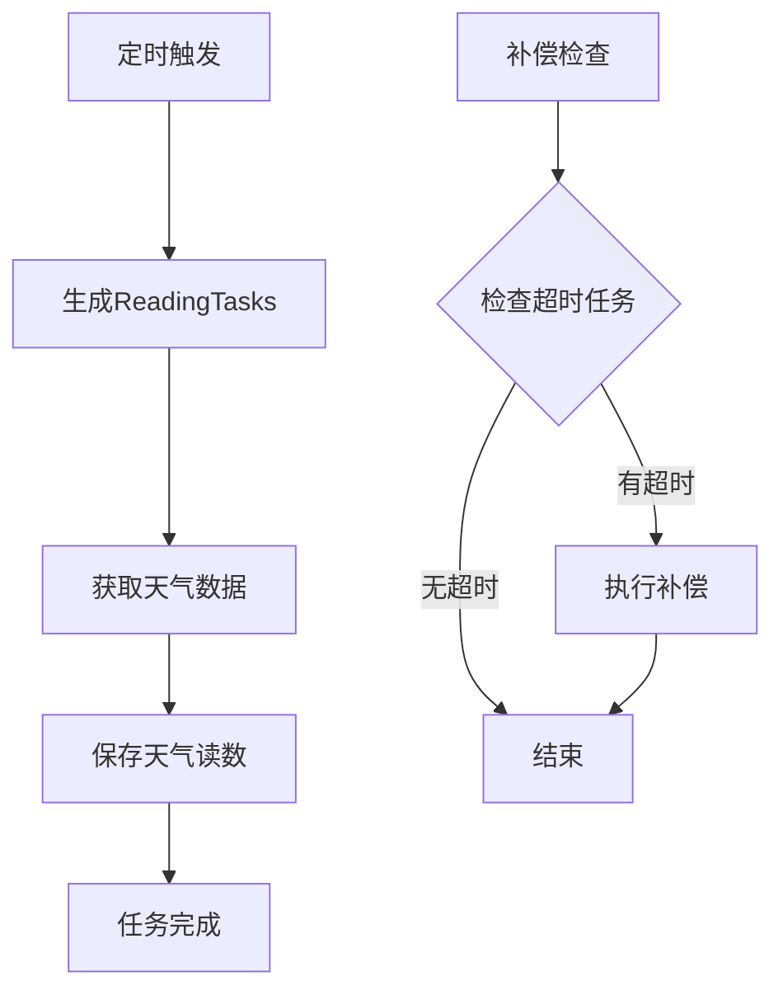
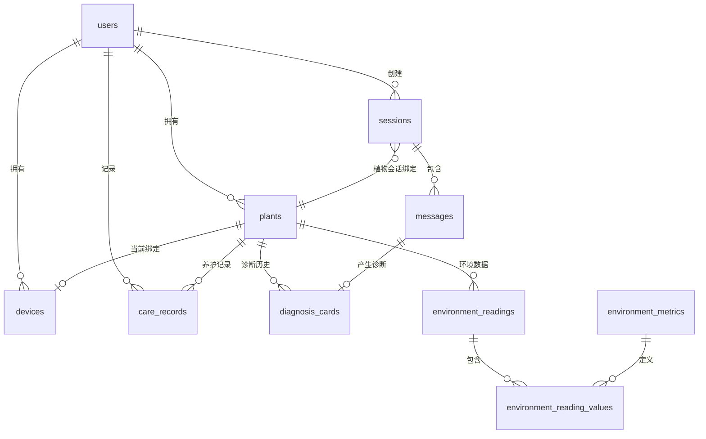
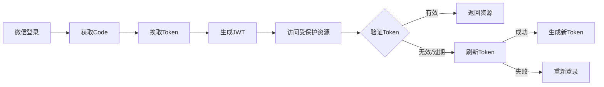
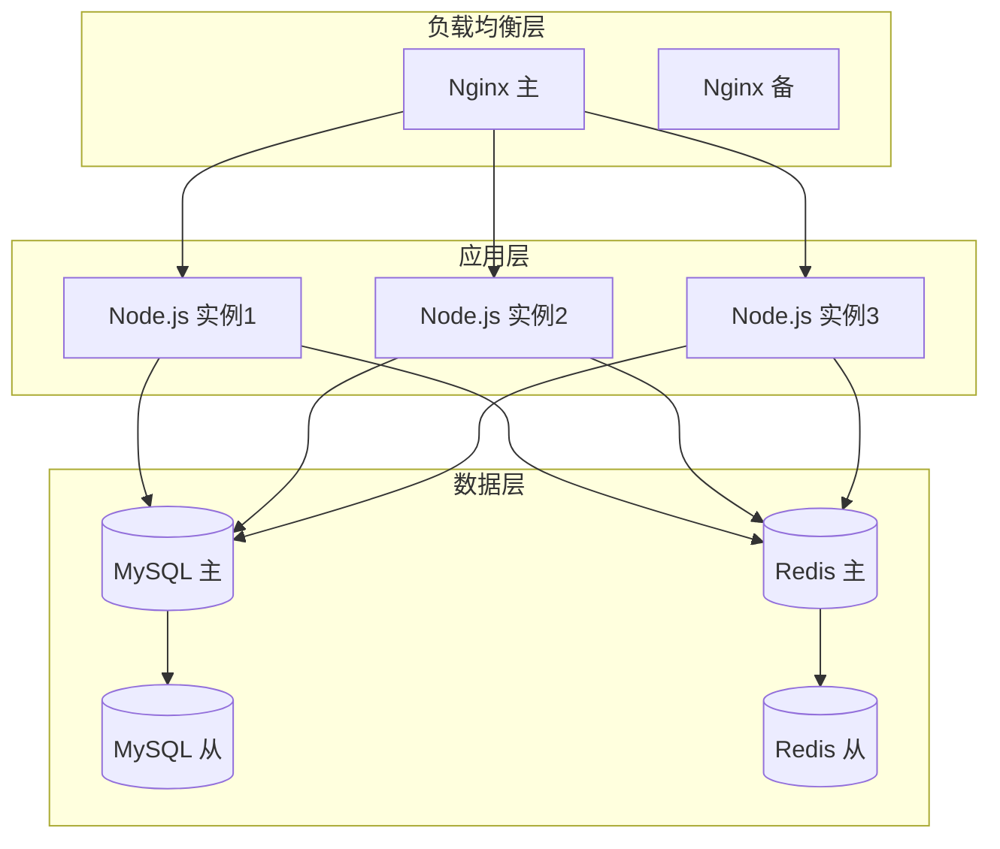

# 智能园艺助手 - 系统架构设计

**角色**: 架构师  
**版本**: V3.0  
**日期**: 2026-04-04

---

## 一、整体架构

### 1.1 系统架构图



### 1.2 架构分层说明

| 层级 | 职责 | 技术组件 |
|:---|:---|:---|
| **客户端层** | 用户交互界面 | 微信小程序原生框架 |
| **网关层** | 请求路由、负载均衡、限流 | Nginx API Gateway |
| **服务层** | 业务逻辑处理 | Node.js + Express |
| **数据层** | 数据持久化、缓存 | MySQL 8.0, Redis |
| **外部服务** | 第三方能力集成 | 微信、AI模型、天气API |

---

## 二、技术栈

### 2.1 客户端技术栈

| 技术 | 版本 | 用途 |
|:---|:---|:---|
| 微信小程序框架 | 基础库 2.30+ | 跨平台应用开发 |
| WXML | - | 页面结构描述 |
| WXSS | - | 样式定义 |
| JavaScript | ES6+ | 业务逻辑 |
| 微信原生API | - | 设备能力调用 |

### 2.2 服务端技术栈

| 技术 | 版本 | 用途 |
|:---|:---|:---|
| Node.js | 18.x LTS | 运行时环境 |
| Express.js | 4.x | Web框架 |
| Sequelize | 6.x | ORM框架 |
| JWT | 9.x | 认证授权 |
| Winston | 3.x | 日志记录 |
| Joi | 17.x | 参数校验 |

### 2.3 数据库技术栈

| 技术 | 版本 | 用途 |
|:---|:---|:---|
| MySQL | 8.0+ | 主数据库 |
| Redis | 7.x | 缓存、会话存储 |

### 2.4 AI与外部服务

| 服务 | 类型 | 用途 |
|:---|:---|:---|
| 视觉模型API | 图像识别 | 植物品种识别、健康诊断 |
| 语言模型API | 自然语言处理 | AI对话、养护建议生成 |
| 微信开放平台 | 第三方服务 | 用户登录、消息推送 |
| 天气API | 数据服务 | 环境数据获取 |

---

## 三、核心模块设计

### 3.1 模块划分



### 3.2 模块职责

| 模块 | 职责 | 核心功能 | 对应路由 |
|:---|:---|:---|:---|
| **认证模块** | 用户身份验证 | 微信登录、Token生成与验证 | `/api/users/login` |
| **用户模块** | 用户数据管理 | 用户信息CRUD、配置管理 | `/api/users` |
| **植物模块** | 植物档案管理 | 植物CRUD、设备绑定 | `/api/plants` |
| **养护模块** | 养护记录管理 | 养护记录CRUD | `/api/care-records` |
| **诊断模块** | 诊断历史管理 | 诊断记录查询 | `/api/diagnosis` |
| **设备模块** | 硬件设备管理 | 设备绑定、状态监控 | `/api/devices` |
| **环境模块** | 环境数据管理 | 数据上报、历史查询、补偿机制 | `/api/environment` |
| **会话模块** | 对话管理 | 会话创建、消息存储、上下文管理 | `/api/sessions` |
| **AI模块** | 智能分析 | Prompt组装、AI调用、结果解析 | `/api/ai` |
| **文件模块** | 文件存储管理 | 上传、访问链接、删除 | `/api/files` |
| **日志模块** | 系统日志管理 | 日志查询、清理 | `/api/logs` |

### 3.3 模块间依赖关系

```
用户域
├── 认证模块
│   └── 用户模块
│
├── 植物域
│   ├── 植物模块 ←── 用户模块
│   │   ├── 养护模块
│   │   ├── 诊断模块
│   │   └── 设备模块
│   │       └── 环境模块
│   │
│   └── AI域
│       ├── 会话模块 ←── 植物模块
│       │   └── AI模块 ←── 环境模块
│       └── AI模块 ←── 植物模块
│
└── 基础设施域
    ├── 文件模块（被所有模块依赖）
    └── 日志模块（被所有模块依赖）
```

### 3.4 模块边界定义

#### 3.4.1 设备模块 vs 环境模块

| 维度 | 设备模块 | 环境模块 |
|:---|:---|:---|
| **职责** | 设备生命周期管理 | 环境数据采集与存储 |
| **数据** | Device 表 | EnvironmentReading, ReadingTask 表 |
| **API** | 绑定、解绑、状态查询 | 数据上报、历史查询 |
| **调用者** | 用户（小程序） | 设备（硬件）、用户（补传） |

**边界规则**：
- 设备模块负责"设备是谁的、绑定到哪个植物"
- 环境模块负责"采集了什么数据、数据是否有效"
- 设备上报数据时，设备模块验证设备身份，环境模块处理数据存储

#### 3.4.2 文件模块统一入口

| 现有接口 | 统一后接口 | 说明 |
|:---|:---|:---|
| `/api/upload` | `/api/files` | 本地上传 |
| `/api/upload/multiple` | `/api/files` (支持多文件) | 合并到同一接口 |
| `/api/storage/upload` | `/api/files/upload-url` | 获取云存储上传链接 |
| `/api/cos/upload-sign` | `/api/files/sign` | 获取上传签名 |
| `/api/cos/temp-url` | `/api/files/:id/url` | 获取访问链接 |
| `/api/cos/delete` | `/api/files/:id` (DELETE) | RESTful 风格 |

#### 3.4.3 环境数据上报统一入口

| 场景 | 认证方式 | 接口 | 说明 |
|:---|:---|:---|:---|
| 设备实时上报 | 设备认证 | `POST /api/environment/readings` | 自动创建 ReadingTask |
| 设备补传 | 设备认证 | `POST /api/environment/readings?supplement=true` | 覆盖补偿数据 |
| 用户手动录入 | 用户认证 | `POST /api/environment/readings` | 手动补录 |

### 3.5 服务层设计

为解决控制器过重问题，引入 Service 层：

```
┌─────────────────────────────────────────────────────────┐
│                    Controller 层                         │
│  职责：参数校验、认证检查、响应格式化                       │
└─────────────────────────────────────────────────────────┘
                          ↓
┌─────────────────────────────────────────────────────────┐
│                     Service 层                           │
│  职责：业务逻辑、事务管理、跨模块协调                       │
│                                                          │
│  ├── aiService          AI调用、Prompt组装               │
│  ├── weatherService     天气数据获取                      │
│  ├── compensationService 环境数据补偿                     │
│  ├── plantService       植物业务逻辑（待抽取）             │
│  └── sessionService     会话业务逻辑（待抽取）             │
└─────────────────────────────────────────────────────────┘
                          ↓
┌─────────────────────────────────────────────────────────┐
│                     Model 层                             │
│  职责：数据访问、关联定义                                  │
└─────────────────────────────────────────────────────────┘
```

---

## 四、业务流程设计

> **详细业务流程文档已独立维护**，请参阅 [业务流程/](./业务流程/README.md) 目录。

### 4.1 流程索引

| 流程名称 | 文档位置 | 说明 |
|:---|:---|:---|
| 用户管理流程 | [01-用户管理流程.md](./业务流程/01-用户管理流程.md) | 登录、游客登录、会话升级 |
| 植物管理流程 | [02-植物管理流程.md](./业务流程/02-植物管理流程.md) | 创建、更新、删除植物 |
| 设备管理流程 | [03-设备管理流程.md](./业务流程/03-设备管理流程.md) | 绑定、解绑、配置设备 |
| 环境数据流程 | [04-环境数据流程.md](./业务流程/04-环境数据流程.md) | 数据上报、补偿机制、补传覆盖 |
| AI交互流程 | [05-AI交互流程.md](./业务流程/05-AI交互流程.md) | 会话创建、消息处理、诊断触发 |

---

## 五、基础设施与中间件设计

### 5.1 中间件架构



#### 5.1.1 安全中间件

| 中间件 | 用途 | 配置 |
|:---|:---|:---|
| helmet | HTTP安全头 | crossOriginResourcePolicy, contentSecurityPolicy |
| cors | 跨域支持 | 允许小程序域名 |
| compression | 响应压缩 | gzip压缩 |

#### 5.1.2 日志中间件

**功能**：
- 记录所有请求信息（方法、路径、IP、User-Agent）
- 敏感信息过滤（password, token, secret, authorization, code, openid）
- 请求体日志（过滤后的安全数据）

**实现**：`app.js` 中的请求日志中间件

#### 5.1.3 响应格式中间件

**功能**：统一API响应格式

```javascript
// 为 res 对象添加方法
res.success(data, message, code)  // 成功响应
res.error(message, code, statusCode)  // 错误响应
```

**响应格式**：
```json
{
  "code": 200,
  "message": "success",
  "data": { ... }
}
```

#### 5.1.4 认证中间件

| 中间件 | 用途 | 位置 |
|:---|:---|:---|
| authMiddleware | JWT Token验证 | middleware/auth.js |
| deviceAuthMiddleware | 设备认证 | middleware/deviceAuth.js |

#### 5.1.5 错误处理中间件

**功能**：
- 统一错误捕获
- 异步错误处理（asyncHandler）
- 错误日志记录
- 客户端友好错误消息

### 5.2 环境变量管理

#### 5.2.1 必需环境变量

| 变量名 | 说明 | 使用场景 |
|:---|:---|:---|
| DB_HOST | 数据库主机 | 数据库连接 |
| DB_NAME | 数据库名 | 数据库连接 |
| DB_USER | 数据库用户 | 数据库连接 |
| DB_PASSWORD | 数据库密码 | 数据库连接 |
| JWT_SECRET | JWT密钥 | Token签名 |

#### 5.2.2 可选环境变量

| 变量名 | 说明 | 默认值 |
|:---|:---|:---|
| WECHAT_APPID | 微信小程序AppID | - |
| WECHAT_SECRET | 微信小程序Secret | - |
| DB_PORT | 数据库端口 | 3306 |
| DB_DIALECT | 数据库类型 | mysql |
| DB_SSL | 启用SSL | false |
| DB_LOGGING | SQL日志 | false |
| UPLOAD_PATH | 上传文件路径 | ../uploads/ |
| MAX_FILE_SIZE | 最大文件大小 | 5MB |

#### 5.2.3 环境校验

**启动时自动校验**：`utils/envValidator.js`
- 生产环境：缺少必需变量则终止启动
- 开发环境：警告但不终止

### 5.3 定时任务

#### 5.3.1 环境数据同步任务

**任务文件**：`jobs/environmentSyncJob.js`

**执行周期**：
| 任务 | 周期 | 说明 |
|:---|:---|:---|
| 主同步任务 | 每2小时 | 生成reading_tasks，获取天气数据 |
| 补偿检查任务 | 每10分钟 | 检查超时任务并执行补偿 |

**任务流程**：


**配置参数**：`config/environment.js`
```javascript
{
  SYNC_INTERVAL: 2小时,
  TOLERANCE_PERIOD: 5分钟,
  DATA_SOURCE: { SENSOR, WEATHER_API },
  TASK_STATUS: { PENDING, RECEIVED, COMPENSATED, FAILED }
}
```

#### 5.3.2 任务状态管理

| 状态 | 说明 |
|:---|:---|
| PENDING | 等待数据 |
| RECEIVED | 已收到真实数据 |
| COMPENSATED | 已使用补偿数据 |
| FAILED | 获取失败 |

### 5.4 服务层设计

#### 5.4.1 服务层架构

```
services/
├── BaseService.js          # 基础服务类
├── UserService.js          # 用户服务
├── PlantService.js         # 植物服务
├── SessionService.js       # 会话服务
├── DeviceService.js        # 设备服务
├── CareRecordService.js    # 养护记录服务
├── EnvironmentService.js   # 环境数据服务
├── compensationService.js  # 补偿服务
├── weatherService.js       # 天气服务
└── aiService.js            # AI服务
```

#### 5.4.2 补偿服务

**功能**：处理传感器数据缺失时的补偿逻辑

**核心方法**：
| 方法 | 说明 |
|:---|:---|
| checkAndCompensateAll() | 扫描所有超时任务并补偿 |
| compensateSensorReading(task) | 对单个任务执行补偿 |
| createWeatherReading() | 创建天气数据读数 |

**补偿逻辑**：
1. 扫描超时的PENDING任务（超过容忍期）
2. 查找该植物最近一次真实传感器数据
3. 复制历史数据作为补偿数据（标记is_stale=true）
4. 更新任务状态为COMPENSATED

---

## 六、数据存储设计

### 5.1 数据库架构



### 5.2 缓存策略

| 数据类型 | 缓存策略 | 过期时间 | 说明 |
|:---|:---|:---:|:---|
| 用户会话Token | Redis | 7天 | JWT Token存储 |
| 用户信息 | Redis | 1小时 | 频繁访问的用户数据 |
| 植物列表 | Redis | 5分钟 | 用户植物列表 |
| 会话消息 | Redis | 10分钟 | 最近会话消息 |
| 环境数据 | Redis | 2分钟 | 实时环境数据 |
| AI响应 | Redis | 1小时 | 相同请求复用 |

### 5.3 数据分片与归档

**当前MVP阶段**：
- 单库单表设计，满足初期数据量
- 定期归档历史数据（6个月前的诊断记录）

**未来扩展**：
- 按user_id分片，支持水平扩展
- 诊断历史数据按时间分区
- 环境数据使用时序数据库（如InfluxDB）

---

## 六、安全设计

### 6.1 认证授权



**认证流程**：
1. 小程序调用 `wx.login()` 获取临时 code
2. 服务端用 code 换取微信 openid 和 session_key
3. 服务端生成 JWT Token 返回给客户端
4. 客户端后续请求携带 Token
5. 服务端验证 Token 有效性

### 6.2 数据加密

| 数据类型 | 加密方式 | 说明 |
|:---|:---|:---|
| 传输数据 | HTTPS/TLS 1.3 | 全站HTTPS加密 |
| 敏感字段 | AES-256 | 手机号、地址等 |
| 密码 | bcrypt | 用户密码哈希存储 |
| 数据库连接 | SSL | 数据库连接加密 |

### 6.3 接口安全

| 安全措施 | 实现方式 |
|:---|:---|
| 请求签名 | HMAC-SHA256，防篡改 |
| 频率限制 | 单IP 100次/分钟 |
| 参数校验 | Joi Schema验证 |
| SQL注入防护 | Sequelize ORM参数化查询 |
| XSS防护 | 输入过滤、输出转义 |

---

## 七、部署架构

### 7.1 开发环境

```
开发者本地
    ├── 微信小程序开发者工具
    ├── Node.js 本地服务
    ├── MySQL 本地实例
    └── Redis 本地实例
```

### 7.2 测试环境

```
测试服务器（1台）
    ├── Nginx (反向代理)
    ├── Node.js App (PM2管理)
    ├── MySQL 8.0
    └── Redis 7.x
```

### 7.3 生产环境（MVP）

```
生产服务器（1台）
    ├── Nginx (负载均衡 + 静态资源)
    ├── Node.js App x2 (PM2集群)
    ├── MySQL 8.0 (主从复制)
    └── Redis 7.x (主从 + 持久化)
```

### 7.4 生产环境（扩展）



---

## 八、监控与运维

### 8.1 日志管理

| 日志类型 | 存储位置 | 保留时间 |
|:---|:---|:---:|
| 应用日志 | 本地文件 + ELK | 30天 |
| 访问日志 | Nginx日志 | 7天 |
| 错误日志 | Sentry | 90天 |
| 数据库日志 | MySQL Binlog | 7天 |

### 8.2 监控指标

| 指标类型 | 监控项 | 告警阈值 |
|:---|:---|:---:|
| 系统资源 | CPU、内存、磁盘 | >80% |
| 应用性能 | QPS、响应时间、错误率 | 响应时间>500ms |
| 数据库 | 连接数、慢查询 | 连接数>80% |
| 业务指标 | 日活、消息量、诊断量 | 异常波动 |

### 8.3 备份策略

| 数据类型 | 备份方式 | 频率 |
|:---|:---|:---:|
| 数据库全量 | mysqldump | 每日凌晨 |
| 数据库增量 | binlog | 实时 |
| 配置文件 | Git版本控制 | 每次变更 |
| 用户上传图片 | 对象存储多副本 | 实时 |

---

## 九、扩展性设计

### 9.1 水平扩展

| 层级 | 扩展方式 |
|:---|:---|
| 应用层 | Node.js多进程 + Nginx负载均衡 |
| 数据库层 | 读写分离 + 分库分表 |
| 缓存层 | Redis Cluster |
| 文件存储 | 对象存储（OSS/COS）|

### 9.2 微服务拆分（未来）

当业务规模扩大时，可拆分为：
- 用户服务（User Service）
- 植物服务（Plant Service）
- 会话服务（Session Service）
- 设备服务（Device Service）
- AI服务（AI Service）
- 通知服务（Notification Service）

---

## 十、技术选型说明

### 10.1 为什么选择微信小程序？

| 优势 | 说明 |
|:---|:---|
| 用户触达 | 无需下载，即用即走 |
| 开发成本 | 统一框架，一套代码 |
| 生态能力 | 丰富的微信原生API |
| 社交传播 | 便于分享和裂变 |

### 10.2 为什么选择Node.js？

| 优势 | 说明 |
|:---|:---|
| 开发效率 | JavaScript全栈，前后端统一 |
| 性能表现 | 事件驱动，适合I/O密集型 |
| 生态丰富 | npm包管理，社区活跃 |
| 团队技能 | 前端团队可快速上手 |

### 10.3 为什么选择MySQL？

| 优势 | 说明 |
|:---|:---|
| 数据一致性 | ACID事务支持 |
| 成熟稳定 | 广泛应用，文档丰富 |
| 运维简单 | 工具完善，团队熟悉 |
| 成本可控 | 开源免费 |

---

## 十一、实现状态追踪

### 11.1 各模块实现状态

| 模块 | 设计状态 | 实现状态 | 备注 |
|:---|:---:|:---:|:---|
| **用户域** | | | |
| 认证模块 | ✅ | ✅ | JWT认证、微信登录已实现 |
| 用户模块 | ✅ | ✅ | CRUD、配置管理已实现 |
| **植物域** | | | |
| 植物模块 | ✅ | ✅ | 完整CRUD、设备绑定已实现 |
| 养护模块 | ✅ | ✅ | 养护记录CRUD已实现 |
| 诊断模块 | ✅ | ✅ | 诊断历史查询已实现 |
| **设备域** | | | |
| 设备模块 | ✅ | ✅ | 绑定/解绑/状态管理已实现 |
| 环境模块 | ✅ | 🔄 | 数据模型已设计，补偿机制待实现 |
| **AI域** | | | |
| 会话模块 | ✅ | ✅ | 会话管理、消息存储已实现 |
| AI模块 | ✅ | ✅ | Prompt组装、AI调用已实现 |
| **基础设施域** | | | |
| 文件模块 | ✅ | 🔄 | 接口规划中，现有接口待迁移 |
| 日志模块 | ✅ | ✅ | 日志查询接口已实现 |

### 11.2 技术栈实现状态

| 技术组件 | 版本 | 实现状态 | 备注 |
|:---|:---|:---:|:---|
| Node.js | 18.x LTS | ✅ | 运行环境已配置 |
| Express.js | 4.x | ✅ | Web框架已集成 |
| Sequelize | 6.x | ✅ | ORM已配置，所有模型已定义 |
| MySQL | 8.0+ | ✅ | 数据库已部署 |
| Redis | 7.x | 🔄 | 配置完成，缓存策略待完善 |
| JWT | 9.x | ✅ | 认证已实现 |

---

## 十二、变更记录

| 日期 | 版本 | 变更内容 |
|:---|:---:|:---|
| 2026-03-18 | v1.0 | 初始版本，基础框架 |
| 2026-03-22 | v2.0 | 重写架构设计，补充完整内容 |
| 2026-03-22 | v2.0 | 新增系统架构图（Mermaid）|
| 2026-03-22 | v2.0 | 新增技术选型说明 |
| 2026-03-22 | v2.0 | 新增部署架构设计 |
| 2026-03-22 | v2.0 | 新增监控与运维方案 |
| 2026-03-22 | v2.0 | 新增扩展性设计 |
| 2026-04-04 | **v3.0** | **重构模块设计**，补充缺失模块 |
| 2026-04-04 | v3.0 | 新增环境模块、文件模块、日志模块定义 |
| 2026-04-04 | v3.0 | 新增模块边界定义（设备vs环境、文件统一入口） |
| 2026-04-04 | v3.0 | 新增服务层设计，解决控制器过重问题 |
| 2026-04-04 | v3.0 | 按领域重新划分模块（用户域、植物域、设备域、AI域、基础设施域） |
| 2026-04-04 | v3.0 | 新增4.4节"环境数据补偿机制流程"和4.5节"传感器补传覆盖流程" |
| 2026-04-07 | v3.0 | 新增第十一章"实现状态追踪" |

---

**角色**: 架构师  
**审核状态**: 已完成  

**关联文档**:
- [02-数据库设计.md](./02-数据库设计.md)
- [03-API接口设计.md](./03-API接口设计.md)
- [04-业务流程/README.md](./04-业务流程/README.md)
