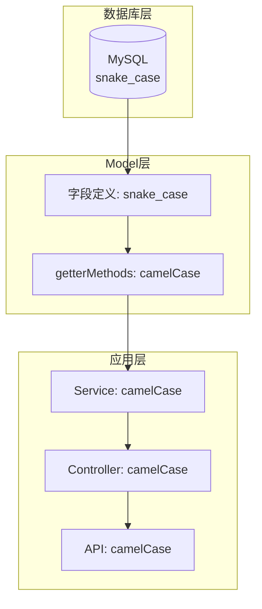

# 命名规范统一重构计划

> **目标**：除了数据库层（Model 字段定义）外，全部使用 camelCase

---

## 一、现状分析

### 1.1 当前命名风格

| 层级 | 当前状态 | 问题 |
|:---|:---|:---|
| **Model** | snake_case 字段定义 | ✅ 正确（数据库层） |
| **Service** | 直接使用 snake_case | ❌ 应使用 camelCase |
| **Controller** | 手动转换 snake_case → camelCase | ❌ 重复代码多 |
| **API 请求/响应** | camelCase | ✅ 正确 |

### 1.2 问题根源

Sequelize Model 返回的是 snake_case 字段，导致：
- Service 层被迫使用 `plant_id`、`user_id` 等
- Controller 层需要大量手动转换代码
- 代码不一致，容易出错

### 1.3 影响范围

| 文件类型 | 文件数量 | 预计修改行数 |
|:---|:---|:---|
| Model | 12 个 | ~200 行 |
| Service | 10 个 | ~300 行 |
| Controller | 12 个 | ~150 行（减少） |
| 测试文件 | 15 个 | ~100 行 |

---

## 二、重构策略

### 2.1 核心方案：Model 层 getterMethods

在 Sequelize Model 中定义 `getterMethods`，自动将字段转为 camelCase：

```javascript
// Model 定义示例
{
  user_id: {
    type: DataTypes.STRING,
    primaryKey: true,
  },
  // ... 其他字段定义保持 snake_case
  
  // 添加 getterMethods
  getterMethods: {
    userId() { return this.getDataValue('user_id'); },
    nickname() { return this.getDataValue('nickname'); },
    avatarUrl() { return this.getDataValue('avatar_url'); },
    createdAt() { return this.getDataValue('created_at'); },
    updatedAt() { return this.getDataValue('updated_at'); },
  },
}
```

### 2.2 数据流转换



### 2.3 命名规范对照表

| 数据库字段 (snake_case) | Model getter (camelCase) | 说明 |
|:---|:---|:---|
| user_id | userId | 用户ID |
| plant_id | plantId | 植物ID |
| session_id | sessionId | 会话ID |
| device_id | deviceId | 设备ID |
| message_id | messageId | 消息ID |
| plant_category | plantCategory | 植物分类 |
| cover_image_url | coverImageUrl | 封面图片URL |
| current_device_id | currentDeviceId | 当前设备ID |
| location_name | locationName | 位置名称 |
| created_at | createdAt | 创建时间 |
| updated_at | updatedAt | 更新时间 |

---

## 三、执行步骤

### 阶段一：更新 Model 层（添加 getterMethods）

- [ ] 1.1 创建 Model getterMethods 工具函数
- [ ] 1.2 更新 `User.js` - 添加 getterMethods
- [ ] 1.3 更新 `Plant.js` - 添加 getterMethods
- [ ] 1.4 更新 `Session.js` - 添加 getterMethods
- [ ] 1.5 更新 `Device.js` - 添加 getterMethods
- [ ] 1.6 更新 `Message.js` - 添加 getterMethods
- [ ] 1.7 更新 `CareRecord.js` - 添加 getterMethods
- [ ] 1.8 更新 `DiagnosisCard.js` - 添加 getterMethods
- [ ] 1.9 更新 `EnvironmentReading.js` - 添加 getterMethods
- [ ] 1.10 更新 `EnvironmentReadingValue.js` - 添加 getterMethods
- [ ] 1.11 更新 `UserConfig.js` - 添加 getterMethods
- [ ] 1.12 更新 `ReadingTask.js` - 添加 getterMethods
- [ ] 1.13 更新 `EnvironmentMetric.js` - 添加 getterMethods

### 阶段二：更新 Service 层（使用 camelCase）

- [ ] 2.1 更新 `UserService.js` - 使用 camelCase
- [ ] 2.2 更新 `PlantService.js` - 使用 camelCase
- [ ] 2.3 更新 `SessionService.js` - 使用 camelCase
- [ ] 2.4 更新 `DeviceService.js` - 使用 camelCase
- [ ] 2.5 更新 `CareRecordService.js` - 使用 camelCase
- [ ] 2.6 更新 `EnvironmentService.js` - 使用 camelCase
- [ ] 2.7 更新 `aiService.js` - 使用 camelCase
- [ ] 2.8 更新 `compensationService.js` - 使用 camelCase
- [ ] 2.9 更新 `weatherService.js` - 使用 camelCase
- [ ] 2.10 更新 `BaseService.js` - 使用 camelCase

### 阶段三：简化 Controller 层

- [ ] 3.1 移除 Controller 中的手动字段转换代码
- [ ] 3.2 更新 `userController.js`
- [ ] 3.3 更新 `plantController.js`
- [ ] 3.4 更新 `sessionController.js`
- [ ] 3.5 更新 `deviceController.js`
- [ ] 3.6 更新 `careRecordController.js`
- [ ] 3.7 更新 `diagnosisController.js`
- [ ] 3.8 更新 `environmentController.js`
- [ ] 3.9 更新 `aiController.js`

### 阶段四：更新测试文件

- [ ] 4.1 更新测试数据工厂 `test-data.js`
- [ ] 4.2 更新单元测试文件
- [ ] 4.3 更新集成测试文件

### 阶段五：验证与清理

- [ ] 5.1 运行所有单元测试
- [ ] 5.2 运行所有集成测试
- [ ] 5.3 运行 E2E 测试
- [ ] 5.4 代码审查
- [ ] 5.5 更新文档

---

## 四、Model getterMethods 模板

### 4.1 通用 getterMethods 工具函数

```javascript
// src/models/helpers/getterMethods.js

function createGetterMethods(fieldMappings) {
  const getters = {};
  for (const [camelKey, snakeKey] of Object.entries(fieldMappings)) {
    getters[camelKey] = function() {
      return this.getDataValue(snakeKey);
    };
  }
  return getters;
}

module.exports = { createGetterMethods };
```

### 4.2 User Model 示例

```javascript
// src/models/User.js
module.exports = (sequelize, DataTypes) => {
  const User = sequelize.define('User', {
    user_id: {
      type: DataTypes.STRING(32),
      primaryKey: true,
    },
    wx_openid: {
      type: DataTypes.STRING(64),
      allowNull: false,
      unique: true,
    },
    nickname: {
      type: DataTypes.STRING(50),
      defaultValue: '植物爱好者',
    },
    avatar_url: {
      type: DataTypes.STRING(512),
      allowNull: true,
    },
    role: {
      type: DataTypes.ENUM('user', 'expert', 'admin'),
      defaultValue: 'user',
    },
    status: {
      type: DataTypes.ENUM('active', 'inactive', 'banned'),
      defaultValue: 'active',
    },
    last_login_at: {
      type: DataTypes.DATE,
      allowNull: true,
    },
  }, {
    tableName: 'users',
    timestamps: true,
    underscored: true,
    
    // 添加 getterMethods
    getterMethods: {
      userId() { return this.getDataValue('user_id'); },
      wxOpenid() { return this.getDataValue('wx_openid'); },
      avatarUrl() { return this.getDataValue('avatar_url'); },
      lastLoginAt() { return this.getDataValue('last_login_at'); },
      createdAt() { return this.getDataValue('created_at'); },
      updatedAt() { return this.getDataValue('updated_at'); },
    },
  });

  // 关联定义保持不变
  User.associate = (models) => {
    User.hasMany(models.Plant, { foreignKey: 'user_id', as: 'plants' });
    User.hasMany(models.Session, { foreignKey: 'user_id', as: 'sessions' });
    User.hasMany(models.Device, { foreignKey: 'user_id', as: 'devices' });
  };

  return User;
};
```

---

## 五、Service 层修改示例

### 5.1 修改前（当前代码）

```javascript
// PlantService.js - 当前代码
async getPlantById(plantId, userId = null) {
  const where = { plant_id: plantId };  // ❌ snake_case
  if (userId) {
    where.user_id = userId;  // ❌ snake_case
  }
  const plant = await this.findOne(where);
  return plant;
}
```

### 5.2 修改后

```javascript
// PlantService.js - 重构后
async getPlantById(plantId, userId = null) {
  const where = { plantId };  // ✅ camelCase
  if (userId) {
    where.userId = userId;  // ✅ camelCase
  }
  const plant = await this.findOne(where);
  return plant;
}
```

**注意**：由于 Model 有 getterMethods，可以直接使用 `plant.plantId` 而非 `plant.plant_id`。

---

## 六、Controller 层简化示例

### 6.1 修改前（当前代码）

```javascript
// plantController.js - 当前代码
const formattedPlants = plants.map((plant) => {
  const plain = plant.get({ plain: true });
  return {
    plantId: plain.plant_id,           // 手动转换
    nickname: plain.nickname,
    species: plain.species || '',
    plantCategory: plain.plant_category,  // 手动转换
    coverImageUrl: plain.cover_image_url, // 手动转换
    currentDeviceId: plain.current_device_id, // 手动转换
    createdAt: plain.created_at,       // 手动转换
  };
});
```

### 6.2 修改后

```javascript
// plantController.js - 重构后
const formattedPlants = plants.map((plant) => {
  const plain = plant.get({ plain: true });
  return {
    plantId: plain.plantId,           // ✅ 直接使用
    nickname: plain.nickname,
    species: plain.species || '',
    plantCategory: plain.plantCategory,   // ✅ 直接使用
    coverImageUrl: plain.coverImageUrl,   // ✅ 直接使用
    currentDeviceId: plain.currentDeviceId, // ✅ 直接使用
    createdAt: plain.createdAt,           // ✅ 直接使用
  };
});
```

---

## 七、风险与应对

| 风险 | 影响 | 应对措施 |
|:---|:---|:---|
| Model getterMethods 性能 | 低 | getterMethods 是 Sequelize 内置功能，性能影响可忽略 |
| 遗漏字段转换 | 中 | 使用测试覆盖验证所有字段 |
| 关联查询字段名 | 中 | 更新 include 中的 as 别名 |
| 第三方库兼容性 | 低 | 仅影响内部代码，API 接口不变 |

---

## 八、预期成果

### 8.1 代码一致性

```
✅ Model 定义：snake_case（数据库层）
✅ Model getter：camelCase（应用层访问）
✅ Service 层：camelCase
✅ Controller 层：camelCase
✅ API 层：camelCase
```

### 8.2 代码减少

- Controller 层减少约 150 行手动转换代码
- 提高代码可读性和维护性

### 8.3 测试覆盖

- 单元测试：全部通过
- 集成测试：全部通过
- E2E 测试：全部通过

---

## 九、时间估算

| 阶段 | 预计时间 |
|:---|:---|
| 阶段一：Model 层 | 45 分钟 |
| 阶段二：Service 层 | 60 分钟 |
| 阶段三：Controller 层 | 30 分钟 |
| 阶段四：测试文件 | 30 分钟 |
| 阶段五：验证清理 | 15 分钟 |
| **总计** | **约 3 小时** |
