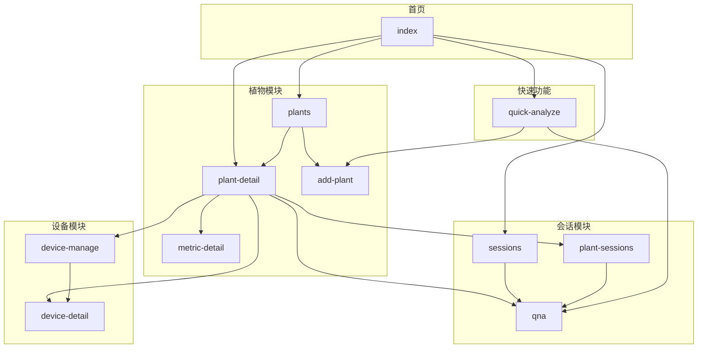
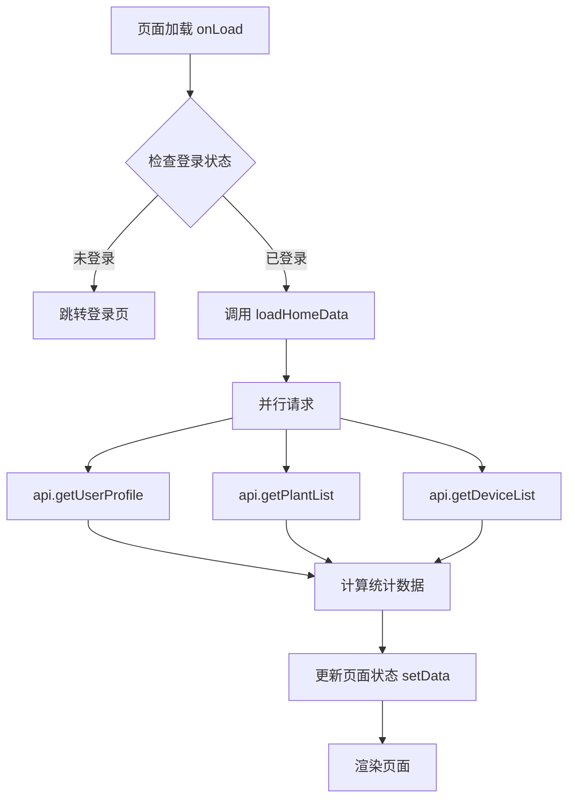
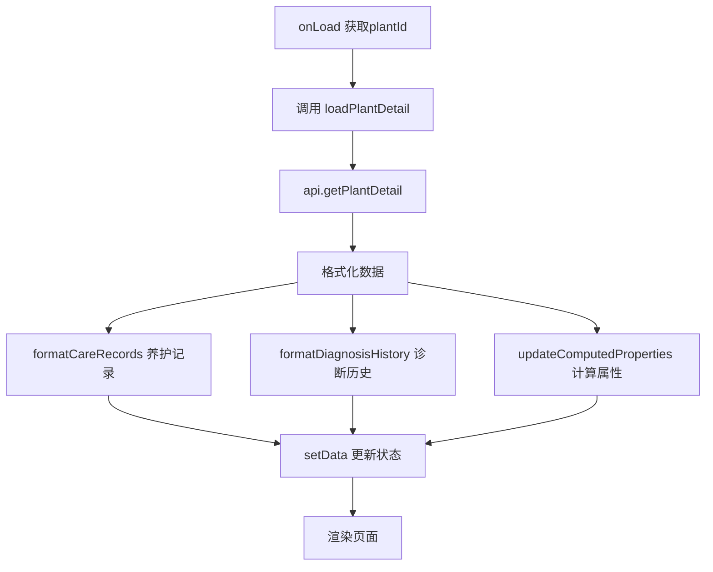
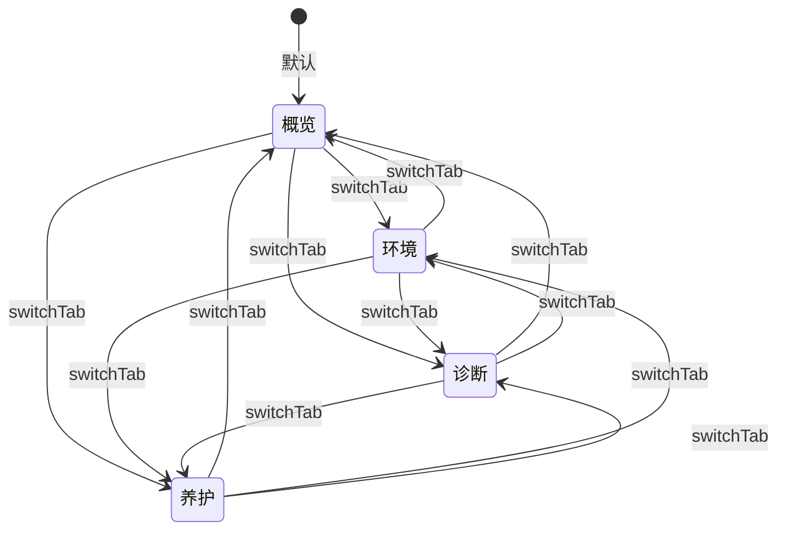
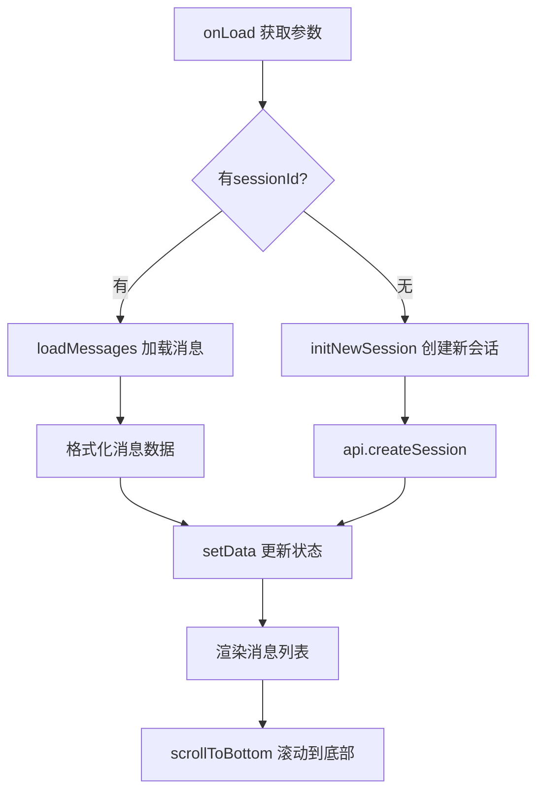
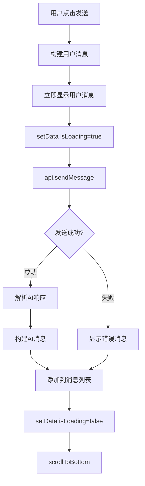
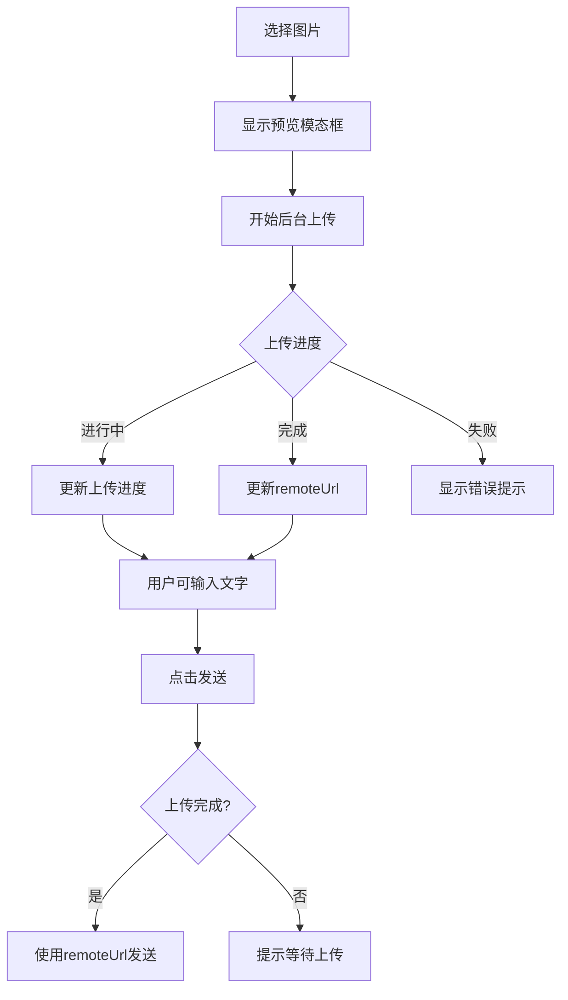

# 智能园艺助手 - 前端页面设计

**角色**: 前端开发  
**版本**: V3.1  
**日期**: 2026-04-05  
**对齐状态**: 已与实际前端实现对齐

---

## 一、页面结构

### 1.1 页面清单

| 序号 | 页面 | 路径 | 说明 | 主要功能 |
|:---:|:---|:---|:---|:---|
| 1 | 首页 | /pages/index/index | 仪表盘入口 | 健康仪表盘、快捷功能入口 |
| 2 | 登录页 | /pages/login/login | 用户登录 | 微信登录、游客登录 |
| 3 | 植物列表 | /pages/plants/plants | 所有植物 | 植物卡片列表、筛选 |
| 4 | 植物详情 | /pages/plant-detail/plant-detail | 植物档案详情 | 概览/环境/诊断/养护Tab |
| 5 | 指标详情 | /pages/metric-detail/metric-detail | 环境指标趋势 | 温度/湿度等趋势图 |
| 6 | 会话列表 | /pages/sessions/sessions | 所有会话 | 会话列表、新建会话 |
| 7 | 智能问答 | /pages/qna/qna | 聊天界面 | 咨询/植物会话聊天 |
| 8 | 快速分析 | /pages/quick-analyze/quick-analyze | 拍照诊断 | 拍照、分析结果展示 |
| 9 | 添加植物 | /pages/add-plant/add-plant | 创建/编辑植物档案 | 填写植物信息 |
| 10 | 设备管理 | /pages/device-manage/device-manage | 设备列表管理 | 绑定/解绑设备 |
| 11 | 设备详情 | /pages/device-detail/device-detail | 设备信息 | 设备状态、数据 |
| 12 | 植物会话列表 | /pages/plant-sessions/plant-sessions | 植物相关会话 | 某植物的所有会话列表 |

### 1.2 页面跳转关系图



### 1.3 页面参数规范

| 跳转路径 | 参数 | 示例 | 说明 |
|:---|:---|:---|:---|
| 首页 → 植物详情 | plantId | `?id=PLANT_001` | 植物ID |
| 首页 → 咨询会话 | sessionType | `?sessionType=consultation` | 创建咨询会话 |
| 植物详情 → 指标详情 | plantId, metric, source | `?plantId=xxx&metric=temperature&source=device` | 指标详情 |
| 植物详情 → 设备管理 | plantId | `?plantId=xxx` | 设备管理 |
| 植物详情 → 植物会话 | sessionType, plantId | `?sessionType=plant&plantId=xxx` | 进入植物会话 |
| 快速诊断 → 咨询会话 | sessionType, sessionId | `?sessionType=consultation&sessionId=xxx` | 快速诊断后的会话 |
| 会话列表 → 聊天 | sessionId | `?sessionId=xxx` | 进入指定会话 |

---

## 二、首页设计

### 2.1 组件结构

```
pages/index/
├── container (页面容器)
│   ├── header (头部区域)
│   │   ├── header-content
│   │   │   ├── header-top
│   │   │   │   ├── header-left (左侧标题区)
│   │   │   │   │   ├── title (proj-alpha)
│   │   │   │   │   └── header-subtitle (智能植物识别与养护专家)
│   │   │   │   └── header-actions (右侧操作区)
│   │   │   │       ├── action-btn (通知按钮 🔔) [开发中]
│   │   │   │       └── action-btn (设置按钮 ⚙️) [开发中]
│   └── section (内容区域)
│       ├── section-header (区块标题栏)
│       │   ├── section-title (健康仪表盘)
│       │   └── section-action (刷新按钮 🔄)
│       ├── card (健康状态卡片)
│       │   ├── empty-plant (空状态)
│       │   │   ├── empty-icon (🌿)
│       │   │   ├── empty-title (还没有添加植物)
│       │   │   ├── empty-desc (添加植物后可查看健康状态)
│       │   │   └── empty-actions
│       │   │       └── btn-primary (➕ 添加植物)
│       │   └── plant-health (有植物状态)
│       │       ├── health-header
│       │       │   ├── health-title (植物健康状态)
│       │       │   └── health-subtitle (共 X 株植物)
│       │       ├── health-stats (统计区域)
│       │       │   ├── health-stat-item (健康植物)
│       │       │   ├── health-stat-item (需要关注)
│       │       │   └── health-stat-item (待处理任务)
│       │       └── health-actions
│       │           ├── btn-primary (查看所有植物)
│       │           └── btn-secondary (添加新植物)
│       └── core-features (核心功能区)
│           └── primary-card x3 (快速诊断/智能问答/专家咨询[开发中])
```

> **注意**: 以下功能在V3.0版本中尚未实现：
> - 通知按钮（硬编码显示3条）
> - 设置按钮
> - 专家咨询功能
> - 植物卡片列表展示（myPlants数据已加载但未渲染）
> - 养护小贴士区域

### 2.2 页面状态

| 状态名 | 类型 | 初始值 | 说明 |
|:---|:---|:---:|:---|
| welcomeMessage | string | '' | 欢迎语（早上好/下午好 + 用户名） |
| plantCount | number | 0 | 植物总数 |
| healthyCount | number | 0 | 健康植物数 |
| warningCount | number | 0 | 需关注植物数 |
| pendingTasks | number | 0 | 待处理任务数 |
| myPlants | array | [] | 我的植物列表（**注：数据已加载但页面未展示**） |
| dailyTip | object | {icon, title, content} | 今日养护小贴士（**注：数据已加载但页面未展示**） |
| deviceStatus | object | {online, offline, unbound} | 设备状态统计 |
| notificationCount | number | 0 | 通知数量（**注：当前硬编码显示3**） |
| loading | boolean | true | 页面加载状态 |

> **实现说明**: 
> - `myPlants` 数据在 `loadHomeData` 中已加载并格式化，但WXML中未渲染植物卡片列表
> - `dailyTip` 数据已加载但WXML中对应区域被注释掉
> - `notificationCount` 当前硬编码为3，未使用实际数据

### 2.3 数据流向



### 2.4 事件处理

| 事件 | 触发元素 | 处理函数 | 行为 | 跳转目标 |
|:---|:---|:---|:---|:---|
| onLoad | 页面 | initApp | 检查登录，加载数据 | - |
| onShow | 页面 | loadHomeData | 刷新首页数据 | - |
| onPullDownRefresh | 下拉 | loadHomeData | 下拉刷新 | - |
| tap | 查看所有植物 | goToPlants | 跳转植物列表 | /pages/plants/plants |
| tap | 添加植物按钮 | goToAddPlant | 跳转添加植物 | /pages/add-plant/add-plant |
| tap | 植物卡片 | goToPlantDetail | 跳转植物详情 | /pages/plant-detail/plant-detail?id={id} |
| tap | 快速诊断卡片 | goToIdentify | 跳转快速诊断 | /pages/quick-analyze/quick-analyze |
| tap | 智能问答卡片 | goToQna | 跳转会话列表 | /pages/sessions/sessions |
| tap | 专家咨询卡片 | goToExpert | 提示"专家咨询开发中" | - |
| tap | 通知按钮 | goToNotifications | 提示"通知功能开发中"（徽章硬编码为3） | - |
| tap | 设置按钮 | goToSettings | 提示"设置功能开发中" | - |
| tap | 刷新按钮 | refreshDashboard | 刷新数据 | - |

> **实现说明**: 
> - 专家咨询、通知、设置功能当前仅显示Toast提示"开发中"
> - 通知按钮徽章硬编码显示数字3，未绑定实际notificationCount数据

### 2.5 页面布局

**整体布局**：
- 头部区域：固定高度，包含标题和快捷操作
- 内容区域：滚动区域，包含健康仪表盘和核心功能

**健康仪表盘区域**：
```
┌─────────────────────────────────┐
│  健康仪表盘              [🔄刷新]│  ← section-header
├─────────────────────────────────┤
│  ┌─────────────────────────┐   │
│  │  🌿                     │   │
│  │  还没有添加植物          │   │  ← empty-plant
│  │  添加植物后可查看...     │   │
│  │  [➕ 添加植物]          │   │
│  └─────────────────────────┘   │
│  ┌─────────────────────────┐   │
│  │ 植物健康状态    共3株   │   │  ← plant-health
│  │ ┌─────┬─────┬─────┐    │   │
│  │ │  2  │  1  │  3  │    │   │  ← health-stats
│  │ │健康 │关注 │待办 │    │   │
│  │ └─────┴─────┴─────┘    │   │
│  │ [查看所有] [添加新植物] │   │
│  └─────────────────────────┘   │
└─────────────────────────────────┘
```

**核心功能区域**：
```
┌─────────────────────────────────┐
│  📸 快速诊断    [推荐]          │  ← primary-card
│     拍照识别植物问题            │
├─────────────────────────────────┤
│  💬 智能问答                    │  ← primary-card
│     问问proj-alpha               │
├─────────────────────────────────┤
│  👨‍🌾 专家咨询                  │  ← primary-card
│     真人园艺师在线              │
└─────────────────────────────────┘
```

### 2.6 交互细节

**触发方式**: 长按植物卡片（≥500ms）

**菜单选项**:
| 选项 | 图标 | 操作 |
|:---|:---:|:---|
| 编辑 | ✏️ | 跳转编辑页面 |
| 删除 | 🗑️ | 弹出确认对话框 |
| 分享 | ↗️ | 调用微信分享 |
| 取消 | ✕ | 关闭菜单 |

**交互细节**:
- 长按触发时卡片有视觉反馈（缩放0.98）
- 菜单从底部弹出（ActionSheet样式）
- 点击遮罩区域关闭菜单
- 删除操作需二次确认

**事件处理**:
```javascript
// 组件内阻止冒泡
onLongPress(e) {
  e.stopPropagation();
  this.triggerEvent('longpress', { plantId: this.data.plantId });
}

// 页面层校验
onPlantLongPress(e) {
  if (!e.detail || !e.detail.plantId) return;
  // 显示菜单
  wx.showActionSheet({
    itemList: ['编辑', '删除', '分享'],
    success: (res) => {
      switch(res.tapIndex) {
        case 0: // 编辑
          wx.navigateTo({
            url: `/pages/add-plant/add-plant?mode=edit&id=${e.detail.plantId}`
          });
          break;
        case 1: // 删除
          this.confirmDeletePlant(e.detail.plantId);
          break;
        case 2: // 分享
          this.sharePlant(e.detail.plantId);
          break;
      }
    }
  });
}
```

---

## 三、植物详情页设计

### 3.1 组件结构

```
pages/plant-detail/
├── container (页面容器)
│   ├── header-section (植物头部信息区) [实际命名]
│   │   ├── plant-card (植物信息卡片)
│   │   │   ├── card-main-layout (主布局)
│   │   │   │   ├── plant-avatar-large (左侧大图区) [实际命名]
│   │   │   │   │   ├── avatar-image (植物封面图) [实际命名]
│   │   │   │   │   └── avatar-emoji (植物emoji占位) [实际命名]
│   │   │   │   └── card-right-content (右侧内容区) [实际命名]
│   │   │   │       ├── right-top-row (顶部行)
│   │   │   │       │   ├── plant-name-block (植物昵称) [实际命名]
│   │   │   │       │   └── card-actions (卡片操作)
│   │   │   │       │       ├── action-btn-small (编辑按钮) [实际命名]
│   │   │   │       │       └── action-btn-small (分享按钮[开发中]) [实际命名]
│   │   │   │       └── right-bottom-row (底部行)
│   │   │   │           ├── tags-group (标签组) [实际命名]
│   │   │   │           │   ├── species-tag (品种标签) [实际命名]
│   │   │   │           │   ├── health-tag (健康状态标签) [实际命名]
│   │   │   │           │   ├── device-tag (设备状态标签) [实际命名]
│   │   │   │           │   └── days-tag (养护天数标签) [实际命名]
│   │   │   │           └── score-circle-wrapper (健康球包装) [实际命名]
│   │   │   │               └── score-circle (健康评分徽章) [实际命名]
│   │   │   └── quick-actions-row (快捷操作行) [实际命名]
│   │   │       ├── quick-btn (记录养护按钮) [实际命名]
│   │   │       └── quick-btn primary (咨询AI按钮) [实际命名]
│   ├── tab-bar (Tab导航栏)
│   │   └── tab-item x4 (概览/环境/诊断/养护)
│   └── tab-content (Tab内容区)
│       ├── tab-panel (概览Tab) [实际命名]
│       ├── tab-panel (环境Tab) [实际命名]
│       ├── tab-panel (诊断Tab) [实际命名]
│       └── tab-panel (养护Tab) [实际命名]
```

> **命名说明**: 方括号标注为实际代码中的命名，与设计文档原命名略有不同但功能一致

### 3.2 页面状态

| 状态名 | 类型 | 初始值 | 说明 |
|:---|:---|:---:|:---|
| plantId | string | '' | 当前植物ID |
| plantInfo | object | {...} | 植物基本信息 |
| deviceInfo | object | {...} | 设备信息 |
| latestDiagnosis | object | {...} | 最新诊断信息 |
| diagnosisHistory | array | [] | 诊断历史列表 |
| careRecords | array | [] | 养护记录列表 |
| careRecordsPreview | array | [] | 养护记录预览（前3条） |
| currentTab | string | 'overview' | 当前激活的Tab |
| tabs | array | [...] | Tab配置列表 |
| loading | boolean | true | 加载状态 |
| plantEmoji | string | '🌱' | 植物分类emoji |
| healthScore | string/number | '--' | 健康评分显示 |
| healthStatusText | string | '未诊断' | 健康状态文本 |
| deviceStatusText | string | '未绑定设备' | 设备状态文本 |
| **额外状态（实现增强）** | | | |
| envDataSource | string | 'device' | 环境数据来源（device/weather） |
| deviceMetrics | array | [] | 设备指标数据 |
| weatherData | object | null | 天气数据 |
| weatherMetrics | array | [] | 天气指标数据 |
| environmentData | object | {...} | 环境数据对象 |
| showCareEditModal | boolean | false | 养护记录编辑模态框显示状态 |
| showCareActionSheet | boolean | false | 养护记录操作菜单显示状态 |
| editingRecordId | string | '' | 正在编辑的记录ID |
| selectedRecord | object | null | 选中的养护记录 |
| careForm | object | {...} | 养护记录表单数据 |
| actionTypes | array | [...] | 养护操作类型配置 |
| dateTimeRange | array | [] | 日期时间选择器范围 |
| dateTimeIndex | array | [] | 日期时间选择器索引 |
| expandedDiagnosisId | string | '' | 展开的诊断卡片ID |
| healthStatusClass | string | '' | 健康状态样式类 |
| deviceIcon | string | '📱' | 设备图标 |
| deviceStatusClass | string | 'unbound' | 设备状态样式类 |
| joinedDays | number | 0 | 已养护天数（计算属性） |

### 3.3 数据流向



### 3.4 Tab切换状态流转



### 3.5 事件处理

| 事件 | 触发元素 | 处理函数 | 行为 | 跳转目标 |
|:---|:---|:---|:---|:---|
| onLoad | 页面 | onLoad | 获取plantId，加载详情 | - |
| onShow | 页面 | onShow | 刷新植物详情 | - |
| tap | Tab项 | switchTab | 切换Tab | - |
| tap | 记录养护 | addCareRecord | 打开养护记录模态框 | - |
| tap | 咨询AI | consultAI | 跳转植物会话列表 | /pages/plant-sessions/plant-sessions |
| tap | 编辑按钮 | editPlant | 跳转编辑植物 | /pages/add-plant/add-plant?mode=edit |
| tap | 设备管理 | goToDeviceManage | 跳转设备管理 | /pages/device-manage/device-manage |
| tap | 诊断卡片 | toggleDiagnosisDetail | 展开/收起诊断详情 | - |
| longpress | 养护记录 | onCareRecordLongPress | 显示操作菜单 | - |
| **额外事件（实现增强）** | | | | |
| tap | 保存养护记录 | saveCareRecord | 保存养护记录到后端 | - |
| tap | 编辑养护记录 | editCareRecord | 打开编辑模态框 | - |
| tap | 删除养护记录 | deleteCareRecord | 删除养护记录 | - |
| tap | 关闭编辑模态框 | closeCareEditModal | 关闭模态框 | - |
| tap | 选择操作类型 | selectActionType | 选择养护操作类型 | - |
| input | 养护描述输入 | onCareDescInput | 输入养护描述 | - |
| change | 日期时间选择 | onDateTimeChange | 选择执行时间 | - |
| tap | 分享按钮 | sharePlant | 提示"分享功能开发中" | - |
| tap | 设备标签 | goToDeviceDetail | 跳转设备详情 | /pages/device-detail/device-detail |
| tap | 诊断卡片展开 | onDiagnosisCardExpand | 展开/收起诊断详情 | - |
| tap | 诊断卡片操作 | onDiagnosisCardAction | 处理诊断卡片操作（chat/share） | - |

> **实现说明**: 
> - 养护记录完整CRUD功能已实现（创建、编辑、删除）
> - 分享功能当前仅显示Toast提示"开发中"
> - 诊断卡片使用自定义组件diagnosis-card

### 3.6 页面布局

**头部信息区**：
```
┌─────────────────────────────────────┐
│  ← 返回                    编辑 分享 │  ← 导航栏
├──────────────────┬──────────────────┤
│                  │  🌵 小绿          │  ← plantEmoji
│   [植物图片]     │  多肉植物·石莲花   │  ← plant-species
│                  │                  │
│   圆形健康球     │  健康度: 85      │  ← health-score
│   ┌──────┐      │  已养护: 32天    │  ← joined-days
│   │  85  │      │                  │
│   └──────┘      │  [记录养护]      │  ← action-buttons
│                  │  [咨询小园]      │
├──────────────────┴──────────────────┤
│  概览  │  环境  │  诊断  │  养护    │  ← tab-bar
├─────────────────────────────────────┤
│         Tab内容区域                  │  ← tab-content
└─────────────────────────────────────┘
```

**布局规范**:
- 左侧图片区: 宽度40%，固定比例1:1.2
- 右侧信息区: 宽度60%，垂直居中
- 健康球: 直径80rpx，位于图片右下角
- 快捷按钮: 横向排列，间距20rpx

### 3.2 概览Tab

```
┌─────────────────────────────────┐
│  当前状态卡片                     │
│  ┌─────────────────────────┐   │
│  │ 健康状态：良好 ✅        │   │
│  │ 生长阶段：成株期          │   │
│  │ 已养护：120天            │   │
│  └─────────────────────────┘   │
├─────────────────────────────────┤
│  最新诊断                        │
│  ┌─────────────────────────┐   │
│  │ 📅 2026-03-22           │   │
│  │ 健康评分：88分           │   │
│  │ 状态：叶片翠绿，生长良好  │   │
│  │ [查看详情]               │   │
│  └─────────────────────────┘   │
├─────────────────────────────────┤
│  快捷操作                        │
│  [💬 咨询AI] [📊 查看环境]      │
└─────────────────────────────────┘
```

### 3.3 环境Tab

```
┌─────────────────────────────────┐
│  设备状态                        │
│  [设备在线] [电量85%] [换绑]     │
├─────────────────────────────────┤
│  实时环境指标                     │
│  ┌─────────┐ ┌─────────┐       │
│  │ 🌡️ 温度 │ │ 💧 湿度 │       │
│  │  22.5°C │ │   60%   │       │
│  │ [查看]  │ │ [查看]  │       │
│  └─────────┘ └─────────┘       │
│  ┌─────────┐ ┌─────────┐       │
│  │ ☀️ 光照 │ │ 🌱 土壤 │       │
│  │  充足   │ │   28%   │       │
│  │ [查看]  │ │ [查看]  │       │
│  └─────────┘ └─────────┘       │
├─────────────────────────────────┤
│  环境建议                        │
│  • 当前温度适宜，无需调整         │
│  • 土壤湿度正常，3天后浇水        │
└─────────────────────────────────┘
```

**环境指标项组件**：

| 属性 | 类型 | 说明 |
|:---|:---|:---|
| metricCode | string | 指标代码 |
| name | string | 指标名称 |
| value | number | 当前值 |
| unit | string | 单位 |
| status | string | 状态：optimal/warning/critical |
| dataSource | string | 数据来源：sensor/weather_api |
| icon | string | 图标 |

### 3.4 诊断Tab

```
┌─────────────────────────────────┐
│  诊断统计                        │
│  总诊断次数：15次                │
│  平均健康分：85分                │
├─────────────────────────────────┤
│  诊断历史列表                     │
│  ┌─────────────────────────┐   │
│  │ 📅 2026-03-22           │   │
│  │ 🌱 健康评分：88分        │   │
│  │ 💡 建议：适量浇水         │   │
│  └─────────────────────────┘   │
│  ┌─────────────────────────┐   │
│  │ 📅 2026-03-19           │   │
│  │ 🌱 健康评分：85分        │   │
│  │ 💡 建议：增加光照         │   │
│  └─────────────────────────┘   │
├─────────────────────────────────┤
│  [💬 咨询AI获取新诊断]          │
└─────────────────────────────────┘
```

### 3.5 养护Tab

#### 3.5.1 页面结构

```
┌─────────────────────────────────────┐
│  养护统计                            │
│  💧 浇水: 32次  🧪 施肥: 5次        │
├─────────────────────────────────────┤
│  快捷记录                            │
│  [💧 浇水] [🧪 施肥] [✂️ 修剪]      │
│  [🪴 换盆] [🐛 除虫]                │
├─────────────────────────────────────┤
│  养护记录列表                        │
│  ┌─────────────────────────────┐   │
│  │ 💧 浇水          2026-03-22 │   │
│  │ 手动浇水约200ml    [长按]   │   │
│  └─────────────────────────────┘   │
│  ┌─────────────────────────────┐   │
│  │ 🧪 施肥          2026-03-20 │   │
│  │ 施用了通用营养液             │   │
│  └─────────────────────────────┘   │
├─────────────────────────────────────┤
│                              [+]    │  ← 浮动按钮
└─────────────────────────────────────┘
```

#### 3.5.2 养护记录项设计

**展示内容**:
| 元素 | 说明 | 样式 |
|:---|:---|:---|
| 操作图标 | 根据actionType显示 | 字体大小40rpx |
| 操作名称 | 浇水/施肥/修剪/换盆/除虫 | 字体大小28rpx，加粗 |
| 操作时间 | 年月日 | 字体大小24rpx，灰色 |
| 操作描述 | 用户输入的描述 | 字体大小26rpx，最多2行 |
| 长按提示 | 提示可长按操作 | 图标，右侧 |

**交互行为**:
- 点击: 无操作
- 长按: 弹出操作菜单（编辑/删除/取消）

#### 3.5.3 快捷记录区

**操作类型**:
| 类型 | 图标 | 名称 | 默认描述 |
|:---|:---:|:---|:---|
| water | 💧 | 浇水 | 进行了浇水 |
| fertilize | 🧪 | 施肥 | 施用了肥料 |
| prune | ✂️ | 修剪 | 进行了修剪 |
| repot | 🪴 | 换盆 | 更换了花盆 |
| pest_control | 🐛 | 除虫 | 进行了除虫 |

**交互**:
- 点击快捷按钮直接创建记录
- 使用默认描述，用户可在编辑时修改
- 创建成功后显示Toast提示

#### 3.5.4 添加/编辑模态框

**触发方式**:
- 添加: 点击右下角"+"按钮
- 编辑: 长按记录项 → 选择"编辑"

**模态框结构**:
```
┌─────────────────────────┐
│  添加养护记录      [×]  │
├─────────────────────────┤
│  操作类型 *             │
│  ┌───┬───┬───┬───┐     │
│  │💧 │🧪 │✂️ │🪴 │     │
│  └───┴───┴───┴───┘     │
│  [🐛 除虫]              │
├─────────────────────────┤
│  操作描述               │
│  ┌─────────────────┐    │
│  │ 请输入操作详情   │    │
│  │ ...              │    │
│  └─────────────────┘    │
├─────────────────────────┤
│  操作时间 *             │
│  2026年 03月 26日 14:30 │
├─────────────────────────┤
│      [取 消] [保 存]    │
└─────────────────────────┘
```

**表单字段**:
| 字段 | 类型 | 必填 | 说明 |
|:---|:---:|:---:|:---|
| actionType | 单选 | 是 | 操作类型，5选1 |
| description | 文本 | 否 | 操作描述，最多200字 |
| performedAt | 日期时间 | 是 | 操作时间 |

**时间选择器**:
- 使用微信picker组件
- 多级选择：年、月、日、时、分
- 默认当前时间
- 可选范围：过去1年 ~ 现在

**表单验证**:
- 操作类型必填
- 操作时间必填
- 描述可选，最多200字

#### 3.5.5 长按操作菜单

**菜单选项**:
| 选项 | 图标 | 操作 |
|:---|:---:|:---|
| 编辑 | ✏️ | 打开编辑模态框 |
| 删除 | 🗑️ | 弹出确认对话框 |
| 取消 | ✕ | 关闭菜单 |

**删除确认**:
```
┌─────────────────────────┐
│  确认删除               │
├─────────────────────────┤
│  确定要删除这条养护     │
│  记录吗？此操作不可     │
│  恢复。                 │
├─────────────────────────┤
│    [取消]    [确定]     │
└─────────────────────────┘
```

#### 3.5.6 浮动按钮

**位置**: 右下角，距边缘30rpx
**样式**: 圆形，直径100rpx，主色调背景
**图标**: "+"，白色，字体大小48rpx
**交互**: 点击打开添加模态框

#### 3.5.7 状态管理

```javascript
data: {
  // 养护记录列表
  careRecords: [],
  
  // 模态框显示控制
  showCareEditModal: false,
  showCareActionSheet: false,
  showDeleteConfirm: false,
  
  // 当前操作
  isEditing: false,
  editingRecordId: '',
  selectedRecord: null,
  
  // 表单数据
  careForm: {
    actionType: 'water',
    description: '',
    performedAt: ''
  },
  
  // 时间选择器范围
  dateTimeRange: {
    start: '2025-01-01',
    end: '2026-12-31'
  }
}
```

#### 3.5.8 事件处理

```javascript
// 显示添加模态框
onShowAddModal() {
  this.setData({
    showCareEditModal: true,
    isEditing: false,
    careForm: {
      actionType: 'water',
      description: '',
      performedAt: this.formatDateTime(new Date())
    }
  });
}

// 显示编辑模态框
onShowEditModal(e) {
  const record = e.currentTarget.dataset.record;
  this.setData({
    showCareEditModal: true,
    isEditing: true,
    editingRecordId: record.recordId,
    careForm: {
      actionType: record.actionType,
      description: record.description,
      performedAt: record.performedAt
    }
  });
}

// 保存记录
onSaveCareRecord() {
  // 表单验证
  if (!this.data.careForm.actionType) {
    wx.showToast({ title: '请选择操作类型', icon: 'none' });
    return;
  }
  
  // 调用API
  if (this.data.isEditing) {
    this.updateCareRecord();
  } else {
    this.addCareRecord();
  }
}

// 长按显示菜单
onCareRecordLongPress(e) {
  const record = e.currentTarget.dataset.record;
  this.setData({ 
    selectedRecord: record,
    showCareActionSheet: true 
  });
}

// 处理菜单选择
onCareActionSelect(e) {
  const index = e.detail.index;
  switch(index) {
    case 0: // 编辑
      this.onShowEditModal();
      break;
    case 1: // 删除
      this.setData({ showDeleteConfirm: true });
      break;
  }
}
```

### 3.6 交互逻辑

| 操作 | 行为 | 跳转目标 |
|:---|:---|:---|
| 点击Tab | 切换Tab内容 | - |
| 点击"编辑"按钮 | 跳转编辑植物页 | /pages/add-plant/add-plant?mode=edit&id={plantId} |
| 点击"分享"按钮 | 调用微信分享 | - |
| 点击"记录养护" | 打开养护记录模态框 | - |
| 点击"咨询小园" | 跳转植物会话 | /pages/qna/qna?sessionType=plant&plantId=xxx |
| 点击环境指标 | 跳转指标详情 | /pages/metric-detail/metric-detail |
| 点击诊断卡片 | 展开/收起诊断详情 | - |
| 点击"换绑设备" | 跳转设备管理 | /pages/device-manage/device-manage |
| 点击养护记录 | 无操作 | - |
| 长按养护记录 | 弹出操作菜单（编辑/删除/取消） | - |
| 点击快捷记录按钮 | 快速创建养护记录 | - |
| 点击"+"浮动按钮 | 打开添加养护记录模态框 | - |

---

## 四、智能问答页设计

### 4.1 组件结构

```
pages/qna/
├── container (页面容器)
│   ├── sidebar (侧边栏抽屉)
│   │   ├── sidebar-header (侧边栏头部)
│   │   │   ├── sidebar-title (会话列表)
│   │   │   └── btn-new-session (新建会话)
│   │   └── session-list (会话列表)
│   │       └── session-item (会话项)
│   ├── message-area (消息区域)
│   │   └── message-list (消息列表)
│   │       ├── message-item-user (用户消息)
│   │       │   ├── message-content (文本内容)
│   │       │   └── message-image (图片)
│   │       └── message-item-ai (AI消息)
│   │           ├── message-content (文本内容)
│   │           └── diagnosis-card (诊断卡)
│   ├── context-bar (上下文开关区)
│   │   └── context-options (上下文选项)
│   │       └── context-option-item x3 (环境数据/历史诊断/养护记录)
│   └── input-area (输入区域)
│       ├── btn-image (图片按钮 📷)
│       ├── input-field (输入框)
│       └── btn-send (发送按钮)
```

### 4.2 页面状态

| 状态名 | 类型 | 初始值 | 说明 |
|:---|:---|:---:|:---|
| sessionId | string | '' | 当前会话ID |
| sessionType | string | '' | 会话类型 (consultation/plant) |
| plantId | string | '' | 关联植物ID |
| currentTitle | string | '' | 当前会话标题 |
| currentMessages | array | [] | 消息列表 |
| inputValue | string | '' | 输入框内容 |
| isRecording | boolean | false | 是否录音中 |
| contextOptions | array | [...] | 上下文选项配置 |
| showContextMenu | boolean | false | 上下文菜单显示状态 |
| isLoading | boolean | false | AI回复加载中 |
| scrollToView | string | '' | 滚动目标ID |
| showSidebar | boolean | false | 侧边栏显示状态 |
| sessionList | array | [] | 会话列表 |
| showImagePreview | boolean | false | 图片预览显示状态 |
| previewImagePath | string | '' | 预览图片路径 |
| pendingImage | object | null | 待上传图片信息 |

### 4.3 数据流向



### 4.4 消息发送流程



### 4.5 图片预上传流程



### 4.6 事件处理

| 事件 | 触发元素 | 处理函数 | 行为 | 跳转目标 |
|:---|:---|:---|:---|:---|
| onLoad | 页面 | onLoad | 初始化会话 | - |
| tap | 侧边栏按钮 | openSidebar | 打开会话列表 | - |
| tap | 遮罩区域 | closeSidebar | 关闭侧边栏 | - |
| tap | 会话项 | switchSession | 切换会话 | - |
| tap | 图片按钮 | showImageOptions | 显示图片选项 | - |
| tap | 发送按钮 | sendMessage | 发送文本消息 | - |
| tap | 上下文选项 | toggleContextOption | 切换上下文开关 | - |
| swipe | 消息区域 | onTouchEnd | 左滑打开侧边栏 | - |

### 4.7 页面布局

```
┌─────────────────────────────────┐
│  [←] 智能问答        [☰]       │  ← 导航栏
├─────────────────────────────────┤
│                                 │
│  🤖 你好！我是小园...           │  ← AI欢迎消息
│                                 │
│  ┌─────────────────────────┐   │
│  │ 👤 这是什么植物？       │   │  ← 用户消息
│  └─────────────────────────┘   │
│                                 │
│  ┌─────────────────────────┐   │
│  │ 🤖 这是虎皮兰...        │   │  ← AI消息
│  │ ┌───────────────────┐   │   │
│  │ │ 🌱 植物诊断结果    │   │   │  ← 诊断卡
│  │ │ 健康评分: 88分     │   │   │
│  │ └───────────────────┘   │   │
│  └─────────────────────────┘   │
│                                 │
├─────────────────────────────────┤
│  📊 环境数据  📋 历史诊断      │  ← 上下文开关区
├─────────────────────────────────┤
│  [📷] [输入消息...    ] [发送] │  ← 输入区
└─────────────────────────────────┘
```

### 4.2 诊断卡组件

```
┌─────────────────────────────────┐
│ 🌱 植物诊断结果                  │
├─────────────────────────────────┤
│ 品种：虎皮兰                     │
│ 健康评分：88分 ⭐⭐⭐⭐          │
│ 状态：健康 ✅                    │
├─────────────────────────────────┤
│ 💡 养护建议                      │
│ • 适量浇水（每周1次）            │
│ • 保持充足光照                   │
├─────────────────────────────────┤
│ [查看详情] [保存到档案]          │
└─────────────────────────────────┘
```

**诊断卡属性**：

| 属性 | 类型 | 说明 |
|:---|:---|:---|
| diagnosisCardId | string | 诊断卡ID |
| healthScore | number | 健康评分 0-100 |
| status | string | 健康状态 |
| species | string | 识别品种 |
| issues | array | 问题列表 |
| suggestions | array | 建议列表 |
| confidence | number | 置信度 |

### 4.3 上下文开关组件

```
┌─────────────────────────────────┐
│  携带上下文数据（植物会话）        │
│                                 │
│  [📊 环境数据]  [📝 养护记录]   │
│  [📈 历史诊断]                  │
│                                 │
│  已开启：环境数据、历史诊断        │
└─────────────────────────────────┘
```

### 4.4 交互逻辑

| 操作 | 行为 |
|:---|:---|
| 点击侧边栏按钮 | 展开会话列表抽屉 |
| 点击相机图标 | 选择拍照或相册 |
| 输入文字 | 启用发送按钮 |
| 点击发送 | 发送消息，等待AI回复 |
| 点击上下文开关 | 切换开关状态 |
| 长按消息 | 复制/删除消息 |
| 点击诊断卡"查看详情" | 展开完整诊断信息 |
| 点击诊断卡"保存到档案" | 跳转添加植物页 |

---

## 五、添加植物页设计

### 5.1 页面结构

```
┌─────────────────────────────────┐
│  导航栏 [←] 添加植物/编辑植物    │
├─────────────────────────────────┤
│  植物封面                        │
│  ┌─────────────────────────┐   │
│  │                         │   │
│  │    [点击上传封面图片]    │   │
│  │                         │   │
│  └─────────────────────────┘   │
├─────────────────────────────────┤
│  表单区域                        │
│  昵称 * [________________]      │
│  分类 * [多肉植物 ▼]            │
│  品种 * [石莲花 ▼]              │
│  备注   [                ]      │
│         [                ]      │
├─────────────────────────────────┤
│  [取 消]        [保 存/创 建]   │
└─────────────────────────────────┘
```

### 5.2 编辑模式

#### 模式切换

通过URL参数区分创建模式和编辑模式：
- 创建模式: `/pages/add-plant/add-plant`
- 编辑模式: `/pages/add-plant/add-plant?mode=edit&id=PLANT_001`

#### 页面差异

| 元素 | 创建模式 | 编辑模式 |
|:---|:---|:---|
| 页面标题 | 添加植物 | 编辑植物 |
| 表单初始值 | 空/默认值 | 当前植物数据 |
| 保存按钮 | 创建 | 保存 |
| 删除按钮 | 无 | 有（危险操作） |

#### 数据加载

```javascript
onLoad(options) {
  if (options.mode === 'edit' && options.id) {
    this.setData({ 
      isEditMode: true,
      plantId: options.id 
    });
    this.loadPlantData(options.id);
    wx.setNavigationBarTitle({ title: '编辑植物' });
  } else {
    wx.setNavigationBarTitle({ title: '添加植物' });
  }
}
```

#### 表单回填

```javascript
loadPlantData(plantId) {
  const plant = mock.getPlantDetail(plantId);
  this.setData({
    form: {
      nickname: plant.nickname,
      category: plant.category,
      species: plant.species,
      remark: plant.remark || ''
    }
  });
}
```

### 5.3 表单验证

| 字段 | 验证规则 | 错误提示 |
|:---|:---|:---|
| 昵称 | 必填，2-20字符 | "请输入植物昵称" |
| 分类 | 必填 | "请选择植物分类" |
| 品种 | 必填 | "请选择植物品种" |
| 备注 | 可选，最多200字 | - |

### 5.4 交互逻辑

| 操作 | 行为 | 跳转目标 |
|:---|:---|:---|
| 点击封面区域 | 选择图片（拍照/相册） | - |
| 点击分类下拉 | 显示分类选项 | - |
| 点击品种下拉 | 根据分类显示品种选项 | - |
| 点击取消 | 返回上一页 | - |
| 点击保存/创建 | 表单验证 → 保存数据 → 返回列表 | /pages/plants/plants |

---

## 六、快速分析页设计

### 6.1 页面结构

```
┌─────────────────────────────────┐
│  导航栏 [←] 快速诊断             │
├─────────────────────────────────┤
│                                 │
│  拍照区域                        │
│  ┌─────────────────────────┐   │
│  │                         │   │
│  │    点击拍照/选择图片     │   │
│  │                         │   │
│  │      [📷]               │   │
│  │                         │   │
│  └─────────────────────────┘   │
│                                 │
│  可选：选择已有植物              │
│  [下拉选择植物 ▼]               │
│                                 │
├─────────────────────────────────┤
│  [开始分析]                     │
└─────────────────────────────────┘
```

> **实现说明**: 
> - 步骤指示器（[1拍照] → [2分析] → [3结果]）在V3.0版本中未实现
> - 页面采用更简洁的布局，直接展示拍照区域

### 6.2 分析结果展示

```
┌─────────────────────────────────┐
│  分析完成 ✅                     │
├─────────────────────────────────┤
│  诊断卡组件（同聊天页）           │
├─────────────────────────────────┤
│  分析详情                        │
│  • 识别品种：虎皮兰（置信度92%）  │
│  • 健康状况：良好                │
│  • 主要问题：无                  │
│  • 建议措施：适量浇水、充足光照   │
├─────────────────────────────────┤
│  操作按钮                        │
│  [再拍一张] [💬 咨询AI]          │
│  [💾 保存到档案]                 │
└─────────────────────────────────┘
```

### 6.3 交互逻辑

| 操作 | 行为 | 跳转目标 |
|:---|:---|:---|
| 点击拍照区域 | 唤起相机/相册 | - |
| 点击"开始分析" | 显示加载状态，调用AI分析 | - |
| 点击"再拍一张" | 清空当前结果，返回拍照 | - |
| 点击"咨询AI" | 创建咨询会话，携带诊断结果 | /pages/qna/qna |
| 点击"保存到档案" | 跳转添加植物，预填诊断信息 | /pages/add-plant/add-plant |

---

## 七、会话列表页设计

### 7.1 页面结构

```
┌─────────────────────────────────┐
│  导航栏 我的会话 [+新建]         │
├─────────────────────────────────┤
│  会话列表项                      │
│  ┌─────────────────────────┐   │
│  │ 💬 咨询会话             │   │
│  │ 最后消息：帮我看看这...  │   │
│  │ 10:30              [→]  │   │
│  └─────────────────────────┘   │
│  ┌─────────────────────────┐   │
│  │ 🌱 大黄                 │   │
│  │ 最后消息：那应该怎么...  │   │
│  │ 昨天               [→]  │   │
│  └─────────────────────────┘   │
├─────────────────────────────────┤
│  [+ 新建对话]                   │
└─────────────────────────────────┘
```

> **实现说明**: 
> - Tab切换（[全部] [咨询] [植物]）在V3.0版本中未实现
> - 删除操作使用长按菜单替代左滑交互

### 7.2 新建会话弹窗

```
┌─────────────────────────────────┐
│        新建对话                 │
├─────────────────────────────────┤
│                                 │
│  [💬] 咨询会话                  │
│  不绑定植物，临时咨询           │
│                                 │
│  ─────────────────────────────  │
│                                 │
│  [🌱] 植物会话                  │
│  选择已有植物进行深度咨询        │
│                                 │
│  [植物选择下拉 ▼]               │
│                                 │
├─────────────────────────────────┤
│        [取消]  [创建]           │
└─────────────────────────────────┘
```

### 7.3 交互逻辑

| 操作 | 行为 | 跳转目标 |
|:---|:---|:---|
| 点击会话项 | 进入会话 | /pages/qna/qna?sessionId=xxx |
| 点击"+新建" | 弹出新建会话弹窗 | - |
| 选择"咨询会话" | 创建咨询会话 | /pages/qna/qna?sessionType=consultation |
| 选择"植物会话" | 选择植物后创建 | /pages/qna/qna?sessionType=plant&plantId=xxx |
| **长按会话项** | **显示操作菜单（编辑/删除）** | **实际实现** |
| ~~左滑会话项~~ | ~~显示删除按钮~~ | ~~设计文档，未实现~~ |

---

## 八、植物会话列表页设计

### 8.1 页面概述

植物会话列表页展示某植物的所有历史会话，支持新建会话和进入已有会话。

**页面路径**: `/pages/plant-sessions/plant-sessions`  
**入口**: 植物详情页 → 点击"咨询记录"  
**参数**: `plantId` (必填)

### 8.2 组件结构

```
plant-sessions/
├── plant-header (植物信息头部)
│   ├── plant-avatar (头像/emoji)
│   └── plant-info (名称/品种)
├── session-list (会话列表区域)
│   ├── new-session-card (新建会话按钮)
│   └── session-section (历史会话列表)
│       └── session-card (会话卡片)
│           ├── session-icon (💬)
│           ├── session-body
│           │   ├── session-title-row (标题+未读数)
│           │   ├── session-preview (最后消息预览)
│           │   └── session-time (更新时间)
│           └── arrow (›)
└── empty-state (空状态)
```

### 8.3 页面布局

**植物头部区域**:
```
┌─────────────────────────────────┐
│  ┌─────┐                        │
│  │ 🌱  │  大黄                   │
│  │ 或  │  虎皮兰                 │
│  │ 图片 │                        │
│  └─────┘                        │
├─────────────────────────────────┤
```

**新建会话按钮**:
```
┌─────────────────────────────────┐
│  ➕  新建植物咨询                │
│      针对该植物发起新的咨询对话  │
├─────────────────────────────────┤
```

**会话列表项**:
```
┌─────────────────────────────────┐
│ 💬  会话标题              未读数 │
│     最后消息预览内容            │
│     14:30                 ›     │
├─────────────────────────────────┤
```

**空状态**:
```
┌─────────────────────────────────┐
│                                 │
│         💬                      │
│      暂无咨询记录               │
│  点击上方「新建植物咨询」开始   │
│                                 │
└─────────────────────────────────┘
```

### 8.4 数据模型

**页面状态 (data)**:
| 字段 | 类型 | 说明 |
|:---|:---|:---|
| plantId | string | 当前植物ID |
| plantInfo | object | 植物信息 {plantId, nickname, species, coverImageUrl} |
| sessionList | array | 会话列表 |
| loading | boolean | 加载状态 |

**会话项结构**:
| 字段 | 类型 | 说明 |
|:---|:---|:---|
| sessionId | string | 会话ID |
| title | string | 会话标题 |
| lastMessage | string | 最后消息预览（截断50字符） |
| lastTime | string | 格式化时间 (HH:mm) [设计文档] |
| **updateTime** | string | 格式化时间 (HH:mm) [实际实现] |
| messageCount | number | 消息数量 |
| unreadCount | number | 未读消息数 |

> **字段名说明**: 设计文档中使用 `lastTime`，实际代码中使用 `updateTime`，功能一致

### 8.5 交互逻辑

| 事件 | 触发元素 | 处理函数 | 行为 |
|:---|:---|:---|:---|
| onLoad | 页面加载 | - | 获取plantId，加载植物信息和会话列表 |
| tap | new-session-card | createNewSession | 创建新会话并跳转聊天页 |
| tap | session-card | enterSession | 进入已有会话 |

**页面跳转**:
| 操作 | 目标页面 | 参数 |
|:---|:---|:---|
| 新建会话 | /pages/qna/qna | sessionType=plant&sessionId=xxx&plantId=xxx |
| 进入会话 | /pages/qna/qna | sessionType=plant&sessionId=xxx&plantId=xxx |

### 8.6 API 调用

| 接口 | 方法 | 用途 |
|:---|:---:|:---|
| /api/plants/:plantId | GET | 获取植物详情 |
| /api/sessions | GET | 获取会话列表（按plantId过滤） |
| /api/sessions | POST | 创建新会话 |

---

## 九、设备管理页设计

### 8.1 页面结构

```
┌─────────────────────────────────┐
│  导航栏 [←] 设备管理             │
├─────────────────────────────────┤
│  当前绑定植物：大黄              │
├─────────────────────────────────┤
│  设备列表                        │
│  ┌─────────────────────────┐   │
│  │ 🔵 环境监测器-客厅       │   │
│  │ 状态：在线 电量：85%     │   │
│  │ [换绑] [解绑] [查看]     │   │
│  └─────────────────────────┘   │
├─────────────────────────────────┤
│  [+ 添加新设备]                 │
└─────────────────────────────────┘
```

### 8.2 添加设备流程（V3.0简化版）

```
WiFi配置（可展开表单）
┌─────────────────────────────────┐
│  [+ 添加新设备]                 │
├─────────────────────────────────┤
│  WiFi配置（点击展开）            │
│  ┌─────────────────────────┐   │
│  │ WiFi名称：              │   │
│  │ [________________]      │   │
│  │ WiFi密码：              │   │
│  │ [________________]      │   │
│  │ [开始配网]              │   │
│  └─────────────────────────┘   │
├─────────────────────────────────┤
│  可用设备列表                    │
│  [🔵] 环境监测器-A1B2           │
│  [⚪] 环境监测器-C3D4           │
└─────────────────────────────────┘
```

> **实现说明**: 
> - 3步配网流程（步骤1/2/3）在V3.0版本中简化为可展开的WiFi配置表单
> - 设备搜索和绑定在同一页面完成
> - 配网流程更加简洁直接

### 8.3 交互逻辑

| 操作 | 行为 |
|:---|:---|
| 点击"换绑" | 选择其他植物进行绑定 |
| 点击"解绑" | 确认后解除绑定 |
| 点击"查看" | 跳转设备详情 |
| 点击"+添加新设备" | 进入WiFi配置流程 |
| 点击"下一步" | 进入下一步配置 |

---

## 九、组件设计

### 9.1 诊断卡组件（diagnosis-card）

**Props**：

| 属性 | 类型 | 必填 | 说明 |
|:---|:---|:---:|:---|
| diagnosisCardId | string | 是 | 诊断卡ID |
| healthScore | number | 是 | 健康评分 |
| status | string | 是 | 健康状态 |
| species | string | 否 | 识别品种 |
| issues | array | 否 | 问题列表 |
| suggestions | array | 否 | 建议列表 |
| confidence | number | 否 | 置信度 |
| showActions | boolean | 否 | 是否显示操作按钮 |

**事件**：

| 事件 | 说明 |
|:---|:---|
| onViewDetail | 点击"查看详情" |
| onSaveToArchive | 点击"保存到档案" |

### 9.2 指标项组件（metric-item）

**Props**：

| 属性 | 类型 | 必填 | 说明 |
|:---|:---|:---:|:---|
| metricCode | string | 是 | 指标代码 |
| name | string | 是 | 指标名称 |
| value | number | 是 | 当前值 |
| unit | string | 是 | 单位 |
| status | string | 是 | 状态 |
| icon | string | 是 | 图标 |
| trend | string | 否 | 趋势：up/down/stable |

**事件**：

| 事件 | 说明 |
|:---|:---|
| onTap | 点击指标项 |

### 9.3 消息气泡组件（chat-bubble）

**Props**：

| 属性 | 类型 | 必填 | 说明 |
|:---|:---|:---:|:---|
| role | string | 是 | user/assistant |
| contentType | string | 是 | text/image/diagnosis |
| content | string | 是 | 消息内容 |
| imageUrls | array | 否 | 图片URL列表 |
| diagnosisCard | object | 否 | 诊断卡数据 |
| time | string | 是 | 发送时间 |
| avatar | string | 否 | 头像URL |

### 9.4 会话列表项组件（session-item）

**Props**：

| 属性 | 类型 | 必填 | 说明 |
|:---|:---|:---:|:---|
| sessionId | string | 是 | 会话ID |
| type | string | 是 | consultation/plant |
| title | string | 是 | 会话标题 |
| lastMessage | string | 是 | 最后消息预览 |
| lastTime | string | 是 | 最后消息时间 |
| unread | number | 否 | 未读消息数 |
| plantAvatar | string | 否 | 植物头像（植物会话）|

### 9.5 长按菜单组件（long-press-menu）

**组件用途**

提供长按后的操作菜单，统一各页面的长按交互体验。

**Props**

| 属性 | 类型 | 必填 | 默认值 | 说明 |
|:---|:---:|:---:|:---:|:---|
| visible | Boolean | 是 | false | 是否显示 |
| items | Array | 是 | [] | 菜单项列表 |
| item.text | String | 是 | - | 菜单文字 |
| item.icon | String | 否 | - | 菜单图标 |
| item.color | String | 否 | #333 | 文字颜色 |

**事件**

| 事件 | 说明 |
|:---|:---|
| onSelect | 选择菜单项，返回索引 |
| onClose | 关闭菜单 |

**使用示例**

```xml
<long-press-menu 
  visible="{{showMenu}}"
  items="{{menuItems}}"
  bind:select="onMenuSelect"
  bind:close="onMenuClose"
/>
```

```javascript
data: {
  showMenu: false,
  menuItems: [
    { text: '编辑', icon: 'edit', color: '#333' },
    { text: '删除', icon: 'delete', color: '#ff4d4f' },
    { text: '取消', icon: 'close' }
  ]
}
```

---

## 十、状态管理

### 10.1 全局状态

```javascript
// app.js 全局状态
App({
  globalData: {
    // 用户信息
    userInfo: null,
    
    // 当前会话
    currentSession: null,
    
    // 系统配置
    systemInfo: null,
    
    // 未读消息统计
    unreadCount: 0
  }
})
```

### 10.2 页面状态设计

**首页状态**：

```javascript
{
  plants: [],           // 植物列表
  sessions: [],         // 会话列表
  weather: null,        // 天气信息
  loading: false,       // 加载状态
  refreshing: false     // 刷新状态
}
```

**聊天页状态**：

```javascript
{
  sessionId: '',        // 当前会话ID
  messages: [],         // 消息列表
  inputValue: '',       // 输入框内容
  contextConfig: {      // 上下文开关
    environmentData: false,
    careRecords: false,
    historyDiagnosis: false
  },
  loading: false,       // 发送中状态
  showSidebar: false    // 侧边栏显示状态
}
```

**植物详情页状态**：

```javascript
{
  plantId: '',          // 植物ID
  plantDetail: null,    // 植物详情
  currentTab: 'overview', // 当前Tab
  environmentData: [],  // 环境数据
  diagnosisHistory: [], // 诊断历史
  careRecords: [],      // 养护记录
  loading: false
}
```

**养护记录编辑状态**：

```javascript
{
  // 养护记录列表
  careRecords: [],
  
  // 模态框显示控制
  showCareEditModal: false,
  showCareActionSheet: false,
  showDeleteConfirm: false,
  
  // 当前操作
  isEditing: false,
  editingRecordId: '',
  selectedRecord: null,
  
  // 表单数据
  careForm: {
    actionType: 'water',
    description: '',
    performedAt: ''
  },
  
  // UI状态
  actionTypes: [
    { type: 'water', name: '浇水', icon: '💧' },
    { type: 'fertilize', name: '施肥', icon: '🧪' },
    { type: 'prune', name: '修剪', icon: '✂️' },
    { type: 'repot', name: '换盆', icon: '🪴' },
    { type: 'pest_control', name: '除虫', icon: '🐛' }
  ]
}
```

**状态流转**：

```
初始状态
    ↓ 点击"+"或快捷按钮
显示添加模态框 (showCareEditModal=true, isEditing=false)
    ↓ 填写表单 → 点击保存
调用addCareRecord() → 刷新列表 → 关闭模态框
    ↓ 长按记录
显示操作菜单 (showCareActionSheet=true)
    ↓ 选择编辑
显示编辑模态框 (showCareEditModal=true, isEditing=true)
    ↓ 修改表单 → 点击保存
调用updateCareRecord() → 刷新列表 → 关闭模态框
    ↓ 选择删除
显示删除确认 (showDeleteConfirm=true)
    ↓ 确认删除
调用deleteCareRecord() → 刷新列表 → 关闭确认
```

### 10.3 数据流设计

```
用户操作
    ↓
页面事件处理
    ↓
调用 Mock API / 后端 API
    ↓
更新页面状态（setData）
    ↓
页面重新渲染
```

---

## 十一、交互设计规范

### 11.1 页面转场

| 转场类型 | 动画效果 | 时长 |
|:---|:---|:---:|
| 页面跳转 | 从右向左滑入 | 300ms |
| 返回上一页 | 从左向右滑出 | 300ms |
| Tab切换 | 无动画，即时切换 | - |
| 弹窗出现 | 从底部向上滑入 | 200ms |
| 弹窗消失 | 向下滑出 | 200ms |

### 11.2 加载状态

| 场景 | 加载方式 | 说明 |
|:---|:---|:---|
| 页面首次加载 | 全屏骨架屏 | 模拟内容结构 |
| 下拉刷新 | 顶部加载动画 | 微信原生下拉刷新 |
| 上拉加载更多 | 底部加载提示 | "加载中..." |
| 按钮提交 | 按钮加载状态 | 禁用按钮，显示loading |
| 图片加载 | 占位图 + 淡入 | 默认占位图，加载完成后淡入 |

### 11.3 异常处理

| 异常场景 | 处理方式 |
|:---|:---|
| 网络错误 | Toast提示"网络异常，请检查网络" |
| 请求失败 | Toast提示错误信息，提供重试按钮 |
| 空数据 | 显示空状态插图 + 引导操作 |
| 权限拒绝 | 弹窗引导用户开启权限 |
| 服务器错误 | Toast提示"服务繁忙，请稍后重试" |

### 11.4 空状态设计

```
┌─────────────────────────────────┐
│                                 │
│         [空状态插图]            │
│                                 │
│        暂无植物档案             │
│      添加您的第一棵植物吧        │
│                                 │
│       [+ 添加植物]              │
│                                 │
└─────────────────────────────────┘
```

---

## 十一、样式规范

### 11.1 主题色

| 用途 | 颜色名 | Hex | 使用场景 |
|:---|:---|:---|:---|
| 主色 | 微信绿 | #07C160 | 主按钮、强调文字 |
| 辅色 | 浅绿 | #E6F7ED | 背景、标签 |
| 警告 | 橙色 | #FF9500 | 警告提示 |
| 危险 | 红色 | #FF3B30 | 删除、错误 |
| 文字主色 | 深灰 | #333333 | 标题、正文 |
| 文字辅色 | 中灰 | #666666 | 次要文字 |
| 文字浅色 | 浅灰 | #999999 | 提示文字 |
| 背景色 | 白色 | #FFFFFF | 页面背景 |
| 背景灰 | 浅灰 | #F5F5F5 | 区块背景 |
| 分割线 | 边框灰 | #E5E5E5 | 分割线、边框 |

### 11.2 健康评分色

| 分数区间 | 颜色 | Hex | 说明 |
|:---:|:---|:---|:---|
| 90-100 | 优秀绿 | #07C160 | 健康状态优秀 |
| 70-89 | 良好绿 | #91D95A | 健康状态良好 |
| 50-69 | 注意黄 | #FFD700 | 需要关注 |
| 30-49 | 警告橙 | #FF9500 | 需要处理 |
| 0-29 | 危险红 | #FF3B30 | 紧急处理 |

### 11.3 字体规范

| 级别 | 字号 | 字重 | 使用场景 |
|:---|:---:|:---:|:---|
| 大标题 | 20px | 600 | 页面标题 |
| 标题 | 18px | 600 | 区块标题 |
| 小标题 | 16px | 600 | 卡片标题 |
| 正文 | 14px | 400 | 正文内容 |
| 辅助文字 | 12px | 400 | 提示、时间 |
| 标签文字 | 11px | 400 | 标签、徽章 |

### 11.4 间距规范

| 名称 | 数值 | 使用场景 |
|:---|:---:|:---|
| 页面边距 | 16px | 页面左右边距 |
| 区块间距 | 12px | 区块之间间距 |
| 元素间距 | 8px | 元素之间间距 |
| 卡片内边距 | 16px | 卡片内部间距 |
| 按钮高度 | 44px | 标准按钮高度 |
| 输入框高度 | 44px | 标准输入框高度 |
| 导航栏高度 | 44px | 导航栏高度 |
| Tab栏高度 | 48px | Tab栏高度 |
| 底部安全区 | 34px | iPhone底部安全区 |

---

## 十二、变更记录

| 日期 | 版本 | 变更内容 |
|:---|:---:|:---|
| 2026-03-18 | v1.0 | 初始版本，基础框架 |
| 2026-03-22 | **v2.0** | **重写前端页面设计**，补充完整内容 |
| 2026-03-22 | v2.0 | 新增11个页面的详细设计 |
| 2026-03-22 | v2.0 | 新增页面跳转关系图（Mermaid）|
| 2026-03-22 | v2.0 | 新增组件设计规范 |
| 2026-03-22 | v2.0 | 新增状态管理设计 |
| 2026-03-22 | v2.0 | 新增交互设计规范 |
| 2026-03-22 | v2.0 | 新增样式规范 |
| 2026-03-26 | **v2.1** | **同步前端实际实现**，补充养护记录CRUD设计 |
| 2026-03-26 | v2.1 | 新增植物列表页长按菜单交互设计（2.4节）|
| 2026-03-26 | v2.1 | 更新植物详情页布局设计（3.1节，左右分栏）|
| 2026-03-26 | v2.1 | 新增养护Tab完整CRUD设计（3.5节）|
| 2026-03-26 | v2.1 | 新增添加植物页设计（五章），包含编辑模式 |
| 2026-03-26 | v2.1 | 新增长按菜单组件规范（9.5节）|
| 2026-03-26 | v2.1 | 新增养护记录编辑状态管理（10.2节）|
| 2026-04-05 | **v3.0** | **同步MVP实际实现**，新增植物会话列表页完整设计 |
| 2026-04-05 | v3.0 | 新增第八章：植物会话列表页设计（组件结构/数据模型/交互逻辑） |
| 2026-04-05 | v3.0 | 使用组件结构图替代ASCII艺术，提升可读性 |
| 2026-04-05 | v3.0 | 更新页面清单，与实际12个页面对齐 |
| 2026-04-05 | **v3.0** | **重构核心页面设计**，统一使用推荐表现形式 |
| 2026-04-05 | v3.0 | 首页设计重构：组件结构图 + 状态表格 + Mermaid数据流向 |
| 2026-04-05 | v3.0 | 植物详情页重构：组件结构 + 状态表格 + Tab状态流转图 |
| 2026-04-05 | v3.0 | 智能问答页重构：组件结构 + 消息发送流程图 + 图片预上传流程 |
| 2026-04-05 | v3.0 | 统一事件处理表格格式（事件/触发元素/处理函数/行为/跳转目标） |
| 2026-04-05 | **v3.1** | **文档与实际实现对齐**，标记未实现功能 |
| 2026-04-05 | v3.1 | 首页：标记通知/设置/专家咨询为[开发中]，说明myPlants/dailyTip未展示 |
| 2026-04-05 | v3.1 | 植物详情页：更新组件命名为实际代码命名，补充额外状态和事件 |
| 2026-04-05 | v3.1 | 植物会话列表：修正字段名lastTime→updateTime |
| 2026-04-05 | v3.1 | 快速分析页：移除步骤指示器设计（未实现） |
| 2026-04-05 | v3.1 | 会话列表页：移除Tab切换设计（未实现），更新为长按交互 |
| 2026-04-05 | v3.1 | 设备管理页：更新为简化版配网流程（V3.0实现） |

## 十三、页面实现状态追踪

### 13.1 页面清单与实现状态

| 序号 | 页面名称 | 路径 | 状态 | 备注 |
|:---:|:---|:---|:---:|:---|
| 1 | 首页 | /pages/index/index | ✅ | 完整实现 |
| 2 | 植物列表页 | /pages/plants/plants | ✅ | 完整实现 |
| 3 | 植物详情页 | /pages/plant-detail/plant-detail | ✅ | 完整实现 |
| 4 | 添加/编辑植物页 | /pages/add-plant/add-plant | ✅ | 完整实现 |
| 5 | 智能问答页 | /pages/qna/qna | ✅ | 完整实现 |
| 6 | 会话列表页 | /pages/sessions/sessions | ✅ | 完整实现 |
| 7 | 植物会话列表页 | /pages/plant-sessions/plant-sessions | ✅ | 完整实现 |
| 8 | 快速分析页 | /pages/quick-analysis/quick-analysis | ✅ | 完整实现 |
| 9 | 设备管理页 | /pages/device-manage/device-manage | 🔄 | 基础功能已实现，配网流程简化 |
| 10 | 个人中心页 | /pages/profile/profile | ✅ | 完整实现 |
| 11 | 设置页 | /pages/settings/settings | ⏳ | 规划中 |
| 12 | 专家咨询页 | /pages/expert/expert | ⏳ | 规划中 |

### 13.2 组件实现状态

| 组件名称 | 路径 | 状态 | 备注 |
|:---|:---|:---:|:---|
| 诊断卡组件 | components/diagnosis-card | ✅ | 完整实现 |
| 指标项组件 | components/metric-item | ✅ | 完整实现 |
| 消息气泡组件 | components/chat-bubble | ✅ | 完整实现 |
| 会话列表项组件 | components/session-item | ✅ | 完整实现 |
| 长按菜单组件 | components/long-press-menu | ✅ | 完整实现 |
| 植物卡片组件 | components/plant-card | ✅ | 完整实现 |
| 环境数据组件 | components/environment-data | 🔄 | 基础实现，双数据源待完善 |
| 养护记录组件 | components/care-record | ✅ | 完整实现 |

### 13.3 功能实现状态

| 功能模块 | 实现状态 | 备注 |
|:---|:---:|:---|
| 用户登录/游客登录 | ✅ | 完整实现 |
| 植物CRUD | ✅ | 完整实现 |
| 养护记录CRUD | ✅ | 完整实现 |
| 会话管理 | ✅ | 完整实现 |
| 消息发送/接收 | ✅ | 完整实现 |
| AI诊断 | ✅ | 基础实现 |
| 设备绑定/解绑 | ✅ | 完整实现 |
| 环境数据展示 | 🔄 | 基础实现，补偿机制待完善 |
| 文件上传 | ✅ | 基础实现，统一接口待迁移 |
| 通知推送 | ⏳ | 待实现 |
| 专家咨询 | ⏳ | 待实现 |

**图例说明**:
- ✅ 已完成
- 🔄 进行中/部分完成
- ⏳ 待开始

---

**角色**: 前端开发  
**审核状态**: 已完成  
**文档对齐**: 本文档已与实际前端实现对齐，标记了所有未实现功能

**关联文档**:
- [01-系统架构设计.md](./01-系统架构设计.md)
- [03-API接口设计.md](./03-API接口设计.md)
