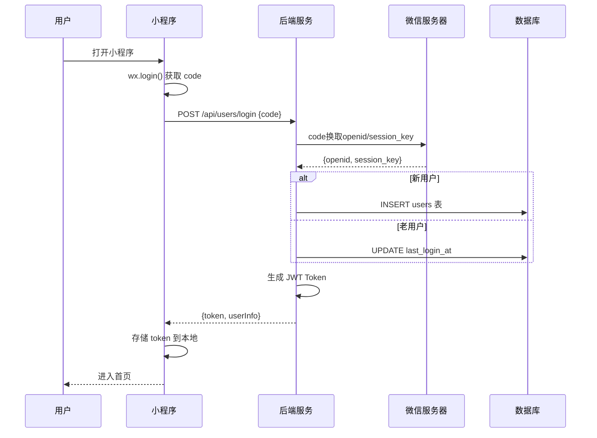
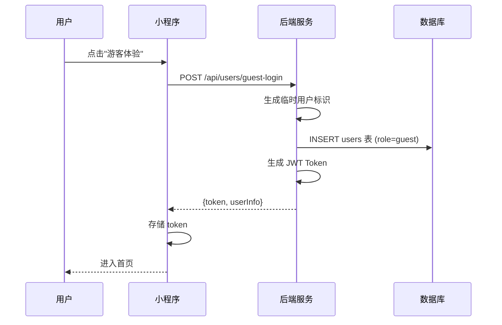
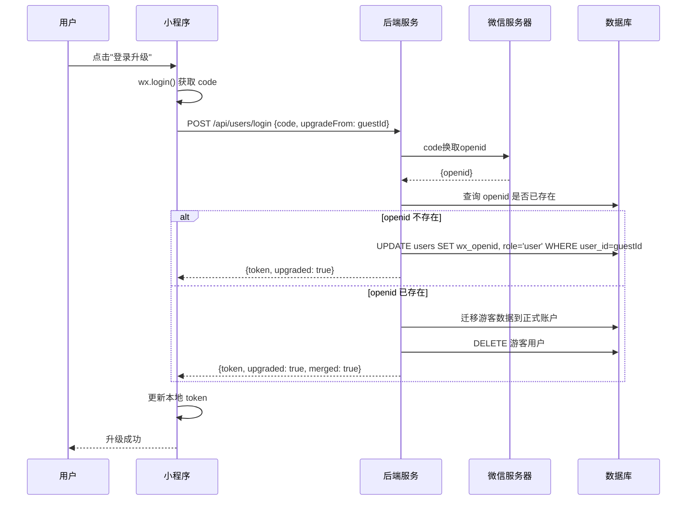
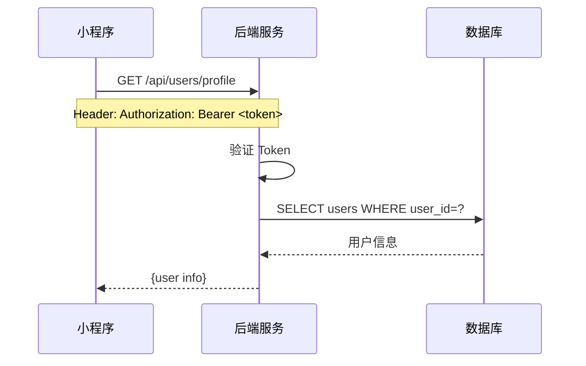

# 用户管理流程

**版本**: V1.0  
**日期**: 2026-04-04

---

## 一、微信登录流程

### 1.1 流程概述

用户通过微信小程序授权登录，获取 JWT Token 用于后续 API 调用。

### 1.2 流程图



### 1.3 步骤说明

| 步骤 | 操作 | 说明 |
|:---:|:---|:---|
| 1 | `wx.login()` | 小程序调用微信 API 获取临时 code |
| 2 | POST `/api/users/login` | 将 code 发送到后端 |
| 3 | code 换取 openid | 后端调用微信服务器接口 |
| 4 | 查询/创建用户 | 根据 openid 判断是否新用户 |
| 5 | 生成 JWT Token | 有效期 7 天 |
| 6 | 返回用户信息 | 包含 token 和基本用户信息 |

### 1.4 数据变化

| 步骤 | 表名 | 操作 | 说明 |
|:---:|:---|:---:|:---|
| 1 | users | INSERT/UPDATE | 新用户创建，老用户更新登录时间 |

### 1.5 请求/响应示例

**请求**:
```json
POST /api/users/login
{
  "code": "071Abc2D3efG4H1I5J6K7L8M9N0O"
}
```

**响应**:
```json
{
  "code": 200,
  "message": "登录成功",
  "data": {
    "token": "eyJhbGciOiJIUzI1NiIsInR5cCI6IkpXVCJ9...",
    "user": {
      "userId": "USER_001",
      "nickname": "微信用户",
      "avatarUrl": "https://...",
      "role": "user"
    },
    "isNewUser": true
  }
}
```

### 1.6 异常处理

| 错误码 | 说明 | 处理方式 |
|:---:|:---|:---|
| 1001 | 微信登录失败 | 提示用户重新登录 |
| 500 | 服务器错误 | 提示稍后重试 |

---

## 二、游客登录流程

### 2.1 流程概述

用户可选择游客模式体验小程序，无需微信授权。

### 2.2 流程图



### 2.3 步骤说明

| 步骤 | 操作 | 说明 |
|:---:|:---|:---|
| 1 | 点击游客体验 | 用户选择不登录直接使用 |
| 2 | 生成临时标识 | 后端生成唯一临时用户 ID |
| 3 | 创建游客用户 | role 设为 guest |
| 4 | 生成 JWT Token | 有效期 7 天 |

### 2.4 数据变化

| 步骤 | 表名 | 操作 | 说明 |
|:---:|:---|:---:|:---|
| 1 | users | INSERT | 创建游客用户，wx_openid 为 NULL |

### 2.5 游客用户限制

| 功能 | 游客权限 | 正常用户权限 |
|:---|:---:|:---:|
| 浏览功能 | ✅ | ✅ |
| 创建植物 | ❌ | ✅ |
| 绑定设备 | ❌ | ✅ |
| AI诊断 | ❌ | ✅ |

---

## 三、会话升级流程

### 3.1 流程概述

游客用户在使用过程中可选择升级为正式用户，保留已有数据。

### 3.2 流程图



### 3.3 数据迁移

| 数据表 | 迁移策略 |
|:---|:---|
| plants | UPDATE user_id |
| devices | UPDATE user_id |
| sessions | UPDATE user_id |
| care_records | UPDATE user_id |

### 3.4 相关接口

| 接口 | 方法 | 说明 |
|:---|:---:|:---|
| `/api/users/login` | POST | 微信登录（支持升级参数） |
| `/api/users/guest-login` | POST | 游客登录 |

---

## 四、用户信息管理流程

### 4.1 获取用户信息



### 4.2 更新用户信息

| 接口 | 方法 | 可更新字段 |
|:---|:---:|:---|
| `/api/users/profile` | PUT | nickname, avatarUrl |
| `/api/users/settings` | PUT | notificationSettings |
| `/api/users/config` | POST | 自定义配置项 |

---

## 五、相关接口汇总

| 接口 | 方法 | 说明 | 认证 |
|:---|:---:|:---|:---:|
| `/api/users/login` | POST | 微信登录 | ❌ |
| `/api/users/guest-login` | POST | 游客登录 | ❌ |
| `/api/users/profile` | GET | 获取用户资料 | ✅ |
| `/api/users/profile` | PUT | 更新用户资料 | ✅ |
| `/api/users/settings` | GET | 获取用户设置 | ✅ |
| `/api/users/settings` | PUT | 更新用户设置 | ✅ |
| `/api/users/config/:key` | GET | 获取配置项 | ✅ |
| `/api/users/config` | POST | 设置配置项 | ✅ |

---

## 六、变更记录

| 日期 | 版本 | 变更内容 |
|:---|:---:|:---|
| 2026-04-04 | v1.0 | 创建用户管理流程文档 |
