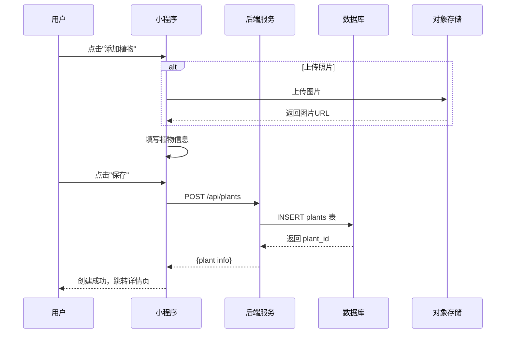
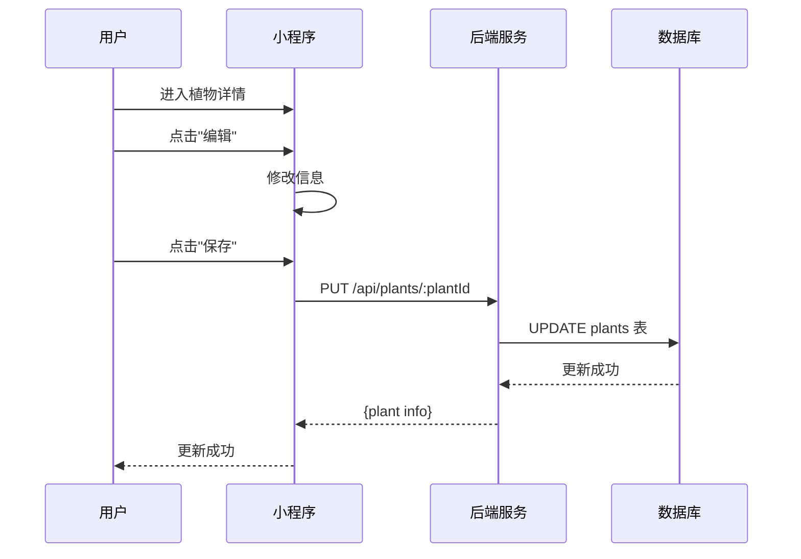
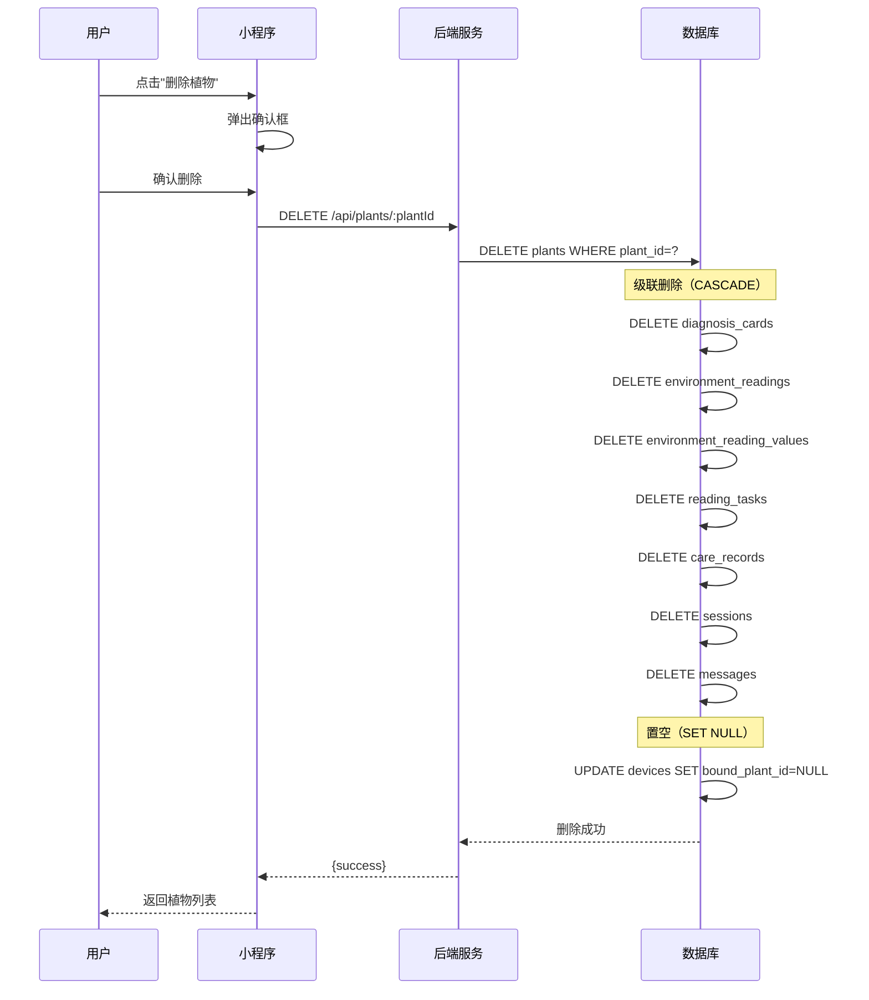
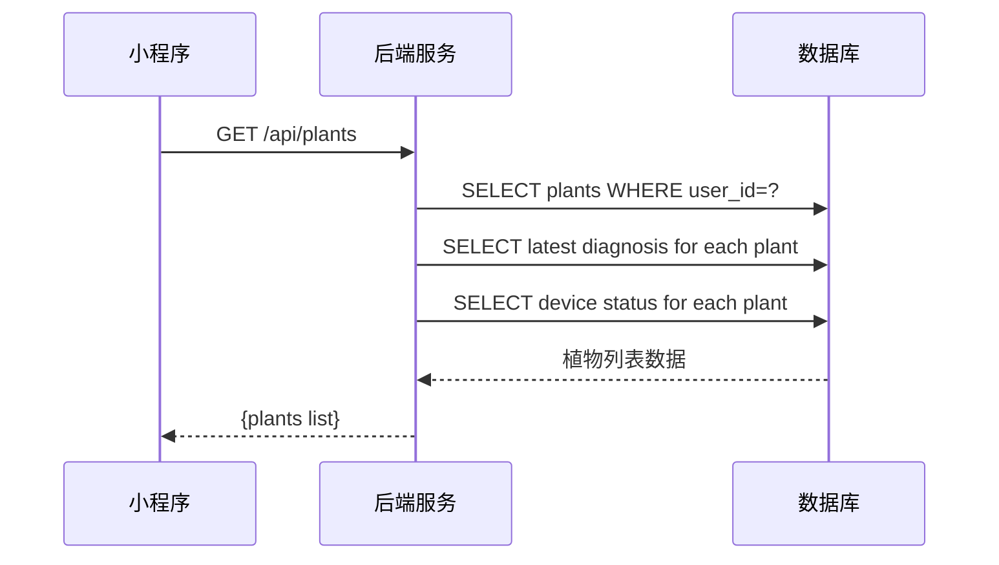

# 植物管理流程

**版本**: V1.0  
**日期**: 2026-04-04

---

## 一、创建植物流程

### 1.1 流程概述

用户创建新的植物档案，可选择品种、上传照片、设置位置。

### 1.2 流程图



### 1.3 步骤说明

| 步骤 | 操作 | 说明 |
|:---:|:---|:---|
| 1 | 选择品种 | 可从品种库选择或手动输入 |
| 2 | 上传照片 | 可选，支持拍照或相册选择 |
| 3 | 设置位置 | 可选，用于天气数据获取 |
| 4 | 提交保存 | 创建植物档案 |

### 1.4 数据变化

| 步骤 | 表名 | 操作 | 说明 |
|:---:|:---|:---:|:---|
| 1 | plants | INSERT | 创建植物档案 |

### 1.5 请求/响应示例

**请求**:
```json
POST /api/plants
{
  "nickname": "大黄",
  "plantCategory": "foliage",
  "species": "虎皮兰",
  "coverImageUrl": "https://cos.example.com/plant.jpg",
  "locationName": "北京市朝阳区",
  "locationCode": "110105",
  "locationLat": 39.9042,
  "locationLng": 116.4074
}
```

**响应**:
```json
{
  "code": 200,
  "message": "创建成功",
  "data": {
    "plantId": "PLANT_001",
    "nickname": "大黄",
    "plantCategory": "foliage",
    "species": "虎皮兰",
    "coverImageUrl": "https://cos.example.com/plant.jpg",
    "createdAt": "2026-04-04T10:00:00Z"
  }
}
```

---

## 二、更新植物流程

### 2.1 流程图



### 2.2 可更新字段

| 字段 | 说明 | 是否可更新 |
|:---|:---|:---:|
| nickname | 昵称 | ✅ |
| species | 品种 | ✅ |
| coverImageUrl | 封面照片 | ✅ |
| locationName | 位置名称 | ✅ |
| locationCode | 城市编码 | ✅ |
| currentDeviceId | 当前设备 | ✅（通过绑定设备更新） |
| plantCategory | 分类 | ❌ 创建后不可改 |

---

## 三、删除植物流程

### 3.1 流程概述

删除植物档案，级联删除所有关联数据。

### 3.2 流程图



### 3.3 级联删除说明

| 表名 | 删除行为 | 说明 |
|:---|:---:|:---|
| diagnosis_cards | CASCADE | 诊断历史一并删除 |
| environment_readings | CASCADE | 环境数据一并删除 |
| environment_reading_values | CASCADE | 环境数值一并删除 |
| reading_tasks | CASCADE | 采集任务一并删除 |
| care_records | CASCADE | 养护记录一并删除 |
| sessions | CASCADE | 植物会话一并删除 |
| messages | CASCADE | 会话消息一并删除 |
| devices | SET NULL | 设备解绑但保留 |

---

## 四、植物列表查询流程

### 4.1 流程图



### 4.2 列表返回数据

```json
{
  "code": 200,
  "data": {
    "total": 3,
    "list": [
      {
        "plantId": "PLANT_001",
        "nickname": "大黄",
        "species": "虎皮兰",
        "coverImageUrl": "https://...",
        "deviceStatus": "online",
        "latestDiagnosis": {
          "healthScore": 85,
          "diagnosedAt": "2026-04-03T10:00:00Z"
        }
      }
    ]
  }
}
```

---

## 五、相关接口汇总

| 接口 | 方法 | 说明 | 认证 |
|:---|:---:|:---|:---:|
| `/api/plants` | GET | 获取植物列表 | ✅ |
| `/api/plants` | POST | 创建植物 | ✅ |
| `/api/plants/:plantId` | GET | 获取植物详情 | ✅ |
| `/api/plants/:plantId` | PUT | 更新植物 | ✅ |
| `/api/plants/:plantId` | DELETE | 删除植物 | ✅ |

---

## 六、变更记录

| 日期 | 版本 | 变更内容 |
|:---|:---:|:---|
| 2026-04-04 | v1.0 | 创建植物管理流程文档 |
