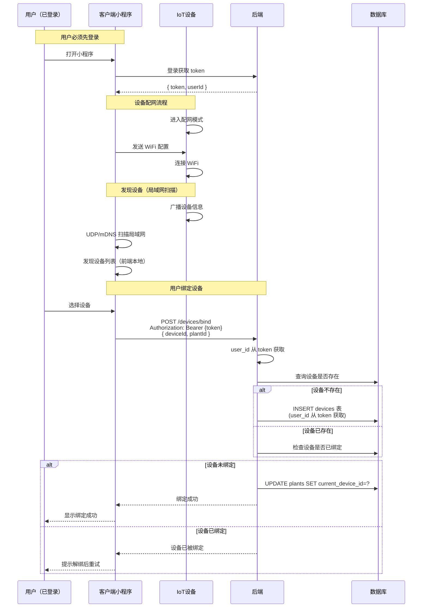
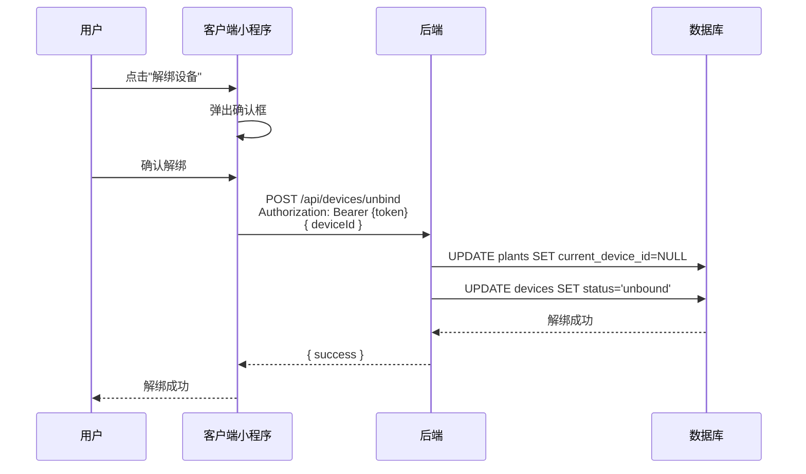
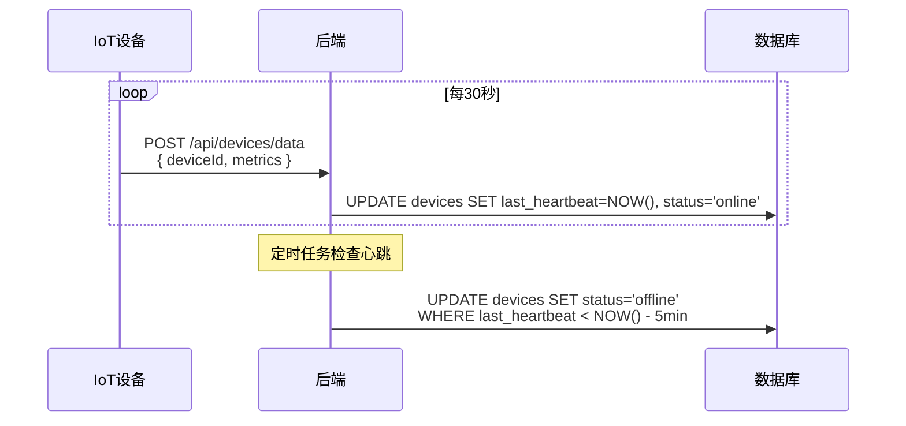
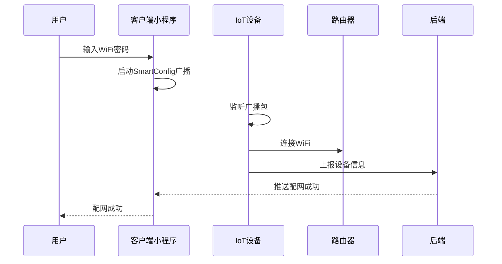
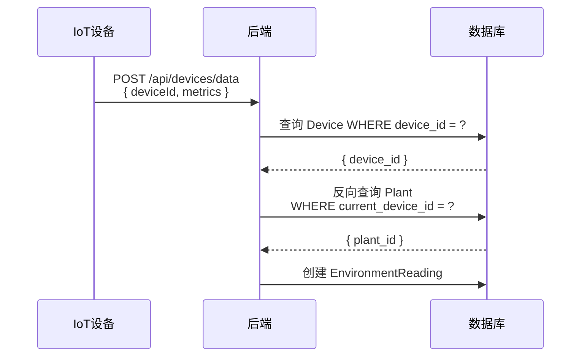

# 设备管理流程

**版本**: V2.0  
**日期**: 2026-04-06

---

## 一、设备绑定流程

### 1.1 流程概述

用户将设备绑定到植物，使设备能够为该植物采集环境数据。

**前置条件**：用户必须先登录获取 token。

### 1.2 完整流程图



### 1.3 设备发现机制

**重要**：设备发现是在**前端局域网扫描**完成的，不依赖后端。

| 阶段 | 说明 | 实现方式 |
|:---|:---|:---|
| **设备广播** | 设备连接 WiFi 后广播自己的信息 | UDP 广播 / mDNS |
| **前端扫描** | 小程序扫描局域网内的设备 | wx.startLocalServiceDiscovery |
| **设备列表** | 前端本地维护，不请求后端 | 前端状态管理 |

**前端扫描示例**：
```javascript
// 发现局域网设备（不请求后端）
wx.startLocalServiceDiscovery({
  serviceType: '_proj-alpha._udp',
  success: (res) => {
    // res.services 包含发现的设备列表
    // [{ deviceId, deviceName, macAddress, ... }]
  }
});
```

### 1.4 两种设备列表

| 列表类型 | 数据来源 | API |
|:---|:---|:---|
| **未绑定设备列表** | 前端局域网扫描 | 无（本地扫描） |
| **已绑定设备列表** | 后端数据库 | `GET /api/devices` |

### 1.5 步骤说明

| 步骤 | 操作 | 说明 |
|:---:|:---|:---|
| 1 | 用户登录 | 必须先登录获取 token |
| 2 | 设备配网 | 设备进入配网模式，客户端发送 WiFi 配置 |
| 3 | 绑定设备 | 客户端调用 bind 接口，user_id 从 token 获取 |
| 4 | 验证设备 | 检查设备是否存在、是否已绑定 |
| 5 | 创建设备记录 | 新设备需要创建记录（user_id 从 token 获取） |
| 6 | 绑定植物 | 更新 plants 表的 current_device_id |

### 1.4 数据变化

| 步骤 | 表名 | 操作 | 说明 |
|:---:|:---|:---:|:---|
| 1 | devices | INSERT/UPDATE | 创建设备或更新归属用户 |
| 2 | plants | UPDATE | 更新 current_device_id |

### 1.5 请求/响应示例

**请求**:
```json
POST /api/devices/bind
Authorization: Bearer eyJhbGciOiJIUzI1...

{
  "deviceId": "DEVICE_abc123def456",
  "plantId": "PLANT_001"
}
```

**响应**:
```json
{
  "code": 200,
  "message": "设备绑定成功",
  "data": {
    "deviceId": "DEVICE_abc123def456",
    "deviceName": "环境监测器-客厅",
    "status": "online",
    "boundPlantId": "PLANT_001"
  }
}
```

### 1.6 关键设计

| 设计点 | 说明 |
|:---|:---|
| **user_id 来源** | 从 token 获取，不从前端参数传入 |
| **单向关联** | 只在 plants 表存储 current_device_id |
| **设备归属** | 绑定时设置 user_id，设备属于绑定用户 |

---

## 二、设备解绑流程

### 2.1 流程图



### 2.2 数据变化

| 步骤 | 表名 | 操作 | 说明 |
|:---:|:---|:---:|:---|
| 1 | plants | UPDATE | current_device_id 置 NULL |
| 2 | devices | UPDATE | status 置 unbound |

---

## 三、设备状态管理

### 3.1 设备状态定义

| 状态 | 说明 | 触发条件 |
|:---|:---|:---|
| online | 在线 | 设备最近5分钟内有心跳 |
| offline | 离线 | 设备超过5分钟无心跳 |
| unbound | 未绑定 | 设备未绑定到任何植物 |

### 3.2 心跳更新流程



---

## 四、设备配网流程（SmartConfig）

### 4.1 流程概述

设备首次使用需要配置 WiFi 连接。

### 4.2 流程图



### 4.3 配网状态

| 状态 | 说明 |
|:---|:---|
| 配网中 | 正在广播WiFi信息 |
| 配网成功 | 设备已连接WiFi |
| 配网失败 | 超时或密码错误 |

---

## 五、设备数据上报流程

> **注意**：设备数据上报已统一到环境模块，详见 [04-环境数据流程.md](./04-环境数据流程.md)

### 5.1 数据路由机制

设备上报数据时，只需要传入 `deviceId`，后端通过反向查询找到目标植物：



---

## 六、相关接口汇总

| 接口 | 方法 | 说明 | 认证 |
|:---|:---:|:---|:---:|
| `/api/devices` | GET | 获取设备列表 | ✅ 用户 |
| `/api/devices/bind` | POST | 绑定设备 | ✅ 用户 |
| `/api/devices/unbind` | POST | 解绑设备 | ✅ 用户 |
| `/api/devices/:deviceId` | GET | 获取设备详情 | ✅ 用户 |
| `/api/devices/data` | POST | 设备数据上报 | ✅ 设备 |

---

## 七、变更记录

| 日期 | 版本 | 变更内容 |
|:---|:---:|:---|
| 2026-04-04 | v1.0 | 创建设备管理流程文档 |
| 2026-04-04 | v1.0 | 标注数据上报接口已迁移 |
| 2026-04-06 | v2.0 | 重构绑定流程：user_id 从 token 获取，移除 bound_plant_id 冗余字段 |
