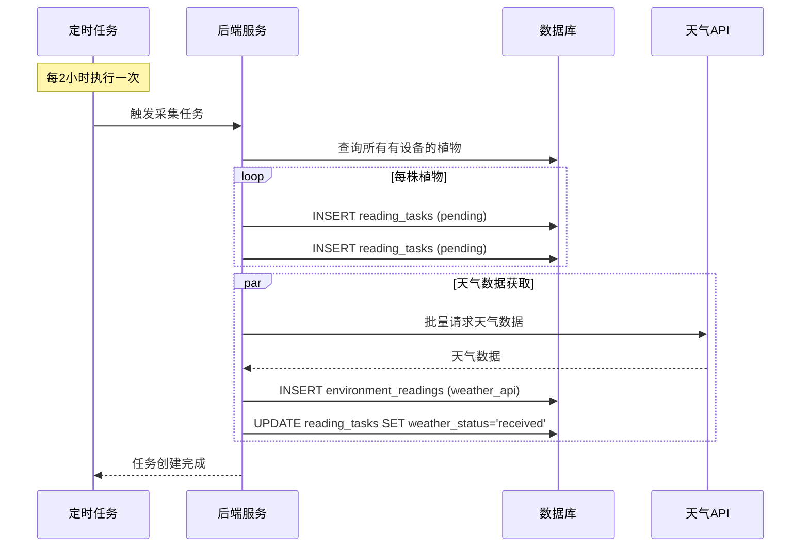
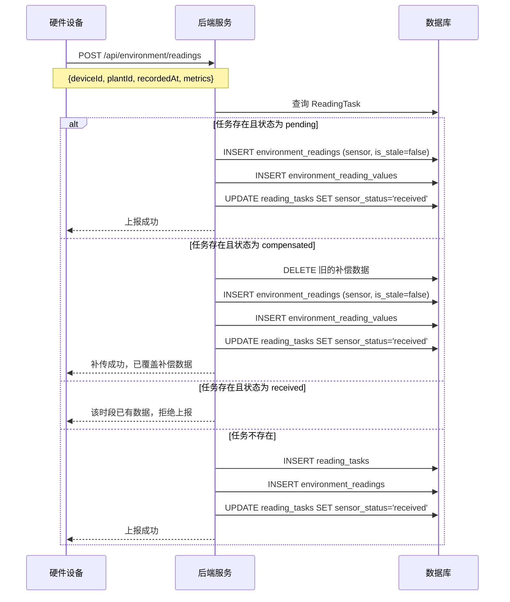
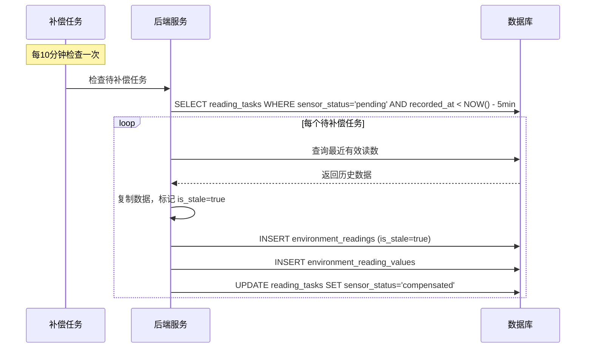
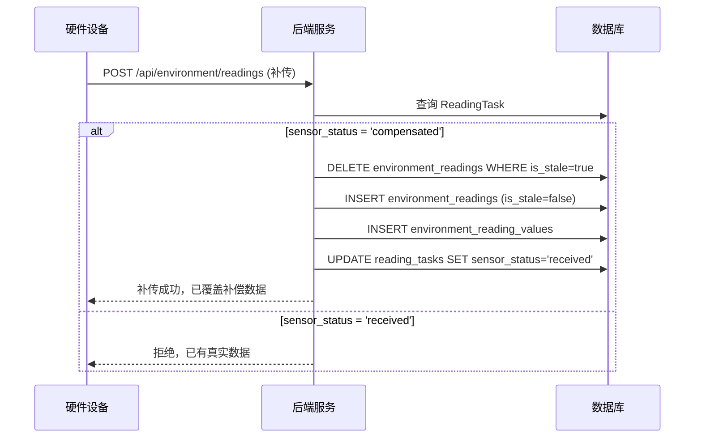
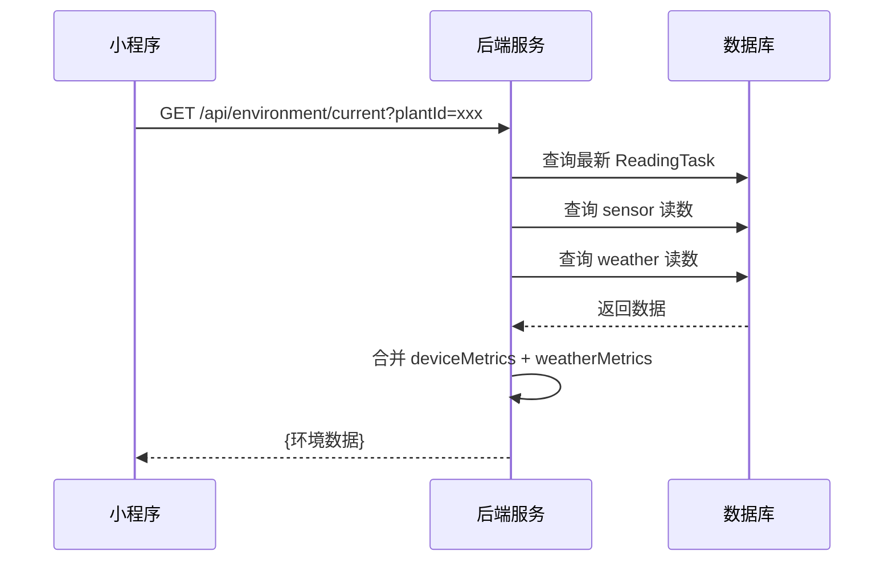
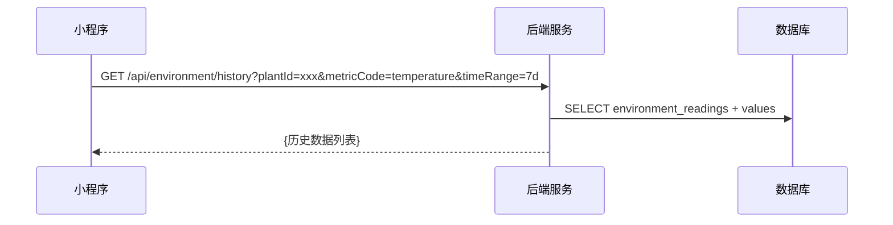

# 环境数据流程

**版本**: V1.0  
**日期**: 2026-04-04

---

## 一、数据采集概述

### 1.1 数据来源

| 来源 | 说明 | 采集频率 |
|:---|:---|:---|
| 传感器 | 设备上报的环境数据 | 每2小时 |
| 天气API | 第三方天气数据 | 每2小时 |

### 1.2 核心概念

| 概念 | 说明 |
|:---|:---|
| **ReadingTask** | 采集任务，追踪每个时间点的数据采集状态 |
| **EnvironmentReading** | 环境读数，存储实际采集的数据 |
| **补偿机制** | 传感器超时时，复制历史数据保证连续性 |
| **补传机制** | 传感器恢复后，覆盖补偿数据 |

---

## 二、定时任务创建流程

### 2.1 流程图



### 2.2 任务创建时机

| 时间点 | 任务 recorded_at |
|:---|:---|
| 00:00 | 00:00 |
| 02:00 | 02:00 |
| 04:00 | 04:00 |
| ... | ... |
| 22:00 | 22:00 |

---

## 三、传感器数据上报流程

### 3.1 流程图



### 3.2 请求示例

**设备实时上报**:
```json
POST /api/environment/readings
{
  "deviceId": "DEVICE_001",
  "plantId": "PLANT_001",
  "recordedAt": "2026-04-04T10:00:00Z",
  "metrics": [
    {"metricCode": "temperature", "value": 22.5},
    {"metricCode": "humidity", "value": 60},
    {"metricCode": "soil_moisture", "value": 45}
  ]
}
```

**设备补传**:
```json
POST /api/environment/readings
{
  "deviceId": "DEVICE_001",
  "plantId": "PLANT_001",
  "recordedAt": "2026-04-04T08:00:00Z",
  "isSupplement": true,
  "metrics": [...]
}
```

---

## 四、补偿机制流程

### 4.1 触发条件

- 传感器在容忍期（5分钟）内未上报数据
- ReadingTask 的 sensor_status 仍为 pending

### 4.2 流程图



### 4.3 补偿数据特征

| 特征 | 值 | 说明 |
|:---|:---|:---|
| data_source | sensor | 仍标记为传感器数据 |
| is_stale | true | 标记为补偿数据 |
| recorded_at | 原任务时间 | 保持时间连续性 |

---

## 五、补传覆盖流程

### 5.1 触发条件

- 传感器恢复在线
- 上报历史时间点的数据
- 该时间点的任务状态为 compensated

### 5.2 流程图



---

## 六、数据查询流程

### 6.1 获取实时数据



### 6.2 响应示例

```json
{
  "code": 200,
  "data": {
    "plantId": "PLANT_001",
    "recordedAt": "2026-04-04T10:00:00Z",
    "deviceMetrics": [
      {
        "metricCode": "temperature",
        "name": "温度",
        "value": 22.5,
        "unit": "°C",
        "status": "normal",
        "isStale": false
      }
    ],
    "weatherMetrics": [
      {
        "metricCode": "temperature",
        "name": "室外温度",
        "value": 18.5,
        "unit": "°C"
      }
    ],
    "taskStatus": {
      "sensor": "received",
      "weather": "received"
    }
  }
}
```

### 6.3 获取历史数据



---

## 七、状态流转总结

### 7.1 ReadingTask 状态流转

```
传感器状态：
pending ──────→ received     (正常上报)
   │
   └──────────→ compensated  (超时补偿)
                   │
                   └──────→ received  (补传覆盖)

天气状态：
pending ──────→ received     (API成功)
   │
   └──────────→ failed       (API失败)
```

### 7.2 EnvironmentReading 状态

| is_stale | 说明 | 图表显示 |
|:---:|:---|:---|
| false | 真实数据 | 正常曲线 |
| true | 补偿数据 | 虚线/标记点 |

---

## 八、相关接口汇总

| 接口 | 方法 | 说明 | 认证 |
|:---|:---:|:---|:---:|
| `/api/environment/readings` | POST | 环境数据上报 | ✅ 设备/用户 |
| `/api/environment/current` | GET | 获取实时数据 | ✅ 用户 |
| `/api/environment/history` | GET | 获取历史数据 | ✅ 用户 |

---

## 九、实现细节补充

### 9.1 定时任务实现

**任务调度器**: `jobs/environmentSyncJob.js`

**执行周期配置** (`config/environment.js`):
```javascript
{
  SYNC_INTERVAL: 2 * 60 * 60 * 1000,  // 2小时
  TOLERANCE_PERIOD: 5 * 60 * 1000,     // 5分钟容忍期
}
```

**任务列表**:
| 任务 | 周期 | 执行函数 | 说明 |
|:---|:---|:---|:---|
| 主同步任务 | 每2小时 | generateTasksForAllPlants() | 为所有有设备的植物创建reading_task |
| 天气获取 | 每2小时 | fetchWeatherForAllPlants() | 获取天气数据并保存 |
| 补偿检查 | 每10分钟 | checkAndCompensateAll() | 检查超时任务并执行补偿 |

### 9.2 补偿服务实现

**服务文件**: `services/compensationService.js`

**核心算法**:
```javascript
// 1. 扫描超时任务（超过容忍期的PENDING任务）
const pendingTasks = await ReadingTask.findAll({
  where: {
    sensor_status: 'pending',
    recorded_at: { [Op.lt]: cutoffTime }  // cutoffTime = now - 5min
  }
});

// 2. 对每个任务执行补偿
for (const task of pendingTasks) {
  // 2.1 查找最近的有效读数
  const lastReading = await EnvironmentReading.findOne({
    where: { plant_id: task.plant_id, data_source: 'sensor' },
    order: [['recorded_at', 'DESC']],
    include: [EnvironmentReadingValue]
  });
  
  // 2.2 创建补偿读数（复制历史数据）
  const compensatedReading = await EnvironmentReading.create({
    plant_id: task.plant_id,
    data_source: 'sensor',
    recorded_at: task.recorded_at,
    is_stale: true  // 标记为补偿数据
  });
  
  // 2.3 复制数值
  for (const val of lastReading.values) {
    await EnvironmentReadingValue.create({
      reading_id: compensatedReading.reading_id,
      metric_code: val.metric_code,
      value: val.value  // 使用历史值
    });
  }
  
  // 2.4 更新任务状态
  await task.update({ sensor_status: 'compensated' });
}
```

### 9.3 天气服务实现

**服务文件**: `services/weatherService.js`

**功能**:
- 根据植物位置编码获取天气数据
- 转换天气数据为环境指标格式
- 创建天气数据源的环境读数

### 9.4 关键配置参数

| 参数 | 值 | 说明 |
|:---|:---|:---|
| SYNC_INTERVAL | 2小时 | 数据采集周期 |
| TOLERANCE_PERIOD | 5分钟 | 传感器上传容忍期 |
| 补偿检查周期 | 10分钟 | 检查并执行补偿的频率 |
| 天气API | 第三方 | 根据location_code获取 |

### 9.5 数据流向总结

```
定时任务触发
    ↓
生成 ReadingTask (status=pending)
    ↓
并行执行:
    ├── 传感器等待上报 (容忍期5分钟)
    └── 天气API立即获取
    ↓
传感器超时?
    ├── 是 → 执行补偿 → is_stale=true
    └── 否 → 正常接收 → is_stale=false
    ↓
传感器恢复后补传?
    ├── 是 → 删除补偿数据 → 插入真实数据
    └── 否 → 保持现状
```

---

## 十、变更记录

| 日期 | 版本 | 变更内容 |
|:---|:---:|:---|
| 2026-04-04 | v1.0 | 创建环境数据流程文档 |
| 2026-04-04 | v1.0 | 包含补偿机制和补传覆盖流程 |
| 2026-04-07 | v1.1 | 补充定时任务实现细节 |
| 2026-04-07 | v1.1 | 补充补偿服务核心算法 |
| 2026-04-07 | v1.1 | 补充配置参数和数据流向 |
