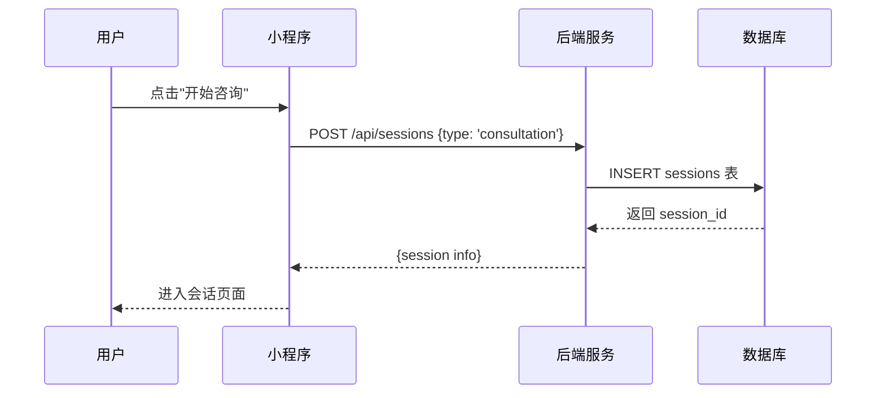
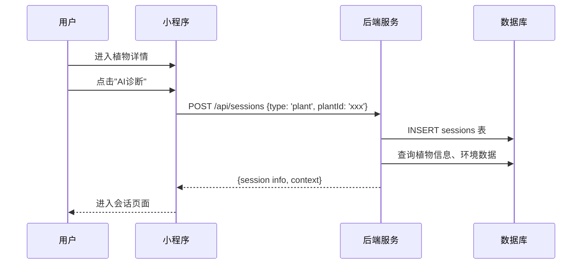
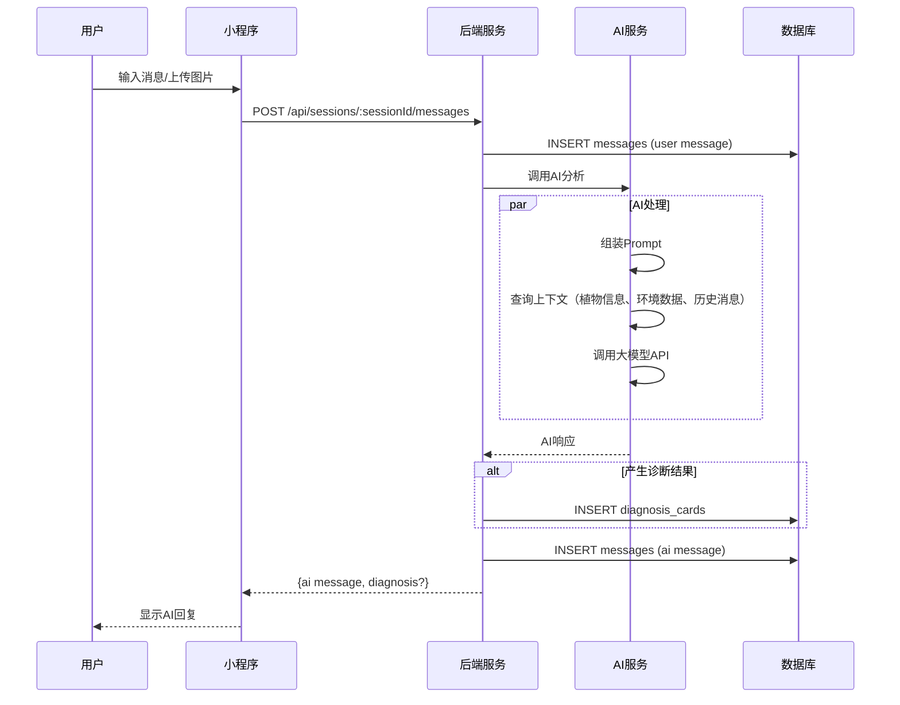
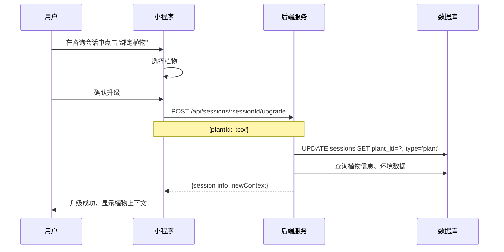
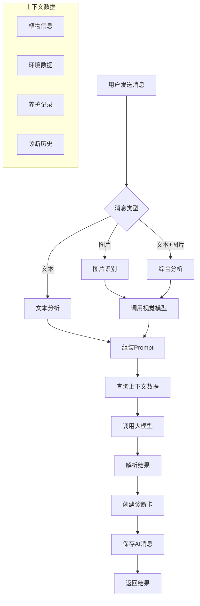
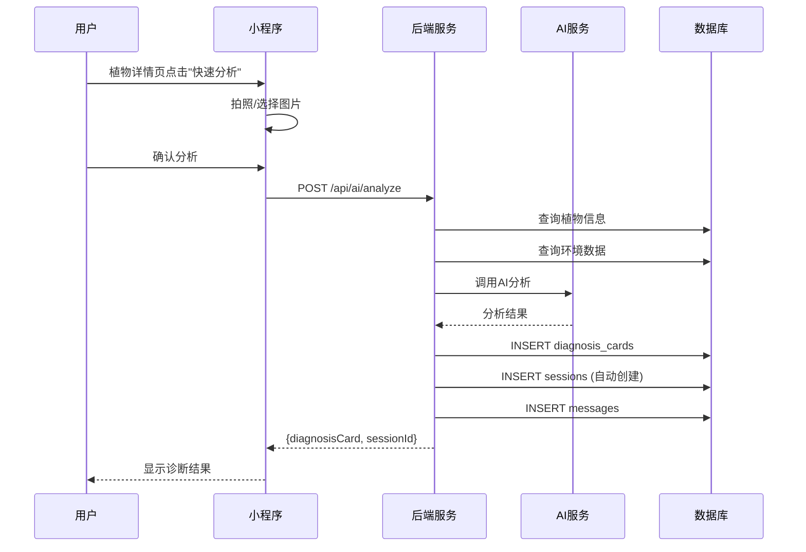
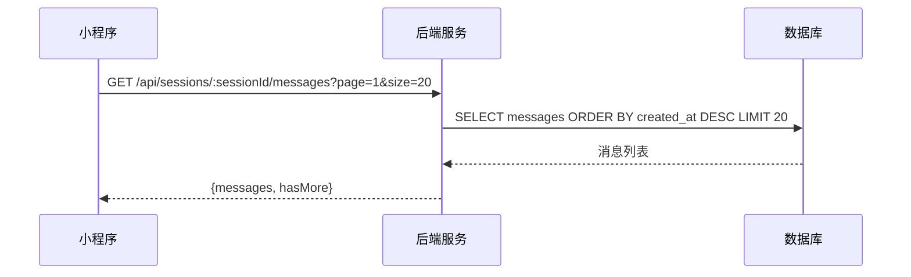

# AI交互流程

**版本**: V1.0  
**日期**: 2026-04-04

---

## 一、会话创建流程

### 1.1 会话类型

| 类型 | 说明 | 创建方式 |
|:---|:---|:---|
| 咨询会话 | 无绑定植物，通用咨询 | 用户主动创建 |
| 植物会话 | 绑定特定植物 | 从咨询会话升级或直接创建 |

### 1.2 创建咨询会话



### 1.3 创建植物会话



---

## 二、消息发送流程

### 2.1 流程图



### 2.2 请求示例

**文本消息**:
```json
POST /api/sessions/:sessionId/messages
{
  "contentType": "text",
  "content": "我的植物叶子发黄了怎么办？"
}
```

**图片消息**:
```json
POST /api/sessions/:sessionId/messages
{
  "contentType": "image",
  "imageUrls": ["https://cos.example.com/img1.jpg"]
}
```

### 2.3 AI响应示例

```json
{
  "code": 200,
  "data": {
    "messageId": "MSG_002",
    "role": "assistant",
    "contentType": "text",
    "content": "根据您描述的情况，叶子发黄可能是由以下原因造成的...",
    "diagnosisCard": {
      "diagnosisCardId": "DC_001",
      "analysisType": "text",
      "healthScore": 65,
      "issues": [...],
      "suggestions": [...]
    }
  }
}
```

---

## 三、会话升级流程

### 3.1 流程概述

咨询会话可以升级为植物会话，保留历史消息。

### 3.2 流程图



### 3.3 升级后的变化

| 变化 | 说明 |
|:---|:---|
| 会话类型 | consultation → plant |
| 植物绑定 | NULL → plant_id |
| AI上下文 | 增加：植物信息、环境数据、养护记录、诊断历史 |

---

## 四、诊断分析流程

### 4.1 分析类型

| 类型 | 触发条件 | 数据来源 |
|:---|:---|:---|
| 文本分析 | 用户发送文本描述 | 用户描述 + 植物信息 |
| 图片分析 | 用户上传图片 | 图片识别 + 植物信息 |
| 综合分析 | 文本 + 图片 | 多模态分析 |

### 4.2 诊断流程



### 4.3 诊断卡数据结构

```json
{
  "diagnosisCardId": "DC_001",
  "plantId": "PLANT_001",
  "analysisType": "image",
  "healthScore": 75,
  "status": "analyzing",
  "issues": [
    {
      "type": "disease",
      "name": "叶斑病",
      "severity": "medium",
      "description": "叶片出现褐色斑点",
      "confidence": 0.85
    }
  ],
  "suggestions": [
    {
      "action": "treatment",
      "title": "喷洒杀菌剂",
      "description": "使用多菌灵或代森锰锌",
      "priority": 1
    }
  ],
  "contextUsed": {
    "environmentData": true,
    "careRecords": true,
    "weatherData": true
  }
}
```

---

## 五、快速分析流程

### 5.1 流程概述

用户可从植物详情页直接发起快速分析，无需创建会话。

### 5.2 流程图



### 5.3 与会话分析的区别

| 对比项 | 快速分析 | 会话分析 |
|:---|:---|:---|
| 入口 | 植物详情页 | 会话页面 |
| 会话创建 | 自动创建 | 用户主动创建 |
| 历史消息 | 无 | 有上下文 |
| 后续对话 | 可继续 | 可继续 |

---

## 六、消息列表查询流程

### 6.1 分页查询



### 6.2 消息类型

| contentType | 说明 | 显示方式 |
|:---|:---|:---|
| text | 纯文本 | 文本气泡 |
| image | 图片 | 图片网格 |
| diagnosis | 诊断卡 | 卡片组件 |
| system | 系统消息 | 居中提示 |

---

## 七、相关接口汇总

| 接口 | 方法 | 说明 | 认证 |
|:---|:---:|:---|:---:|
| `/api/sessions` | GET | 获取会话列表 | ✅ |
| `/api/sessions` | POST | 创建会话 | ✅ |
| `/api/sessions/:sessionId` | GET | 获取会话详情 | ✅ |
| `/api/sessions/:sessionId` | PUT | 更新会话 | ✅ |
| `/api/sessions/:sessionId` | DELETE | 删除会话 | ✅ |
| `/api/sessions/:sessionId/messages` | GET | 获取消息列表 | ✅ |
| `/api/sessions/:sessionId/messages` | POST | 发送消息 | ✅ |
| `/api/sessions/:sessionId/read` | POST | 标记已读 | ✅ |
| `/api/sessions/:sessionId/upgrade` | POST | 升级会话 | ✅ |
| `/api/ai/analyze` | POST | 快速分析 | ✅ |
| `/api/diagnosis` | GET | 获取诊断历史 | ✅ |
| `/api/diagnosis/:diagnosisCardId` | GET | 获取诊断详情 | ✅ |

---

## 八、变更记录

| 日期 | 版本 | 变更内容 |
|:---|:---:|:---|
| 2026-04-04 | v1.0 | 创建AI交互流程文档 |
