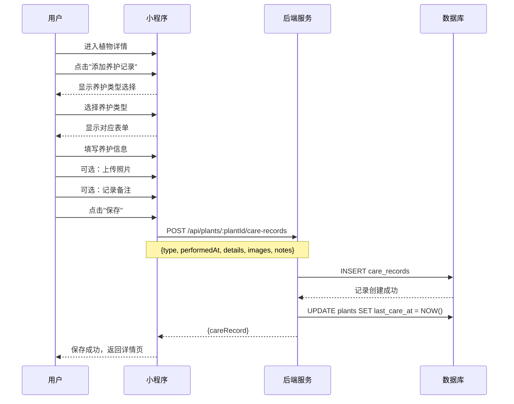
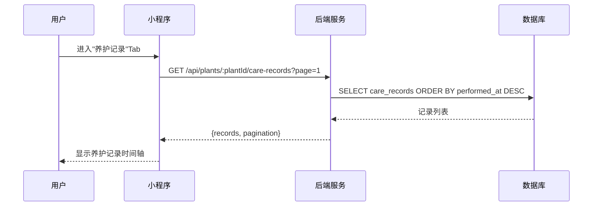
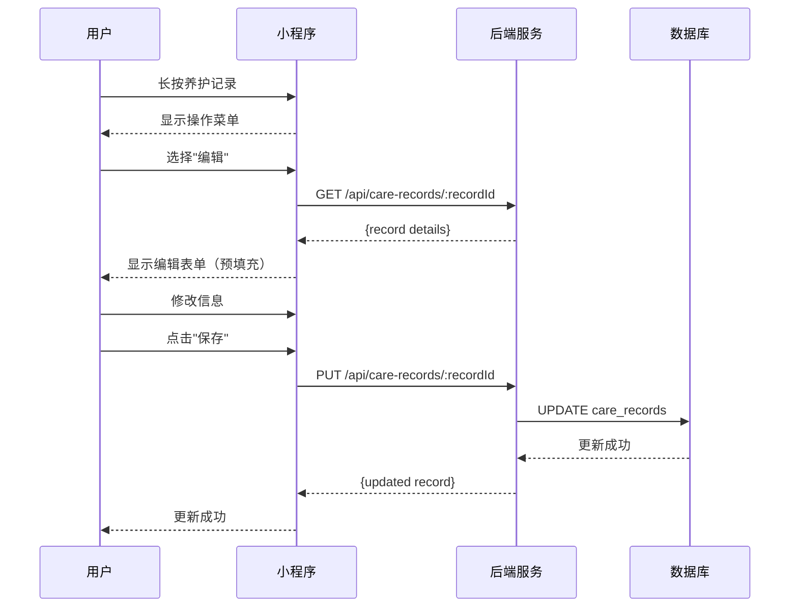
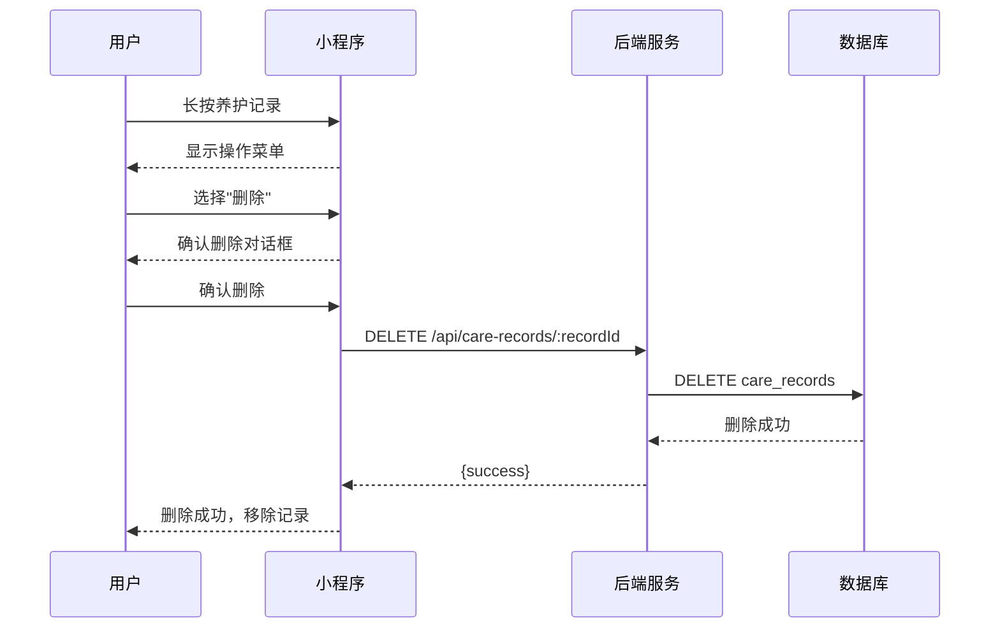
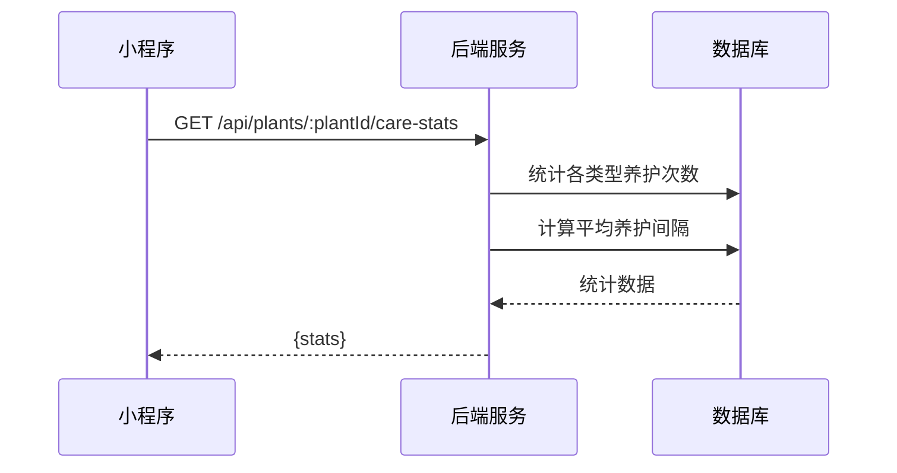

# 养护记录流程

**版本**: V1.0  
**日期**: 2026-04-15  
**状态**: ✅ 已创建

---

## 一、流程概述

养护记录用于追踪用户对植物的日常护理操作，包括浇水、施肥、修剪等。

### 1.1 养护类型

| 类型 | 代码 | 说明 | 记录字段 |
|:---|:---|:---|:---|
| **浇水** | watering | 日常浇水 | 水量、水质 |
| **施肥** | fertilizing | 添加肥料 | 肥料类型、用量 |
| **修剪** | pruning | 修剪枝叶 | 修剪部位、程度 |
| **换盆** | repotting | 更换花盆/土壤 | 新盆尺寸、土壤类型 |
| **喷药** | spraying | 喷洒农药/营养液 | 药剂类型、浓度 |
| **其他** | other | 其他养护操作 | 自定义描述 |

---

## 二、创建养护记录流程

### 2.1 流程图



### 2.2 请求示例

```json
POST /api/plants/PLANT_001/care-records
{
  "type": "watering",
  "performedAt": "2026-04-15T10:30:00Z",
  "details": {
    "waterAmount": 200,
    "waterType": "tap"
  },
  "images": [
    "https://cos.example.com/care1.jpg"
  ],
  "notes": "土壤表面干燥后浇水"
}
```

### 2.3 响应示例

```json
{
  "code": 200,
  "data": {
    "careRecordId": "CR_001",
    "plantId": "PLANT_001",
    "type": "watering",
    "performedAt": "2026-04-15T10:30:00Z",
    "details": {
      "waterAmount": 200,
      "waterType": "tap"
    },
    "images": ["https://cos.example.com/care1.jpg"],
    "notes": "土壤表面干燥后浇水",
    "createdAt": "2026-04-15T10:35:00Z"
  }
}
```

---

## 三、养护记录查询流程

### 3.1 列表查询



### 3.2 筛选功能

| 筛选条件 | 参数 | 说明 |
|:---|:---|:---|
| 养护类型 | `type` | watering/fertilizing/pruning/... |
| 时间范围 | `startDate`, `endDate` | 指定日期区间 |
| 排序方式 | `sort` | performed_at:asc/desc |

### 3.3 响应示例

```json
{
  "code": 200,
  "data": {
    "records": [
      {
        "careRecordId": "CR_001",
        "type": "watering",
        "typeName": "浇水",
        "performedAt": "2026-04-15T10:30:00Z",
        "details": {"waterAmount": 200},
        "images": [],
        "notes": "土壤表面干燥后浇水"
      },
      {
        "careRecordId": "CR_002",
        "type": "fertilizing",
        "typeName": "施肥",
        "performedAt": "2026-04-10T14:00:00Z",
        "details": {"fertilizerType": "复合肥", "amount": "10g"},
        "images": [],
        "notes": "生长期追肥"
      }
    ],
    "pagination": {
      "page": 1,
      "size": 20,
      "total": 15,
      "hasMore": false
    }
  }
}
```

---

## 四、编辑养护记录流程

### 4.1 流程图



---

## 五、删除养护记录流程

### 5.1 流程图



---

## 六、养护统计与提醒

### 6.1 养护统计



### 6.2 统计指标

| 指标 | 说明 |
|:---|:---|
| 本月浇水次数 | 当前月份浇水记录数 |
| 平均浇水间隔 | 两次浇水的平均天数 |
| 上次养护时间 | 最近一次养护的日期 |
| 养护类型分布 | 各类型养护的占比 |

### 6.3 养护提醒

基于养护记录，系统可生成智能提醒：

| 提醒类型 | 触发条件 | 提醒内容 |
|:---|:---|:---|
| 浇水提醒 | 超过平均浇水间隔 | "您的植物已经X天没浇水了" |
| 施肥提醒 | 距上次施肥>30天 | "建议本月给植物施肥" |
| 换盆提醒 | 距上次换盆>1年 | "植物可能需要换盆了" |

---

## 七、相关接口汇总

| 接口 | 方法 | 说明 | 认证 |
|:---|:---:|:---|:---:|
| `/api/plants/:plantId/care-records` | GET | 获取养护记录列表 | ✅ |
| `/api/plants/:plantId/care-records` | POST | 创建养护记录 | ✅ |
| `/api/care-records/:recordId` | GET | 获取养护记录详情 | ✅ |
| `/api/care-records/:recordId` | PUT | 更新养护记录 | ✅ |
| `/api/care-records/:recordId` | DELETE | 删除养护记录 | ✅ |
| `/api/plants/:plantId/care-stats` | GET | 获取养护统计 | ✅ |

---

## 八、数据模型

### 8.1 CareRecord 表结构

| 字段 | 类型 | 说明 |
|:---|:---|:---|
| care_record_id | VARCHAR(64) | 主键 |
| plant_id | VARCHAR(64) | 外键，关联植物 |
| type | ENUM | 养护类型 |
| performed_at | DATETIME | 执行时间 |
| details | JSON | 详细信息（根据类型变化） |
| images | JSON | 照片URL数组 |
| notes | TEXT | 备注 |
| created_at | DATETIME | 创建时间 |
| updated_at | DATETIME | 更新时间 |

### 8.2 Details 字段示例

**浇水 (watering)**:
```json
{
  "waterAmount": 200,
  "waterType": "tap",
  "waterTemperature": "room"
}
```

**施肥 (fertilizing)**:
```json
{
  "fertilizerType": "复合肥",
  "fertilizerBrand": "某品牌",
  "amount": "10g",
  "dilutionRatio": "1:1000"
}
```

**修剪 (pruning)**:
```json
{
  "prunedParts": ["老叶", "枯枝"],
  "pruningDegree": "轻度",
  "toolsUsed": ["剪刀"]
}
```

---

## 九、变更记录

| 日期 | 版本 | 变更内容 |
|:---|:---:|:---|
| 2026-04-15 | v1.0 | 创建养护记录流程文档 |
