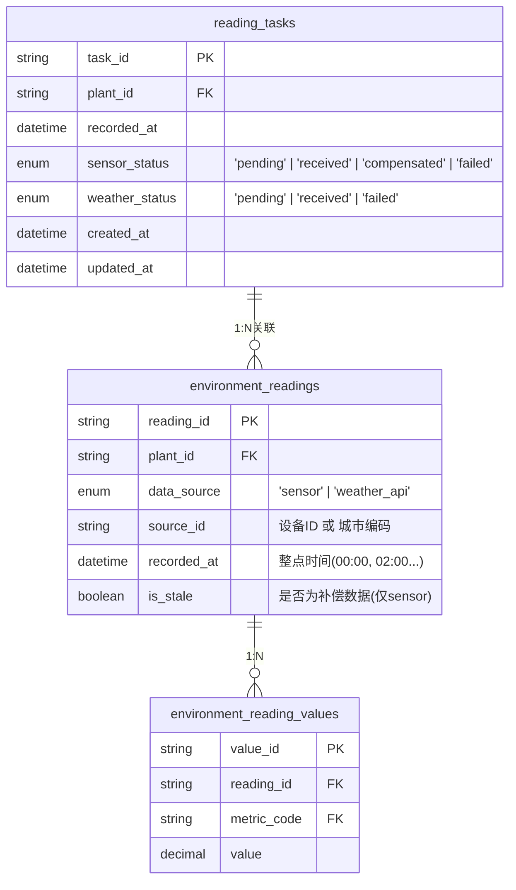
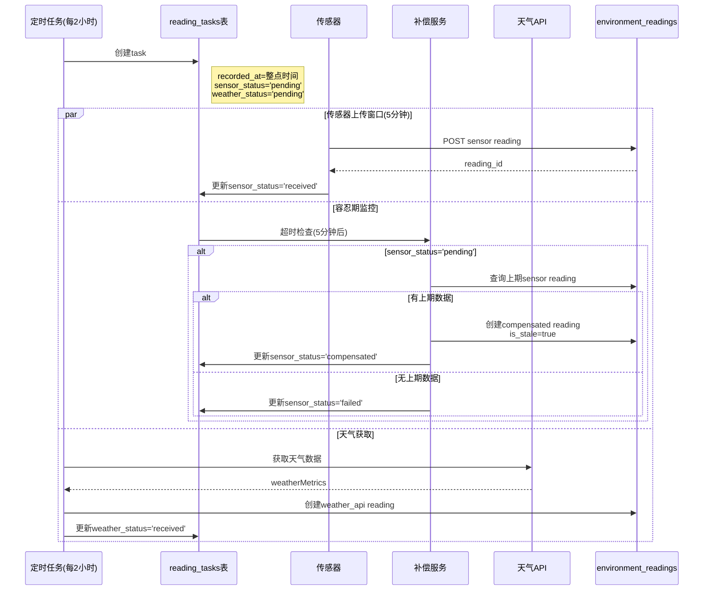
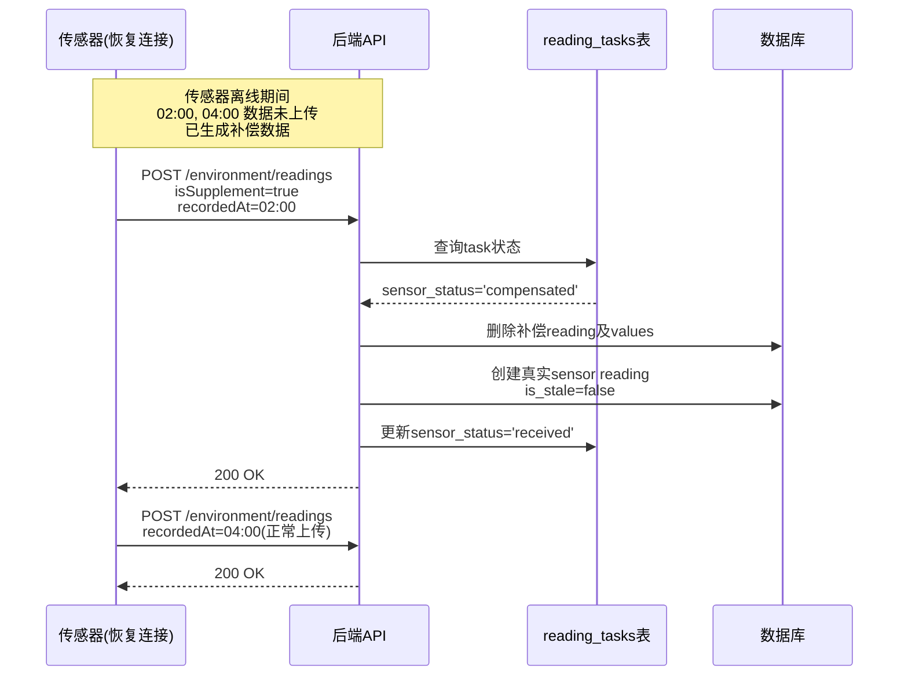

# 环境数据写入与补偿机制

## 元信息
- **状态**: ✅ 已完成
- **优先级**: P0
- **提出时间**: 2026-04-04
- **预计工时**: 8 小时
- **涉及模块**: 后端 / 数据库

---

## 背景

环境Tab页面需要展示植物的实时环境数据，包括：
- **设备指标**: 温度、湿度、光照、土壤湿度等（来自IoT传感器）
- **天气指标**: 温度、湿度、风速、天气状况等（来自天气API）

当前系统缺少完整的数据写入机制，需要实现：
1. 传感器数据接收（含离线补传）
2. 天气数据获取
3. 传感器缺失时的补偿机制
4. 补偿数据被真实数据覆盖的机制

---

## 核心设计

### 数据模型

采用**双Reading设计**：传感器和天气数据分别存储为独立的 reading 记录，通过 `recorded_at` 时间对齐。



### 字段命名规范

| 层级 | 命名规范 | 示例 |
|------|----------|------|
| 数据库表名 | snake_case | `environment_readings`, `reading_tasks` |
| 数据库字段 | snake_case | `plant_id`, `recorded_at`, `is_stale` |
| API请求/响应 | camelCase | `plantId`, `recordedAt`, `isStale` |
| 前端变量 | camelCase | `deviceMetrics`, `taskStatus` |

### 后端配置常量

```javascript
// server/src/config/environment.js
module.exports = {
  // 环境数据同步配置
  SYNC_INTERVAL: 2 * 60 * 60 * 1000,      // 2小时
  TOLERANCE_PERIOD: 5 * 60 * 1000,        // 5分钟容忍期
};
```

---

## 数据流

### 主流程：正常上传与补偿



### 补传流程：传感器离线后恢复



---

## 实现任务清单

### 阶段1: 数据库变更（手动执行 SQL）

> **注意**：开发阶段不使用 Sequelize 迁移，直接修改 `DataBase/smart_garden.sql` 后重建数据库。

| # | 任务 | 文件 | 状态 | 说明 |
|---|------|------|:----:|------|
| 1.1 | 修改 `environment_readings` 表 | `DataBase/smart_garden.sql` | ✅ | 添加 `is_stale` 字段和唯一约束 |
| 1.2 | 创建 `reading_tasks` 表 | `DataBase/smart_garden.sql` | ✅ | 新建任务追踪表 |
| 1.3 | 重建数据库 | MySQL | ⏳ | 开发阶段：删库后重新执行 SQL |
| 1.4 | 更新 Sequelize 模型 | `server/src/models/` | ✅ | 同步模型定义（不执行迁移） |

**已更新的 SQL 变更**：

```sql
-- 1. environment_readings 表新增字段和约束
ALTER TABLE `environment_readings` 
ADD COLUMN `is_stale` tinyint(1) NOT NULL DEFAULT 0 COMMENT '是否为补偿数据（传感器缺失时从历史数据复制）' AFTER `recorded_at`,
ADD UNIQUE INDEX `uk_plant_source_time`(`plant_id`, `data_source`, `recorded_at`),
ADD INDEX `idx_source_stale`(`data_source`, `is_stale`);

-- 2. 新建 reading_tasks 表
CREATE TABLE `reading_tasks`  (
  `task_id` varchar(64) NOT NULL COMMENT '任务ID',
  `plant_id` varchar(64) NOT NULL COMMENT '植物ID',
  `recorded_at` datetime NOT NULL COMMENT '记录时间（整点）',
  `sensor_status` enum('pending','received','compensated','failed') NOT NULL DEFAULT 'pending' COMMENT '传感器数据状态',
  `weather_status` enum('pending','received','failed') NOT NULL DEFAULT 'pending' COMMENT '天气数据状态',
  `created_at` datetime NOT NULL DEFAULT CURRENT_TIMESTAMP,
  `updated_at` datetime NOT NULL DEFAULT CURRENT_TIMESTAMP ON UPDATE CURRENT_TIMESTAMP,
  PRIMARY KEY (`task_id`),
  UNIQUE INDEX `uk_reading_tasks_plant_time`(`plant_id`, `recorded_at`),
  INDEX `idx_reading_tasks_sensor_status`(`sensor_status`),
  INDEX `idx_reading_tasks_weather_status`(`weather_status`),
  CONSTRAINT `reading_tasks_ibfk_1` FOREIGN KEY (`plant_id`) REFERENCES `plants` (`plant_id`) ON DELETE CASCADE
) ENGINE = InnoDB COMMENT = '环境数据读取任务表';
```

**开发阶段重建数据库命令**：
```bash
# 1. 删除并重建数据库
mysql -u root -p -e "DROP DATABASE IF EXISTS smart_garden; CREATE DATABASE smart_garden;"

# 2. 执行更新后的 SQL 文件
mysql -u root -p smart_garden < DataBase/smart_garden.sql
```

### 阶段2: API接口

| # | 任务 | 文件 | 状态 | 说明 |
|---|------|------|:----:|------|
| 2.1 | 传感器上传接口 | `POST /api/environment/readings` | ✅ | 接收传感器数据，支持补传 |
| 2.2 | 查询接口改造 | `GET /api/environment/current` | ✅ | 支持按时间查询sensor+weather两个reading |
| 2.3 | 历史查询改造 | `GET /api/metrics/history` | ✅ | 支持按data_source过滤 |

**传感器上传接口**:
```javascript
// POST /api/environment/readings
// Content-Type: application/json

// 请求体 (正常上传)
{
  "plantId": "PLANT_xxx",
  "recordedAt": "2026-04-04T00:00:00Z",
  "deviceId": "DEVICE_xxx",
  "metrics": [
    { "metricCode": "temperature", "value": 25.5 },
    { "metricCode": "humidity", "value": 60 },
    { "metricCode": "light_intensity", "value": 15000 }
  ]
}

// 请求体 (补传)
{
  "plantId": "PLANT_xxx",
  "recordedAt": "2026-04-04T02:00:00Z",
  "deviceId": "DEVICE_xxx",
  "isSupplement": true,
  "metrics": [...]
}

// 响应
// 200 OK - 成功创建/覆盖
{
  "code": 200,
  "data": {
    "readingId": "READ_xxx",
    "recordedAt": "2026-04-04T00:00:00Z",
    "isSupplement": false,
    "isStale": false
  }
}

// 409 Conflict - 已有真实数据，拒绝补传
{
  "code": 409,
  "message": "该时刻已有真实传感器数据，拒绝补传"
}
```

**上传处理逻辑**:
```javascript
async function handleSensorUpload(req, res) {
  const { plantId, recordedAt, deviceId, isSupplement, metrics } = req.body;
  
  // 1. 查找task
  let task = await ReadingTask.findOne({
    where: { plantId, recordedAt }
  });
  
  // 2. 无task时创建（支持很久以前的补传）
  if (!task) {
    task = await ReadingTask.create({
      taskId: generateId(),
      plantId,
      recordedAt,
      sensorStatus: 'pending',
      weatherStatus: 'failed',
    });
  }
  
  // 3. 根据状态处理
  switch (task.sensorStatus) {
    case 'received':
      if (isSupplement) {
        return res.status(409).json({
          code: 409,
          message: '该时刻已有真实传感器数据，拒绝补传'
        });
      }
      return res.json({ code: 200, data: { ... } });
      
    case 'compensated':
      await coverCompensatedData(task, { plantId, recordedAt, deviceId, metrics });
      break;
      
    case 'failed':
    case 'pending':
      await createSensorReading(task, { plantId, recordedAt, deviceId, metrics });
      break;
  }
  
  res.json({
    code: 200,
    data: {
      readingId: newReadingId,
      recordedAt,
      isSupplement: task.sensorStatus === 'compensated',
      isStale: false
    }
  });
}
```

### 阶段3: 定时任务服务

| # | 任务 | 文件 | 状态 | 说明 |
|---|------|------|:----:|------|
| 3.1 | 创建配置常量 | `server/src/config/environment.js` | ✅ | SYNC_INTERVAL, TOLERANCE_PERIOD |
| 3.2 | 创建定时任务服务 | `server/src/jobs/environmentSyncJob.js` | ✅ | 每2小时执行 |
| 3.3 | Task生成逻辑 | 同上 | ✅ | 为所有植物生成reading_task |
| 3.4 | 天气数据获取 | 同上 | ✅ | 调用weatherService，创建weather reading |
| 3.5 | 补偿服务 | `server/src/services/compensationService.js` | ✅ | 扫描超时task，执行补偿 |

**定时任务执行时间线**:
```
00:00:00 - 生成所有植物的task
00:00:00 - 获取天气数据，创建weather reading
00:00:00~00:05:00 - 等待传感器上传
00:05:00 - 扫描超时task，执行补偿
```

**补偿检查逻辑**:
```javascript
const { TOLERANCE_PERIOD } = require('../config/environment');

async function checkAndCompensate(task) {
  const recordedAt = task.recordedAt.getTime();
  const deadline = recordedAt + TOLERANCE_PERIOD;
  
  if (Date.now() > deadline && task.sensorStatus === 'pending') {
    await compensateSensorReading(task);
  }
}
```

### 阶段4: 补偿逻辑

| # | 任务 | 文件 | 状态 | 说明 |
|---|------|------|:----:|------|
| 4.1 | 查询上期数据 | `compensationService.js` | ✅ | 查找最近的有效sensor reading |
| 4.2 | 复制指标值 | 同上 | ✅ | 创建新的reading_values，复制上期值 |
| 4.3 | 标记is_stale | 同上 | ✅ | 新reading标记is_stale=true |
| 4.4 | 更新task | 同上 | ✅ | 标记sensor_status='compensated' |

**补偿逻辑**:
```javascript
async function compensateSensorReading(task) {
  // 1. 查找上期sensor reading（优先非补偿数据）
  const lastReading = await EnvironmentReading.findOne({
    where: {
      plantId: task.plantId,
      dataSource: 'sensor',
      recordedAt: { [Op.lt]: task.recordedAt },
    },
    order: [['recordedAt', 'DESC']],
    include: [{ model: EnvironmentReadingValue, as: 'values' }],
  });
  
  if (!lastReading) {
    await task.update({ sensorStatus: 'failed' });
    return;
  }
  
  // 2. 创建补偿reading
  const compensated = await EnvironmentReading.create({
    readingId: generateId(),
    plantId: task.plantId,
    dataSource: 'sensor',
    sourceId: lastReading.sourceId,
    recordedAt: task.recordedAt,
    isStale: true,
  });
  
  // 3. 复制指标值
  for (const val of lastReading.values) {
    await EnvironmentReadingValue.create({
      valueId: generateId(),
      readingId: compensated.readingId,
      metricCode: val.metricCode,
      value: val.value,
    });
  }
  
  // 4. 更新task
  await task.update({ sensorStatus: 'compensated' });
}
```

### 阶段5: 补传覆盖逻辑

| # | 任务 | 文件 | 状态 | 说明 |
|---|------|------|:----:|------|
| 5.1 | 删除补偿数据 | `environmentController.js` | ✅ | 删除补偿reading及values |
| 5.2 | 创建真实数据 | 同上 | ✅ | 创建真实sensor reading |
| 5.3 | 更新task状态 | 同上 | ✅ | 标记sensor_status='received' |

**覆盖补偿数据逻辑**:
```javascript
async function coverCompensatedData(task, data) {
  // 1. 查找并删除补偿reading
  const compensatedReading = await EnvironmentReading.findOne({
    where: {
      plantId: task.plantId,
      recordedAt: task.recordedAt,
      dataSource: 'sensor',
      isStale: true,
    }
  });
  
  if (compensatedReading) {
    await EnvironmentReadingValue.destroy({
      where: { readingId: compensatedReading.readingId }
    });
    await compensatedReading.destroy();
  }
  
  // 2. 创建真实reading
  const realReading = await EnvironmentReading.create({
    readingId: generateId(),
    plantId: data.plantId,
    dataSource: 'sensor',
    sourceId: data.deviceId,
    recordedAt: data.recordedAt,
    isStale: false,
  });
  
  // 3. 创建真实values
  for (const metric of data.metrics) {
    await EnvironmentReadingValue.create({
      valueId: generateId(),
      readingId: realReading.readingId,
      metricCode: metric.metricCode,
      value: metric.value,
    });
  }
  
  // 4. 更新task
  await task.update({ sensorStatus: 'received' });
  
  return realReading;
}
```

---

## 边界情况处理

| 场景 | 处理方案 |
|------|----------|
| 传感器在5分钟内上传 | 正常创建reading，sensor_status='received' |
| 传感器超时，有上期数据 | 创建补偿reading，is_stale=true，sensor_status='compensated' |
| 传感器超时，无上期数据 | sensor_status='failed'，该时刻无sensor数据 |
| 天气API失败 | weather_status='failed'，该时刻无weather数据 |
| 植物未绑定设备 | 不生成sensor task，只获取weather |
| 植物无位置信息 | 不获取weather，只等待sensor |
| 传感器补传，覆盖补偿数据 | 删除补偿reading，创建真实reading，更新task |
| 传感器补传，已有真实数据 | 拒绝补传，返回409 Conflict |
| 传感器补传，无task记录 | 创建task（已过期），创建真实reading |

---

## 前端影响

### 查询响应格式

```javascript
// GET /api/environment/current?plantId=xxx
{
  "code": 200,
  "data": {
    "recordedAt": "2026-04-04T00:00:00Z",
    "deviceMetrics": [
      {
        "metricCode": "temperature",
        "value": 25.5,
        "unit": "°C",
        "isStale": true
      }
    ],
    "weatherMetrics": [
      {
        "metricCode": "temperature",
        "value": 22.0,
        "unit": "°C"
      }
    ],
    "taskStatus": {
      "sensor": "compensated",
      "weather": "received"
    }
  }
}
```

### 展示策略

| 数据状态 | 展示效果 |
|----------|----------|
| isStale=false | 正常显示 |
| isStale=true | 显示数值 + "⚠️ 补偿数据" 提示（图表中斜率为0，数据点特殊样式） |
| sensor failed | 显示 "--" 或 "设备离线" |

### 图表中的补偿数据识别

```javascript
// 历史数据查询结果
[
  { time: '00:00', value: 25, isStale: false },
  { time: '02:00', value: 25, isStale: true },   // 补偿数据，斜率为0
  { time: '04:00', value: 27, isStale: false },
]

// 图表渲染
// - isStale=true 的数据点：显示为虚线/灰色/特殊标记
// - 连续两个isStale=true：斜率自然为0，表明数据停滞
```

---

## 传感器端实现建议

```javascript
// 传感器端伪代码
class SensorTaskManager {
  constructor(deviceId, plantId) {
    this.deviceId = deviceId;
    this.plantId = plantId;
    this.pendingTasks = new Map();
    this.syncInterval = 2 * 60 * 60 * 1000;
    this.tolerancePeriod = 5 * 60 * 1000;
  }
  
  generateTask(recordedAt) {
    const task = {
      recordedAt,
      deadline: new Date(recordedAt.getTime() + this.tolerancePeriod),
      status: 'pending',
      data: null,
      retryCount: 0,
    };
    this.pendingTasks.set(recordedAt.toISOString(), task);
  }
  
  collectData(recordedAt, metrics) {
    const key = recordedAt.toISOString();
    const task = this.pendingTasks.get(key);
    if (task) {
      task.data = metrics;
    }
  }
  
  async tryUpload(recordedAt) {
    const key = recordedAt.toISOString();
    const task = this.pendingTasks.get(key);
    if (!task || !task.data) return false;
    
    const isSupplement = Date.now() > task.deadline.getTime();
    
    try {
      await api.post('/environment/readings', {
        plantId: this.plantId,
        recordedAt: recordedAt.toISOString(),
        deviceId: this.deviceId,
        isSupplement,
        metrics: task.data,
      });
      task.status = 'uploaded';
      this.pendingTasks.delete(key);
      return true;
    } catch (err) {
      if (err.response?.status === 409) {
        task.status = 'uploaded';
        this.pendingTasks.delete(key);
        return true;
      }
      task.retryCount++;
      if (task.retryCount >= 3) {
        task.status = 'failed';
      }
      return false;
    }
  }
  
  async batchUploadOnReconnect() {
    for (const [key, task] of this.pendingTasks) {
      if (task.status === 'pending' && task.data) {
        await this.tryUpload(new Date(key));
      }
    }
  }
}
```

---

## 相关文档

- [环境Tab需求分析](../.trae/documents/environment-tab-requirements.md)
- [数据库设计](../../DataBase/smart_garden.sql)
- [天气服务实现](../server/src/services/weatherService.js)

---

## 更新记录

| 日期 | 版本 | 变更内容 |
|:---|:---:|:---|
| 2026-04-04 | v1.0 | 创建TODO，确定双Reading设计方案 |
| 2026-04-04 | v1.1 | 添加补传机制，统一字段命名规范 |
| 2026-04-04 | v1.2 | **简化设计**：移除sensor_deadline和compensated_from_reading_id字段，使用后端常量 |
| 2026-04-04 | v1.3 | **实现完成**：阶段1-5全部实现，包括数据库变更、API接口、定时任务、补偿服务、补传覆盖逻辑 |
