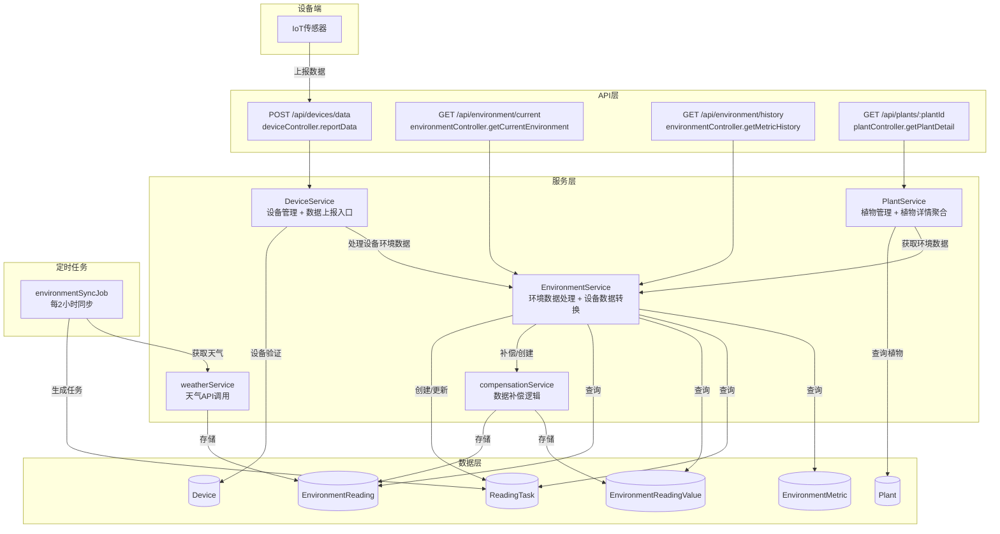
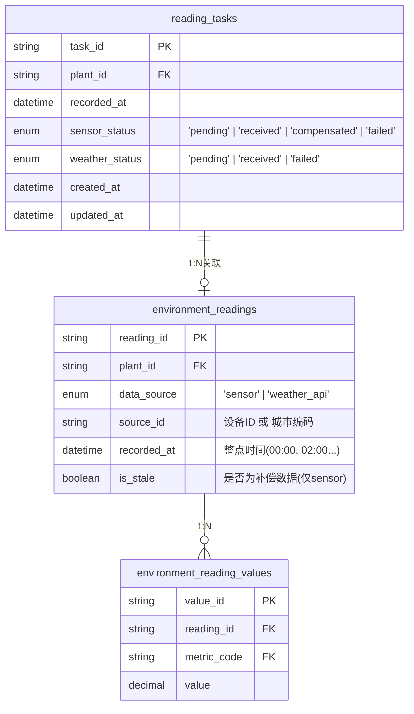
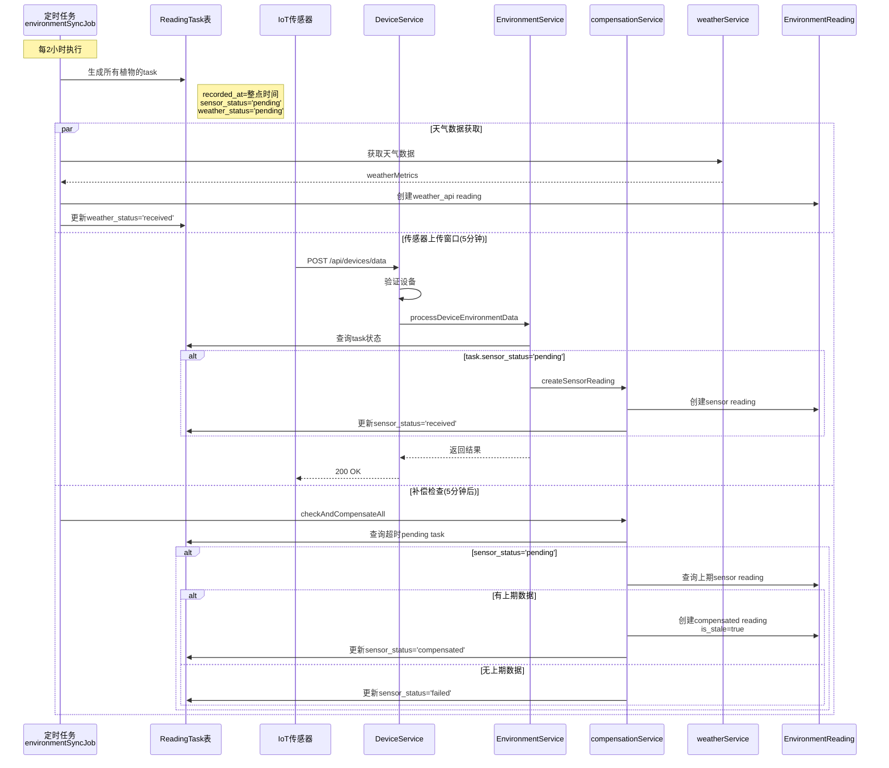
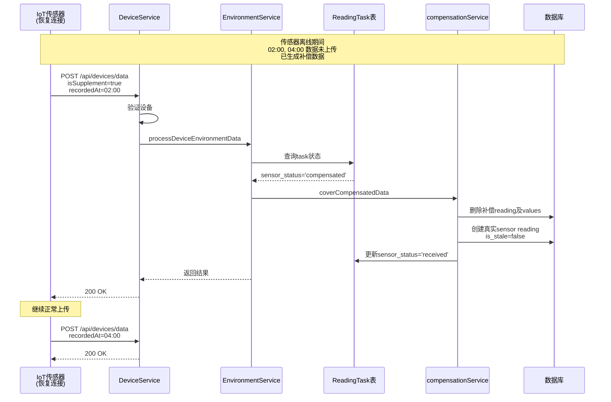

# 环境数据上传与补偿机制 v2

## 元信息
- **状态**: ✅ 已完成
- **优先级**: P0
- **提出时间**: 2026-04-06
- **预计工时**: 8 小时
- **涉及模块**: 后端 / 数据库 / 定时任务
- **版本**: v2.1（基于现有架构重构）

---

## 背景

环境Tab页面需要展示植物的实时环境数据，包括：
- **设备指标**: 温度、湿度、光照、土壤湿度等（来自IoT传感器）
- **天气指标**: 温度、湿度、风速、天气状况等（来自天气API）

当前系统缺少完整的数据上传机制，需要实现：
1. 传感器数据接收（含离线补传）
2. 天气数据获取
3. 传感器缺失时的补偿机制
4. 补偿数据被真实数据覆盖的机制

---

## 核心设计

### 架构层次



### 数据模型

采用**双Reading设计**：传感器和天气数据分别存储为独立的 reading 记录，通过 `recorded_at` 时间对齐。



### 字段命名规范

| 层级 | 命名规范 | 示例 |
|------|----------|------|
| 数据库表名 | snake_case | `environment_readings`, `reading_tasks` |
| 数据库字段 | snake_case | `plant_id`, `recorded_at`, `is_stale` |
| API请求/响应 | camelCase | `plantId`, `recordedAt`, `isStale` |
| 前端变量 | camelCase | `deviceMetrics`, `taskStatus` |

### 后端配置常量

```javascript
// server/src/config/environment.js
module.exports = {
  SYNC_INTERVAL: 2 * 60 * 60 * 1000,      // 2小时
  TOLERANCE_PERIOD: 5 * 60 * 1000,        // 5分钟容忍期
  
  DATA_SOURCE: {
    SENSOR: 'sensor',
    WEATHER_API: 'weather_api',
  },
  
  TASK_STATUS: {
    SENSOR: {
      PENDING: 'pending',
      RECEIVED: 'received',
      COMPENSATED: 'compensated',
      FAILED: 'failed',
    },
    WEATHER: {
      PENDING: 'pending',
      RECEIVED: 'received',
      FAILED: 'failed',
    },
  },
};
```

---

## 数据流

### 主流程：正常上传与补偿



### 补传流程：传感器离线后恢复



---

## API接口设计

### 1. 设备数据上报接口

**路由**: `POST /api/devices/data`  
**控制器**: `deviceController.reportData`  
**服务**: `DeviceService.reportDeviceData` → `EnvironmentService.processDeviceEnvironmentData`  
**认证**: 设备认证（deviceAuthMiddleware）

#### 请求体

```javascript
// 正常上传
{
  "deviceId": "DEVICE_xxx",
  "plantId": "PLANT_xxx",           // 可选，不传则使用设备绑定的植物
  "timestamp": "2026-04-06T00:00:00Z",  // 可选，不传则使用当前时间
  "metrics": {
    "temperature": 25.5,
    "humidity": 60,
    "light_intensity": 15000,
    "soil_moisture": 45,
    "battery_level": 80             // 特殊字段，用于更新设备电量
  }
}

// 补传
{
  "deviceId": "DEVICE_xxx",
  "plantId": "PLANT_xxx",
  "timestamp": "2026-04-06T02:00:00Z",
  "isSupplement": true,             // 标记为补传
  "metrics": {...}
}
```

#### 响应

```javascript
// 200 OK - 成功创建
{
  "code": 200,
  "message": "数据上报成功",
  "data": {
    "readingId": "READ_xxx",
    "plantId": "PLANT_xxx",
    "recordedAt": "2026-04-06T00:00:00Z",
    "isSupplement": false,
    "isStale": false
  }
}

// 200 OK - 覆盖补偿数据
{
  "code": 200,
  "message": "数据上报成功",
  "data": {
    "readingId": "READ_xxx",
    "plantId": "PLANT_xxx",
    "recordedAt": "2026-04-06T02:00:00Z",
    "isSupplement": true,
    "isStale": false
  }
}

// 409 Conflict - 已有真实数据，拒绝补传
{
  "code": 409,
  "message": "该时刻已有真实传感器数据，拒绝补传"
}

// 404 Not Found - 设备不存在
{
  "code": 404,
  "message": "设备不存在"
}

// 400 Bad Request - 设备未绑定植物
{
  "code": 400,
  "message": "设备未绑定植物"
}
```

#### 处理流程

```javascript
// DeviceService.reportDeviceData
async reportDeviceData(reportData) {
  const { deviceId, plantId, timestamp, metrics, isSupplement } = reportData;
  
  // 1. 验证设备
  const device = await this.getDeviceById(deviceId);
  if (!device) return { error: '设备不存在', code: 404 };
  
  // 2. 确定目标植物
  const targetPlantId = plantId || device.bound_plant_id;
  if (!targetPlantId) return { error: '设备未绑定植物', code: 400 };
  
  // 3. 验证植物
  const plant = await Plant.findOne({ where: { plant_id: targetPlantId } });
  if (!plant) return { error: '植物不存在', code: 404 };
  
  // 4. 格式化指标数据
  const formattedMetrics = Object.entries(metrics)
    .filter(([code]) => code !== 'battery_level')
    .map(([metricCode, value]) => ({ metricCode, value }));
  
  // 5. 调用EnvironmentService处理设备环境数据
  const environmentService = new EnvironmentService();
  const uploadResult = await environmentService.processDeviceEnvironmentData(targetPlantId, {
    deviceId,
    recordedAt: timestamp || new Date().toISOString(),
    metrics: formattedMetrics,
    isSupplement: isSupplement || false,
  });
  
  if (uploadResult.error) return uploadResult;
  
  // 6. 更新设备状态
  const updateData = {
    status: 'online',
    last_heartbeat: new Date(),
  };
  if (metrics.battery_level !== undefined) {
    updateData.battery_level = metrics.battery_level;
  }
  await device.update(updateData);
  
  return uploadResult;
}
```

### 2. 环境数据查询接口

**路由**: `GET /api/environment/current`  
**控制器**: `environmentController.getCurrentEnvironment`  
**服务**: `EnvironmentService.getCurrentData`  
**认证**: 用户认证（authMiddleware）

#### 请求参数

```
?plantId=PLANT_xxx&recordedAt=2026-04-06T00:00:00Z
```

#### 响应

```javascript
{
  "code": 200,
  "data": {
    "plantId": "PLANT_xxx",
    "recordedAt": "2026-04-06T00:00:00Z",
    "deviceMetrics": [
      {
        "metricCode": "temperature",
        "name": "温度",
        "value": 25.5,
        "unit": "°C",
        "icon": "🌡️",
        "status": "normal",
        "minValue": 10,
        "maxValue": 35,
        "isStale": false
      }
    ],
    "weatherMetrics": [
      {
        "metricCode": "temperature",
        "name": "温度",
        "value": 22.0,
        "unit": "°C",
        "icon": "🌡️",
        "status": "normal",
        "minValue": null,
        "maxValue": null,
        "isStale": false
      }
    ],
    "taskStatus": {
      "sensor": "received",
      "weather": "received"
    }
  }
}
```

### 3. 历史数据查询接口

**路由**: `GET /api/environment/history`  
**控制器**: `environmentController.getMetricHistory`  
**服务**: `EnvironmentService.getHistoryData`  
**认证**: 用户认证（authMiddleware）

#### 请求参数

```
?plantId=PLANT_xxx&metricCode=temperature&timeRange=7d&dataSource=sensor
```

#### 响应

```javascript
{
  "code": 200,
  "data": {
    "list": [
      {
        "time": "2026-04-06T00:00:00Z",
        "value": 25.5,
        "isStale": false
      },
      {
        "time": "2026-04-06T02:00:00Z",
        "value": 25.5,
        "isStale": true
      }
    ],
    "metricCode": "temperature",
    "metricName": "温度",
    "unit": "°C",
    "timeRange": "7d"
  }
}
```

---

## 服务层设计

### DeviceService

**职责**: 设备管理 + 数据上报入口

**核心方法**:

| 方法 | 说明 |
|------|------|
| `bindDevice(userId, bindData)` | 绑定设备到植物 |
| `unbindDevice(deviceId, userId)` | 解绑设备 |
| `getDeviceList(userId)` | 获取用户设备列表 |
| `getDeviceById(deviceId, userId)` | 获取设备详情 |
| `reportDeviceData(reportData)` | 设备数据上报入口 |

**关键逻辑**:
- 验证设备存在性和绑定关系
- 格式化指标数据（过滤battery_level）
- 调用EnvironmentService处理设备环境数据
- 更新设备状态和心跳时间

### EnvironmentService

**职责**: 环境数据处理 + 设备数据转换

**核心方法**:

| 方法 | 说明 |
|------|------|
| `processDeviceEnvironmentData(plantId, data)` | 处理设备上报的环境数据 |
| `getCurrentData(plantId, recordedAt)` | 获取当前环境数据 |
| `getHistoryData(plantId, query)` | 获取历史环境数据 |

**关键逻辑**:
- 管理ReadingTask状态
- 调用compensationService处理补偿和创建逻辑
- 查询和格式化环境数据

**被调用方**:
- DeviceService.reportDeviceData - 处理设备上报的环境数据
- PlantService.getPlantDetail - 获取植物详情中的环境数据
- environmentController - 处理环境数据查询请求

### PlantService

**职责**: 植物管理 + 植物详情聚合

**核心方法**:

| 方法 | 说明 |
|------|------|
| `createPlant(userId, plantData)` | 创建植物 |
| `getPlantList(userId, query)` | 获取植物列表 |
| `getPlantDetail(plantId, userId)` | 获取植物详情 |
| `updatePlant(plantId, userId, updateData)` | 更新植物 |

**关键逻辑**:
- 聚合植物、设备、诊断、养护记录、环境数据
- 使用 EnvironmentService.getCurrentData 获取环境数据
- 返回完整的植物详情信息

### compensationService

**职责**: 数据补偿逻辑

**核心方法**:

| 方法 | 说明 |
|------|------|
| `checkAndCompensateAll()` | 检查并执行所有超时任务的补偿 |
| `compensateSensorReading(task)` | 对单个任务执行补偿 |
| `coverCompensatedData(task, data)` | 覆盖补偿数据（传感器补传时） |
| `createSensorReading(task, data)` | 创建传感器reading |
| `createWeatherReading(plantId, recordedAt, metrics, locationCode)` | 创建天气reading |

**关键逻辑**:
- 查询上期数据用于补偿
- 使用事务确保数据一致性
- 标记补偿数据（is_stale=true）

### weatherService

**职责**: 天气API调用和数据转换

**核心方法**:

| 方法 | 说明 |
|------|------|
| `getCurrentWeather(locationCode, lat, lng)` | 获取实时天气 |
| `getAstronomyData(locationCode, lat, lng, date)` | 获取天文数据 |
| `getWeatherForPlant(plant)` | 获取植物位置的天气数据 |
| `convertToMetrics(weatherData, astroData)` | 转换为指标格式 |

---

## 定时任务设计

### environmentSyncJob

**职责**: 环境数据同步定时任务

**执行周期**:
- 主同步任务：每2小时执行
- 补偿检查：每10分钟执行

**核心函数**:

| 函数 | 说明 |
|------|------|
| `start()` | 启动定时任务 |
| `stop()` | 停止定时任务 |
| `runSync()` | 执行完整同步流程 |
| `runCompensation()` | 执行补偿检查 |
| `generateTasksForAllPlants()` | 为所有植物生成reading_task |
| `fetchWeatherForAllPlants()` | 为所有植物获取天气数据 |

**执行时间线**:
```
00:00:00 - 生成所有植物的task
00:00:00 - 获取天气数据，创建weather reading
00:00:00~00:05:00 - 等待传感器上传
00:05:00 - 扫描超时task，执行补偿
```

---

## 边界情况处理

| 场景 | 处理方案 |
|------|----------|
| 传感器在5分钟内上传 | 正常创建reading，sensor_status='received' |
| 传感器超时，有上期数据 | 创建补偿reading，is_stale=true，sensor_status='compensated' |
| 传感器超时，无上期数据 | sensor_status='failed'，该时刻无sensor数据 |
| 天气API失败 | weather_status='failed'，该时刻无weather数据 |
| 植物未绑定设备 | 不生成sensor task，只获取weather |
| 植物无位置信息 | 不获取weather，只等待sensor |
| 传感器补传，覆盖补偿数据 | 删除补偿reading，创建真实reading，更新task |
| 传感器补传，已有真实数据 | 拒绝补传，返回409 Conflict |
| 传感器补传，无task记录 | 创建task（已过期），创建真实reading |

---

## 前端影响

### API 调用

#### 获取指标历史数据

```javascript
// utils/api.js
function getMetricHistory(plantId, metricCode, timeRange, dataSource) {
  var params = '?plantId=' + plantId + '&metricCode=' + metricCode + '&timeRange=' + (timeRange || '7d');
  if (dataSource) {
    params += '&dataSource=' + dataSource;
  }
  return get('/environment/history' + params).then(function(res) {
    return res || {};
  });
}

// 数据源映射
// device -> sensor
// weather -> weather_api
```

#### metric-detail 页面

```javascript
// pages/metric-detail/metric-detail.js
loadChartData() {
  const { currentRange, plantId, metricCode, dataSource } = this.data;
  
  // 将前端数据源映射到后端数据源
  const apiDataSource = dataSource === 'device' ? 'sensor' : 
                        dataSource === 'weather' ? 'weather_api' : null;
  
  api.getMetricHistory(plantId, metricCode, currentRange, apiDataSource).then(function(result) {
    // ...
  });
}
```

### 查询响应格式

```javascript
// GET /api/environment/current?plantId=xxx
{
  "code": 200,
  "data": {
    "recordedAt": "2026-04-06T00:00:00Z",
    "deviceMetrics": [
      {
        "metricCode": "temperature",
        "value": 25.5,
        "unit": "°C",
        "isStale": true
      }
    ],
    "weatherMetrics": [
      {
        "metricCode": "temperature",
        "value": 22.0,
        "unit": "°C"
      }
    ],
    "taskStatus": {
      "sensor": "compensated",
      "weather": "received"
    }
  }
}
```

### 展示策略

| 数据状态 | 展示效果 |
|----------|----------|
| isStale=false | 正常显示 |
| isStale=true | 显示数值 + "⚠️ 补偿数据" 提示 |
| sensor failed | 显示 "--" 或 "设备离线" |

### 图表中的补偿数据识别

```javascript
// 历史数据查询结果
[
  { time: '00:00', value: 25, isStale: false },
  { time: '02:00', value: 25, isStale: true },   // 补偿数据
  { time: '04:00', value: 27, isStale: false },
]

// 图表渲染
// - isStale=true 的数据点：显示为虚线/灰色/特殊标记
```

---

## 传感器端实现建议

```javascript
// 传感器端伪代码
class SensorTaskManager {
  constructor(deviceId, plantId) {
    this.deviceId = deviceId;
    this.plantId = plantId;
    this.pendingTasks = new Map();
    this.syncInterval = 2 * 60 * 60 * 1000;
    this.tolerancePeriod = 5 * 60 * 1000;
  }
  
  generateTask(recordedAt) {
    const task = {
      recordedAt,
      deadline: new Date(recordedAt.getTime() + this.tolerancePeriod),
      status: 'pending',
      data: null,
      retryCount: 0,
    };
    this.pendingTasks.set(recordedAt.toISOString(), task);
  }
  
  collectData(recordedAt, metrics) {
    const key = recordedAt.toISOString();
    const task = this.pendingTasks.get(key);
    if (task) {
      task.data = metrics;
    }
  }
  
  async tryUpload(recordedAt) {
    const key = recordedAt.toISOString();
    const task = this.pendingTasks.get(key);
    if (!task || !task.data) return false;
    
    const isSupplement = Date.now() > task.deadline.getTime();
    
    try {
      await api.post('/api/devices/data', {
        deviceId: this.deviceId,
        plantId: this.plantId,
        timestamp: recordedAt.toISOString(),
        isSupplement,
        metrics: task.data,
      });
      task.status = 'uploaded';
      this.pendingTasks.delete(key);
      return true;
    } catch (err) {
      if (err.response?.status === 409) {
        task.status = 'uploaded';
        this.pendingTasks.delete(key);
        return true;
      }
      task.retryCount++;
      if (task.retryCount >= 3) {
        task.status = 'failed';
      }
      return false;
    }
  }
  
  async batchUploadOnReconnect() {
    for (const [key, task] of this.pendingTasks) {
      if (task.status === 'pending' && task.data) {
        await this.tryUpload(new Date(key));
      }
    }
  }
}
```

---

## 相关文档

- [环境Tab需求分析](../.trae/documents/environment-tab-requirements.md)
- [数据库设计](../../DataBase/smart_garden.sql)
- [天气服务实现](../server/src/services/weatherService.js)

---

## 更新记录

| 日期 | 版本 | 变更内容 |
|:---|:---:|:---|
| 2026-04-06 | v2.0 | 基于现有架构重构，使用实际API接口和服务层设计 |
| 2026-04-06 | v2.1 | PlantService 使用 EnvironmentService 获取环境数据；前端添加 dataSource 参数支持 |
