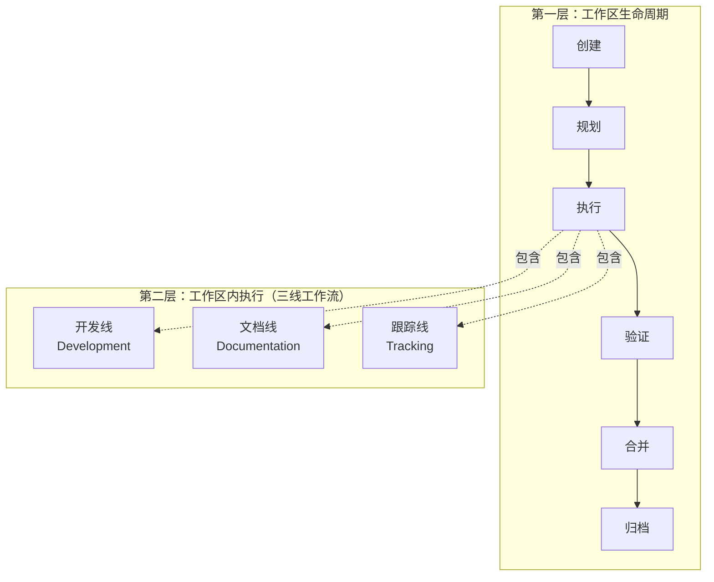
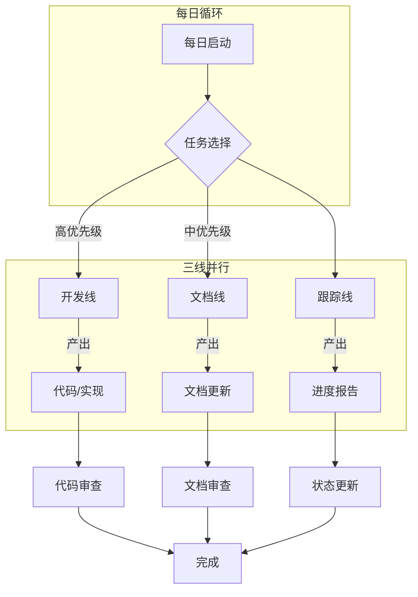
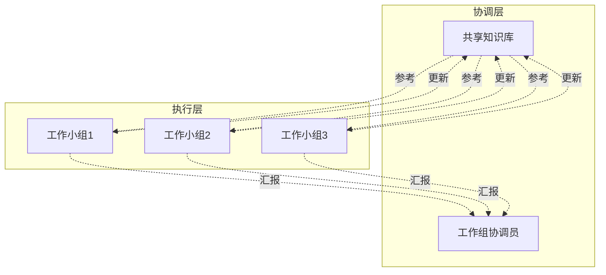

# 工作区模式说明

## 元信息
- **文档类型**: 工作方法
- **版本**: V2.0
- **创建日期**: 2026-04-07
- **更新日期**: 2026-04-11
- **状态**: 已验证

---

## 一、模式概述

**工作区模式**是一种隔离式任务管理方法，通过创建独立的工作空间来完成特定事务，待事务结束后再合并到主项目。

### 核心思想

```
主项目/                          # 生产环境（稳定）
├── 代码/
├── 文档/
├── 配置/
└── {任务名}工作小组/            # 工作区（隔离开发）
    ├── 01-方案与规范/
    ├── 02-执行记录/
    ├── 03-跟踪与报告/
    └── 04-工作方法/
```

类似于：
- Git 的 feature branch
- Docker 的容器
- 数据库的事务
- 软件开发的沙盒

---

## 二、模式架构

### 2.1 双层架构



**说明**：
- **工作区模式**是**容器层** - 管理工作区的完整生命周期
- **三线工作流**是**执行层** - 管理"执行"阶段内的具体工作方式
- 两者是**互补关系**，不是冲突关系

### 2.2 目录结构标准

基于实际执行经验，推荐以下标准结构：

```
{任务名}工作小组/
├── README.md                    # 工作区入口说明
├── 01-方案与规范/               # 规划和标准
│   ├── {任务}方案.md            # 详细方案设计
│   └── 执行规范.md              # 执行标准和工具规范
├── 02-执行记录/                 # 执行过程记录
│   ├── 路径1-{子任务}.md
│   ├── 路径2-{子任务}.md
│   └── ...
├── 03-跟踪与报告/               # 跟踪和报告
│   ├── 问题清单.md
│   ├── 执行报告.md
│   └── 完成报告.md
└── 04-工作方法/                 # 方法沉淀（可选）
    └── 工作区模式说明.md
```

---

## 三、生命周期详解

### 3.1 完整生命周期

```
创建 → 规划 → 执行 → 验证 → 合并 → 归档
```

| 阶段 | 动作 | 输出 | 说明 |
|:---|:---|:---|:---|
| **创建** | 建立工作区目录 | 工作区/ | 使用标准命名规范 |
| **规划** | 编写方案和规范 | 方案.md, 规范.md | 明确目标、范围、验收标准 |
| **执行** | 实施具体任务 | 执行记录 | **使用三线工作流**并行执行 |
| **验证** | 按清单检查 | 验证报告 | 确保质量达标 |
| **合并** | 应用到主项目 | 主项目更新 | 小步提交，便于回滚 |
| **归档** | 保留或删除工作区 | 历史记录 | 知识沉淀到 docs/current/ |

### 3.2 "执行"阶段的三线工作流

在"执行"阶段内部，使用**三线并行工作流**提高效率：



**三线职责**：

| 工作线 | 核心职责 | 每日输出 |
|:---|:---|:---|
| **开发线** | 实现功能、修复缺陷、编写测试 | 代码变更、测试报告 |
| **文档线** | 同步更新文档、记录决策 | 文档更新记录 |
| **跟踪线** | 跟踪进度、识别风险、调整优先级 | 进度报告、风险预警 |

---

## 四、命名规范

### 4.1 工作区命名

```
{任务描述}工作小组/

示例：
- 文档重组工作小组/
- 静态分析工作小组/
- 运维监控工作小组/
- API重构工作小组/
```

### 4.2 执行记录命名

```
路径{序号}-{子任务描述}.md

示例：
- 路径1-前端数据流分析.md
- 路径2-后端请求链路分析.md
- 路径3-数据模型分析.md
```

---

## 五、使用场景

### 5.1 适用场景

- ✅ 大型文档重组（如：文档重组工作小组）
- ✅ 代码静态分析（如：静态分析工作小组）
- ✅ 运维监控（如：运维监控工作小组）
- ✅ 代码重构
- ✅ 数据库迁移
- ✅ 架构升级
- ✅ 配置变更
- ✅ 任何有风险的批量操作

### 5.2 不适用场景

- ❌ 简单的单行修改
- ❌ 紧急热修复
- ❌ 已经充分验证的例行操作

---

## 六、多工作小组协作

### 6.1 协作架构

当多个工作小组并行工作时：



### 6.2 协作规范

| 场景 | 规范 |
|:---|:---|
| **依赖关系** | 在 README.md 中明确说明依赖的其他工作小组 |
| **知识共享** | 将可复用的方法沉淀到 `docs/current/11-knowledge/` |
| **状态同步** | 每日更新 README.md 中的"当前工作状态" |
| **冲突避免** | 不同工作小组不修改同一批文件 |

---

## 七、最佳实践

### 7.1 创建时

- [ ] 明确任务边界和目标
- [ ] 制定清晰的验收标准
- [ ] 准备回滚方案
- [ ] 识别依赖的其他工作小组

### 7.2 规划时

- [ ] 编写详细的方案文档
- [ ] 制定执行规范
- [ ] 分解为可执行的"路径"
- [ ] 设定优先级（P0/P1/P2/P3）

### 7.3 执行时

- [ ] 使用三线工作流并行执行
- [ ] 所有操作在工作区内完成
- [ ] 及时记录决策和变更
- [ ] 保持与主项目的同步

### 7.4 验证时

- [ ] 使用 checklist 逐项验证
- [ ] 检查文档一致性
- [ ] 确保无遗漏项

### 7.5 合并时

- [ ] 小步提交，便于回滚
- [ ] 保留工作区作为历史记录
- [ ] 更新主项目文档引用

### 7.6 归档时

- [ ] 编写完成报告
- [ ] 沉淀可复用的方法
- [ ] 更新知识库
- [ ] 可选择删除或保留工作区

---

## 八、成功案例

### 8.1 文档重组工作小组

```
MVP/
├── docs/                          # 主项目文档（已更新）
├── 文档重组工作小组/               # 工作区
│   ├── 01-方案与规范/
│   ├── 02-执行记录/
│   ├── 03-跟踪与报告/
│   └── 04-工作方法/
└── ...
```

**成果**：
- ✅ 110 个文档安全重组
- ✅ 零数据丢失
- ✅ 完整的过程记录
- ✅ 可复用的方法沉淀

### 8.2 静态分析工作小组

**特点**：
- 6条分析路径并行执行
- 系统性代码质量检查
- 问题清单跟踪至修复

### 8.3 运维监控工作小组

**特点**：
- 持续性工作（非一次性）
- 周期性监控报告
- 实时监控与告警

---

## 九、工具与模板

### 9.1 快速创建命令

```powershell
# 创建工作区目录结构
$groupName = "{任务名}工作小组"
New-Item -ItemType Directory -Path "$groupName/01-方案与规范"
New-Item -ItemType Directory -Path "$groupName/02-执行记录"
New-Item -ItemType Directory -Path "$groupName/03-跟踪与报告"
New-Item -ItemType Directory -Path "$groupName/04-工作方法"
```

### 9.2 README.md 模板

```markdown
# {任务名}工作小组

## 元信息
- **文档类型**: 工作区
- **版本**: V1.0
- **创建日期**: YYYY-MM-DD
- **状态**: 🟢 进行中 / ✅ 已完成
- **负责人**: AI Assistant

---

## 一、工作区概述

本工作区用于对 PlantGPT 项目进行**{任务描述}**。

### 工作范围
- {范围1}
- {范围2}
- {范围3}

---

## 二、目录结构

```
{任务名}工作小组/
├── 01-方案与规范/          # 方案与规范
├── 02-执行记录/            # 执行过程记录
├── 03-跟踪与报告/          # 跟踪和报告
└── 04-工作方法/            # 工作方法（可选）
```

---

## 三、执行路径

| 路径 | 名称 | 优先级 | 状态 |
|:---|:---|:---:|:---:|
| 路径1 | {子任务1} | P1 | ⏳ 待执行 |
| 路径2 | {子任务2} | P2 | ⏳ 待执行 |

---

## 四、当前工作状态

### 已完成
- [ ] 

### 进行中
- [ ] 

### 待处理
- [ ] 

---

**创建时间**: YYYY-MM-DD  
**最后更新**: YYYY-MM-DD
```

---

## 十、核心原则

1. **先隔离，后执行** - 在独立空间内完成任务
2. **先验证，后合并** - 确保质量后再应用到主项目
3. **文档即代码** - 所有方案和规范都要文档化
4. **过程即资产** - 工作区的记录本身就是有价值的知识
5. **容器与流程分离** - 工作区模式是容器，三线工作流是流程

---

## 十一、相关文档

- [工作流规划](../工作流规划.md) - 三线工作流详细说明
- [文档重组工作小组](../../文档重组工作小组/README.md) - 成功案例
- [静态分析工作小组](../../静态分析工作小组/README.md) - 案例分析
- [运维监控工作小组](../../运维监控工作小组/README.md) - 持续型工作区案例

---

**创建人**: AI Assistant  
**验证日期**: 2026-04-07  
**更新日期**: 2026-04-11  
**适用范围**: 所有需要隔离执行的任务
