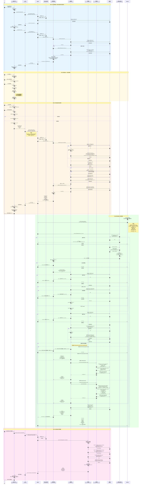

## 设备绑定到数据上传完整时序图

```mermaid
sequenceDiagram
    autonumber
    
    actor User as 用户
    participant MP as 微信小程序<br/>(pages/device-manage)
    participant API as API层<br/>(utils/api.js)
    participant GW as 后端网关
    participant Auth as 用户认证中间件<br/>(authMiddleware)
    participant DC as 设备控制器<br/>(deviceController.js)
    participant DS as 设备服务<br/>(DeviceService.js)
    participant ES as 环境服务<br/>(EnvironmentService.js)
    participant CS as 补偿服务<br/>(compensationService.js)
    participant DB as 数据库<br/>(MySQL)
    participant DAuth as 设备认证中间件<br/>(deviceAuthMiddleware)
    participant Device as 硬件设备
    
    %% ========== 阶段1: 进入设备管理页面 ==========
    rect rgb(230, 245, 255)
        Note over User,DB: 阶段1: 进入设备管理页面，加载当前设备和可用设备列表
        User->>MP: 进入设备管理页面<br/>(携带 plantId)
        MP->>MP: onLoad(options)<br/>获取 plantId
        MP->>API: api.getPlantDetail(plantId)
        API->>GW: GET /api/plants/:plantId<br/>Authorization: Bearer {token}
        GW->>Auth: 验证用户Token
        Auth-->>GW: 验证通过，获取 userId
        GW->>DB: SELECT * FROM plants<br/>WHERE plant_id = ?
        DB-->>GW: 返回植物数据
        GW-->>API: { code: 200, data: plant }
        API-->>MP: 返回植物详情
        MP->>MP: 设置 currentDevice<br/>(如果 plant.currentDevice 存在)
        
        MP->>API: api.getDeviceList()
        API->>GW: GET /api/devices<br/>Authorization: Bearer {token}
        GW->>Auth: 验证用户Token
        Auth-->>GW: 验证通过，获取 userId
        GW->>DC: getDevices(req, res)
        DC->>DS: getDeviceList(userId)
        DS->>DB: SELECT * FROM devices<br/>WHERE user_id = ?<br/>ORDER BY created_at DESC
        DB-->>DS: 返回设备列表
        DS-->>DC: devices[]
        
        loop 遍历每个设备
            DC->>DS: getBoundPlant(device.device_id)
            DS->>DB: SELECT plant_id, nickname,<br/>cover_image_url, species<br/>FROM plants<br/>WHERE current_device_id = ?
            DB-->>DS: 返回绑定植物
            DS-->>DC: boundPlant
        end
        
        DC->>DC: 格式化设备数据<br/>(deviceId, macAddress, deviceName,<br/>status, boundPlantId, batteryLevel,<br/>lastHeartbeat, boundPlant)
        DC-->>GW: success(res, formattedDevices)
        GW-->>API: HTTP 200<br/>{ code: 200, data: [...] }
        API-->>MP: 返回设备列表
        MP->>MP: 设置 availableDevices<br/>渲染设备列表UI
    end
    
    %% ========== 阶段2: 配置设备WiFi（可选） ==========
    rect rgb(255, 250, 230)
        Note over User,Device: 阶段2: 配置设备WiFi（仅新设备需要）
        User->>MP: 点击"配置WiFi"
        MP->>MP: toggleWifiForm()<br/>显示WiFi配置表单
        User->>MP: 输入WiFi名称和密码
        MP->>MP: onSSIDInput / onPasswordInput
        User->>MP: 点击"开始配置"
        MP->>MP: configureDevice()
        MP->>MP: 校验WiFi名称非空
        MP->>MP: 模拟发送配置...<br/>(setTimeout 1.5s)
        Note right of MP: MVP版本为模拟配置<br/>正式版应调用微信硬件API<br/>或UDP发送配网信息
        MP->>MP: 配置成功提示<br/>刷新可用设备列表
    end
    
    %% ========== 阶段3: 选择并绑定设备 ==========
    rect rgb(255, 245, 230)
        Note over User,DB: 阶段3: 用户选择设备并绑定到植物
        User->>MP: 点击选择设备
        MP->>MP: selectDevice(e)<br/>设置 selectedDeviceId = macAddress
        User->>MP: 点击"绑定设备"按钮
        MP->>MP: bindDevice()
        MP->>MP: 校验 plantId 和 macAddress
        
        alt 校验失败
            MP->>MP: showTip('请先选择设备', 'error')
        else 校验通过
            MP->>MP: showTip('正在绑定...', 'info')
            MP->>API: api.bindDevice({<br/>macAddress,<br/>deviceName,<br/>plantId<br/>})
            API->>GW: POST /api/devices/bind<br/>Authorization: Bearer {token}<br/>Content-Type: application/json
            
            Note right of API: 请求体:<br/>{<br/>"macAddress": "AA:BB:CC:DD:EE:FF",<br/>"deviceName": "proj-alpha-001",<br/>"plantId": "PLANT_xxx"<br/>}
            
            GW->>Auth: 验证用户Token
            Auth-->>GW: 验证通过，获取 userId
            GW->>DC: bindDevice(req, res)
            DC->>DS: bindDevice(userId, bindData)
            
            DS->>DB: SELECT * FROM devices<br/>WHERE mac_address = ?
            
            alt 设备不存在
                DB-->>DS: null
                DS->>DS: generateDeviceId()<br/>生成 DEVICE_xxxxxxxx
                DS->>DB: INSERT INTO devices (<br/>device_id, user_id, mac_address,<br/>device_name, status, battery_level,<br/>last_heartbeat, created_at<br/>) VALUES (?, ?, ?, ?, 'online', 100, NOW(), NOW())
                DB-->>DS: 插入成功
            else 设备已存在
                DB-->>DS: 返回设备记录
                DS->>DB: UPDATE devices SET<br/>user_id = ?,<br/>device_name = ?,<br/>status = 'online'<br/>WHERE device_id = ?
                DB-->>DS: 更新成功
            end
            
            alt 传入了 plantId
                DS->>DB: SELECT * FROM plants<br/>WHERE current_device_id = ?
                alt 该设备已绑定其他植物
                    DB-->>DS: 返回其他植物记录
                    DS->>DB: UPDATE plants SET<br/>current_device_id = NULL<br/>WHERE plant_id = ?
                end
                DS->>DB: UPDATE plants SET<br/>current_device_id = ?<br/>WHERE plant_id = ? AND user_id = ?
                DB-->>DS: 植物更新成功
            end
            
            DS-->>DC: 返回 device 对象
            DC->>DS: getBoundPlant(device.device_id)
            DS->>DB: SELECT plant_id, nickname,<br/>cover_image_url FROM plants<br/>WHERE current_device_id = ?
            DB-->>DS: 返回绑定植物信息
            DS-->>DC: boundPlant
            
            DC->>DC: 构建响应数据
            DC-->>GW: success(res, {<br/>deviceId,<br/>macAddress,<br/>deviceName,<br/>status,<br/>boundPlantId,<br/>batteryLevel,<br/>message: '设备绑定成功'<br/>})
            
            GW-->>API: HTTP 200<br/>{ code: 200, data: {...} }
            API-->>MP: 返回绑定结果
            MP->>MP: 更新 currentDevice<br/>showTip('绑定成功', 'success')
            MP->>MP: loadAvailableDevices()<br/>刷新可用设备列表
            MP->>User: 1秒后自动返回上一页
        end
    end
    
    %% ========== 阶段4: 设备数据上报 ==========
    rect rgb(230, 255, 230)
        Note over Device,DB: 阶段4: 硬件设备定时上报环境数据
        Device->>Device: 定时采集传感器数据<br/>(温度、湿度、光照、土壤湿度等)
        Device->>GW: POST /api/devices/data<br/>Content-Type: application/json
        
        Note right of Device: 请求体:<br/>{<br/>"deviceId": "DEVICE_xxx",<br/>"plantId": "PLANT_xxx", // 可选<br/>"timestamp": "2024-01-15T08:00:00Z",<br/>"metrics": {<br/>"temperature": 25.5,<br/>"humidity": 60,<br/>"light": 5000,<br/>"soil_moisture": 45,<br/>"battery_level": 85<br/>},<br/>"isSupplement": false<br/>}
        
        GW->>DAuth: deviceAuthMiddleware(req, res, next)
        DAuth->>DB: SELECT device_id, status<br/>FROM devices<br/>WHERE device_id = ?
        
        alt 设备不存在
            DB-->>DAuth: null
            DAuth-->>GW: HTTP 404<br/>{ code: 404, message: '设备不存在', data: null }
            GW-->>Device: 返回错误
        else 设备存在
            DB-->>DAuth: { device_id, status }
            DAuth->>DB: SELECT plant_id<br/>FROM plants<br/>WHERE current_device_id = ?
            DB-->>DAuth: { plant_id } 或 null
            DAuth->>DAuth: req.device = {<br/>deviceId: 'DEVICE_xxx',<br/>status: 'online',<br/>boundPlantId: 'PLANT_xxx'<br/>}
            DAuth->>DC: next() → 进入控制器
            
            DC->>DC: 校验 deviceId 和 metrics<br/>是否存在
            alt 缺少必要参数
                DC-->>GW: error(res, '缺少必要参数', 400)
                GW-->>Device: HTTP 400
            else 参数完整
                DC->>DS: reportDeviceData({<br/>deviceId, plantId, timestamp,<br/>metrics, isSupplement<br/>})
                
                DS->>DB: SELECT * FROM devices<br/>WHERE device_id = ?
                
                alt 设备不存在
                    DB-->>DS: null
                    DS-->>DC: { error: '设备不存在', code: 404 }
                    DC-->>GW: error(res, '设备不存在', 404)
                    GW-->>Device: HTTP 404
                else 设备存在
                    DB-->>DS: 返回设备记录
                    
                    alt 未传入 plantId
                        DS->>DB: SELECT plant_id FROM plants<br/>WHERE current_device_id = ?
                        alt 未绑定植物
                            DB-->>DS: null
                            DS-->>DC: { error: '设备未绑定植物', code: 400 }
                            DC-->>GW: error(res, '设备未绑定植物', 400)
                            GW-->>Device: HTTP 400
                        else 已绑定植物
                            DB-->>DS: { plant_id }
                            DS->>DS: targetPlantId = plant_id
                        end
                    else 传入了 plantId
                        DS->>DS: targetPlantId = plantId
                    end
                    
                    DS->>DB: SELECT * FROM plants<br/>WHERE plant_id = ?
                    
                    alt 植物不存在
                        DB-->>DS: null
                        DS-->>DC: { error: '植物不存在', code: 404 }
                        DC-->>GW: error(res, '植物不存在', 404)
                        GW-->>Device: HTTP 404
                    else 植物存在
                        DB-->>DS: 返回植物记录
                        
                        DS->>DB: SELECT * FROM reading_tasks<br/>WHERE plant_id = ?<br/>AND recorded_at = ?
                        
                        alt 任务不存在
                            DB-->>DS: null
                            DS->>DS: generateTaskId()
                            DS->>DB: INSERT INTO reading_tasks (<br/>task_id, plant_id, recorded_at,<br/>sensor_status, weather_status<br/>) VALUES (?, ?, ?, 'PENDING', 'FAILED')
                            DB-->>DS: 任务创建成功
                        else 任务存在
                            DB-->>DS: 返回任务记录
                        end
                        
                        alt 根据任务状态处理数据
                            Note right of DS: 任务状态: PENDING/FAILED/RECEIVED/COMPENSATED
                            
                            alt 状态=RECEIVED 且 isSupplement=true
                                DS-->>DC: { error: '该时刻已有真实传感器数据，拒绝补传', code: 409 }
                                DC-->>GW: error(res, '该时刻已有真实传感器数据，拒绝补传', 409)
                                GW-->>Device: HTTP 409
                            else 状态=RECEIVED 且 isSupplement=false
                                DS-->>DC: {<br/>readingId: null,<br/>recordedAt,<br/>isSupplement: false,<br/>isStale: false,<br/>message: '数据已存在'<br/>}
                            else 状态=COMPENSATED
                                DS->>CS: coverCompensatedData(task, data)
                                CS->>DB: UPDATE environment_readings SET<br/>data_source = 'SENSOR',<br/>is_stale = false,<br/>device_id = ?<br/>WHERE reading_id = ?
                                CS->>DB: INSERT INTO environment_reading_values (<br/>value_id, reading_id,<br/>metric_code, value<br/>) VALUES (?, ?, ?, ?), ...
                                CS->>DB: UPDATE reading_tasks SET<br/>sensor_status = 'RECEIVED'<br/>WHERE task_id = ?
                                CS-->>DS: { reading_id }
                                DS-->>DC: {<br/>readingId,<br/>recordedAt,<br/>isSupplement: true,<br/>isStale: false<br/>}
                            else 状态=PENDING/FAILED
                                DS->>CS: createSensorReading(task, data)
                                CS->>DS: generateReadingId()
                                CS->>DB: INSERT INTO environment_readings (<br/>reading_id, plant_id, device_id,<br/>data_source, recorded_at, is_stale<br/>) VALUES (?, ?, ?, 'SENSOR', ?, false)
                                CS->>DB: INSERT INTO environment_reading_values (<br/>value_id, reading_id,<br/>metric_code, value<br/>) VALUES<br/>(..., 'temperature', 25.5),<br/>(..., 'humidity', 60),<br/>(..., 'light', 5000),<br/>(..., 'soil_moisture', 45)
                                CS->>DB: UPDATE reading_tasks SET<br/>sensor_status = 'RECEIVED'<br/>WHERE task_id = ?
                                CS-->>DS: { reading_id }
                                DS-->>DC: {<br/>readingId,<br/>recordedAt,<br/>isSupplement: false,<br/>isStale: false<br/>}
                            end
                        end
                        
                        DS->>DB: UPDATE devices SET<br/>status = 'online',<br/>last_heartbeat = NOW(),<br/>battery_level = ?<br/>WHERE device_id = ?
                        DB-->>DS: 更新成功
                        
                        DS-->>DC: {<br/>readingId,<br/>plantId: targetPlantId,<br/>recordedAt,<br/>isSupplement,<br/>isStale,<br/>message<br/>}
                        DC-->>GW: success(res, result, '数据上报成功')
                        GW-->>Device: HTTP 200<br/>{<br/>code: 200,<br/>data: {<br/>readingId,<br/>plantId,<br/>recordedAt,<br/>isSupplement,<br/>isStale<br/>},<br/>message: '数据上报成功'<br/>}
                    end
                end
            end
        end
    end
    
    %% ========== 阶段5: 小程序获取环境数据 ==========
    rect rgb(255, 230, 245)
        Note over User,DB: 阶段5: 小程序查询实时环境数据
        User->>MP: 进入植物详情页/环境数据页
        MP->>API: api.getCurrentEnvironment(plantId)
        API->>GW: GET /api/environment/current?plantId=xxx<br/>Authorization: Bearer {token}
        GW->>Auth: 验证用户Token
        Auth-->>GW: 验证通过
        GW->>ES: getCurrentData(plantId, recordedAt)
        
        ES->>ES: 计算最近的时间间隔<br/>(每2小时一个间隔)
        ES->>DB: SELECT * FROM environment_readings<br/>WHERE plant_id = ?<br/>AND data_source = 'SENSOR'<br/>AND recorded_at = ?
        DB-->>ES: sensorReading
        ES->>DB: SELECT * FROM environment_readings<br/>WHERE plant_id = ?<br/>AND data_source = 'WEATHER_API'<br/>AND recorded_at = ?
        DB-->>ES: weatherReading
        ES->>DB: SELECT * FROM reading_tasks<br/>WHERE plant_id = ?<br/>AND recorded_at = ?
        DB-->>ES: task
        ES->>DB: SELECT metric_code, name,<br/>unit, icon, min_value, max_value<br/>FROM environment_metrics
        DB-->>ES: allMetrics
        
        ES->>ES: 构建指标数据<br/>(deviceMetrics, weatherMetrics)
        ES-->>GW: {<br/>plantId,<br/>recordedAt,<br/>deviceMetrics,<br/>weatherMetrics,<br/>taskStatus<br/>}
        GW-->>API: { code: 200, data: environmentData }
        API-->>MP: 返回环境数据
        MP->>MP: 渲染环境指标卡片<br/>(温度、湿度、光照、土壤湿度等)
        MP->>User: 展示实时环境数据
    end
```

