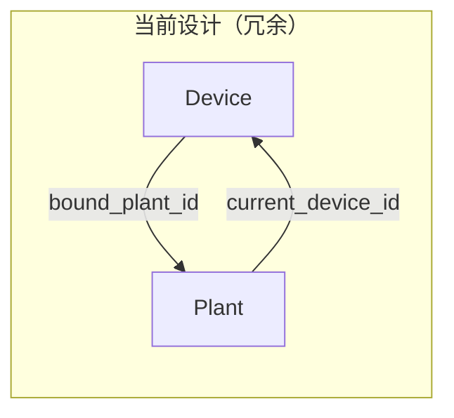
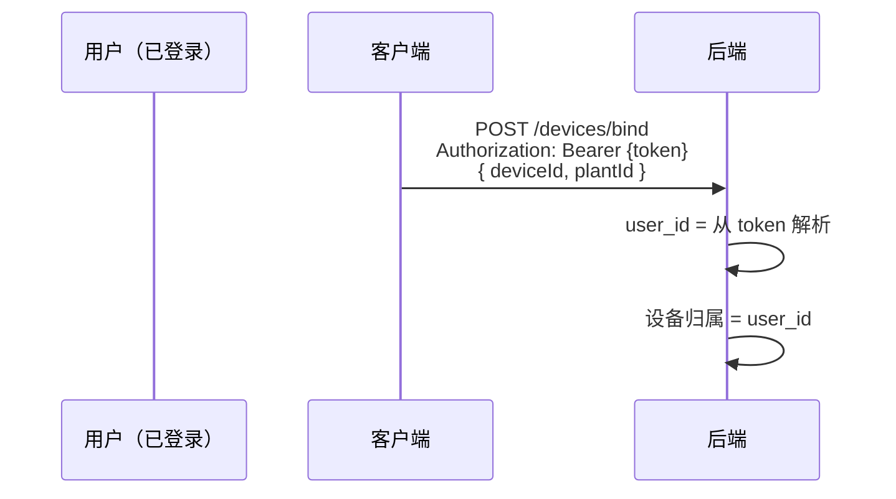
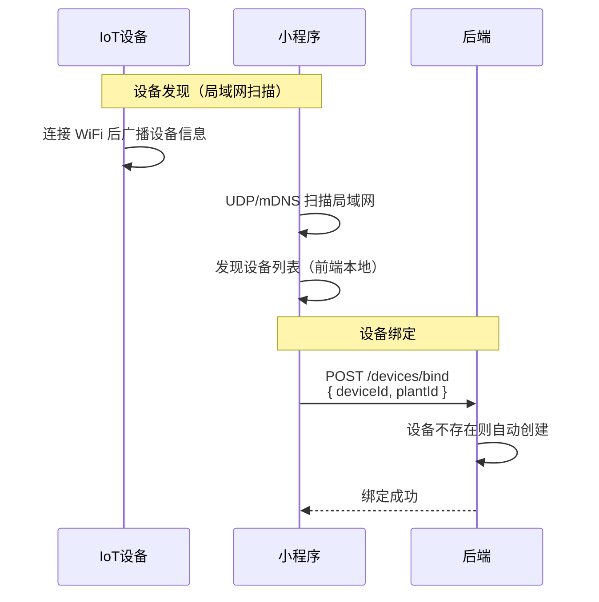
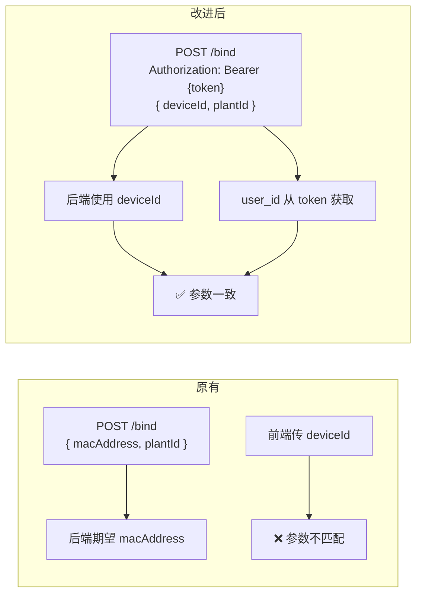
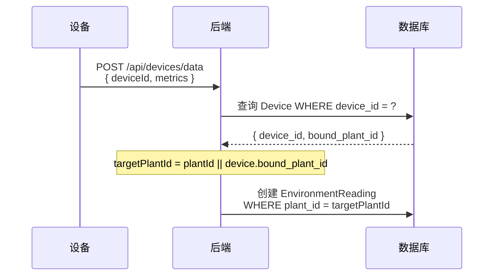
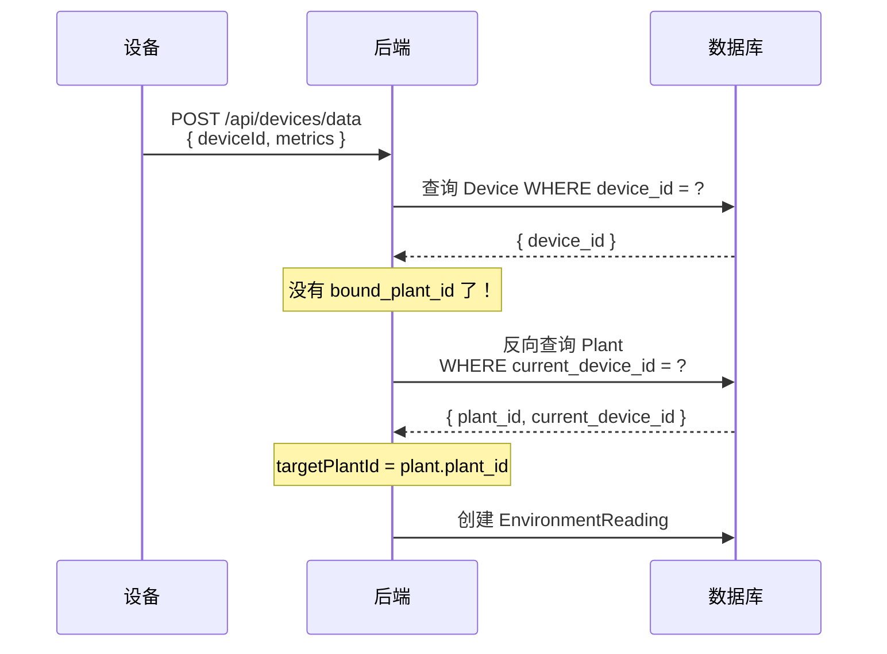
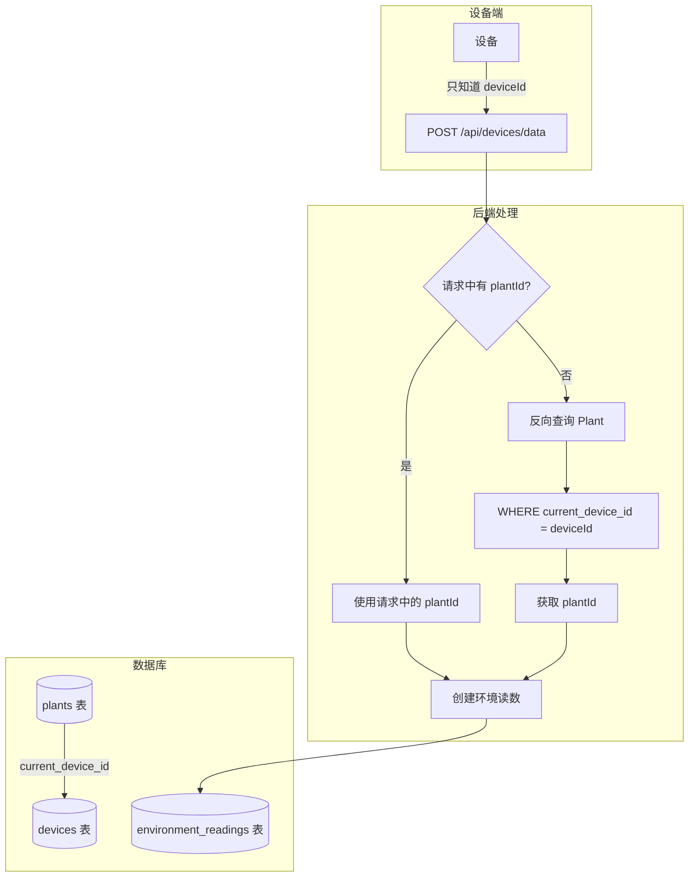
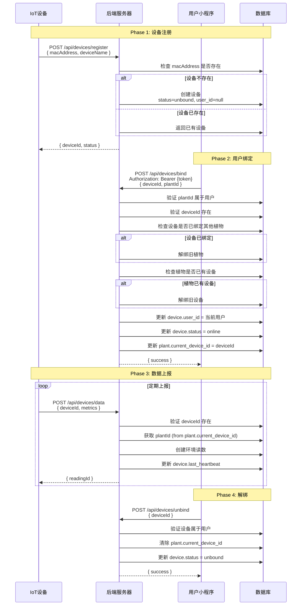

# 设备绑定逻辑重构方案

## 一、问题诊断

### 1.1 当前问题清单

| # | 问题 | 影响 | 严重程度 |
|:---|:---|:---|:---|
| 1 | **双向冗余关联**：`Device.bound_plant_id` 和 `Plant.current_device_id` 同时存在 | 数据可能不一致，维护成本高 | 🔴 高 |
| 2 | **前后端参数不一致**：前端传 `deviceId`，后端期望 `macAddress` | 绑定功能无法正常工作 | 🔴 高 |
| 3 | **设备归属混乱**：`Device.user_id` 语义不清晰 | 安全风险，权限控制困难 | 🟡 中 |
| 4 | **绑定场景不清晰**：设备注册 vs 用户绑定 vs 换绑混淆 | 代码难以维护 | 🟡 中 |
| 5 | **一对多关系不合理**：`Device.hasMany(Plant)` 但实际应该是 1:1 | 数据模型设计不合理 | 🟡 中 |

### 1.2 问题详解

#### 问题 1：双向冗余关联



**问题**：
- `Device.bound_plant_id` 和 `Plant.current_device_id` 互为反向引用
- 更新时需要同时维护两个字段，容易出现不一致
- 代码中存在多处更新逻辑，容易遗漏

**示例代码**：
```javascript
// DeviceService.bindDevice() 中
await device.update({ bound_plant_id: plantId });  // 更新 Device
await Plant.update({ current_device_id: device.device_id });  // 更新 Plant

// 如果中间出错，数据不一致！
```

#### 问题 2：前后端参数不一致

**前端代码** (`device-manage.js`)：
```javascript
api.bindDevice({
  deviceId: deviceId,  // ❌ 传 deviceId
  plantId: plantId
})
```

**后端代码** (`DeviceService.js`)：
```javascript
const { macAddress, deviceName, plantId } = bindData;  // ❌ 期望 macAddress
let device = await this.findOne({ mac_address: macAddress });
```

**结果**：前端传的 `deviceId` 被忽略，`macAddress` 为 `undefined`，绑定失败。

#### 问题 3：设备归属混乱（已解决）

```javascript
// Device 模型
{
  user_id: String,  // 设备归属用户
}
```

**解决方案**：用户必须先登录，`user_id` 从 token 获取，设备归属在绑定时确定。



**结论**：设备归属清晰，绑定用户即设备归属用户。

#### 问题 4：绑定场景不清晰（已简化）

| 场景 | 触发者 | 期望行为 | 改进后实现 |
|:---|:---|:---|:---|
| 设备发现 | 前端 | 局域网扫描发现设备 | ✅ UDP/mDNS 扫描（不依赖后端） |
| 用户绑定设备 | 用户 | 绑定设备到植物 | ✅ 统一在 bind 接口 |
| 用户换绑设备 | 用户 | 解绑旧设备，绑定新设备 | ✅ bind 接口自动处理 |
| 设备离线 | 系统 | 更新状态=offline | ✅ 定时任务检查心跳 |

**简化设计**：
- **设备发现**：前端通过 UDP/mDNS 扫描局域网，不依赖后端
- **设备注册**：绑定接口自动创建不存在的设备
- **不需要独立的设备注册接口**

---

## 二、改进方案

### 2.1 设计原则

| 原则 | 说明 |
|:---|:---|
| **单向关联** | 只在 `Plant` 表保留 `current_device_id`，移除 `Device.bound_plant_id` |
| **职责分离** | 设备注册和用户绑定是两个独立操作 |
| **权限清晰** | 设备归属用户在绑定时确定，注册时设备无归属 |
| **状态明确** | 设备状态清晰反映其生命周期 |

### 2.2 数据模型改进

#### Device 模型

```javascript
const Device = sequelize.define('Device', {
  device_id: {
    type: DataTypes.STRING(64),
    primaryKey: true,
    comment: '设备唯一标识，系统生成',
  },
  mac_address: {
    type: DataTypes.STRING(32),
    allowNull: false,
    unique: true,
    comment: '设备MAC地址，设备出厂标识',
  },
  device_name: {
    type: DataTypes.STRING(100),
    allowNull: true,
    comment: '设备名称',
  },
  user_id: {
    type: DataTypes.STRING(64),
    allowNull: true,  // 允许为空，注册时无归属
    comment: '归属用户ID，绑定时设置',
  },
  status: {
    type: DataTypes.ENUM('unbound', 'online', 'offline'),
    defaultValue: 'unbound',
    comment: '设备状态：unbound=未绑定, online=在线, offline=离线',
  },
  // 移除 bound_plant_id（冗余字段）
  battery_level: {
    type: DataTypes.INTEGER,
    allowNull: true,
    comment: '电池电量 0-100',
  },
  last_heartbeat: {
    type: DataTypes.DATE,
    allowNull: true,
    comment: '最后心跳时间',
  },
});
```

#### Plant 模型（保持不变）

```javascript
// Plant 模型中的 current_device_id 保留
current_device_id: {
  type: DataTypes.STRING(64),
  allowNull: true,
  comment: '当前绑定设备ID',
  references: {
    model: 'devices',
    key: 'device_id',
  },
},
```

### 2.3 设备发现机制

**重要**：设备发现是在**前端局域网扫描**完成的，不依赖后端。



#### 两种设备列表

| 列表类型 | 数据来源 | 获取方式 | 说明 |
|:---|:---|:---|:---|
| **未绑定设备列表** | 前端局域网扫描 | UDP/mDNS | 设备配网成功后，小程序扫描局域网发现 |
| **已绑定设备列表** | 后端数据库 | `GET /api/devices` | 返回当前用户已绑定的设备 |

**前端扫描示例**：
```javascript
// 发现局域网设备（不请求后端）
wx.startLocalServiceDiscovery({
  serviceType: '_proj-alpha._udp',
  success: (res) => {
    // res.services 包含发现的设备列表
    // [{ deviceId, deviceName, macAddress, ... }]
  }
});
```

### 2.4 API 对比：原有 vs 改进后

#### API 端点对比

| 操作 | 原有 API | 改进后 API |
|:---|:---|:---|
| **设备绑定** | `POST /api/devices/bind` | `POST /api/devices/bind` |
| **设备解绑** | `POST /api/devices/unbind` | `POST /api/devices/unbind` |
| **数据上报** | `POST /api/devices/data` | `POST /api/devices/data` |
| **设备列表** | `GET /api/devices` | `GET /api/devices` |
| **设备详情** | `GET /api/devices/:deviceId` | `GET /api/devices/:deviceId` |

#### 详细参数对比

| API | 原有参数 | 改进后参数 | 变化说明 |
|:---|:---|:---|:---|
| **POST /bind** | `{ macAddress, deviceName, plantId }` | `{ macAddress, deviceName, plantId }` | ✅ 保持不变，前端修复传参 |
| **POST /unbind** | `{ deviceId }` | `{ deviceId }` | 无变化 |
| **POST /data** | `{ deviceId, plantId?, metrics }` | `{ macAddress, metrics }` | 设备使用 macAddress 上报 |
| **GET /** | - | - | 无变化 |
| **GET /:deviceId** | - | - | 无变化 |

#### 关键变化说明

**1. 设备绑定接口参数变化**



**原有代码问题**：
```javascript
// 前端传入
api.bindDevice({ deviceId: "DEVICE_xxx", plantId: "PLANT_xxx" });

// 后端期望
const { macAddress, deviceName, plantId } = bindData;
// macAddress = undefined，查询失败
```

**改进后**：
```javascript
// 前端传入
api.bindDevice({ deviceId: "DEVICE_xxx", plantId: "PLANT_xxx" });

// 后端使用
const userId = req.user.userId;  // 从 token 获取
const { deviceId, plantId } = bindData;
// 参数一致，user_id 从 token 获取
```

**2. 数据上报获取 plantId 方式变化**

| 维度 | 原有 | 改进后 |
|:---|:---|:---|
| **来源** | `device.bound_plant_id` | 反向查询 `Plant.current_device_id` |
| **查询次数** | 1 次 | 2 次（有索引，性能无损） |
| **维护成本** | 高（双向同步） | 低（单向维护） |

**原有逻辑**：
```javascript
const targetPlantId = plantId || device.bound_plant_id;
```

**改进后逻辑**：
```javascript
let targetPlantId = plantId;
if (!targetPlantId) {
  const plant = await Plant.findOne({ where: { current_device_id: deviceId } });
  targetPlantId = plant?.plant_id;
}
```

#### 路由文件对比

**原有路由** (`routes/devices.js`)：
```javascript
router.post('/data', deviceAuthMiddleware, asyncHandler(deviceController.reportData));
router.get('/', authMiddleware, asyncHandler(deviceController.getDevices));
router.post('/bind', authMiddleware, asyncHandler(deviceController.bindDevice));
router.post('/unbind', authMiddleware, asyncHandler(deviceController.unbindDevice));
router.get('/:deviceId', authMiddleware, asyncHandler(deviceController.getDeviceDetail));
```

**改进后路由**（无变化，但内部逻辑调整）：
```javascript
// 设备数据上报（设备认证）
router.post('/data', deviceAuthMiddleware, asyncHandler(deviceController.reportData));

// 用户操作（用户认证）
router.get('/', authMiddleware, asyncHandler(deviceController.getDevices));
router.post('/bind', authMiddleware, asyncHandler(deviceController.bindDevice));
router.post('/unbind', authMiddleware, asyncHandler(deviceController.unbindDevice));
router.get('/:deviceId', authMiddleware, asyncHandler(deviceController.getDeviceDetail));
```

**关键变化**：
- 路由端点无变化
- `bindDevice` 内部逻辑：user_id 从 token 获取，支持 deviceId 参数
- `reportData` 内部逻辑：plantId 通过反向查询获取

#### 兼容性方案

为了平滑迁移，后端可以同时兼容新旧参数：

```javascript
async bindDevice(userId, bindData) {
  const { deviceId, macAddress, plantId } = bindData;
  
  let device;
  
  // 兼容新参数
  if (deviceId) {
    device = await this.findById(deviceId);
  }
  // 兼容旧参数
  else if (macAddress) {
    device = await this.findOne({ mac_address: macAddress });
  }
  
  if (!device) {
    // 如果设备不存在，自动创建
    device = await this.create({
      device_id: deviceId || this.generateDeviceId(),
      user_id: userId,  // 从 token 获取
      mac_address: macAddress || `AUTO_${Date.now()}`,
      device_name: `设备_${macAddress?.slice(-4) || '新设备'}`,
      status: 'online',
    });
  }
  
  // 绑定到植物
  // ...
}
```

---

### 2.4 API 设计详情

#### 设备绑定接口

```
POST /api/devices/bind
```

**用途**：用户将设备绑定到植物

**认证**：需要用户认证（`authMiddleware`）

**请求参数**：
```json
{
  "deviceId": "DEVICE_abc123def456",
  "plantId": "PLANT_xxx"
}
```

**响应**：
```json
{
  "code": 200,
  "message": "设备绑定成功",
  "data": {
    "deviceId": "DEVICE_abc123def456",
    "plantId": "PLANT_xxx",
    "status": "online"
  }
}
```

**逻辑**：
1. `user_id` 从 token 获取
2. 验证 `plantId` 属于当前用户
3. 验证设备存在（如果不存在，自动创建）
4. 如果植物已有设备，先解绑
5. 更新 `plant.current_device_id = deviceId`
6. 更新 `device.status = online`

#### 改进：设备解绑接口

```
POST /api/devices/unbind
```

**用途**：用户解除设备与植物的绑定

**认证**：需要用户认证

**请求参数**：
```json
{
  "deviceId": "DEVICE_abc123def456"
}
```

**逻辑**：
1. 验证设备属于当前用户
2. 找到设备绑定的植物
3. 清除 `plant.current_device_id`
4. 更新 `device.status = unbound`
5. 可选：保留 `device.user_id` 或清除

#### 保持：数据上报接口

```
POST /api/devices/data
```

**用途**：设备上报环境数据

**认证**：设备认证（`deviceAuthMiddleware`）

**请求参数**：
```json
{
  "deviceId": "DEVICE_abc123def456",
  "timestamp": "2024-01-01T12:00:00Z",
  "metrics": {
    "temperature": 25.5,
    "humidity": 60.0,
    "light_intensity": 15000,
    "soil_moisture": 45.0,
    "soil_temperature": 22.0,
    "battery_level": 95
  }
}
```

**关键问题**：设备只知道自己的 `deviceId`，后端如何知道数据要送到哪个植物？

### 2.4 数据路由机制

#### 核心问题

设备上报数据时，只知道自己的 `deviceId`，不知道 `plantId`。后端需要通过某种机制找到目标植物。

#### 当前机制（双向关联）



**当前代码**：
```javascript
async reportDeviceData(reportData) {
  const { deviceId, plantId, metrics } = reportData;
  
  const device = await this.getDeviceById(deviceId);
  
  // 从 Device.bound_plant_id 获取
  const targetPlantId = plantId || device.bound_plant_id;
  
  // ...
}
```

#### 改进后机制（反向查询）



**改进后代码**：
```javascript
async reportDeviceData(reportData) {
  const { deviceId, plantId, metrics } = reportData;
  
  const device = await this.getDeviceById(deviceId);
  if (!device) {
    return { error: '设备不存在', code: 404 };
  }
  
  let targetPlantId = plantId;
  
  // 如果请求中没有 plantId，反向查找
  if (!targetPlantId) {
    const plant = await Plant.findOne({
      where: { current_device_id: deviceId }
    });
    targetPlantId = plant?.plant_id;
  }
  
  if (!targetPlantId) {
    return { error: '设备未绑定植物', code: 400 };
  }
  
  // 创建环境读数...
}
```

#### 两种方案对比

| 方案 | 数据来源 | 优点 | 缺点 |
|:---|:---|:---|:---|
| **方案A：Device.bound_plant_id** | 设备表直接存储 | 查询简单，一次查询 | 冗余，需双向维护 |
| **方案B：反向查询 Plant** | 从植物表查找 | 无冗余，单向关联 | 多一次查询 |

#### 性能考虑

反向查询的性能影响很小，因为 `Plant` 表已有索引：

```javascript
// Plant 模型中的索引
indexes: [
  { name: 'idx_device', fields: ['current_device_id'] }
]
```

#### 完整数据流向图



#### 结论

**设备不需要知道 plantId**，只需要知道自己的 `deviceId`：

1. 设备上报 `{ deviceId, metrics }`
2. 后端通过 `Plant.current_device_id = deviceId` 反向查找植物
3. 将数据写入对应植物的环境读数

这正是**单向关联**的优势：数据只在一个地方维护，避免不一致。

### 2.5 完整流程图



---

## 三、代码改动清单

### 3.1 后端改动

#### 3.1.1 Device 模型

**文件**：`backend/server/src/models/Device.js`

**改动**：
- 移除 `bound_plant_id` 字段
- `user_id` 允许为 `null`

#### 3.1.2 新增设备注册服务

**文件**：`backend/server/src/services/DeviceService.js`

**新增方法**：
```javascript
async registerDevice(registerData) {
  const { macAddress, deviceName, firmwareVersion } = registerData;
  
  let device = await this.findOne({ mac_address: macAddress });
  
  if (!device) {
    device = await this.create({
      device_id: this.generateDeviceId(),
      mac_address: macAddress,
      device_name: deviceName || `设备_${macAddress.slice(-4)}`,
      status: 'unbound',
      user_id: null,
      battery_level: 100,
    });
  }
  
  return device;
}
```

#### 3.1.3 改进绑定服务

**文件**：`backend/server/src/services/DeviceService.js`

**改动**：
```javascript
async bindDevice(userId, bindData) {
  const { deviceId, plantId } = bindData;  // 改用 deviceId
  
  // 1. 验证植物属于用户
  const plant = await Plant.findOne({ 
    where: { plant_id: plantId, user_id: userId } 
  });
  if (!plant) {
    throw new Error('植物不存在或无权限');
  }
  
  // 2. 验证设备存在
  const device = await this.findById(deviceId);
  if (!device) {
    throw new Error('设备不存在');
  }
  
  // 3. 如果植物已有设备，先解绑
  if (plant.current_device_id) {
    await this.unbindDeviceInternal(plant.current_device_id);
  }
  
  // 4. 如果设备已绑定其他植物，先解绑
  const existingPlant = await Plant.findOne({
    where: { current_device_id: deviceId }
  });
  if (existingPlant) {
    await existingPlant.update({ current_device_id: null });
  }
  
  // 5. 建立绑定关系
  await device.update({
    user_id: userId,
    status: 'online',
    last_heartbeat: new Date(),
  });
  
  await plant.update({ current_device_id: deviceId });
  
  return device;
}
```

#### 3.1.4 新增路由

**文件**：`backend/server/src/routes/devices.js`

**新增**：
```javascript
// 设备注册（无需认证）
router.post('/register', asyncHandler(deviceController.registerDevice));

// 用户绑定（需要认证）
router.post('/bind', authMiddleware, asyncHandler(deviceController.bindDevice));

// 用户解绑（需要认证）
router.post('/unbind', authMiddleware, asyncHandler(deviceController.unbindDevice));
```

### 3.2 前端改动

#### 3.2.1 API 接口

**文件**：`utils/api.js`

**新增**：
```javascript
function registerDevice(data) {
  return post('/devices/register', data);
}

function bindDevice(data) {
  return post('/devices/bind', data);  // 参数改为 { deviceId, plantId }
}
```

#### 3.2.2 设备管理页

**文件**：`pages/device-manage/device-manage.js`

**改动**：
```javascript
performBind(deviceId) {
  const that = this;
  const plantId = this.data.plantId;
  
  api.bindDevice({
    deviceId: deviceId,  // 使用 deviceId
    plantId: plantId
  }).then(function() {
    that.showTip('绑定成功', 'success');
    // ...
  });
}
```

### 3.3 数据库迁移

**文件**：`backend/server/src/migrations/YYYYMMDDHHMMSS-remove-device-bound-plant.js`

```javascript
module.exports = {
  up: async (queryInterface, Sequelize) => {
    // 1. 移除 Device.bound_plant_id 字段
    await queryInterface.removeColumn('devices', 'bound_plant_id');
    
    // 2. Device.user_id 允许为空
    await queryInterface.changeColumn('devices', 'user_id', {
      type: Sequelize.STRING(64),
      allowNull: true,
    });
  },
  
  down: async (queryInterface, Sequelize) => {
    await queryInterface.addColumn('devices', 'bound_plant_id', {
      type: Sequelize.STRING(64),
      allowNull: true,
    });
    
    await queryInterface.changeColumn('devices', 'user_id', {
      type: Sequelize.STRING(64),
      allowNull: false,
    });
  }
};
```

---

## 四、虚拟设备适配

### 4.1 改进后的虚拟设备流程

```python
class VirtualDevice:
    def __init__(self):
        self.mac_address = f"VIRTUAL_{random.randint(10000000, 99999999)}"
        self.device_id = None
        self.plant_id = None
        self.token = None

    def auto_pair(self):
        # 1. 游客登录
        login_result = self.guest_login()
        if not login_result['success']:
            return False
        self.token = login_result['token']
        
        # 2. 创建植物
        plant_result = self.create_plant()
        if not plant_result['success']:
            return False
        self.plant_id = plant_result['plantId']
        
        # 3. 注册设备（新接口）
        register_result = requests.post(
            f"{self.server_url}/api/devices/register",
            json={
                "macAddress": self.mac_address,
                "deviceName": f"虚拟设备_{self.mac_address[-8:]}"
            }
        )
        if register_result.status_code != 200:
            return False
        self.device_id = register_result.json()['data']['deviceId']
        
        # 4. 绑定设备到植物（新接口）
        bind_result = requests.post(
            f"{self.server_url}/api/devices/bind",
            json={
                "deviceId": self.device_id,
                "plantId": self.plant_id
            },
            headers={"Authorization": f"Bearer {self.token}"}
        )
        
        return bind_result.status_code == 200

    def report_data(self):
        return requests.post(
            f"{self.server_url}/api/devices/data",
            json={
                "deviceId": self.device_id,
                "timestamp": datetime.now().isoformat(),
                "metrics": self.generate_metrics()
            }
        )
```

---

## 五、实施步骤

### 5.1 阶段一：后端改动（优先）

1. ✅ 新增 `/api/devices/register` 接口
2. ✅ 改进 `/api/devices/bind` 接口，支持 `deviceId` 参数
3. ✅ 改进 `/api/devices/unbind` 接口
4. ✅ 更新 DeviceService
5. ✅ 数据库迁移（移除 `bound_plant_id`，`user_id` 允许为空）

### 5.2 阶段二：前端改动

1. ✅ 更新 `api.js` 中的 `bindDevice` 参数
2. ✅ 更新 `device-manage.js` 调用逻辑
3. ✅ 测试绑定/解绑流程

### 5.3 阶段三：虚拟设备适配

1. ✅ 更新虚拟设备使用新的注册接口
2. ✅ 更新绑定逻辑使用 `deviceId`
3. ✅ 测试完整流程

---

## 六、风险与回滚

### 6.1 风险

| 风险 | 影响 | 缓解措施 |
|:---|:---|:---|
| 数据库迁移失败 | 服务不可用 | 先备份数据库，准备回滚脚本 |
| 前端未及时更新 | 绑定功能异常 | 后端同时兼容新旧参数 |
| 现有设备数据丢失 | 用户绑定关系丢失 | 迁移前同步 `bound_plant_id` 到 `current_device_id` |

### 6.2 回滚方案

```javascript
// 后端兼容新旧参数
async bindDevice(userId, bindData) {
  const { deviceId, macAddress, plantId } = bindData;
  
  let device;
  if (deviceId) {
    device = await this.findById(deviceId);
  } else if (macAddress) {
    device = await this.findOne({ mac_address: macAddress });
  }
  
  // ... 后续逻辑
}
```

---

## 七、总结

| 维度 | 改进前 | 改进后 |
|:---|:---|:---|
| **数据模型** | 双向冗余关联 | 单向关联，Plant 指向 Device |
| **API 设计** | 参数不一致，职责混乱 | 职责清晰，参数统一 |
| **设备归属** | 语义不清 | 注册时无归属，绑定时确定 |
| **绑定流程** | 混在一起 | 分离为注册、绑定、解绑 |
| **虚拟设备** | 无法正常工作 | 完全适配 |
