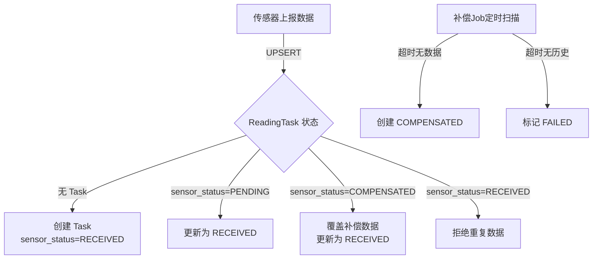

# 虚拟传感器系统规格说明书 V3

## 1. 核心概念

### 1.1 双时间模型

虚拟传感器同时维护两个时间：

| 时间 | 符号 | 说明 | 更新方式 |
|:---|:---|:---|:---|
| **真实时间** | R | 物理世界时间 | `R = now()` 每次触发时更新 |
| **模拟时间** | S | 传感器认为的时间 | `S += Δs` 每次触发时推进 |

### 1.2 关键参数

| 参数 | 符号 | 默认值 | 说明 |
|:---|:---|:---|:---|
| 传感器间隔 | Δs | 7200000ms (2小时) | 模拟时间每次推进的间隔 |
| 加速倍数 | k | 1 | 真实时间加速倍数，追赶后重置为1 |
| 定时器间隔 | Δt | Δs/k | 真实世界的触发间隔 |

### 1.3 核心公式

```
真实等待时间: Δt = Δs / k

当 k=240, Δs=2小时:
  Δt = 2小时 / 240 = 30秒

模拟时间推进: dS = k × dR = k × (Δs/k) = Δs

即: 每30秒真实时间，模拟时间推进2小时
```

## 2. 追赶逻辑

### 2.1 触发条件

```
if S > R:
    S = R      # 重置模拟时间为真实时间
    k = 1      # 恢复常速
```

### 2.2 完整时间线示例

配置：
- `SIMULATED_TIME_INITIAL = 2026-04-10T00:00:00`
- `TIME_ACCELERATION = 240`
- `SENSOR_INTERVAL = 7200000ms` (2小时)

时间线：

| 触发 # | 真实时间 R | 模拟时间 S | 数据时间戳 | 备注 |
|:---|:---|:---|:---|:---|
| 初始 | 09:00 | 04-10 00:00 | - | 启动 |
| 1 | 09:00:30 | 04-10 02:00 | 04-10 02:00 | 第一次采集 |
| 2 | 09:01:00 | 04-10 04:00 | 04-10 04:00 | |
| ... | ... | ... | ... | |
| 60 | 09:30:00 | 04-15 00:00 | 04-15 00:00 | 追上目标 |
| 61 | 09:30:30 | 04-15 02:00 | 04-15 02:00 | S > R，触发追赶 |
| - | 09:30:30 | 09:30:30 | 09:30:30 | S=R, k=1 |
| 62 | 11:30:30 | 11:30:30 | 11:30:30 | 正常2小时间隔 |

## 3. 后端数据状态流转

### 3.1 Task 状态机



**状态说明**：

| 状态 | 含义 | 产生方式 |
|:---|:---|:---|
| **PENDING** | 等待传感器数据 | 后端预生成 |
| **RECEIVED** | 已收到真实传感器数据 | 传感器上报 |
| **COMPENSATED** | 补偿数据（后端自己造的） | 补偿Job生成 |
| **FAILED** | 无法补偿（无历史数据） | 补偿Job标记 |

**关键规则**：
- **RECEIVED 是终态**：真实数据到达后不再变更
- **COMPENSATED 可被覆盖**：补传数据到达后替换为 RECEIVED
- **UPSERT 机制**：传感器上报时，存在则更新，不存在则创建

### 3.2 补传判断逻辑

后端收到数据时，判断是否为补传：

```
isSupplement = (最近整点周期起始时间 - recordedAt) > TOLERANCE_PERIOD
             && recordedAt < 最近整点周期起始时间
```

**判断示例**（TOLERANCE_PERIOD = 5分钟）：

| recordedAt | 最近整点 | 差值 | recordedAt < 最近整点? | 结果 | 说明 |
|:---|:---|:---|:---|:---|:---|
| 08:00 | 08:00 | 0 | 否（相等） | 正常 | 当前周期数据 |
| 08:03 | 08:00 | 3分钟 | 否 | 正常 | 当前周期，容忍期内 |
| 07:55 | 08:00 | 5分钟 | 是 | 正常 | 上一周期，差值=容忍期 |
| 07:54 | 08:00 | 6分钟 | 是 | **补传** | 上一周期，差值>容忍期 |
| 06:00 | 08:00 | 120分钟 | 是 | **补传** | 很久以前的数据 |

### 3.3 传感器端与后端职责分离

| 职责 | 传感器端 | 后端 |
|:---|:---|:---|
| **数据生成** | 按 S/R/k 模型生成时间戳 | - |
| **数据存储** | 本地队列（内存+JSON） | ReadingTask + EnvironmentReading |
| **数据上报** | 主动 POST，失败保留 | 被动接收，UPSERT |
| **数据补偿** | - | 补偿Job扫描超时 Task |
| **补传判断** | - | 根据 recordedAt 时间判断 |

## 4. 系统架构

### 4.1 组件关系

```
┌─────────────────────────────────────────────────────────────┐
│                        DeviceCustom                          │
│  ┌──────────────────────────────────────────────────────┐   │
│  │  统一调度器 (S/R/k 管理)                               │   │
│  │  - 维护模拟时间 S                                     │   │
│  │  - 计算定时器间隔 Δt = Δs/k                          │   │
│  │  - 触发时推进 S += Δs                                 │   │
│  │  - 检查追赶条件 S > R                                 │   │
│  └──────────────────────────────────────────────────────┘   │
│                         │                                    │
│                         ▼                                    │
│  ┌──────────────────────────────────────────────────────┐   │
│  │  传感器组 (8个 Simulator)                              │   │
│  │  - 被动生成数据 (timestamp=S)                          │   │
│  │  - 无独立定时器                                        │   │
│  └──────────────────────────────────────────────────────┘   │
│                         │                                    │
│                         ▼                                    │
│  ┌──────────────────────────────────────────────────────┐   │
│  │  数据合并                                              │   │
│  │  - 合并8个传感器数据为一条记录                          │   │
│  │  - 统一时间戳                                          │   │
│  └──────────────────────────────────────────────────────┘   │
│                         │                                    │
│                         ▼                                    │
│  ┌──────────────────────────────────────────────────────┐   │
│  │  HTTPHelper (本地队列 + 上报)                          │   │
│  │  - 数据入队 (内存 + JSON持久化)                        │   │
│  │  - 定时上报 (逐条POST)                                 │   │
│  │  - 成功移除 / 失败保留                                 │   │
│  └──────────────────────────────────────────────────────┘   │
└─────────────────────────────────────────────────────────────┘
```

### 3.2 数据流

```
定时器触发 (Δt = Δs/k)
    │
    ▼
S += Δs
    │
    ▼
生成8传感器数据 (timestamp=S)
    │
    ▼
合并为一条记录
    │
    ▼
加入本地队列
    │
    ▼
HTTP上报循环 (独立定时器)
    │
    ▼
POST /api/devices/data
```

## 4. 关键设计决策

### 4.2 为什么 Device 统一调度？

| 方案 | 问题 | 当前方案优势 |
|:---|:---|:---|
| 每个传感器独立调度 | 8个传感器触发时间分散，数据不同步 | Device统一管理，8传感器同时采集，时间戳一致 |
| 每个传感器独立追赶 | 8个"追上"日志混乱 | 统一追赶，单一日志 |

### 4.3 队列数据格式

```python
{
    "recorded_at": "2026-04-10T02:00:00",  # 模拟时间 S
    "data": {
        "api_data": {
            "deviceId": "DEVICE_PLANT_001",
            "plantId": "PLANT_xxx",
            "timestamp": "2026-04-10T02:00:00",
            "metrics": {
                "soil_moisture": 45.2,
                "soil_temperature": 22.5,
                ...  # 8个指标
            }
        },
        "raw_data": {...},
        "retry_count": 0
    }
}
```

### 4.4 时间戳策略

- **不使用对齐**：`recorded_at = S` 直接使用模拟时间
- **整点自然对齐**：只要初始时间是整点，且 Δs 是2小时，时间戳自然为 00:00, 02:00, 04:00...
- **追赶后可能非整点**：如 15:02, 17:02，但间隔保持2小时

## 5. 环境变量

| 变量名 | 必需 | 默认值 | 说明 |
|:---|:---|:---|:---|
| `SIMULATED_TIME_INITIAL` | 否 | `now()` | 模拟时间初始值，ISO 8601格式 |
| `TIME_ACCELERATION` | 否 | `1` | 加速倍数，1-3600 |
| `SENSOR_INTERVAL` | 否 | `7200000` | 传感器间隔，毫秒 |
| `VIRTUAL_DEVICE_ID` | 是 | - | 设备ID |
| `VIRTUAL_DEVICE_PLANT_ID` | 是 | - | 绑定植物ID |
| `HTTP_API_URL` | 是 | - | 后端API地址 |
| `LOCAL_QUEUE_SIZE` | 否 | `50` | 队列容量 |
| `QUEUE_PERSIST_PATH` | 否 | `./data/queue.json` | 队列持久化路径 |

## 6. 代码实现

### 6.1 DeviceCustom 核心逻辑

```python
class DeviceCustom(Device):
    def start_simulation_custom(self, http_helper, ui_callback):
        # 初始化 S/R/k
        self._sim_time = parse(os.getenv('SIMULATED_TIME_INITIAL', now()))
        self._real_time = now()
        self._accel = int(os.getenv('TIME_ACCELERATION', 1))
        
        # 为每个传感器创建 Simulator
        self._simulators = {
            sensor.name: Simulator(sensor=sensor) 
            for sensor in self.sensors
        }
        
        # 启动调度
        self._schedule_next()
    
    def _schedule_next(self):
        """计算下一次触发时间"""
        wait_sec = SENSOR_INTERVAL_MS / (self._accel * 1000)
        threading.Timer(wait_sec, self._on_trigger).start()
    
    def _on_trigger(self):
        # 更新真实时间
        self._real_time = now()
        
        # 推进模拟时间 (dS = Δs)
        self._sim_time += timedelta(milliseconds=SENSOR_INTERVAL_MS)
        
        # 追赶检查
        if self._sim_time > self._real_time:
            self._sim_time = self._real_time
            self._accel = 1
        
        # 采集所有传感器
        sensor_data = {}
        for sensor in self.sensors:
            data = self._simulators[sensor.name].generate_data(
                timestamp=self._sim_time
            )
            sensor_data[data['sensorName']] = data['value']
        
        # 上报
        self._http_helper.send_multi_sensor_data(
            device_name=DEVICE_ID,
            plant_id=PLANT_ID,
            timestamp=self._sim_time,
            sensor_data_dict=sensor_data
        )
        
        # 继续调度
        self._schedule_next()
```

### 6.2 与旧版 Sensor 独立调度的区别

| 方面 | 旧版 (Sensor独立) | 新版 (Device统一) |
|:---|:---|:---|
| 定时器 | 每个 Sensor 一个 | Device 一个 |
| 追赶逻辑 | 每个 Sensor 独立追赶 | Device 统一追赶 |
| 数据时间戳 | 可能不一致 | 完全一致 |
| 上报方式 | 每个 Sensor 单独 POST | 合并后一次 POST |
| 日志 | 8个传感器各自输出 | 统一输出 |

## 7. 测试验证

### 7.1 测试场景

| 场景 | 配置 | 预期结果 |
|:---|:---|:---|
| 正常采集 | k=1, S0=now() | 每2小时产生一条数据 |
| 时间加速 | k=240, S0=4-10 | 30秒产生一条，60条后追上 |
| 追赶恢复 | 追上后 | k=1，恢复正常2小时间隔 |
| 网络失败 | 断开网络 | 数据保留队列，恢复后补传 |
| 程序重启 | 队列有数据 | 从JSON恢复，继续上报 |

### 7.2 验证命令

```bash
# 启动模拟器（240倍加速，从4月10日开始）
cd _dev/tools/virtual_device
python start_simulation.py

# 观察队列状态（每5秒打印）
# 预期：队列大小 0→1→0→1→0...

# 检查后端数据库
# 预期：environment_readings 表有数据，recorded_at 间隔2小时
```

## 8. 相关文档

- [传感器数据流设计](../../11-knowledge/domain-knowledge/technical/sensor-data-flow-design.md)
- [后端环境数据API](../../../04-backend/API接口设计.md)
