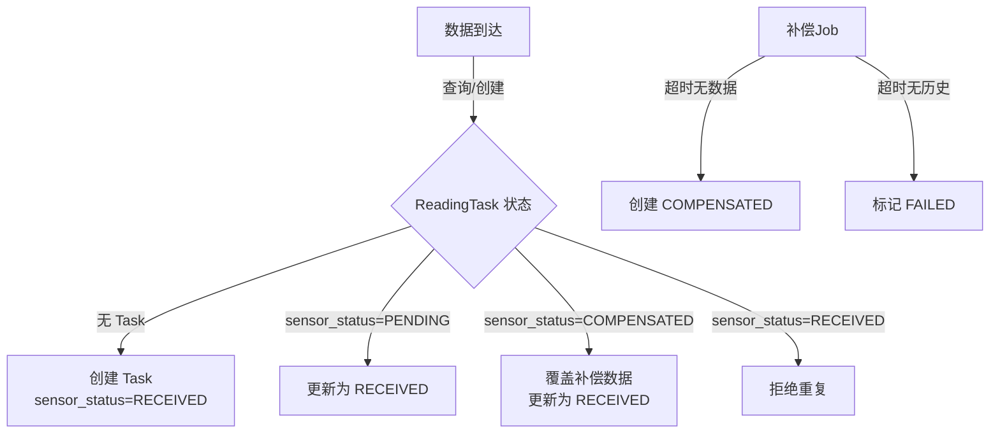
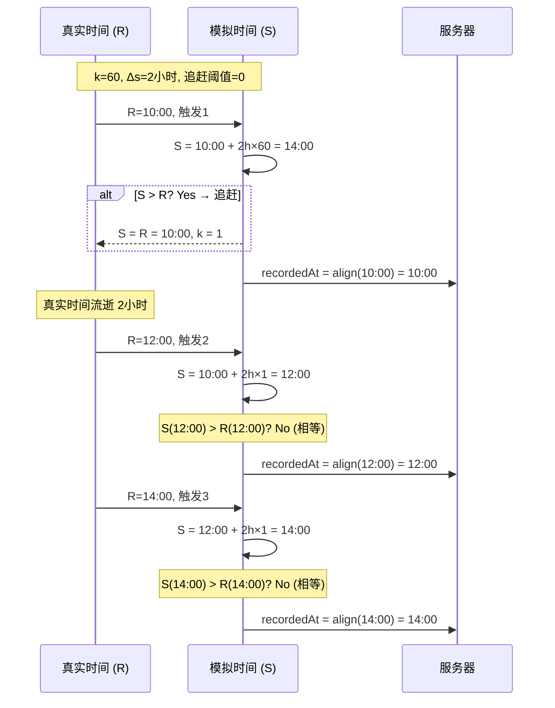
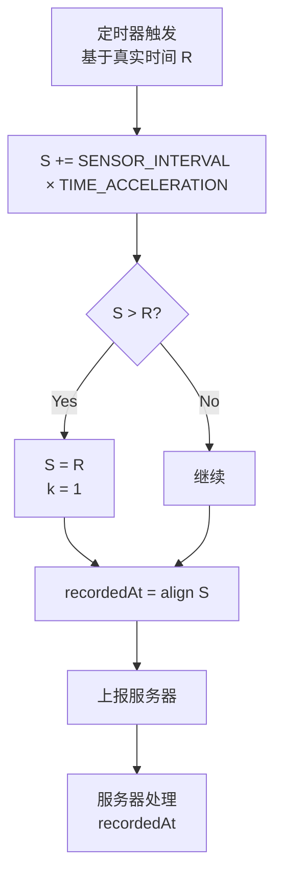

***

id: "SPEC-SENSOR-001"
type: "specification"
category: "project/specs"
tags: \["sensor", "data-transmission", "configuration", "implementation-plan"]
created: "2026-04-12"
updated: "2026-04-13"
author: "AI Assistant"
status: "draft"
---------------

# 传感器系统规格说明书

## 1. 核心设计

### 1.1 单工批量上报模式

```
传感器（虚拟设备）          后端服务
     │                          │
     │  批量上报（主动）         │
     │ ───────────────────────> │
     │                          │
     │  响应（成功/失败）         │
     │ <─────────────────────── │
     │                          │
```

**设计原则**：

- 传感器主动批量上报（队列概念），不等待后端指令
- 后端被动接收，根据时间判断数据类型
- 失败数据保留在传感器本地队列，下次重试
- **批量是队列存储概念，上报接口仍是逐条 POST**

### 1.2 数据状态流转



**关键理解**：

- **RECEIVED** 是唯一的终态
- **COMPENSATED** 是服务器"等不及了"自己造的假数据
- **补传数据按 recorded\_at 覆盖补偿数据**
- 传感器端主导：后端只在收到数据时创建/更新 Task

### 1.3 补传判断逻辑（已敲定）

**判断公式**：

```
isSupplement = (最近整点周期起始时间 - recordedAt) > TOLERANCE_PERIOD
             && recordedAt < 最近整点周期起始时间
```

**判断逻辑说明**：

1. **差值 > 容忍期**：数据到达时间比当前周期晚了超过容忍期
2. **recordedAt < 最近整点**：确保数据是过去的（不是当前或未来的周期）

**容忍期基准**：基于传感器上报的 `recordedAt`，而非后端收到时间

**判断示例**（TOLERANCE\_PERIOD = 5分钟）：

| recordedAt | 最近整点  | 差值    | recordedAt < 最近整点? | 结果     | 说明                     |
| ---------- | ----- | ----- | ------------------ | ------ | ---------------------- |
| 08:00      | 08:00 | 0分钟   | 否（相等）              | 正常     | 当前周期数据                 |
| 08:03      | 08:00 | 3分钟   | 否                  | 正常     | 当前周期数据，在容忍期内           |
| 08:06      | 08:00 | 6分钟   | 否                  | 正常     | 当前周期数据，但超过容忍期（可能是时钟漂移） |
| 07:55      | 08:00 | 5分钟   | 是                  | 正常     | 上一周期数据，差值 = 容忍期，不算补传   |
| 07:54      | 08:00 | 6分钟   | 是                  | **补传** | 上一周期数据，差值 > 容忍期        |
| 06:00      | 08:00 | 120分钟 | 是                  | **补传** | 很久以前的数据                |

> **⚠️ 边界情况说明**：
>
> - **差值 = 容忍期**：不算补传（严格大于才算）
> - **recordedAt = 最近整点**：当前周期数据，不算补传
> - **recordedAt > 最近整点**：理论上不会发生（传感器时间不会超前），如果发生按异常处理

### 1.4 传感器时间与 recordedAt（已敲定）

**规则**：传感器上报的 `recordedAt` = 直接使用模拟时间 SIMULATED\_TIME

```
传感器内部模拟时间（SIMULATED_TIME） vs 上报的 recordedAt：

1. 传感器维护内部模拟时间 SIMULATED_TIME（支持时间加速）
2. 每次采集时：SIMULATED_TIME += SENSOR_INTERVAL × TIME_ACCELERATION
3. 如果 SIMULATED_TIME > 真实时间 → 追赶（SIMULATED_TIME = 真实时间, k=1）
4. 上报的 recordedAt = SIMULATED_TIME（直接使用，不对齐）
```

**结果**：

- 正常情况：时间戳为 08:00, 10:00, 12:00...（整点）
- 追赶后：时间戳可能为 15:02, 17:02, 19:02...（非整点但间隔正确）

**注意**：SIMULATED\_TIME 是传感器**内部变量**，不是环境变量。环境变量只有：

- `TIME_ACCELERATION` - 时间加速倍数
- `SENSOR_INTERVAL` - 采集间隔（固定 2 小时 = 7200000ms）

***

## 2. 环境变量配置

### 2.1 设计原则

- **单一真相源**：时间相关的配置只有一个地方定义
- **分离关注点**：系统级/后端级/设备级/测试级分层配置
- **场景化配置**：通过组合少量变量实现多种测试场景
- **传感器端主导**：后端 Task 由传感器数据触发，不预生成

### 2.2 环境变量清单

#### 后端专用配置

| 变量名                    | 类型      | 默认值        | 说明                  |
| ---------------------- | ------- | ---------- | ------------------- |
| `TOLERANCE_PERIOD`     | number  | `300000`   | 容忍期（毫秒），默认5分钟       |
| `COMPENSATION_ENABLED` | boolean | `true`     | 是否启用数据补偿机制          |
| `MAX_COMPENSATION_AGE` | number  | `86400000` | 最大补偿时间范围（毫秒），默认24小时 |

#### 设备级配置（传感器/模拟器）

| 变量名                  | 类型     | 默认值                 | 说明           |
| -------------------- | ------ | ------------------- | ------------ |
| `DEVICE_ID`          | string | ✅                   | 设备唯一标识       |
| `PLANT_ID`           | string | ✅                   | 绑定植物ID       |
| `HTTP_API_URL`       | string | ✅                   | 后端数据上报接口     |
| `HTTP_API_TOKEN`     | string | -                   | 认证 Token（可选） |
| `LOCAL_QUEUE_SIZE`   | number | `50`                | 本地队列容量       |
| `QUEUE_PERSIST_PATH` | string | `./data/queue.json` | 队列持久化路径      |

**固定常量**（代码中硬编码，不可配置）：

| 常量名                  | 值         | 说明                   |
| :------------------- | :-------- | :------------------- |
| `SENSOR_INTERVAL_MS` | `7200000` | 采集间隔：2小时 = 7200000毫秒 |
| `UPLOAD_INTERVAL_MS` | `60000`   | 上报间隔：1分钟 = 60000毫秒   |

#### 测试专用配置（仅开发/测试环境）

| 变量名                 | 类型     | 默认值      | 可选值                        | 约束条件                  |
| ------------------- | ------ | -------- | -------------------------- | --------------------- |
| `TIME_ACCELERATION` | number | `1`      | 1-3600，时间流速倍数              | 仅用于**启动加速**，追赶后自动重置为1 |
| `SIMULATION_MODE`   | string | `normal` | `normal`/`stress`/`random` | -                     |
| `NETWORK_CONDITION` | string | `good`   | `good`/`poor`/`offline`    | -                     |

> **⚠️ 重要说明**：`TIME_ACCELERATION` 是**启动加速**参数，不是持续加速。
>
> - 模拟器启动时，模拟时间会用加速倍数快速追上真实时间
> - 一旦追上（`SIMULATED_TIME >= 真实时间`），立即重置为1，恢复正常速度
> - 因此**不存在** `TIME_ACCELERATION × SENSOR_INTERVAL < DATA_SYNC_INTERVAL` 的约束

**场景映射表**：

| SIMULATION\_MODE | NETWORK\_CONDITION | 效果描述        |
| ---------------- | ------------------ | ----------- |
| `normal`         | `good`             | 正常生产环境      |
| `normal`         | `poor`             | 网络不稳定，30%丢包 |
| `stress`         | `poor`             | 高负载+网络差     |
| `random`         | `offline`          | 完全离线        |

### 2.3 配置文件示例

**模拟器配置**（`_dev/tools/virtual_device/.env`）

```bash
# ============================================
# 设备级配置
# ============================================
DEVICE_ID=DEVICE_PLANT_001
PLANT_ID=PLANT_46abed3703ed404d
HTTP_API_URL=http://localhost:3000/api/devices/data
HTTP_API_TOKEN=your_token_here

# ============================================
# 传感器配置
# ============================================
SENSOR_INTERVAL=300000              # 采集间隔（毫秒），默认5分钟

# ============================================
# 队列配置
# ============================================
LOCAL_QUEUE_SIZE=50
QUEUE_PERSIST_PATH=./data/queue.json
DATA_SYNC_INTERVAL=7200000

# ============================================
# 测试配置（可选）
# ============================================
TIME_ACCELERATION=60
SIMULATION_MODE=normal
NETWORK_CONDITION=good
```

**后端配置**（`.env`）

```bash
# ============================================
# 后端级
# ============================================
TOLERANCE_PERIOD=300000
COMPENSATION_ENABLED=true
MAX_COMPENSATION_AGE=86400000
```

***

## 3. 关键设计决策

### 3.1 时间戳策略（简化版）

**原则**：分钟级时间戳 + 整点起始对齐

```
设计前提：
- SIMULATED_TIME_INITIAL 设为整点（如 2026-04-13T08:00:00）
- SENSOR_INTERVAL 设为2小时倍数（7200000ms）
- 模拟时间自然推进，无需额外对齐

结果：
08:00:00 → 10:00:00 → 12:00:00 → 14:00:00 ...
  ↑           ↑           ↑           ↑
整点！       整点！       整点！       整点！

上报的 recordedAt = 模拟时间（分钟级，但恰好是整点）
```

**实现**：

```python
# 直接使用模拟时间，无需对齐
data = simulator.generate_data(timestamp=self.sim_time)
```

**配置建议**：

```bash
# 正确的配置
SIMULATED_TIME_INITIAL=2026-04-13T08:00:00  # 整点起始
SENSOR_INTERVAL=7200000                      # 2小时间隔

# 错误的配置（会触发警告）
SIMULATED_TIME_INITIAL=2026-04-13T08:30:00  # 非整点起始
# 结果：08:30, 10:30, 12:30... 与后端周期不匹配
```

### 3.2 队列存储策略（已敲定）

**方式**：内存 + JSON文件持久化

- 运行时数据存储在内存队列
- 定期（每次变更后）持久化到JSON文件
- 程序启动时从JSON文件恢复队列

**溢出策略**：覆盖最老数据（FIFO）

```python
def add(self, recorded_at, metrics):
    """添加数据，队列满时覆盖最老数据"""
    if len(self.queue) >= self.max_size:
        # 移除最早的记录
        oldest = min(self.queue, key=lambda x: x['recorded_at'])
        self.queue.remove(oldest)
        # ⚠️ 警告：数据丢失
        logger.warning(f"队列溢出，丢弃最老数据: {oldest['recorded_at']}")
    self.queue.append({
        'recorded_at': recorded_at,
        'metrics': metrics,
        'retry_count': 0,
        'created_at': datetime.now().isoformat()
    })
```

> **⚠️ 队列溢出风险说明**
>
> **场景**：传感器离线很长时间，队列满了，新数据不断覆盖老数据
>
> **后果**：
>
> - 最老的数据还没成功上报就被覆盖
> - 数据永久丢失
>
> **缓解措施**：
>
> 1. **监控告警**：当发生覆盖时记录警告日志
> 2. **队列大小**：根据传感器离线容忍时间设置合理的队列大小
>    - 假设 SENSOR\_INTERVAL = 2小时，离线容忍 7天
>    - 队列大小 = 7天 / 2小时 = 84条
>    - 建议设置 100-200条，留有余量
> 3. **持久化频率**：每次变更后立即持久化，减少丢失风险
> 4. **上报优先级**：队列中的数据按时间顺序上报，老数据优先
>
> **未来优化**（可选）：
>
> - 双队列策略：一个"待发送"队列，一个"已发送待确认"队列
> - 磁盘队列：当内存队列满时，溢出到磁盘文件

### 3.3 批量上报触发策略（已敲定）

**方式**：定时触发 + 逐条确认

- 整点后触发上报（DATA\_SYNC\_INTERVAL 周期）
- 从队列中逐条发送数据
- 服务器返回成功响应后，才从队列移除该数据条
- 失败的数据条保留在队列中，下次继续尝试

### 3.4 失败重试策略（已敲定）

**策略**：下次定时触发时重试

- 失败后数据保留在队列中
- 等待下一次整点触发（DATA\_SYNC\_INTERVAL 周期）
- 避免频繁重试造成网络压力
- 重试次数记录在队列数据中

### 3.5 补传数据处理（已敲定）

**策略**：后端通过 recordedAt 时间判断，补偿数据按 recorded\_at 覆盖

**判断逻辑**：

```
isSupplement = (最近整点周期起始时间 - recordedAt) > TOLERANCE_PERIOD

示例（TOLERANCE_PERIOD = 5分钟）：
- recordedAt = 08:00，差值 = 0分钟 → 正常上报
- recordedAt = 08:06，差值 = 6分钟 → 补传
```

**补偿数据覆盖**：

- 补传数据到达时，查询是否有同一周期的补偿数据
- 如果有，按 `recorded_at` 覆盖（UPSERT）
- 保留 `is_stale` 标记用于前端区分

### 3.5 时间机制完整解析（重写）

#### 3.5.1 数学模型

**核心变量**：

| 变量       | 中文                 | English            | 数学符号 | 类型   | 说明                      |
| :------- | :----------------- | :----------------- | :--- | :--- | :---------------------- |
| 真实时间     | 真实时间               | Real Time          | `R`  | 外部变量 | 外部可感知的时间，独立流逝           |
| 模拟时间     | 模拟时间               | Simulated Time     | `S`  | 内部变量 | 传感器内部认为的时间              |
| 模拟时间采集间隔 | SENSOR\_INTERVAL   | Sensor Interval    | `Δs` | 配置   | 模拟时间采集间隔（毫秒），默认 2 小时    |
| 时间加速倍数   | TIME\_ACCELERATION | Time Acceleration  | `k`  | 配置   | 时间加速倍数，默认 1，**追赶后重置为1** |
| 定时器间隔    | -                  | Timer Interval     | `Δt` | 计算值  | 定时器触发间隔（秒），动态计算         |
| 追赶阈值     | 追赶阈值               | Catch-up Threshold | `0`  | 固定值  | 触发条件：S > R              |
| 容忍期      | TOLERANCE\_PERIOD  | Tolerance Period   | `T`  | 配置   | 补传判断阈值（毫秒），默认 5 分钟      |

**约束条件**：`S ≤ R`（模拟时间永远不超过真实时间）

**定时器间隔计算**（在每次触发时计算下一次间隔）：

```
Δt = Δs / (k × 1000)  // 秒，k > 1 时间隔变小（加速）
Δt = Δs / 1000        // 秒，k = 1 时为正常间隔（稳态）
```

> **🔑 关键理解**：
>
> - 定时器间隔 `Δt` 是**动态计算**的，不是固定的
> - 追赶阶段（k > 1）：`Δt = Δs / k`，因为模拟时间加速增长，定时器需要更快触发才能追上真实时间
> - 稳态阶段（k = 1）：`Δt = Δs`，模拟时间与真实时间同步增长，定时器按正常间隔触发

**追赶逻辑数学前提**：

- 每次定时器触发时，传感器记录当前真实时间 `R_new`
- 真实时间流逝：`dR = Δt = Δs / k`
- 模拟时间流逝：`dS = k × dR = k × (Δs / k) = Δs`
- 模拟时间推进：`S = S + Δs`（固定推进传感器间隔）
- 如果 `S > R_new`，触发追赶：`S = R_new`, `k = 1`
- 下一次定时器间隔：`Δt = Δs / 1000`（恢复正常间隔）

> **⚠️ 重要**：追赶逻辑**只在虚拟设备/模拟器中适用**，因为我们可以动态调整定时器间隔。真实传感器通常固定间隔，无法实现追赶。

#### 3.5.2 算法描述

```python
# 初始化
R = now()                              # 真实时间，取当前时刻
S = now()                              # 模拟时间，初始化为当前真实时间
k = int(os.getenv('TIME_ACCELERATION', 1))  # 时间加速倍数
Δs = int(os.getenv('SENSOR_INTERVAL', 7200000))  # 模拟时间采集间隔（毫秒）

# 每次定时器触发时执行：
def on_trigger():
    # 1. 更新真实时间
    R = now()
    
    # 2. 模拟时间推进（dS = k × dR = k × (Δs/k) = Δs）
    S += Δs

    # 3. 追赶逻辑：如果 S > R，则 S = R, k = 1
    if S > R:
        S = R
        k = 1

    # 4. 计算 recordedAt（直接使用模拟时间，不对齐）
    recordedAt = S

    # 5. 上报
    send({ recordedAt, metrics })
```

#### 3.5.3 自然语言描述

```
传感器有两个时间：
- 真实时间 R：外部世界的时间，独立流逝
- 模拟时间 S：传感器内部认为的时间，可以加速

关系：
- 真实时间 R 每流逝 dR，模拟时间 S 流逝 dS = k × dR
- 当 S > R 时，触发追赶：S = R, k = 1
- S ≤ R 永远成立
```

#### 3.5.4 算法描述（Python）

```python
# 初始化
R = now()                              # 真实时间，取当前时刻
S = now()                              # 模拟时间，初始化为当前真实时间
k = int(os.getenv('TIME_ACCELERATION', 1))  # 时间加速倍数
Δs = int(os.getenv('SENSOR_INTERVAL', 7200000))  # 模拟时间采集间隔（毫秒）

# 每次定时器触发时执行：
def on_trigger():
    # 1. 模拟时间推进
    S += Δs * k

    # 2. 追赶逻辑：如果 S > R，则 S = R, k = 1
    if S > R:
        S = R
        k = 1

    # 3. 计算 recordedAt（直接使用模拟时间，不对齐）
    recordedAt = S

    # 4. 上报
    send({ recordedAt, metrics })
```

#### 3.5.5 追赶逻辑详解

```
触发条件：S > R

触发时：
1. S += Δs × k
2. 如果 S > R → S = R, k = 1

结果：
- TIME_ACCELERATION > 1 时，一定会在下次触发时触发追赶
- 追赶后 k = 1，系统恢复正常速度运行（时间已对齐，加速无意义）
- S 和 R 同步增长，S 永远不超过 R
```

**关键约束**：

追赶逻辑的实现要求定时器触发的真实间隔 `Δt = Δs / k`。如果 Sensor 的 interval 不等于 Δt，则追赶逻辑无法按数学模型运行。

**适用场景**：

- 虚拟设备/模拟器：可以精确控制定时器间隔
- 真实传感器：通常是固定间隔，无法动态调整

#### 3.5.6 时间戳策略（已简化）

**原则**：直接使用模拟时间 S 作为 recordedAt，不对齐

```
时间戳计算：
recordedAt = S  // 直接使用模拟时间

示例：
- 正常情况：S=10:00 → recordedAt=10:00
- 追赶后：S=15:02 → recordedAt=15:02（非整点但间隔正确）
```

**说明**：

- 起始时间 S₀ 建议设为整点（如 08:00），此时时间戳为 08:00, 10:00, 12:00...
- 追赶后 S 被重置为当前真实时间（如 15:02），之后时间戳为 15:02, 17:02, 19:02...
- 后端接收任意时间戳，按实际 recordedAt 存储

#### 3.5.7 完整时间线示例



**时间线说明**：

| 触发 | 真实时间 R | S 增长后             | S > R? | 追赶后 S | recordedAt | k  |
| :- | :----- | :---------------- | :----- | :---- | :--------- | :- |
| 1  | 10:00  | 10:00+2h×60=14:00 | Yes    | 10:00 | 10:00      | 1  |
| 2  | 12:00  | 10:00+2h×1=12:00  | No     | -     | 12:00      | 1  |
| 3  | 14:00  | 12:00+2h×1=14:00  | No     | -     | 14:00      | 1  |

#### 3.5.8 服务端处理

```javascript
// 服务端收到 { recordedAt: "2026-04-13T10:00:00" }

// 1. 对齐到整点（用 recordedAt 本身）
const periodStart = alignToInterval(new Date(recordedAt));

// 2. 判断是否补传
const recordedAtDate = new Date(recordedAt);
const now = new Date();
const nowPeriodStart = alignToInterval(now);
const isSupplement = (nowPeriodStart - recordedAtDate) > TOLERANCE_PERIOD
                  && recordedAtDate < nowPeriodStart;

// 3. UPSERT
await ReadingTask.upsert({
    plant_id,
    recorded_at: periodStart,
    sensor_status: 'received'
});
```

#### 3.5.9 稳态分析

**追赶后**：k = 1，S = R（追赶时刻）

**稳态条件**：

```
Δt = 真实时间间隔 = SENSOR_INTERVAL / 1 (因为 k=1)

触发 n+1:
  S_n+1 = S_n + Δs × 1
  R_n+1 = R_n + Δt

因为 S_n = R_n（追赶后相等），Δs = Δt：
  S_n+1 = R_n + Δs
  R_n+1 = R_n + Δs
  S_n+1 = R_n+1

结论：稳态下 S 和 R 保持同步
```

#### 3.5.10 全链路总结



**关键点**：

- SENSOR\_INTERVAL 是**模拟时间**采集间隔，不是真实时间间隔
- TIME\_ACCELERATION 只在启动时生效一次
- 追赶阈值固定为 0（S > R 时触发）
- S ≤ R 永远成立

#### 3.5.11 环境变量术语对照

| 中文                 | English            | 数学符号 | 说明                 |
| :----------------- | :----------------- | :--- | :----------------- |
| SENSOR\_INTERVAL   | SENSOR\_INTERVAL   | `Δs` | 模拟时间采集间隔（毫秒），默认2小时 |
| TIME\_ACCELERATION | TIME\_ACCELERATION | `k`  | 时间加速倍数，默认1         |
| 追赶阈值               | Catch-up Threshold | `0`  | 固定值，触发条件：S > R     |
| TOLERANCE\_PERIOD  | TOLERANCE\_PERIOD  | `T`  | 容忍期（毫秒），默认5分钟      |

**策略**：跳过关机期间任务，从恢复时刻开始

**时间加速恢复逻辑**：

```
1. 传感器维护内部模拟时间 SIMULATED_TIME（支持 TIME_ACCELERATION）
2. 每次采集：SIMULATED_TIME += SENSOR_INTERVAL × TIME_ACCELERATION
3. 如果 SIMULATED_TIME >= 真实时间 → 恢复正常流速
   - SIMULATED_TIME = 真实时间
   - TIME_ACCELERATION = 1
4. 上报的 recordedAt = 对齐到最近整点周期（SIMULATED_TIME 对齐到 2h）
```

### 3.7 Task 富余策略（混合模式）

**策略**：传感器端主导 + Task 富余保底

**核心原则**：

- 传感器上报时 **UPSERT** Task（sensor\_status=RECEIVED）
- 后端定时预生成 Task 富余（sensor\_status=PENDING）
- 最新 RECEIVED 数据后保证有 N 个 PENDING Task

> **🔑 关键理解：UPSERT 机制**
>
> `UPSERT` = `UPDATE`（如果存在）或 `INSERT`（如果不存在）
>
> 这意味着：
>
> 1. **传感器先上报**：创建 `sensor_status=RECEIVED` 的 Task
> 2. **后端预生成**：在同一周期创建 `sensor_status=PENDING` 的 Task
> 3. **UPSERT 时**：发现 Task 已存在（由后端预生成），更新状态为 `RECEIVED`
>
> **不存在冲突**，因为数据库有 `UNIQUE(plant_id, recorded_at)` 约束，保证每个周期只有一条记录。

**职责分离**：

| 数据类型  | Task 生成方式                     | 说明              |
| :---- | :---------------------------- | :-------------- |
| 传感器数据 | 传感器上报时 UPSERT + 后端预生成 PENDING | 传感器主导，Task 富余保底 |
| 天气数据  | 后端定时任务管理                      | 后端主导            |

**Task 状态流转**：

```
阶段1：后端预生成（定时任务）
  - 扫描每个植物最新的 sensor_status=RECEIVED 的 Task
  - 在其 recorded_at 之后预生成 N 个 PENDING Task
  - 结果：[T1: PENDING] [T2: PENDING] [T3: PENDING] ...

阶段2：传感器上报（UPSERT）
  - 传感器上报 T1 时间点的数据
  - UPSERT：发现 T1 已存在（PENDING），更新为 RECEIVED
  - 结果：[T1: RECEIVED] [T2: PENDING] [T3: PENDING] ...

阶段3：补偿 Job（定时任务）
  - 扫描超时的 PENDING Task
  - 如果 T2 超时（超过容忍期）→ 更新为 COMPENSATED/FAILED
```

**Task 队列示意**：

```
初始状态（后端预生成）：
[T1: 08:00, sensor=PENDING] → [T2: 10:00, sensor=PENDING] → [T3: 12:00, sensor=PENDING] → [T4: 14:00, sensor=PENDING]

传感器上报 T1 后（UPSERT 更新）：
[T1: 08:00, sensor=RECEIVED] → [T2: 10:00, sensor=PENDING] → [T3: 12:00, sensor=PENDING] → [T4: 14:00, sensor=PENDING]
    ↑
  已收到数据

传感器上报 T2 后（UPSERT 更新）：
[T1: 08:00, sensor=RECEIVED] → [T2: 10:00, sensor=RECEIVED] → [T3: 12:00, sensor=PENDING] → [T4: 14:00, sensor=PENDING]
                                    ↑
                                  已收到数据

后端持续预生成（保持 N 个 PENDING）：
[T1: RECEIVED] → [T2: RECEIVED] → [T3: PENDING] → [T4: PENDING] → [T5: PENDING] → [T6: PENDING]
                                      ↑
                                    后端新增预生成
```

**数据库设计**：

```sql
reading_tasks
- task_id         -- UUID
- plant_id        -- 关联植物
- recorded_at      -- 周期起始时间
- sensor_status    -- pending/received/compensated/failed
- weather_status   -- pending/received/failed
- created_at      -- Task创建时间

-- 唯一约束：保证每个周期只有一条记录
UNIQUE(plant_id, recorded_at)
```

**关键点**：

- 传感器上报不依赖预生成 Task（UPSERT 保证）
- 预生成 Task 提供富余，确保系统鲁棒
- Task 数量与时间流速无关
- weather\_status 和 sensor\_status 独立管理

### 3.8 时间流速用途与风险（已敲定）

**用途**：

| 用途   | 说明                       |
| ---- | ------------------------ |
| 测试加速 | 快速验证周期性功能（2小时周期不用真的等2小时） |
| 开发调试 | 提高调试效率，不用长时间等待           |
| 压力测试 | 模拟长期运行，暴露潜在问题            |

**已消除的风险**：

| 风险     | 解决方案                            |
| ------ | ------------------------------- |
| 设备队列溢出 | 覆盖最老数据策略（3.2）✓                  |
| 数据丢失   | 逐条确认机制（3.3）✓                    |
| 收到未来数据 | recordedAt 用整点对齐，永不超越真实时间（1.4）✓ |

**需关注的风险**：

| 风险   | 说明                      |
| ---- | ----------------------- |
| 日志过快 | 日志写入频率过高，需考虑异步写入或日志级别控制 |
| 前端显示 | 页面刷新过快，需节流处理            |

***

## 4. 实施计划

### Phase 1：模拟器改造（优先级：高）

#### 4.1.1 创建本地任务队列

**文件**：`app/core/local_task_queue.py`

**存储结构**：

```python
{
    "queue": [
        {
            "recorded_at": "2026-04-12T10:00:00",
            "metrics": {"temperature": 25.5, "humidity": 60},
            "retry_count": 0,
            "created_at": "2026-04-12T10:00:00"
        }
    ],
    "last_updated": "2026-04-12T10:05:00"
}
```

**核心方法**：

```python
class LocalTaskQueue:
    def add(self, recorded_at, metrics)           # 添加数据（溢出覆盖最老）
    def get_next(self) -> dict                    # 获取下一条数据
    def remove(self, recorded_at)                 # 移除已确认数据
    def align_time(self, timestamp) -> datetime  # 对齐到2小时间隔
    def persist(self)                             # 持久化到JSON文件
    def restore(self)                             # 从JSON文件恢复
    def get_all_pending(self) -> list            # 获取所有待发送数据
```

#### 4.1.2 改造传感器模型（追赶逻辑实现）

**文件**：`app/model/sensor.py`

**核心思路**：在 Sensor 类内部维护 S/R/k，动态调整定时器间隔，实现追赶逻辑

**修改点**：

1. Sensor 内部维护 S（模拟时间）、R（真实时间）、k（加速倍数）
2. 每次触发后，根据 Δt = Δs / k 计算下一次间隔
3. 追赶逻辑在 Sensor 内部执行

**伪代码**（已修复执行顺序和对齐问题）：

```python
import os
from datetime import datetime, timedelta
import threading
import logging

# 约束常量
MAX_TIME_ACCELERATION = 3600  # 最大加速倍数
CALLBACK_TIMEOUT = 30  # 回调超时（秒）

def align_to_interval(timestamp):
    """对齐到2小时整点周期"""
    hour = timestamp.hour
    aligned_hour = (hour // 2) * 2
    return timestamp.replace(hour=aligned_hour, minute=0, second=0, microsecond=0)

class Sensor(SensorModel):
    def start_simulation(self, callback):
        self.callback = callback
        self.simulator = Simulator(sensor=self)
        self.running = True
        self.is_processing = False

        # 追赶逻辑状态初始化
        self.S = datetime.now()  # 模拟时间
        self.R = datetime.now()  # 真实时间
        raw_k = int(os.getenv('TIME_ACCELERATION', 1))
        self.k = min(raw_k, MAX_TIME_ACCELERATION)  # 限制最大值
        self.Δs = int(os.getenv('SENSOR_INTERVAL', 7200000))  # 步长（毫秒）
        self.has_caught_up = False

        self._schedule_next()

    def _schedule_next(self):
        """根据当前 k 计算下一次触发间隔 Δt（秒）"""
        Δt_ms = self.Δs / self.k           # 间隔（毫秒）
        Δt_seconds = max(Δt_ms / 1000, 0.1)  # 最小间隔 100ms
        timer = threading.Timer(interval=Δt_seconds, function=self._on_trigger)
        timer.start()

    def _on_trigger(self):
        if not self.running:
            return

        if self.is_processing:
            logger.warning("上一次处理未完成，跳过本次触发")
            self._schedule_next()
            return

        self.is_processing = True

        try:
            # 1. 更新真实时间
            self.R = datetime.now()

            # 2. 推进模拟时间（先推进！）
            self.S += timedelta(milliseconds=self.Δs * self.k)

            # 3. 追赶逻辑（后判断！）
            if not self.has_caught_up and self.S > self.R:
                logger.info(f"追赶触发: S={self.S}, R={self.R}, 重置k=1")
                self.k = 1
                self.has_caught_up = True

            # 4. 对齐到整点周期（必须对齐！）
            data_timestamp = align_to_interval(self.S)

            # 5. 生成数据
            data = self.simulator.generate_data(timestamp=data_timestamp)

            # 6. 调用回调（带超时控制）
            import signal
            def timeout_handler(signum, frame):
                raise TimeoutError("回调执行超时")
            
            try:
                signal.signal(signal.SIGALRM, timeout_handler)
                signal.alarm(CALLBACK_TIMEOUT)
                self.callback(self, data)
                signal.alarm(0)  # 取消超时
            except TimeoutError as e:
                logger.error(f"回调执行超时({CALLBACK_TIMEOUT}s): {e}")
                # 数据丢失，不重试（避免队列堆积）
            except Exception as e:
                logger.error(f"回调执行失败: {e}")
                signal.alarm(0)

        except Exception as e:
            logger.error(f"触发处理失败: {e}")
        finally:
            self.is_processing = False
            self._schedule_next()

    def stop_simulation(self):
        self.running = False
```

> **🔑 关键修复说明**：
>
> 1. **执行顺序修正**：`S += Δs × k` 在前，追赶判断在后（与规格 3.5.2 一致）
> 2. **align\_to\_interval**：使用 `align_to_interval(S)` 对齐到整点（符合规格 1.4）
> 3. **并发控制**：使用 `signal.alarm` 实现超时机制
> 4. **加速上限**：`k` 限制为 `MAX_TIME_ACCELERATION`（3600）
> 5. **最小间隔**：Δt 最小 100ms，防止 Timer 过于频繁
> 6. **并发控制**：添加 `is_processing` 锁防止重入
> 7. **错误处理**：回调失败不影响定时器继续运行

**关键实现要点**：

| 要点           | 说明                                |
| :----------- | :-------------------------------- |
| 定时器间隔动态调整    | 每次触发后计算 Δt = Δs / k               |
| 追赶条件         | S > R 时触发追赶                       |
| 追赶后          | k = 1, has\_caught\_up = True     |
| 数据 timestamp | 使用 `align_to_interval(S)` 对齐到整点   |
| 加速上限         | `k ≤ MAX_TIME_ACCELERATION`（3600） |
| 最小间隔         | `Δt ≥ 100ms`，防止 Timer 过于频繁        |
| 并发控制         | 超时机制（`CALLBACK_TIMEOUT = 30s`）    |

**与 Device 的交互**：

Sensor 通过 callback 将数据传递给 Device。Device 的职责简化为：

- 接收 Sensor 的数据
- 调用 HTTPHelper 上报

```python
# Device 侧
def send_simulator_data(self, sensor, data):
    # data 中已包含 aligned timestamp
    self.http_helper.send_data(data)
```

#### 4.1.3 改造HTTP助手（集成队列）

**文件**：`app/utils/http_helper.py`

**架构**：HTTPHelper 集成 LocalTaskQueue，负责：

1. 接收 Sensor 已处理的数据（timestamp 已对齐）
2. 加入本地队列（持久化）
3. 从队列取数据逐条上报
4. 成功后移除，失败保留

**伪代码**：

```python
class HTTPHelper:
    def __init__(self, api_url):
        self.api_url = api_url
        self.queue = LocalTaskQueue(
            max_size=int(os.getenv('LOCAL_QUEUE_SIZE', 50)),
            persist_path=os.getenv('QUEUE_PERSIST_PATH', './data/queue.json')
        )
        self.queue.restore()  # 启动时恢复队列
        self._start_upload_loop()

    def send_data(self, data):
        """接收 Sensor 数据，加入队列"""
        aligned_time = align_to_interval(data.get('timestamp'))
        queue_item = {
            'recorded_at': aligned_time,
            'device_id': data.get('deviceId'),
            'plant_id': data.get('plantId'),
            'metrics': data.get('metrics')
        }
        self.queue.add(aligned_time, queue_item)
        self.queue.persist()

    def _upload_pending(self):
        """上传队列中的待发送数据"""
        pending = self.queue.get_all_pending()
        for item in pending:
            try:
                response = requests.post(
                    self.api_url,
                    headers=self.headers,
                    json=item,
                    timeout=10
                )
                if response.status_code == 200:
                    result = response.json()
                    if result.get('code') == 0:
                        self.queue.remove(item['recorded_at'])
                        self.queue.persist()
                    else:
                        logger.warning(f"服务器错误: {result}")
                        break  # 停止后续发送
                else:
                    logger.warning(f"HTTP错误: {response.status_code}")
                    break
            except Exception as e:
                logger.error(f"发送失败: {e}")
                break

    def _start_upload_loop(self):
        """启动定时上报循环"""
        upload_interval = int(os.getenv('DATA_SYNC_INTERVAL', 7200000)) / 1000
        timer = threading.Timer(interval=upload_interval, function=self._upload_loop)
        timer.start()

    def _upload_loop(self):
        if not self.running:
            return
        self._upload_pending()
        self._start_upload_loop()  # 继续调度
```

> **🔑 架构说明**：
>
> - **LocalTaskQueue 在 HTTPHelper 层**：负责存储、持久化、重试
> - **Sensor 只管生成+追赶**：不关心队列
> - **Device 是中间层**：接收 Sensor 数据，调用 HTTPHelper
> - **数据流**：`Sensor → Device → HTTPHelper → [队列] → 后端`

### Phase 2：后端改造（优先级：高）

#### 4.2.1 环境服务（UPSERT + 传感器主导）

**文件**：`backend/server/src/services/EnvironmentService.js`

**核心逻辑**：

1. 收到传感器数据后，按 `(plant_id, recorded_at)` 执行 UPSERT
2. 补传数据到达时，覆盖同周期的补偿数据
3. 触发 Task 富余补充

**伪代码**（已修复补传判断逻辑）：

```javascript
async processDeviceEnvironmentData(plantId, data) {
    const { deviceId, recordedAt, metrics } = data;
    const recordedAtDate = new Date(recordedAt);
    const now = new Date();

    // 获取当前周期起始时间
    const currentPeriodStart = getNearestIntervalTime(now);
    
    // 判断是否为补传（修复：处理负数和边界情况）
    let isSupplement = false;
    let isDelayed = false;
    
    if (recordedAtDate < currentPeriodStart) {
        // 数据属于过去周期
        const timeDiff = currentPeriodStart - recordedAtDate;
        isSupplement = timeDiff > TOLERANCE_PERIOD;
    } else {
        // 数据属于当前周期，检查是否延迟到达
        const delay = now - recordedAtDate;
        isDelayed = delay > TOLERANCE_PERIOD;
        // 当前周期内的延迟数据，不算补传，但可标记为延迟
    }

    // UPSERT ReadingTask（带错误处理）
    let task;
    try {
        [task, created] = await ReadingTask.upsert({
            plant_id: plantId,
            recorded_at: recordedAtDate,
            sensor_status: 'received'
        });
    } catch (dbError) {
        logger.error(`ReadingTask UPSERT失败: ${dbError.message}`);
        throw new Error('数据库操作失败');
    }

    // UPSERT EnvironmentReading（带重试）
    const maxRetries = 3;
    for (let i = 0; i < maxRetries; i++) {
        try {
            if (isSupplement) {
                // 补传数据：先删除同周期补偿数据
                await EnvironmentReading.destroy({
                    where: {
                        plant_id: plantId,
                        recorded_at: recordedAtDate,
                        data_source: 'sensor',
                        is_stale: true
                    }
                });
            }

            await EnvironmentReading.upsert({
                plant_id: plantId,
                recorded_at: recordedAtDate,
                data_source: 'sensor',
                source_id: deviceId,
                is_stale: false,
                metrics: metrics
            });
            
            break; // 成功，跳出重试循环
        } catch (dbError) {
            logger.error(`EnvironmentReading UPSERT失败(尝试${i+1}/${maxRetries}): ${dbError.message}`);
            if (i === maxRetries - 1) {
                throw new Error('数据保存失败，已重试3次');
            }
            await sleep(1000 * (i + 1)); // 指数退避
        }
    }

    // 触发 Task 富余补充（异步，不阻塞响应）
    setImmediate(() => {
        this.ensureTaskSurplus(plantId, recordedAtDate)
            .catch(err => logger.error(`Task富余补充失败: ${err.message}`));
    });

    return { 
        readingId: task.reading_id, 
        recordedAt: recordedAtDate.toISOString(), 
        isSupplement,
        isDelayed
    };
}

// 辅助函数：获取最近的整点周期起始时间
function getNearestIntervalTime(timestamp) {
    const date = new Date(timestamp);
    const hour = date.getHours();
    const alignedHour = Math.floor(hour / 2) * 2; // 0, 2, 4, 6, 8...
    return new Date(date.setHours(alignedHour, 0, 0, 0));
}

// 辅助函数：延迟
function sleep(ms) {
    return new Promise(resolve => setTimeout(resolve, ms));
}

async ensureTaskSurplus(plantId, afterRecordedAt) {
    // 在 afterRecordedAt 之后预生成 N 个 PENDING Task
    const surplusCount = await this.countPendingTasksAfter(plantId, afterRecordedAt);
    if (surplusCount < TASK_SURPLUS_COUNT) {
        await this.generatePendingTasks(plantId, afterRecordedAt, TASK_SURPLUS_COUNT - surplusCount);
    }
}
```

#### 4.2.2 定时任务（预生成 Task + 天气）

**文件**：`backend/server/src/jobs/environmentSyncJob.js`

**保留职责**：

- `generateTasksForAllPlants()` → 预生成 Task 富余 + 天气数据
- `fetchWeatherForAllPlants()` → 获取天气数据
- `ensureTaskSurplus(plantId)` → 确保某植物有足够的 PENDING Task

**伪代码**：

```javascript
// generateTasksForAllPlants() 改造
async function generateTasksForAllPlants() {
    const plants = await Plant.findAll({ /* 有设备或位置的植物 */ });

    for (plant of plants) {
        // 1. 确保 Task 富余
        await ensureTaskSurplus(plant.plant_id);

        // 2. 更新天气状态（如果当前周期没有天气数据）
        await fetchWeatherForPlant(plant);
    }
}

async function ensureTaskSurplus(plantId) {
    // 找到最新的 sensor_status=RECEIVED 的 Task
    const latestReceived = await ReadingTask.findOne({
        where: { plant_id: plantId, sensor_status: 'received' },
        order: [['recorded_at', 'DESC']]
    });

    const fromTime = latestReceived ? latestReceived.recorded_at : getAlignedTime(0);
    const surplusCount = await countPendingTasksAfter(plantId, fromTime);

    if (surplusCount < TASK_SURPLUS_COUNT) {
        await generatePendingTasks(plantId, fromTime, TASK_SURPLUS_COUNT - surplusCount);
    }
}
```

#### 4.2.3 补偿服务

**文件**：`backend/server/src/services/compensationService.js`

**逻辑**：扫描超时的 PENDING Task，执行补偿

### Phase 3：配置与测试（优先级：中）

#### 4.3.1 配置模拟器环境变量

**文件**：`_dev/tools/virtual_device/.env`

```bash
# ============================================
# 设备级配置
# ============================================
DEVICE_ID=DEVICE_PLANT_001
PLANT_ID=PLANT_46abed3703ed404d
HTTP_API_URL=http://localhost:3000/api/devices/data
HTTP_API_TOKEN=your_token_here

# ============================================
# 队列配置
# ============================================
LOCAL_QUEUE_SIZE=50
QUEUE_PERSIST_PATH=./data/queue.json
DATA_SYNC_INTERVAL=7200000

# ============================================
# 测试配置（可选）
# ============================================
TIME_ACCELERATION=60
SIMULATION_MODE=normal
NETWORK_CONDITION=good
```

#### 4.3.2 测试场景

| 场景     | 操作                          | 预期结果               |
| ------ | --------------------------- | ------------------ |
| 正常上报   | 模拟器定时生成数据并上报                | 数据正常接收，状态=RECEIVED |
| 网络抖动   | 模拟器上报失败                     | 数据保留在队列，下次继续上报     |
| 批量补传   | 模拟器离线后恢复，队列有多条数据            | 逐条上报，成功后从队列移除      |
| 覆盖补偿   | 补偿数据已存在，真实数据补传              | 覆盖补偿数据，写入真实，标记补传   |
| 程序重启   | 关闭并重新启动模拟器                  | 队列数据从JSON恢复，继续上报   |
| 时间加速追上 | TIME\_ACCELERATION=60 长时间运行 | 模拟时间追上真实时间后恢复正常流速  |

***

## 5. 文件变更清单

### 新增文件

| 路径                             | 说明                          |
| ------------------------------ | --------------------------- |
| `app/core/local_task_queue.py` | 本地任务队列管理（内存+JSON持久化，溢出覆盖最老） |
| `app/core/__init__.py`         | 核心模块初始化                     |
| `app/data/queue.json`          | 队列数据持久化文件（gitignore）        |

### 修改文件

| 路径                                                   | 修改内容                                |
| ---------------------------------------------------- | ----------------------------------- |
| `app/model/sensor.py`                                | 实现追赶逻辑：维护 S/R/k，动态调整定时器间隔 Δt = Δs/k |
| `app/model/device.py`                                | 简化：接收 Sensor 数据，调用 HTTPHelper 上报    |
| `app/utils/http_helper.py`                           | 简化：timestamp 已对齐，无需再处理              |
| `backend/server/src/services/EnvironmentService.js`  | UPSERT + 补传覆盖逻辑                     |
| `backend/server/src/services/compensationService.js` | 扫描+补偿逻辑                             |
| `backend/server/src/jobs/environmentSyncJob.js`      | Task 富余策略                           |

***

## 6. 验收标准

### 6.1 功能验收

- [ ] 模拟器能定时生成数据并对齐到2小时整点
- [ ] 模拟器支持时间加速（TIME\_ACCELERATION）
- [ ] 模拟器时间追上真实时间后恢复正常流速
- [ ] 模拟器能将数据存储到本地队列并持久化到JSON
- [ ] 模拟器队列满时覆盖最老数据
- [ ] 模拟器能逐条上报队列中的数据
- [ ] 服务器返回成功后，数据才从队列中移除
- [ ] 网络失败时，数据保留在队列中，下次继续尝试
- [ ] 程序重启后，队列数据能从JSON文件恢复
- [ ] 补传数据能正确覆盖补偿数据
- [ ] 后端按 recorded\_at UPSERT，不重复创建

### 6.2 性能验收

- [ ] 单条数据上报响应时间 < 500ms
- [ ] 队列支持50条数据不内存溢出
- [ ] JSON持久化操作不影响上报性能

### 6.3 补偿验收

- [ ] 补偿Job能正确扫描缺失数据的周期
- [ ] 补偿数据标记 `is_stale=true`
- [ ] 补传数据到达后覆盖补偿数据

***

## 7. 形象比喻

### 快递员比喻（更新版）

```
传感器 = 勤奋的快递员
数据 = 包裹
本地队列 = 快递员的背包
后端 = 快递站（懒人模式，只等包裹上门）
```

**工作流程**：

1. **正常情况**：快递员每2小时采集一个包裹，背包里装满了就出发，送到快递站，签收成功
2. **背包满了**：快递员把最老的包裹扔掉，腾出空间装新包裹（溢出覆盖最老）
3. **网络不好**：快递员把包裹放在背包里，不放弃，下次一起送
4. **快递站等不及**：超过5分钟没送到，快递站自己从历史记录里复制一个假包裹（补偿数据）
5. **真包裹到了**：快递员把假包裹扔掉，用真包裹替换（覆盖补偿数据）

**关键理解**：

- **RECEIVED** = 快递员送来的真包裹
- **COMPENSATED** = 快递站等不及了自己造的假包裹（标记 is\_stale）
- **补传** = 快递员后来把真包裹送来了，替换掉假包裹

***

## 8. 变更记录

| 版本   | 日期         | 变更内容                                                                                                                                                                                                                                                                                                                                                                                                | 作者 |
| ---- | ---------- | --------------------------------------------------------------------------------------------------------------------------------------------------------------------------------------------------------------------------------------------------------------------------------------------------------------------------------------------------------------------------------------------------- | -- |
| 1.0  | 2026-04-12 | 初始版本，合并传感器数据流设计、环境变量配置、实施计划                                                                                                                                                                                                                                                                                                                                                                         | AI |
| 1.1  | 2026-04-12 | 完成关键设计决策：时间对齐、队列存储、上报触发、失败重试、补传标记                                                                                                                                                                                                                                                                                                                                                                   | AI |
| 1.2  | 2026-04-12 | 新增3.6设备恢复策略：跳过关机期间任务，与真实传感器行为一致                                                                                                                                                                                                                                                                                                                                                                     | AI |
| 1.3  | 2026-04-12 | 新增3.7 Task富余策略：提前预生成未来周期Task，不依赖定时任务                                                                                                                                                                                                                                                                                                                                                                | AI |
| 1.4  | 2026-04-12 | 新增3.8时间流速用途与风险，明确两个队列的区分                                                                                                                                                                                                                                                                                                                                                                            | AI |
| 2.0  | 2026-04-12 | 重大修订：1. 批量上报改为队列概念+逐条POST2. 补传判断改为"最近整点周期起始时间 - recordedAt > 容忍期"3. 补偿数据按 recorded\_at 覆盖而非删除4. 删除 Task 富余策略，改为传感器端主导后端逻辑5. 新增时间加速追上恢复机制6. 队列溢出策略改为覆盖最老数据7. 更新环境变量配置8. 更新实施计划章节                                                                                                                                                                                                                     | AI |
| 2.1  | 2026-04-13 | 修复歧义：1. 边界情况描述：明确"等于"不算补传2. 最近一个周期语义：改为"最近一个已结束的周期"3. 时间加速追赶逻辑：明确追赶后的推进行为4. 补偿Job执行时机：每10分钟执行+启动时执行5. 补传判断vs补偿扫描：增加时间基准区分表格                                                                                                                                                                                                                                                                         | AI |
| 2.2  | 2026-04-13 | 恢复 Task 富余策略（混合模式）：1. 传感器上报时 UPSERT Task（sensor\_status=RECEIVED）2. 后端定时预生成 Task 富余（sensor\_status=PENDING）3. 最新 RECEIVED 数据后保证有 N 个 PENDING Task4. weather\_status 和 sensor\_status 独立管理                                                                                                                                                                                                           | AI |
| 2.3  | 2026-04-13 | 新增 SENSOR\_INTERVAL 全局配置新增时间加速约束条件：TIME\_ACCELERATION × SENSOR\_INTERVAL < DATA\_SYNC\_INTERVAL更新时间加速追赶逻辑示例                                                                                                                                                                                                                                                                                         | AI |
| 2.4  | 2026-04-13 | 新增 3.5 时间机制完整解析：1. 明确 R（真实时间）和 M（模拟时间）的区分2. 定时器触发机制：基于真实时间 R，按 SENSOR\_INTERVAL 触发3. M 推进规则：M += SENSOR\_INTERVAL × TIME\_ACCELERATION4. 追赶逻辑：M >= R 时，M=R, TIME\_ACCELERATION=15. recordedAt 计算：align\_to\_interval(M)6. 服务端只关心 recordedAt，不需要知道 M 或 TIME\_ACCELERATION                                                                                                                            | AI |
| 2.5  | 2026-04-13 | 1. M 改名为 SIMULATED\_TIME2. 修正 align\_to\_interval 描述：奇数小时向下去一3. 修正补传判断逻辑：增加 `recordedAtDate < nowPeriodStart` 条件4. 增加约束：SIMULATED\_TIME 必须在过去（SIMULATED\_TIME <= R）                                                                                                                                                                                                                                 | AI |
| 2.6  | 2026-04-13 | 1. 修正 SENSOR\_INTERVAL 描述：明确定时器由 R 驱动2. 新增 3.5.4 服务器视角的真实上报速率分析3. 明确 TIME\_ACCELERATION 不影响触发频率，只影响 recordedAt 跳跃程度4. 修正示例：SENSOR\_INTERVAL 应为 2小时（7200000ms）5. 删除多余的"约束条件"，明确时间加速是"启动加速"机制                                                                                                                                                                                                         | AI |
| 2.7  | 2026-04-13 | **重大修订**：1. 重写 3.5 节（时间机制完整解析）2. 明确 SENSOR\_INTERVAL 是**模拟时间**采集间隔，不是真实时间间隔3. 增加数学模型（dS/dR = k）4. 追赶阈值固定为 0（S > R 时触发）5. 增加 Mermaid 时序图和流程图6. 增加稳态分析（S 和 R 同步增长）7. 增加环境变量术语对照表                                                                                                                                                                                                                      | AI |
| 2.8  | 2026-04-13 | **审查修复**：1. 统一 align\_to\_interval 算法描述（奇数小时向下去一）2. http\_helper.py 实现 align\_to\_interval 函数并调用3. 移除 isSupplement 前端传递，改为服务端计算4. EnvironmentService.js 新增 calculateIsSupplement 和 alignToInterval 方法5. 统一 Python 和 JavaScript 的 align\_to\_interval 实现                                                                                                                                             | AI |
| 2.9  | 2026-04-13 | **规格修正**：1. 修复时间线表格中的计算表达式（10:00+120h → 10:00+2h×60）2. 统一追赶后 k=1 的计算表达式格式                                                                                                                                                                                                                                                                                                                           | AI |
| 2.10 | 2026-04-13 | **追赶逻辑数学基础完善**：1. 明确 Δt = 真实触发间隔（定时器间隔必须等于 Δt）2. 追赶逻辑成立的数学前提：Δt = Δs / k3. 说明追赶后 k=1 的原因：时间已对齐，加速无意义4. 区分适用场景：虚拟设备 vs 真实传感器                                                                                                                                                                                                                                                                         | AI |
| 2.11 | 2026-04-13 | **追赶逻辑实现方案写入规格**：1. 新增 4.1.2 节：Sensor 类追赶逻辑实现方案2. 在 Sensor 内部维护 S/R/k，动态调整定时器间隔3. 追赶逻辑：S > R 时 S = R, k = 14. Sensor 的 timestamp 使用模拟时间 S5. Device 简化为接收+上报6. HTTPHelper 简化：timestamp 已对齐，无需处理                                                                                                                                                                                                      | AI |
| 2.12 | 2026-04-13 | **规格审查修复 + 需求确认**：1. **Bug修复**：追赶逻辑执行顺序（S += Δs × k 在前，判断在后）2. **Bug修复**：align\_to\_interval 缺失（使用 align\_to\_interval(S) 对齐到整点）3. **需求确认**：LocalTaskQueue 在 HTTPHelper 层集成4. **需求确认**：并发控制使用超时机制（CALLBACK\_TIMEOUT=30s）5. **需求确认**：TIME\_ACCELERATION 上限限制为 36006. **需求确认**：has\_caught\_up 为一次性标志位7. 更新 HTTPHelper 伪代码：集成 LocalTaskQueue8. 更新关键实现要点表格                                             | AI |
| 2.13 | 2026-04-13 | **代码实施完成**：1. **Phase 1**: 创建 `app/core/local_task_queue.py`（队列核心类，支持溢出覆盖、持久化、线程安全）2. **Phase 2**: 改造 `app/model/sensor.py`（追赶逻辑：S/R/k 状态、动态间隔 Δt、先推进后判断、Windows 兼容超时）3. **Phase 3**: Device 无需改动（已是接收+上报模式）4. **Phase 4**: 改造 `app/utils/http_helper.py`（集成队列：入队→定时循环→逐条上报→成功移除/失败保留）5. 新增常量：MAX\_TIME\_ACCELERATION=3600, CALLBACK\_TIMEOUT=306. Windows 兼容：使用 concurrent.futures 替代 signal.alarm | AI |
| 2.14 | 2026-04-13 | **后端富余逻辑实现**：1. 移除 `generateTasksForAllPlants()`（旧设计，只生成当前周期）2. 实现 `ensureTaskSurplus()`（真正的富余逻辑：最新 RECEIVED 后保证 N 个 PENDING Task）3. 新增配置 `TASK_SURPLUS_COUNT = 3`4. `runSync()` 调用 `ensureTaskSurplus()` 替代旧函数5. 导出 `ensureTaskSurplus` 用于测试                                                                                                                                                       | AI |
| 2.15 | 2026-04-13 | **修复模拟时间初始化缺陷**：1. 新增环境变量 `SIMULATED_TIME_INITIAL`（ISO 8601 格式）2. 支持从历史时间开始追赶（例如：2026-04-12T08:00:00）3. 不设置时默认使用当前时间（向后兼容）4. 更新 `sensor.py` 初始化逻辑5. 更新 `.env` 和 `.env.example` 配置示例                                                                                                                                                                                                                 | AI |

***

## 9. 相关文档

- [传感器数据流设计](../../11-knowledge/domain-knowledge/technical/sensor-data-flow-design.md)
- [后端服务架构](../../04-backend/服务架构.md)

