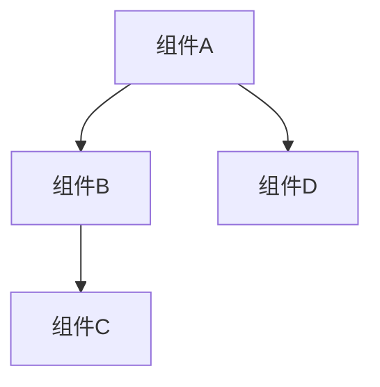
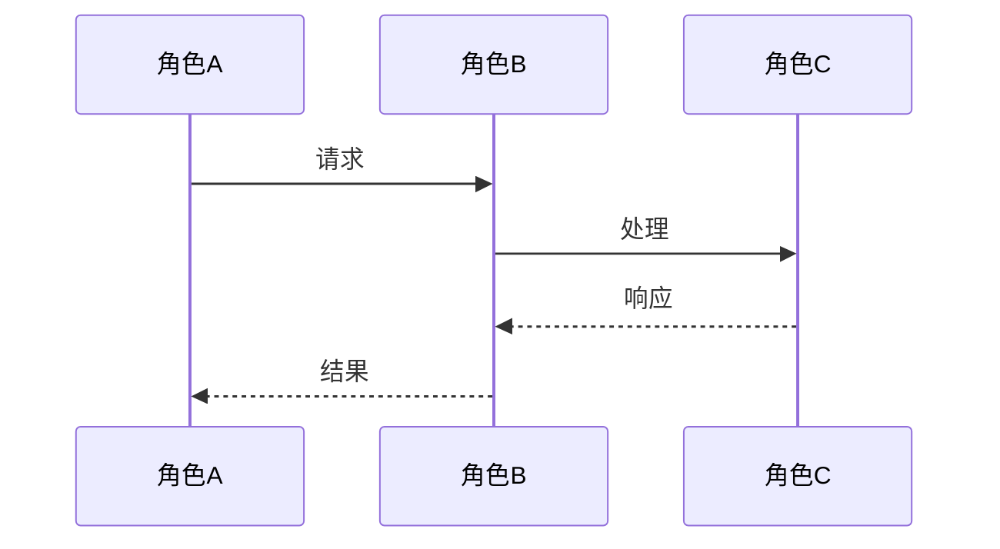
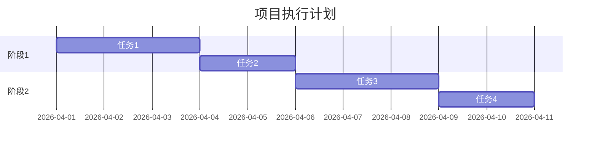

# {任务名}方案

## 元信息
- **文档类型**: 方案设计
- **版本**: V1.0
- **创建日期**: YYYY-MM-DD
- **更新日期**: YYYY-MM-DD
- **状态**: 草稿 / 评审中 / 已批准
- **作者**: AI Assistant

---

## 一、背景与目标

### 1.1 项目背景

[描述项目的背景，为什么要做这件事]

### 1.2 现状分析

[描述当前的现状，存在的问题]

### 1.3 项目目标

#### 主要目标
- [目标1]
- [目标2]
- [目标3]

#### 成功标准
| 标准 | 衡量指标 | 目标值 |
|:---|:---|:---:|
| [标准1] | [指标1] | [值] |
| [标准2] | [指标2] | [值] |

---

## 二、范围与边界

### 2.1 包含范围

- [范围1]
- [范围2]
- [范围3]

### 2.2 排除范围

- [排除范围1]
- [排除范围2]

### 2.3 约束条件

- **时间约束**: [时间限制]
- **资源约束**: [资源限制]
- **技术约束**: [技术限制]

---

## 三、总体设计

### 3.1 设计原则

1. [原则1]
2. [原则2]
3. [原则3]

### 3.2 架构设计



### 3.3 流程设计



---

## 四、详细设计

### 4.1 模块划分

| 模块 | 职责 | 输入 | 输出 |
|:---|:---|:---|:---|
| [模块1] | [职责] | [输入] | [输出] |
| [模块2] | [职责] | [输入] | [输出] |

### 4.2 接口设计

#### 接口1: [接口名称]

- **接口路径**: `[路径]`
- **请求方法**: `GET/POST/PUT/DELETE`
- **请求参数**:

| 参数名 | 类型 | 必填 | 说明 |
|:---|:---|:---:|:---|
| [参数1] | [类型] | 是 | [说明] |
| [参数2] | [类型] | 否 | [说明] |

- **响应格式**:

```json
{
  "code": 0,
  "message": "success",
  "data": {}
}
```

### 4.3 数据模型

[如有数据变更，描述数据模型]

---

## 五、执行计划

### 5.1 任务分解

| 路径 | 任务名称 | 优先级 | 预计工时 | 依赖 |
|:---|:---|:---:|:---:|:---|
| 路径1 | [任务1] | P1 | Xh | 无 |
| 路径2 | [任务2] | P2 | Xh | 路径1 |
| 路径3 | [任务3] | P3 | Xh | 路径2 |

### 5.2 里程碑

| 里程碑 | 日期 | 交付物 | 验收标准 |
|:---|:---|:---|:---|
| M1 | YYYY-MM-DD | [交付物] | [标准] |
| M2 | YYYY-MM-DD | [交付物] | [标准] |

### 5.3 甘特图



---

## 六、风险评估

### 6.1 风险识别

| 风险 | 概率 | 影响 | 风险等级 | 应对措施 |
|:---|:---:|:---:|:---:|:---|
| [风险1] | 高/中/低 | 高/中/低 | 🔴/🟠/🟡 | [措施] |
| [风险2] | 高/中/低 | 高/中/低 | 🔴/🟠/🟡 | [措施] |

### 6.2 应急预案

[描述遇到重大风险时的应急预案]

---

## 七、资源需求

### 7.1 人力资源

| 角色 | 人数 | 职责 |
|:---|:---:|:---|
| [角色1] | X | [职责] |
| [角色2] | X | [职责] |

### 7.2 技术资源

- [资源1]
- [资源2]

### 7.3 工具需求

- [工具1]
- [工具2]

---

## 八、验收标准

### 8.1 功能验收

- [ ] [验收项1]
- [ ] [验收项2]
- [ ] [验收项3]

### 8.2 性能验收

- [ ] [性能指标1] 达到 [目标值]
- [ ] [性能指标2] 达到 [目标值]

### 8.3 质量验收

- [ ] 代码审查通过
- [ ] 测试覆盖率 >= [X]%
- [ ] 文档完整

---

## 九、参考文档

- [参考文档1]
- [参考文档2]

---

## 十、变更记录

| 版本 | 日期 | 变更内容 | 作者 |
|:---:|:---|:---|:---|
| V1.0 | YYYY-MM-DD | 初始创建 | AI Assistant |

---

**文档状态**: [状态]  
**下次评审日期**: YYYY-MM-DD
