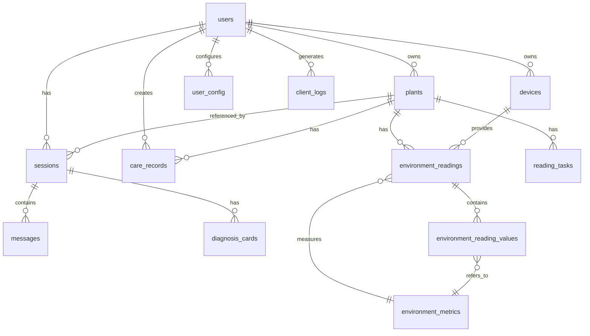

# 项目数据库设计概览

> ⚠️ **重要提示**：本文档为**索引文档**，详细的数据库设计（完整 DDL、ER 图、字段定义、索引设计）请参阅：
> 
> 📄 **[数据库设计完整文档](../../../02-architecture/数据库设计.md)**

## 摘要

智能园艺助手项目使用 MySQL 8.0 数据库，通过 Sequelize ORM 进行管理。共包含 **14 张核心数据表**，支持用户管理、植物档案、会话消息、设备管理、环境数据监测、养护记录和系统日志等核心功能。

## 技术栈

- **数据库**: MySQL 8.0
- **ORM**: Sequelize v6
- **命名规范**: 数据库使用 snake_case，API 使用 camelCase（通过 namingConverter 自动转换）
- **字符集**: utf8mb4_unicode_ci

## 数据库表清单（14张）

| 序号 | 表名 | 中文名 | 说明 | 数据量预估 | 核心字段 |
|:---:|:---|:---|:---|:---:|:---|
| 1 | `users` | 用户表 | 微信授权登录 | 1万+ | `user_id`, `wx_openid`, `role` |
| 2 | `plants` | 植物档案表 | 核心实体 | 5万+ | `plant_id`, `user_id`, `plant_category` |
| 3 | `sessions` | 会话表 | 咨询/植物会话 | 10万+ | `session_id`, `type`, `plant_id` |
| 4 | `messages` | 消息表 | 完整对话存储 | 100万+ | `message_id`, `session_id`, `role` |
| 5 | `diagnosis_cards` | 诊断卡表 | 诊断结果结构化 | 20万+ | `card_id`, `session_id`, `diagnosis_type` |
| 6 | `devices` | 设备表 | 硬件设备管理 | 2万+ | `device_id`, `user_id`, `device_type` |
| 7 | `environment_readings` | 环境读数主表 | 统一存储设备+天气数据 | 1000万+ | `reading_id`, `plant_id`, `data_source` |
| 8 | `environment_reading_values` | 环境数值表 | 存储各指标具体数值 | 5000万+ | `value_id`, `reading_id`, `metric_code` |
| 9 | `environment_metrics` | 环境指标定义表 | 支持多来源动态指标配置 | 50条以内 | `metric_code`, `category`, `unit` |
| 10 | `reading_tasks` | 读数任务表 | 追踪数据采集状态 | 500万+ | `task_id`, `plant_id`, `status` |
| 11 | `care_records` | 养护记录表 | 用户手动记录 | 10万+ | `record_id`, `plant_id`, `care_type` |
| 12 | `user_config` | 用户配置表 | 用户偏好、设置、置顶等 | 10万+ | `config_id`, `user_id`, `config_key` |
| 13 | `system_logs` | 系统日志表 | 后端日志存储 | 1000万+ | `id`, `level`, `message`, `source` |
| 14 | `client_logs` | 客户端日志表 | 前端日志存储 | 500万+ | `id`, `user_id`, `level`, `page_path` |

## 核心 E-R 关系



## 表分类

### 核心实体表（4张）
- `users` - 用户主体
- `plants` - 植物档案（项目核心实体）
- `sessions` - 会话（咨询/植物对话）
- `messages` - 消息（对话内容）

### 业务功能表（4张）
- `diagnosis_cards` - AI 诊断结果
- `devices` - 物联网设备
- `care_records` - 养护记录
- `user_config` - 用户配置

### 环境数据表（4张）
- `environment_readings` - 环境读数主表（sensor/weather_api）
- `environment_reading_values` - 具体数值
- `environment_metrics` - 指标定义
- `reading_tasks` - 采集任务

### 系统日志表（2张）⭐ **新增**
- `system_logs` - 后端系统日志
- `client_logs` - 前端客户端日志

## 关键技术点

1. **命名转换**: 数据库字段使用 snake_case，API 响应使用 camelCase，通过 `namingConverter.js` 自动转换

2. **关联查询**: 使用 Sequelize `include` 进行关联查询，关联定义在 `models/associations.config.js`

3. **环境数据双源**: 支持传感器（sensor）和天气 API（weather_api）两种数据来源，通过 `data_source` 字段区分

4. **补偿机制**: 环境数据支持补偿机制，通过 `is_stale` 字段标记补偿数据

5. **软删除**: 部分表支持 `deleted_at` 字段实现软删除

6. **JSON 字段**: 多处使用 JSON 类型存储灵活数据（如 `context_config`, `image_urls`）

## 快速参考

### 常用枚举值

```javascript
// 植物分类
plant_category: ['succulent', 'flower', 'foliage', 'vegetable', 'other']

// 会话类型
session_type: ['consult', 'plant']

// 环境数据来源
data_source: ['sensor', 'weather_api', 'compensation']

// 环境指标分类
metric_category: ['soil', 'air', 'light', 'water']

// 日志级别
log_level: ['debug', 'info', 'warn', 'error', 'fatal']
```

### 关键外键关系

| 子表 | 外键字段 | 父表 | 级联规则 |
|:---|:---|:---|:---|
| plants | user_id | users | CASCADE |
| sessions | user_id | users | CASCADE |
| sessions | plant_id | plants | SET NULL |
| messages | session_id | sessions | CASCADE |
| diagnosis_cards | session_id | sessions | CASCADE |
| devices | user_id | users | SET NULL |
| environment_readings | plant_id | plants | CASCADE |
| care_records | plant_id | plants | CASCADE |
| care_records | user_id | users | CASCADE |

## 相关文档

| 文档 | 路径 | 说明 |
|:---|:---|:---|
| **数据库设计完整文档** | [`../../../02-architecture/数据库设计.md`](../../../02-architecture/数据库设计.md) | ⭐ **DDL、ER图、完整字段定义** |
| API接口设计 | [`../../../02-architecture/API接口设计.md`](../../../02-architecture/API接口设计.md) | 数据库操作接口规范 |
| 命名规范迁移指南 | [`../../../03-frontend/guides/命名规范迁移指南.md`](../../../03-frontend/guides/命名规范迁移指南.md) | 前后端命名转换规范 |
| 数据库维护状态 | [`../../project-insights/solutions/database-design-maintenance-status.md`](../../project-insights/solutions/database-design-maintenance-status.md) | 文档维护记录 |

## 相关代码

| 路径 | 说明 |
|:---|:---|
| [`backend/server/src/models/`](../../../../../../backend/server/src/models/) | Sequelize 模型定义 |
| [`backend/server/src/models/associations.config.js`](../../../../../../backend/server/src/models/associations.config.js) | 模型关联配置 |
| [`backend/server/src/utils/namingConverter.js`](../../../../../../backend/server/src/utils/namingConverter.js) | 命名转换工具 |
| [`_dev/DataBase/`](../../../../../../_dev/DataBase/) | SQL 脚本和工具 |

## 变更记录

| 日期 | 变更内容 |
|:---|:---|
| 2026-04-09 | 初始创建 - 整理项目数据库设计概览（12张表） |
| 2026-04-18 | 重要更新 - 补充 `system_logs` 和 `client_logs` 两张表，更新为14张表；添加指向完整设计文档的明确链接 |
