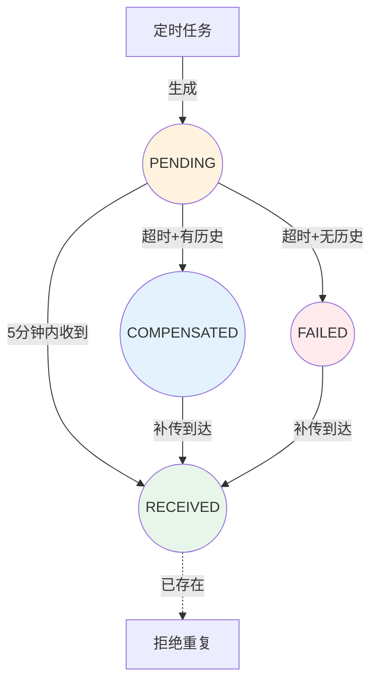

# 传感器数据流设计方案

## 摘要

本文档记录了 PlantGPT 项目中传感器数据流的设计思考过程，包括数据补偿机制、状态流转、以及传感器与后端的交互模式。

## 背景

在 IoT 植物监测系统中，传感器数据可能因网络问题、设备离线等原因无法及时上报。为了保证数据的连续性和完整性，需要设计一套数据补偿机制。

## 核心概念

### 1. 传感器工作模式

传感器采用**单工通信**模式：
- 传感器 → 后端：主动上报数据
- 后端 → 传感器：无法主动推送

**比喻**：传感器像勤奋的快递员，只管把包裹（数据）送到快递站（后端），不问快递站是否需要。

### 2. 数据状态流转



### 3. 四种状态详解

| 状态 | 产生条件 | 数据来源 | 是否终态 |
|------|----------|----------|----------|
| **PENDING** | 定时任务生成 | 无 | ❌ 否 |
| **RECEIVED** | 5分钟内收到真实数据 | 传感器真实采集 | ✅ 是 |
| **COMPENSATED** | 超时+有历史数据 | 服务器复制历史数据 | ❌ 否 |
| **FAILED** | 超时+无历史数据 | 无 | ❌ 否 |

**关键理解**：
- **RECEIVED** 是唯一的终态
- **COMPENSATED** 是服务器"等不及了"自己造的假数据
- **FAILED** 是服务器"造都造不出来"（无历史数据）
- 真数据（RECEIVED）到了，假数据（COMPENSATED）就被扔掉

### 4. 补偿机制

**触发条件**：
1. 任务状态为 PENDING
2. 超过容忍期（5分钟）
3. 查询历史传感器数据

**两种结果**：
- 有历史数据 → 创建补偿数据（COMPENSATED）
- 无历史数据 → 标记失败（FAILED）

### 5. 传感器批量上报

传感器内部维护一个**发送队列**：
- 每次上报包含：当前数据 + 未确认的历史数据
- 服务器根据 `recorded_at` 判断是正常数据还是补传
- 单接口处理所有情况，无需显式的"补传指令"

**工作流程**：
```
传感器采集数据 → 放入本地队列 → 定时上报
                    ↓
              上报失败 → 保留在队列 → 下次重试
                    ↓
              上报成功 → 从队列移除
```

## 设计决策

### 为什么采用单工模式？

1. **简单可靠**：HTTP 请求-响应模式易于实现
2. **省电**：传感器无需维持长连接
3. **兼容性好**：支持各种网络环境

### 为什么服务器不主动请求补传？

1. **传感器是单工的**：服务器无法主动连接传感器
2. **传感器自治**：自己管理重传，不依赖服务器指令
3. **简化架构**：一个接口处理所有情况

### 补偿数据的意义

1. **数据连续性**：前端图表不会出现断点
2. **用户体验**：用户能看到"补偿"标记，知道数据是估算的
3. **后续覆盖**：真数据到了会自动覆盖假数据

## 实现要点

### 后端

1. **定时任务**：每2小时生成 ReadingTask
2. **补偿检查**：每10分钟检查超时的 PENDING 任务
3. **状态机**：正确处理四种状态的流转
4. **数据对齐**：按2小时间隔对齐数据点

### 传感器（虚拟设备）

1. **本地队列**：维护待发送数据队列
2. **批量上报**：一次上报多个时间点的数据
3. **失败重试**：失败的数据保留在队列中
4. **时间对齐**：自动对齐到2小时间隔

## 相关代码

- 后端补偿服务：`backend/server/src/services/compensationService.js`
- 环境数据服务：`backend/server/src/services/EnvironmentService.js`
- 定时同步任务：`backend/server/src/jobs/environmentSyncJob.js`
- 虚拟设备模拟器：`backend/server/src/services/DeviceService.js`

## 变更记录

| 日期 | 变更内容 |
|:---|:---|
| 2026-04-12 | 初始版本，记录传感器数据流设计思考 |
