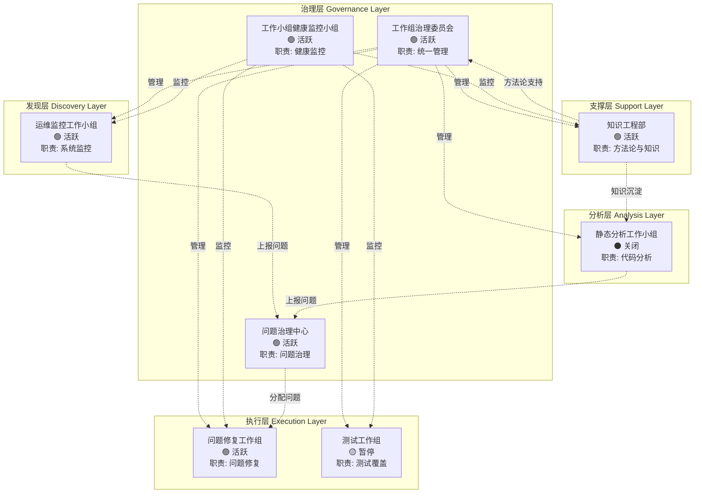

# 工作组架构体系

**版本**: V1.0  
**创建日期**: 2026-04-11  
**状态**: ✅ 已建立  
**维护人**: 工作组治理委员会

---

## 一、架构总览



---

## 二、工作组清单（8个）

### 2.1 治理层（3个）

| 工作组 | 类型 | 活动状态 | 健康度 | 职责 | 创建日期 |
|:---|:---:|:---:|:---:|:---|:---:|
| **工作组治理委员会** | 支撑型 | 🟢 活跃 | ✅ 健康 | 统一管理所有工作组 | 2026-04-11 |
| **工作小组健康监控小组** | 运维型 | 🟢 活跃 | ✅ 健康 | 监控工作组健康度 | 2026-04-11 |
| **问题治理中心** | 支撑型 | 🟢 活跃 | ✅ 健康 | 问题接收、分配、跟踪 | 2026-04-11 |

### 2.2 支撑层（1个）

| 工作组 | 类型 | 活动状态 | 健康度 | 职责 | 创建日期 |
|:---|:---:|:---:|:---:|:---|:---:|
| **知识工程部** | 支撑型 | 🟢 活跃 | ✅ 健康 | 方法论与知识管理 | 2026-04-07 |

### 2.3 发现层（1个）

| 工作组 | 类型 | 活动状态 | 健康度 | 职责 | 创建日期 |
|:---|:---:|:---:|:---:|:---|:---:|
| **运维监控工作小组** | 运维型 | 🟢 活跃 | ✅ 健康 | 系统监控与问题发现 | 2026-04-11 |

### 2.4 分析层（1个）

| 工作组 | 类型 | 活动状态 | 健康度 | 职责 | 创建日期 |
|:---|:---:|:---:|:---:|:---|:---:|
| **静态分析工作小组** | 分析型 | ⚫ 关闭 | ⚠️ 待归档 | 代码静态分析 | 2026-04-08 |

### 2.5 执行层（2个）

| 工作组 | 类型 | 活动状态 | 健康度 | 职责 | 创建日期 |
|:---|:---:|:---:|:---:|:---|:---:|
| **问题修复工作组** | 项目型 | 🟢 活跃 | ✅ 健康 | 问题修复与验证 | 2026-04-11 |
| **测试工作组** | 项目型 | 🟡 暂停 | 🔴 异常 | 测试覆盖与质量保障 | 2026-04-08 |

---

## 三、架构设计原则

### 3.1 分层原则

| 层级 | 职责 | 特点 |
|:---|:---|:---|
| **治理层** | 管理、监控、协调 | 持续性、全局视角 |
| **支撑层** | 方法论、知识、工具 | 持续性、服务导向 |
| **发现层** | 监控、发现、预警 | 持续性、主动发现 |
| **分析层** | 分析、评估、报告 | 阶段性、深度分析 |
| **执行层** | 修复、实施、验证 | 响应式、结果导向 |

### 3.2 协作原则

1. **上报原则**: 发现层/分析层 → 问题治理中心
2. **分配原则**: 问题治理中心 → 执行层
3. **管理原则**: 治理层 → 所有工作组
4. **监控原则**: 健康监控 → 所有工作组
5. **支撑原则**: 知识工程部 → 所有工作组

---

## 四、数据流

### 4.1 问题流转

```
┌─────────────────┐     ┌─────────────────┐     ┌─────────────────┐
│   运维监控      │     │                 │     │                 │
│   工作小组      │────►│   问题治理中心  │────►│  问题修复工作组 │
│  （发现问题）   │     │ （接收&分配）   │     │  （修复问题）   │
└─────────────────┘     └─────────────────┘     └─────────────────┘
        ▲                                               │
        │                                               │
        │     ┌─────────────────┐                      │
        │     │  静态分析       │                      │
        └─────┤  工作小组       │◄─────────────────────┘
              │ （验证修复）    │    （上报修复结果）
              └─────────────────┘
```

### 4.2 管理流

```
┌─────────────────────────────────────────┐
│         工作组治理委员会                │
│         （统一管理）                    │
└─────────────┬───────────────────────────┘
              │
    ┌─────────┼─────────┐
    ▼         ▼         ▼
┌───────┐ ┌───────┐ ┌───────┐
│运维监控│ │问题修复│ │ 测试  │
│工作小组│ │工作组  │ │工作组 │
└───────┘ └───────┘ └───────┘
```

### 4.3 监控流

```
┌─────────────────────────────────────────┐
│      工作小组健康监控小组               │
│      （健康监控）                       │
└─────────────┬───────────────────────────┘
              │
    ┌─────────┼─────────┬─────────┐
    ▼         ▼         ▼         ▼
┌───────┐ ┌───────┐ ┌───────┐ ┌───────┐
│运维监控│ │问题修复│ │ 测试  │ │知识工程│
│工作小组│ │工作组  │ │工作组 │ │  部   │
└───────┘ └───────┘ └───────┘ └───────┘
```

---

## 五、关键指标

### 5.1 工作组健康度

| 健康度 | 数量 | 占比 | 工作组 |
|:---|:---:|:---:|:---|
| ✅ 健康 | 6 | 75% | 治理委员会、健康监控、问题治理、知识工程、运维监控、问题修复 |
| ⚠️ 关注 | 1 | 12.5% | 静态分析工作小组 |
| 🔴 异常 | 1 | 12.5% | 测试工作组 |

### 5.2 问题统计

| 严重程度 | 数量 | 占比 | 状态 |
|:---|:---:|:---:|:---|
| 🔴 P0 - 紧急 | 2 | 11% | 待处理 |
| 🟠 P1 - 高 | 6 | 33% | 待处理 |
| 🟡 P2 - 中 | 3 | 17% | 待处理 |
| 🟢 P3 - 低 | 7 | 39% | 待处理 |
| **合计** | **18** | **100%** | |

### 5.3 活动状态分布

| 状态 | 数量 | 占比 |
|:---|:---:|:---:|
| 🟢 活跃 | 6 | 75% |
| 🟡 暂停 | 1 | 12.5% |
| ⚫ 关闭 | 1 | 12.5% |

---

## 六、异常处理

### 6.1 当前异常

| 工作组 | 异常类型 | 严重程度 | 建议动作 |
|:---|:---|:---:|:---|
| 测试工作组 | 暂停3天 | 🟠 | 评估重启或关闭 |
| 静态分析工作小组 | 未归档 | 🟡 | 执行归档流程 |

### 6.2 异常升级路径

```
异常发现
    ↓
工作小组健康监控小组识别
    ↓
通知工作组治理委员会
    ↓
治理委员会评估并决策
    ↓
执行决策（重启/关闭/归档）
```

---

## 七、治理规范

### 7.1 工作组生命周期

```
创建 → 规划 → 执行 → 验证 → 合并/关闭 → 归档
```

### 7.2 状态流转

| 当前状态 | 可流转到 | 条件 |
|:---|:---|:---|
| ⏳ 待启动 | 🟢 活跃 | 完成规划 |
| 🟢 活跃 | 🟡 暂停 | 临时暂停 |
| 🟢 活跃 | 🔴 阻塞 | 遇到阻塞 |
| 🟢 活跃 | ⚫ 关闭 | 工作完成 |
| 🟡 暂停 | 🟢 活跃 | 条件满足 |
| 🟡 暂停 | ⚫ 关闭 | 决定终止 |
| 🔴 阻塞 | 🟢 活跃 | 阻塞解决 |
| ⚫ 关闭 | 📦 已归档 | 完成归档 |

### 7.3 健康度评估

| 指标 | 正常 | 预警 | 危险 |
|:---|:---:|:---:|:---:|
| 无更新天数 | ≤1 | 3 | 7 |
| 问题积压数 | ≤5 | 10 | 20 |
| 阻塞问题数 | 0 | 1 | ≥2 |

---

## 八、快速链接

### 治理层

- [工作组治理委员会](./工作组治理委员会/README.md)
- [工作小组健康监控小组](./工作小组健康监控小组/README.md)
- [问题治理中心](./问题治理中心/README.md)

### 其他层

- [知识工程部](./知识工程部/README.md)
- [运维监控工作小组](./运维监控工作小组/README.md)
- [静态分析工作小组](./静态分析工作小组/README.md)
- [问题修复工作组](./问题修复工作组/README.md)
- [测试工作组](./测试工作组/README.md)

### 治理文档

- [工作组状态看板](./工作组治理委员会/03-跟踪与报告/工作组状态看板.md)

---

## 九、变更记录

| 版本 | 日期 | 变更内容 | 变更人 |
|:---:|:---|:---|:---|
| V1.0 | 2026-04-11 | 初始创建，建立完整工作组架构体系 | AI Assistant |

---

**架构状态**: ✅ 已建立  
**下次评审**: 2026-04-18
