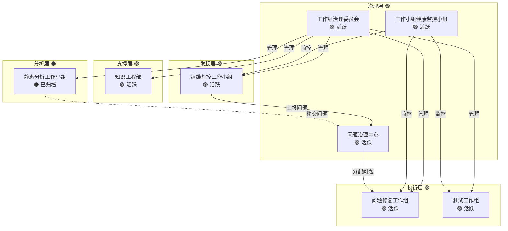

# 工作组状态看板

**更新日期**: 2026-04-11  
**更新人**: 工作组治理委员会  
**看板状态**: 🟢 实时更新

---

## 一、工作组总览

---

## 二、工作组状态矩阵

### 2.1 治理层（3个）🟢

| 工作组 | 类型 | 活动状态 | 最后更新 | 健康度 | 问题数 | 负责人 |
|:---|:---:|:---:|:---:|:---:|:---:|:---:|
| **工作组治理委员会** | 支撑型 | 🟢 活跃 | 2026-04-11 | ✅ 健康 | 0 | AI Assistant |
| **工作小组健康监控小组** | 运维型 | 🟢 活跃 | 2026-04-11 | ✅ 健康 | 0 | AI Assistant |
| **问题治理中心** | 支撑型 | 🟢 活跃 | 2026-04-11 | ✅ 健康 | 22 | AI Assistant |

### 2.2 支撑层（1个）🟢

| 工作组 | 类型 | 活动状态 | 最后更新 | 健康度 | 问题数 | 负责人 |
|:---|:---:|:---:|:---:|:---:|:---:|:---:|
| **知识工程部** | 支撑型 | 🟢 活跃 | 2026-04-11 | ✅ 健康 | 0 | AI Assistant |

### 2.3 发现层（1个）🟢

| 工作组 | 类型 | 活动状态 | 最后更新 | 健康度 | 问题数 | 负责人 |
|:---|:---:|:---:|:---:|:---:|:---:|:---:|
| **运维监控工作小组** | 运维型 | 🟢 活跃 | 2026-04-11 | ✅ 健康 | 0 | AI Assistant |

### 2.4 分析层（1个）⚫

| 工作组 | 类型 | 活动状态 | 最后更新 | 健康度 | 问题数 | 负责人 |
|:---|:---:|:---:|:---:|:---:|:---:|:---:|
| **静态分析工作小组** | 分析型 | ⚫ 已归档 | 2026-04-10 | ✅ 已归档 | 16 | AI Assistant |

### 2.5 执行层（2个）🟢

| 工作组 | 类型 | 活动状态 | 最后更新 | 健康度 | 问题数 | 负责人 |
|:---|:---:|:---:|:---:|:---:|:---:|:---:|
| **问题修复工作组** | 项目型 | 🟢 活跃 | 2026-04-11 | ✅ 健康 | 12 | AI Assistant |
| **测试工作组** | 项目型 | 🟢 活跃 | 2026-04-11 | ✅ 健康 | 0 | AI Assistant |

---

## 三、关键指标

### 3.1 工作组健康度分布

| 健康度 | 数量 | 工作组 |
|:---|:---:|:---|
| ✅ 健康 | 7 | 治理委员会、健康监控、问题治理、知识工程、运维监控、问题修复、测试工作组 |
| ⚠️ 关注 | 0 | - |
| 🔴 异常 | 0 | - |
| ✅ 已归档 | 1 | 静态分析工作小组 |
| **合计** | **8** | |

### 3.2 问题统计（问题治理中心）

| 严重程度 | 数量 | 分布 | 状态 |
|:---|:---:|:---|:---|
| 🔴 P0 - 紧急 | 4 | 静态分析3、运维监控1 | 待处理: 3 / 已解决: 1 |
| 🟠 P1 - 高 | 8 | 静态分析6、运维监控2 | 待处理: 3 / 已解决: 5 |
| 🟡 P2 - 中 | 8 | 静态分析6、运维监控2 | 待处理: 4 / 已解决: 4 |
| 🟢 P3 - 低 | 1 | 静态分析0、运维监控1 | 待处理: 1 / 已解决: 0 |
| **合计** | **22** | | 待处理: 11 / 已解决: 11 |

### 3.3 活动状态分布

| 状态 | 数量 | 工作组 |
|:---|:---:|:---|
| 🟢 活跃 | 7 | 治理委员会、健康监控、问题治理、知识工程、运维监控、问题修复、测试工作组 |
| 🟡 暂停 | 0 | - |
| ⚫ 关闭/归档 | 1 | 静态分析工作小组 |
| **合计** | **8** | |

---

## 四、异常工作组

### 4.1 🔴 需要立即处理

无

### 4.2 ⚠️ 需要关注

无

---

## 五、工作组依赖关系

### 5.1 依赖矩阵

| 工作组 | 依赖谁 | 被谁依赖 | 协作关系 |
|:---|:---|:---|:---|
| 工作组治理委员会 | 知识工程部 | 所有工作组 | 管理所有工作组 |
| 工作小组健康监控小组 | 工作组治理委员会 | - | 监控所有工作组 |
| 问题治理中心 | 工作组治理委员会 | - | 协调问题流转 |
| 知识工程部 | - | 所有工作组 | 提供方法论支持 |
| 运维监控工作小组 | - | 问题治理中心 | 上报系统问题 |
| 静态分析工作小组 | - | - | 已归档，问题已移交 |
| 问题修复工作组 | 问题治理中心 | - | 接收分配的问题 |
| 测试工作组 | - | - | 独立运行 |

---

## 六、本周重点工作

### 6.1 治理层

- [x] 完成工作组治理委员会工作交接
- [x] 归档静态分析工作小组
- [x] 同步更新问题治理中心问题状态
- [ ] 建立工作组生命周期管理流程

### 6.2 发现层

- [x] 运维监控发现并修复 6 个问题
- [ ] 继续系统监控
- [ ] 及时上报新发现问题

### 6.3 执行层

- [x] 修复 11 个问题（6个运维监控 + 5个静态分析）
- [ ] 处理 3 个 P0 级问题（SA-7-001, SA-9-001, SA-10-001）
- [ ] 处理 3 个 P1 级问题
- [x] 更新修复进度

---

## 七、风险预警

| 风险 | 等级 | 影响 | 应对措施 |
|:---|:---:|:---|:---|
| 问题积压 11 个待处理 | 🟠 | 修复压力大 | 优先处理P0/P1问题，本周目标解决3个P0 |
| 会话性能问题（SA-7-001） | 🔴 | 用户体验差 | 本周重点解决，改为异步队列模式 |
| 缺少 .env.example（SA-9-001） | 🔴 | 新成员上手困难 | 已创建 .env.example 文件，待验证 |

---

## 八、历史趋势

### 8.1 工作组数量趋势

| 日期 | 总数 | 活跃 | 暂停 | 关闭/归档 |
|:---|:---:|:---:|:---:|:---:|
| 2026-04-11 | 8 | 7 | 0 | 1 |

### 8.2 问题数量趋势

| 日期 | 总数 | P0 | P1 | P2 | P3 | 已解决 |
|:---|:---:|:---:|:---:|:---:|:---:|:---:|
| 2026-04-11 | 22 | 4 | 8 | 8 | 1 | 11 |

---

## 九、快速链接

### 工作组入口

- [工作组治理委员会](../工作组治理委员会/README.md)
- [工作小组健康监控小组](../工作小组健康监控小组/README.md)
- [问题治理中心](../问题治理中心/README.md)
- [知识工程部](../知识工程部/README.md)
- [运维监控工作小组](../运维监控工作小组/README.md)
- [静态分析工作小组](../静态分析工作小组/README.md)（已归档）
- [问题修复工作组](../问题修复工作组/README.md)
- [测试工作组](../测试工作组/README.md)

### 治理文档

- [工作组架构体系](../工作组架构体系.md)
- [工作组治理委员会需求提案](../工作组治理委员会需求提案.md)

---

**看板维护**: 工作组治理委员会  
**更新频率**: 每日  
**下次更新**: 2026-04-12
