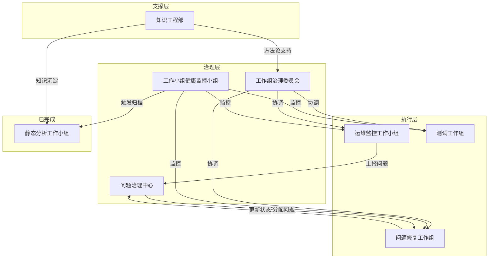

# 工作组治理委员会需求提案

## 提案背景

当前项目已运行多个工作小组，但缺乏统一的管理和协调机制。为确保工作小组高效协作、避免资源冲突、及时识别风险，建议成立**工作组治理委员会**。

---

## 当前工作小组状态总览

| 工作小组 | 类型 | 活动状态 | 最后更新 | 问题 |
|:---|:---|:---:|:---:|:---|
| 知识工程部 | 支撑型 | 🟢 活跃 | 2026-04-11 | 无 |
| 运维监控工作小组 | 运维型 | 🟢 活跃 | 2026-04-11 | 无 |
| 静态分析工作小组 | 分析型 | ⚫ 关闭 | 2026-04-10 | 已完成，待归档 |
| 问题修复工作组 | 项目型 | 🟢 活跃 | 2026-04-11 | 无 |
| 测试工作组 | 项目型 | 🟡 暂停 | 2026-04-08 | 长期无更新 |

---

## 缺失职能分析

### 1. **工作组协调员**（缺失）

**现状问题**：
- 多个工作小组并行，缺乏统一协调
- 工作小组间依赖关系不明确
- 资源冲突（如同时修改同一文件）风险

**所需职能**：
- 监控所有工作小组状态
- 协调工作小组间依赖
- 解决资源冲突
- 定期输出工作组健康报告

**建议创建**：**工作组治理委员会**

---

### 2. **工作小组健康度监控**（缺失）

**现状问题**：
- 测试工作组已暂停3天，无人关注
- 静态分析工作小组已完成但未归档
- 缺乏定期检查机制

**所需职能**：
- 每日检查工作小组活动状态
- 识别长期无更新的工作小组
- 触发归档或关闭流程

**建议创建**：**工作小组健康监控小组**

---

### 3. **知识沉淀与转移**（部分缺失）

**现状问题**：
- 静态分析工作小组已完成，但知识沉淀不完整
- 问题修复工作组产生的修复经验未系统化
- 缺乏知识从工作小组到知识库的自动流转

**所需职能**：
- 工作小组关闭时强制知识沉淀
- 提取可复用的工具、脚本、模板
- 更新知识库索引

**建议**：由**知识工程部**扩展此职能

---

### 4. **跨工作小组问题升级**（缺失）

**现状问题**：
- 问题修复工作组遇到阻塞时，无升级路径
- 运维监控发现的问题需人工分配给修复组
- 缺乏问题跟踪的闭环

**所需职能**：
- 建立问题升级通道
- 跟踪问题从发现到修复的完整链路
- 统计各工作小组处理效率

**建议创建**：**问题治理中心**

---

## 建议创建的新工作组

### 工作组1：工作组治理委员会

**职能定位**：
- 所有工作小组的"管理面"
- 负责协调、监控、治理

**核心职责**：
1. 维护工作小组状态看板
2. 协调工作小组间依赖
3. 定期输出工作组健康报告
4. 制定和优化工作组管理规范

**目录结构**：
```
工作组治理委员会/
├── README.md
├── 01-治理规范/
│   ├── 工作小组管理规范.md
│   └── 工作小组生命周期管理.md
├── 02-状态看板/
│   ├── 工作小组状态总览.md
│   └── 工作小组健康报告/
├── 03-协调记录/
│   ├── 依赖协调记录.md
│   └── 冲突解决记录.md
└── 04-治理工具/
    └── 健康检查脚本.ps1
```

**启动条件**：立即启动（已有5个工作小组需要治理）

---

### 工作组2：工作小组健康监控小组

**职能定位**：
- 自动化监控所有工作小组健康度
- 及时发现并报告异常

**核心职责**：
1. 每日自动检查工作小组更新状态
2. 识别长期无活动的工作小组
3. 触发归档或关闭提醒
4. 生成健康度报告

**监控指标**：
| 指标 | 阈值 | 动作 |
|:---|:---|:---|
| 无更新天数 | >3天 | 🟡 提醒 |
| 无更新天数 | >7天 | 🔴 警告 |
| 问题积压 | >10个 | 🟡 提醒 |
| 阻塞问题 | >0个 | 🔴 立即处理 |

**启动条件**：可由工作组治理委员会兼任，或独立成立

---

### 工作组3：问题治理中心

**职能定位**：
- 跨工作小组的问题跟踪与治理
- 建立问题从发现到解决的闭环

**核心职责**：
1. 统一接收各工作小组发现的问题
2. 分配问题到对应修复工作组
3. 跟踪问题解决进度
4. 统计问题处理效率
5. 定期输出问题治理报告

**工作流程**：
```
问题发现（运维/分析小组）
    ↓
问题登记（问题治理中心）
    ↓
问题分配（问题修复工作组）
    ↓
问题修复（问题修复工作组）
    ↓
问题验证（原发现小组）
    ↓
问题关闭（问题治理中心）
```

**启动条件**：建议立即启动，当前有11个问题待跟踪

---

## 工作组间关系图



---

## 执行建议

### 第一阶段（本周）：建立治理委员会

1. 创建**工作组治理委员会**
2. 建立工作小组状态看板
3. 制定工作小组管理规范

### 第二阶段（下周）：完善治理体系

1. 建立健康监控机制
2. 完善问题治理流程
3. 静态分析工作小组归档

### 第三阶段（本月）：自动化治理

1. 开发健康检查脚本
2. 自动化状态更新
3. 定期治理报告

---

## 立即行动项

- [ ] 创建工作组治理委员会
- [ ] 更新工作区模式说明文档，添加治理章节
- [ ] 归档静态分析工作小组
- [ ] 评估测试工作组是否需要重启或关闭

---

**提案人**: AI Assistant  
**提案日期**: 2026-04-11  
**优先级**: 🔴 高
