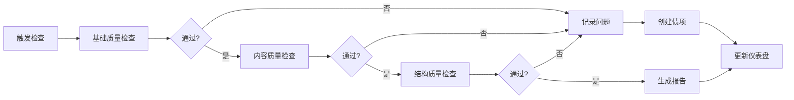

# 文档健康度检查机制

## 元信息
- **文档类型**: 技术规范
- **版本**: V1.0
- **创建日期**: 2026-04-12
- **最后更新**: 2026-04-12
- **状态**: 已发布
- **适用范围**: 文档治理委员会

---

## 一、检查目标

建立系统化的文档健康度检查机制，确保：
1. 文档质量可量化
2. 问题可及时发现
3. 改进可跟踪验证

---

## 二、检查维度

### 2.1 五维健康度模型

```
                    准确性
                      ▲
                     /|\
                    / | \
                   /  |  \
      完整性 ◄────┼───┼──┼────► 时效性
                   \  |  /
                    \ | /
                     \|/
                      ▼
                   可发现性
                      |
                   一致性
```

| 维度 | 权重 | 检查内容 |
|:---|:---:|:---|
| 准确性 | 30% | 内容正确，无错误信息 |
| 完整性 | 25% | 覆盖全面，无遗漏 |
| 时效性 | 20% | 及时更新，无过期内容 |
| 一致性 | 15% | 文档间无矛盾，与代码一致 |
| 可发现性 | 10% | 结构清晰，易于查找 |

---

## 三、检查项目清单

### 3.1 基础质量检查

| 检查项 | 检查方法 | 通过标准 | 工具 |
|:---|:---|:---:|:---|
| 文件命名规范 | 正则匹配 | 符合命名规范 | 脚本 |
| 文档头部元信息 | 解析 frontmatter | 必填字段完整 | 脚本 |
| README 索引更新 | 对比文件列表 | 所有文档已索引 | 脚本 |
| 死链检查 | 链接扫描 | 无404链接 | 脚本 |
| 空文档检查 | 文件大小 | > 100字节 | 脚本 |

### 3.2 内容质量检查

| 检查项 | 检查方法 | 通过标准 | 优先级 |
|:---|:---|:---:|:---:|
| 代码示例可运行 | 实际执行 | 无报错 | P1 |
| API 文档与代码一致 | 对比分析 | 参数一致 | P1 |
| 数据库字段与模型一致 | 对比分析 | 字段匹配 | P1 |
| 流程图与描述一致 | 人工检查 | 逻辑一致 | P2 |
| 术语使用一致 | 关键词检查 | 统一术语 | P2 |

### 3.3 结构质量检查

| 检查项 | 检查方法 | 通过标准 | 工具 |
|:---|:---|:---:|:---|
| 目录层级深度 | 路径分析 | ≤ 4 层 | 脚本 |
| 单目录文件数 | 文件计数 | ≤ 20 个 | 脚本 |
| 重复文档检测 | 相似度分析 | 相似度 < 80% | 脚本 |
| 孤儿文档检测 | 引用分析 | 有至少一个引用 | 脚本 |

---

## 四、检查流程

### 4.1 自动化检查流程



### 4.2 检查触发时机

| 触发方式 | 频率 | 检查范围 | 执行者 |
|:---|:---|:---|:---|
| 定时任务 | 每周一 9:00 | 全量检查 | CI/CD |
| 代码提交 | 每次 PR | 变更文档 | CI/CD |
| 手动触发 | 按需 | 指定范围 | 开发人员 |
| 发布前检查 | 每次发布 | 核心文档 | 发布负责人 |

---

## 五、评分算法

### 5.1 单文档评分

```javascript
function calculateDocScore(doc) {
  const scores = {
    // 准确性 (30%)
    accuracy: checkAccuracy(doc) ? 100 : 0,
    
    // 完整性 (25%)
    completeness: checkCompleteness(doc),
    
    // 时效性 (20%)
    freshness: calculateFreshness(doc.lastUpdated),
    
    // 一致性 (15%)
    consistency: checkConsistency(doc),
    
    // 可发现性 (10%)
    discoverability: checkDiscoverability(doc)
  };
  
  return (
    scores.accuracy * 0.30 +
    scores.completeness * 0.25 +
    scores.freshness * 0.20 +
    scores.consistency * 0.15 +
    scores.discoverability * 0.10
  );
}
```

### 5.2 项目整体评分

```javascript
function calculateProjectScore(docs) {
  const docScores = docs.map(calculateDocScore);
  const avgScore = docScores.reduce((a, b) => a + b, 0) / docScores.length;
  
  // 加权：核心文档权重更高
  const weightedScore = calculateWeightedScore(docs);
  
  return {
    overall: Math.round(weightedScore),
    average: Math.round(avgScore),
    distribution: calculateDistribution(docScores),
    topIssues: findTopIssues(docs)
  };
}
```

---

## 六、健康度报告

### 6.1 报告模板

```markdown
# 文档健康度报告

## 概览
- **检查日期**: 2026-04-12
- **检查范围**: docs/current/
- **文档总数**: 150
- **整体得分**: 85/100 🟡

## 维度得分
| 维度 | 得分 | 状态 |
|:---|:---:|:---:|
| 准确性 | 90 | 🟢 |
| 完整性 | 80 | 🟡 |
| 时效性 | 85 | 🟡 |
| 一致性 | 88 | 🟢 |
| 可发现性 | 82 | 🟡 |

## 问题分布
| 类型 | 数量 | 占比 |
|:---|:---:|:---:|
| 重复文档 | 5 | 3% |
| 过期文档 | 8 | 5% |
| 不一致 | 3 | 2% |
| 格式问题 | 12 | 8% |

## Top 5 问题
1. [问题描述](#) - 优先级 P1
2. ...

## 改进建议
1. ...

## 行动计划
- [ ] 清理重复文档 (负责人: @xxx, 截止: 2026-04-19)
- [ ] ...
```

### 6.2 报告生成频率

| 报告类型 | 频率 | 受众 | 内容深度 |
|:---|:---|:---|:---|
| 实时报告 | 即时 | 提交者 | 变更影响 |
| 日报 | 每日 | 开发团队 | 新增问题 |
| 周报 | 每周 | 委员会 | 趋势分析 |
| 月报 | 每月 | 管理层 | 整体状况 |

---

## 七、工具脚本

### 7.1 检查脚本清单

| 脚本名 | 功能 | 位置 |
|:---|:---|:---|
| `doc-health-check.js` | 主检查脚本 | `tools/` |
| `doc-naming-check.js` | 命名规范检查 | `tools/` |
| `doc-frontmatter-check.js` | 元信息检查 | `tools/` |
| `doc-duplicate-finder.js` | 重复文档检测 | `tools/` |
| `doc-orphan-finder.js` | 孤儿文档检测 | `tools/` |
| `doc-code-sync-checker.js` | 代码一致性检查 | `tools/` |
| `doc-index-updater.js` | 索引自动更新 | `tools/` |

### 7.2 使用示例

```bash
# 全量检查
node tools/doc-health-check.js --scope=all

# 检查指定目录
node tools/doc-health-check.js --path=docs/current/02-architecture

# 生成报告
node tools/doc-health-check.js --output=report.md

# 仅检查变更文件
node tools/doc-health-check.js --changed-only
```

---

## 八、问题处理流程

### 8.1 问题分级

| 级别 | 得分影响 | 处理时限 | 通知方式 |
|:---|:---:|:---:|:---|
| Critical | -10 | 24小时 | 邮件+即时通讯 |
| High | -5 | 3天 | 邮件 |
| Medium | -2 | 7天 | 工作群 |
| Low | -1 | 14天 | 周报 |

### 8.2 处理流程

```
发现问题
    ↓
自动记录到文档债跟踪清单
    ↓
分配责任人
    ↓
修复问题
    ↓
验证修复
    ↓
关闭债项
    ↓
更新健康度得分
```

---

## 九、持续改进

### 9.1 机制优化

| 周期 | 优化内容 | 负责人 |
|:---|:---|:---|
| 每月 | 评审检查项有效性 | 委员会 |
| 每季 | 优化评分算法 | 委员会 |
| 每年 | 全面审视机制 | 委员会+管理层 |

### 9.2 指标演进

```
V1.0 (当前) → V1.1 → V2.0
     ↓         ↓       ↓
  基础检查   智能检查  预测性检查
  人工评审   自动修复  自优化机制
```

---

## 十、参考文档

- [文档治理委员会 README](../README.md)
- [文档一致性检查清单](./文档一致性检查清单.md)
- [文档债跟踪清单](../03-跟踪与报告/文档债跟踪清单.md)

---

## 变更记录

| 日期 | 版本 | 变更内容 | 作者 |
|:---|:---:|:---|:---|
| 2026-04-12 | V1.0 | 初始版本 | 文档治理委员会 |
